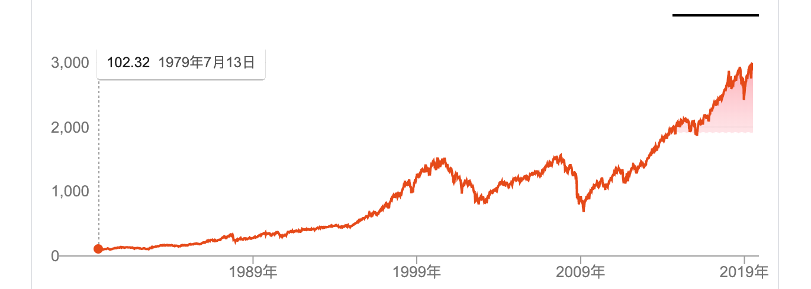

# 定投 —— 大佬的自我修养

*—— 让时间陪你慢慢变富……*

**李笑来**

二〇一九年七月

*普通人错过这本书的“踏空成本”无限大……*

https://b.watch

------

## 4. 究竟有没有只涨不跌的投资标的

当你作为一个普通人，认识到交易市场的神奇之处，发现在那里竟然可以无门槛地让世界上最聪明的人为你的钱打工，让世界上最聪明的人帮助你免费选择最佳投资标的的时候，虽然不必得意忘形，但也绝对没有必要有一丝一毫的自卑。因为，交易市场上的绝大多数所谓投资者都是半吊子 —— 甚至连那些西装革履的投资经理中的绝大部分也都是半吊子……

不信的话，我可以很快地教你一个非常有效的雕虫小技。

在遇到任何在你面前扮演专家的家伙的时候，你都可以轻描淡写地问一句：

> …… 那你如何稀释机会成本呢？

通常情况下，你会发现对方会瞬间眼睛里好像瞳孔发散，嘴巴里开始闪烁其词…… 不信你就经常试试！

当我们采用市场上所有的聪明人集体为我们提供的免费最佳建议之时，我们会面临另外一个尴尬，就是，只买万科、或者只买贵州茅台、苹果、可口可乐甚至中国烟草中的任何一个的话，我们面临一个严峻的问题：

> **只投资单个标的的机会成本无限大！**

这绝对是任何普通人都能理解的概念！

所谓的机会成本，指的就是你的钱若是被用来投资了某个标的，那些钱就不能同时被用来投资另外一个标的…… 如果你用一些钱投资了 A，那么那些钱就不能同时用来投资 B，于是，B 的未来涨幅就会成为你投资 A 的那些钱未来收益的机会成本。

如果你只投资了唯一的标的，那么，你的机会成本其实是无限大的！所以，即便是彻头彻尾的小白，都可以瞬间明白为什么一定要找个什么方法去稀释机会成本！投资么，是个全面思考的技术，不能只考虑可能的收益率，除此之外，当然还要考虑风险…… 而“**如何稀释机会成本**”也是必须考虑的重要因素！

有没有办法呢？肯定有！一个简单的办法就是投资一系列优质标的。当你购买指数基金或者 ETF 的时候，你的投资对象不再是某一个优质企业或者项目，而是一系列优质企业或者项目！

这里有个微妙的重点被很多人忽略了。通过购买一系列优质标的，你一方面有效地稀释了机会成本，另外一方面更重要，你的投资标的的属性和质量变了！**你的投资标的变成了长期来看只涨不跌的标的！**

有这么神奇吗？有！绝对有。

优质企业做到基业长青是非常非常难的。再优秀的企业也有可能走向衰落。你听过的柯达你听说过的诺基亚都是如此。可口可乐、贵州茅台这样的公司极为罕见的同时，即便是他们也保不齐哪天遇到黑天鹅事件而面对灭顶之灾。所以，只投资某个最优秀的企业，一方面机会成本无限高，另外一方面也没有任何有效方法规避黑天鹅事件 —— 放到越远的长期视角来看越是如此。

但是，这世界有没有长期来看只涨不跌的标的？有的！那就是**人类的经济发展**。

这也是为什么长期来看，股票市场的价格指数只有一个趋势，上涨。短期的涨跌，构成一个又一个的微笑曲线（或者猥琐曲线），全部拼接起来，就只有一个趋势，上涨，就算中间肯定有起伏，最终，还是上涨。

以下是标准普尔 500 指数过去 40 年（1979 ～ 2019）间的价格趋势图：

所以，当你投资一系列优质标的的时候，你所 “赌” 的，不再是某个企业而已，你所 “赌” 的标的实际上变成了整个经济发展…… 你买了中国股市上一系列的优质标的，那么你其实是在赌中国的整体经济发展！你买了美国股市上的一系列优质标的，那么你其实是在赌全世界的整体经济发展 —— 因为全世界各地的优秀企业都可能去美国上市！你买了 [BOX](https://b.watch)（里面有区块链世界里的三种优质资产，BTC、EOS、XIN），那么，你所 “赌” 的就不再 是比特币而已，或者某个区块链项目而已，你实际上 “赌” 的是整个区块链行业的发展。

所以，当我设计 [BOX](https://b.watch) 的时候，考虑得最重要的是区块链技术发展路线，我在很多地方都说过的那个区块链技术发展路线：

> 可信账簿 → 可信代码 → 可信执行环境 → 可信设备……

历史上，2011 年我当然不算错过比特币；2016 年我也事实上没有错过以太坊；2017 年，我更是 EOS 这个在 2019 年市值超过 50 亿美金的区块链最热项目的天使投资人。同样，MIXIN Network 也是我重仓的项目 —— 若是一次两次，那可能是好运而已；若是再一再二再三，甚至再三再四的时候，那就不仅仅是好运了，是吧？逻辑是人类面对未来时唯一相对靠谱的可用工具。这个设计中，也没有世俗意义上的私心，因为 [BOX](https://b.watch) 的设计者李笑来是不收管理费的（这可能是世界上第一个不收管理费的区块链 ETF），并且，更为重要的是，李笑来只能通过与所有人一样的条件定投 [BOX](https://b.watch) 去赚钱。

实际上，证券交易市场的真正神奇之处在这里呢！在这里，任何人都可以跟得上整个人类或者整个社会的经济发展。全球化的美妙之处在于，日本的普通人可以在本国经济衰退的时候去买美国的股票跟上美国的经济发展；美国的普通人可以在美国经济滞涨的时候去买中国的股票跟上中国的经济发展；中国的普通人就算是买日本股票不方便买美国股票不方便，甚至买港股也不方便…… 那也可以和全球所有的普通人一样，在全球几乎无所不在的区块链交易市场上跟上金融互联网颠覆性崛起和发展。

这里有个隐秘的重点：

> 没有只涨不跌的标的，只有**长期来看**只涨不跌的标的。

在《韭菜的自我修养》那本书中，我尝试着去纠正绝大多数普通人误会的一个真相：

> * 交易市场在即时交易过程中的确是零和游戏 —— 看起来对手的盈利来自于并恰好等于你的亏损。
> * 交易市场对那些长期投资者来说却绝对不是零和游戏 —— 因为他们的增长主要来自于经济增长，而不是他人短期的亏损。

这也是为什么普通人在交易市场唯一靠谱的投资方式就是定投的最核心原因。反过来看，作为普通人，你只有长期投资、长期持有才是万无一失的。

普通人早期是不可能有很多钱的，但是，通过定投的方式，普通人把自己的场外赚钱能力和长期的定投纪律一并 “赌” 了进来 —— 这可是很大很大的重注！因为你的时间是绝对排他性资产，它只能是机会成本无限大的资产。所以，当你把你最具价值、机会成本无限大的优质资产用作投资之时，你只能选择万无一失的标的，那是什么？就是人类整个经济的发展，除此之外，别无二选。

以当前的时间点来看，区块链市场优于股票市场，股票市场优于房地产市场，房地产市场可能优于债券市场，债券市场可能优于银行储蓄…… 而定投，是普通人因为自己手中一开始不可能有太多钱，所以只好赌上自己的未来的投资策略，所以，在选择投资标的的时候，当然要想尽一切办法选择最优标的。如果在未来的某个时间点，最优标的不再是区块链市场，那么就应该换到另外一个最优质的市场 —— 这根本不是什么人们常常挂在嘴边的信仰决定的，这是实用主义价值观决定的。

这种精妙选择方式带来的结果，会给自以为普通的你带来神奇的感受。你会惊讶于你怎么就那么貌似轻车熟路地观察到并理解了绝大多数人想象不到的事实：

> **天上飘着的云的边界其实与地上城市的边界全无关系！**

当别人还在听天气预报判断今天本地天气的时候，你却已然把目光锁定在天上，想办法提前获知究竟是哪一块或者哪几块云会下雨…… **境界**已然明显不同！哪怕用一下**格局**这个高大上的词汇甚至都感觉并不过分……

最后，还有更为重要的关键需要补充：

> 定投是长期持续投入的行为，所以，投资标的必须满足 “**长期不断看涨**” 的属性。

于是，若是在这个属性上极度严格，那么结论也非常显而易见。债券、黄金、房产 —— 更不用提潮牌运动鞋了 —— 都不是合格的定投标的，因为它们根本没办法满足这个必须满足的属性。从这个角度，你也能马上理解为什么巴菲特对科技股异常小心，却对可口可乐异常放心了……
