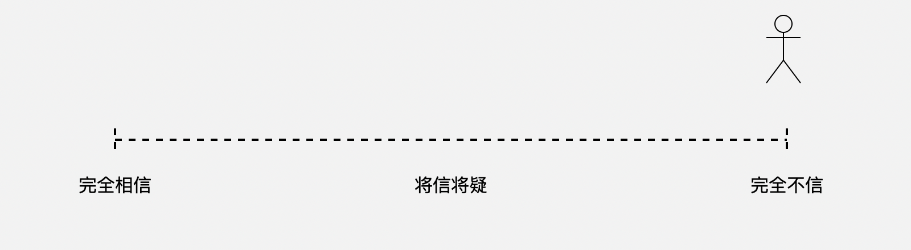

# 定投 —— 大佬的自我修养

*—— 让时间陪你慢慢变富……*

**李笑来**

二〇一九年七月

*普通人错过这本书的“踏空成本”无限大……*

https://b.watch

------

## 9. 定投策略神奇力量背后的深刻机理

让我们从一对看起来是对立的概念说起：

> **主动**与**被动**

一般来说，主动与被动被认为是反义词。“主动” 通常被理解为积极的、正面的，而相对地，“被动” 常常被理解为消极的、负面的。

### 9.7 在主动的边界内你还有多少空间

之前提到，“**凡是对你产生重大影响的，都不是你所能控制的**”。你现在知道了，你之所以无法控制那些对你产生重大影响的因素，是因为他们在你的主动边界之外。

然而，你知道吗？在你的主动边界之内，有很多你原本可以控制的被你直接放弃了…… 并且那程度有多可怕，只不过是你从来没有认真想过，只不过是从来没有人尖锐地向你指出所以你才可以不在意而已。

先看个例子，蝙蝠侠。

这张照片里当然没有漫画英雄蝙蝠侠 —— 我要给你看的是前面领头骑自行车的人，这个被人称为蝙蝠侠的人，大名叫丹尼尔·克什（[Daniel Kish](https://en.wikipedia.org/wiki/Daniel_Kish)）。1966 年出生的丹尼尔，出生不到 13 个月，就被眼癌夺去了双眼。对，这个盲人正在干你完全想不到的事儿 —— 他在骑自行车，没有任何其他辅助设备…… 另外两个人也是盲人，是丹尼尔教出来的！—— 对，这种神技不仅他能练出来，还能教出去！

丹尼尔摸索出来一种方法去“看”。他不断地用嘴发出声音，而后通过声纳像蝙蝠一样感知世界，他把这种方法称为 *Echolocation* …… 也因此人们将他称为“蝙蝠侠”。TED 上有丹尼尔的[一个演讲](https://www.ted.com/talks/daniel_kish_how_i_use_sonar_to_navigate_the_world/transcript?language=zh-cn)，去看看罢，体会一下什么叫“大开眼界”。

这位蝙蝠侠的例子，将被用来进一步讲解一个特别令人惊讶的话题：

> **真正主动的人完全不信命。**

你信命吗？你敢说你一点都不信命吗？在完全信命和完全不信命之间，有个长长的距离，无论你站在哪个刻度上，都不是“完全不信命”。

仅仅一秒钟的自我审视，你就会发现，**完全不信命**，真的好难好难！它好像是个特别需要勇气的事情，不然你为什么会突然发现自己在**犹豫**呢？而且还是**非常**犹豫！甚至，你能感觉到，你内心深处有一股力量在抵触你的选择 —— 虽然你很想选择完全不信，但你就是在迟疑，虽然你不明白为什么，也不知道在迟疑什么，反正那迟疑明摆着就在那里。

别叹气，也别自卑。这不是你一个人的感觉。这基本上是接近 100% 概率的境遇。究竟是 99%？还是 99.99%？反正，反过来看，1% 也好，0.1% 也罢，都是很小很小的数字。很少有人能够完全不信命 —— 极少数那一部分之中，还有绝大部分只不过是无知无畏而已……

并且，这也是事实：

> 随着时间的推移，绝大多数人的站位会从右向左靠拢 —— 也就是越来越信命。

想想看，你在很小的时候，和几乎所有小朋友都一样，是不太信命的罢；不过，那个时候也不知“命”这个东西究竟是啥。而越来越信命的人到最后会彻底信命 —— 当然，他们自我解释之中，那不叫“最后彻底信命”，那叫“**大彻大悟**”。如果你实在没办法在这里选择“完全不信命”，那就算了。如果你虽然有些迟疑，但还是想知道怎么回事儿，那么在读下去之前，请做好准备：

> **一切的真相都没有任何义务照顾你的情绪。**

自己选罢。这肯定需要勇气，并且还是很大很大的勇气。勇气是什么？**勇气是唯一不可伪造的美德。**

再问一个更进一步的问题，请仔细思考后再回答：

> 请问过去影响将来吗？

再深入一步，请问，

> 过去必然影响将来吗？如果不是，那么过去在多大程度上影响将来？是很大程度？还是程度并没有多大？

还没完，我们需要问到底：

> 过去影响未来的程度如果并不是那么大的话，有没有可能干脆切断过去和未来之间的联系？

什么叫信命？其实啊，信命这件事跟宗教全无关系，跟迷信也关系其实并不大，它完全是个逻辑思考漏洞造成 —— 所谓的迷信，不过是思考有漏洞却不知道漏洞在哪里而导致的结果而已。你看，电被发明出来之后，关于妖魔鬼怪的故事就不像那之前那么好编了，不是吗？

信命这事儿，从本质上来看，无非是以为过去必然影响将来而已 —— 如果觉得过去**未必**影响将来，那么就是对信命这事儿将信将疑，想想看是不是这么回事儿？

现在你能明白为什么我会认定 “**真正主动的人完全不信命**” 了嘛？因为真正主动的人会通过简单正确的逻辑思考发现，有些时候我们甚至可以**彻底切断**过去与将来之间的那看似必然的**联系**。

最雄辩的根据来自于大家熟悉的概率学。你听说过赌徒谬误吧？赌徒们不知道概率学理的**独立事件**概念，他们无法理解下一次抛硬币之后的正反概率是独立事件，所以，之前的所有结果都根本不会影响下一次的结果 —— 下一次的抛出的硬币正反面的概率依然是 1/2…… 

绝对不要小瞧这种简单的科学知识，这种东西对我们的生活影响是非常巨大的 —— 只不过，绝大多数人知道、学到，但很少用到…… 至于做到，根本无从谈起。

如果你能理解独立事件的概念，如果你能明白那些陷入赌徒谬误的人有多么可怜，那么你就能自然而然地明白另外一件事情：

> 那些误以为过去必然影响将来的人其实更可怜。赌场上的赌徒，因为不懂独立事件的概念而陷入赌徒谬误，输掉的仅仅是他当时的赌资而已，而那些相信过去必然影响将来的人们，直接输掉的是现在之后的所有未来！

有个好的过去倒也罢了（这种概率对绝大多数人来说非常低），若是过往并不美好（这对所有人来说都是极大概率事件），且同时认为过去必然影响将来的话，那随后的生活跟活死人有什么区别？

**所谓的完全不信命，就是一个人下定决心而后竭尽全力，尽量不让自己过去中不好的部分影响自己的未来。**

人生一切值得挣扎的地方，就在这里了，只有这里。

前面蝙蝠侠丹尼尔就是这样的人。他通过自己的努力，使得“失去双眼”这个过往事件，最大程度上，相对于其他失明者，不影响自己的现在和将来…… 

现实生活中，我还认识另外一个这样的人，是中国人，一位女性 —— 廖智。十多年前，她在汶川地震的时候，逃出生天却失去了女儿失去了双腿 —— 她的职业可是个舞蹈演员啊！几年后，雅安地震，一位记者无意中拍到了一个拼命救人的姑娘，惊讶地发现这位正在奋不顾身救人的姑娘的两条腿都是假肢…… 廖智就是那种罕见的有能力切断过去和将来之间那种看似必然实则不然的联系的人。后来廖智主动结束了自己之前并不幸福的婚姻生活，几年后她遇到了一位来自美国台湾人，是专门做义肢的，你猜廖智见到这个后来与之结婚生活生子的高高大大的男生说的是什么？

> 你能让我长高两厘米吗？那样就完美了 —— 以前我可没有这样的机会！

如果你彻底信命，你就不用做任何投资了，因为你那作为普通人普遍并不美好的过去必然决定你的未来。之前我们看到，通过定投模式，你不仅事实上不让过去影响你的未来，甚至，因为你事实上向前平移了你的入场时间，你就好像是坐着时光机回到过去修正了你的过去而后再次回到未来一样。

这就是为什么我之前、现在、以后都会反复说一个重点：

> **定投策略成功的关键在于心理建设。**

心理建设从哪里开始啊？从绝不信命开始。不要让你的过去之中不美好的部分影响你的未来，掐断它们之间的联系 —— 至于美好的过去，让它继续发挥作用。在这个地方拼命挣扎，这是最具价值的挣扎，一切未来美好的根源。然后开始逐步探索确认主动边界，然后在主动边界之外寻找趋势，体会被动的力量…… 

定投策略看起来无比简单，无非就是**针对某个投资标的在很长的时间内定期投资一定的金额。**

然而，经过深入思考，深入研究，甚至不顾自己感受地探索，我们就会明白，定投策略的神奇之处，它事实上非常精巧，它并不仅仅是让你成了一个有机会的人、有纪律的人、有动力的人，它不仅通过锁定长期持有的方式倒逼你寻找长期只涨不跌的最佳投资标的，它还暗中做了很多很多事情：

> * 它向你提供一个独一无二的可用来深刻体会主动边界之外被动的神奇力量的环境；
> * 它用不可反驳的实际结果向你展示过去与将来之间的联系绝对不是必然的；
> * 它给你一个机会让你认真对待自己在主动边界之内做到极致……

甚至，你可能都想不到，它最终会让你变成个相对极为罕见的干净的人 —— 你只要安静地完成计划就好了，要么失败，要么收获极大的财富。如果成功，那么你收获的是**绝对干净的财富**…… 试问，还有比这个更干净的赚钱方式吗？有了这种方式的你，还有什么意愿和动力去做乱七八糟的事儿吗？
