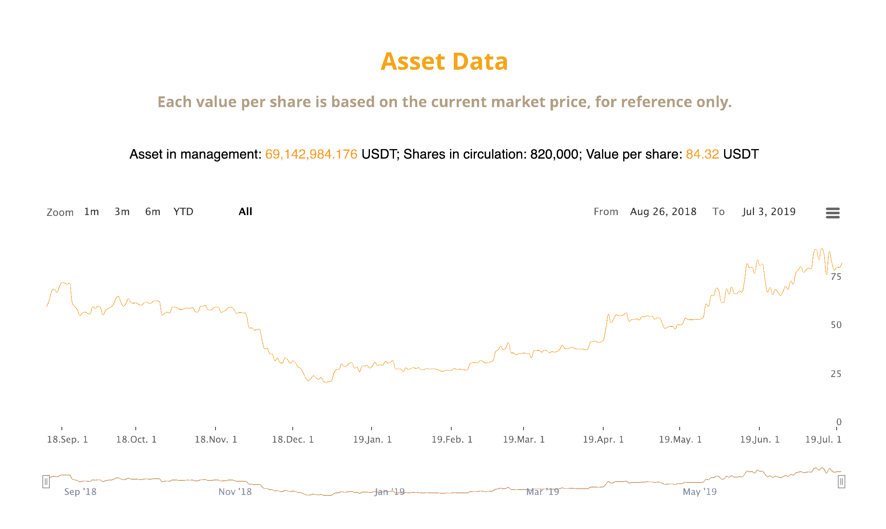
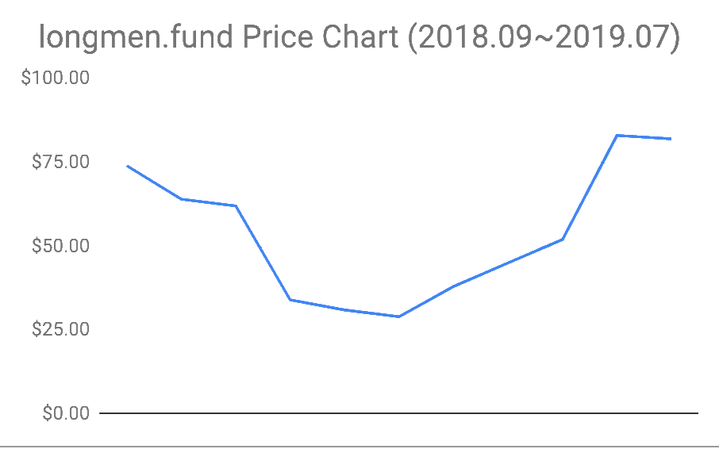
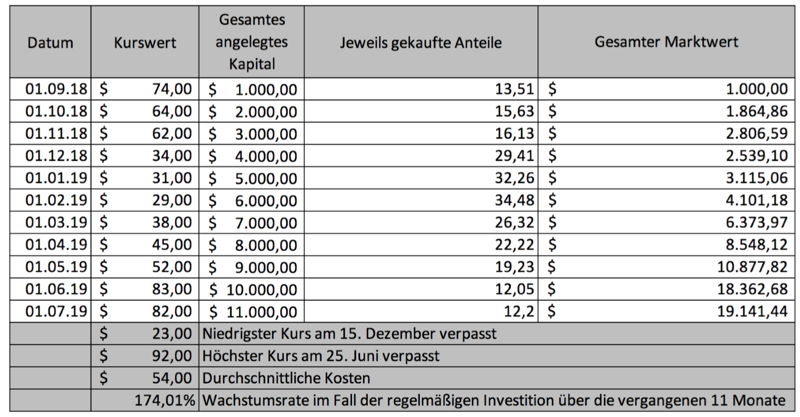
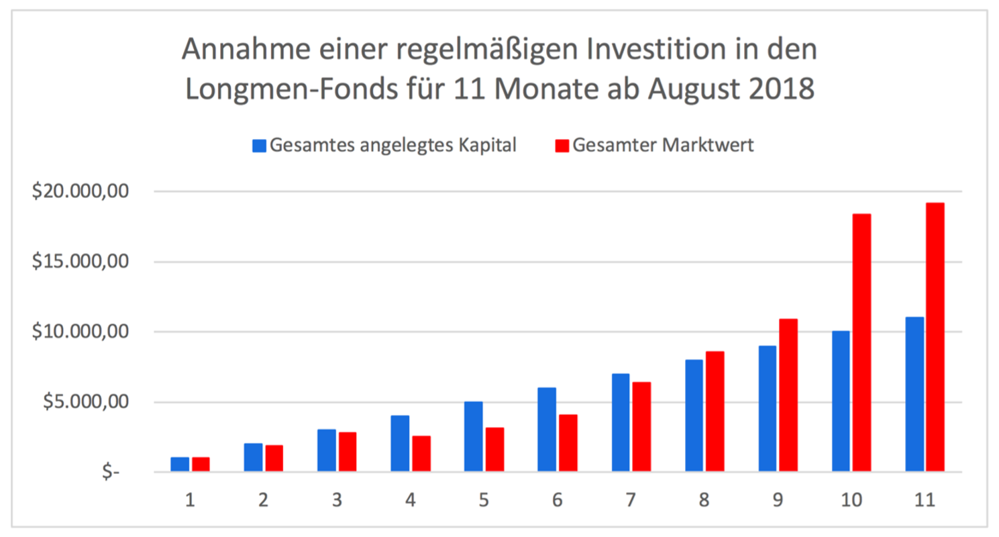
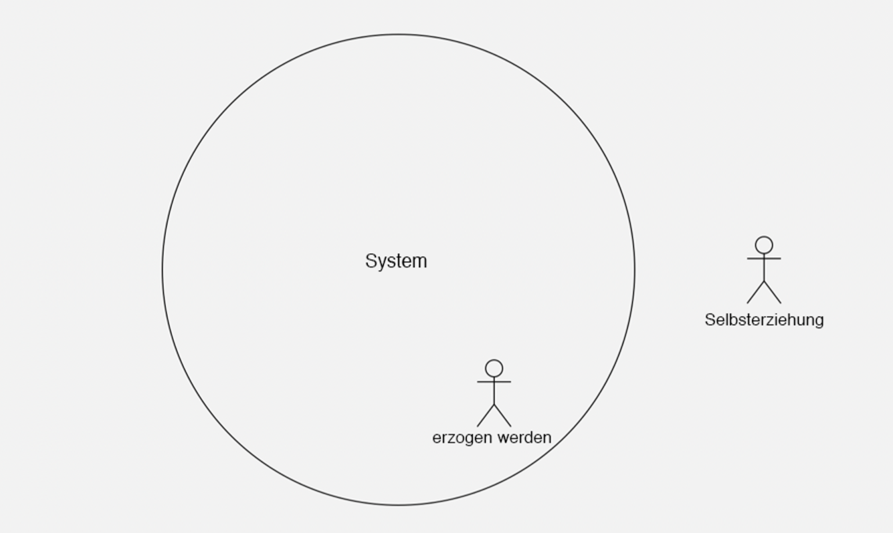
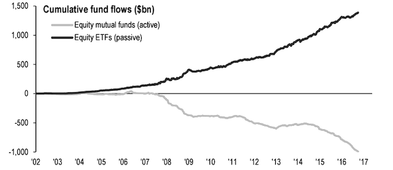
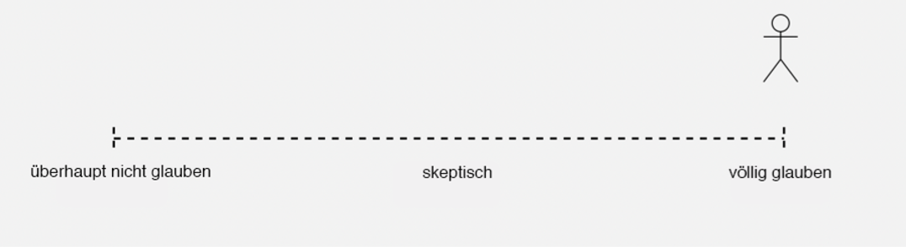
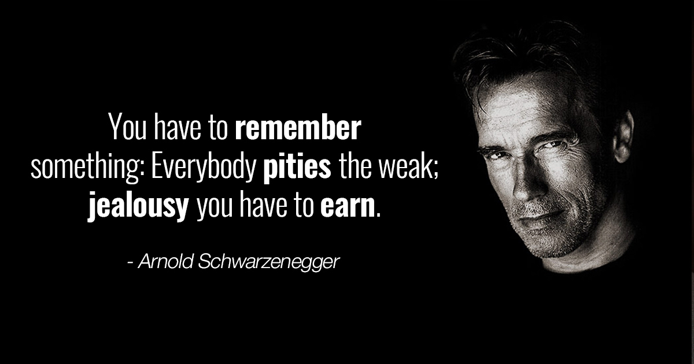

# Regelmäßige Investition — Selbstkultivierung des Erfolgs

*- - Lass die Zeit dich bereichern ......*

Li Xiaolai

Juli 2019

Dieses Buch nicht gelesen haben, wäre für gewöhnliche Menschen ein unendlicher Verlust.

[https://b.watch/]("https://b.watch/")

------

# **Vorwort**

Ich vermute, du als gewöhnlicher Mensch hast bestimmt schon oft einen schrecklichen Begriff gehört:  **die Undurchlässigkeit der sozialen Schichten. "**

Egal, ob die Grenzen zwischen Gesellschaftsschichten wirklich schon verfestigt sind oder sie jetzt erst beginnen, sich zu verfestigen, macht denen schon beim Hören nervös. Ich weiß nicht, welche Gefühle dieser Begriff bei anderen geweckt hat. Bei mir kann ich mich aber noch an diese Besorgnis erinnern, die mich für lange Zeit begleitet hat, nachdem ich zum ersten Mal davon gehört hatte. Ich war nicht verängstigt, sondern eher verzweifelt.

Dieser Begriff ist die Quelle der Angst für viele Menschen weltweit. Du bist gar nicht der Einzige, der sich davor befürchtet und hilflos fühlt. Früher oder später wirst du erfahren, dass Koreaner und Japaner es schon früh akzeptiert haben, dass die Grenzen ihrer Gesellschaftsschichten seit langem verfestigt sind. Du könntest auch von irgendwoher mitbekommen, dass die Amerikaner, die unterschiedliche amerikanische Träume hegen, die Verfestigung der Ungleichheit zwischen gesellschaftlichen Klassen in zunehmendem Maße am eigenen Leib erleben, ganz zu schweigen von den chinesischen sogenannten „Selbst-Medien“ – die sind Blogger und andere Influencer aus den neuen Medien, die die derartig natürlichen, ungeschönten Themen wieder gern anzusprechen und damit bei vielen Menschen Furcht auslösen. Ausnahmslos sind alle Artikel, die sich mit diesem Begriff befassen sind, von Besorgnis und Ratlosigkeit geprägtes Palavern und nicht einer ist nach dem langen Gerede zu einer praktischen Lösung gekommen.

Das vorliegende Buch erzählt von **einem Weg, wie gewöhnliche Menschen die verfestigten Grenzen zwischen gesellschaftlichen Schichten überschreiten können**. Dieser Weg ist ein absolut praktisch und gar nicht übertrieben und ist komplett von dir selbst abhängig. Die Nationalität, die Herkunft, die Ethnie, das Geschlecht, das Alter, das Aussehen und die sexuelle Orientierung spielen gar keine Rolle darin und so auch IQ und Bildungsniveau. Man kann sagen, diese Lösung gilt sogar auch für Essens-Lieferant.

Es klingt unglaublich, dass es so eine Lösung gibt. Noch unglaublicher ist, dass diese Lösung aus nur zwei Wörtern besteht:

> **Regelmäßige Investition**  

**Investition** ist der einzige Weg, den ich finden kann, mit dem ein gewöhnlicher Mensch die Grenzen zwischen den Gesellschaftsschichten überschreiten kann und „**regelmäßige Investition**“ ist die Einzige, zu der alle Menschen einen Zugang haben und damit gut umgehen können.

> Die sogenannte „regelmäßige Investition“ ist eine sich periodisch wiederholende Investition einer bestimmten Summe in ein bestimmtes Investitionsobjekt über einen langen Zeitraum hinweg.

Ein Beispiel dafür wäre, in den nächsten **5 bis 10 Jahre** (einen langen Zeitraum) **wöchentlich** (periodisch) in **[BOX](https://b.watch/), ein Blockchain-ETF-Produkt ohne Verwaltungsgebühr** (Investitionsobjekt)**150 Dollar oder 1000 chinesische Yuan** (eine bestimmte Summe) zu investieren. Natürlich kann [BOX](https://b.watch/) an dieser Stelle durch irgendein anderes beliebiges Objekt, das einer langfristigen Investition und Beteiligung wert ist, z.B. Aktien von Apple, Kweichow Moutai, Coca Cola oder Indexfonds von Standard & Poor’s ersetzt werden.

In jeder Gesellschaft und zu jeder Zeit verbringen die Meisten ihr ganzes Leben in ewigem Klagen. Aber in **unserer heutiger Zeit, in der es einen freien und reifen Sekundärmarkt gibt**, wissen die meisten lebenslang klagenden Leute nicht, dass sie alle (ohne Ausnahme) wegen ihrer Unwissenheit die Chance versäumt haben, alle Klagen loszuwerden.

Ein für alle frei zugänglicher Sekundärmarkt ist ein Wunder der heutigen modernen Welt. Genau wegen dieses Wunders haben alle gewöhnlichen Menschen eine wertvolle Chance - Dieser Punkt wird in diesem Buch ausführlich erklärt werden.

Es ist sehr selten, dass ein Buch sich so beschreiben lässt:

> Dieses Buch nicht gelesen haben, wäre für gewöhnliche Menschen ein **unendlicher Verlust**.

Ich übertreibe nicht. Ich werde begründen, warum ich meine Produkte so anpreise.

Lies bitte weiter!

Lies dieses Buch bitte nicht nur einmal, **sondern immer wieder**, bis du dich entscheidest, mit der regelmäßigen Investition anzufangen, bis du mit jemandem, der deine regelmäßige Investition behindern möchte, wie um dein Leben kämpfen würdest. Ich bin sicher, du wirst das tun, wenn du dieses Buch wirklich verstanden hast.

------

## 1. Die Investition ist die einzige verlässige Methode für gewöhnlichen Menschen, die Klassengrenzen zu überschreiten 

Eigentlich existiert die Verfestigung der Gesellschaftsschichten zu jeder Zeit und in jedem Land, nur in unterschiedlichem Maße. Man braucht gar nicht darauf stark zu reagieren.

Ist Fleißarbeit eine realistische Methode, um die Verfestigung der Gesellschaftsschichten loszuwerden? Die Antwort zu dieser Frage ist zum Verzweifeln: Nein.

Das ist wirklich kein realistischer Weg, die Grenzen zwischen sozialen Klassen aufzulösen. Ich bin nicht der Einzige, der dieser Ansicht ist. Einer der einflussreichsten Ökonomen des 20. Jahrhunderts, [Frank H. Knight](https://en.wikipedia.org/wiki/Frank_Knight), hat eine berühmte These:

> „Es gibt drei entscheidende Faktoren für den Reichtum eines Menschen: **Herkunft**, **Schicksal** und **Fleiß**;
>
> --unter diesen drei ist **Fleiß am unbedeutendsten**.“

Das heißt natürlich nicht, dass Fleiß unwichtig sei. Bei relativem Erfolg kann man auf Fleiß setzen, aber bei riesigem Erfolg kann man nur auf das Schicksal setzen. Alle wissen, das Schicksal ist durch gewöhnliche Menschen nicht zu verändern; noch weniger haben gewöhnliche Menschen die Chance, ihre Herkunft zu ändern.

Die folgende Statistik hilft uns zu verstehen, warum Fleiß so unbedeutend ist. Nehmen wir an, dass die Lebenserwartung einer Person 78 Jahre ist, dann ist

> - die gesamte Schlafzeit etwa 28,3 Jahre;
> - die gesamte Arbeitszeit etwa 10,5 Jahre;
> - die Zeit für verschiedene soziale Medien etwa 9 Jahre;
> - die Zeit für Hausarbeit etwa 6 Jahre;
> - die Zeit für das Essen und Trinken etwa 4 Jahre;
> - die Zeit für die Ausbildung mit nur 3,5 Jahren wirklich kurz;
> - die Zeit für das Schminken und das Kleiden etwa 3 Jahre;
> - die Zeit für das Einkaufen etwa 2,5 Jahre;
> - die Zeit, sich um die Kinder zu kümmern, etwa 1,5 Jahre;
> - die Zeit unterwegs etwa 1,3 Jahre;
>
> ......

Nach dieser Rechnung bleiben die Zeit für weitere Aktivitäten nur 9 Jahre übrig... Nur **9** Jahre!

Was ist Fleißarbeit? Wenn die Arbeitszeit der Anderen täglich 8 Stunden ist, du aber für 10 Stunden arbeitest, dann bist du wirklich fleißiger als die Anderen; aber tatsächlich hast du für nur 2 Stunden mehr gearbeitet. Das heißt, nur in diesen 2 Stunden bist du wirklich fleißig und in den übrigen 8 Stunden bist du nicht anders als die Anderen...

Was ist echter Fleiß? Echter Fleiß ist , dass du die übrigen 9 Jahre, die dir zur Verfügung stehen, alle für deine Arbeit verwendest. Aber selbst, wenn du diese 9 Jahre nur arbeitest, sind es immer noch nur 9 Jahre. In der obigen Statistik ist die Zeit, in der du eventuell krank bist oder schlechte Laune hast genauso wenig enthalten, wie die für jede Art von Zufällen. 

Das ist die wesentliche Ursache, warum man durch harte Arbeit, Schweiß und Fleiß in der Praxis die Grenzen der Gesellschaftsschichten nicht überschreiten kann — egal in welchem Land oder zu welcher Zeit.

Warum kann das durch Investition erreicht werden? **Weil es das Wesen der Investition ist, dein Geld pausenlos für dich arbeiten zu lassen. Unter der Voraussetzung, dass du es richtig investierst,  arbeitet es für dich rund um die Uhr und über das ganze Jahr hinweg**. Wie kann dein Fleiß mit dem Mechanismus des Geldes, Geld zu verdienen vergleichbar sein? Unser Neid auf Warren Buffett basiert auf der folgenden Tatsache:

> Warren Buffett ist 1930 geboren. Mit 11 Jahren hat er die erste Aktie seines Lebens gekauft. Bis 2019 sind schon 78 Jahre vergangen! 
>
> 78 Jahre! — Mit einer Lebenserwartung von 78 Jahren haben die anderen nur 9 Jahre zur echten Fleißarbeit übrig. Aber Buffett? Sein Geld hat schon 78 Jahre jeden Tag unermüdlich hart für ihn gearbeitet...
>
> In andren Worten, ein gewöhnlicher Mensch, der nicht investiert, kann ihn auch mit der achtfachen Lebenszeit nicht übertreffen! Denn 78 durch 9 ist 8.6667...
>
> Im übrigen ist Warren Buffett noch gesund und wird weiterhin leben. Wichtiger ist, er hat mit seiner Investitionstätigkeit ein börsennotiertes Unternehmen (Berkshire Hathaway) gegründet. Und dessen Geld wird auch, wenn sein Gründer nicht mehr ist, unermüdlich weiter arbeiten...
>
> Als ich jung war, habe ich wie viele andere Junge hart gearbeitet.

Als ich nach dem Abschluss meines Studiums als Verkäufer gearbeitet habe, musste ich sechs Nächte in einer Woche im Zug übernachten. Morgens stieg ich aus dem Zug aus und suchte einen Ort, wo ich mich duschen und umziehen konnte. Danach widmete ich den ganzen Tag meiner Arbeit als Ausbilder. Am Abend stieg ich wieder in einen Zug ein und am nächsten Morgen wachte ich in einer anderen Stadt auf und arbeitete dort weiter.

Wer mich schon länger kennt, weiß, dass ich keinen Urlaub nehme. Warum?
Als ich 1995 vor dem Abschluss der Hochschule stand, habe ich mich eines Tages plötzlich gewundert, dass es so viele gesetzlich arbeitsfreie Tage gibt. **Von den 365 Tagen des Jahres sind 115 gesetzlich arbeitsfreie Tage!** Theoretisch wird ein Drittel des Jahres nicht gearbeitet! Ich hatte das Gefühl, dass etwas nicht stimmte. Dann habe ich das Wort „gesetzlich“ bemerkt und alles auf einmal verstanden: Gesetzlich arbeitsfreie Tage sind Bestimmungen, um Arbeitsgeber einzuschränken. Den Arbeitnehmern an diesen Tagen nicht freizugeben ist gesetzeswidrig. Das heißt, gesetzlich arbeitsfreie Tage sind keine Beschränkungen für einzelne Person. In keinem Gesetz wird vorgeschrieben: „Wenn du dir an diesem Tag keine Freizeit nimmst, hast du das Gesetz gebrochen!“ Danach habe ich mich entschieden, dass gesetzlich arbeitsfreie Tage mit mir nichts zu tun haben. In den vergangenen 24 Jahren von 1995 bis 2019 habe ich mir kein Wochenende, kein Neujahrsfest und kein Frühlingsfest freigenommen, sondern habe wie normal gearbeitet. Viele Bücher, die ich veröffentlicht habe, sind während des Frühlingsfests fertig geworden. Bin ich nicht fleißig?

Vor ungefähr zehn Jahren habe ich plötzlich bemerkt, dass es sehr zeitaufwendig ist, sich um Frisuren zu kümmern. Jeden Monat muss ich eine oder zwei Stunden beim Friseur verbringen und häufig muss ich noch länger warten. Deswegen habe ich mich entschieden, mir die Haare selbst zu schneiden. Ein elektrischer Haarschneider von Philips kostet nur ungefähr 300 RMB und ist lange brauchbar. So trage ich über die folgenden mehr als zehn Jahren immer die gleiche Frisur — den 3 mm lange Bürstenhaarschnitt. Das geht wirklich einfach.  Vorm Duschen bediene ich das Gerät einmal vorm Spiegel, nach ungefähr 5 Minuten ist es fertig. Denkst du nicht, dass ich so viel Zeit gespart habe?

Aber die Bilanz ist extrem enttäuschend. Wie viel Zeit habe ich wirklich dadurch erspart, dass ich mir  24 Jahre keinen Urlaub genommen habe? Lassen Sie uns das mal berechnen: Obwohl ich an den gesetzlich arbeitsfreien Tagen stets gearbeitet habe, ist es schwer, eine effektive Arbeitszeit von durchschnittlich mehr als vier Stunden pro Tag zu erreichen. Wenn du wirklich selbstständig gearbeitet hast und nicht faulenzt, weißt du bestimmt, wie wenig die effektive Arbeitszeit an einem Tag ist. Wie viel effektive Arbeitszeit habe ich so insgesamt während der 24 Jahre zusätzlich erhalten?

> 24 × 115 × 4 = 11.040

Mehr als zehntausend Stunden. Wie viele Jahre sind das?

> 11.040 ÷ (365 × 24) = 1,26
>
> Guck mal, wie sieht das Ergebnis aus, indem ich zu mir selbst so hart war, habe ich letztendlich nur 14% mehr gearbeitet als die anderen fleißigen Menschen. Vor 10 Jahren habe ich mich entschieden, meine Haare selbst zu schneiden. Wie viel Zeit habe ich dadurch gespart? Einmal im Monat ca.1,5 Stunden, 18 Stunden pro Jahr, 180 Stunden in zehn Jahren. Wie Sie sehen können, bin ich wirklich streng zu mir selbst, dass ich meine Zeit so genau planen, oder? Aber wie viel effektive Zeit kann ich dadurch ersparen? Oder wie länger als die anderen habe ich gearbeitet? Nur 7,5 Tage. Mit so großer Mühe habe ich doch nur 2.28‰ mehr als die Anderen gearbeitet!

Jetzt kannst du wohl verstehen, **dass es unmöglich ist, ohne Investition die Grenzen zwischen sozialen Schichten aufzulösen.**

Allerdings hast du bestimmt die Warnung gehört:

> Investitionen unterliegen Marktrisiken, seien Sie vorsichtig bei der Entscheidung!
> (Oder: Die Börse unterliegt Marktrisiken, seien Sie vorsichtig bei der Investition!)

Aber stimmt das wirklich? Ob es so ist oder nicht, musst du selbst herausfinden. Bevor du es selbst für eine lange Zeit treibst, kannst du das nicht verstehen.

## 2. Der Sekundärmarkt ist das neunte Wunder der Welt

Es gibt viele Investitionsobjekte: Gold, Antiquitäten, Kunstwerke, Immobilien, Start-up-Unternehmen, Aktien von börsennotierten Unternehmen und noch viel mehr. Du weißt es vielleicht nicht, dass in der heutigen Zeit, in der die Finanzindustrie so hochentwickelt ist, sogar die Schuhmarken ein Investitionsobjekt sein können.

Aber wenn wir hier in diesem Buch über das **Objekt der Investition**, insbesondere das der **regelmäßigen Investition** reden, beziehen wir uns auf:

> Die Aktien von börsennotierten Firmen, die an der Börse handelbar sind, oder die allen digitalen Vermögen von Blockchain, die sich in den nächsten entwickelnden Börsenmärkten kaufen und handeln können.

Meiner Meinung nach ist der traditionelle **Sekundärmarkt** das **neunte Weltwunder** — neben den allgemein bekannten sieben Weltwundern galt Einstein die **Zinseszinsen** als das **achte Weltwunder**.

Der Sekundärmarkt hat den gewöhnlichen Menschen eine beispiellose Chance geboten. Wozu? **um die Grenzen zwischen sozialen Schichten zu überschreiten.**

Wieso? Täglich faszinieren uns alle möglichen fasizinierenden Geschichten über Gründung eines Unternehmens, weil ihre Hauptrollen aus ganz unten Schichten kommen und haben es aber geschafft, an die Spitze der Gesellschaft vorzudringen. Sie sind Gründer oder Anführer von sogenannten Einhörnern (Start-ups mit einer Marktkapitalisierung von mindestens 1 Milliarde US-Dollar) oder Vorstandsvorsitzende einer börsennotierten Firma geworden. Sie werden nicht mehr von den Grenzen zwischen Klassen eingeschränkt. Aber das Problem ist, dass dieser Weg nicht für gewöhnliche Menschen geeignet ist. Die von ihnen geschöpft große Wert erweist auch, dass sie eigentlich kein gewöhnliche, sondern herausragende Menschen sind, egal aus welcher Schicht sie stammen, oder ob in ihrer Jugend arm waren. Ihre Errungenschaften haben nur erwiesen, dass sie eben schon Qualität fürzum einen erfolgreichen Mensch besitzen. Die folgende Diskussion wird dir noch eine demotivierende Tatsache zeigen:

> Auch so hervorragende und fleißige Menschen sind auf das Schicksal angewiesen, um Erfolg zu erzielen — sie müssen das Glück haben, um den Trend zu entsprechen.

Auch die Arbeit in einer börsennotierten Firma ist glücksabhängig. Dass man bei einem Unternehmen seit dem Anfang an arbeitet, der in der Zukunft eine börsennotierte Firma sein wird, ist reine Glückssache. Aber nachdem du solche Beispiele genügend gesehen hast, wirst du erkennen, dass die Wahrscheinlichkeit sehr gering ist, dass ein Mensch mit seinen Ideen, Fähigkeiten und Beziehungen seiner Arbeit noch gewachsen ist und immer noch in einer wichtigen Position bleiben kann, als die Firma an der Börse notiert wird. Wenn eine Firma vor der Börsennotierung steht, ist es auch für die Kandidaten schwer, rekrutiert zu werden — das Alter muss geeignet sein, das Bildungsniveau ausreichend, und die Kompetenz muss dem Bedarf der Firma genau entsprechen. Wenn du die Angestellten von börsennotierten Firmen fragst, wirst du feststellen, dass nur sehr Wenige davon Aktien ihrer Firma halten, obwohl sie hart für diese arbeiten. Keine Aktien der Firma zu besitzen bedeutet für sie, dass sie, egal wie hart sie arbeiten, nicht vom Wachstum der Firma profitieren.

Aber durch die Börse können jetzt Alle — **ungeachtet ihrer Nationalität, Herkunft, Ethnie, ihres Geschlechts, Alters, Aussehens und ihrer sexuellen Orientierung**— jederzeit die Aktien der hervorragendsten Unternehmen der Welt kaufen und ihr Geld jeden Tag, rund um die Uhr mit diesen hervorragendsten Unternehmen zusammen wachsen lassen. Das ist „fleißige Arbeit“ mit echter Qualität! Verblüffender noch, die Investoren brauchen normalerweise nichts weiter zu tun als zu investieren! Am verwunderlichsten ist, dass es fast keine Schwelle gibt, die Aktien der hervorragendsten Unternehmen der Welt zu kaufen!

Das Vermögen der gewöhnlichen Menschen hat kaum eine Möglichkeit. sich effektiv zuzunehmen, weil es für sie schwer ist, wirklich kommerziell Wertvolles zu schaffen. Nur eine sehr kleine Minderheit der Bevölkerung bemüht sich, kommerzielle Werte zu schaffen, um ihr Schicksal selbst zu verändern und erreicht letztendlich ihr Ziel. Unter den börsennotierten Unternehmen gibt es natürlich auch solche, die weniger gut sind, aber sie sind doch mit einem strengen Standard ausgewählt worden. Bei diesen Firmen arbeiten die Menschen, die das größte Talent zur kommerziellen Wertschöpfung haben.

Sobald ein gewöhnlicher Mensch mit seinem Geld Aktien von einem hervorragenden Unternehmen kauft, wird er auf einmal ein Chef. Und die kommerziellen Talente, die hohe Wert schaffen können, fangen an, für ihn als einen gewöhnlichen Menschen zu arbeiten — auch wenn diese gewöhnlichen Menschen eigentlich nicht in der Lage wären, deren Chef zu sein.

Viele glauben, dass es sehr schwierig ist, Aktien auszuwählen. In Wahrheit ist es aber **überhaupt nicht schwer!** Diese Schwierigkeit entsteht nur aus dem Gewohnheitsdenken der Menschen und ist tatsächlich das Ergebnis davon, dass sie nicht willens oder nicht genug mutig sind, die einfachste, direkteste und effektivste Methode zu wählen. Es ist eine unvorstellbar einfache Methode:

> Einfach die Aktien auszuwählen, die von allen am höchsten geschätzt werden.

Achte auf den Superlativ „am höchsten“. An der Börse Shenzhen kannst du einfach die Aktien von Vanke kaufen, an der Shanghai Stock Exchange Kweichow Moutai, an der Nasdaq Apple, an der HKEX Tencent, an der Blockchain-Börse Bitcoin.

Das ist das wundersame Wesen der Börse — **hier kannst du dir die Intelligenz der Anderen zu eigen machen.**

Jetzt hast du verstanden, dass die gewöhnlichen Menschen mit wenig Geld die ausgezeichnetesten Menschen von den ausgezeichnetesten Firmen für sie arbeiten lassen können! Weißt du, was noch unglaublicher ist? Noch unglaublicher ist, dass du die klügsten Menschen auf dem ganzen Markt die Auswahl für dich treffen lassen kannst. Du kennst dich nicht aus und denkst, du bist nicht intelligent genug, das zu machen? Du musst viel Zeit aufwenden, um die Grundkenntnisse zu lernen? Dann hast du zu viel nachgedacht, denn all diese Dinge unwichtig sind. Bewunderst du nicht die Intelligenz von Buffett? Dann kauf einfach die Aktien von den Firmen, die er jetzt besitzt. Dadurch lässt du Buffett kostenlos für dich denken. Aber Buffett ist wahrscheinlich auch nicht der Klügste. Was sollst du tun? Du kannst einfach das Objekt auswählen, das die Mehrheit für gewinnbringend hält. Das sind, wie oben genannt, Vanke, Moutai, Apple, Tencent, Bitcoin usw. Das sind die Aktien, die die klügsten Menschen auf dem Markt für dich ausgewählt haben, und die Vorschläge dieser klügsten Menschen sind sogar komplett kostenlos!

Du brauchst ihr kostenloses Urteil nicht zu bezweifeln. Wenn diese am höchsten geschätzten Aktien am Ende scheitern, dann hast du auch nichts zu beklagen, denn sie sind schon die bestmöglichen Vorschläge! Aus demselben Grund sollst du auch einfach die Aktien von China Tobacco International (CTIE) kaufen, wenn sie 2019 an der HKEX notiert wird. Denn das ist die Firma mit der stärksten Cash-Generierungskapazität in ganz China!

Weißt du, was am unglaublichsten ist? Über 99% der Leute verwenden diese einfachste und auch effektivste Methode nicht! Schau dir mal die folgende Statistik an: Laut Statistik von 31. März 2019 hatte Kweichow Moutai (600519) 80.594 Aktionäre und die Gesamtanzahl der Aktiendepots in China war 150 Mio. Der Anteil war nur fünf in zehntausend. Darunter ist noch ein großer Teil von institutionellen Investoren. Das heißt, nur weniger als ein Zehntausendstel der gewöhnlichen Menschen traut sich, diese einfache aber auch extrem effektive Methode zu verwenden.

Weißt du, was passieren wird, wenn du dir das auf dem Markt am höchsten geschätzte Objekt auswählst? Du brauchst dann nichts zu analysieren oder den Index zu beobachten, und du brauchst sogar nicht mit den anderen zu diskutieren. Eigentlich brauchst du gar nichts zu tun, denn alles haben schon die klügsten Menschen für dich gemacht, und zwar unentgeltlich! Das ist absolut das höchste Niveau für einen Investor auf dem modernen Markt, mit minimalem Aufwand in die besten Objekte zu investieren. Man sagt, das Leben der Aktionäre von Moutai ist auch sehr einfach: lesen, Sport treiben, Reisen und bei der Familie bleiben... Das ist wahr.

Sollte die Börse deshalb nicht das neunte Weltwunder genannt werden? Egal, das wievielte sie ist, sie ist ein Wunder.

Wenn die traditionelle Börse das neunte Weltwunder ist, **dann muss man die Blockchain-Börse als das zehnte Weltwunder bezeichnen.** Die Blockchain-Börse ist eine total neue Version der traditionellen Börse. Allein an einem Punkt kannst du schon die Veränderung ersehen:

> - Es gibt auf der ganzen Welt schon zehntausende Blockchain-Börsen zum Handel des digitalen Vermögens;
> - Sie sind zu einem Handelsreich geworden, wo die Sonne nie untergeht. Sie machen 24/7 keine Pause das ganze Jahr über;
> - Die künftigen Käufer und Verkäufer kommen aus der ganzen Welt

Apple ist jetzt eine Firma mit einem Marktwert von mehr als einer Billion Dollar. In den vergangenen 52 Wochen war ihr durchschnittliches tägliches Handelsvolumen 28.834.582 Dollar. Rechnet man mit dem Kurs vom Juli 2019, nämlich ungefähr 200 USD, ist der Betrag ihres täglichen Handelsvolumens 5,77 Milliarden USD.

Der Marktwert von Bitcoin im Umlauf am 10. Juli 2019 war 224,7 Milliarden USD, nicht einmal ein Viertel von Apple. Aber ihr tägliches Handelsvolumen war 29,47 Milliarden USD, mehr als das Fünffache von Apple... EOS hat nur einen Marktwert von mehr als 5 Milliarden USD, nur 1/200 von Apple. Aber wie hoch ist das tägliche Handelsvolumen? 2,3 Milliarden USD, knapp die Hälfte von Apple. Ist das nicht erstaunlich? In der absehbaren Zukunft wird diese Differenz nur noch größer werden.

Deshalb lässt sich erklären, wenn Aktien als Investitionsgegenstand empfehlenswerter als Anleihen sind, dann ist digitales Vermögen noch empfehlenswerter als Aktien.

## 3. Die einzige Investitionsmethode für gewöhnliche Menschen ist die regelmäßige Investition

Zuerst die Schlussfolgerung:

> Auf der zauberhaften Börse gibt es **nur eine zuverlässige richtige Investitionsmethode für gewöhnliche Menschen — die regelmäßige Investition.** Das sollst du dir immer merken!

Da [BOX](https://b.watch/), der erste Blockchain-ETF, erst vor kurzem gegründet wurde (Anmerkung: am 3. Juli 2019,dem Black Friday der Bitcoins), reicht seine Statistik noch nicht, um als Beispiel die regelmäßige Investition  als die einzige zuverlässige Investitionsmethode für gewöhnliche Menschen zu erläutern.

Der Vorgänger des Longmen-Fonds (https://longmen.fund) - der Bitfonds - wurde 2013 von mir gegründet und 2018 liquidiert. Ein Teil der Investoren hat entschieden, ihn nach fünf Jahren weiter zu führen und deshalb das ETF-Produkt, den Longmen-Fonds, gegründet. Der Longmen-Fonds ist für die Öffentlichkeit noch nicht zugänglich und können zurzeit nur eine kleine Anzahl von qualifizierten und eingeladenen Menschen die Möglichkeit haben, dieses Produkt zu kaufen. Allerdings hat er eine langfristig offengelegte Statistik und kann hier deshalb als ein Beispiel für den Gegenstand der regelmäßigen Investition dienen.

Hier ist ein Screenshot von der Homepage des Longmen-Fonds Anfang Juli 2019:

Um diese Statistik als ein Beispiel für die regelmäßigen Investition zu verwenden, beobachten wir nur die monatlichen Daten:

Nehmen wir an, du hättest seit September 2018 für 11 Monate regelmäßig jedes Monat 1.000 USD in den Longmen-Fonds investiert, dann wären die Daten ungefähr wie folgt:

Das heißt, in Falle einer regelmäßigen Investition würdest du sowohl den Punkt des höchsten Kurswertes, $ 92 am 25. Juni 2019, als auch den niedrigsten Punkt, $ 23 am 15. Dezember 2018, verpassen. Dennoch wäre dein durchschnittlicher Kaufkurs $ 54 und der aktuelle Kurs wäre ungefähr $ 85. Nach den 11 Monaten hättest du insgesamt $ 11.000 angelegt und du hättest jetzt $ 19.141,44 auf deinem Konto. Der Kurs bei deiner letzten regelmäßigen Anlage wäre $ 82 — das wäre sogar $ 1 niedriger als im letzten Monat. Damit hättest du schon eine Renditenrate von 74,01% erreicht!

Aus der folgenden Grafik kannst du das Verhältnis zwischen deinem Kapital und den derzeitigen Renditen deutlicher ersehen:

Die Statistik des Longmen-Fonds über die 11 Monate ergibt eine faszinierende „Lächel-Kurve“.

Auf dem Handelsmarkt verwendet nur eine Minderheit die Strategie der regelmäßigen Investition, und die „**Lächel-Kurve**“ wird für die, die diese Strategie nicht verwendet, wohl zu entgegengesetzten „**Kurve des bösen Lächelns**“. Dies ist absolut kein freundliches Lächeln, sondern ein böswilliges Lächeln wie beim Joker von „Batman“ — der beim Lächeln auch noch mit seiner schauerlichen Stimme murmelt: „Why so serious? – Warum denn so ernst?“

Schauen wir uns noch mal die Statistik an. Nehmen wir an, wenn du wie die Meisten dein sämtliches Kapital auf einmal anlegen und im September 2018 $ 11.000 investieren würdest, hättest du nach 11 Monaten auch nichts verloren, sondern du hättest eine Rendite von ungefähr **10,81%** erzielt! Das ist zwar viel niedriger als **74,01%**, aber zumindest hättest du keinen Verlust gemacht!

Aber wenn du als Investor, mit einmal mal das ganze Kapital investiert, hättest, wäre es nur unwahrscheinlich, dass du die ganzen 11 Monate durchhalten könntest. Wieso? Denn für diese Investoren ist diese Kurve absolut eine Kurve des bösen Lächelns.

Du würdest nicht nur jeden Monat, sondern jeden Tag und sogar jede Minute von Sorge gequält werden. Innerhalb des ganzen halben Jahres würdest du ein starkes Gefühl haben, dass sich dein Vermögen jede Sekunde verminderte.

Freud und Leid sind nicht von gleichen Maße. Es liegt in unseren Genen den Verlust von 10 Euro als viel schlimmer zu empfinden, als die Freude 10  Euro zu gewinnen. Es fühlt sich an, wie wenn der böse Clown dich quälen, dir die Zunge herausstrecken und spöttisch murmeln würde: Warum denn so ernst?

Wenn du die Methode der regelmäßigen Investition verfolgen würdest, dann befändest du in einer ganz anderen Welt. Diese Welt sieht total gleich aus wie die andere, aber die Meisten können dein Gefühl gar nicht verstehen, weil dein Gefühl das genaue Gegenteil jener anderen Welt ist.

**Die regelmäßige Investition ist eine langfristige Unterstützung.** Da du deine Zukunft mit der Investition verbindest, wirst du dir bei der Auswahl reiflich überlegen. Jede Kurssenkung nach deiner ersten Anlage ist dir eine Chance, deinen durchschnittlichen Kaufkurs zu senken. Während die einmaligen Anleger den kalten Winter erleben, bist du guter Laune und fühlst du dich wegen des niedrigeren Kurses glücklich.

Die einmaligen Anleger können den Schmerz nicht lange ertragen — eigentlich kann kein Mensch Schmerzen lange ertragen. Das hat mit der sogenannten „Willenskraft“ nichts zu tun. Aus einer anderen Perspektive gesehen ist es auch nicht Dummheit, sondern nur Unwissen. Nachdem man für einen, zwei oder drei Monate ausgehalten hat, scheint es, dass man es durchstehen könnte. Aber im sechsten Monat (oder noch früher), werden viele aus unterschiedlichen Gründen aussteigen — das bezeichnet man auf dem Aktienmarkt als „sich ins eigene Fleisch schneiden“... Guck mal, die verlierenden unwissenden Investoren schneiden sich ins eigene, blutende Fleisch.

Und du? Wenn du ein regelmäßiger Investor wärst, dann hättest du gar nichts durchzuhalten, sondern alles würde laufen, wie es eigentlich wolltet. Wenn jemand dich bei einer Kurssenkung verhinderte, weiter zu kaufen, würdest du mit ihm kämpfen möchten — denn laut eines chinesischen Sprichwortes ist das Hindern am Weg zum Reichtum so schlimm wie der Mord an den eigenen Eltern. Wärst du besorgt? Zittertest du vor Kälte? Nein! Du würdest bei jeder regelmäßigen Anlage sehr aufgeregt sein, denn jede Kurssenkung wäre wie eine „**Vorverlegung deines Einstiegs**“. Du würdest nicht wie die unwissenden Investoren bereuen, „Ach je, hätte ich es doch früher gewusst!“ oder „Warum habe ich es erst so spät gewusst!“ Sie denken nur, dass sie zu spät eingestiegen seien. Aber du wärst anders als sie, weil du wüsstest, deine Handlung verlegt deine relative Einstiegszeit dauerhaft nach vorne.

Nach sechs Monaten fängt der Kurs langsam an, wieder anzusteigen... Denkst du, die Leute, die sich ins eigene Fleisch geschnitten haben, würden jetzt noch einmal alles Kapital anlegen? Nein! Sie haben Angst— das furchtbare Erlebnis von zuvor macht sie besonders ängstlich. Was mit der Sicherheit passieren würde, ist, dass sie in ihrem Zögern zuguckten, wie der Kurs steigt. Bei der Kurssenkung sind sie aus Angst ausgestiegen und jetzt haben sie noch größere Angst. Ihre Angst steigert sich bis sie zusammengebrochen sind. Erst wenn der Kurs ziemlich hoch ist und die nächste Kurve des bösen Lächels anfängt, steigen sie wieder ein.

Diese Wiederholung ist für sie furchtbar. Denn egal was sie tun, sie fühlen nur eine böse Welt, die gegen sie agiert. Aufgrund der obigen Erklärung ist es jetzt einfach zu verstehen — denn für sie bestehen die Kurskurven aller Investitionsgegenstände aus unzähligen Kurven des bösen Lächels. Findest du ein derartiges Schicksal nicht furchtbar?

Ist es nicht seltsam, dass die Leute auf derselben Welt total gegensätzliche Gefühle haben? Wenn du die Strategie der regelmäßigen Investition verfolgst, dann ist deine Welt ganz anders. Denn in deinen Augen, bestehen die Kurskurven aus unzähligen Lächel-Kurven! Glück kommt auf dieser Welt sehr selten vor. Ist dieses unsagbare Glück nicht umso seltener und wertvoller?

## 4. Gibt es überhaupt Investitionsgegenstände, deren Kurs nur steigt und nie fällt? 

Wenn du als gewöhnlicher Mensch die Magie des Wertpapiermarktes erkannt und entdeckt hast, dann könntest du ohne jegliche Einschränkung die klügsten Leute für dein Geld arbeiten und unentgeltlich für dich die besten Investitionsgegenstände auswählen lassen. Dann musst du zwar nicht zu stolz sein, aber du brauchst dich den anderen auch gar nicht unterlegen zu fühlen. Denn die meisten sogenannten Investoren auf dem Wertpapiermarkt sind nur Dilettanten — sogar die Investmentmanager in Anzügen sind zumeist Dilettanten...

Ich verrate dir einen kleinen aber effektiven Trick.

Wenn jemand vor dir so tut, als wäre er ein Experte, kannst du ihm eine einfache Frage stellen:

> „Wie senken Sie dann die Opportunitätskosten?“

Dann würdest du wohl sehen, wie er anfinge, woanders hinzugucken und vom Thema abzulenken. Das kannst du mal probieren!

Wenn wir den unentgeltlichen Vorschlag der klügsten Köpfe auf dem Markt verfolgen, geraten wir in ein anderes Dilemma. Wenn wir nur Vanke oder nur Kweichow Moutai, Apple, Coca-Cola oder nur CTIE kaufen würden, dann werden wir mit einem ernsten Problem konfrontiert:

> **Die Opportunitätskosten sind unendlich groß,  nur in ein einziges Objekt zu investieren!**

Dies kann absolut jeder gewöhnliche Mensch begreifen!

Die sogenannten Opportunitätskosten bedeuten, wenn du dein Geld in ein Objekt investiert, dann kannst du dieses Geld nicht mehr in ein anderes Objekt investieren. Wenn du dein Geld in A angelegt hast, kannst du es gleichzeitig nicht in B anlegen, dann sind künftige Kurssteigerung von B die Opportunitätskosten von dem Geld, das du in A angelegt hast.

Wenn du nur in ein einziges Objekt investiert hast, dann ist dein Opportunitätskosten unendlich groß! Deshalb können auch Laien verstehen, warum man eine Methode zur Senkung der Opportunitätskosten finden muss! Die Investition ist eine Technik, bei der man umfassend denken muss. Dabei kann man nicht nur an mögliche Renditenrate denken, sondern man muss auch an das Risiko denken. Und „**wie man die Opportunitätskosten senkt**“ ist auch ein wichtiger Faktor, den man sich überlegen muss!

Gibt es überhaupt eine Lösung? Ja, sicher! Eine einfache Methode ist, in eine Serie von vielversprechenden Objekten zu investieren. Wenn du in Index-Fonds oder ETF investierst, dann ist dein Objekt nicht mehr ein vielversprechendes Unternehmen oder Projekt, sondern eine ganze Reihe von vielversprechenden Unternehmen oder Projekten!

Viele übersehen hier einen verborgenen Schwerpunkt: Wenn du in eine Reihe von vielversprechenden Objekten investiert hast, hast du nicht nur die Opportunitätskosten effektiv gesenkt, sondern auch, was noch viel wichtiger ist, das Wesen und die Qualität deines Investitionsobjektes haben sich verändert! **Dein Investitionsobjekt wird ein Objekt, das langfristig nur steigt und nie fällt!**

Gibt es echt so tolle Sachen? Ja, sicher!

Es ist für ein Unternehmen extrem schwierig, sich ewig zu behaupten. Auch ein hervorragendes Unternehmen kann auch eines Tages verfallen. Kodak und Nokia, von denen du bestimmt gehört hast, sind beide Beispiele dafür. Unternehmen wie Coca-Cola und Kweichow Moutai sind einerseits selten, andererseits kann man auch nicht versichern, dass sie nicht eines Tages von einem Black-Swan-Ereignis betroffen werden und vorm Untergang stehen. Daher sind nicht nur die Opportunitätskosten unendlich groß, nur in ein einziges hervorragendes Unternehmen zu investieren, sondern man kann Black-Swan-Ereignisse auch nicht effektiv vermeiden — besonders wenn man es aus einer langfristigen Perspektive betrachtet.

Gibt es denn auf dieser Welt ein Objekt, das langfristig gesehen nur steigt und nie sinkt? Ja! Das ist **die Wirtschaftsentwicklung des Menschen**.

Das ist eben auch der Grund, dass die Aktienindizes langfristig gesehen nur einen Trend haben: Nach oben. Zeitweiliges Steigen und Fallen formen eine Lächel-Kurve (oder Kurve des bösen Lächelns) nach der anderen. Wenn man aber alle diese Kurven zusammensetzt, ergibt sich nur ein Trend: Steigen. Auch wenn es zwischenzeitlich Schwankungen gibt, ist der gesamter Trend nur das Steigen.

Im Folgenden ist der Trend des Standard & Poor's 500-Index in den vergangenen 40 Jahren (1979 - 2019) abgebildet:

Wenn du in eine Reihe von gewinnbringenden Objekten investierst, setzt du nicht nur auf ein einziges Unternehmen, sondern auf die ganze Wirtschaftsentwicklung. Wenn du in eine Serie von gewinnbringenden Objekten in China investierst, dann setzt du auf die chinesische Wirtschaftsentwicklung! Wenn du in eine Serie von gewinnbringenden Objekten in den USA investierst, dann setzt du auf die Wirtschaftsentwicklung der ganzen Welt! Denn alle erfolgreichen Unternehmen können an einer amerikanischen Börse gelistet werden! Wenn du  [BOX](https://b.watch/) kaufst (es enthält drei Sorten von vielversprechendem Vermögen des Blockchains, BTC, EOS und XIN), dann setzt du nicht nur auf Bitcoin oder irgendein einzelnes Blockchain-Projekt, sondern auf die Entwicklung der gesamten Blockchain-Branche.

Als ich  [BOX](https://b.watch/) gestaltete, habe ich deshalb als Schwerpunkt an die Entwicklungslinie der Blockchain-Technologie gedacht. Ich habe schon mehrmals über die Entwicklungslinie der Blockchain-Technologie gesprochen:

> Zuverlässige Buchführung → Zuverlässige Codes → Zuverlässige Ausführungsumgebung → Zuverlässige Anlagen

Natürlich habe ich 2011 den Bitcoin nicht versäumt; 2016 habe ich auch Ethereum nicht versäumt; 2017 war ich sogar Business Angel von EOS, dem beliebtesten Projekt des Bockchains, dessen Marktwert 2019 schon über 5 Mrd. USD liegt. Auch MIXIN Network ist mein Schwerpunktprojekt, in das ich einen großen Teil meines Kapitals angelegt habe. Wenn ich ein- oder zweimal Glück habe, ist es vielleicht Zufall; aber wenn es schon mehr als dreimal passiert ist, ist es nicht nur Glück. Die Logik ist das einzige vertrauenswürdige Instrument, wenn man mit der Zukunft konfrontiert ist. Im Design dieses Produktes habe ich keinen eigennützigen Zwecke, denn ich als der Designer erhebe keine Verwaltungsgebühr für  [BOX](https://b.watch/) (das ist wohl der erste Blockchain-ETF, der keine Verwaltungsgebühr erhebt). Wichtiger ist, ich kann nur unter denselben Bedingungen wie die anderen regelmäßig in  [BOX](https://b.watch/) investieren, um Renditen zu erwerben.

Darin liegt die echte Magie des Wertpapiermarktes! Hier kann jeder mit der Wirtschaftsentwicklung des Menschen oder der Gesellschaft Schritt halten. Die faszinierende Globalisierung ermöglicht es, dass ein gewöhnlicher Japaner trotz der japanischen Rezession durch das Kaufen amerikanischer Aktien mit der amerikanischen Wirtschaftsentwicklung Schritt halten kann; ein gewöhnlicher Amerikaner kann auch bei der Stagflation in Amerika durch das Kaufen chinesischer Aktien mit der chinesischen Wirtschaftsentwicklung Schritt halten und ein gewöhnlicher Chinesen mit allen gewöhnlichen Menschen der Welt auf dem Blockchain-Markt mit dessen erstaunlicher Prosperität und Entwicklung der Internet-Finanzprodukte Schritt halten.

Hier gibt es einen verborgenen Schwerpunkt:

> Es gibt kein Objekt, das nur steigt und nie fällt; es gibt nur Objekte, die **langfristig gesehen** nur steigen und nicht fallen.

In meinem Buch „Die Selbstkultivierung des Lauchs“ habe ich versucht, ein Missverständnis der meisten gewöhnlichen Menschen zu korrigieren:

> - Der derzeitige Wertpapiermarkt ist ein Nullsummenspiel — es sieht aus, als ob der Gewinn deines Gegenspielers gleich mit deinem Verlust sei.
> - Der Wertpapiermarkt ist für langfristige Investoren aber gar kein Nullsummenspiel — denn ihr Gewinn resultiert nicht aus dem zeitweiligen Verlust der anderen, sondern aus dem Wirtschaftswachstum.

Das ist der Hauptgrund, warum die regelmäßige Investition die einzige Investitionsmethode ist, auf die die gewöhnlichen Menschen an der Börse setzen können. Aus einer anderen Perspektive betrachtet, ist für einen gewöhnlichen Mensch die langfristige Investition die einzige die garantiert ohne Verluste ist.

Die gewöhnlichen Menschen können anfangs nicht viel Geld haben, aber durch die Methode der regelmäßigen Investition setzen sie ihre Fähigkeit, außerhalb der Arbeit zusätzliches Geld zu verdienen und die Prinzipien der langfristigen, regelmäßigen Investition als mächtige Einsätze in einer Wette ein! Da deine eigene Zeit dein exklusives Vermögen ist würde sie falsch zu investieren unendliche Opportunitätskosten bedeuten. Wenn du dein wertvollstes Vermögen mit riesigen Opportunitätskosten investierst, kannst du dir nur ein ganz sicheres Objekt auswählen. Welches Objekt ist ganz sicher? Die wirtschaftliche Entwicklung der Menschheit, sonst nichts.

Aus der heutigen Perspektive ist der Blockchain-Markt besser als der Aktienmarkt, der Aktienmarkt ist besser als der Immobilienmarkt, der Immobilienmarkt ist vielleicht besser als der Anleihenmarkt, der Anleihenmarkt ist vielleicht besser als Bankeinlagen und, da gewöhnliche Menschen anfangs nicht viel Geld haben können und auf ihre Zukunft wetten müssen, sollten sie bei der Wahl des Investitionsobjekte natürlich versuchen, das Beste auszuwählen. Wenn eines Tages der Blockchain-Markt nicht mehr das beste Objekt ist, dann soll man zu einem besseren Markt wechseln. Das wird nicht vom oft erwähnten Glauben, sondern mit Pragmatismus entschieden.

Das Ergebnis dieser klugen Methode wird dir außergewöhnliche Gefühle bringen, egal wie gewöhnlich du dich einmal gefühlt hast. Du wirst dich wundern, wie du eine Tatsache, die sich die meisten nicht vorstellen können, so einfach erkannt hast:

> **Die Grenzen der Wolken im Himmel hat mit den Grenzen der Städte auf der Erde gar nichts zu tun!**

Wenn sich die anderen noch die Wettervorhersage anhören, um sich über das lokale Wetter von Heute zu informieren, fokussierst du deinen Augenblick schon auf den Himmel und du versuchst im Voraus zu wissen, von welchen Wolken es regnen wird. Das sind zwei offensichtlich völlig unterschiedliche **Perspektiven**! Obwohl das Wort „Visionär“ sehr groß und hoch klingt, fühlt es sich nicht an wie eine Übertreibung.

Zuletzt habe ich noch einen bedeutende Ergänzung hinzuzufügen:

> Die regelmäßige Investition ist das dauerhafte Anlegen über einem langen Zeitraum. Deshalb muss das Investitionsobjekt dem Standard „**langfristig ununterbrochen ansteigend**“ gerecht werden.

Wenn wir mit diesem Standard streng sind, können wir zu einer klaren Schlussfolgerung kommen: Anleihen, Gold und Immobilien sind alle keine qualifizierten Objekte für die regelmäßige Investition, noch weniger sind es hoch-begehrte Sneaker, die man zum Weiterverkaufen aufkauft, weil sie diesem Standard nicht entsprechen. Aus diesem Gesichtspunkt kannst du verstehen, warum Buffett beim Handel mit Technologieaktien so vorsichtig ist, während er bei Coca-Cola so zuversichtlich ist.

## 5.  Warum nur wenige Menschen die wundersame Strategie der regelmäßigen Investition verwenden

Wenn du bis hierhin gelesen hast, bist du wahrscheinlich immer neugieriger oder sogar skeptischer geworden und fragst dich bestimmt:

> Wenn die Strategie der regelmäßigen Investition so rentabel und sogar der einzige zuverlässige Weg für gewöhnliche Menschen ist, warum verwenden dann nur so wenige diese Strategie?

Ich möchte zuerst auf eine deutliche Tatsache hinweisen:

> Die meisten chinesischen Familien investieren mit aller Kraft regelmäßig!

Eigentlich ist es so auf der ganzen Welt. Aber die absolute Mehrheit der Menschen investieren in Immobilien. Was bedeutet das? Das bedeutet, dass fast alle die Fähigkeit zur regelmäßigen Investition haben.

Leider werden alle Menschen auf der ganzen Welt von der Bank betrogen — unter der Voraussetzung, dass sie hohe Zinsen für ein Darlehen von der Bank zahlen, investieren sie während der produktivsten zwanzig bis dreißig Jahren in ihrem Leben regelmäßig in Immobilien und führen ein Leben wie eine Schnecke.

Die Mehrheit dieser Menschen nennt sich „Wohnung-Sklave“ — auch bei einer guten Wirtschaftslage ist es kein schönes Erlebnis, mit einem Kredit eine Wohnung zu kaufen. In Wahrheit sind sie nicht Sklave der Wohnungen, sondern Sklave der Banken. Es ist furchtbar, die Wahrheit zu sagen. Diese Wohnungssklaven haben eine Tatsache nie erkannt:

> Sie haben während der produktivsten Zeit ihres Lebens mit dem Geld für zwei Wohnungen nur eine Wohnung gekauft — die Zinsen für die Baufinanzierung über zwanzig bis dreißig Jahre sind fast genau so viel wie der Preis einer weiteren Wohnung. Das ist das Ergebnis der sorgfältigen Kalkulation von den Aktuaren der Banken.

Von dem folgenden Vergleich kannst du ersehen, wie ärgerlich es ist:

Stell dir vor, du und ein Kommilitone von dir hätten vor 18 Jahren unterschiedliche Entscheidungen getroffen. Du hättest entschieden, mit einem Kredit eine Wohnung zu kaufen, nämlich die regelmäßige Investition in Immobilien; dein Kommilitone hätte entschieden, in die Aktien von Moutai regelmäßig zu investieren — da er nicht besonders klug ist, könnte er nur den unentgeltlichen Vorschlag der klügsten Menschen auf dem Markt annehmen. Wie sähe es aus, wenn wir euch heute nach 18 Jahren verglichen?

Nehmen wir an, du hättest eine Wohnung in Beijing gekauft, wo sich der Immobilien-Preis mit einer jährlichen Wachstumsrate von ungefähr 18 % am stärksten gesteigert hätte, dann wäre der Wert deiner Wohnung in den vergangenen 18 Jahren insgesamt um das 20-fache gestiegen! Das sähe wirklich wie ein riesiger Gewinn aus! Aber es wäre eigentlich nicht so positiv, denn du müsstest noch Zinsen bezahlen. Deshalb hättest du deine Wohnung quasi zum doppelten Preis gekauft und das Wachstum für dich wäre nur das 10-fache anstatt des 20-fachen. Außerdem würde der Kredit insgesamt 30 Jahre dauern und es wäre jetzt erst das achtzehnte Jahr. Du hättest das Eigenkapital zurückgezahlt aber noch eine Hälfte der Zinsen zurückzuzahlen. Das heißt, nur 3/4 von dem 10-fachen Wachstum gehörte dir, nämlich das 7,5-fache. Und das alles unter der Voraussetzung, dass du die günstigste Gelegenheit ergriffen hättest und vor dem steilen Wachstum der Immobilienpreise eingestiegen wärst! Wenn man erst 2018 anfängt, in Immobilien zu investieren, kann wohl niemand versichern, dass es bis 2036 noch so hohe Renditen bringt.

Und dein Kommilitone? Der Kurs seiner Moutai-Aktien wäre in den vergangenen 18 Jahren um das 180-fache gestiegen! Das entspräche einer jährlichen Wachstumsrate von 33.45%! Da dein Kommilitone nicht alles Kapital am Anfang auf einmal angelegt, sondern über die vielen Jahre regelmäßig investiert hätte, könnte sein Wachstum nicht das 180-fache erreichen, aber doch zumindest ungefähr das 40-fache.

Ärgertest du dich schon über diesen Unterschied? Es gäbe noch weitere Gründe, verzweifelt zu sein:

> - Deine Wohnung wäre zwar auch Vermögen, aber ihre Liquidität ist fast null;
> - Die Aktien deines Kommilitonen stellen eine Liquidität von fast 100 % dar.、

**Die Liquidität ist ein entscheidender Faktor für das Vermögen.** Ohne Liquidität wäre das Vermögen wie eine Kugel in der Pistole, die nicht verschossen werden könnte, wenn du mit einem Feind konfrontiert wärst. Deshalb wären die 40-fachen Renditen deines Kommilitonen echte Renditen, denn sein Vermögen hätte wirklich hohe Liquidität!

Diese fingierte Geschichte ist zwar ärgerlich, aber sie hätte kaum passieren können. Es ist unwahrscheinlich, dass dein Kommilitone regelmäßig in die Aktien von Moutai investiert hat. In Wirklichkeit gibt es nur extrem wenige, die in den vergangenen 18 Jahren regelmäßig in Moutai-Aktien investiert haben. Deshalb könnte diese ärgerliche Geschichte kaum bei dir passiert sein.

Warum denn? Weil die **regelmäßige Investition ein sozialisiertes Verhalten und sogar ein soziales Verhalten ist.**

Dein Freund würde keine Geschichte erleben, die du beneiden würdest. Es ist sehr wahrscheinlich, dass er ein ähnliches Schicksal wie du hätte. Denn Menschen sind soziale Wesen, ihr lebt in der gleichen Gesellschaft und würdet von der gleichen sozialen Umgebung beeinflusst. Guck mal, ihr beide wollt heiraten, nicht wahr? Warum willst du eine Wohnung kaufen? Nicht du, sondern deine Schwiegermutter hätte das gewollt. Denn wenn du keine Wohnung hättest, wäre deine Schwiegermutter nicht gewillt, ihre Tochter mit dir heiraten zu lassen! Glaubst du wirklich, die  Schwiegermutter deines Kommilitonen wäre da anders als deine? Es wäre sehr wahrscheinlich, dass seine Schwiegermutter ganz gleich wie deine wäre. Die meisten Mütter in China möchten nicht, dass ihre Töchter einen Mann heirate, der sich keine Wohnung leisten kann. Wir können ihnen auch nichts vorwerfen, denn das ist ein ganz allgemeines Phänomen in der Gesellschaft!

Deshalb gibt es viele Leute in Großstädten wie Beijing, Shanghai, Guangzhou, Shenzhen, die Millionen Yuan verschuldet sind. Sie haben Eigentum im Wert von zehn Millionen, aber ihre Taschen sind leer. Sie haben wenig Geld, über das sie selbst verfügen können. Jeden Monat haben sie noch hohe Zinsen an die Banken zu zahlen. Es wird noch schlimmer, wenn sie Kinder bekommen, insbesondere wenn sie eine Wohnung neben einer Schule, die in China extrem teuer sein kann, gekauft haben. Mit so viel Eigentum zählen sie natürlich nicht zu den Armen, aber die ganze Familie muss in einer kleinen Wohnung von 10 oder 20 Quadratmeter fristen.

Die Strategie der regelmäßigen Investition beinhaltet die folgenden Schwerpunkte:

> - Was ist das Objekt?
> - Wie lange ist „langfristig“?
> - Wie lange sollen die Intervalle sein?
> - Wie viel soll jede Anlage mindestens betragen?
> - Was tun, wenn etwas Unerwartetes passiert?
>
> Bei der regelmäßigen Investition gibt es eine starke sozialisierte Motivation. Man braucht sich gar nicht zu überlegen, was das Objekt ist; die Dauer hat schon der Aktuar ausgerechnet und die unwissenden Investoren kümmern sich auch nicht darum, weil in ihren Augen alle Darlehen von der Bank aufnehmen und in Raten zahlen und die Dauer fast immer dreißig Jahre ist; das Intervall ist ein Monat, was schon von der Bank bestimmt ist; die Hohe der Anlagen soll von der Lage der Wohnung abhängen. Wenn die Wohnung groß und gut ist, sind die Anlagen höher und wenn die Wohnung nicht so groß und nicht so gut ist, sind die Anlagen niedriger; und wenn ein Unfall passiert? Oje, Unfälle kann man im Leben doch nicht vermeiden. Mal sehen! In Wirklichkeit muss man oft wieder Geld leihen, um die Raten zu erbringen, wenn Unfälle passieren.

Es sieht ganz anders aus, wenn vom Wertpapiermarkt die Rede ist. Die sozialisierten Meinungen sind:

> - „Das ist wohl nicht sicher?“
> - „Wie groß das Risiko ist!“
> - „Das finde ich aber unrealistisch!“
> - „Es ist mir zu kompliziert zu verstehen!“

Noch furchtbarer:

> - „Hast du nicht gehört? X hat an der Börse viel Geld verloren. Und dann hat er sich umgebracht!“

Die meisten denken, die Investition in Aktien sei auf jeden Fall Spekulation und Spekulanten könnten kein gutes Ergebnis erzielen. Punkt. Sie wissen nicht, was regelmäßige Investition ist, oder warum und wie man das macht, denn es gibt in ihrer Umgebung kein erfolgreiches und überzeugendes Beispiel.

Unter dem starken sozialisierten Einfluss können nur extrem wenige Leute entscheiden, regelmäßig in Aktien oder Wertpapiere zu investieren.

Unter der Auswirkung des Internets hat sich die Welt stark verändert. Die Einsamkeit der regelmäßigen Investoren kann in einem großen Maße gelindert werden. Die Entstehung und Entwicklung einer Online-Gemeinschaft, kann dieses Problem lösen.

Konformität wird oftmals als etwas Schlechtes angesehen, aber in einigen Fällen bietet sie auch große Vorteile. Beispielsweise ist es schwer für dich zu Hause Sport zu treiben. Du bist bereit, hohe Mitgliedsgebühren und Trainergebühren zu bezahlen und eine lange Strecke zu fahren, um im Fitness-Center zu trainieren. Genauso kann man eigentlich alles selbstständig lernen, aber in einer Klasse oder einem Wohnheim, wo die anderen Mitglieder hervorragend sind, arbeitest du spontan auch fleißiger und wirst auch hervorragender.

**Es ist die optimale Strategie, einer Online-Community beizutreten**. Wenn du in  [BOX](https://b.watch/) regelmäßig investieren möchtest, musst du die Community  [b.watch](https://b.watch/) besuchen. Wenn du in amerikanische oder Hong-Konger Aktien investieren möchtest, kannst du im Internet nach entsprechenden zuverlässigen vertikalen Communities suchen. Warum? Denn in deiner normalen Umgebung bist du ein verrückter Typ. Man versteht nicht, was du sagst. Denn auch gegenüber gleichen Sachen kann man ganz gegensätzliche Einstellung haben. Du wirst nicht nur nicht verstanden, sondern vielleicht sogar verachtet — ist das nicht total unnötig? Wie würdest du dich fühlen, wenn ein Dummkopf dich einen Dummkopf schimpfen würde?

In einer Community für regelmäßige Investition ist es ganz anders. Du wärst der verrückte Typ, wenn du nicht regelmäßig investierst. Das ist der Grund, dass viele Communities sehr ruhig sind. Man braucht hier nur zu wissen, dass man nicht allein ist.

## 6.  Warum trifft man immer falsche Entscheidungen, auch wenn man klug ist? 

Jeder glaubt, ein normaler Mensch zu sein, bevor er in den Wertpapiermarkt investiert.

Kurz nachdem sie mit der Investition beginnen, werden die meisten depressiv und besorgt. Warum? Weil sie entdecken, **dass was sie in der Vergangenheit gemacht haben, alles falsch war!** Sie lagen nicht nur ein- oder zweimal falsch, sondern alle ihre Handlungen waren falsch. Niemand kann ein solches Erlebnis gelassen hinnehmen.

Der Kurs steigert sich immer, nachdem man die Aktien verkauft hat; der Kurs fällt immer, nachdem man sie gekauft hat. Man glaubt, beim Höhepunkt der Aktie verkauft zu haben, nur um festzustellen, dass die Fluktuation von großen Anlegern manipuliert worden ist, um Investoren auszuscheiden zu lassen; man glaubt, sich beim Schnäppchenpreis eingedeckt zu haben, nur um zu bemerken, dass diese Aktie nicht mehr zu retten ist; man bemerkt, die eigenen Aktien steigen zu langsam und wechselt zu anderen, aber es ist wie der Spurwechsel auf der Autobahn — die Spur, auf die ich fahre, geht immer am langsamsten.

Ein Witz über die Börse kann das Gefühl der „Schnittlauche“ klar darstellen:

> Ich verstehe nicht, warum ein kleiner Anleger wie ich den ganzen Markt beeinflussen kann? Egal wie verrückt der Kurs gestiegen ist, fällt er unbedingt, sobald ich kaufe! Auch wenn der Kurs schon unter die 30-Tage-Linie gefallen ist, steigt er wieder, sobald ich sie verkaufe. Immer wenn ich alles ausverkaufe, steigert sich der Index rasant; immer, wenn ich mich mit Wertpapieren eindecke, fällt der Index steil. Warum denken die großen Anleger, die Milliarden Kapital besitzen, immer an meine paar Tausend Euro?!

Deshalb bekommt jeder das Gefühl, dass er erkrankt ist, wenn er sich eine Weile mit der Investition beschäftigt.

Das ist es doch — diese Erkrankung heißt **Unwissenheit**.

„**Unwissenheit**“ ist anders als „**Dummheit**“.

Dummheit bedeutet, einen niedrigen IQ zu haben, und Unwissenheit bedeutet, unkultiviert und ungebildet zu sein. Der IQ der Urmenschen war wohl nicht niedrig, der von Liang Qichao auch nicht. Aber wenn ein Urmensch oder Liang Qichao, oder sogar Einstein, mit der Zeitmaschine ins Heute reisen könnte und den Bitcoin sähe, würde er auch nicht sofort verstehen, was er ist. Das ist der Unterschied zwischen „dumm“ und „unwissend“.

Der Grund, unwissend zu sein, ist nicht Dummheit, sondern dass man nicht kultiviert bzw. ungebildet ist. Das ist nicht angeboren, sondern man wird nur nicht effektiv gebildet. Wenn ein 8-jähriger Urmensch ins Heute reiste, würde er nicht unwissend sein, solange er in die Schule ginge, auch wenn er dumm wäre. In der Oberschule würde er schon das Gravitationsgesetz verstehen können. Er würde auch verstehen können, warum die Wahrscheinlichkeiten beim Münzwurf für Kopf und Zahl gleich sind, egal wie dumm er ist — vielleicht würde er schlussendlich als viel klüger als Kopernikus oder Zu Chongzhi erscheinen!

Ein gerade erst in den Markt eingestiegener Anleger ist auf dem modernen Finanzmarkt wie ein Urmensch. Er wäre nicht dumm, aber unkultiviert und unwissend, deshalb wäre er verwirrt. Es wäre nicht so schlimm, in einem anderen Fall verwirrt zu sein, aber nicht hier. Die Verwirrtheit bei jeder unwissenden Entscheidung führte zu ernsthaften Konsequenzen — dem Verlust von Geld.

In dieser Situation würden die meisten oberflächliche Schlussfolgerungen ziehen, z. B. „Oje, ich bin dafür nicht geeignet!“ „Ach je, ich habe Pech gehabt!“ „Oje, das ist Schicksal!“ „Oje, ein Typ wie ich soll einfach fleißig arbeiten und nicht an solche Dinge denken...“

Der letzte Satz ist absolut nur Vorwand für seine Unwissenheit. Es ist wie bei einem nicht gutaussehenden Mädchen, das nie einen Liebesbrief erhalten hat. Dazu sagt sie aber: „Ich bin doch kein frivoler Typ!“ — Es hört sich an, als ob die Mädchen, die Liebesbriefe erhalten hätten, etwas Unanständiges getan hätten.

Jetzt haben wir nicht nur die Symptome gesehen, sondern auch die Ursache gefunden. Wie können wir die Krankheit behandeln? Wie gesagt:

> Die einzige Methode, diese Qual loszuwerden, ist die regelmäßige Investition!

Auf dem Wertpapiermarkt sind kluge Menschen nicht selten. Aber kluge Menschen können auch unwissend sein, deshalb erleiden sie wieder und wieder Verluste. Die regelmäßige Investition ist nicht nur eine Investitionsstrategie, sondern auch eine Handlung, die umgesetzt werden muss. Deshalb ist die regelmäßige Investition nicht nur die beste Ausbildung für die Investition, sondern auch die beste Investitionspraxis. Deshalb ist es gar nicht wichtig, ob ein Mensch klug ist. Wichtig ist, durch die kontinuierliche Praktizierung der regelmäßigen Investition ist die beste Ausbildung für die Investition zu erhalten und der Investor wird allmählich seine Unwissenheit loswerden und ein kultivierter Investor werden.

Wenn man Symptome sieht, die man nicht heilen kann, hat man viele Vorwände, die für einen verständlich sind. Man kommt immer zur gleichen Schlussfolgerung: „Ach, ich war zu gierig!“ Als könnte das Wort „gierig“ alles erklären — aber ist das denn wirklich so?

Oft sieht es so aus: Jemand hat ein Objekt gekauft, dessen Kosten 10  Euro sind. Wenn der Preis auf 20 Euro gestiegen ist, verkauft er nicht. Dann beginnt der Preis aber zu fallen, bis zu einem so niedrigen Preis, dass er es nicht dulden kann. Egal, ob er es bei 12 Euro oder bei 2 Euro verkauft, wird er es bereuen. Dann zieht er das Fazit: Ach, ich war zu gierig. Warum habe ich es nicht bei dem Preis von 20 Euro verkauft?!

Auf dem Wertpapiermarkt sind fast alle gierig, sonst wären sie nicht hergekommen. Ist Gier eine Sünde? Auf keinen Fall. Es ist erstaunlich, wie man zwei unterschiedliche, sogar gegensätzliche Begriffe verwechseln kann. Wenn man hohe Gewinne erreicht hat, nennt man es Ambition. Wenn man viel Geld verloren hat, nennt man es Gier und hält es für eine Sünde. Wozu dienen diese unklaren Definitionen, außer sich zu verwirren?

Die Ursache ist eigentlich gar nicht die „Gier“. Die Ursache ist eigentlich sehr klar:

> Diese sogenannten Investoren haben Objekte gekauft, die sie nicht verstehen und deshalb deren vernünftigen Preise nicht beurteilen können.

Wenn der Preis 10 Euro ist, wissen sie nicht, ob der Preis 10 Euro vernünftig ist. Wenn der Preis 20 Euro ist, wissen sie auch nicht, ob der Preis 20 Euro vernünftig ist. Wenn der Preis 12 Euro oder 2 Euro ist, wissen sie immer noch nicht, ob 12 Euro oder 2 Euro vernünftig ist oder nicht.

Was ist die Grundlage ihrer Handlungen? Es ist nur das „Gefühl“. Experten bezeichnen diese Leute als „**Idioten, die willkürlich wandern**“, weil diese nach langer Wanderung immer noch nicht über den Startpunkt hinausgekommen sind. Das Ergebnis solcher Investoren aber ist sogar schlimmer als das von solchen Wanderern, denn statt nur wie sie am Anfangspunkt zu bleiben, können sie leicht in einer eigenen Hölle untergehen.

Warum kann die regelmäßige Investition diese Krankheit heilen?

Die regelmäßige Investition bedeutet, man legt sich schon am Anfang auf ein Objekt fest, das langfristig gewinnbringend sein muss. Das Objekt  [BOX](https://b.watch/) hat darüber hinaus noch gesenkte Opportunitätskosten. Damit setzt man nicht auf ein einzelnes Projekt, sondern auf die Entwicklung der ganzen neuen Industrie. Außerdem muss man das Objekt bei einer regelmäßigen Investition langfristig behalten.

Das heißt, die Entscheidung für den Kauf ist vernünftig. Man kann das Ergebnis nicht wissen, bis einige Jahren oder eine lange Periode vergangen sind.Zwischenzeitlich ist alles akzeptabel, egal wie der Preis ist — hoch oder niedrig, steigen oder fallen — bis sich das endliche Ergebnis zeigt.

Unter dieser Voraussetzung macht es keinen großen Unterschied, ob der Preis beim Kaufen einige Prozentpunkte höher oder niedriger ist. Das Steigen und Senken hat mit dir gar nichts zu tun. Das ist nur Lärm, den die willkürlich wandernden Idioten auf dem Markt erzeugen. Erst in einigen Jahren wird das Ergebnis deutlich.

## 7.  Wie Menschen auf wundersame Weise den besten Investitionsobjekten ausweichen

Wir müssen die schon mehrmals genannten Beispiele aus einer anderen Perspektive betrachten.

> Unserer Ansicht nach ist Kweichow Moutai eine der besten Wahlmöglichkeiten und, unserer Ansicht nach muss man dessen Aktien langfristig behalten. Aber nur knapp fünf von Zehntausend Anlegern halten jetzt Aktien von Kweichow Moutai. Der Anteil des langfristigen Behaltens ist wahrscheinlich noch viel kleiner.

Wie kann es sein, dass 99% der Anleger den **besten** Investitionsobjekte ausweichen? Sie weichen nicht nur Moutai, sondern auch Vanke, Tencent, Coca-Cola und Bitcoin aus! Kweichow Moutai ist in den vergangenen acht Jahren um das 180-fache gestiegen und der Bitcoin um das zehn Tausend- bis zwanzig Tausend-fache…

Die Antwort ist, sie sind echt erkrankt: **Am Hass gegen langfristige Renditen.**

Tatsächlich, haben sehr viele Menschen einmal die besten Objekte gekauft und auch für eine lang Zeit gehalten, trotzdem waren sie nicht erfolgreich.

Das ist auch eine ganz häufige Erkrankung.

Das Symptom ist so: Sie sagen, „**Es ist schon so viel gestiegen. Wird es noch weiter steigen?! Es gibt auf dieser Welt doch keine ewige Steigerung!**“.  Dann verkaufen sie ruhig ihre Aktien.

Sie könnten vielleicht recht haben, wenn die Aktie wirklich eine Tendenz der Senkung zeigte. Aber die Wirklichkeit ist meistens umgekehrt. Sie sind nur zu einem Kurs, den sie für hoch halten, ausgeschieden — beide hohen und niedrigen Kurse können einen Teil der Anleger ausscheiden lassen.

Werden die regelmäßigen Anleger davon betroffen werden? Nein. Wie gesagt, sie würden das Objekt nicht für die regelmäßige Investition auswählen, wenn sie es nicht für langfristig rentabel hielten. Die regelmäßige Investition ist keine einmalige Investition, sondern kann nur mit konsequentem langfristigen Anlagen praktiziert werden. Deshalb haben zeitweilige hohe oder niedrige Preise auf regelmäßige Anleger keine Auswirkung. Die verwunderlichste Eigenschaft der regelmäßigen Anleger ist, dass sie ihren Plan gelassen weiter durchführen können.

Da sie langfristige Gewinne erwarten und auf ihre Zukunft wetten, setzen sie auf die Objekte, die die klügsten Menschen auf dem Markt ausgewählt haben. Beide Investoren und Spekulanten wählen mit ihrem Geld, deshalb haben alle gute Objekte natürlicherweise folgende gemeinsame Merkmale: **Sehr großer Marktwert, sehr gute Liquidität, sehr gestreute Aktien** — die regelmäßigen Investoren haben mit dieser einfachen Methode ihre Objekte ausgewählt, die nach ihrer Beurteilung langfristig nur steigen und nicht fallen werden. Bei der Kursfluktuation haben sie eine ganz andere Reaktion: Sie bleiben unberührt.

Eine andere Erkrankung sieht so aus: Man sagt, „**Wie teuer ist die Aktie**!“ Z.B. die Moutai-Aktien an der chinesischen Börse oder der Bitcoin, der schon zehn Jahre im Umlauf ist. Die meisten werden allein vom hohem Kurs von Moutai oder Bitcoin abgeschreckt und versuchen, „eine Aktie, die ihren Wert verzehnfachen wird“ „eine Aktie, die bis zur Obergrenze steigt“ oder „eine digitale Münze, die hundertfach wachsen wird“ zu finden — fast alle ohne Erfolg. Warum? Denn bei der Investition ist nicht der Kurs, sondern das Wachstumspotenzial am wichtigsten. Die Behauptung, dass Aktien mit einem niedrigen Anfangskurs schneller steigen können, ist nicht zu halten.

Die regelmäßigen Investoren werden diese Falle vermeiden. **Denn ihr einziges Kriterium ist, ob die Aktie langfristig rentabel ist**. Dieses Kriterium ist so einfach zu verwenden, dass man fast keinen Fehler machen kann. Die regelmäßigen Investoren werden nie von einem hohen Kurs abgeschreckt, denn das gehört nicht zu den wichtigsten Faktoren. Egal wie hoch der Kurs ist, sollte man kaufen, solange er weiter steigen kann. Bei einer langfristigen regelmäßigen Investition muss man sie natürlich langfristig behalten. Deshalb kaufen die regelmäßigen Investoren die Apple-Aktien beim Marktwert von 500 Mrd., 600 Mrd., und auch bei 700 Mrd. und 800 Mrd. Und wenn er auf eine Billion steigt? Auch dann werden sie weiter kaufen. Die regelmäßigen Investoren kaufen Bitcoin bei 100 USD, bei 1.000 USD und bei 10.000 USD weiter. Auch wenn der Kurs auf 4.000 USD fällt, kaufen sie immer noch weiter — ist das nicht die normale Praxis der regelmäßigen Investition?

Manche wundern sich: „Verkauft man die Aktien niemals?“ Das kommt auf die Kapitalstärke und die Intelligenz des Anlegers an. Buffett hat gesagt, **langfristig bedeute für ihn ewig.** Diese Aussage wird von vielen oberflächlich interpretiert. Was ich von dieser Aussage begriffen habe, ist, da man die Aktien ewig behalten wird, muss man bei der Auswahl außerordentlich vorsichtig sein. Man muss zuerst tief forschen, bevor man eine Entscheidung trifft. Wenn man sich ein Objektiv ausgewählt hat, muss man dafür ewig verantwortlich sein.

Die Leute, die die Frage „**Verkauft man die Aktien niemals**?“ stellen, verstehen nicht: Wenn man reich wird, hat man natürlich auch mehr Geld und man möchte auch mehr konsumieren. Es ist deutlich schwieriger, nicht konsumieren zu wollen. Wenn man die Grenzen zwischen Klassen wirklich überschritten hätte, würde man diese Frage nicht stellen.

Ein anderes Symptom ist der obengenannte „**häufige Spurwechsel**“. Die Leute, die dieses Symptom haben, sind wie die, die bei einem Stau häufig die Spur wechseln. Nachdem sie eine Aktie gekauft haben, finden sie eine andere Aktie, die schneller steigt als ihre. Sie wechseln dann die Spur, verkaufen ihre Aktie und kaufen die andere. Aber nach kurzem stellen sie fest, dass die neue Aktie nicht mehr so schnell steigt wie früher. Sie beginnt sogar zu fallen. Sie geben zu, Pech gehabt zu haben, und wechseln wahrscheinlich zurück zur vorigen Aktie. Sie werden wieder und wieder wechseln, bis sie erkennen, dass sie für die Investition nicht geeignet sind.

Regelmäßige Investoren haben dieses Symptom nicht. Sie werden das von ihnen ausgewählten Objekt nicht mit den anderen vergleichen, weil sie die vorher schon verglichen haben, sonst hätten sie nicht dieses Objekt ausgewählt. Die regelmäßigen Anleger von  HYPERLINK "https://b.watch/" BOX haben sich nicht nur schon für ihr Objekt entschieden, sie haben sogar eine ganze Serie von Objekten ausgewählt. Sie wissen klar, ihr Objekt ist mehr als ein einzelnes Blockchain-Projekt und damit setzen sie auf die Entwicklung der ganzen Branche. Außerdem sind zeitweilige Fluktuationen für die regelmäßige Investition gar nicht wichtig. Sie sind nur Lärm, die nichts bedeuten. Regelmäßige Investoren lassen sich davon nicht beeinflussen.

Du solltest es nicht als störend empfinden, dass ich diese Prinzipien stets wiederhole:

> Ich muss sie wiederholen, weil die Prinzipien der wundersamen regelmäßigen Investition zu einfach sind!

Ich glaube, es gibt auf dieser Welt viele einfache und direkte Methoden, mit denen alle Menschen alle Fallen vermeiden können. Aber aus unterschiedlichen Gründen verwenden die meisten indirekte und komplizierte Methoden und verschwenden damit ihr eigenes Leben.

Als ich Englischlehrer war, habe ich mich gewundert, warum man das Englisch-Lernen so kompliziert macht. Es ist die beste Methode, jeden Morgen eine Stunde Englisch vorzulesen. Der Grund dafür, dass manche nicht gut Englisch sprechen können , ist auch klar — sie haben das Sprechen nicht genug geübt. Es gibt keine andere Ursache. Ich verstehe nicht, warum die anderen damit immer nicht einverstanden sind, wenn ich das sage. Vielleicht finden sie ihre Schwierigkeiten zu kompliziert, sodass sie sich nicht so einfach lösen lassen. Sie können nicht verstehen, dass, sie sich diese Schwierigkeiten selbst bereitet haben. Deshalb besuchen sie viele teure Kurse, um nach unterschiedlichen sogenannten Erfolgsrezepten zu suchen. Am Ende bekommen sie nur zeitweiligen psychologischen Komfort und quälen sich weiter mit ihren Schwierigkeiten.

Als ich schriftlichen Ausdruck unterrichtete, habe ich das gleiche Problem gefunden. Niemand macht die wichtigste Sache: Mehr effektiv lesen. Das ist einfach zu verstehen: Ohne Input kann es keinen Output geben. Ich habe nie gesehen oder kann mir nicht vorstellen können, dass jemand, der sehr wenig liest, guten Artikel schreiben kann. Das ist nicht nur meine Beobachtung und Vermutung! Mo Yan, der Nobelpreisträger für Literatur hat das in seinem Vortrag auch gesagt — „Mo Yan’s Vortrag an Beijings Elfter Schule:  HYPERLINK "https://mp.weixin.qq.com/s/d1zlEFpi7tIKIT5wVILL3w" Das Lesen ist die beste Quelle für das Schreiben“. Viele fragen die Lehrer immer, ob sie Erfolgsrezepte für das Schreiben kennen, oder haben in Schreibkursen komische Methoden gelernt, z. B. darüber, wie man einen attraktiven Titel schreibt. Sie ignorieren die einfachste und effektivste Methode: Weniger reden und mehr lesen!

Ein anderes interessantes Phänomen ist das Aufrechterhalten der körperlichen Leistungsfähigkeit. Die einfachste Methode ist regelmäßig Sport zu treiben. Aus der wissenschaftlichen Perspektive gibt es keine bessere Methode. Aber die meisten machen das nicht. Die unterschiedlichsten unwissenschaftlichen Theorien haben einen großen Markt. Es gibt viele Regeln, was man essen soll und was man nicht essen oder tun darf. Aber letztendlich treibt man nur keinen Sport. Ich verstehe nicht, was sie wollen. Am komischsten sind natürlich Schlankheitsmittel. Jedes Jahr gibt es Hunderte oder Tausende neue Schlankheitsmittel auf dem Markt. Alle werden als wirkungslos erwiesen. Trotzdem machen sie einen großer Teil des Verbrauchermarktes aus. Warum treibt man keinen Sport? Sie sagen, dass das Sporttreiben gegen die menschliche Natur sei. Diese Idioten denken also wirklich, ihre Faulheit wäre die allgemeine menschliche Natur. Was kann man zu so einem Irrtum bloß sagen?

**Die regelmäßige Investition ist extrem einfach.** Viele glauben, eine so einfache Methode kann nicht viel helfen. Man neigt immer dazu, komplizierte statt einfacher Methoden zu wählen. Denn Kompliziertheit macht immer einen täuschend guten Eindruck. Aber bitte beachten Sie, **die größte Stärke der regelmäßigen Investition ist ihre Einfachheit.** Das Ergebnis der Einfachheit ist, dass man keine andere Wahl hat als die einfache Methode zu verfolgen. Man hat nur eine einzige Sache zu tun, die nie falsch gemacht werden kann.

Und die Leute, die glauben, viele komplizierte Methoden zu kennen? Wir können ihre Nachteile erkennen, wenn wir es rein logisch analysieren.

Regelmäßige Investoren haben nur eine Sache zu tun, nämlich das Kaufen. Und die unregelmäßigen Investoren, die komplizierte Vorgehensweisen verfolgen? Sie müssen „bei richtiger Gelegenheit kaufen“ und „bei richtiger Gelegenheit verkaufen“. Das Problem ist, „Was ist denn die richtige Gelegenheit?“ — Das wissen die meisten nicht. Sie **glauben** nur, dass sie es wüssten.

Wie schon wäre es, wenn sie es jedes Mal richtig machen und bei den richtigen Gelegenheiten kaufen und verkaufen könnten! Aber in Wirklich kann man nicht jedes Mal Glück haben. Es gibt immer eine Wahrscheinlichkeit von 50%, dass sie bei falschen Gelegenheiten kaufen und verkaufen. Das Ergebnis der Nutzung komplizierter Methoden ist, dass ihre von 100% auf 25% sinkt!

Du glaubst wohl nicht, dass die Wahrscheinlichkeit jedes Mal 50% ist, dass du es falsch machst? OK, auch wenn wir annehmen, dass du jedes Mal eine Wahrscheinlichkeit von 80% hättest, die richtige Entscheidung zu treffen, wäre deine Wahrscheinlichkeit, immer richtig zu handeln, nur 80% x 80% = 64%, viel niedriger als 100%! Wenn du das mit deinem Geld wirklich mehrmals probieren möchtest, wirst du bestimmt zu diesem Schlussfolgerung kommen: Es ist sogar schwer, eine Wahrscheinlichkeit von 60 % zu erreichen, geschweigen denn von 80%! Die, die eine Wahrscheinlichkeit von 60% erreichen können, kann man schon Meister nennen. Aber mit 60% ist die Wahrscheinlichkeit, jedes Mal richtig zu sein, nur 36%. Das ist die Ursache, dass die meisten Investoren das Gefühl haben, dass es immer falsch wäre, was sie machen. Wenn du erkennst, dass die kurzfristigen Kursänderungen nur **zufälliges Wandern** und nicht Prophezeiungen sind, wirst du verstehen, dass die Erfolgswahrscheinlichkeit genau 50% x 50% = 25% beträgt, nicht mehr und nicht weniger.

Schrecklicher noch ist, dass sie wirklich zu viele Regeln haben! Sie kaufen und verkaufen nicht nur innerhalb kurzer Zeit, sondern sie wechseln auch noch häufig zwischen mehreren Objekten. Die Wahrscheinlichkeit ist schon klein, auf die richtige Spur zu wechseln, und sie wechseln wieder und wieder! Auch wenn die Wahrscheinlichkeit jedes Mal 80% ist, ist sie nach vier oder fünf Wechseln unter 40% gefallen.

Ihr Gefühl, dass sie es immer falsch machen, stimmt total. Denn die Wahrscheinlichkeit des Irrtums ist wirklich sehr groß.

Die Investoren, die die Technik der Investition ständig erforschen, haben noch kompliziertere Vorgehensweise bei der Investition, und sie leiden auch noch mehr darunter. Sie lesen die verschiedensten Bücher über die Investition, besuchen unterschiedlichste Vorlesungen von sogenannten Gurus und glauben, die richtigen Methoden gelernt zu haben. Dann probieren sie die neu erlernten Manöver sofort in der Praxis aus. In anderen Bereichen ist es absolut eine gute Gewohnheit, stets nach neuen Methoden zu suchen und sie anzuwenden, aber in der Investition kann diese Gewohnheit viel Schaden anrichten. In Wirklichkeit haben die meisten gewöhnlichen Investoren durch ihre eigenen Tricks viel Geld verloren. Denn die gewöhnlichen Menschen können es sich nicht leisten, mehrmals zu probieren und immer wieder zu verlieren.

Die Hauptursache, dass die meisten alle gewinnbringenden Objekte verpassen, ist, dass sie aus unterschiedlichen Gründen die sicherste und einfachste Methode nicht verwenden möchten — **die regelmäßige Investition.**

## 8.Der Schlüssel des Erfolgs der regelmäßigen Investition liegt im psychischen Zustand

Es gibt bei den Menschen ein erstaunliches Phänomen:

> Wir alle leben auf der gleichen Welt, unter dem gleichen Himmel und auf der gleichen Erde und atmen die gleiche Luft, haben aber oft gegensätzliche Gefühle, Gedanken und treffen gegensätzliche Entscheidungen.

Wir sind nicht nur unterschiedlich, sondern manchmal **vollkommen gegensätzlich.** Die Ursache dieses Phänomens habe ich in meinem Buch „Der Weg zur finanziellen Freiheit“ erläutert.

Sieh, die gleiche Kurve, die für manche die Lächel-Kurve ist, ist für andere die Kurve des bösen Lächelns. Sie haben unterschiedliche Erlebnisse und Gefühle; sie haben darauf auch unterschiedliche Reaktionen.

Sieh, der Wertpapiermarkt ist für manche ein Nullsummenspiel und deshalb wie ein Kasino; aber für andere ist der Wertpapiermarkt nie ein Nullsummenspiel, sondern der beste Ort, an dem man mit der Wirtschaftsentwicklung Schritt halten kann.
Sieh, die gleichen Investitionsobjekte und die gleichen Preise sind für manche die gute Gelegenheit zu verkaufen, und für die anderen die gute Gelegenheit zu kaufen. Hier ist ein absurder Witz:

> Die Handelspartner auf dem Wertpapiermarkt sollen eigentlich gut befreundet sein und nach jedem Handel zueinander „Lebewohl“ sagen, weil das Handel nur mit der Kooperation beider Seiten möglich wäre. Aber sie halten einander für Idioten und versuchen nach jedem Handel, nach weiteren Idioten zu suchen. Sieh, die Leser meiner Bücher spalten sich auch in zwei Teile. 

Die eine denkt, die seien die beste Anweisung für die Praxis; die andere meint, die seien nur Balsam für die Seele. Sollte sie kein Giftbalsam sein, so seien sie allerhöchstens ein Placebo für die Besorgnis!

Sieh, wir leben auf der gleichen Welt. Manche sind fest überzeugt, dass die Grenzen zwischen Gesellschaftsschichten längst verfestigt seien und die gewöhnlichen Menschen keine Chance mehr hätten, diese Grenzen zu überschreiten; unter dem gleichen Himmel haben wir aber eine ganz andere Beurteilung: **Gewöhnliche Menschen haben eine Chance, in der Gesellschaft aufzusteigen, egal wie ihre Nationalität, ihre Herkunft, ihre Ethnie, ihr Geschlecht, ihr Alter, ihr Aussehen oder ihre sexuelle Orientierung sind!**

Das ist die **Welt des Spiegelbildes**, das ich oft erwähne. Die Welt im Spiegel und die wirkliche Welt sehen ganz gleich aus, aber alles in den beiden Welten ist eigentlich gegensätzlich!

Stell dir vor, wenn du langfristig in einem Land lebtest, wo die Autos das Lenkrad links haben und rechts fahren sollen, z. B. in China, und eines Tages bist zu in England, wo du ein Auto mit dem Lenkrad rechts und auf der linken Seite fahren solltest, würdest du mehr oder weniger verwirrt sein. Du bräuchtest eine bestimmte Zeit, dich anzupassen, sonst könnte ein Unfall passieren.

Das ist die Situation, wenn wir uns plötzlich in der Welt des Spiegelbildes befinden — nur in der Investition ist die Gefahr größer als bei der Anpassung an die Fahrrichtung, denn du könntest noch verheerendere Katastrophen erleiden und die Qual könnte sogar schlimmer als der Tod sein.

Ich kenne keinen Bereich außer dem Wertpapiermarkt, **der so stark vom psychischen Zustand abhängt.**

Alles läuft in deinem Gehirn ab: Alles Lernen und alle Fortschritte, alle Anpassungen und Korrekturen, jede Empfindung und Vermeidung der Gefahren, alle unkontrollierbar gefährlichen Emotionen, alle Vermutungen und Verifizierung der Vermutungen nach langer Zeit...

Alles außerhalb des Gehirns spielt keine Rolle. Wie Buffett gesagt hat, fast alles sei nur Lärm. Außerhalb des Wertpapiermarktes sieht es nicht immer so aus. Der Wertpapiermarkt ist der einzige Bereich, den ich kenne, wo das Prinzip der Kungfu-Geschichten, Mythen oder Legenden gilt — am wichtigsten ist nur die innerliche Kultivierung. Nur ein Organ im menschlichen Leib kann das machen: Das Gehirn.
Ich möchte hier einen Satz zitieren:

> … His peculiar gift was the power of holding continuously in his mind a purely mental problem until he had seen straight through it.
>
> ... Sein besonderes Talent war die Fähigkeit, ein rein mentales Problem so lange im Kopf zu behalten, bis er es durchschaut hatte.

Das ist was Keynes über Newton gesagt hat. Das war gar nicht so kompliziert. Was Newton gemacht hat, ist nicht anders als der Prozess, dass wir gewöhnliche Menschen lange Zeit verwenden, um die Strategie der regelmäßigen Investition umfassend verstehen zu können.

Die wichtigste Lehre, die ich als ein Investor mit acht Jahren Erfahrungen auf dem Blockchain-Markt gelernt habe und teilen möchte, ist:

> **Einen guten psychischen Zustand** zu erschaffen ist das wichtigste.

Wie kann man den psychischen Zustand optimieren? Die Antwort lautet:

> **Nur regelmäßige Investition zu praktizieren, sobald man in den Markt einsteigt.**

Wie oben gesagt:

> **Die einzige Methode, die Qual loszuwerden, ist die regelmäßige Investition!**

Ich habe auch mehrmals die Vorteile von „Reihen von guten Investitionsobjekten“ wie BOX erwähnt, nämlich:

> 1. Damit kann man die Opportunitätskosten effektiv senken, was einem qualifizierten Investor notwendig ist.
> 2. Damit setzt man auf die Entwicklung der ganzen Branche oder der ganzen Wirtschaft — das ist die Methode, wie man ein Investitionsobjekt findet, das langfristig gesehen nur steigt und nicht fällt.

Darüber hinaus gibt es noch einen größten Vorteil:

Mit der Strategie der regelmäßigen Investition ist jeder gewöhnliche Mensch von Anfang an ein **passiv-kluger** Investor!

Was ist „passiv-klug“? „Passiv-klug“ bedeutet, jemand ist eigentlich vielleicht nicht klug, verfolgt aber eine richtige Methode. Dann macht er automatisch kluge Entscheidungen und handelt auch klug. Das beste Beispiel ist das Prinzip, das ich in meinem Buch „Die Kunst des Selbstlehrens“ erwähnt habe: Alle allgemeinen Wahrheiten beachten. Egal, wie gewöhnlich ein Selbstlerner ist, wenn er dieses einfachste Prinzip — „Alle allgemeinen Wahrheiten beachten“ — akzeptiert und einhält, kann er beim Selbstunterricht in allen Bereichen selbstverständlich klug werden!

Als ich viele Jahre als Lehrer gearbeitet habe, sagte ich den Schülern normalerweise zuerst die Prinzipien und versuchte dann, die Schüler zu lenken, nach den Prinzipien zu handeln. Ich musste noch kontrollieren und korrigieren, oder sogar hyperkorrigieren. Man macht in der Praxis viele Fehler und nur wenige Schüler können am Ende Erfolg erzielen. Ist das nicht bei allen Lehrern so?

Wenn ich die Strategie der regelmäßigen Investition betrachte, bin ich überrascht, dass es hier umgekehrt ist. Solange du die regelmäßige Investition nicht praktizierst, dann erkennst du nie ihre Vorteile. Sobald du mit der regelmäßigen Investition anfängst, wirst du auch die Irrtümer der anderen erkennen. Diese Strategie kann dir helfen, Hyperkorrektur zu vermeiden und die Prinzipien zu verstehen. Mit dieser Strategie kannst du automatisch optimale Ergebnisse bekommen. Solange du diese Strategie verfolgst, machst du alles richtig. Solange du diese Strategie nicht verfolgst, machst du alles falsch.

Den Freunden, die mir vertrauen, und die meiner Meinung nach gute psychische Qualitäten haben, antworte ich mit nur einem Satz, wenn sie mich fragen, und sie werden es auch machen:

> Redet nicht so viel, investiert einfach regelmäßig [BOX]("https://b.watch/#/") , so wie ihr den Kredit für eure Wohnungen zurückzahlt.

Betrachten wir die Schwerpunkte der Strategie der regelmäßigen Investition genauer:

Erstens wirst du die Objekte **langfristig behalten**, was für die meisten schwer durchzuhalten ist. Wenn du langfristig investierst wirst du ein **geduldiger** Mensch werden.

Zweitens wirst du mit dem **Plan der langfristigen** Investition eine seltene Qualität erhalten: **Disziplin.**

Außerdem wirst du **im Rahmen deiner Möglichkeiten handeln können,** wenn du jedes Mal einen bestimmten Betrag einlegst.

Viele Anfänger fragen mich, „Geht es, dass ich monatlich 10 Euro einlege?“ — Ich antworte, „Natürlich!“ Viele fragen weiter „Gibt es einen Mindestbetrag der regelmäßigen Investition in der Community?“  — Ich antworte, „Nein!“

Warum antworte ich mit einer solchen Sicherheit? Weil es vollkommen deine eigene Entscheidung ist, wie viel Geld du jedes Mal anlegst!  [BOX]("https://b.watch/#/") erhebt keine Verwaltungsgebühr! Wir werden nicht mehr verdienen, wenn du mehr anlegst; wir werden auch nicht weniger verdienen, wenn du weniger anlegst. Wenn du Geld verlierst, kompensieren wir es dir nicht. Wenn du Geld gewinnst, brauchst du auch keine Verwaltungsgebühr zu zahlen. Damit möchten wir allen sagen:

> Jeder soll für seine eigenen Entscheidungen verantwortlich sein.

Viele Anfänger haben den Widerspruch ihrer Gedanken nicht erkannt — weil sie sich noch keine tiefen Gedanken über die Bedeutung der einfachen Strategie der regelmäßigen Investition gemacht haben.

Denk dir folgendes: Regelmäßige Investition bedeutet, du kämpfst nicht nur bei dem Geld, das du zum ersten Mal angelegt hast. Du setzt auf das mehr, das du über eine lange Zeit noch weiter anlegen wirst, und die Zeit und Energie, die du dafür aufwendest, um außerbörslich Geld zu verdienen. Der Einsatz eines regelmäßigen Investors ist sehr hoch. Wenn du es gut machst, wird der Einsatz nicht immer höher werden.

Deshalb sollst du mit der regelmäßigen Investition nicht anfangen, **wenn du auch nur ein kleines Anzeichen bemerkst, dass das Objekt nicht der Investition wert ist.** — Denn dein Kapital ist deine unersetzliche Zukunft. In der regelmäßigen Investition sind die Opportunitätskosten unendlich groß, weil du das große Kapital „deine Zukunft“ investiert hast! Wie könntest du so leichtsinnig sein?

Das ist die **passive Klugheit.** Du hast wohl noch nicht viele Erfahrungen, aber da du die Bedeutung der regelmäßigen Investition tiefgehend verstanden hast, erhöhst du sofort deinen Standard zum höchsten auf dem Markt. Auch die erfahrensten Anleger können dich in dieser Hinsicht nicht übertreffen. Du bist hierin schon der Klügste, weil du den höchsten Standard auf dem Markt verwendest! Und, wie du gesehen hast, haben wir mit der einfachsten Methode das Objekt gefunden, das langfristig nur steigt und nicht senkt!

Wenn du dich für die regelmäßige Investition entscheidest, hast du schon mit dem höchsten Standard das Objekt ausgewählt, sonst könntest du nicht mit deiner Zukunft wetten! Möchtest du es nur mit einem kleinen Betrag probieren, wenn du einmal anfängst? Wenn du mit 1 Euro probierst und das Objekt ist nach einer oder zwei Perioden um hundertfach gestiegen, so gewinnst du 100 Euro! Wie fühlst du dich? Sei bitte ernst mit dir selbst und deiner Zukunft!

Das Prinzip „**im Rahmen deiner Möglichkeiten zu handeln**“ bedeutet einerseits „**nicht mit geliehenem Geld zu investieren**“, andererseits auch „**Sei nicht geizig mit den Geldmitteln zur Investition**“!

Die regelmäßige Investition hat wirklich große Macht. Sie ist wie die eiserne Stange im Meer aus dem chinesischen Mythos „Die Reise in den Westen“ um Sun Wukong. Vom Aussehen her ist sie nur eine einfache und schlichte Stange, aber es ist sehr schwierig, sie aus dem Meeresboden herauszuziehen und zu benutzen. Dafür musst du noch viel trainieren! Allerdings wird die Auswirkung auch erstaunlich sein, sobald man sie wirklich verwendet.

## 9. Die feinen Mechanismen hinter der Macht der regelmäßigen Investition

Lassen wir uns mit zwei Begriffen beginnen, die scheinbar gegensätzlich sind:

> „Aktiv“ und „passiv“

Normalerweise sind „aktiv“ und „passiv“ Antonyme. „Aktiv“ wird als optimistisch und positiv verstanden und „passiv“ als pessimistisch und negativ.

### 9.1. Die eigenen aktive Eigenschaft ausbilden

In vielerlei Umständen ist es nicht gut, wenn man passiv statt aktiv ist. Deshalb sollst du deiner Ambitionen wegen deiner **aktiven Eigenschaften ausbilden, stärken und erhalten.**

Ich nenne oft dieses Beispiel: In der Arbeitsstätte kannst du immer einfach unterscheiden, ob ein Angestellter aktiv oder passiv ist. Aktive Angestellte arbeiten für sich selbst und passive Angestellten arbeiten für den Chef, obwohl sie alle Gehalt vom Chef bekommen. Wenn ein aktiver Angestellter der Letzte wäre, das Büro zu verlassen, würde er die Klimaanlage und das Licht ausschalten, so natürlich wie wenn er seine eigene Wohnung verließe; ein passiver Angestellter macht in seinem Unterbewusstsein einen Unterschied zwischen „was ich machen soll“ und „was mit mir nichts zu tun hat“. Wenn er das Licht seiner eigenen Wohnung angelassen hätte, würde er lieber ein oder zwei Kilometer zurückfahren, um das Licht auszumachen. Aber wenn er der Letzte wäre, das Büro zu verlassen, würde er zwar die Tür zu machen, aber er würde gar nicht merken, ob er die Tür geschlossen hätte. Aktive Menschen täuschen sich nicht, weil sie wissen, ihre aufgewendete Energie und Zeit lohnen sich; passive Menschen täuschen immer die anderen und täuschen damit auch sich selbst. Sie möchten nur pfuschen und mit dem kleinsten Aufwand einen höheren Gewinn erreichen, sonst finden sie es unfair!

Wenn wir die beiden Typen genauer beobachten, können wir bemerken, **dass alle, die selbstständig denken können, aktiv sind.** Sie entdecken und erforschen spontan Probleme und prüfen die Ergebnisse ihrer Gedankengänge. Egal, ob die Ergebnisse richtig sind oder nicht, sie werden sie bewusst anwenden. Wenn es Fehler gibt, dann passen sie die Methode an, korrigieren sie und prüfen sie noch einmal in der Praxis. Das ist ein geschlossener Kreislauf. Die selbstständigen Denker sind längst an diese aktive Art und Weise gewöhnt und können diesen Kreislauf deshalb jederzeit spontan verwenden. Sie verhalten sich so viel natürlicher als die passiven Menschen.

Schwache Lernfähigkeiten, schwache praktische Fähigkeiten, schwache Fähigkeiten, selbstständig zu denken, schwache Analysefähigkeiten und geringe Handlungsfähigkeiten sind alles Folgen der Passivität. Mit der Zeit werden passive Menschen feststellen, dass das Pfuschen immer schwieriger wird, aber sie längst unfähig sind, sich zu verändern. Sie haben für ihr Studium so viel Geld und Zeit aufgewendet, aber keine praktischen und effektiven Fähigkeiten, die sie bei der Arbeit unterstützen können, gelernt — z.B. suchendes Lesen, kreatives Schreiben, Rhetorikfähigkeiten, Planung, Führung und Geldverdienen, geschweige denn die Fähigkeit zur Investition!
Was tun diese passiven Menschen, wenn sie nicht mehr so einfach pfuschen können? Genau: **Sich Beklagen.**

**Befreunde dich nicht mit denen, die sich ständig beklagen** — sie wissen nicht, was sie tun. Sie beklagen sich wütend über die Ungleichheit, als ob das Naturrecht auf ihrer Seite stände. Sie möchten die Wahrheit nie erkennen: Die Welt ist eben nicht fair. Genauer und neutraler gesagt, ist die Welt voller **Asymmetrie**, so wie sie voller **Ungewissheit** ist.

Sind die Verantwortungen der Chefs und die der Angestellten symmetrisch? Sind die Pflichten der Eltern und die der Lehrer symmetrisch? Sind die Überstunden der Designer und die der Verkäufer symmetrisch? Sind die Risiken der Privilegierten und das der Nicht-Privilegierten symmetrisch? Sind das Glück der Männer und das der Frauen symmetrisch? Es ist unlogisch und ungerecht, bloß über Gleichheit zu reden, ohne diese Asymmetrie zu berücksichtigen. Aber sie wissen nicht, dass ihre oberflächliche, aber wahre Wut und Pein nur auf ihre Unwissenheit zurückzuführen sind.

**In den meisten Fällen kann es nicht falsch sein, ein aktiver Mensch zu sein.** Aufgaben aktiv zu erledigen, die Richtung aktiv anzupassen, Erfahrungen aktiv zusammenzufassen, die Verantwortung aktiv zu tragen, aktiv zu lernen und Fortschritte machen... Wenn du ein solcher Mensch bist, dann bist du überall beliebt! Glaub nicht dem Gerücht, dass alles nur auf Beziehungen ankommt und Fähigkeiten nutzlos sind. Wenn du dich unglücklicherweise an einem solchen Ort befindest, dann verlass einfach diesen Ort. Wenn du ihn nicht verlassen möchtest und du bleibst da und beklagst dich, dann bist du unehrlich zu dir selbst! Denn ich vermute, du beklagst dich nur, weil du keinen Vorteil von dieser Umgebung bekommen kannst.

Ich wurde 1972 geboren. In der Zeit meiner Kindheit und Jugend hat China einschneidende soziale Veränderungen erfahren. Viele junge Menschen wurden damals „wütende Jugendliche“ von unterschiedlichen Typen. Glücklicherweise war ich zwar ein dummer und dickköpfiger Jugendlicher, aber ich konnte meine Wut immer kontrollieren, so dass ich kein „die Wut hinauslassender“ Jugendlicher, und damit keinesfalls ein „wütender Jugendlicher“ war. Viele waren unzufrieden, dass manche aufgrund der Beziehungen der Eltern ein gutes Leben haben konnten. Stell dir eine Frage: Wenn du durch deine harte Arbeit größeren Erfolg als deine Gleichaltriggen erzielt hast, wirst du deine Kinder ignorieren? Ist die Gesellschaft ungleich? Welche Gesellschaft ist oder war jemals fair? Wenn etwas Ungerechtes passiert ist, kannst du bei dem einzelnen Fall bleiben. Wenn es keine Statistik gibt, darfst du einen einzelnen Fall nicht verallgemeinern. Wenn etwas Ungerechtes wirklich passiert ist, **kannst du um Gerechtigkeit kämpfen**. Die Gerechtigkeit ist nicht vom Himmel gefallen, sondern muss von dir selbst erkämpft werden, nicht wahr?

Im Januar 2018 hat die Chinesische Zentralverwaltung der Zivilluftfahrt die „Regelung für die inländische Personen- und Paketbeförderung der Zivilluftfahrt Chinas“ erlassen und in dieser wurde vorgeschrieben, die Alten über 70 Jahren nur mit einer Bescheinigung vom Gemeindekrankenhaus mit dem Flugzeug fliegen dürfen. Viele beklagten sich über diese Regelung und wurden sogar wütend. Darunter war auch meine Mutter, die 1945 geboren wurde und somit in ihren frühen Achtziger ist. Du kannst dir wohl vorstellen, wie wütend man werden kann, wenn man sich beschränkt fühlt. Bei meiner Mutter war die Wut viel stärker als die der sogenannten wütenden Jugendlichen, die ich in der Vergangenheit gesehen habe!

Als wir telefonierten, um über den Plan der Reise zu sprechen, habe ich mehr als zehn Minuten verwendet, um ihr zu erklären: Bei der Unfallrate geht es nicht nur um einzelne Fälle. Die Anzahl der Unfälle ist die Anzahl der Fluggäste mal die Unfallrate. China hat so eine große Bevölkerung. Mit einer gleichen Unfallrate, z.B. eins in hunderttausend, sind die Unfälle in Irland, Singapur und Australien innerhalb mehrerer Jahre vielleicht nicht so viel wie die Unfälle innerhalb eines Monats in China. Diese Regelung betrifft nicht nur dich allein, deshalb ist es gar nicht unfair, nicht wahr? Was wirklich unfair ist, auch wenn es diese Regelung gibt, ist dass ich für dich ein Auto und einen Chauffeur anordnen kann, um dich zu fahren, wohin auch immer du willst. Ist das nicht zu unfair für diejenigen, die sich das nicht leisten können?!
Das ist eben die menschliche Natur. Wenn man aufgeregt ist, hat man kein Verständnis und keine Antwort oder Lösung, auch für eigentlich sehr einfache Dinge. Auch wenn sie zum Greifen nahe wären, würde man sie „übersehen“. Nach meiner Erklärung hat meine Mutter es verstanden und sagte: „Ich brauche mich wirklich nicht zu ärgern! Ich habe einen guten Sohn. Die meisten können nicht so fähig wie du sein.“ Dann erwiderte ich: „Weil ich eine ausgezeichnete Mutter habe!“ So ist alles geklärt worden.

Ich muss die Leute, die sich immer beklagen, kritisieren. Als ich ihnen die Theorie erläuterte, sagten sie, es sei nur Balsam für die Seele gewesen; als ich ein Vorbild präsentierte, sagten sie, es sei reine Show gewesen; dann haben sie diese Jahre über investiert und hatten keinen Erfolg. Sie sagten, weil die gesamte Wirtschaftslage nicht gut gewesen sei. Aber wie ist die Wirklichkeit? In den vergangenen vierzig Jahren war das Wirtschaftswachstum Chinas auf der ganzen Welt führend. Wieso war die Wirtschaftslage nicht gut? Niemand kann verleugnen, im Ganzen gesehen ist die chinesische Wirtschaftsentwicklung seit einigen Jahren absolut die beste in der Geschichte. Der chinesische Komödiant Zhao BenShan hat sich mit folgenden Worten über solche Leute lustig gemacht:

> Wenn du nicht fähig bist, musst du es einfach zugeben. Du kannst nicht immer sagen, dass die allgemeine Umgebung nicht gut ist. Wieso ist die allgemeine Umgebung immer nicht gut, egal wo du bist? Du bist wohl der Mensch, der die allgemeine Umgebung zerstört!

Es ist wirklich langweilig, die Ungleichheit, unter der die anderen leiden, als Vorwand für seine eigene Unfähigkeit zu nutzen.

## 9.2. Die meisten aktiven Menschen kennen keine Grenzen

Wenn du anfängst deine aktiven Eigenschaften zu beachten und sie kontinuierlich auszubilden und zu bewahren, wirst du erkennen, **dass wirklich nur sehr wenige Menschen aktiv sind.**

Ich habe einmal ein Beispiel erzählt: Mein guter Freund Huo Ju (jetzt CTO und COO von PressOne) hat mir den aktiven gesellschaftlichen Verkehr beigebracht. Stell dir vor, wie kann ein Geheimniskrämer, der oft Zuhause bleibt, wie ich effektive soziale Kontakte haben! Meine Erfahrung, über mehrere Jahre keinen gesellschaftlichen Verkehr zu haben, veranlasste mich den Artikel „Schluss mit deinen ineffektiven sozialen Beziehungen“, der im Internet weit verbreitet ist und mehr als eine Milliarde Male gelesen worden ist zu schreiben. Aber Huo Ju hat mich verändert. Als ich ihn einmal besuchte, habe ich gesehen, wie er den ganzen Nachmittag seine Visitenkarten ordnete. Er markierte die Visitenkarten und murmelte dazu: „Hmm, ich habe diesen Kerl seit drei Monaten nicht kontaktiert. Ich sollte ihn mal besuchen...“

Dann habe ich das von ihm gelernt. Jetzt sind mehr als zehn Jahre vergangen und ich habe erkannt, bei den meisten effektiven Beziehungen muss mindestens eine Seite aktiv sein. Wenn beide Seiten passiv sind, dann müssen sie diese Beziehung langsam aufgeben. Ineffektive Beziehungen muss man wirklich aufgeben. Und effektive soziale Beziehungen? Um effektive soziale Beziehungen zu erwerben, musst du ein aktiver Mensch in diesem Bereich werden.

Zwar hat Aktivität für jeden eine große Auswirkung, aber **Aktivität hat auch Grenzen**. Außerhalb dieser Grenze ist es wirkungslos, aktiv zu sein, oder es wird negative Auswirkung haben. Warum haben die meisten Eltern keinen Erfolg bei der Erziehung? Warum ist so ein erstaunlich hoher Anteil bei der Erziehung gescheitert? Warum können die breiten Diskussionen in der Gesellschaft dieses Problem nicht lösen? Es gibt eine mögliche Antwort auf diese Fragen:

> Die Eltern haben ihre aktive Macht ständig dort verwendet, wo sie nicht aktiv sein sollte.

Anders gesagt haben die Eltern „die Grenze der Aktivität“ überschritten und sind sich dessen nicht bewusst.

**Die erste Grenze der Aktivität ist das Selbst.**

Innerhalb des „Selbst“ sollte man allem gegenüber aktiv sein; aber außerhalb des „Selbst“ und der Grenze der Aktivität kann die Aktivität negative Auswirkung haben. Wenn die Eltern bemühen, sich zu verbessern, sind sie aktiv innerhalb der Grenze.

Leider haben die meisten Eltern oft gesagt oder gedacht: „Wir sind schon zu alt um weitere Fortschritte zu machen...“ Dann setzen sie ihre Hoffnung auf die nächste Generation und verwenden ihre Aktivität nur außerhalb der Grenze des „Selbst“ und außerhalb der Grenze der Aktivität — auf ihre Kinder.

Was sie nicht erwartet haben ist, dass die Folgen einer solcher Erziehung fast nur negativ sind:

> ·	Ihre eigene Zukunft als Eltern kann nicht verbessert werden;
> ·	Ihre Kinder werden durch die Erziehung der Eltern zu Menschen, die gegenüber sich selbst immer passiv sind,

Die richtige Methode ist die Folgende:

> ·	Die Eltern sollen sich bemühen, sich zu verbessern;
> ·	Die Kinder werden motiviert, auch besser zu werden. Sie werden aktiv vorgehen. Auch oberflächliche Nachahmung ist schon ein guter Anfang.

Guck mal, **die richtige Methode ist immer schwieriger, durchzuführen.**

Ein anderes Beispiel, das oft zu sehen ist, ist die Einstellung zur Moral. Moral ist ein Standard, mit dem man nur sich selbst, anstatt der anderen disziplinieren kann. Es ist richtig, hohe moralische Anforderungen an sich zu stellen. Wer hohe moralische Anforderungen an die anderen stellt, ist entweder naiv oder hegt böse Absichten. Das Gesetz ist für alle bindend. Man kann mit dem Gesetz nicht nur sich selbst, sondern auch die anderen disziplinieren. Da alle das Gesetz einhalten sollen, ist es meistens sehr schwer, mit dem Gesetz eigene Rechte und Interessen zu verteidigen. Du kannst dir mal überlegen, warum.

Wenn du einmal mit der regelmäßigen Investition angefangen hast, bist du ein Investor mit bestimmten Eigenschaften geworden. Du wirst viele Investoren sehen, die anders sind als du. Sie kritisieren immer die Firmen, in die sie investiert haben, und machen ehrliche Vorschläge. Am Ende werden sie sich oft sehr ärgern. Sie sind so verärgert, dass sie nichts essen oder trinken möchten. Wie kann das passieren? Weil sie nicht wissen, dass sie außerhalb der Grenze ihrer Aktivität stehen. Sie wissen nicht, dass ihre Aktivität außerhalb ihrer Grenze nichts nützt und sie sogar negative Auswirkung haben kann. Sie werden das nie verstehen, weil sie nicht fähig sind, ein funktionierendes Geschäftsmodell zu schaffen und die Investition der Öffentlichkeit zu gewinnen. Wenn sie das schaffen, würden sie wissen, wir schrecklich es wäre, dass so viele Menschen sie beeinflussen möchten. Sie würden auch wissen, dass es noch schrecklicher wäre, wenn sie sich so leicht von der Außenwelt beeinflussen lassen würden.

**Die zweite Grenze der Aktivität ist der Umfang der Kontrolle.** Wir können tatsächlich manche Dinge kontrollieren, z. B. die Temperatur der Klimaanlage, die Geschwindigkeit des Autos usw. In der späteren Diskussion wirst du sehen, dass der Umfang der Dinge, die wir kontrollieren können, über deine Vorstellungskraft hinausgehen könnte. **Dennoch ist es wichtiger, die unkontrollierbaren Sachen zu erkennen.** Beispielsweise kann niemand den Zufall kontrollieren.

Manche Dinge sind komplett von deiner Fähigkeit abhängig; im Gegensatz dazu können manche Sachen nur vom Zufall bestimmt werden. Im Spektrum zwischen beiden Polen werden die Sachen jeweils im unterschiedlichen Maße von den beiden Faktoren beeinflusst.

Die obige Abbildung wurde dem Buch **The Success Equation: Untangling Skill and Luck in Business, Sports, and Investing** das Michael J. Mauboussin 2012 herausgegeben hat entnommen.

Man kann einfach beobachten:

> ·	Die meisten machen innerhalb der Grenze ihrer Aktivität nicht ausreichende Bemühungen;
> ·	Viele strengen sich außerhalb der Grenze ihrer Aktivität umsonst an und sind dessen nicht bewusst.

Deshalb sind die meisten Schwierigkeiten des Lebens auf folgende Ursachen zurückzuführen:

> ·	Man ist nicht aktiv, wenn man aktiv sein sollte;
> ·	Man ist zu aktiv, wenn man nicht aktiv sein sollte.

Nicht wahr?

Das Schicksal ist zu niemandem besonders freundlich. „**Die Erde und der Himmel sind nicht wohlwollend und betrachten alle Lebewesen als unbedeutend**“. Deshalb können die meisten mit ihren Umständen nicht besonders zufrieden sein und sie haben anfangs den Wunsch, ihre Umstände zu verändern. Aber schlussendlich geben fast alle auf.

Was haben die, die den Kampf aufgegeben haben, falsch gemacht? Sie haben das Wesen des Einflusses nicht verstanden: Beim diesem Einfluss kommt es nicht darauf an, was du aktiv sagst, oder auf das, was du aktiv machst. **Die zentrale Frage beim Einfluss ist: Können deine Handlung die anderen aktiv machen?** Deng Xiaoping war sich dessen bei seinen Reformen bewusst — deshalb hat er ganz China verändert. Versuch bitte diesen Satz zu verstehen: Regelmäßige Investoren schätzen ihre Fähigkeit am besten, außerbörslich Geld zu verdienen, weil das die Basis für alles Wachstum ist. Der Vertrieb ist eine starke Fähigkeit, extra Geld zu gewinnen. Alle guten Verkäufer kennen das Wesen des Einflusses. Die Verkäufer, die außerhalb der Grenze ihrer Aktivität aktiv sind, werden verabscheut. Du wirst das in deinem künftigen Leben tiefer verstehen.

## 9.3. Die entscheidenden Faktoren für das Schicksal sind oft außerhalb der Grenze der Aktivität

Es gibt ein bemerkenswertes Phänomen:

> Alle Faktoren, die wichtige Einflüsse auf dich haben können, sind nicht von dir kontrollierbar.

Anders gesagt sind die meisten entscheidenden Faktoren außerhalb der Grenze der Aktivität.

Es gibt viele Beispiele.

Beispielsweise gibt es einen britischen Snooker-Spieler namens Ronnie Antonio O'Sullivan, der 1975 geboren wurde. Wegen seines schönen Aussehens und seiner außergewöhnlichen Technik wirkt er immer sehr faszinierend. Nachdem er mit 15 Jahren die Jugend-Weltmeisterschaft gewonnen hat, hat ist er bis 2018 schon 65-mal Weltmeister geworden. Die Geschwindigkeit seiner Stöße ist sehr hoch. Er ist mit beiden Händen gleich geschickt. Wenn er sich konzentriert, lässt er sich gar nicht ablenken. Er kann sogar genau 146 Punkte bekommen, wenn er nicht 147 will. Man kann sagen, er ist ein Genie oder eine Legend.

Aber hier möchte ich nicht über O'Sullivan diskutieren.

Ich möchte über die **unglücklichen** Rivalen von O'Sullivan über alle diese hinweg Jahre sprechen — Sie alle haben hart und fleißig trainiert und waren innerhalb ihrer eigenen Grenzen ausreichend aktiv. Auch sind sie alle hervorragende Spieler. Aber sie sind alle wie Zhou Yu, der einem stärkeren Gegner, Zhuge Liang, begegnet war (Anmerkung: Zhou Yu und Zhuge Liang sind zwei bekannte Charaktere aus der chinesischen Zeit der drei Königreiche). Das letzte Wort von Zhou Yu, bevor er starb, war: Wenn es auf dieser Welt schon Zhou Yu gibt, warum wurde dann noch Zhuge Liang geboren?

Die Spieler, die O'Sullivan begegnet sind, mussten entweder Snooker oder ihren Traum, Snooker-Weltmeister zu werden, aufgeben. Ihr Schicksal ist durch O'Sullivan verändert worden und sie konnten nichts daran ändern — dieser entscheidende Faktor liegt außerhalb der Grenze der Aktivität aller zeitgenössischen Spieler.

Aus der Perspektive von O'Sullivan betrachtet ist er klar ein seltenes Beispiel. Er ist innerhalb seiner Grenze sehr aktiv und hat riesigen Erfolg erzielt. Aber er ist nur ein seltenes Beispiel, oder gar einzigartiges Beispiel und ist deshalb nicht repräsentativ.

Das war das Beispiel von O'Sullivan. Mit diesem nicht-repräsentativen Beispiel möchte ich nur ein allgemeines Phänomen darstellen:

> **Die entscheidenden Faktoren für das Schicksal liegen oft außerhalb der Grenze der Aktivität.**

Die Akzeptanz dieses Phänomens ist ein wichtiger kognitiver Anfangspunkt. Es ist schon schwierig, sich innerhalb der eigenen Grenze anzustrengen, um die eigenen Fähigkeiten zu verbessern, aber es gibt sogar noch etwas Schwierigeres, nämlich zu erkennen, dass es außerhalb der Grenze noch entscheidendere Faktoren gibt, und sich darüber hinaus aktiv Gedanken zu machen „Was soll ich dann tun?“ und seine Fähigkeiten erneut anpassen.

Fast alle haben sich einmal diese Frage gestellt:

> Warum habe ich immer das Gefühl, dass ich alles einen Schritt zu spät mache?

Lach nicht. Ich habe mich auch einmal gewundert. Eine Redensart in meiner nordostchinesischen Heimat lautet: „Sogar Mist ist schon kalt geworden, wenn ich versuche ihn zu essen.“ 99,99 % aller Menschen haben wohl dieses Problem. Ich vermute, du hast bestimmt einen Verwandten oder Bekannten, der von den anderen so beschrieben wird:

> Ach, der Arme. Warum bloß hat er bei allem keinen Erfolg? Warum hat er alle Gelegenheiten verpasst? Ist das vielleicht sein Schicksal?

Wenn man es so sagt oder denkt. hat man die „**entscheidenden Faktoren außerhalb der Grenze der Aktivität**“ als das „**Schicksal**“ verstanden.

Anfang der 90er Jahre des letzten Jahrhunderts haben viele relativ fähige Chinesen für ihre Träume China verlassen und sind in andere Länder gezogen. Dreißig Jahre sind seitdem vergangen — während diesen dreißig Jahren ist die chinesische Wirtschaft rasant gewachsen und hat ihren Höhepunkt erreicht. Die, die ihr Heimatland verlassen haben, messen sich mit dem Maßstab des Reichtums. Nach all diesen Jahren haben sie das Gefühl, dass sie zehn Jahre oder zwanzig Jahre ihres Lebens verschwendet haben.

War das Schicksal? Im Grunde genommen war das kein Schicksal der einzelnen Menschen, sondern nur „**die Wirkung des Trends**“. Denn sie hätten auch bleiben können, als sie entschieden haben, das Land zu verlassen. Wenn man es neutral sagt: Ihre Entscheidung hat der Richtung des Trends nicht entsprochen. Das ist wie der Spurwechsel auf der Autobahn: Man denkt, die andere Spur wäre schneller, aber sie ist eigentlich genauso langsam wie die Letzte.

Die entscheidenden Faktoren des Schicksals liegen oft außerhalb der Grenze der Aktivität. Was ist der wichtigste Faktor außerhalb der Grenze der Aktivität? In einem Wort: **Der Trend.**

Ein chinesisches Sprichwort lautet: „Wer den Trend versteht, der ist ein Held.“ Dieses Sprichwort stimmt. Ein Mensch, der den Trend nicht versteht, oder sogar den Trend nicht empfinden kann, kann nur ein durchschnittlicher Mensch sein. Ein anderes chinesisches Sprichwort „Der Trend bildet Helden“ stimmt auch. Der Trend ist ein Faktor, der außerhalb der Grenze der Aktivität liegt, aber auch entscheidende Auswirkungen hat. Ohne Trend gäbe es keine Helden.

### 9.4 Die einzige Strategie, den Trend zu steuern, ist die aktive Passivität

Es ist natürlich wichtig, aktiv zu sein — innerhalb der Grenze der Aktivität. Dennoch haben die meisten eine andere Tatsache übersehen:

> **Es ist sogar noch wichtiger, passiv zu sein!**

Es ist einfach, die Wichtigkeit der Aktivität zu verstehen; die Bedeutung der Passivität ist aber deutlich schwerer zu erklären. Da viele den Begriff „die Grenze der Aktivität“ nie genau betrachtet haben, muss dieser zuerst geklärt werden.

Sobald wir anfangen, uns mit dem **Trend** zu befassen, werden wir die riesige **Energie der Passivität sehen** — es ist die lebenslange Schwäche der meisten Menschen, nicht zu verstehen, wie man die Macht der Passivität nutzt. Viele verwenden ungeeignete Wörter, ohne sich dessen bewusst zu sein, z.B. „den Trend steuern“ — wie kann der Trend gesteuert werden! Der Trend liegt außerhalb der Grenze der Aktivität von allen und kann gar nicht „gesteuert“ werden — das ist nur ein einseitiger Wunsch von vielen. Es trifft besser zu sagen „**sich an den Trend anpassen**“. Das „Sich anpassen“ ist passiv. Da der Trend außerhalb der Grenze der Aktivität liegt, hat hier die Passivität starke und außergewöhnliche Macht.

Wenn man es unbedingt will, kann man hier auch das Wort „steuern“ verwenden. Denn ein kleiner Teil der Menschen hat tatsächlich durch intensives, aktives und positives Denken endlich die optimale Strategie gefunden, „den Trend zu steuern“:

> **die aktive Passivität**

Was ist **die aktive Passivität?**

> - **Aktiv** den richtigen Trend wählen;
> - **Passiv** warten, dass sich der Trend auswirkt.

Die meisten Entscheidungen, die man trifft, sind eigentlich wertlos. Welche Schuhe oder Krawatte zu tragen, ob mit der Bahn oder mit dem Flugzeug usw. Diese Bagatellen können keinen Einfluss außerhalb der Grenze der Aktivität hervorbringen und können höchstens das eigene Gefühle verändern. Aber die Menschen sind sehr von ihren Gefühlen besessen. Wenn sie so besessen von ihren Gefühlen sind, können sie weiter in ihre Gefühlen versinken. Das Ergebnis, in mehreren Jahren Opfer des Trends zu werden, ist wohl auch nicht so schlimm. Die von Gefühlen besessenen Menschen können sowieso immer eine Ausrede finden, z. B. die schlechte Wirtschaftslage.

**Die meistens Menschen sind nicht erfolgreich, weil sie ihre Zeit und Energie für Entscheidungen verschwendet haben, die mit dem Trend nichts zu tun haben**. Für alle Menschen sind nur drei bis fünf Entscheidungen am wichtigsten: Die Bildung, die Ehe und die Karriere. Es ist fast unmöglich, zwei wichtigere Entscheidungen zu finden. Jetzt hast du natürlich eine mehr als die anderen: **Die regelmäßige Investition.** Das ist ein entscheidender Fortschritt, dessen Schwierigkeit und Bedeutung mit der „Genmutation“ in der biologischen Revolution verglichen werden kann.

Ob eine Entscheidung wichtig und bedeutend ist, braucht man nur mit einem Maßstab zu messen:

> Ist es eine Entscheidung über den Trend?

Den richtigen Trend aktiv zu wählen ist einfacher gesagt als getan.

Es ist schwer, weil man von Bagatellen besessen ist und sie nicht aufgibt. Manche denken sogar, sonst hätten sie ihr Leben verloren. Da sie auf den Trend verzichtet haben, müssen sie eines Tages das traurige Schicksal akzeptieren.

Bevor man den Trend steuert, muss man ihn begreifen; bevor man den Trend begreift, muss man ihn erforschen; bevor man den Trend erforscht, muss man ihn fühlen. Die Leute, die jeden Tag alle ihre Zeit und Energie für Bagatellen aufwenden, können nur von anderen informiert werden, dass ein Trend im Gange ist. Aber da sie noch mehr Bagatellen zu behandeln haben, haben sie immer noch keine Zeit und Energie, den Trend zu fühlen, zu erforschen und zu begreifen, auch wenn jemand sie informiert hat. Und den Trend zu steuern ist deutlich außerhalb ihres Schicksals.

Deshalb sind sie verwirrt und müssen sich immer wieder fragen:

> Wieso bin ich wieder einen Schritt zu spät?

Aber nächstes Mal wird ihnen sicher wieder dasselbe passieren.

Es ist meistens gar kein Problem, „zu spät zu kommen“, insbesondere auf dem Wertpapiermarkt. Wenn du dich noch an die Kurve, die gleichzeitig die „Lächel-Kurve“ und die „Kurve des bösen Lächelns“ genannt werden kann erinnerst, wirst du das verstehen. Regelmäßige Investoren können durch ihre langfristigen und stabilen Anlagen eine Lächel-Kurve nach der anderen durchstehen. Ihre Handlung und Strategie versichern ihnen: „**Egal, wann ich eintreten, ist es die richtige Zeit**“. Jedes Mal, wenn sie eine Lächel-Kurve durchgestanden haben, haben sie ihre Einstiegszeit um eine weite Strecke **nach vorne verlegt** — weil die durchschnittlichen Kosten gesenkt worden sind! Die gegensätzlichen unregelmäßigen Investoren haben eine falsche Einstellung. Sie denken, nur wenn man früher einsteige, könne man niedrigere Kosten haben. Die gleiche Kurve, die hier die Kurve des bösen Lächels geworden ist, wird ihre Einstiegszeit noch weiter „**nach hinten verlegen**“.

Nach der Börsennotierung von Facebook ist dessen Aktie um ein Vielfaches gestiegen. Muss ein Mensch wie Peter Thiel ein Business Angel von Facebook werden, um Geld zu gewinnen? Nein! Deine Beziehungen, dein Ruf, dein Kapital und deine Fähigkeit können alle nicht mit Peter Thiel verglichen werden. Auch wenn du im Silicon Valley wohntest, könntest du kein Business Angel für Mark Zuckerberg werden. Aber dann wurde Facebook doch an der Börse notiert. Wenn du damals die Aktien von Facebook gekauft hättest, hättest du viel gewinnen können. Auch wenn die Aktie danach um die Hälfte oder unter dem Ausgabepreis gefallen wäre, würde es dann eine Lächel-Kurve werden. Egal, wie viele Leute von der Kurve des bösen Lächelns gequält würden, könntest du hundertfach gewinnen, wenn du die regelmäßige Investition verstündest und diese Strategie verfolgtest, auch wenn du nur ein gewöhnlicher Mensch wärst.

Ich habe mich acht Jahre mit der Blockchain beschäftigt und habe unzählige Anleger gesehen, die früh eingestiegen sind. Haben sie bis heute durchgehalten? Nein. Wenn du nicht die richtige Strategie — es gibt nur eine richtige Strategie, nämlich die der regelmäßigen Investition — verfolgt hättest, wärst du längst schon weit vom Erfolg entfernt, obwohl du schon sehr früh eingestiegen wärst. Es wäre nicht so schwer zuzugeben, dass das eine einfache, richtige und realistische Beschreibung der Lage ist. Die Strategie der regelmäßigen Investition gefällt vielen nicht, weil sie zu einfach aussiehst. Die Leute mögen Dinge, die „fancy“, die modern und kompliziert erscheinen. Wenn man solche Sachen innerhalb der Grenze der Aktivität verwendet, ist das gar kein Problem, z. B. wenn man sich hübsch macht; aber wenn man „fancy“ Sachen außerhalb der Grenze der Aktivität tun würden, würde es zwangsläufig zu einer Katastrophe führen. Vom zweiten Halbjahr 2018 bis zum ersten Halbjahr 2019 hatten viele sogenannte „quantitative Fonds“ auf dem Markt einen Crash. Im zweiten Halbjahr 2018 und im ersten Halbjahr 2019 haben jeweils zwei prominente Experten Selbstmord begangen — die Leute, die zu viel von sich selbst halten, können meistens Niederschläge, die sie sich selbst bereitet haben, nicht vertragen.

Wenn du aktiv passiv sein möchtest, musst dein erster **Schritt sein auf die Bagatellen zu verzichten**. Wie man Bagatellen definiert, ist sehr einfach: **Alles, was mit dem Trend nichts zu tun hat, sind Bagatellen.** Wenn man auf sie verzichtet hat, werden Veränderungen ganz von selbst passieren. Denn erst jetzt kann man deutlich denken und beurteilen, wo man aktiv oder passiv sein soll, und man kann richtig verstehen, was **aktive Passivität bedeutet.**

### 9.5 Warum ist die regelmäßige Investition die beste praktische Strategie der „aktiven Passivität“

Ich bin ein Autor von Büchern, die Balsam für die Seele sind. Ich teile meine Gedanken, meine Entscheidungen und meine Entdeckungen mit allen — aber nicht meine Niederlagen. Warum? Weil ich bei Rückschlägen etwas nicht gut genug gemacht und mein Ziel deshalb nicht erreicht habe. Erfahrungen der Rückschläge sind keine nützlichen Erfahrungen, sondern nur Lektionen, die nichts nützen. Keine Eltern, die nicht gut lernen können, können mit ihren Lektionen ihre Kinder zu Meistern erziehen.

**Ich erzähle nur, was ich geschafft habe.** Das ist sehr wichtig. Was hat es mit dir zu tun, dass ein anderer das geschafft hat? Die Erfahrungen, die du von deinem eigenen Erfolg ziehen kannst, sind richtig wertvolle Erfahrungen. Du hast in diesem Prozess wohl auch Rückschläge erlebt, aber nach deiner Anpassung hast du endlich Erfolg erzielt, dann sind die Lektionen auch wertvoll.

Ich mag keine moralische Überlegenheit und hasse alle, die grundlos ein Gefühl der moralischen Überlegenheit haben. Sie sind der absolute Gegensatz von mir. Sie prahlen gern mit allem. Es ist nicht wichtig, ob sie es gut gemacht haben oder ob sie es wirklich verstehen. Ihr einziger Zweck ist, als den anderen überlegen zu erscheinen.

Die folgende Aussage ist nicht übertrieben:

> **Alle, die sich für moralisch überlegen halten, sind Betrüger, egal ob sie sich dessen bewusst sind.**

Weißt du, warum Betrüger immer so klug aussehen? Immer wenn es einen neuen Trend gibt, erscheint es so als lernten die Betrüger schneller als die anderen, so dass man sich denken muss: „Die Betrüger haben echt eine starke Lernfähigkeit!“ Du irrst dich! Es sieht aus, als ob Betrüger „schneller lernen“ könnten, weil sie nichts zu lernen oder zu erforschen brauchen. Sie haben nur einige Begriffe gefunden, die sie auch nicht verstehen. Da sie sicher sind, dass die anderen sie auch nicht verstehen würden, faseln sie nur darüber und verwirren die anderen mit den Begriffen. Was gibt es zu beneiden? Aus dieser Perspektive wird deutlich, wie die moralisch überlegenen Menschen den Betrüger ähneln: Ihr eigener Zweck ist, die anderen zu besiegen. Dafür würden sie kein Mittel scheuen.

Das erklärt, warum viele Leutejetzt gern über die „Dezentralisierung“ reden, aber wenn man genau zuhört, wird man merken, dass sie den Begriff gar nicht verstehen. Die Dezentralisierung ist nur ein Mittel des technischen Modells der Blockchain. Sie ist kein Zweck. Der Zweck der Blockchain-Technologie ist „offen, transparent und schwer zu zerstören zu sein“. Um dieses Ziel zu erreichen, wird das Mittel, Dezentralisierung, genutzt. Die Dezentralisierung ist nicht universell und kann nicht alle Probleme lösen — man kann damit z. B. nicht das Bier kaltstellen. Die Dezentralisierung ist in der Blockchain-Technik ein Mittel, um bestimmte Probleme zu lösen. Es geht nicht um den Umsturz der Regierungen. — Es ist wirklich störend, so oft  einen so irrsinnigen Quatsch zu hören.

Viele reden oft vom „Konsens“. Meine Bemerkung „Der Konsens der Idioten ist auch ein Konsens“ war eigentlich ironisch gemeint. Die Leute, die grundlose Vermutungen machen, haben sogar nach einem Jahr nicht erraten, was ich meinte. Es gibt gar nicht so viele Konsense unter den Menschen! **Der Konsens** in der Blockchain-Technik bezieht sich auf **den Konsens der Rechenverfahren zwischen Maschinen** — Maschinen sind standardisiert und Rechenverfahren sind vereinheitlicht, deshalb kann es einen Konsens geben. Wie ist es unter Menschen möglich! Der einzige Konsens, den ich unter Menschen finden kann, ist der Wunsch, mehr Geld zu verdienen. Aber alle wissen, dass das schwer ist.

Ist es so schwer, nicht so zu tun, als ob du ein Experte wäre, wenn du es eigentlich nicht verstehst? Der Wunsch ist zu stark, den anderen überlegen zu erscheinen! In der Öffentlichkeit verwende ich meistens schönere Sprache, um nicht zu barbarisch zu erscheinen. Aber privat brauche ich nichts zu verschönern:

> **Halts Maul, wenn du es nicht schaffen kannst!**

Das ist einfach so!

Bei der Gestaltung [BOX]("https://b.watch/#/") habe ich es als eine Open-Source-Strategie der regelmäßigen Investition definiert. Die Codes der Programmierer können quelloffen und kostenlos sein, und meine Artikel und Bücher auch; kann meine Investitionsstrategie auch quelloffen und kostenlos sein? Das ist nicht das erste Mal, dass ich meine Investitionsprinzipien quelloffen mache. Am 3. Juni 2017 habe ich [„Quelloffene Investitionsprinzipien für Blockchain von INBlockchain“]("https://github.com/xiaolai/INB-Principles/blob/master/Chinese.md") veröffentlicht und die sind dann im Buch „Die Selbstkultivierung des Lauchs“ einbezogen worden.

Der Kern der Gestaltung [BOX]("https://b.watch/#/")  ist sehr einfach:

> - Das Investitionsobjekt von einem bestimmten Objekt zum Trend der Entwicklung der ganzen Branche zu versetzen, indem wir eine Serie von Objekten auswählen, **die dem Trend der Entwicklung des Blockchains entsprechen;**
>
> - Da es quelloffen ist, **erhebe ich keine Verwaltungsgebühr;**
>
> - Ich soll meine eigene Theorie auch praktizieren — **ich investiere auch regelmäßig;**
>
> - Da die regelmäßige Investition ein soziales und sozialisiertes Verhalten ist, gründe ich **eine Community für die regelmäßige Investition**, der nur die Leute, die es praktizieren, beitreten dürfen.

[BOX]("https://b.watch/#/")  ist ein ETF-Fonds des Blockchains, **der auf digitalen Währungen basiert ist.** Was bedeutet es, auf digitalen Währungen basiert zu sein? Das bedeutet, dass die Maßeinheit der Gewinne ist nicht RMB oder USD, sondern die Menge der BTC/EOS/XIN, die du bei der regelmäßigen Investition anlegst ist. Du kannst mit deinen [BOX]("https://b.watch/#/") -Token (das sind „Blockchain-Belege“) alle deine angelegten BTC/EOS/XIN abheben.

In diesem Prozess sind alle Operationen und der gesamte Verkehr  [BOX]("https://b.watch/#/")  transparent und wir führen eine Regel der **„100 % Kaution“ durch.**

Aus dieser Perspektive ist  [BOX]("https://b.watch/#/")  ein auf den digitalen Währungen basierter und „garantierter“ Fonds.

Kann [BOX]("https://b.watch/#/")  dann auf den digitalen Währungen basierte Gewinne bringen?  [BOX]("https://b.watch/#/") an sich nicht, aber der Sekundärmarkt [b.watch]("https://b.watch/#/").  [b.watch]("https://b.watch/#/") wird den Anleger von  [BOX]("https://b.watch/#/")  50 % der Bearbeitungsgebühren des Sekundärmarktes (1‰ jeweils für beide Seiten). Am Anfang ist dieses Einkommen bestimmt nicht hoch, aber mit der Zeit wächst der Vorrat von [BOX]("https://b.watch/#/")  und der Gewinn aus dieser Bearbeitungsgebühr wird auch wachsen.

Der verbliebene 50 % Gewinn aus der Bearbeitungsgebühr ist die Grundlage des Geschäftsmodells [b.watch]("https://b.watch/#/") . Der Unternehmenswert  [b.watch]("https://b.watch/#/") wird auch schrittweise steigen. In den zukünftigen sieben Jahren (ich sage immer „Sieben Jahre sind ein Leben“) werden die Aktien [b.watch]("https://b.watch/#/") aufgrund der Community-Beiträge nach einem bestimmten Rechenverfahren in Form der Punkte an die Anleger in der Community verteilt. Zu einem angemessenen Zeitpunkt werden wir den Handel dem Sekundärmarkt zugänglich machen.

Was heißt es, etwas gründlich zu machen? Der Plan von  [b.watch]("https://b.watch/#/") ist, schlussendlich alle Aktien zu verteilen und keine zu behalten. Womit wartet man es und woher kommen die Personal- und Anlagenkosten? Ich zahle persönlich. Warum? Denn ich investiere auch regelmäßig und werde hohe Beträge anlegen. Ich kann davon viel gewinnen und die Kosten sind im Vergleich dazu wirklich gering.

**Regemäßig in BOX** zu investieren ist die beste Umsetzung der Inhalte und Diskussionen dieses Buches. Du liest jetzt ein Buch, dessen Inhalt sofort in die Praxis umgesetzt werden kann!

Du kannst jetzt schon anfangen, eine aktive Eigenschaft auszubilden, die Grenze deiner Aktivität zu entdecken, die Macht der Passivität zu erkennen, den Trend zu wählen, die Klugheit der Passivität zu verstehen. Du wirst in deinem Bereich ein klares Ziel haben. Du wirst geduldig werden und die Kraft haben, zu handeln. Du wirst auch diszipliniert sein. In einem Wort du hast deine eigene Richtung.

Es ist nicht wichtig, ob die anderen dich verstehen. Die Mitglieder der Community werden dich verstehen. Sie brauchen sogar nichts zu sagen, sondern sie investieren ruhig zusammen mit dir. Alles außer der regelmäßigen Investition hat mit der Community und mit dir nichts zu tun.

In meinem Vortrag am 3. Juli 2019, dem Lauchfest, habe ich ein paar grundlegende Regeln der Community der regelmäßigen Investition angesprochen:

> 1.**Vielfältigkeit tolerieren**
>
> Hier ist ein Publikum von mehr als tausend Menschen. Deshalb muss man euch anfangs schon sagen, dass man hier Vielfältigkeit tolerieren muss.
> Es gibt jetzt in dieser Community mehr als fünf tausend Menschen. Dreißig bis vierzig Menschen niesen von starken Licht (7 %); dreißig bis vierzig Menschen sind homosexuell (6 %); zwei- bis dreitausend Menschen sind in unterschiedlichem Maße religiös (33 %); drei- bis viertausend Menschen sind in unterschiedlichem Maße nicht gläubig (66 %); mehr als viertausend Menschen haben unterschiedliche Vorurteile (85 %); fast alle glauben, dass sie in einem bestimmten Bereich über dem durchschnittlichen Niveau liegen (99 %)... Wir kommen aus unterschiedlichen Orten, haben unterschiedliche Akzente, unterschiedliche Ausbildung, unterschiedliche Lebensstandards, unterschiedliche Gewohnheiten und unterschiedliche Wertvorstellung... Das ist Vielfältigkeit.
>
> Diese Klasse wird in Zukunft noch mehr Mitglieder haben. Deshalb ist es notwendig, dass wir Vielfältigkeit tolerieren. Streitet euch deshalb nicht in Gruppendiskussionen und beleidigt einander nicht. Wenn es einmal Streit gibt, werden beide Seiten aus der Klasse ausgeschlossen, egal was die Ursache ist, wer Recht hat oder wer den Streit provoziert hat.
>
> 2. **Nicht über Dinge diskutieren, die mit der Klasse nichts zu tun hat**
>
> Theoretisch sollte es eigentlich „nicht darüber diskutieren, was mit dir nichts zu tun hat“ sein. Wenn du „Was meinst du dazu, dass...?“ fragen möchtest, wende dich an Zhihu.com (Anmerkung: eine Q&A Online-Community in China, vergleichbar mit Quora). In meiner Klasse werde ich hauptsächlich Kenntnisse über die Blockchain und über die Investition darstellen. **Hier geht es darum, wie man auf rechtmäßige Weise sauberes Geld gewinnen kann.** Für gesellschaftliche, politische, kulturelle und weitere Themen gibt es bessere Orte als in „Xiaolais Seminar zur regelmäßigen Investition“. Hier kümmert man sich nur darum, wie der Gewinn ständig wachsen kann und wie man einen guten psychischen Zustand halten kann. Man braucht hier nicht über andere Themen sprechen, die damit nichts zu tun haben.
>
> **3.Respekt der Fremden durch dein Verhalten gewinnen**
>
> Wir haben hier viele Leute und die meisten sind für dich Fremde. Halte es nicht für selbstverständlich, dass die Fremden dich respektieren. Sie sind höflich, weil sie sich respektieren. Das bedeutet nicht, dass sie dich respektieren.
>
> Respekt muss man gewinnen, wie man Geld gewinnt. Wenn du Respekt durch Betrug gewinnen würdest, würdest du ihn eines Tages wieder verlieren. Manche haben z.B. sogar Spitznamen, die die anderen nerven. Glaub nicht, dass es unwichtig ist. Ob du fähig bist, Geld zu verdienen, hängt in großem Maße davon ab, ob du den Respekt der Fremden gewinnen kannst.
>
> Alle Mitglieder dieser Klasse werden in Zukunft ihre Identität verifizieren lassen (KYC). Ich empfehle, dass du jetzt schon deinen eigenen Namen statt eines Spitznamens in der Klasse benutzt. Es ist wichtig, dass du dich zu einer Marke bildest.
>
> 4. **Nicht gegen die ganze Welt sein**
>
> Du musst auf deine Worte aufpassen, nicht nur weil du in China bist. Aber da du in China bist, musst du noch mehr auf deine Worte aufpassen.
>
> Rede kein dummes Zeug, wenn du die Verantwortung nicht tragen kannst. **Riskiere auch nicht die Sicherheit der anderen, nur um deinen Mut zu demonstrieren.**
>
> Du kannst dich entwickeln, egal in welcher Umgebung. Wenn du dich nicht entwickeln kannst, ist nicht die Umgebung Schuld. Denn aus einer anderen Perspektive liegt es nur daran, dass du dumm, schwach und unfähig bist.
>
> **5. Mich nicht verherrlichen** 
>
> Ich kenne mich gut. Wenn du mir vorwirfst, was ich nicht gemacht habe, werde ich mich nicht ärgern. Wenn ich es wirklich falsch gemacht habe, werde ich mich ärgern. Ich ärgere mich aber nicht über deine Kritik, sondern über meinen Fehler. Wenn du mich verherrlichst, werde ich mich auch nicht freuen. Weil ich weiß, welche lobenden Worte nicht stimmen. Ich bin ein normaler Mensch mit vielen Schwächen. Ich habe nur manche Dinge richtig gemacht.
>
> Aber übertriebenes Loben ist widerlich, sowohl für den Betreffenden als auch für die Zuschauer. Verherrlicht mich bitte nicht. Wenn du nicht dulden kannst, deinen Dank an mich zu äußern, versuch dann, mit meiner Methode Geld zu gewinnen — das ist mir das beste Lob. Die Praxis ist die Eintrittskarte zum Erfolg und nur Ergebnisse sind Erfahrungen, die man teilen kann.

Da in der regelmäßigen Investition langfristig ist, hat man den strengsten Standard, das Investitionsobjekt auszuwählen — das ist die aktive Wahl; man investiert regelmäßig, behält die Objekte langfristig und erlebt eine Lächel-Kurve nach der anderen — das ist die Nutzung der großen Macht der Passivität, sodass dein Geld und der gesamte Entwicklungstrend dir Reichtum schaffen können. Es ist schwer, eine andere Methode zu finden, mit der die gewöhnlichen Menschen durch langfristige und einfache Handlungen so erstaunlichen Reichtum schaffen können. Eigentlich können auch die Reichen nur durch die Investition weitere Gewinne schaffen.

Die aktive Passivität ist die beste praktische Strategie, in diesem finanziellen Zeitalter Reichtum zu schaffen.

### 9.6 Wie stark die dem Trend entsprechende passive Kraft ist

Zuerst ein Beispiel aus der anderen Perspektive: Die sogenannte **Bildung** ist ein hervorragendes Beispiel dafür, wie die passive Kraft negativ wirkt.

Generationen von Menschen haben sich über das Scheitern der Bildung beklagt: nicht nur über ihr Versagen, sondern auch über das Scheitern der gesamten Bildungsgemeinschaft. Es passiert nicht nur in China, sondern weltweit reflektieren die Menschen immer wieder über ihre sogenannte Bildung. Aber wenn du andersrum denkst, wirst du die entgegengesetzte Erklärung finden:

> Tatsächlich ist die Bildung zu jeder Zeit, in jedem Land, außerordentlich erfolgreich!

Wie kann man zu so einer Schlussfolgerung kommen? Weil die Bildung von uns aus diesem Aspekt definiert wird:

> **Die sogenannte Bildung bezeichnet im Wesentlichen die Formung des Menschen im Hinblick auf den Wunsch, wie das System ein Individuum schaffen möchte.**

Jeder befindet sich in einer Reihe von ineinandergreifenden Systemen bezüglich unserer Kreise, unserer Kultur, unserer Gesellschaft, unseres Lands, unserer Welt und so weiter. Dies sind „bereits sehr entwickelte Systeme“. Lass dich nicht davon täuschen, dass sie nur objektiv existiert. Tatsächlich leben diese Systeme sogar mit Seelen. Sie haben eine gottgleiche Macht.

In jedem System gibt es Profitierende und Nicht-Profitierende; die Profitierenden sind extrem wenige, dagegen sind die Nicht-Profitierenden die überwiegende Mehrheit. Infolgedessen ist das Ziel der Bildung klar, und die Profitierenden werden die Bildung absichtlich für ihre eigenen Zwecke benutzen, um sie für sich selbst noch vorteilhafter zu machen. Ohne dass ich es dir sagen müsste, weißt du bestimmt was sie tun werden! Nicht-Profitierende werden bald feststellen, dass die Ungleichheit der Macht im Prozess der Konfrontation ist, sodass sich die überwiegende Mehrheit den Profitierenden zuwendet und die wenigen sich immer noch widersetzenden Nicht-Profitierenden werden irgendwann beseitigt. Falls ihr Widerstand erfolgreich ist, können sie sofort selbst die Profitierenden werden und eröffnen das nächste "neue" System, das nur ihnen dient. Die Tatsache verändert sich nicht, so dass es völlig unnötig ist, sich über die Realität zu beschweren. Ist es nicht überall auf der Welt so?

Daher ist die sogenannte Bildung nur wie folgt definiert:

> **Bildung ist, dass das System, in dem du dich befindest, dich in die vom System gewünschte Form bringt.**

Falls die Bildung so definiert wird und die Realität tatsächlich so ist, dann ist die Schlussfolgerung offensichtlich: Jede Bildung in der Geschichte war außergewöhnlich erfolgreich. Sie wird immer erfolgreicher. Nach dieser Sichtweise ist das Versagen der Bildung, über das sich die Menschen beschweren, im Wesentlichen nichts anderes als das Unbehagen der Nicht-Profitierenden am System.

Haben die gewöhnlichen Menschen einen Ausweg? Es gibt einen.

Wenn Bildung wie oben definiert wird, wie sollte das **Selbstlernen** definiert werden?

> **Wenn Bildung die Formung danach, was dieses System von Ihnen verlangt, bezeichnet, dann ist Selbstlernen im Gegensatz dazu das, was Sie sein möchten.**

Daher sind die genaueren Bezeichnungen folgende in enger Beziehung stehende Begriffe:

> - erzogen werden
> - Selbsterziehung

Die überwiegende Mehrheit der Menschen fühlt sich während des Bildungsprozesses (das heißt des Prozesses der Assimilation durch das System) äußerst unwohl - dies ist natürlich. Die nächste Wahl ist jedoch die, die die Stärke des Kampfes am besten widerspiegelt: Die meisten Menschen geben die Ausbildung auf, und nur eine sehr kleine Anzahl von Menschen entscheidet sich für die Selbsterziehung, sie werden autodidaktische Menschen, nicht nur von Zeit zu Zeit, sondern für das ganze Leben. Auffällig ist, dass du nach sorgfältiger Betrachtung der Geschichte feststellen wirst, **dass Menschen, die die Welt verändern, ausnahmslos Autodidakten sind.**

Auf der anderen Seite, egal ob es sich um gebildete Menschen oder Menschen, die das Bildungssystem aufgegeben haben, handelt, werden sie letztendlich vom System assimiliert – die passive Kraft hat einen sehr starken Einfluss auf sie ausgeübt, dieser ist so mächtig, dass niemand etwas tun kann, und letztendlich denkt, es sei eine Art übermenschliche Kraft.

Es gibt eine Filmreihe mit dem Titel "Jahr für Jahr", die 1999 produziert wurde. Ich schlage vor, du nimmst dir die Zeit, sie sich anzuschauen. Die Geschichte beginnt 1978 und jede Episode erzählt ein ganzes Jahr, insgesamt 21 Folgen. Es gibt eine Rolle in der Geschichte des Kinoprojektionspersonals, daher kann jede Episode einen Film des Jahres erwähnen. Darüber hinaus hat jede Folge ein Lied des Jahres, und was noch wichtiger ist, jede Folge erinnert dich an eines der wichtigsten Ereignisse des Jahres. Die Geschichte ist nicht besonders gut, aber sie kann dich wirklich dazu bringen zu fühlen, wie klein jeder Einzelne in einem System ist und wie mächtig die Faktoren sind, denen man sich nur passiv stellen kann.

Die Stärke der negativen Kräfte, denen wir nur passiv begegnen können, und gleichzeitig ihre positive Kraft, ist ebenso mächtig. Schauen wir uns ein Beispiel für die passiven positiven Kräfte an, die mit uns verbunden sind und eine große positive Rolle spielen.

Im Bereich des Fondsmanagements werden Fonds in zwei Arten unterteilt: **aktive Fonds** und **passive Fonds.**

Die obige Grafik zeigt die weltweiten Kapitalzuflüsse von aktiven und passiven Fonds in den letzten Jahren. Warum bevorzugt das Kapital zunehmend passive Fonds? Warum werden aktive Fonds zunehmend abgelehnt? Das Kapital ist sich der Macht der Passivität immer mehr bewusst.

Aktive Fonds erfordern einen einmaligen Manager, der den Markt analysiert und dann ein Portfolio auswählt, das den Markt übertreffen kann. Basierend auf den Erwartungen dieser Manager müssen Anleger eine sehr hohe Verwaltungsgebühr und -aktie zahlen und auch die Transaktionskosten für den häufigen Handel dieser Manager tragen. Im Gegensatz dazu machen passive Fonds keine Werbung für ihre analytischen Fähigkeiten, betreiben keine häufigen Operationen, sondern folgen passiv einem repräsentativen Index wie dem S&P 500.

Fragen zu Fondsmanagern sind seit vielen Jahren keine Seltenheit mehr. Einige Leute witzelten sogar, dass man Aktien in ein Haus wirft, einen Affen hineinsteckt und nach einer Weile die Aktien, auf die vom Affen uriniert wurde, heraussucht um ein Portfolio zu bilden, und das Endergebnis dem der aktiv gemanagten Fonds überlegen ist.

Ist das wahr oder ist es wirklich nur ein Witz? Was du verstehen musst, ist, dass die Geschichte des modernen Wertpapierhandels nicht lange gewachsen ist. Der wirklich moderne Wertpapiermarkt entstand erst in den 1970er Jahren. Die Menschen haben nur vier Phänomene auf dem Wertpapiermarkt. Nur ca. 50 Jahre Daten stehen für eine effektive Forschung zur Verfügung.

Laut [Wall Street Journal]("https://www.wsj.com/articles/indexes-beat-stock-pickers-even-over-15-years-1492039859" )(13. April 2017) lagen zum 31. Dezember 2016 insgesamt 95,4% der mittelgroßen Fonds hinter S&P MidCap 400 und 93,2% der kleinen Fonds 15 Jahre hinter der Wertentwicklung zurück. Bei S&P SmallCap 600 bleiben 92,2% der großen Fonds hinterS&P 500 zurück.

Die Fans der aktiven Fonds haben einen scheinbar vernünftigen Einwand. Sie glauben, dass immer mehr Geld in passive Fonds fließt, was die Strategie letztendlich in einen „folgenden Strom“ verwandeln wird, der das aktive Fondsmanagement relativ vorteilhafter macht. Langfristige Anleger verstehen jedoch, dass kurzfristige Veränderungen des Marktes oder ein neuer Trend aktiven Fondsmanagern einen kurzfristigen Vorteil verschaffen, der jedoch von den auf 15 Jahren basierenden Statistiken von langfristigen Anlegern ignoriert werden kann.

Der interessanteste Teil dieser Statistik ist die Schlussfolgerung:

> - Je länger der Investitionszyklus ist, desto größer ist der passive Vorteil;
> - Je höher der Investitionsbetrag, desto größer der passive Vorteil.

Meine persönliche Erfahrung in der Vergangenheit hat mir das bestätigt.

Im Jahr 2013 begann ich mit der Verwaltung eines frühen Fonds, der besonders klein war und in Projekte im Zusammenhang mit dem Bitcoin investierte. Bis 2018, das heißt, 4-Jahres-Management Periode plus ein Jahr Verwertungszeitraum, nach insgesamt fünf Jahren war der Marktwert des Fonds etwa das 68-fache des Startwertes. Dies mag sehr beeindruckend klingen, aber in Wirklichkeit ist es ziemlich entmutigend - weil dieses Ergebnis die Gewinne des Bitcoins nicht übertraf. Mit anderen Worten, wenn all das Geld verwendet worden wäre, um Bitcoins zu kaufen, und die nächsten fünf Jahre, nichts zu tun, wäre es das 58-fache. Das Endergebnis wäre also nicht viel schlechter als das jetzige Ergebnis. Natürlich bin ich ein Fonds und daher ist die Rendite der Anlegers nach Abzug der Gebühr von 30% nur etwa das 48-fache, geringer als das Wachstum des Bitcoins selbst.

Und noch ein weiterer entmutigender Aspekt. Die fünf Jahre mit diesem Fonds waren, wenn auch wenn das nicht erwähnenswert ist, mühsam, und sicherlich spannend - mehrmals fast ausgelöscht, und schließlich mit großem Glück den Comeback geschafft, neun Leben wie eine Katze......in diesem Prozess, ist es sehr wahrscheinlich, dass der Fonds scheitert, tatsächlich wäre es normal, insbesondere in der Blockchain-Welt, wo die Amplituden der Schwankungen um ein Vielfaches größer sind als an der traditionellen Börse.

Nicht zu scheitern ist außergewöhnlich, tatsächlich ist es eine außergewöhnliche Überraschung. Als der Bit-Fonds schließlich liquidiert wurde, hatte ich das Gefühl, dass ich im nächsten Schritt nur noch ein passiver Fonds sein könnte. Es gab überhaupt keine andere Wahl. Nach mehr als einem Jahr des Nachdenkens entwarf ich schließlich [BOX](https://b.watch/), ein Open-Source-Blockchain-ETF-Fondsprodukt. Die aktuelle Broschüre spiegelt den Prozess der Erstellung meines idealen passiven Fondsmodells wider.

Nachdem das gesagt ist, konzentrieren wir uns zunächst auf den Schwerpunkt dieses Abschnitts.

Wenn du darüber nachdenkst, kann dieselbe Schlussfolgerung, die für Personen gilt, hier direkt angewendet werden:

> - Je mehr Ambitionen vorhanden sind, desto mehr passive Kräfte werden benötigt.
> - Je mehr Energie man hat, desto mehr passive Energie benötigt man ...

Die passive Kraft ist nicht nur großartig, **sondern je mehr Zeit vergeht desto schwerer zu übertreffen.**

Sobald passive Kräfte ausgelöst werden, sind sie unvergleichlich stark. Die **Aktivität löst jedoch passive positive Kräfte und passive negative Kräfte aus**. Es heißt also, dass nur aktiv und passiv die optimale Strategie ist.

Darüber hinaus hast du in Bezug auf „den Fluss der Dinge“ möglicherweise neue Erkenntnisse:

> - Es ist definitiv falsch, kurzfristige Ergebnisse mit dem Trend zu beobachten; 
> - Langfristige Ergebnisse sind wahrscheinlich die einzig richtige Wahl für den großen Trend ...

Du schaust, selbst wenn jeder denkt, dass er ein Wort versteht, "folge dem großen Trend", wirst du nach ein wenig ernstem Nachdenken unterschiedliche, sogar diametral entgegengesetzte Schlussfolgerungen ziehen.

### 9.7 Wie viel Platz hast du innerhalb der aktiven Grenzen?

Wie bereits erwähnt, "kannst du nichts steuern, was einen wesentlichen Einfluss auf dich hat." Du weißt jetzt, dass du die Faktoren, die dich am meisten beeinflussen, nicht kontrollieren kannst, da sie sich außerhalb deiner aktiven Grenzen befinden.

Aber weißt du das? Innerhalb deiner aktiven Grenzen gibt es eine Menge Dinge, die du kontrollieren kannst, die du direkt aufgegeben hast ... und wie schrecklich es ist, aber du hast nie ernsthaft darüber nachgedacht und niemand hat dich scharf darauf hingewiesen. Das kann dich also nicht interessieren.

Schauen wir uns ein Beispiel an, Batman.

Natürlich gibt es auf diesem Foto keinen Comic-Helden Batman - ich möchte dir den führenden Radfahrer zeigen, der als Batman bekannt ist und Daniel Kish ([Daniel Kish](https://en.wikipedia.org/wiki/Daniel_Kish)) heißt. Daniel, geboren 1966, wurde in weniger als 13 Monaten nach seiner Geburt von Augenkrebs geblendet. Ja, diese blinde Person tut etwas, dass du nicht glauben kannst - sie fährt Fahrrad, es gibt keine anderen Hilfsmittel ... Die anderen beiden sind auch blind, Daniel hat sie gelehrt! - Ja, magische Fähigkeiten dieser Art können nicht nur geübt, sondern auch vermittelt werden!

Daniel suchte nach einem Weg, um "zu sehen". Er macht immer wieder Geräusche mit seinem Mund und nimmt die Welt dann wie eine Fledermaus durch ein Sonar wahr. Er nennt diese Methode Echolocation ... und deshalb wird er "Batman" genannt. Es gibt [eine Rede]( "https://www.ted.com/talks/daniel_kish_how_i_use_sonar_to_navigate_the_world/transcript?language=zh-cn" ) von Daniel über TED. Schauen wir uns an, was es bedeutet, Augen zu öffnen.

Anhand dieses Batman-Beispiels soll ein besonders überraschendes Thema näher erläutert werden:

> **Wirklich aktive Menschen glauben überhaupt nicht an das Schicksal.**

Glaubst du an das Schicksal? Traust du dich zu sagen, dass du überhaupt nicht an das Schicksal glaubst? Es gibt einen großen Unterschied zwischen völligem Glauben und überhaupt keinem Glauben. Egal an welcher Stelle der Skala du stehst, es ist nicht "überhaupt nicht".

Nach nur einer Sekunde „in sich selbst hineinhorchen“ wirst du feststellen, dass es wirklich schwer ist, **überhaupt nicht** zu glauben! Es scheint eine Sache zu sein, die einen besonderen Mut verlangt, oder warum wirst du plötzlich so **zögerlich**! Und du kannst auch dein Herz fühlen, dass sich in Ihre Entscheidung einmischt – auch wenn du wählen möchtest nicht zu glauben, zögerst du trotzdem, obwohl du nicht verstehst warum, das Zögern ist klar da.

Seufze nicht, kritisiere dich nicht selbst. Nicht nur du allein hast dieses Gefühl. Die Wahrscheinlichkeit, dass du so fühlst beträgt nahezu 100%. Sind es 99%? Oder eher 99,99%? Jedenfalls sind 1% oder 0,1% eine sehr kleine Chance. Nur wenige Menschen können überhaupt nicht ohne Glauben leben – und die meisten von ihnen sind nur unwissend und furchtlos...

Und auch das ist eine Tatsache:

> Im Laufe der Zeit wird die überwiegende Mehrheit der Menschen von rechts nach links wandern - das heißt, sie werden immer mehr an das Schicksal glauben.

Denk darüber nach, als du sehr jung warst, glaubtest du wie fast alle Kinder, nicht zu sehr an das Schicksal, aber zu dieser Zeit wusstest du auch nicht, was das "Schicksal" ist. Und Menschen, die immer mehr an das Schicksal glauben, glauben am Ende vollkommen an das Schicksal - natürlich würden sie es nicht „vollkommen an das Schicksal glauben“, sondern „**die Erleuchtung erlangen**“ nennen. Wenn du hier wirklich nicht "überhaupt nicht ans Schicksal glauben" wählen kannst, dann vergesst du es. Wenn du obwohl du noch ein leichtes Zögern fühlen, immer noch wissen möchtest, was wirklich los ist, sei bitte gut vorbereitet, bevor du weiterliest:

> **Keine Wahrheit hat die Verpflichtung, auf deine Gefühle Rücksicht zu nehmen.**

Dein eigenes Los zu wählen braucht definitiv Mut und zwar sehr viel Mut. Was ist Mut? **Mut ist die einzige unverfälschliche Tugend.**

Hier eine weitere Frage, über die du sehr sorgfältig nachdenken solltest, bevor du antwortest:

> Beeinflusst die Vergangenheit die Zukunft?

Ich bitte dich noch einen Schritt weiter in sich zu gehen!

> Muss die Vergangenheit die Zukunft beeinflussen? Wenn nein, wie sehr beeinflusst die Vergangenheit die Zukunft? Ist der Einfluss sehr groß oder eher weniger groß?

Wir sind noch nicht fertig, wir müssen bis zum Ende hin fragen:
Wenn das Ausmaß mit dem die Vergangenheit die Zukunft beeinflusst, nicht so groß ist, ist es dann möglich, die Verbindung zwischen Vergangenheit und Zukunft einfach zu trennen?

Was bedeutet es an das Schicksal zu glauben? Tatsächlich hat der Glaube an das Schicksal keine Beziehung zu Religiosität oder Irrglauben, welcher nur aus einem Fehler in der Logik entsteht  –  der sogenannte Irrglauben ist nichts als die Folge der Unfähigkeit einen Fehler im Denken zu finden. Du siehst, nachdem der Strom erfunden wurde, war die Geschichte über die Dämonen und Geister nicht mehr so ​​gut wie zuvor, nicht wahr?

Der Glaube an das Schicksal ist im Wesentlichen der Glaube daran, dass die Zukunft von der Vergangenheit beeinflusst wird - wenn du glaubst, dass die Vergangenheit **nicht notwendigerweise** die Zukunft beeinflusst, dann hast du bestimmt Zweifel am Glauben an das Schicksal, bemerkst du das, wenn du darüber nachdenkst?

Kannst du jetzt verstehen, warum ich sage, dass "**die wirklich aktiven Menschen absolut nicht an das Schicksal glauben**"? Denn wirklich aktive Menschen finden durch einfaches und korrektes logisches Denken heraus, dass wir manchmal sogar die scheinbar unvermeidliche **Verbindung** zwischen Vergangenheit und Zukunft **vollständig abschneiden** können.

Das überzeugendste Argument kommt aus der wohl bekannten Wahrscheinlichkeitsrechnung. Haben Sie vom Spielerfehlschluss gehört? Die Spieler kennen das Konzept der **unabhängigen Ereignisse** der Wahrscheinlichkeitstheorie nicht. Sie können nicht verstehen, dass das Für und Wider des nächsten Münzwurfs ein unabhängiges Ereignis ist, so dass alle vorherigen Ergebnisse das nächste Ergebnis überhaupt nicht beeinflussen - den nächsten Wurf. Die Wahrscheinlichkeit der Vorder- und Rückseite der Münze ist immer noch 1/2 .

Unterschätze niemals diese einfachen wissenschaftlichen Erkenntnisse. Solche Dinge haben enorme Auswirkungen auf unser Leben - die meisten Menschen wissen und lernen sie zwar, aber verwenden sie nur sehr selten...Es gibt keine Möglichkeit, darüber zu sprechen. Starten Sie.

Wenn du das Konzept eines unabhängigen Ereignisses verstehen kannst, wenn du verstehen kannst, wie erbärmlich diejenigen sind, die in den Spielerfehlschluss verfallen, dann kannst du natürlich auch eine andere Sache verstehen:

> Diejenigen, die fälschlicherweise glauben, dass die Vergangenheit die Zukunft zwangsläufig beeinflussen wird, sind tatsächlich noch erbärmlicher. Die Spieler im Casino fallen, weil sie das Konzept der unabhängigen Ereignisse nicht verstehen, in den Spielerfehlschluss. Was sie verlieren, ist nur ihr Einsatz im Glücksspiel zu dieser Zeit, aber diejenigen, die glauben, dass die Vergangenheit unvermeidlich die Zukunft beeinflussen wird, verlieren direkt die gesamte Zukunft!

Wenn man eine gute Vergangenheit hatte (diese Wahrscheinlichkeit ist für die meisten Menschen sehr gering), oder wenn die Vergangenheit nicht gut war (dies ist ein Ereignis mit großer Wahrscheinlichkeit für alle),dann wird gleichzeitig wird die Vergangenheit unweigerlich die Zukunft beeinflussen. Was ist dann der Unterschied zwischen dem nachfolgenden Leben und den lebenden Toten?

**Der sogenannte totale Unglaube an das Schicksal ist, dass ein Mensch sich entscheidet und dann sein Bestes tut, um zu verhindern, dass seine schlechte Vergangenheit seine Zukunft beeinflusst.**

Alle Dinge, im Leben, die es Wert sind für sie zu kämpfen, sind hier, nur hier.

Der vorhergenannte „Batman“ Daniel ist so eine Person. Durch seine eigenen Bemühungen hat er das vergangene Ereignis zum größten Teil "aus den Augen verloren", im Gegensatz zu anderen Blinden, die ihre Gegenwart und Zukunft nicht beeinflussen...

Im wirklichen Leben kenne ich auch so eine Person, eine Chinesin - Liao Zhi. Vor mehr als einem Jahrzehnt, verlor sie beim Erdbeben in Wenchuan ihre Tochter und ihre Beine, als sie aus dem Kindsbett heraus durch einen Sprung floh – sie war eine Tänzerin! Einige Jahre später, während des Erdbebens in Ya'an, fotografierte eine Reporterin versehentlich ein Mädchen, das verzweifelt versuchte, Menschen zu retten, und stellte überrascht fest, dass die beiden Beine des Mädchens, das um die Leben anderer kämpfte, Prothesen waren. Liao Zhi ist eine Person, die die Verbindung zwischen Vergangenheit und Zukunft, die unvermeidlich zu sein scheint, durchbrochen hat. Später ergriff Liao Zhi die Initiative, um ihr unglückliches Eheleben zu beenden. Einige Jahre später lernte sie einen Taiwanesen aus den USA kennen, der sich auf den Bau von Prothesen spezialisiert hatte, was glaubst du sagte sie zu diesem großen Mann, den sie später heiraten sollte?

> Kannst du mich zwei Zentimeter wachsen lassen? Das wäre perfekt – früher hatte ich keine solche Gelegenheit!

Wenn du voll und ganz an das Schicksal glaubst, dann musst du keine Investitionen tätigen, denn deine Vergangenheit, die im Allgemeinen für normale Menschen nicht besonders gut war, wird definitiv deine Zukunft bestimmen. Wir haben zuvor gesehen, dass du durch die regelmäßige Investition nicht nur nicht zulässt, dass die Vergangenheit deine Zukunft beeinflusst, sondern sogar deine Einstiegszeit vorverlegt haben. Es ist, wie wenn du in einer Zeitmaschine sitzen würdest und in deine Vergangenheit zurückkehrst, um sie zu korrigieren und dann wieder in die Zukunft zurückkehrten.

Aus diesem Grund habe ich zuvor, jetzt und in der Zukunft wiederholt einen wichtigen Punkt angesprochen:

> **Der Schlüssel zum Erfolg der Strategie der regelmäßigen Investition liegt in der richtigen psychischen Verfassung.**

Woher kommt die richtige psychische Verfassung? Daher nicht an das Schicksal zu glauben. Lass nicht zu, dass die unangenehmen Teile deiner Vergangenheit Ihre Zukunft beeinflussen, und unterbrich du die Verbindung zwischen dir - und lass das Gute aus der Vergangenheit weiter funktionieren. Diesen Kampf zu führen ist der wertvollste Kampf, die Wurzel alles zukünftigen Guten. Beginne danach allmählich, deine aktive Grenze zu erkunden und diese zu bestätigen, suche dann nach Trends außerhalb der aktiven Grenze und erlebe die passive Kraft...

Die Strategie der regelmäßigen Investition sieht unvergleichlich einfach aus, sie ist nichts **anderes als eine bestimmte Investition in einer bestimmten Anlagedauer über einen langen Zeitraum.**

Nach gründlichem Nachdenken, gründlichem Nachforschen und sogar Erforschen, ohne die eigenen Gefühle zu berücksichtigen, werden wir verstehen, dass die Magie der Strategie der regelmäßigen Investition tatsächlich sehr praktisch ist. Sie lässt dich nicht nur zu einem chancenreichen, disziplinierten und motivierten Menschen werden, sie lässt dich nicht nur langfristige Beteiligungen halten, sondern sie zwingt dich auch dazu, die besten Anlageobjekte für langfristige Höhen und Tiefen zu finden und tut auch im Verborgenen eine Menge Dinge:

> - Es bietet dir eine einmalige Umgebung, die du benutzen kannst um die passiven Kräfte außerhalb deiner aktiven Grenzen hinweg genau verstehen zu können.
> - Es zeigt dir mit unwiderlegbaren echten Ergebnissen, dass die Verbindung zwischen Vergangenheit und Zukunft absolut nicht unvermeidlich ist.
> - Es gibt dir die Möglichkeit, sich selbst ernst zu nehmen, um das Ultimative in den aktiven Grenzen zu sein...

Selbst wenn du nicht daran denkst, wird es dich schließlich zu einer außergewöhnlichen Person machen - Du musst den Plan nur ruhig ausführen, entweder scheitern sie oder sie erlangen großen Wohlstand. Wenn du erfolgreich bist, dann gelangst du **mit sauberen Methoden zu großem Reichtum**...Gibt es einen saubereren Weg, um Geld zu verdienen als diesen? Wenn du eine solche Methode zur Verfügung hast, welche Bereitschaft und Motivation solltest du dann noch haben, um eine komplexe Methode zu wählen?

## 10. Wie kannst du als gewöhnlicher Mensch in der Spiegelwelt erscheint immer das Richtige wählen

Manchmal gibt es tatsächlich einen Moment der "Entscheidung für einen Moment". Wenn du in den Wertpapiermarkt eintretest und **die Strategie der regelmäßigen Investition** wählst, hast du sie tatsächlich schon gewonnen, und zwar sehr einfach - dann befindest du sich zu jeder Zeit am richtigen Ort **in der Spiegelwelt.** So einfach ist das. Wenn du sich dazu entschließt, sich das selbst beizubringen, **solltest du von Anfang an**, **auf alle allgemein bekannten Dinge** (wie z.B. den Spielerfehlschluss) und du gewinnst direkt und ganz einfach - bei allen folgenden Knotenpunkten stehst du in der Spiegelwelt an der richtigen Stelle (siehe [ „Selbststudium ist ein Handwerk“ ]("https://github.com/selfteaching/the-craft-of-selfteaching" )).

In der Vergangenheit hatte ich viele Jahre lang einen Denkfehler: Warum sind so viele nützliche Wahrheiten in den Augen der meisten Menschen tatsächlich eine ganz andere Bedeutung? Das Konzept der **Spiegelwelt** kann verwendet werden, um dieses seltsame und unveränderliche Phänomen zu erklären, aber es liefert keine direkte Lösung, die wirklich brutal-einfach und direkt wirksam ist. Nachdem ich eines Tages auf dem Wertpapiermarkt und im Investmentbereich die Magie der Strategie der regelmäßigen Investition gesehen hatte, konnte ich endlich eine sehr einfache Lösung finden:

> **Menschen ohne große Ziele wählen in der Spiegelwelt immer das Falsche.**

Der Grund, warum ich so glücklich bin, ist, dass es vor vielen Jahren unmöglich war, die Situation so klar zu verstehen, so dass ich nicht an das Schicksal glaubte. Damit war der erste Schritt tatsächlich schon gemacht, auch wenn die Vorteile dieses Konzepts erst Jahre später verwirklicht wurden.

Es gibt einige Wahrheiten, die, auch wenn jemand sie direkt vor Augen hat, ohne die Unterstützung der eigenen Erfahrungen, schwer tiefgehend zu verstehen sind. Menschen werden sogar die Realität ablehnen oder ihren Augen nicht glauben, um sie nicht zu sehen. Ende 2018 hielt Arnold Schwarzenegger eine berühmte Rede mit dem Titel "Die Regeln des Erfolgs".

> https://v.qq.com/x/page/c0818oag4pp.html

In dem Video, sagte er, warum er heute dort stehe, habe nur einen Grund:

> I have a goal.

Ich weiß nicht, ob es beabsichtigt ist oder nicht. Er benutzte ein schlichteres Wort als "Traum" oder "Ideal" - "**Ziel**". Für dieses Ziel kann er nur arbeiten („Work his butt off“). Ich habe dieses Video oft gesehen, jedes Mal, habe ich mich anders gefühlt - und aufgrund dieses Videos habe ich herausgefunden, dass ich meine Gedanken anhand dieses Beispiels erklären und es allen beweisen kann: Ob du riesige Ziele hast oder nicht entscheidet, auf der gegensätzlichen Seiten der Spiegelwelt du dich befindest.

Als ich „Mach die Zeit zu deinem Freund“ schrieb erzählte ich von einer Erfahrung, die ich als Kind machte. Einmal gab mein Lehrer uns die Hausaufgabe einen Aufsatz mit dem Thema "Meine Ideale" zu schreiben. Ich habe am nächsten Tag meine Hausaufgaben nicht abgegeben, warum? Weil ich keine Ideale habe, deshalb konnte ich nicht darüber schreiben... Als ich dem Lehrer die Wahrheit sagte, wurde ich vom Lehrer als ungehorsames Kind betrachtet und was ich gesagt habe war absichtlich, um die Unterstützung für mein Verhalten im Klassenzimmer zu sammeln. Also machte der Lehrer einen mächtigen Lösungsweg: Los! Hol deine Eltern! So etwas wie dich habe ich noch nie gesehen!

Natürlich ist mein Vater gekommen, so wie es andere Eltern tun würden, sobald er gerufen wurde, als er im Büro ankam, hörte er nur ruhig den Beschwerden des Lehrers zu, sagte nichts, nahm nur die Zigarette heraus und nahm ruhig eine. Als es im Büro schließlich völlig ruhig war sagte mein Vater: „Herr Chen, ich möchte hören, was Ihr Ideal ist?“ Er nahm eine weitere Zigarette und niemand sprach bis er fertig war. Dann drehte er sich um, zog meine Hand und sagte: "Lass‘ uns nach Hause gehen“.

Du kannst dir also vorstellen, dass ich mich viele Jahre lang geweigert habe, über das Konzept der **Ideale** nachzudenken. Daher habe ich lange gedacht, dass ich eine Person bin, die wirklich keine Ideale hat. Natürlich, denke ich, wenn ich auf damals zurückblicke, dass ich nicht keine Ideal hatte, sondern nur eine natürliche Ablehnung gegen diese Art von inhaltsleerem Konzept.

Wieder einmal hatte ich sehr viel Glück, obwohl ich von der Idee, der inhaltsleeren Ideale  halte, beinahe in die Irre geführt wurde, habe ich unwissentlich eine andere Methode gelernt, die tatsächlich einfacher und leichter zu verwenden ist:

> **Gebe dem, was du tun möchtest und was du tust, eine große Bedeutung.**

Vor vielen Jahren las ich zufällig einen Artikel, darin ging es unter anderem um eine Schriftstellerin, die ich sehr mochte, Bi Shumin, der in einer Vorlesung an einer Universität einige Studenten eine "ultimative Frage" stellte:

> Frau Bi, was ist der Sinn des Lebens?

Die Antwort von Frau Bi Shumin lautete:

> **Wenn das Leben grundsätzlich sinnlos ist, entsteht dann das Leben aus dem Sinn den man ihm gibt?** (Im Großen und Ganzen)

Frau Bi Shumin konnte natürlich nicht wissen, dass ihre Worte in einem Winkel der Erde, den sie nicht verstehen konnte, unauslöschlich in die Gedanken eines jungen Mannes eingraviert werden würden.

**Ich empfand diese Aussage als sehr kraftvoll! Solange Ihrer du irgendeiner deiner Handlungen eine sehr große Bedeutung gibst, veränderst du anscheinend plötzlich Persönlichkeiten** - denn wenn du das tust musst du nicht mehr aushalten, dann musst du nicht mehr ermutigt werden, dann hast du keine Angst mehr vor Rückschlägen, dann ist es dir egal, dass andere nicht mit dir einverstanden sind oder dich nicht unterstützen, selbst wenn dich jemand davon abhält, dies zu tun, dann wirst du für ihn völlig anders erscheinen – als eine mächtige Kraft, die sich selbst antreibt.

Weißt du, warum ich so gerne Artikel und Bücher schreibe und Vorträge halte? Weil diese Art von Verhalten großartig ist!

In der fernen Vergangenheit fielen die angeberischen Lehrer alle in die Falle der Selbstgerechtigkeit. Zu dieser Zeit war es nicht nur für die Menschen schwierig, einen guten Meister zu finden, sondern was noch erschreckender war, dass es für einen guten Meister sehr schwierig war, einen guten Lehrling zu finden. Deshalb waren alle Meister sehr vorsichtig, wenn sie einen Lehrling rekrutierten! Die sogenannten guten Setzlinge, die ich mich zu rekrutieren oder auszusortieren bemüht habe, haben sich jedoch viele Jahre später als mittelmäßige Güter erwiesen, was beweist, dass die ursprüngliche Selbstgerechtigkeit sehr lächerlich und hilflos war... Natürlich kannst du dieses Phänomen jetzt beschreiben: Natürlich, weil sie sich zu sehr auf die Initiative außerhalb der aktiven Grenzen verlassen mussten - Autodidakten befinden sich innerhalb der aktiven Grenzen, und das Wachstum der Schüler befindet sich in den meisten Fällen außerhalb der aktiven Grenzen des Lehrers.

Weißt du, wo die Magie der heute auf der Welt geschriebenen Artikel, Bücher und im Internet unterrichteter Kurse liegt? Wie groß die Bedeutung ist?

Denke an den vor vielen Jahren von Frau Bi Shumin ausgelösten Wandel eines jungen Mannes in einer kleinen Stadt an der Grenze. Weiß Sie davon? Sie weiß es nicht. Ist es ihr wichtig? In der Tat ist es ihr sehr wichtig, denn ihr Wissen, ihre Erkenntnis, sind nach ihrer Verbreitung, in diesem jungen Mann namens Li Xiaolai entstandene "**Große Liebe**" - die gleichgültige Liebe ist wirklich die große Liebe! Egal ob Frau Bi Shumin es weiß (und mit Sicherheit weiß sie es nicht), ob es ihre Absicht war (und mit Sicherheit war es nicht beabsichtigt), ob es sie interessiert (bestimmt nicht), nur aufgrund dieser gelichgültigen Kommunikation, dieses Wissens, dieser Erkenntnis habe ich den Effekt der großen Liebe vervollständigt!

Dies ist das Größte, was ein weiser und fähiger Mensch tun kann: „Befreie dich von der Selbstgerechtigkeit“! Deshalb stellt man gute Dinge öffentlich zur Verfügung, das hat diese Bedeutung, lass die guten Dinge den Effekt der gleichgültigen großen Liebe vollbringen - meiner Meinung nach ist diese Bedeutung extrem groß, unbeschreiblich groß! Kannst du sich also vorstellen, wenn du ich wärst, dass du, mit wem auch immer, der es wagen würde dich aufzuhalten, dich nicht Ihre großen Dinge tun zu lassen, kämpfen würdest?

Viele Jahre später wurde Li Xiaolai eine Person, der es an Geld nicht mangelte. Als er jung war, prahlte er damit, dass er im Alter von vierzig Jahren in den Ruhestand gehen würde! Als er 43 Jahre alt war, wäre er wirklich in der Lage gewesen sich zur Ruhe zu setzen – aber, danach stellte er fest, dass in den Ruhestand zu gehen im Wesentlichen sich mit sich selbst zu entfremden gleichkäme......Da ich mich nicht der Welt entfremden will oder kann, was kann ich da tun? So weiter machen wie ich es will! Was tust du gerne? Auf jeden Fall, die Dinge, mit der größten Bedeutung die Sie tun können! Das ist für mich Bücher zu schreiben und Vorträge zu halten. Viele Leute verstehen das nicht, du hast schon so viel Geld verdient, warum schreibst du noch Bücher, warum hältst du noch Vorträge? Die Kritiker sind noch unterhaltsamer. Sie denken, der Fakt, dass „Li Xiaolai immer noch ein Buch schreibt“, beweise, dass es ihm an Geld mangele. Die jahrelange Erfahrung lässt mich verstehen, dass für diese Leute, obwohl ich es ihnen mit viel Bemühen erkläre, dass das was sie denken immer das Gegenteil der Realität ist: Ich muss es nicht erklären und mache das, was mir am meisten gefällt. **Was ist der Sinn dahinter, viel Geld zu verdienen? Ist es nicht so, dass Sie nicht von der Außenwelt gestört werden, wenn Sie das tun, was Sie gerne tun?**

So musst du nicht das „große“ Wort „Ideal“ verwenden (als ich jung war wurde ich durch dessen „Größe“ abgelenkt, deshalb mochte ich das Wort nicht, ich glaube, dass es nur ein schönes Wort ist), aber du kannst die Methode verwenden, die ich zufällig gelernt habe.in der Praxis angewendet und persönlich eingesetzt habe um zu beweisen, dass sie funktioniert:

> **Gib dem, was du tust, eine große Bedeutung.**

Wenn du zurückblickst, wirst du verstehen, warum ich sage: "Die Investition ist die einzige verlässliche Methode für gewöhnliche Menschen, die Klassengrenzen zu überschreiten." Das ist nämlich, dass ich die Dinge, die du tun sollst und du tun musst, über eine große Bedeutung verfügen lasse. 

Natürlich kannst du auch deine eigene, großartige Bedeutung suchen.
Nicht nur das, sondern ich werde es dir aus verschiedenen Blickwinkeln erklären: Welches Prinzip, welche Funktion und welche Bedeutung hat sie? Und was noch wichtiger ist, egal aus welcher Perspektive kann bewiesen werden, dass die regelmäßige Investition definitiv etwas ist, dass alle normalen Leute tun sollten. Was noch wichtiger ist, dass die regelmäßige Investition definitiv etwas ist, dass alle normalen Leute tun können. Sie ist sehr realistisch, nicht übertrieben, du machst es einfach gemäß deiner Fähigkeiten und musst nicht viel darüber nachdenken.

Egal wie oft man es wiederholt es wird nicht überflüssig:

> Für alle gewöhnlichen Menschen ist die Strategie der **regelmäßigen Investition** absolut machbar, das ist keine Übertreibung und es liegt komplett bei Ihnen. Die hier erwähnten **einfachen Leute**, unabhängig von nationalen Grenzen, unabhängig von der Region, unabhängig von der Ethnie, unabhängig vom Geschlecht, unabhängig vom Alter, unabhängig von Größe, Gewicht, Dünnheit, Schönheit, Hässlichkeit, unabhängig von der sexuellen Orientierung ... nicht einmal von IQ oder Bildung!

Jedenfalls denke ich jetzt, **dass es sehr gut ist ein Mensch mit Idealen zu sein.**

## 11. Da du ein Mensch mit Idealen bist, solltest du niemals auf das Niveau eines Dilettanten herabsinken.

Nachdem du in den Wertpapiermarkt eingetreten bist, wirst du auf Menschen aller Art treffen. Davon sind die meisten anders als du, und du, als regelmäßiger Investor, gehörst zu einer sehr kleinen Minderheit. Bald wirst du feststellen, dass die überwiegende Mehrheit der Menschen, denen du begegnest, Dilettanten sind. Natürlich weißt du bereits, dass die Personen, die nicht die Dezentralisierung erklären können und angeberisch über den Konsens sprechen, Dilettanten sind. Wenn die Personen sagten, dass sie ein erfahrener Investor sind, aber nie darüber nachgedacht haben, wie sie die Opportunitätskosten senken können, dann ist es ganz sicher, dass sie Dilettanten sind.

Ich gebe dir ein weiteres Beispiel für einen Dilettanten.

Du hast bestimmt schon häufig gehört, dass Leute damit prahlen wann die billigsten Aktien gekauft zu haben! Wann sie die Aktien zum höchsten Preis verkauft haben! Die Leute, die das gesagt haben, sind alle Idioten. Warum? Sagen wir nicht, ob sie die langfristige Investoren sind, ob es sich um Value-Investoren handelt, sagen wir zuerst, dass sie kurzfristig handelnde Aktionisten sind. Trotzdem sind sie die Idioten in dieser Gruppe. Warum ist das so?

Du kannst es verstehen, wenn du darüber nachdenkst. Je kürzer der Investitionszeitraum, desto häufiger muss man Erfolg haben um effektiv zu sein, oder? Es ist notwendig, weiterhin günstig zu kaufen und viele Male zu verkaufen, um wirklich Geld zu verdienen. Das Problem ist, dass sie es nicht können. Was ist der Unterschied zwischen einmal Gewinnen, einmal Verlieren und einem Münzwurf? Jeden Tag die Münze zu werfen, um das Schicksal zu bestimmen, aber zu denken, dass man den Wind reitet und die Wellen bricht, das ist eine Illusion, das kann niemand wirklich.

Daher ist der Kauf mit niedrigstem Preis und der Verkauf zum höchsten Preis nur eine Option aus einer Reihe von Möglichkeiten. Er hat wirklich zum niedrigsten Preis gekauft, aber dem Kurs gelang kein Ausbruch, also fiel er wieder, verliert der Investor immer noch Geld? Er verkaufte zum höchsten Preis, kaufte aber am Ende nicht erneut zum niedrigsten Preis und beobachtete dann, wie der Kurs einen neuen Höchststand erreichte. Hat er nicht immer noch verloren? Wenn also der Kauf zum niedrigsten Preis erfolgreich ist, und es gelingt zum höchsten Preis zu verkaufen oder umgekehrt nach dem erfolgreichen Verkauf zum höchsten Preis wieder zum günstigsten Preis einzukaufen, dann kann man es wirklich als Erfolg bezeichnen.

**Nur die Hälfte davon zu tun und damit anzugeben, ist das nicht, ein Zeichen für einen Idioten?**

Darüber hinaus sind Aussagen zum "erfolgreichen Kauf zum niedrigsten Preis" und zum " erfolgreichen Verkauf zum höchsten Preis" im Allgemeinen nur Prahlerei. Weil der Person, die nur die Hälfte zum ganzen Erfolg getan hat und damit angibt, bald die andere Hälfte um die Ohren fliegen wird und zwar mit absoluter Sicherheit. Wenn du es nicht glauben kannst, versuche es sorgfältig zu beobachten. du brauchst nicht einmal die andren Menschen zu beobachten, beobachte einfach sich vor dem Beginn der regelmäßigen Investition.

Im Alltag wird diese Art von Person als "Dilettant" bezeichnet. **Das Schicksal des Dilettanten ist sehr normal, es ist sehr normal miserabel.** Ist das Leben normaler Menschen nicht sehr miserabel? Denn die meisten sogenannten Normalbürger sind eigentlich Dilettanten.

Es gibt viel zu viele verschiedene Arten von Dilettanten!

Es wird nicht lange dauern, bis du Termingeschäfte kennenlernst und sogar daran teilnehmen wirst. Dort trifft man auf einen noch größeren Anteil von Dilettanten. Termingeschäfte sind theoretisch eine Hilfe für Spot-Geschäften.

Zum Beispiel muss ich jetzt aus irgendeinem Grund 100 Bitcoins verkaufen. Das Problem ist, dass ich ein langfristiger Investor bin. Meiner Meinung nach ist Bitcoin langfristig bullisch, aber ich muss jetzt 100 Bitcoins verkaufen. Tatsächlich stehen im echten Leben zahlreiche Bitcoin-Miner oft diesem Problem gegenüber! Normalerweise steigt der Kurs der Währung beim Verkauf in die Höhe ... Das irritierende eiserne Gesetz des Bitcoins besagt, dass der Bitcoin-Preis, sobald eine legale Währung (wie der RMB oder der USD) benötigt wird fällt wie verrückt - als ob dies immer der Fall wäre.

Was sollen sie also tun? Sie sollten,

> 1. zuerst 100 Bitcoins auf dem Spotmarkt verkaufen und;
> 2. Dann einen Kontrakt mit einem Hebel von 10 auf dem Kontraktmarkt mit beispielsweise 10 Bitcoins kaufen.

In diesem Fall,

> - Wenn der Preis für Bitcoins danach steigt, werden Sie mit Sicherheit Ihr Geld nicht verlieren, da der Vertrag mit dem Hebel von 10 ihn definitiv für den „verlorenen Gewinn“ entschädigen wird.
>
> - Wenn der Bitcoin-Preis danach sinkt, lohn sich es, die 100 auf dem Spotmarkt Bitcoins verkauft zu haben, sodass die 10 Bitcoins auf dem Kontraktmarkt den Verlust wert sind...

Warum sind 99% der Kontrakthändler Dilettanten? Weil sie keinen vollständigen Handel betreiben: im Fall eines nicht durchgeführten Spot-Geschäftes werden sie direkt nur Termingeschäfte festsetzen. Dies hat keinen Absicherungseffekt und wird zu 100% zum Glücksspiel.

Konntest du es also verstehen, als du davon hörtest, dass ihre Termingeschäfte wieder geplatzt seien? Sollte die normale „Welt“ nicht so sein? Sollten die „Dilettanten“ nicht ein bisschen „schlechter“ leben?

Wenn Sie also wirklich mit Termingeschäften handeln möchten, müssen Sie zumindest mehr darüber lernen. Auf [btcmex.com]("https://btcmex.com/" ) gibt es einen simulierten Handel, Sie können mit „Probecoins“ spielen gehen, eine lange Zeit verbringen (z. B. mindestens drei Monate) und sorgfältig über jedes Detail von ihnen nachdenken bis du dich selbst vertrauen kannst alles Verstanden zu haben und dann kannst du anfangen. Wenn du mit Termingeschäften handelst, solltest du es nicht tun wie Dilettanten, sondern zur gleichen Zeit die Absicherungsstrategien über den Spotmarkt verwenden (wie BigOne: [https://big.one]("https://big.one/") oder  [https://b1.run](https://b1.run/) ) oder anders gesagt: Verwenden Sie die Absicherungsstrategien!

Das ist im Grunde unser Lebensgefühl:

> **Entweder tun sie etwas nicht, aber egal was es ist, wenn Sie sich dazu entschließen, dann sollten Sie alles dafür tun und den ganzen Weg gehen.**

Man sollte sich niemals auf das Niveau der Dilettanten herab lassen, besonders dann, wenn man ein Ideal hat!

Sobald du sich entscheidest, kein Dilettant zu sein, dann wirst du offenen Auges durch die Welt gehen und immer mit Leichtigkeit noch mehr Dilettanten finden. Bis du eines Tages von deren Masse eingeschüchtert wirst und zu befürchten beginnen selbst, zu so einem Dilettanten zu werden. **Angst ist auch eine gute Motivation.**

Oft wirst du Menschen treffen, die prahlen und sagen, wie sie am tiefsten Punkt gekauft, oder umgekehrt, am höchsten Punkt verkauft hätten – diese Dilettanten geben damit an, dass sie dabei gar nicht hätten überlegen müssen. Innerhalb eines „Call Auction Mechanism“ ist der Preis keineswegs die einzig relevante Sache, um ihn wirklich zu berechnen muss er mit dem Handelsvolumen zusammen betrachtet werden. Nur den Preis zu betrachten, das ist dilettantisch.

Gehe und betrachte den Börsenchart. Was ist das Handelsvolumen des Marktes zum niedrigsten oder zum höchsten Preis? Es ist eine Tatsache, die sich niemals ändern wird: An den höchsten und niedrigsten Punkten ist das Handelsvolumen des Marktes immer sehr gering - da dies nicht der normale Preis ist, handelt es sich um den „vorübergehenden Verzerrungspreis, der bald vom gesamten Markt schnell korrigiert wird“. Zu diesem Preis kann man nicht viel kaufen oder verkaufen - über diesen Betrag hinaus wird der Preis weiter fallen oder steigen, sodass dies nicht mehr der niedrigste oder höchste Punkt ist. Das ist nicht die Suche nach dem niedrigsten oder höchsten Preis ... Ich verstehe nicht ganz, was der Zweck ist, damit anzugeben? Was werden sie denn als nächstes tun?

Außerdem werden einige der Dilettanten dich anschreien und sagen, dass ein Objekt, von dem du noch nie gehört hast, in kurzer Zeit um ein Vielfaches angestiegen ist. Es ist absolut dilettantisch, dies zu sagen. Wieviel es steigt, ist allein nicht relevant, es muss mit anderen Faktoren kombiniert betrachtet werden, um zu beurteilen, ob es Sinn macht dort tätig zu werden. Wie ist der Währungsumlauf verteilt? Wie hoch ist das Handelsvolumen zu diesem Zeitraum? Wenn ein Objekt, das auf dem Markt nur eine kleine Menge an Liquidität besitzt, dessen Anteile nicht genug verstreut sind und dessen Handelsvolumen tatsächlich sehr klein ist, um das Hundertfache steigt, ist es für dich trotzdem nutzlos, weil du nicht davon profitieren kannst. Wegen des kleinen Handelsvolumens wird der Geldbetrag, zu dem du ein- und aussteigen kannst, auch relativ beschränkt sein. Du investierst 1 RMB und dann steigt der Kurs rasant 100-fach in einem Tag. Ist das bedeutend? Außerdem gibt es Leute, die viele Chips besitzen, wenn du mehr Geld anlegst, weil ein hoher Preis gezahlt wird, verkaufen sie die Chips direkt an dich. Weil die Chips nicht verstreut genug sind, kommt die sogenannte "Rationalität", in anderen Worten, " Banker schneiden den Lauch ". Möchtest du da noch weiter spielen?

Selbst wenn du dumm bist, bist du nicht unwissend! Immerhin bist du die Person, die dieses Buch gelesen hat. Dadurch hast du viel Wissen erhalten, nicht wahr? Ehrlich gesagt, diese armen Dilettanten sind nicht dumm, sie sind nur unwissend. Deswegen können sie leicht durch verschiedene Erscheinungen verwirrt werden - so wie die Urmenschen abergläubisch werden können.

Aber die ärmsten Dilettanten sind die nicht die oben genannten Personen. Der traurigste Dilettant, den ich in diesen Jahren gesehen habe, ist der Typ, **der langfristige Entscheidungen getroffen hat, aber schließlich auf dem halben Weg aufgegeben haben.** Es gibt viele Gründe dafür. Die den Weg verlierenden Menschen sind immer auf der anderen Seite der Spiegel-Welt und murmeln, dass die Menschen in ihren Entscheidungen unfrei sind, um sich zu beruhigen.

Jedes Mal, wenn dir so eine Person in der Realität begegnet, beobachte deren schreckliche und traurige Situation und beobachten wie sie sich selbst beruhigt. Achte insbesondere auf eine Sache: je länger sie schon die Wertpapier behalten hat, umso höher ist der Preis den sie sie dafür bezahlen muss, umso trauriger wird ihr Leben. Beziehungsweise, je größer die Ideale, die sie am Anfang hat, umso miserabler wird das Ende des Spiels. Sie muss sich sogar weiterhin auf die Geschichte verlassen, um sich zu täuschen, um keinen Selbstmord zu begehen.

Wirst du Angst davor haben, ihre aktuelle Situation zu sehen? Ich weiß es nicht. Als ich diese Menschen sorgfältig beobachtete, fühlte ich mich oft beängstigt und konnte ihretwegen nicht schlafen. Aber nach vielen Jahren wirkt die angstbasierte Motivation auf mich sehr stark. Mein nicht-arroganter Charakter, ist ehrlich gesagt, erst davon langsam geformt worden. Als ich klein war, liebt ich es wirklich sehr zu prahlen und zu sprechen!

Darüber hinaus wirst du definitiv zu anderen erstaunlichen Schlussfolgerung kommen, wenn du bereit bist, tiefgehend zu überlegen:

> **Die überwiegende Mehrheit der Fonds auf dem Markt ist es definitiv nicht wert regelmäßig in sie zu investieren!**

Woher kommt das? Die Hauptsache bei der regelmäßigen Investition ist, dass der regelmäßige Investor **langfristig halten kann**. Deswegen solltest du sich wiederholt selbst fragen, ob dieses Objekt Ihrem langfristigen Halten würdig ist. Du würdest nach der Beobachtung wissen, dass die überwiegende Mehrheit der Fonds Ihnen erlaubt regelmäßig in sie zu investieren, aber danach verwenden diese Fonds nicht die gleiche Methode, sondern nehmen das Geld, das du regelmäßig angelegt hast, und verwenden das Geld für ein aktives Management. Obwohl es tatsächlich sehr gute Manager gibt, sind dies letzten Endes nicht einmal 5% der Manager. Daher werden die regelmäßigen Investoren die dort anlegen selbst zu Idioten! Du hast die ursprünglich zu 100% erfolgreiche Strategie anderen anvertraut, und dadurch eine Erfolgsquote von 5% zurückerhalten! Nichts ist trauriger als dies!
Ebenso wirst du verstehen, warum [BOX]("https://b.watch/#/") das beste regelmäßige Investitionsobjekt ist - weil es völlig nach der vorherrschenden Strategie funktioniert**. Und zwar bis zur Perfektion. Daher ist der Effekt auch der Beste: Seine Verwaltungsgebühr ist Null!**

## 12. Welchen extremen Vorteil hast du als gewöhnlicher Mensch? 

Ich sage es noch einmal:

> Die regelmäßige Investition funktioniert auf jeden Fall und es kommt nur auf dich an. Die hier erwähnten **einfachen Leute**, unabhängig von nationalen Grenzen, unabhängig von der Region, unabhängig von der Ethnie, unabhängig vom Geschlecht, unabhängig vom Alter, unabhängig von Größe und Aussehen, unabhängig von der sexuellen Orientierung, IQ oder Bildung!

Wenn ich diesen Abschnitt wiederhole, erinnere ich dich an eine Tatsache, mit der du nicht gerechnet hast:

> Als gewöhnlicher Mensch hast du mindestens einen **extremen Vorteil**, den alle gewöhnlichen Menschen haben - **nur, dass du nie darüber nachgedacht hast.**

Als gewöhnlicher Mensch hast du einen Vorteil, über den alle so genannten professionellen Fondsmanager auf dem Markt nicht verfügen können:

> **Obwohl dein Geld nicht viel ist, hat dein Geld eine unbegrenzte Nutzungsdauer.**

Die überwiegende Mehrheit der so genannten professionellen Analysen, Artikel und sogar einige Konzepte auf dem Markt sind für dich als normale Person völlig nutzlos, weil diese die Forschung der professionellen Fondsmanager darstellen, welche auf einem praktischen Limit basieren, mit dem sie konfrontiert sind. Womit müssen sie sich auseinandersetzen? Das Geld des Fonds, und das von den Fondsmanagern verwaltete Geld **sind zeitlich begrenzt.** Fast alle aktiven Fonds haben eine Abrechnungsperiode, wie z. B. 7 + 3 oder 5 + 2, von der wir häufig hören, oder sogar 2 + 1 in China. Da ihre Kapitalverwendungsdauer sicher ist, ist ihr Ausgangspunkt völlig anders: Sie müssen in einem bestimmten Zeitraum ein gutes Ergebnis erzielen, sonst wird es kein nächste Mal geben!

Du als gewöhnlicher Mensch bist anders. Obwohl du, wahrscheinlich nicht viel Geld hast, kannst du langfristig investieren und deine Objekte halten und wie lange du das tust ist allein deine Entscheidung, das ist dein riesiger Vorteil und das ist auch der Hauptgrund, warum du regelmäßig investieren darfst.

Die überwiegende Mehrheit der aktiven Verwaltungsfonds auf dem Markt erlauben gar keine regelmäßige Investition, weil die Bedingungen ihrer Verwaltungs-Zeiträume dies nicht zulassen. Egal wie klug und geistreich sie auch sein mögen, sie werden irgendwann zu dem Punkt kommen, an dem sie im Grunde genommen ihr eigenes Schicksal durch den Zeitpunkt der Mittelbeschaffung bestimmen. Falls sie in einer Depressionsphase viel Geld einwerben können, dann wird der Fonds wohl ein gutes Schicksal haben! Aber in einem Bärenmarkt Geld einzuwerben ist sehr schwer! Man sagt: "Es gibt auch kein Getreide im Haus des Großgrundbesitzers." Und die meisten Fonds beginnen mit dem Fundraising, wenn der Bullenmarkt kommt, und schließen ihre Fundraising erfolgreich, wenn der Bullenmarkt fast vorbei ist. Das traurige Schicksal der meisten Fonds wird vom Moment ihrer Geburt bestimmt. Ob sie den potenziellen Verlust aus dem Zyklus ertragen können, wird allein von der Wahrscheinlichkeit bestimmt, der entscheidende Faktor liegt überhaupt nicht innerhalb ihrer aktiven Grenzen, und die passive Kraft können sie gar nicht erreichen.

Ich weiß, dass du es nicht glauben kannst und denkst: "Wie kann es ein solcher Faktor sein, der als extremer Vorteil bezeichnet werden kann?"

Viele Leute lesen gerne die Artikel von Warren Buffett, seine Briefe an die Aktionäre, seine Reden, die Bücher, die er zusammengestellt hat - ich lese sie auch gerne, und wenn ich nichts zu tun habe, werde ich sie herausnehmen und durchblättern... Die meisten Leute jedoch missverstehen Buffetts Ansatz weitgehend.

Weil es den meisten Menschen egal ist oder weil sie eine wichtige Tatsache und Grundlage nicht bemerken:

> Das Geld für Buffetts Investitionen hat jetzt keine oder sogar negative Kosten! Da das meiste von dem Geld stammt von seiner eigenen Versicherungsgesellschaft wodurch es fast keine zeitliche Begrenzung gibt!

In den Heerscharen von Büchern über die Innovation wird diese grundlegende Tatsache oftmals völlig ignoriert, wenn Buffetts Ideen, Prinzipien oder seine Philosophie zitiert werden. In der Welt der aktiv verwalteten Fonds hat fast niemand einen solchen zeitlichen Luxus wie Buffet!

Wenn du es dir aus einer anderen Perspektive überlegst, wirst du verstehen, dass du, solange du eine korrekte Einstellung hast, tatsächlich den gleichen extremen Vorteil hast wie Buffett.

> - Du bist entschlossen, deine außerbörsliche Fähigkeit des Geldverdienens zu verbessern, theoretisch sollte sie umso stärker je besser trainiert sie ist;
> - Das Geld, das du außerbörslich verdienst, hat ebenfalls keine Kosten, und deine Zeit und Energie sollten nicht verschwendet werden;
> - Solange du zehn Jahre gesund bleiben und weiter investieren kannst du alle aktiven Fonds der Welt schlagen

Die Essenz und das Prinzip dieses Vorteils liegen tatsächlich innerhalb der aktiven Grenze:

> - Du fängst an, als gewöhnlicher Mensch regelmäßig zu investieren, dann können fast alle entscheidenden Faktoren passiv gemeistert werden;
> - Im Vergleich zu dir sind die sogenannte Profis nicht glücklich, alle Faktoren, denen sie ausgesetzt sind, ob wichtig oder nicht, sind zu wenig innerhalb ihrer eigenen aktiven Grenzen.

Du kannst verstehen, wie ich es in Kapitel 9.7 erwähnt habe, dass du sorgfältig prüfen musst, wie viel Platz du in deinen aktiven Grenzen hast? Denn du weißt inzwischen genau, wo du am meisten kämpfen musst. An diesem Ort kann dein Vorteil noch umfangsreicher wirken. Alle Kämpfe, die du hier gemacht hast, werden in Zukunft hochwertig oder direkter großes Reichtum.

Das, was du dir bestimmt nicht vorstellen kannst, ist, dass das größte Hindernis des gewöhnlichen Menschen immer aus der Familie kommt.

Ich erzähle dir eine urbane Horrorgeschichte:

> Vor mehr als einem Jahrzehnt hörte ich gelegentlich, dass zwei mittelständische Kader eines großen Unternehmens darüber diskutierten, wie sie ihre Mitarbeiter gehorchen lassen sollten:
>
> > - Hey, wie hast du sie dazu gebracht, so gehorsam zu werden? Ich brenne darauf zu wissen wie das geht!
> >
> > - Ist das nicht ganz einfach? Bring ihre Frauen dazu Häuser zu besichtigen! Ich sage dir, jetzt sind sie noch angeberisch, aber wenn sie Häuser kaufen, leisten sie heute die Anzahlung und morgen werden sie allem folgen, was du sagst! Ganz ehrlich!

Das ist das gruseligste Beispiel, das ich geben kann, um zu zeigen, dass das größte Hindernis des gewöhnlichen Menschen immer aus der Familie kommt. Kannst du dir das vorstellen?

Normale Leute haben **extreme Vorteile**, aber normale Leute haben auch **extreme Nachteile**: Wir können uns um die ganze Welt nicht kümmern, aber wir müssen uns um unsere Familienmitglieder kümmern? Auch wenn sie nicht unbedingt Recht haben? Bei Krankheiten pflegen wir sie, nach Streitigkeiten besänftigen wir sie, das sind alles Kleinigkeiten. Aber warum müssen sie uns immer bei wichtigen Entscheidungen behindern?

Die wichtige Tatsache ist, **dass die überwiegende Mehrheit der normalen Menschen keine Überzeugungsfähigkeit besitzt.** Eine Theorie oder eine Wahrheit zu erklären, den anderen Leuten genau und fehlerfrei darzustellen und dann ihre unterschiedlichen Fragen vollständig und logisch zu beantworten - diese Fähigkeit kann nicht über Nacht gebildet werden.

Während des Aufwachsens, wird es immer einfacher, die Eltern zu überzeugen, aber es wird immer schwieriger beziehungsweise kaum möglich den Ehemann oder die Ehefrau zu überzeugen. Das schwierigste Problem für die meisten gewöhnlichen Menschen ist, dass sie bei der Auswahl ihres Ehepartners hauptsächlich auf das Aussehen, den Körper, die Familie und so weiter der anderen Person geachtet haben. Der eigentliche Kernfaktor wurde nie berücksichtigt: **Ob das gegenüber eine mit der man auf Basis der Vernunft kommunizieren kann?**

Ich bin sehr dankbar, dass meine Frau so eine Person ist. Obwohl ich mir, dessen als wir zusammen kamen, nicht bewusst war, dass dies der wichtigste Faktor ist - sehen Sie, dass ich immer sage, dass ich Glück habe hat wirklich einen Grund.

Manchmal sind unsere Differenzen sehr gravierend, aber nach einer gewissen Enttäuschung, nach einer Weile oder nach einigen Stunden oder sogar über Nacht ergreift einer von uns die Initiative um dem anderen zu sagen: "Ich bin habe sorgfältig darüber nachgedacht: Was du hier und da gesagt hast, ist immer noch sehr vernünftig ... Dann gibt es etwas, das ich nicht verstehen kann, kannst du es noch einmal mit Geduld versuchen? "- Angenommen, du hättest keinen solchen Ehepartner, keine solche Kommunikationsmethode, und würdest du versuchen zu deinem Gegenüber zu sagen: "An deinem Geburtstag kann ich nicht bei dir sein, ich muss arbeiten!"? Das würdest du nicht tun, oder? Denn du könntest nicht wissen, welche Folgen das haben könnte!

Der Trick bei einem Satz ist:

> **Sie und Ihre Familie müssen die gleichen Ideale teilen.**

Falls dem so ist, ist die Kommunikation extrem einfach. So wie ich es benutze, werde ich mein Bestes geben, um die andere Person die große und sogar große Bedeutung zu verstehen, etwas mit mir zu tun, und darüber nachdenken, ob die große oder große Bedeutung für die andere Partei gleichermaßen groß und großartig ist? Wenn es nur für mich nützlich ist, dann vergiss es. Wenn es für die andere Partei dasselbe ist, warum nicht mit der anderen Person kommunizieren?

Tatsächlich haben wir erwähnt, dass es im Leben eines Menschen nur wenige wirklich wichtige Entscheidungen gibt. Wenn Sie wirklich jedes Detail der regelmäßigen Investitionsstrategie und ihrer Prinzipien und Stärken verstehen, werden Sie am Ende eine Tatsache feststellen: Solange es sich um eine wichtige Entscheidung handelt, können Sie die regelmäßige Investitionsstrategie immer verwenden. Studieren, Familie, Karriere, wo kann man sie nicht anwenden? Wenn du die Essenz der regelmäßigen Investition wirklich verstehst, wirst du feststellen, dass du, egal wer du bist, egal wie normal du bist, zum Studium, familiär, beruflich, überall gut abschneiden kannst, da die Methode, dies zu tun, sehr einfach ist, die regelmäßige Investition. Nur jeweils mit einem anderen Investitionsobjekt. Zum Zweck des Studiums besteht die Methode der regelmäßigen Investition darin, lebenslang zu lernen, in der Familie kann die Strategie verwendet werden, damit die Familie immer glücklicher wird; wenn du die Strategie in der Karriere benutzt kannst du niemals von den anderen, die die Strategie nicht benutzen, übertroffen werden. **Wenn du die Strategie verstehst, kannst du sie wirklich überall anwenden!**

## 13. Die wichtigste gute Nachricht: Für gewöhnliche Menschen bedeutet langfristig nicht für immer

Wenn eine gewöhnliche Person Buffett zuhört wie er sagt: "**Meine Zukunft ist für immer**", werden die Person mehr oder weniger verzweifelt sein, egal sie sich auf welcher Seite der gespiegelten Welt befindet. Das verzweifelte Gefühl kommt nicht aus dem Zweifel über das was Buffett gesagt hat, sondern es kommt aus der Schade oder dem Schmerz: 

> Warum habe ich es erst jetzt gewusst ! (Oder, wenn ich es früher gewusst hätte, wäre es gut!)

Insbesondere, wenn wir daran denken, dass Warren Buffet mit elf Jahren die erste Aktie seines Lebens gekauft hat und schon in jungen Jahren die Gelegenheit hatte Benjamin Graham, den Vater des Value-Investings, zu fragen ob er ihm dieses lehren könnte. Uns mit anderen zu Vergleichen ist ein menschlicher Instinkt, sobald dieser Instinkt einsetzt, wird die Verzweiflung überwältigt sein und jeder fühlt sich hoffnungslos!

Aber das ist nicht der Fall - es ist nur eine sehr befreiende Schlussfolgerung, aber ich muss das dir ganz langsam demonstrieren.

Folgendes wird definitiv viele gewöhnliche Menschen glücklich machen:

> **Jede Generation verdient mehr Geld als die Vorgängergeneration.**

Und nicht nur ein bisschen mehr, sondern deutlich mehr. Dies ist nicht auf die Inflation zurückzuführen, wie viele scherzen. Der Grund für dieses Phänomen ist einfach und klar, denn die menschliche Gesellschaft entwickelt sich, Wissenschaft und Technologie schreiten voran und die Wirtschaftsmodelle verbessern sich...Dies ist die Dividende der Zeit, und die Dividenden dieser Ära sind theoretisch inklusiv, d.h. jede Generation jeder auf der Welt sollte Zugang dazu haben oder zumindest die Möglichkeit haben, die Dividende dieser Ära zu erhalten.

Einfach gesagt, als Buffett elf Jahre alt war, gab es noch keine Firma wie Apple, die die Billionengrenze erreichen konnte. Apples Marktkapitalisierung hat eine Billionen Dollar überschritten und ist damit ein spektakulärer Meilenstein in der Geschichte der menschlichen Wirtschaft. Zuvor gab es noch nie eine Design- und Produktionsfirma für Konsumgüter, die in der Lage war, ihre Produkte auf einem so hohen Niveau weltweit zu verkaufen, dass sie lange Bestand hatten. Auf der Makroebene ist dies das Ergebnis der kontinuierlichen Entwicklung des Geschäfts in der menschlichen Gesellschaft und der zunehmenden wirtschaftlichen Ausdehnung.

Jede Generation hat ein eigenes Verständnis von der Obergrenze. Buffett kämpfte so lange, bevor er Apples Aktien kaufte, was im Grunde seine Fähigkeitsgrenze ist - ganz zu schweigen von Bitcoin, Blockchain. In Buffetts theoretischem System und kognitiven Grenzen, sogar Google, Netflix und Amazon könnte er nicht verstehen. Theoretisch hat jede Generation die Grenzen jeder Generation, einschließlich der jüngeren Generation. Mit der Zeit wird die Erforschung ihrer eigenen aktiven Grenzen ein Ende haben, nicht weil sie nicht vorankommen wollen, sondern es reicht schon. Es kommt von einer anderen Motivation, die von der Wirtschaftstheorie gestützt wird. Natürlich wird die nächste Generation daher zwangsläufig mehr Grenzerforschung betreiben.

Es gibt jedoch noch eine andere Grundlage als die oben genannten Gründe, die die gewöhnlichen Menschen sich noch befreiter fühlen lässt:

> **Die Dauer der Konjunkturzyklen verkürzt sich allmählich.**

Warum kann die menschliche Entwicklung, einschließlich der Entwicklung der Wirtschaft, nicht stetig ansteigen, warum muss sie immer auf und ab springen? Kann sie nicht so beständig sein wie ich?

Woher kommen diese Schwankungen? Vielleicht hast du einen Begriff gehört, der als "Kondratieff" bezeichnet wird, an den vollständigen Namen, kann ich mich nie erinnern, jedes Mal muss ich das in Google suchen und dann auf Wikipedia kopieren um dann: **"Kondratieff-Zyklus**“ zu erhalten. Dieser Russe "Kondratieff" war der erste, der den großen Zyklus studiert hat. Der sogenannte Kondratieff ist eine Art Konjunkturphänomen mit einem Zyklus von etwa 50 bis 60 Jahren. Im Allgemeinen ist diese lange Welle in zwei Phasen unterteilt, die ansteigende A-Phase und die abfallende B-Phase.

Das obige Bild erklärt die Mängel der weltwirtschaftlichen Trends im Rahmen der Theorie der langen Wellen.

Die Bedeutung dieser Kondratieff-Theorie ist für die praktische Anwendung von Wissenschaftlern immer zu unklar und zu schwer zu quantifizieren, deshalb wird sie von der akademischen Gemeinschaft nicht zu sehr geschätzt. Jetzt ist die Kondratieff-Theorie nur der theoretische Eckpfeiler vieler unorthodoxer Wirtschaftswissenschaften.

Dies hat jedoch keinen Einfluss auf die einfachen Fakten, die wir daraus verstehen können:

> - Ein Anstieg, ist kein Trend, ein Rückgang ist auch kein Trend.
> - Ein Anstieg plus ein Rückgang bilden einen Zyklus.
> - Es braucht mindestens zwei Zyklen, um den Trend beurteilen zu können ...

Nach zwei Zyklen können die beiden Schwankungen nur eine von drei Arten von Trends sein: steigend, horizontal oder fallend.

Und wenn wir uns den globalen Aktienindex-Kursverlauf der letzten vier Jahrzehnte ansehen, sehen wir den allgemeinen Aufwärtstrend des Zyklus vieler steigender und fallender Zyklen.

Wenn wir den Preistrend von Bitcoin oder den Preistrend der gesamten Marktkapitalisierung von digitalen Blockchain-Assets betrachten, ist es der gleiche Aufwärtstrend, der durch eine Reihe von Zyklen von Anstieg und Abfall verbunden ist.

Warum dauerte die Erholung von der Weltwirtschaftskrise in den 1930er Jahren so lange (der Grund ist, dass ein Zyklus abgeschlossen war) und warum dauerte die Erholung von der asiatischen Finanzkrise der 1990er Jahren dann nur ein paar Jahre? Warum wird die durch die US-amerikanische Subprime-Hypothekenkrise ausgelöste weltweite Wirtschaftskrise in diesem Jahrhundert noch schneller behoben?

Der Grund ist sehr einfach und unkompliziert, jeder kann es verstehen:

> Der schnelle Informationsfluss macht die globalisierte Zusammenarbeit kohärenter und einfacher. Obwohl Krisen weiterhin auftreten, wird die Erholungsgeschwindigkeit daher immer schneller.

Anders ausgedrückt, **die Bildung des Wirtschaftskreislaufs wird im Wesentlichen durch kurzzeitige Koordination und kurzzeitige Inkonsistenz bei der Zusammenarbeit zwischen mehreren Parteien verursacht.** Wenn die Kommunikationseffizienz von mehreren Parteien (wirklich viele Parteien, es ist unmöglich zu wissen, wo die anderen Nodes sitzen) immer höher wird, folgt die Dauer des Zyklus, in dem er immer kürzer wird, obwohl Schwankungen, d. h. gelegentliche Inkonsistenzen zwischen mehreren Parteien, niemals entfernt werden können.

Dies ist auch der Hauptgrund, warum der Fluktuationszyklus von digitalen Blockchain-Assets relativ kurz ist. In den letzten acht Jahren habe ich immer gehört, das sich die Anzahl der durch Bitcoin-Mining gewonnenen Bitcoins halbiert hat, d. h. vier Jahre, als Grundlage für die Beurteilung des Zyklus. Vielleicht war das früher noch so, aber dieses Urteil verliert allmählich seine Bedeutung, da der Marktwert von Bitcoin nicht mehr der Gesamtmarktwert der digitalen Blockchain-Assets ist.

Ich glaube, dass der Fluktuationszyklus von digitalen Blockchain-Assets im Allgemeinen kürzer ist als der Börsenzyklus, und der Hauptgrund für den immer kürzer werdenden Fluktuationszyklus ist, dass die Effizienz der Mehrparteien-Koordination auf dem Blockchain-Markt offensichtlich höher ist. Ich verstehe aus dieser Sicht, dass es nur wenige einflussreiche Aktienmärkte auf dem Planeten gibt, und auf dem Blockchain-Markt? Wenn du zu coinmarketcap gehst, wirst du wissen, dass es Tausende von Transaktionen gibt, die 24 Stunden am Tag und 365 Tage im Jahr stattfinden. Sagst du, dass die Effizienz der Marktkoordinierung weit über dem traditionellen Börsenmarkt liegt?

Der Kreislauf schrumpft. Was bedeutet diese einfache und verlässliche Schlussfolgerung für gewöhnliche Menschen? Einfach ausgedrückt ist:

> **Das sogenannte "für immer" wird verkürzt.**

„Für immer“ wird immer kürzer, wird „Langfristigkeit“ noch zu lang sein?

Was bedeutet Langfristigkeit? Meiner Meinung nach bedeutet die sogenannte Langfristigkeit für gewöhnliche Menschen lediglich „**nach mindestens zwei großen Zyklen**“. Im Gegensatz dazu bedeuten drei große Zyklen schon soviel wie Warren Buffets Ewigkeit. Wie lange dauern jene zwei großen Zyklen? Der aktuelle große Zyklus von Blockchain und digitalisierten Anlagen dauert nun schon etwa drei bis fünf Jahre, also werden innerhalb von etwa sieben Jahren mit großer Wahrscheinlichkeit zwei Zyklen verstrichen sein. Hierbei gilt es zu beachten, dass der Schwerpunkt **auf den zwei Zyklen** und nicht auf den sieben Jahren liegt.

Wie kann man große Zyklen voneinander unterscheiden? Das ist sehr einfach, man sucht einfach nach den Höhepunkten in der Geschichte der letzten Jahre und betrachtet diese als Anfangspunkt der letzten B-Phase ( d.h. der letzten Abwärtsbewegung); und von da an bis zum höchsten Punkt nach diesem Fall. Das ist dann nach dem Ende der B-Phase und der darauffolgenden A-Phase (d.h. der Anstiegsphase). Damit beginnt der nächste Zyklus. So funktioniert dieser Kreislauf.

Es gilt zu beachten, dass für jeden Menschen nur der Beginn der B-Phase eines solchen großen Zyklus bekannt sein kann, da dort der letzte bekannte Höhepunkt liegt. Wann endet die B-Phase? Sie endet zeitgleich mit dem Beginn der A-Phase. Aber wann endet die A-Phase? Es ist zum jeweiligen Zeitpunkt weder möglich noch nötig dies zu beurteilen. Es zu beurteilen hat auch keinen Nutzen, da es sich lediglich um einen Zyklus handelt. Aber nach dem Ende von zwei Zyklen ist es offensichtlich, dass diese vergangen sind.

Zu jenem Zeitpunkt können Sie nach Belieben Ihre Anlagen halten oder versuchen sie ganz oder teilweise zu veräußern. Ihr jetziges Ich kann sich Ihr zukünftiges Ich nicht vorstellen, aber Ich kann Ihnen aus Erfahrung sagen, dass Ihre größte Veränderung genau wie bei allen anderen Menschen, die wirklich etwas erreichen sein wird:

> **Eine nie zuvor dagewesene Gelassenheit.**

Sie sind ein gewöhnlicher Mensch, wie lang ist langfristig für Sie? Ich habe Ihnen bereits erzählt, mehr als zwei große Zyklen. Gerade das ist der Grund dafür, dass wir als gewöhnliche Menschen digitale Blockchain-Anlagen auswählen, warum wir regelmäßig in BOX investieren, letztlich, weil diese zwei großen Zyklen tatsächlich sehr kurz sind. Insbesondere in der nahen Zukunft, nach diesen zwei Zyklen werden Sie zurückblicken und meine Worte wirklich verstehen.

Keine Sorge, denn diese sogenannte lange Frist ist tatsächlich gar nicht so lang.

---

## Schlusswort

Ich hoffe ich konnte Ihnen etwas klar machen - Ich weiß es ist sehr schwer, wenn Sie bis hier gelesen haben werden Sie bestätigen, dass es wirklich sehr schwer ist.

Langer Rede kurzer Sinn, ich möchte nur eine sehr einfache und eindeutige Tatsache aufzeigen:

> **Wir alle sind gewöhnliche Menschen, aber jeder von uns hat die Möglichkeit ein außergewöhnliches Leben zu führen.** 

Die Methode dazu ist auch sehr leicht:

> Innerhalb der Grenzen deines aktiven Wirkens solltest du nicht nur kontinuierlich deine seelische Anlage verbessern, sondern auch immer darüber nachdenken, wie du mehr Geld außerhalb davon verdienen kannst; gleichzeitig investiere aktiv und regelmäßig in [BOX](https://b.watch/) mit dem Geld, das du außerhalb des Wertpapiermarktes verdient hast. Über lange Zeit wirst du mithilfe der wunderbaren passiven Kraft, die aus dem Trend geboren ist. Schritt für Schritt wirst du die die Fesseln der Gesellschaftsschichten abwerfen. Am Ende wirst du auch die Freiheit des Reichtums erzielen.

Wenn ich zurückblicke, passiert es mir nicht nur einmal, dass ich Bücher schreibe und darin argumentiere. Inzwischen sind schon zehn Jahre seit der Veröffentlichung des Buches „Die Zeit zum Freund machen“ vergangen.

Als ich dieses Buch geschrieben habe, war mein Gefühl völlig anders, weil dieses anscheinend das am praktischsten einsetzbare Buch ist, dass ich je geschrieben habe. Die Methoden sind so eindeutig und auch das Ziel, Geld zu verdienen, so realistisch, dass sie einen großen Ansporn darstellen.

Deshalb ist das Buch nicht nur eine geschriebene Drucksache, sondern ein außerordentlich vollständiges Produkt:

> - Die Investitions-Methode: Regelmäßige Investition
> - Das Investitions-Objekt: BOX
> - Zusätzliche Lernplattform: [b.watch](https://b.watch/)
> - Gemeinschaft: XiaoLais Seminar der regelmäßigen Investition

Eigentlich ist dieses Produkt auch ein direktes Ergebnis, dass ich wieder mit dem Handwerk der Programmierung, dass ich früher gelernt habe, erneut angefangen habe.

Am 2. Januar 2019 habe ich endlich mit dem Schreiben eines einfachen und verständlichen Buches über dies Programmierung angefangen. Ursprünglich wollte ich das schon vor zehn Jahren machen. Im Juli 2019 wurde das [„ Die Kunst des Selbstlehrens“]( "https://github.com/selfteaching/the-craft-of-selfteaching" ) auf den Markt gebracht und verkauft. Nach ein paar Tage wurde das Buch Nummer 1 auf der Computer Newcomer Liste. Am 15. März 2019 habe ich den quelleoffenen Text des Buches auf github hochgeladen und dort ist das Buch am ersten Tag die weltweite quellenoffene Nummer 1 der am meisten betrachteten Objekte geworden, was es insgesamt 16 Tage lange blieb.

Der Grund dafür, dass ich Programmierung gelernt habe, ist sehr einfach. Es ist nicht zum Zweck, dass ich selbst den Code meines Produkts schreibe, sondern vor allem folgender Gedanke:

> Wenn ich mehr weiß, bin ich effektiver in der Lage mit exzellenten Programmierern in Kontakt zu kommen und kostengünstiger mit ihnen zu kommunizieren.

Würde ich es nicht gut verstehen, wäre ich jetzt auch nicht in der Lage dir ein solch vollkommenes Produkt mit einem solch vollkommenen Ökosystem anzubieten.

Welche Motivation hat mich zur Erstellung dieser Dinge getrieben? Ich habe einen Satz, der ist:

> **Übung macht den Meister.**

**Üben** ist mein Motto. Was man nicht erlernen kann ist nutzlos. Falls ich die Wahrheit erklären kann, und gelichzeitig auch das Anwendungsobjekt und die passende Umwelt zur Ausübung schaffe, ist das nicht super?

Vor langer Zeit hat meine Frau mich ein Lied anhören lassen, das ging so:

> „Die romantischste Sache, die ich mir vorstellen kann, ist mit dir zusammen die Zeit zu genießen, während sie langsam vergeht.“

Ich fand es lustig und sagte: „Das ist wahrscheinlich, was du denkst, aber nicht, was ich denke“. Sie fragte mich, was ich meine. 

Ich antwortete: 

> „Die romantischste Sache, die ich mir vorstellen kann, **ist mit dir zusammen reich zu werden, während die Zeit langsam vergeht.“**

Wahrscheinlich klingt es nicht wirklich melodisch, aber es erscheint mir romantischer. Weißt du was am romantischsten ist?  Nach ein paar Jahren geschafft zu haben, was ich gesungen habe.

Ehrlich gesagt, stammt das nicht von mir. Früher habe ich gelesen, dass Warren Buffett die meisten Menschen nicht verstehen kann. Was er nicht verstehen konnte war, warum die Leute es nicht mögen allmählich ihr Vermögen aufzubauen, sondern stattdessen jeden Tag nur daran denken, wie sie schnell Vermögen aufbauen können, obwohl sie das gar nicht schaffen können und dann deswegen deprimiert werden und sterben. Warum akzeptieren sie nicht, langsamer reicher zu werden? Warum mögen sie es nicht?

Jetzt mochte ich mein Lied ein bisschen verändern und dir schenken:

> **Die romantischste Sache, die ich mir vorstellen kann, ist zu sehen, dass du langsam reicher wirst, während die Zeit langsam vergeht......**

Seit du den Inhalt des Lieds gehört hast, dann gesehen, danach gedacht und bis du es **wirklich geschafft hast**, gibt es noch etwas Glücklicheres als das?

Und für mich, seitdem ich es gedacht habe, gemacht habe und nun die Gelegenheit habe die Umsetzung mit anderen zu teilen, kann es etwas noch Romantischeres geben?

**Li XiaolLai**

Juli 2019   Beijing

----

# Nachtrag

## 1. Warum sollten wir in digitale Blockchain-Anlagen investieren?

Theoretisch kann die Strategie der regelmäßigen Investition auf vielerlei Objekte angewendet werden. In den zukünftigen zehn Jahren wird es ein Investitionsobjekt „die digitalen Blockchain-Anlagen“ geben, das in der Vergangenheit nicht genug beachtet wurde.

Bitcoins, die erste digitale Anlage, die auf der Blockchain-Technologie beruht. Zweifellos, in den vergangenen zehn Jahren standen Bitcoins immer wieder in der Kritik. Jedes Mal, wenn der Preis fiel oder stieg, wurde verkündet der Bitcoin sei tot!  Bis jetzt wurden der Tod des Bitcoins bereits 364-mal verkündet. Auf der folgenden Website wurden die vielen Nachrufe auf den Bitcoin protokolliert:

> https://99bitcoins.com/bitcoin-obituaries/

Viele Leute verwenden gerne neue Wörter, und werden auftreten wie Spezialisten z.B. sagen sie „die Bitcoins haben jetzt schon übereingestimmt“ und so weiter. Über die technologischen Details der Bitcoins muss ich in einem neuen Seminar erklären. Aber ich kann hier schon ein bisschen verdeutlichen. der Konsens bedeutet in der Blockchain-Technik nicht das Übereinstimmen zwischen Menschen, sondern das gleiche Wissen zwischen den in den Computern angewendeten Algorithmen.

Zwischen Menschen kommt es ohne Standardkommunikationsvereinbarung fast nie zu einem effektiven Konsens. Es gibt nur einen einzigen klaren Konsens, den ich mir vorstellen kann und das ist Geldverdienen. Außer diesem gibt es keinen Konsens. Deswegen empfehle ich, nicht mit solchen Begriffen anzugeben, die einfach durchschaubar sind.

Der Grund, warum Bitcoins so mächtig sind, liegt nicht an irgendeinem ​​"Preiskonsens". Warum dann? Um dies zu veranschaulichen, muss ich den Begriff "**schwer zu verneinender Konsens**" einführen. Was ist ein "schwer zu verneinender Konsens“? Egal ob Sie akzeptieren oder nicht, es ist unwahrscheinlich, dass alle angesprochenen ablehnen.

Die Macht kommt daher nicht davon, dass "alle Menschen akzeptieren", sondern dass es ein "**schwer zu verneinender Konsens**" ist. Aus diesem Grund und nicht weil sie eines Tages von allen akzeptiert werden sind Bitcoins so mächtig. Glaub mir, es wird auch nicht passieren. Ist der Dollar nicht mächtig? Aber wenn du auf dem Nachtmarkt in Beijing mit Dollars bezahlen möchtest, werden sie in den meisten Fällen nicht akzeptiert werden. Aber niemand wird verneinen, dass Dollars wertvoll sind.

Aktuell ist der Bitcoin schon in der gleichen Position, egal ob sein Wert steigt oder fällt, er ist "schwer zu verneinen". Heute, zehn Jahre nach Entstehung des Bitcoins, hat der Wert der Blockchain-Technik die gleiche schwer zu verneinende Eigenschaft wie der Bitcoin und der ansteigende Trend der digitalen Blockchain-Anlagen ist auch genauso. Genau das ist der Hauptgrund, warum man in die digitalen Blockchain-Anlagen investiert.

Der Grund, warum ich vor achten Jahren angefangen habe in Bitcoins zu investieren, ist sehr einfach:

> Wir haben schon erlebt, wie das Internet die Welt durch die erhebliche Reduzierung der Informationtransportskosten (bis zu fast 0) grundlegend verändert hat; falls jetzt eine Sache sich ähnlich stark auswirken kann dann wird sich die Welt auf jeden Fall wieder grundlegend verändern. Auch wenn wir uns das gar nicht vorstellen können, genau wie wir uns vor 30 Jahren nicht vorstellen konnten, wie das Internet heutzutage die Welt verändern kann. In anderen Worten, falls vor 30 Jahre die Investition auf dem Internet richtig war, wäre die Investition in die Blockchain jetzt auch richtig. Davor war es „das Informationsnetzwerk“, jetzt ist es „das Finanznetzwerk“.

Innerhalb von acht Jahren sind Bitcoins vom „**soziales Experiment**“ zur „**sozialen Praxis**“ geworden. Und der nachhaltige Trend ist nicht nur schwer zu verneinen, sondern vor allem ist er auch schon sehr lang andauernd.

Nach dem Bitcoin-Weißbuch soll der Bitcoin bis 2140 fortgeführt werden. Falls ich diesen Plan vor zehn Jahren erfahren hätte, würde ich ihn als Fantasie beschreiben. Aber jetzt können wir sehen, dass der Bitcoin kein Experiment ist, sondern Praxis. Außerdem soll es ihn noch 120 Jahre lang geben. Das ist länger als die Lebenserwartung aller jetzt lebender Menschen. Deshalb glaube ich, dass ich nichts langfristigeres mehr finden kann.

Noch wichtiger ist, dass es jetzt nicht nur eine digitale Blockchain-Anlage gibt. Als ich diesen Markt betrat gab es nur ein mögliches Investitionsobjekt, den Bitcoin. Und obwohl in den folgenden Jahren tausende von Nachahmungen auf den Markt kamen darunter die bis heute noch aktiven Litecoins, ist aus meiner Sicht nur der Bitcoin zuverlässig.

Wenn es nur ein zuverlässiges Investitionsobjekt gibt, ist ein Problem unlösbar: **Man kann die Opportunitätskosten nicht verringern.**

Die Situation ist jetzt eine andere, es gibt viele verlässliche Investitionsobjekte. Dadurch haben wir die Möglichkeit, durch Investitionen in eine Reihe von Objekten unser Problem zu lösen: Jetzt können wir die Opportunitätskosten verwässern. Dies ist sehr wichtig, aber leider verfügen die meisten Investoren nicht über das grundlegende Verständnis für dieses Konzept.

Das ist auch der Grund, warum ich den Lösungsplan [BOX](https://b.watch/)  dafür entworfen und erstellt habe. In Hinsicht auf dem traditionalen Finanzmarkt heißt die Reihe von Investitionsobjekten ETF (Exchange-traded Fund). Der Begriff ist schwerlich nur aus den einzelnen Wörter zu verstehen, aber man kann durch seine Eigenschafen zu wissen:

> - Eine Reihe von Objekten wird in zu einem Warenkorb zusammengefügt;
> - Es wird ein am Markt handelbares Token erstellt, dass an den Wert dieses Warenkorbes gekoppelt ist;
> - Unter bestimmten Voraussetzungen kann Inhaber solcher Token durch Zurückzug des den Wert der ihnen entsprechenden Objekte zurückerhalten;

[BOX](https://b.watch/) ist ein solcher ETF.

## 2. Warum regelmäßig in BOX investieren?

[BOX](https://b.watch/) ist eine Abkürzung von Btc, eOs und Xin.  [BOX](https://b.watch/) heißt wörtlich auf Chinesische „Hezi“. Deswegen hat [BOX](https://b.watch/) auch einen Spitznamen auf Chinesisch “JiuCai Hezi“ (Anmerkung: Jiucai Hezi ist der chinesische Name für mit Rührei und Schnittlauch gefüllte Teigtaschen) und die „regelmäßige Investition in [BOX](https://b.watch/) “ heißt deshalb „regelmäßig Jiucai Hezi essen“.

Kauf und Erlösung des [BOX](https://b.watch/) werden in die Webseite(b.watch) durchgeführt: [https://b.watch](https://b.watch/)

### 2.1 Detaillierte Regeln des [BOX](https://b.watch/) 

BOX, ist **ein sogenanntes Token der Blockchain, das aus einer Reihe von wichtigen Investitionsobjekten der Blockchain gebildet wird**. Sie sind:

> - 1 BTC
> - 1.500 EOS
> - 8 XIN
>
> ------
>
> = 10.000 BOX

In anderen Worten, falls du 1 [BOX](https://b.watch/)  erhalten möchtest, brauchst du dazu 0,0001 BTC + 0,15 EOS + 0,0008 XIN.

Du kannst auch Folgendes machen:

> - Entsprechende Mengen an BTC+EOS+XIN direkt gegen [BOX](https://b.watch/) wechseln;
> - Rückerhalt der entsprechenden BTC+EOS+XIN von [BOX](https://b.watch/) unter bestimmten Voraussetzungen;
> - Mit USDT auf dem Sekundärmarkt direkt [BOX](https://b.watch/) handeln.

Rückerhalt von BTC+EOS+XIN aus [BOX](https://b.watch/) unter folgenden Bedingungen:

> - Falls dein Vermögen in  [BOX](https://b.watch/) im Markt mehr als 10.000 Dollar beträgt, sind die Transaktionsgebühren 1%;
> - Falls du direkt auf dem Sekundärmarkt verkaufst, sind die Transaktionsgebühren des Handels füreinander 0,001%;
> - Du kannst auch am Anfang der regelmäßigen Investition selbst festlegen, wann du deine Investition zurückerhalten möchtest (z. B. nach drei Jahren).

[BOX](https://b.watch/) ist ein ETF Produkt, aber es ist andres als alles, was du zuvor gesehen hast. **Bei [BOX](https://b.watch/) gibt es keine Verwaltungsgebühr**. Warum? Weil Li Xiaolai, der Designer, das Geld nicht verdienen möchte. Außerdem investiert Li Xiaolai auch regelmäßig in  [BOX](https://b.watch/).

[BOX](https://b.watch/) ist 100% transparent und öffentlich. Die Adresse des Bitcoins-Besitzers ist auch genauso und kann zu jeder Zeit überprüft werden, weil alle Informationen bzw. Protokolle auf dem öffentlichen Link Mixin stehen. Die Überprüfungsadresse kann man auf b.watch nachschauen. Außerdem kann alles überprüft werden, z.B. wie viele BTC+EOS+XIN insgesamt in [BOX](https://b.watch/) enthalten sind, wie viele BOX-Tokens im Markt sind, wie viele BOX-Token im stillen Zustand sind (d.h.  [BOX](https://b.watch/) -Token, die noch nicht ausgegeben sind und in der Zukunft zurückgekauft werden) usw. Deswegen ist es unmöglich, dass die Anzahl der [BOX](https://b.watch/) -Token oder das Handelsvolumen der BOX-Token beliebig zunehmen werden. Auch wenn [BOX](https://b.watch/) an einer anderen Börse verkauft werden, kann der Benutzer durch die Überprüfung feststellen, ob es an der Börse zusätzlich ausgegebenes Handelsvolumen gibt. Das ist sehr wichtig. Um zu verstehen, warum das so ist müssen die Neulinge ein bisschen Zeit zum Lernen investieren.

### 2.2. Vorteile von [BOX](https://b.watch/)

Es gibt folgende Regeln für die Auswahl der Anteile und deren Zusammensetzung bei [BOX](https://b.watch/):

#### 2.2.1. Für die Investition in Blockchain-Anlagen muss man in die wesentlichen Anlagen investieren

In neuen Trends werden den wesentlichen Blockchain-Anlagen zu unterschiedlichem Ausmaße Beachtung geschenkt. Nach dem Bären- und Bullenmarkt zwischen 2017 und 2018 ist der Markt nun etwas gelehrter, so dass es keinen blinden Optimismus und keine blinde Erwartungshaltung mehr gegenüber neuen digitalen Währungen gibt, so dass beliebig geschriebene Whitepaper zum Anwerben von Kapital für bestimmte Anlageoptionen inzwischen keine Chance mehr haben.

In einer neuen Runde steigen möglicherweise entweder die wesentlichen Anlagen oder die Schnellballsystem-Anlagen. Investiert nicht in Schnellballsystem-Anlagen, weil es in den Schnellballsystem-Anlagen nur möglich ist, kurzfristig Geld zu verdienen! Es kann niemals langfristig sein! Deswegen ist es nicht das Ziel der regemäßigen Investoren. Wenn die regemäßigen Investoren mehr als einen Bären- oder Bullenmarkt überstehen möchten, müssen sie ein langfristiges Ziel auswählen. Nämlich können von den zwei zuvor genannten Anlagetypen nur die wesentlichen Anlagen ausgewählt werden.

#### 2.2.2. Die der Entwicklung der Blockchain-Technologie entsprechende innere Logik

Nach einem jahrelang andauernden Zeitraum, genauer gesagt, bis jetzt acht Jahren, von Beobachtung, Investition, Ausübung und Nachdenken glaube ich, dass es einen roten Faden in dem Entwicklungsprozess, wie die Blockchain-Technologie die Welt verändert, gibt:

> Zuverlässige Buchführung (BTC) → Zuverlässige Codes (ETH/EOS) → Zuverlässige Ausführungsumgebung (Mixin)→ Zuverlässige Anlagen (?)

Eigentlich ist das auch meine frühere Methode der Investition. Nachdem ich in Bitcoins investiert habe, wurden die Cloudcoins in die ich damals investiert hatte eingestellt und zur weltweit ersten Börse an der Ethereum (ETH) gehandelt werden. Später haben ich auch als Angel Investor in EOS und Mixin investiert. Die Hauptsache bei der erfolgreichen Investition ist, dass unser Investitionsverhalten dem Rhythmus der Entwicklung entspricht. Wir müssen den Trend zu unserem Freund machen und unsere Investition antreiben lassen, anstatt gegen ihn zu kämpfen oder uns behindern zu lassen.

Die jetzige Auswahl der Anteile bei [BOX](https://b.watch/) entspricht der inneren Logik der Entwicklung der Blockchain-Technologie. 

Hier muss erklärt werden, warum wir bei der Wahl zwischen EOS und ETH letztlich EOS auswählen: Obwohl ETH in der Phase der zuverlässigen Codes früher als EOS entstand, ist ihr Unterschied wie der Unterschied zwischen DOS und WINDOWS. EOS basiert auf Multithreading und sein Technikanbieter ist die Firma BlockOne, die das stärkste Kapitaleigentum in der Blockchain-Welt hat, deswegen ist es sicherer, sie auszuwählen, um auf lange Frist gesehen die Wahrscheinlichkeit des Erfolgs zu erhöhen.

Wenn unser der regemäßiges Investitionsobjekt von einem einzelnen Objekt (z.B. dem Bitcoin) zu einer Reihe von Objekten (z.B. [BOX](https://b.watch/) ) gewechselt wird, werden nicht nur die Opportunitätskosten effektiv verringert, sondern auch die Risiken minimiert; das ist wie der Wechsel von der Investition in eine Anlage  zur Investition in die Entwicklung der gesamten Branche.

#### 2.2.3. Überlegungen zu den Proportionen der Anteile von  [BOX](https://b.watch/) 

Im Juli 2019 dominiert der Bitcoin mit einem Anteil von 63% des gesamten Marktwertes die digitalen Anlagen. Dieser Anteil könnte kurzfristig weiter steigen, aber langfristig gesehen wird er allmählich in Folge der Entwicklung, Verbreitung und Anwendung der Blockchain-Technologie sinken. Das bedeutet nicht, dass der Bitcoin sich nicht mehr entwickeln würde. Das heißt, während der Entwicklung des Bitcoins werden sich gleichzeitig auch die anderen Anlagen entwickeln, aber langfristig gesehen mit einer höheren Geschwindigkeit als der Bitcoin. Daher ist es sinnvoll, dass der Bitcoin insgesamt 50% von BOX ausmacht.

In der anderen Hälfte machen EOS und XIN 80% bzw. 20% aus, weil ich persönlich glaube, dass die Entwicklungsgeschwindigkeit des XINs nicht gering sein kann, wahrscheinlich wird sie sogar sehr hoch sein.

Das Hauptmissverständnis der Menschen ist, zu glauben, dass [Mixin](https://mixin.one/) nicht mehr als eine Chat-Software ist. Tatsächlich ist Mixin Messenger eine Chat-Software, bzw. eine sogenannte soziale Software; aber Mixin Network ist ein öffentlicher Link, Mixin Messenger ist die erste DApp (kurz für: dezentralisierte Applikation) von Mixin Network. Die meisten öffentlichen Links ([EOS](https://eos.io/) gehört im Juli 2019 auch dazu) haben keine vergleichbare DApp. Fast alles, was sonst als DApp bezeichnet wird ist nichts als eine Angeberei.

Das Mixin Network ist da technologisch völlig unterschiedlich.

Die anderen öffentlichen Links richten **von unten nach oben** (Bottom up): d.h. der öffentliche Link wird zuerst entwickelt, und dann wird eine DApp darauf entwickelt, sogenannte „Bildung des Ökosystems“.

Mixin Network ist **andersherum entstanden** (Top-Down): Zuerst wurde eine sehr gut ndutzbare DApp (der Mixin Messenger) entwickelt, und dann Schritt für Schritt die Entwicklung des darunterliegenden öffentlichen Links entwickelt. Deswegen wurde der Mixin Messenger schon früh (im Dezember 2017) veröffentlicht, ein Jahr danach (im Februar 2019) ging der öffentliche Link von Mixin Network online und läuft seitdem stabil.Die als DApp bezeichneten Angebereien soft war, wer in Mixin Messenger von Mixin Network laufen kann. 
Und Ocean.One bezeichnet eine im Mixin Network laufende dezentralisierte und selbst regulierte Börse die Vorreiter in der Blockchain-Industrie. Und noch viele weitere Anwendungen sind auf dem Weg. Ein Beispiel wäre die von mir entworfene [BOX](https://b.watch/) und die Börse, [b.watch](https://b.watch/). Ohne so einen öffentlichen Link wie das Mixin Network ist es vollkommen unmöglich, solche Anwendungen zu gestalten und andere ähnliche Links haben es auch versucht sind aber gescheitert. Deswegen ist der Wert von XIN in meinem Produkt [BOX](https://b.watch/) ein bisschen höher als in der Realität.

Um alles zusammenzufassen gibt es nur einen Satz: [BOX](https://b.watch/) ist ein ETF-Produkt, bei dem man auf keine Weise verlieren kann, es sei denn die ganze Blockchain-Industrie erweist sich als nicht funktionsfähig, aber dann liegt das nicht an mir oder an dir. **Und wenn die Blockchain aussichtsreich ist, dann ist es auch die [BOX](https://b.watch/).** Tatsächlich entwickelt sich die Blockchain immer schneller und besser. Deswegen gewinnen wir höchstwahrscheinlich. So einfach ist das.

## 3. Über b.watch

[b.watch](https://b.watch/) ist der Ort, wo das Produkt [BOX](https://b.watch/) gekauft, zurückgetauscht und gehandelt werden kann.

Der zukünftige Gewinn von [b.watch](https://b.watch/) stammt wahrscheinlich von zwei Seiten:

> - Ein Prozent der Transaktionsgebühren, wenn  [BOX](https://b.watch/) zurückgetauscht wird;
>
> - Zwei Promille der Transaktionsgebühren von beiden Seiten, wenn [BOX](https://b.watch/) auf dem Sekundärmarkt gehandelt wird;

50% dieses Umsatzes werden regelmäßig an die BOX-Besitzern ausgeschüttet, am Anfang sieht diese Menge nicht sehr groß aus, aber Jahre später wird die Entwicklung von [BOX](https://b.watch/) und [b.watch](https://b.watch/)  euch überraschen.

In der Zukunft könnten auch Folgende Gewinn sein:

> - Getnode von EOS 
> - Getnode von XIN

Um eine Node zu erhalten ist eine Anlage in einer bestimmten Höhe nötig. Wenn die Zeit gekommen ist, wird [b.watch](https://b.watch/) die Planung der Getnode beginnen. Der zur Zeit der Erzeugung einer Supernode erhaltene Gewinn wird, abzüglich der Kosten, zu 100% den [BOX](https://b.watch/)  -Besitzern ausgeschüttet.

Mit diesem Verteilungssystem bleibt der Unternehmenswert von [b.watch](https://b.watch/) eigentlich bei der Summe von fünf Promille der Transaktionsgebühren der Rücktausche und einem Prozent der Transaktionsgebühren des Handels. In den folgenden sieben Jahren werden 100% des Unternehmenswert von [b.watch](https://b.watch/) im Xiaolai-Seminar nach bestimmten Regeln verteilt, z.B.:

> - Der Dauer über die [BOX](https://b.watch/) gehalten wurde
> - Den abgeschlossenen Zielen bei der regelmäßigen Investition in [BOX](https://b.watch/) 
> - Dem Umsatz des Xiaolai-Seminars

## 4.Über „Xiaolais Seminar zur regelmäßigen Investition“ 

**„Xiaolais Seminar zur regelmäßigen Investition“** ist ein Bildungsprodukt von Li Xiaolai im Bereich der Blockchain.

Nachdem er acht Jahre in der Welt der Blockchain gelebt hat, hat Li Xiaolai ein starkes Verlangen, seine Erfahrung und sein Wissen zu verbreiten, das kannst du bestimmt verstehen.

Aber, was du dir wahrscheinlich nicht vorstellen kannst ist, dass Li Xiaolai nicht nur das Wissen zur Investition verbreiten, sondern auch die gewöhnlichen Menschen beim Geldverdienen begleiten möchte. In der Vergangenheit gab es nur wenige Produkte wie „Xiaolais Seminar zur regelmäßigen Investition“ die durch die Verbreitung des Wissens den Teilnehmern beim Geldverdienen helfen können. Zum Glück hat die schnell entwickelte Blockchain uns eine einzigartige Chance gegeben.

„Xiaolais Seminar zur regelmäßigen Investition“ ist ein Ort, **wo Li Xiaolai selbst Geld verdienen kann und wo auch die Teilnehmer Geld verdienen können.** Li Xiaolai ist für die hochwertigen Lerninhalte im Seminar verantwortlich und die Teilnehmer, können wenn sie möchten, die Inhalte gut verarbeiten und ausüben können auch Bitcoins durch den Verkauf von „Xiaolais Seminar zur regelmäßigen Investition“ verdienen. Du hast recht, nicht nur Bargeld, sondern auch Bitcoins, weil in „Xiaolais Seminar zur regelmäßigen Investition“ nur Bitcoins als Zahlungsmittel akzeptiert werden.

Man kann nicht nur durch den Verkauf von „Xiaolais Seminar zur regelmäßigen Investition“ Bitcoins verdienen, sondern auch durch regelmäßiges investieren nach dem Plan des Seminars und wenn man wirklich das im Seminar gelernte Wissen der Investition ausüben kann, hat man einen Zusatznutzen:

> - Man hat die Möglichkeit die Aktien von [b.watch](https://b.watch/), der ersten ETF-Börse der Blockchain, zu gewinnen, das bedeutet nicht nur die Möglichkeit mit [BOX](https://b.watch/)  zusammen zu wachsen sondern auch mit [b.watch](https://b.watch/) zusammen zu wachsen.

Zusammenfassend ist „Xiaolais Seminar zur regelmäßigen Investition“ ein Ort, wo die Teilnehmer mit Li Xiaolai zusammen wachsen können: **weniger Quatsch, mehr Geldverdienen, das ist realistisch.**

Gleichzeitig investiere ich auch regelmäßig in [BOX](https://b.watch/) und behalte [BOX](https://b.watch/) langfristig. **Ich mache was ich sage.** Die Regelmäßige Investition ist die einzige zuverlässige Investitionsmethode. Aber Sagen ist immer einfach als Machen. Die niemals probierende Person, die scheiternde Person können sogar nicht davon wissen, wo es wirklich schwer ist. Am wichtigsten ist die Begleitung von Freunden, niemand kann die Einsamkeit lange ertragen.

Der Unterschied von „Xiaolais Seminar zur regelmäßigen Investition“ ist, dass der Kursanbieter, Li Xiaolai, in den vergangenen zehn Jahren stets ein Prinzip gehalten hat:

> **Er sagt nur was er schon geschafft hat.**

Und [BOX](https://b.watch/) ist auch ein Produkt, das Li Xiaolai geschaffen hat und immer noch verbessert. Das ist keine planlose Idee.

„Xiaolais Seminar zur regelmäßigen Investition“ ist ein Ort, wo Li Xiaolai seine Meinung über die Investition mit den Teilnehmern teilt. Glaubt nicht, dass sich Kenntnisse und Kognition einfach ohne Kosten verbreiten können. So ist es:

> „Gekannt, gelernt und daran gedacht“ sind alle sinnlos, besonders in der Situation, in der man durch Investition die Gesellschaftsschichten überschreitet. 
>
> Am Ende **ist es nur sinnvoll**, **wenn man es wirklich geschafft hat.**

Deswegen bewirken Kenntnis und Kognition nur in der Ausübung etwas. Aber die Ausübung selbst muss nach den Hinweisen von Kenntnis und Kognition erfolgen.
Die Investitionserziehung ist sehr wichtig. Sagen Sie nicht, dass die Investition nicht, auch die einfachste Art des Geldverdienens ist. Eltern wissen das einfach nicht, die Schule hat es nie unterrichtet, daher können sich nur auf ihr eigenes Gefühl verlassen. Darüber hinaus hat die Gesellschaft in dieser Hinsicht jede Generation einer Gehirnwäsche unterzogen.

Viele Leute sagen häufig, dass „Geld unwichtig wie Staub ist“, dass „Geld weggeht und danach wieder von selbst zurückkommt“. Das sind Zeichen von Unwissenheit. Die Reden von Li Bai bezüglich des Geldes sind kein guter Rat, weil er eine Frau aus einer reichen Familie geheiratet hat und nach der Heirat seine Frau zuhause gelassen hat und allein mit dem Geld seines Schwiegervaters auf reisen gegangen ist. Sobald er kein Geld mehr in der Tasche hatte, ging er zurück zu seiner Familie und blieb dort ein paar Tage, nahm erneut das Geld seines Schwiegervaters und zog wieder los. Das Geld kam niemals von ihm selbst, natürlich hat er kein Wissen darüber.

Die Investition ist eine sehr seriöse Fähigkeit. Ohne zu übertreiben, ist Spekulation nicht eine viel schwierigere Fähigkeit? Viele die unglücklich spekulieren begehen Selbstmord…Gab es nicht im letzten Jahr einen Professor und in diesem Jahr einen fähigen Studenten, der sich nach einer unglücklichen Spekulation das Leben genommen hat?

**Es ist keine Schande, Geld zu verdienen. Es ist beschämend, kein Geld mit sauberen Methoden verdienen zu können.**

Daher ist es meiner Meinung nach ein Muss für jeden, die Investition ernsthaft zu lernen. Ich kann mir nichts vorstellen, was dagegenspricht.

------

 [CC-BY-NC-ND license](https://creativecommons.org/licenses/by-nc-nd/3.0/deed.zh)

