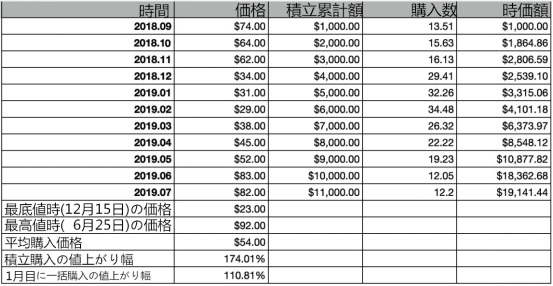
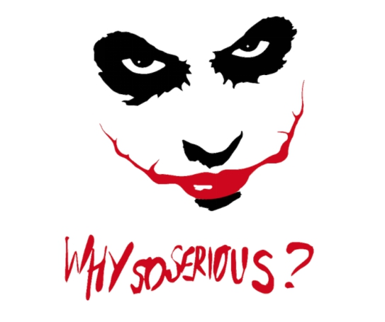

# **積立投資　李笑来の自己修練**

**～中国・最強投資家が教える真実～**

*――時とともに富を手に……*

**李笑来**

二〇一九年七月

*この本を読まなかった場合の機会損失は無限大……*

https://b.watch

------

## **3.人が投資する際に用いるべき唯一正しい方法【積立投資】**

まず結論から言うと：

この取引市場という不思議な場所では、一般人が頼れる唯一の投資方法はただ一つ、積立投資である――これを肝に銘じるべきだ！

[BOX](https://b.watch) という地球上初めてのブロックチェーンのETFは成立して間もなく（2019年7月3日、いわゆる「仮想通貨界ブラック・フライデー」の「七三韮フェスティバル」※韮は日本語で言うカモ）があったため、長期データがない。そのため、人が頼りにできる、唯一の投資方法である積み立て投資の事例にはなり得ないのだ。

龍門キャピタル（https://longmen.fund）の前身であるビットファンドは、李笑来が2013年に創立し、2018年清算した。その後、一部の投資家が5年間の歩みを止めずに継続させようと、この龍門ファンドというETFプロダクトを創設した。龍門ファンドは現在公開しておらず、資格があると認められた、招待された人のみが投資できる……しかし、このファンドには長期公開かつ透明性の高いデータがあるため、ここで積立投資の例として取り上げることにする。

以下は、龍門ファンドのウェブサイトの2019年7月初頭のキャプチャである：

積立投資の事例として適切に提示するため、上記から月ごとのデータのみを抽出すると、下記のようになる：

 

もしあなたが、2018年9月から毎月、龍門ファンドに1,000ドルを投資し、11ヶ月継続した場合、以下のようなデータが得られるだろう：

つまり、毎月積立投資の場合、あなたは最高値の2019年6月25日の92ドルと差となり、そして最安値の2018年12月15日の23ドルとも差が生じる……しかし、最終的にあなたの平均購入価格は54ドルであり、現在の価格は約85ドルである。11ヶ月を経て、累計11,000ドルを投資、現在あなたの時価総額は19,141.44ドルである――これはあなたが最後に投資した時の価格の82ドルで計算した結果である。先月より1ドル値下がりしていたにも関わらず、あなたの収益率は実に**74.01％**に達しているのだ！

以下のグラフを見ると、投資金額と現在の収益の推移をよりはっきりと見比べられることができるだろう。

 

以上の龍門ファンドの11ヶ月のデータにより、その価格変動の推移が魅力的な「スマイル・ウェーブ」を描いた。

 

市場で積立投資方式を用いる人は常に少数である。上記の**「スマイル・ウェーブ」**は、積立投資をしていない人から見ると、おそらく真逆の**「ジョーカー・ウェーブ」**に映るであろう。それは善意な笑顔ではなく、バットマンのストーリーで見たことあるジョーカーの様な邪悪な笑い顔である――まるでその口は悪意ある問いをつぶやいているかの様だ：「Why so serious?」

 

もう一度データを見てみよう。あなたの投資方法が、仮に大半の人がやりがちな、いわゆる「一括投資」……なら、あなたが2018年9月に一括で11,000ドルを投じたとする。すると11ヶ月後には、損することもなく、約**10.81％**の収益を得られた――**74.01％**よりは遥かに及ばないが、それでも損はしていない！

しかし、一括投資の性質から鑑みると、順調に11ヶ月後にアセットを持ち続けられた可能性は決して高くない。なぜなら、一括投資の人にとっては、このウェーブは「ジョーカー・ウェーブ」になってしまうからだ。

投資してから毎月は言うまでもなく、それからの毎日・一分一秒が、極めて苦痛で不安を覚える時間となるだろう。それから実に半年もの間に、あなたが唯一感じ取れることは、自分の資産が一分一秒ごとに目減りしていくことだけである。

苦痛と快楽は非対称的だ。それは私たちのDNAが感じ方を定めている。そして1,000円損した場合の苦痛は、1,000円の収益の快楽より大きく感じられる。あなたの感覚は、もうあの邪悪なジョーカーに弄ばれ苦しめられることになる。そんな時彼は舌を出してあの問いを呟く。「なぜそんなにシリアスになってしまったのか。」と……

もしあなたが積立方式の投資家なら、あなたは全く別世界にいるだろう。その二つの世界は同じように見えても、あなた以外の大半の人は、あなたの見え方を体感することはできないのだ。

**積立投資は、自分の長期の将来を見越して実行し続ける行為である。**故に、自分の将来をかけているのなら、選択するときは慎重に考え抜いたはずだ。当初の購入後の値下がりは、毎回の平均購入価格が下がる、あなたにとってのチャンスである。一括投資の人が厳しい冬を過ごし寒さに震えていた頃、あなたは真逆で、安い価格で購入しお金が増えていく幸せを感じていることだろう……

一括投資の人は長い苦痛には耐えられない。どんな人でも、長期間の苦痛には耐えられないのだ。これは「強い・弱い」とは関係ない。1ヶ月の苦痛の後、2ヶ月、または3ヶ月、さらに後から見るともうすぐターニングポイントに差し掛かる時、つまり6ヶ月目に（またはもう少し前に）、多くの人は様々な原因で退場する――取引市場ではこの行為を「肉を切り落とす（身を削るような苦痛である元金損失を被って手放す）」と呼ぶ。……韮（ニラ）たち（前述の「カモ」の意味）は自分で自分の肉を切り落とす。それが無残な元金損失なのだ。

積立投資をしているあなたはどうなるか？値下がりし続けても手放さないというのは、無理して手放さないだけなのか？いや、そうではない。あなたは本来やるべきことをやっているだけだ！値下がりしている間は、手放すどころか、安くなり続ける価格で購入できて嬉しくなる一方だ。逆に購入が邪魔されようものなら、あなたは怒るかもしれない。投資を邪魔されることは、人生を邪魔されることと同義だ！とさえ思うかもしれない。あなたは厳しい冬を過ごすかのように、寒さに震えるのだろうか？あなたはそんな寒さを感じることもなく、毎月の積立投資を通じて、気分は上々であろう。なぜなら、毎回の購入価格が安いからだ。つまり**「入場時間を早めた（まるで青田買いの様だ。）」**――あなたは毎日の様に後悔にかられ、「ああ！もし知っていたらよかったのに」とか、「どうすれば分かるようになるだろう」とか、出遅れて安いタイミングを逃したと考えるようになるだろうか？……いや。あなたは自分の積立方式が、自分の相対的な入場時期を早め続けていることを知っている。

そして6ヶ月後、価格が緩やかに上昇し始めるとどうだろうか。当初「肉を切り落とした」人たちはこのタイミングで戻って一括投資するだろうか？いや、違う。彼らはまだ恐怖におののいているはずだ。前回の苦い経験が、彼らに恐怖を強くもたらした。彼らが投資市場から離れている間、一切資産を投じることなく、値上がりしているのをただ指をくわえて見ているだけだった。値下がりの時、彼らは恐怖で逃げた。そして今、値上がりしてくるとさらに恐怖にかられた。――彼らの心構えは崩れ、価格はみるみる高くなり、そろそろ次のジョーカー・ウェーブになりそうなタイミングで、彼らはまた入場してしまった……

彼らには、こんな恐怖が繰り返される。どう動いても、感じるのはいつも悪意に満ちた世界のようだ。その訳は前述のように、どの投資ターゲットの価格ウェーブでも、全て無数のジョーカー・ウェーブによって構成されるからだ。それはどんなに恐ろしい事か！

このように、同じような世界でも、立場は完全に逆になりうるのだ。これは実に不思議なことであろう。もしあなたが積立投資を行っていれば、一瞬で同じ世界が別世界になる。あなたが見る価格ウェーブは、無数のスマイル・ウェーブによって構成されるのだ！この世界での幸せは数少ないが、この世界で得し続けるあなたは数少ない幸せな体験をすることとなる。