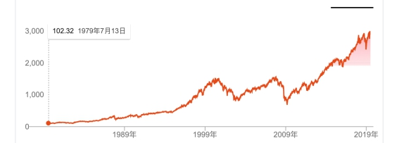

# **積立投資　李笑来の自己修練**

**～中国・最強投資家が教える真実～**

*――時とともに富を手に……*

**李笑来**

二〇一九年七月

*この本を読まなかった場合の機会損失は無限大……*

https://b.watch

------

## **4.** **値上がりのみの投資ターゲットは本当にあるのか？**

あなたは取引市場の不思議さに気づき、ハードルなしで世界で最もスマートな人たちにあなたのお金で働いてもらい、世界で最もスマートな人たちに無料で最良な投資ターゲットを選んでもらえることに気づいたら、傲慢になることもなければ、卑下することもなくなるだろう。なぜなら、取引市場の大半の投資家が中途半端だからだ。――高そうなスーツに身を包むような投資マネージャーでさえも、大半は中途半端なものだ……

そこで、すぐにでも試せる非常に有効なテクニックを教えよう。

あなたに向かってどれほど専門家ぶる人に対しても、あなたは軽く一言、発するだけでいい。

>   「……では、どのようにすれば機会コストを抑えられますか？」

相手の目がすぐに泳ぎ始め、言葉があやふやになり始めることに気づくでしょう……この言葉の威力を疑っているなら、ぜひ何度でも試してみてほしい。

ところで、私たちは市場のスマートな人たちが無料で選んでくれた最良なアドバイスを採用する時に、一つのジレンマに遭遇するだろう。万科株だけを買うか、もしくは貴州茅台・アップル・コカ・コーラ社ないしは、中国タバコのどれか一つだけを買うのか、など、どれを購入するのかというジレンマである。大事なポイントがひとつある。

> **唯一のターゲットに投資する機会コストは無限に大きい！**

これはどんな人でも分かることだろう！

機会コストとは、あなたのお金がもしあるターゲットに投資したら、そのお金が同時に他のターゲットに投資することができなくなるということだ……例えば、あなたがAに投資したら、そのお金を同時にBへ投資することはできない。そして、Bの将来の値上がり分は、あなたのAに投資したお金の将来の収益の機会コストである。

もし、ひとつのターゲットにのみ投資をするのなら、あなたの機会コストは無限大である！まるっきり素人でも、何かしらの方法で機会コストを控えるべき理由が、一瞬で理解できるだろう。投資とは、全方向的に考える力が必要で、収益率だけを考えるのは論外である。その他にももちろんリスク……**「どのように機会コストを控える」**かも必ず考慮にいれるべき重要な要素である！

そのような方法があるのか？絶対にある！簡単な方法は、複数の優秀なターゲットに投資することだ。あなたがインデックス・ファンドやETFを購入する場合、あなたの投資ターゲットはもうひとつの優秀企業かプロジェクトではなく、複数の優秀企業かプロジェクトなのだ！

ここでは小さなポイントが見過ごされがちだ。複数の優秀ターゲットを購入することで、あなたは有効的に機会コストを控えると同時に、あなたの投資ターゲットの性質と品質が変わったということも重要だ！そして、**あなたの投資ターゲットは長期的に見ると、値上がりしかしない、すなわち、値下がりしないターゲットになったのだ！**

そんな事があるのか？いや本当にあるのだ！

優良企業の事業が、右肩上がりであり続けることは非常に難しい。どんなに優秀な企業でも衰退はありうる。あなたが耳にしたことがあるコダック・ノキアなど、多くの企業がそうだ。コカ・コーラ、貴州茅台のような企業の方が極めて稀である。と同時に、それらもいつかブラック・スワン事件に遭遇し、絶滅の危機に瀕する可能性がある。だから、ひとつの最優秀の企業だけに投資するということは、機会コストが無限大であると同時に、ブラック・スワン事件のようなリスクを有効に回避できる方法もないということを意味する。長期であればあるほど、これが当てはまる。

ここで見方を変えてみよう。この世に、長期的に見て値上がりしかしないターゲットはあるのか？実は存在するのだ！**それは、人類の経済発展だ。**

長期的に見ると、証券市場の価格指数がひとつのトレンドのみというのも、そのゆえんであり、上昇、短期の値上がり値下がりが、一つまた一つのスマイル・ウェーブ（またはジョーカー・ウェーブ）を構成し、すべてをつなぎ合わせると、たった一つのトレンドになる。上昇。中で起伏があったとしても最終的には上昇。

以下はS&P ダウ・ジョーンズ・ インデックス500のこれまで40年間（1979-2019）の価格トレンドグラフを見てみよう：

 

あなたが複数の優秀なターゲットに投資する時、あなたが「賭け」ているのは一つの企業ではなく、あなたが「賭け」ているターゲットの先、ターゲット全体の経済発展だ……あなたが中国株市場における複数の優秀なターゲットを購入したら、あなたは実は中国全体の経済発展に賭けた、ということになるのだ！あなたがアメリカの株市場における複数の優秀なターゲットを購入したら、あなたは実は世界全体の経済発展に賭けた、ということになるのだ！――世界中の優秀な企業はアメリカで上場しうる。あなたが[BOX](https://b.watch)（中にブロックチェーン業界の3種の良質な資産がある、それがBTC、EOS、XIN）を購入したら、あなたが「賭け」ているのはビットコインだけ、あるいはあるひとつのブロックチェーン・プロジェクトだけでなく、あなたが「賭け」ているのは、実はブロックチェーン業界全体の発展なのである。

そのため、私が[BOX](https://b.watch)を設計した際、最も重要だと考えたことが、ブロックチェーン技術の発展プロセスだ。多くの場で述べたあのブロックチェーン技術の発展プロセスだ：

> 信頼できる台帳→信頼できるコード→信頼できるランニングシステム→信頼できるハードウェア……

振り返ってみると、2011年、私はビットコインを見逃さなかった；2016年、私はイーサリアムを見逃さなかった；2017年、私はさらにEOSという、2019年当時で時価総額50億ドル、最もヒットしたプロジェクトのエンジェル投資家だった。同様に、MIXIN Networkも、私が多く投資したプロジェクトだ。1回や2回なら、運がよかっただけかもしれない、しかし、3回、4回と連続したとなると、もうただの運では片付けられない。この背景にあるロジックは、これらが、人類が未来に向けて頼れる唯一の使えるツールであるということだ。[BOX](https://b.watch)の設計は下心もなく、李笑来は管理費ももらわないのだ（これがおそらく世界で初めて管理費のかからないブロックチェーンETFだ）。そして、もっと重要なことは、李笑来が全ての人と同じ条件で[BOX](https://b.watch)の積立投資で稼ぐしかないということだ。

実は、証券取引市場の本当の不思議さはこの点にもある。ここではどんな人でも、全人類や全社会の経済発展に追いつけるのだ。グローバル化のよい点は、次のようなことが可能であることだ。：日本経済が衰退している時に、日本人がアメリカの証券を買ってアメリカの経済発展に追いつく。アメリカの経済が停滞している時に、中国の証券をアメリカ人が買い、中国の経済発展に追いつく。たとえ日本の証券を買ったり、アメリカの証券を買ったり、香港の証券を買ったりするのが不便であっても、中国人は世界中の人々と同様に、世界中ほぼどこでも存在するブロックチェーン取引市場でファイナンシャル・インターネットの革新的な決起と発展に追いつけるのだ。

ここに注目したいポイントがある：

> 値上がりのみのターゲットはなく、**長期的にみて値**上がりのみのターゲットだけがあるということだ。

  私は《韭菜的自我修養》の中で、大半の人が誤解しがちな真実を述べている。

> ●取引市場は、即時取引のプロセスにおいては確かにゼロサムゲーム――相手の利益はあなたの損によるもので、相手の利益とあなたの損は同額に見える。
>
> ●取引市場は、長期投資家にとってはゼロサムゲームではない――彼らの利幅は主に経済の増長によるもので、周囲の人の短期的な損から来るものではない。

これも「なぜ一般人が取引市場で頼れる唯一の投資方法が積立なのか」の、最も核心的な要因のひとつである。言い換えれば、長期投資、長期保有（ガチホ）することが安全ということだ。

大半の人は、投資を始めたばかりの時は、それほど多くのお金を投資しない。しかし積立式は、自分の取引市場外で稼ぐ力と長期的な積立紀律を合わせて賭ける――これは実に大きな賭けだ！あなたの時間は絶対的な資産であり、機会コストは無限大の資産である。だから、最も価値のある機会コストを無限大である優秀な資産を投資する際に、あなたはただ絶対安全なターゲットしか選べないのだ。そのターゲットとは何か？それは人類全体の経済の発展だ。他にはないのだ。

現在のタイミングから見ると、ブロックチェーン市場は証券市場より優れ、証券市場は不動産市場より優れ、不動産市場は債券市場より優れ、債券市場は銀行貯金より優れている。投資家は積立投資の開始初期はそれほど多くのお金を調達できないため、自分の将来を賭けて投資をする。そのため、投資のターゲットを選ぶ際は、様々な要素をもとに考え尽くし、最優なターゲットを選び抜くのだ。もし将来、最も優秀なターゲットがブロックチェーン市場でなくなったとしたら、他の最も優秀な市場に乗り換えるべきだ――これは別に口先だけの信念によるものではなく、実用主義（プラグマティズム）の価値観によるものだ。

この様な優れた選択は、あなたに不思議な感覚をもたらし、あなたは驚くだろう。「なぜ私は、こんなにも簡単に大半の人が想像もつかないような事実を見て分かったのか」と。

>   空の雲の境目は、実は地上の都市の境目とは、全く関係ない！

人が天気予報を聞いて今日の天気を判断している時に、あなたは既に空に視線を投じ、どの雲が雨になるのかを判断しているのだ……**レベルが**もう明らかに違うのだ！世界が違うと言っても過言ではないかもしれない。

最後に、これらよりも重要なポイントを補足する必要がある。

> 積立は長期・持続的に投資する行為であり、投資のターゲットは**「長期的に見ると上昇し続ける」**という属性の条件を満たさなければならない。

この条件を満たすことが極めて厳しいターゲットの場合、その結論は明らかである。債券・金・不動産――ましてやファッショナブルなスニーカーなどは、条件を満たす積立ターゲットではない。なぜなら、この必須条件をまったくもって満たせないからだ。この前提を踏まえると、あなたもすぐに分かるだろう、バフェットがテック株に異常に慎重な一方で、コカ・コーラに対しては慣用的な理由を……