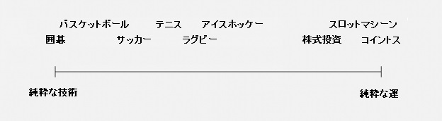

# **積立投資　李笑来の自己修練**

**～中国・最強投資家が教える真実～**

*――時とともに富を手に……*

**李笑来**

二〇一九年七月

*この本を読まなかった場合の機会損失は無限大……*

https://b.watch

------

## **9.積立投資戦略の背後にある深いメカニズム**

まず初めに、対立する概念の組み合わせを見てみよう。

> **「能動的および受動的」**

一般的には、能動的と受動的という言葉は反対語であると考えられており、「能動的」はポジティブでプラス、「受動的」は消極的でありマイナスであると理解されることが多い。

### **9.2.最も能動的な人々は境界さえ知らない**

あなたが自分の能動的な人格を気にし始め、能動的な人格を形成してくると、そうした**能動的な人々というのはあまりに少ない**と感じるだろう。

私の親友である霍炬（現在はPressOneのCTO兼COO）は、私に積極的に人と交わるように教えてくれた人物だ。私は元々引きこもりの部類だが、どうすれば効率的に人間関係を構築できるのか、とずっと考えてきた。何年も引きこもっていた結果として、私はインターネット上で広く読まれる文章を書くことができた。累計で10億回以上読まれた《放下你的无效社交》という記事もある。しかし、霍炬は私を変えた。彼の家で遊んでいる時、私は彼が名刺を片付けて独り言を言いながら、印を付けたことを見つけた。「さて、この人は3ヶ月間連絡していないな。連絡してみようか。 」

そこで、私は学んだ。つながりがあったとしても、どちらか一方が能動的に動く必要があり、もし両方ともが受動的であったならば、ゆっくりとつながりがなくなっていくだけだということを発見した。効果的にネットワーキングするには、自分自身を能動的に変える必要がある。

能動的なエネルギーというのは、どの個人にとっても素晴らしいのだが、**能動的であり続けることには限界がある**。その限界を超えるとその効果を失い、さらには悪い効果をもたらすことさえある。なぜ多くの家庭教育は最終的に失敗するのか？また、失敗の割合が非常に高いのはなぜだろうか？社会で議論が広く行われているにも関わらず、この問題を解決できないのはなぜだろうか？この厳然たる事実には、このように解釈できる。

> 両親は能動的な姿勢を取るべきではない場所で、常に能動の力を使う。

言い換えれば両親は知らず知らずのうちに「能動の境界」を超えている。

図中)自分、能動の境界

**能動の最初の境界は自分自身だ。**

自身の範囲内では、すべて能動的な態度をとるべきだ。しかし、それを超えると、能動はネガティブな作用をもたらす可能性が高い。両親が自分自身をよりよいものに変えようとしているなら、これは「能動の境界内」で能動を適用するべき。

ほとんどの両親によって最も使われる言葉、または最も頻繁に持たれている考えが「私たちの世代はすでに変えられない……」というものであることは残念なことだ。そして、彼らは次の世代が彼ら自身と異なることを望み、自分の外側、つまり能動の境界の外側にできることすべてを適用する。

彼らが予期していないことは、これらの行動がネガティブな結果をもたらすということだ。

> ●彼ら自身は両親として、将来にわたって改善しない；
>
> ●子供たちは無意識のうちに「常に自身に受動的である人物」になってしまう。

本来、正しい選択は次のとおりだ。

> ●両親は能動的に自分自身をよりよくするべき；
>
> ●子供はそれを羨ましく思い、状況をよくしたいと思うようになり、能動的になる。たとえ表面的なマネでも、よいスタートであると言えるだろう……

**正しい選択は常に実行が困難だ**。

もう一つの最も一般的な例は、道徳的要求に対する人々の態度だ。道徳における制限の対象は、他人ではなく自分自身であるべきだ。道徳を自分自身に対して高く設定するのは正しいことだが、道徳を他人に対して設定するのは、あまりにも世間知らずであるか、邪悪であるとさえ言えるだろう。法律は、自分自身に対してだけでなく、他の人にも遵守を求めるものだ。したがって、法律を用いて、自分の権利と利益を守ることは困難である場合が多く、なぜそうなのか考えてみるといい。

積立投資を開始すると、あなたは特定の属性を持つ投資家になる。あなたは自分自身と異なる投資家とたくさん出会うだろう。そして、彼らは投資している会社に対し、あれこれと要求をしていくかもしれない。本当に役に立つ提案をしたいと願っていても、最後には起業家を怒らせてしまい、お互いのことを考えたくもない状況になってしまうこともしばしばだ。なぜ彼らはそのようになってしまうのだろう？それは、彼らは能動の境界の外にいることを知らないからだ。境界の外にいる場合、彼ら自身の能動的な行動は無意味であり、それはすべてネガティブな効果がある。彼らは永遠に理解することはないだろう。立場を変えて、もし上述投資家が起業した場合に、出資者たちから様々な形で横やりを入れられてしまうと、それに太刀打ちできず、外野の言いなりになってしまいかねないからだ。そう、自分自身の能動の境界外にいる人達に影響されるとは、こういうことなのだ。自分が達成したいことに集中できず、周りの声にながされてしまい、自分の事業に集中できないことほど、恐ろしいことはないと思うのだが、いかがだろうか。

**能動の2番目の境界は、コントロールの範囲だ。**実際に、私たちはエアコンの温度、車の速度などをコントロールすることができる。今後の議論でも、あなたの想像をはるかに超えてコントロールできるものを示す。しかし、**コントロールできないものを識別することはさらに重要であり**、例えば、純粋な運は誰もがコントロールすることができないものだ。

場合によっては、テクニックが100％の役割を果たすが、極端な場合には運だけが100％の役割を果たす。この二つの間にあるものは、テクニックと運の両方の要素の割合が異なる。

図中）囲碁、バスケットボール、サッカー、テニス、ラグビー、アイスホッケー、株式投資、スロットマシーン、コイントス、純粋な技術、純粋な運

上の画像は、2012年にMichael J. Mauboussinによって出版された本から引用したもの：**The Success Equation: Untangling Skill and Luck in Business, Sports, and Investing**

簡単に観察できるものとして、

> ●大多数の人々は、彼ら自身の能動の境界内の努力が足りない；
>
> ●より多くの人々は、彼ら自身の能動の境界の外側から自己認識できていない。

したがって、ほとんどの人生のジレンマは、以下に起因する。

> ●能動になるべきときに十分に能動でない；
>
> ●能動であるべきではないときにむやみに能動になる。

こういうことはないか、考えてほしい。

世の中には様々な人がいる。しかし、誰一人として特別な人などいないのだ。いわゆる老子が言った**「天地不仁，以万物為芻狗（注）」**のようなものだろう。したがって、確率論的な観点から言うと、ほとんどの人が自分のいる環境に非常に満足している可能性は低い。そのため、ほとんどの人は最初に周囲を変えたいという強い意欲を持つが、最後には運命だと諦めてしまう。

（注）世の中は慈悲深いものではなく、すべての個々が犬のように扱われ、特別扱いはされない

諦めた人たちはどこで間違いを犯したのか？彼らはただ単に、影響力の本質を理解していないだけだ。影響力とは、あなた自身が能動的に何かを言うとか、どう行動するかということではない……**影響力の本質とは、あなたが他人の能動を引き起こすことができるかどうかだ。** 鄧小平はこれをよく知っていた――そしてまさにこれが理由で、彼は中国全体を変えることができた。以下の意味をしっかり考えてみてほしい。積立投資をする人が最も重視するのは、自分の取引市場外でお金を稼ぐことができる能力である。なぜなら、それがすべての成長の基礎となるからだ。セールスは、お金を稼ぐための強力な能力だ。セールスが得意な人は影響力の本質をしっかり理解しており、能動の境界の外側でむやみに能動的な人は嫌われる営業マンだろう。経験を重ねていけば、あなたはより深くこのことを理解するだろう。