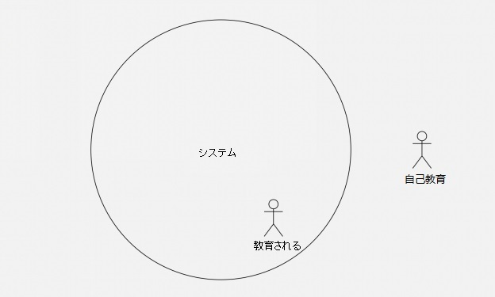
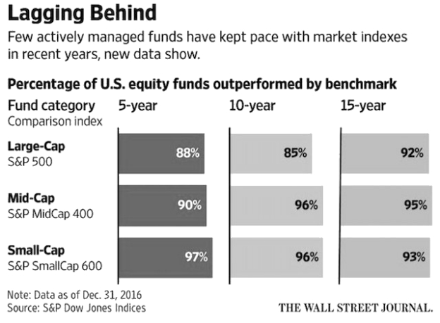

# **積立投資　李笑来の自己修練**

**～中国・最強投資家が教える真実～**

*――時とともに富を手に……*

**李笑来**

二〇一九年七月

*この本を読まなかった場合の機会損失は無限大……*

https://b.watch

------

## **9.積立投資戦略の背後にある深いメカニズム**

まず初めに、対立する概念の組み合わせを見てみよう。

> **「能動的および受動的」**

一般的には、能動的と受動的という言葉は反対語であると考えられており、「能動的」はポジティブでプラス、「受動的」は消極的でありマイナスであると理解されることが多い。

### **9.6.トレンドの受動的な力はどのくらい強力か？**

はじめに反対側から例を挙げる。私たちが通常話す**教育**は、受動のネガティブな力を示すことができるという優れた例だ。

教育の失敗を訴える各世代、つまり自身の教育の失敗を訴えるだけでなく、社会全体の教育の失敗を訴える人々が多くいる。中国だけでなく、グローバルで彼らはいわゆる教育を何度も再考している。しかし、あなたが視点を変えるならば、反対の説明を見つけるだろう。

> 実際、どの時代でもどの国でも、教育は非常に成功している！

なぜそのような結論があるのか。教育を定義する観点を変えたからだ：

> **いわゆる教育とは、本質的には、その国の社会システムが個人を変えたいようにする仕組みだ……**

誰もが一連の連動システムの中にいる。私たちのサークル、私たちの文化、私たちの社会、私たちの国、私たちの世界にそれは存在している。これらは「すでに成熟したシステム」だ。それらが客観的なものだと考え、だまされてはいけない。それだけではなく、システムそれ自体が生命力を持っており、また魂すら持ち合わせている。システム自体が力を持っているのだ。

どんなシステムにおいても、既得権と非既得権がある。前者は非常に少なく、後者は大多数だ。結果として、教育の目標は明確であり、既得権益者はそれを彼ら自身にとってより有益なものにするために使用するだろう。あなたは彼らが何をするか知っているはずだ！非既得権益者は、対立の過程で権力の不平等があることに気付き、多数は既得権益者のために奉仕することになる。また、抵抗する少数の非既得権益者は最終的には消滅する。もし、既得権益への抵抗が成功するならば、それらは即座に既得権益者となり、また既得権益を提供している次の「新しい」システムを作るだろう……これは事実であるので、不平不満を言うのは全く不要だ。地球上のどこでも同じだと思うが、そうではない場所があるのか。（いや無い。）

したがって、いわゆる教育は次のように定義される。

> **教育とは、あなたが所属するシステムが望む形であなたを変えたいようにする仕組みだ……**

教育がそのように定義されており、現状が事実であるならば、結論は明白だ。歴史におけるすべての教育は非常に成功しており、異常な成功とさえ呼ぶことができる。そしてますます成功していくだろう。この観点から、人々が文句を言う教育の失敗は、本質的には、システムへの既得権益の不快感に他ならない。

普通の人々に、他の道はないのか？まだある。

教育がそのように定義されている場合、**独学**はどのように定義されるべきか？

> **教育とは、所属するシステムが個人を変えたいようにする仕組みであるなら、それとは対照的に、独学はあなたがなりたいように変わる仕組みだ。**

したがって、より正確な表現は2つの相対的な用語になる。

> ●教育される
>
> ●自己教育

大多数の人々は、教育を受ける過程（すなわち、システムによる同化の過程）において非常に不快に感じる。これは当然のことだ。しかし、次の選択は闘争の強さを最もよく反映するものだ：**ごく少数の人だけが教育されることを放棄し、自己教育を選ぶ。**こうした自己教育は時々でなく、死ぬまで行う。驚くべきことは、歴史を注意深く観察すると、あなたは世界を変える人々が例外なく自己教育していることに気付くだろう。

図中）システム、教育される、自己教育

一方、教育を受けた人でも、教育を受けることを放棄した人でも、彼らは最終的にシステムに同化される。受動的な力は彼らに非常に強力な影響を及ぼす。それはあまりに強力な力なので、それは神の力だと思っている。

1999年に制作された《一年又一年》というドラマがあるので、時間をみつけて観てほしい。物語は1978年に始まり、一話は一年分で、合計21のエピソードがある。エピソード中には映画の映写スタッフの物語があるので、一話毎にその年の映画を挙げている。また、一話毎にその年の曲も収録されている。さらに重要なことに、当時の最も重要な出来事の1つをあなたに思い出させる。物語は特によくはないが、各個人がシステム内でどれほど小さいのかをドラマは視聴者に感じさせ、受動的にしか直面できない要因がどれほど強力なのかを実感させる。

私たちが受動的にしか対抗できないネガティブな力の強さは強大で、同時に、それらのポジティブな力も同様に強大だ。私たちに関連した、大きな前向きな役割を果たす受動的なポジティブな力の例を下記で見てみよう。

資金管理の分野では、資金は2つのタイプ、**アクティブ・ファンド**と**パッシブ・ファンド**に分けられる。

 

上のグラフは、過去数年間における世界中のアクティブおよびパッシブファンドの資本流入を示している。資本がより一層、パッシブファンドを支持するのはなぜか？アクティブファンドがますます拒否されるのはなぜか？その理由は、資本が受動の力をますます認識しているからだ。

アクティブファンドでは、市場を分析した後に市場を上回る可能性のあるポートフォリオを選択する管理者が必要だ。これらの運用会社の期待に基づいて、投資家は非常に高い運用報酬と成功報酬を支払う必要があり、またこれらの運用会社の頻繁な取引の取引費用も負担する必要がある。これとは対照的に、パッシブファンドは分析スキルを宣伝せず、また頻繁に運用するのではなく、代表的な指標（S&P 500など）に受動的にしたがっている。

長年にわたり、ファンドマネジャーは様々な疑念を持たれていた。こんな冗談もあった。あるファンドマネージャーが、自宅に株券とサルを一緒に入れた。すると、サルは株券におしっこをした。ファンドマネージャーは、サルがおしっこをかけた株券でポートフォリオを組んでも、アクティブファンドマネージャーの成績を上回ることができた、という悪趣味な冗談だ。

それは本当か？それとも単なる冗談か？あなたが理解する必要があるのは、現代の証券取引市場の成長の歴史は、実はそれほど長くないということである。真の現代の取引市場は1970年代にやっと出現した。取引市場の様々な現象に対して、効果的な研究のためのデータは約40-50年分しかない。

[Wall Street Journal ](https://www.wsj.com/articles/indexes-beat-stock-pickers-even-over-15-years-1492039859)（2017年4月13日）の統計により、2016年12月31日現在、過去15年間の成績を見ると、中規模ファンドの95.4％がS＆P MidCap 400の成績より劣り、小額ファンドの93.2％がS&P SmallCap 600の成績より劣り、大規模ファンドの92.2％がS&P 500の成績よりも劣っている。

 

アクティブファンドの支持者は、一見すると合理的な異議を唱えている。彼らは、ますます多くのお金がパッシブファンドに流れ込むにつれて、最終的には戦略を「トレンドフォロー」に変える結果、それがアクティブファンド管理を比較的より有利にすると考えている。しかし、短期的な市場の変化や新しいトレンドが、アクティブなファンドマネジャーに短期的な優位性をもたらすことを長期投資家は理解しているが、15年ベースの統計から見ると、それを無視できることも理解している。

この統計の最も興味深い部分はこのような結論だ。

> ●投資**サイクルが長ければ長いほど**、受動的な利点は大きくなる；
>
> ●投資**額が多ければ多いほど**、受動的な利点も大きくなる……

私の個人的な過去の経験もこれを裏付けしている。

2013年に私は、仮想通貨関連のプロジェクトに投資する初期の小規模ファンドを管理し始めた。 2018年までに、つまり4年間の管理期間と、1年間の清算期間、合計5年間で、ファンドの時価総額は開始時の約68倍になった……この成績は、人をびっくりさせるようなよい利回りだと思うが、ビットコイン投資への利益と比べ、ほんの少しだけ上回っていたため、実際にはかなり落胆した。つまり、もし当初すべての資金をビットコインに投入し、その後の5年間何もしなかった場合は、58倍になった。私のファンドは成功報酬の30％を引いた後、投資家のリターンは約48倍になった。それはビットコイン自体の成長よりわずかに低い成績だ。

さらに落胆する1つの要因がある。この5年間で、話すのは難しいが、本当にスリリングだった。数回全滅する可能性があったし、もしそうなったら運で復活するのは難しく、九死に一生を得た……このファンドはもう少しで閉じなければならなかったが、これはよくあることだ。特に、ブロックチェーンの世界は、変動の振幅が株式市場の数倍も大きい場所である。

結果的に閉じなかったが、実際にそれは驚きだった。ビットファンドが最終的に清算されたとき、私は次のステップではパッシブファンドにしか作れないと感じていた。1年をかけて考案し、ついにオープンソースのブロックチェーンETFファンド商品[BOX](https://b.watch) を設計した。現在の小冊子は、実際に私の理想的なパッシブファンドモデルを作成するプロセスを反映している。

次に、先にこのセクションの焦点に触れておく。

あなたの経験からも同じ結論がそのままあてはまるかどうか、見てみてほしい：

> ●**志が高ければ高いほど、より受動的な力が必要だ；**
>
> ●**多くのエネルギーを持っているほど、多くの受動的な力が必要だ……**

受動的な力は素晴らしいだけではなく、**それを長期で上回ることは常に困難だ。**

受動的な力が引き起こされると、それらは比類のないほど強力だが、**能動的なものは受動的でポジティブな力を引き起こし、受動的なものは受動的でネガティブな力を引き起こす。**だから能動的に受動することが最適な戦略である。

さらに、トレンドフォローに関しては、新しい洞察があるかもしれない。

> ●短期的な結果をトレンドフォローで見るのは間違いだ；
>
> ●長期的な結果を目指しトレンドフォローを伴うのは唯一の正しい選択……

たとえ誰もが彼らが「トレンドフォロー」という言葉を理解していると思っていても、少し真剣に考えた後では、正反対の結論のように異なった結果になる場合がある。