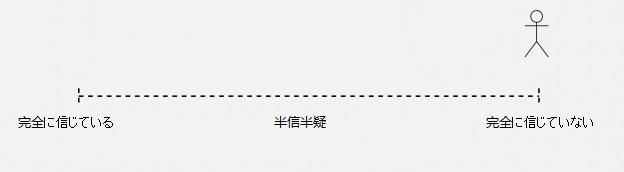

# **積立投資　李笑来の自己修練**

**～中国・最強投資家が教える真実～**

*――時とともに富を手に……*

**李笑来**

二〇一九年七月

*この本を読まなかった場合の機会損失は無限大……*

https://b.watch

------

## **9.積立投資戦略の背後にある深いメカニズム**

まず初めに、対立する概念の組み合わせを見てみよう。

> **「能動的および受動的」**

一般的には、能動的と受動的という言葉は反対語であると考えられており、「能動的」はポジティブでプラス、「受動的」は消極的でありマイナスであると理解されることが多い。

### **9.7.能動の境界内にはどのくらいのスペースが残っているのか？**

**「おしなべてあなたに大きな影響を与えるものは、全てあなたにコントロールできる代物ではない。」**これについては前述した。あなたは今、あなたに大きな影響を与える要因をコントロールすることはできないことを知っている。なぜなら、それらはあなたの能動の境界の外にあるからだ。

しかし、あなたは知っているだろうか？あなたの能動の境界の中で、あなたはすでに諦めているが、実際にはコントロールできることがたくさんあることを。そして、そうして諦めてしまうことが、どれだけもったいないことなのかを。単にあなたはそれについて真剣に考えたことがないかもしれないし、誰も指摘しなかったから気にならなかったかもしれない。

バットマンを例に挙げて見てみよう。

 

もちろん、この写真にはコミックヒーローのバットマンはいない。バットマンとして知られている人物（前方で自転車に乗っている）を見て欲しい。ダニエル・キッシュという（[Daniel Kish](https://en.wikipedia.org/wiki/Daniel_Kish)）。 1966年生まれのダニエルは、生まれてから13ヵ月未満で目のがんで盲目になった。この盲目の人はあなたが想像できないことをしている。彼は自転車に乗っており、他の補助装置はない。写真の他の2人も実は盲目で、ダニエルが教えたのだ！この種の魔法のスキルは実践できるだけでなく、教えることもできるのである！

ダニエルは「見る」方法を探した。彼は口を使って音を出し続け、その後ソナーによってコウモリのように世界を知覚している。この方法をEcholocationと呼んでおり、そして人々は彼を "バットマン"と呼んでいる。TED上に関するダニエルの[スピーチがあるので](https://www.ted.com/talks/daniel_kish_how_i_use_sonar_to_navigate_the_world/transcript?language=zh-cn)、それを見てアイオープナーになることを体感してほしい。

このバットマンの例は、特に驚くべきトピックをさらに説明するために使用される。

> **本当に能動的な人々は、運命を信じない。**

あなたは運命を信じているか？あえて全く信じていないと言うか？完全なる信仰と、全く信じないこととの間には長い距離がある。

図中）完全に信じている、半信半疑、完全に信じていない

たった1秒の自己診断で、**全く信じないこと**、それなしでは生きていくのは本当に大変で難しいことがわかる。勇気が必要と思われる。また、あなたは突然**躊躇している**のだとなぜ思うのか？たとえ全く信じないことを選択したくても、その選択に抵抗する力があるかもしれない。あなたは全く信じないことを選択したくても、なぜ躊躇しているのかわからないかもしれない。

ため息をついて、卑屈にならないでほしい。これはあなただけの反応ではない。これは基本的に100％の確率に近い状況だ。99％？または99.99％？とにかく、その一方で、信じない1％または0.1％は非常に小さい数だ。全く信じない人はほとんどいない。しかも信じないほとんどの人たちは、無知で大胆不敵なだけだ……

そして、次に述べることも事実だ。

> 時間が経つにつれて、大多数の人々は右から左に移動する。つまり、ますます運命を信じるようになる。

考えてみてほしい。あなたは幼い頃、ほとんどすべての子供たちのように、運命を信じなかったはずだ。とはいえ、小さい頃は「人生」がどうなっているのかを知らない。また、どんどん運命を信じていくと、人は最後には完全に信仰してしまう。もちろん、彼らの中では、それは「完全な信仰」とは呼ばれず、それは**「悟り」**と呼ばれている。あなたが本当にここで「全く信じない」を選ぶことができないならば、仕方ない。あなたが躊躇していても、それでも何が起こっているのか知りたいのであれば、読む前に心の準備してほしい。

> **すべての真実は、あなたの気持ちを考慮に入れる義務を負わない。**

あなた自身が選んでほしい。これは間違いなく大きな勇気だ。勇気とは何か？**勇気とは偽造できない唯一の美徳だ。**

これからさらに質問をする。答える前に慎重に考えてほしい。

> 過去は未来に影響を与えるか？

さらに一歩進んでほしい。

> 過去が未来に影響を与えることは必然的だろうか？もしくは、過去は未来にどれだけの影響を与えたのか？大きいか？それともそれほど大きくないか？

まだ終わっていない、我々はさらに尋ねる必要がある。

> 過去が未来に影響を与える範囲がそれほど大きくない場合、過去と未来の間のつながりをシンプルに切り捨てることは可能だろうか。

運命とは何だろうか？実際には、運命を信じるかどうかは宗教とは全く関係がなく、迷信とも関係なく、完全に論理的思考の欠落によって引き起こされている。いわゆる迷信は単に思考の抜け穴を考えているのだが、抜け穴がどこにあるのか分からないし、結果だけを残す。電気が発明された後、悪魔と幽霊についての物語は以前ほど出なくなっただろう？

運命を信じるという本質は、過去が必然的に未来に影響を与えると考えることに他ならない。過去が未来に**必ず**しも影響を与えるとあなたが**思わないなら**、あなたは運命に疑いを抱くだろう。

私がなぜ**「本当に能動な人は運命を完全に信じない」**と言うのか、あなたは理解することができるだろうか？真に能動的な人はシンプルで正しい論理的思考を通して未来を見つけるので、時に、私達にとっては過去と未来の間の一見避けられない**関係を完全に断つことさえできる**。

最も雄弁な根拠は、皆が詳しいであろう確率論だろう。ギャンブラーの誤謬について聞いたことがあるだろうか。ギャンブラーは、**確率論の独立した概念**を知らず、次のコインフリップが独立した出来事であることを理解できない。前の結果は次の結果にまったく影響を与えることはなく、次のコインの表裏の確率は依然として1/2だ。

このようなシンプルな科学的知識を決して過小評価するべきではないし、この種のことは私たちの生活に大きな影響を与える。しかし、ほとんどの人は学んで知っているが、めったにそれを使わない。

あなたが独立した出来事の概念を理解することができるならば、ギャンブラーの誤謬に陥る人々をどれほど哀れに思うか理解することができるなら、自然に次のことを理解することができる。

> 過去が必然的に未来に影響を与えるであろうと誤って信じる人々は、実際にはもっと哀れだ。カジノのギャンブラーは、独立した出来事の概念を理解していないので、ギャンブラーの誤謬に陥る。彼らが失ったのは当時のギャンブルの資金だけである。しかし、過去が必然的に未来に影響を与えると思っている人々は、これからの未来をすでに失っている！

よい過去を過ごせた場合は問題ないが（ほとんどの人とってはとても低い確率の出来事である）、もし過去がよいものでなく（多くの人にとってこの確率は非常に高い）、そして過去が必然的に未来に影響を与えるであろうと思っていたとしたら、その後の人生はゾンビとの違いは何だろうか？

**いわゆる運命を完全に信じない人は、決心し、過去の悪い部分が将来に影響を与えないように最善を尽くす。**

人生で苦労する価値のあるものはすべてここにある。ここだけだ。

前述したバットマン、ダニエルはそのような人物だ。彼自身の努力を通して、彼は他の盲目の人々と比較して、最大限に「彼の目を失うこと」という過去の出来事を現在と未来に影響を及ぼさないようにした……

実生活において、私はまたこのようなもう一人の人物、中国人女性を知っている。廖智という名前だ。10年以上前、彼女が四川省・汶川地震にあったとき、なんとか助かったが、彼女は娘と両足を失った。彼女の仕事はダンサーだった！数年後、雅安地震の際に、記者が人々を救おうとしている少女を撮影したところ、命を救うために必死になっている少女の両脚が義足であることに気づき、驚いた。廖智は避けられないように思われる過去と未来の関係を断ち切るという能力を持っていた。その後、廖智は不幸な結婚生活を能動的に終わらせ、数年後、義肢を専門とするアメリカからやってきた台湾人と出会った。廖智が後に結婚して子供を産む、この大きな男性に対して何と言っただろうか？

> 「身長を2センチ高くできる？それで完璧でしょう。私は以前までそのような機会を持っていなかったんだから！」

あなたが完全に運命を信じるならば、投資をする必要はない。なぜなら（普通の人なら一般的だが）完璧ではない過去は将来を決定するからだ。積立投資では、過去は未来に影響を与えないだけではなく、実際にエントリー時間を前に進めて、タイムマシンに座って過去に戻って修正し、また未来に帰ってくるようなものだ。

これが、私がこれまで、現在、そして将来において重要なポイントを繰り返し言ってきた理由だ。

> **積立投資戦略の成功の鍵は、心の修練にある。**

心の修練はどこから始めたらよいのだろうか。運命を信じないところから始まる。過去のよくない部分が未来に影響を与えないようにし、そのつながりを断ち切らなくてはいけない。よい部分に関しては、引き続きよい作用が発揮するように維持させる。ここで一生懸命耐えることは、最も価値のある忍耐であり、素晴らしい将来の根源となる。そして、少しずつ能動的な境界を探索していき、その外側でトレンドを探し、受動的な力を体験する。

積立投資戦略はある銘柄に長い時間を掛け、**定期的に一定金額を投資することでしかなく、極めて簡単に見える。**

しかし、無になるほど思考や研究を重なっていくと、積立投資の素晴らしいところに気づくだろう。積立投資は実は非常に精巧で、人を規律的で且つ能動的にさせ、長期的に銘柄を保有する必要があることから、逆説的に長期的に上がる銘柄を探すように人を動機づける。その他、様々な役割を果たしている：

> ●能動的に受動することを深く体験できる、唯一無二の環境の提供；
>
> ●反論不可能な実際の結果を用いて過去と将来のつながりは必然ではないことを証明する；
>
> ●自分を見つめ直し、能動の境界内で極限まで努力できるようにする。

ましては、考えつかないと思うが、最終的には人を比較的に極めて稀である「綺麗」な人にする。あなたは静かに計画を完成させるのみで、失敗するか、膨大な富を得るかの二択だけだ。成功したら、あなたが得るのは**絶対に綺麗な富である**。これより綺麗な金を稼ぐ方法はあるか？こんな方法を手に入れたあなたは、他の諸々ごたごたのことをする意欲や原動力が湧くのだろうか。