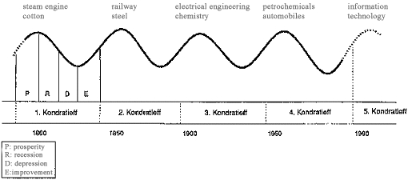
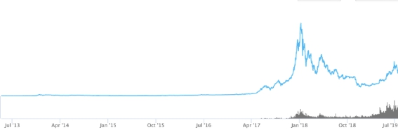

# **積立投資　李笑来の自己修練**

**～中国・最強投資家が教える真実～**

*――時とともに富を手に……*

**李笑来**

二〇一九年七月

*この本を読まなかった場合の機会損失は無限大……*

https://b.watch

------

## **13.最も重要なよい知らせ：一般人にとって長期は永遠ではない**

一般人がバフェットの言う**「私の長期は永遠」**と聞いた時、鏡の世界のどっち側の一般人でも、少しの絶望を感じるだろう。もちろん、どっち側の一般人も同じで、その少しの絶望はバフェットの話への懐疑ではない。その絶望は上述の全ての人が向き合うであろう苦痛と残念さである。

> 今になってやっと知れた！（または、もっと早く知ったらよかった！）

特に、バフェットが11歳の時に人生の最初の株を買い、早期のときからバリュー投資の父であるベンジャミン・グレアムに教えを求められるチャンスに恵まれることを思うとだ。他人と比較することは、我々の人としての本能で、この本能が起動されると、絶望は山を押しのけて海を覆すほどの勢いで生まれ、誰も希望を感じなくなる。

しかし、事実はそうではない。これは絶対に人を楽にする結論だが、ゆっくり論証していく必要がある。

このことはきっと多くの人の慰めになるだろう：

> **今の世代の人が稼げる金額は、前の世代の人より多い。**

しかも、少し多いだけではなく、桁違いである。これは多くの人が冗談で言うインフレによってもたらされるものではない。この現象の原因は簡単で明確である。それは人類社会が発展し、科学技術が進歩し、経済の規模が大きくなっているからだ……これは時代の恵みであり、しかも理論的には全員にとっての恵みである。すなわち、全ての人が得られるのである。

簡単に言うと、バフェットが11歳の時、彼の世界では今のアップルのような規模の会社はない。アップル社の時価総額は兆単位を超えており、人類の経済歴史上、1つの重要なマイルストーンである。その前まで、歴史上でこれほど自社製品を売れる会社はなかった。マクロ的には、これは人類社会の商業活動が発展し、経済規模が大きくなった結果である。

世代ごとに自分の理解能力の上限がある。バフェットはあれだけ悩みに悩んでアップルの株を購入した。これは彼の限界である。ビットコインやブロックチェーンはともかく、バフェットの理論体系や認知能力の限界から、GoogleやNetflix、Amazonもまともに理解できないだろう。理論的に世代ごとに限界があり、現在の若者もそうである。時間の経過に連れ、彼らの「自分の能動的な境界」探索は限界に達する。彼らが進歩していないわけではなく、進歩しなくても金が十分に足りる！ということだ。さらなる限界の探索は、必然的に次の世代が担う。

また、上述の理由よりももっと強力な、次の世代が前の世代よりも楽にする理由がある。

> **経済周期の長さは、漸次短縮している。**

人類の発展、経済発展を含め、なぜ少しずつ安定的に上昇できなく、上下動を繰り返しながら上昇していくのだろうか。私みたいに大人しくできないのだろうか！

このような変動はどこから生まれるのだろうか。あなたは次の名詞を聞いたことがあるかもしれない。略して「コンパ」、私はいつまで経ってもこれのフルネームを覚えられず、毎回GoogleでWikipediaからコピーして来ている。その名詞とは**「コンドラチェフの波」**。コンドラチェフは大周期を研究したソビエト連邦の人物であり、コンドラチェフの波は5-60年を1つの周期とする経済周期の現象であり、一般的にはこの波を上昇するA段と下落するB段の2つの段階に分ける。

 

上の図は波の理論のフレームでみた、世界の経済トレンドの概略である。

コンドラチェフの波は、実際の応用においてその意義は明確ではなく、学術的に研究されにくいため、あまり学術界で重視されていない。現在、コンドラチェフの理論は、非正統な多くの経済理論のもととなっている。

しかし、私達は1つの簡単な事実をこの中から抽出できる：

> ●1つの上昇はトレンドとは言えず、1つの下落もトレンドと言えない。
>
> ●1つの上昇と1つの下落で、1つの周期となる。
>
> ●トレンドを判断するのに少なくとも2つの周期の時間がかかる……

2つの周期の後、その2つの波動が構成するのは3つのトレンドの中の1つである：上昇、横ばい、下落。

しかし、過去40年間の世界の株式市場指数の推移を見ると、多くの上下で構成される周期でつながった上昇トレンドであることを確認することができる。

 

私達がビットコインの価格推移を見たり、ブロックチェーン・デジタルアセットのマーケット規模の推移をみたりすると、同様に多くの上下で構成される周期がつながった上昇トレンドであることが確認できる。

 

では、なぜ20世紀、1930年代のアメリカが経済恐慌から回復するのにそれだけの時間がかかったのに対し（それは1つの周期の完成）、同世紀1990年代の金融危機から回復するのにかかった年月が、わずか数年だったのか。今世紀に至っては、リーマンショックから回復するのにさらに早くなったのか。

理由は簡単で、誰にでもわかる。

> 情報の高速な流通がグローバルでの協力をより簡単にし、危機は絶えずあるが、回復の時間はどんどん早くなっている。

これはまた**「経済周期の形成は本質的に多くの主体が協力または調整したり、協力または調整しなかったりすることから生まれたもの」**であるともいえよう。ここで言う複数とは多くの主体を指し、1つの主体が他の主体の存在すらわからないほどだ。コミュニケーションの効率が高くなるにつれ、周期の長さはどんどん短くなる。それは波動、すなわち、複数主体間の非協力が永遠と消えることがなくてもだ。

これこそが、ブロックチェーンに基づくデジタル・アセットの波動周期が短いかの主要因である。過去8年間で、私は多くの人からビットコインマイニング報酬の半減期、すなわち、4年周期で市場の判断の根拠とするのを聞いてきた。初期では、まだ少し理にかなっているかもしれない。しかし、ビットコインの市場規模がブロックチェーンに基づくデジタル・アセットの市場規模の全部でなくなった時点から、このような判断はその意味をなくしている。

私は、ブロックチェーンに基づくデジタル・アセットの周期は、全体的に株式市場の周期より短く、しかも将来においてさらに短くなると考えるキーポイントは、ブロックチェーンに基づくデジタル・アセットの複数主体間の協力・調整効率が高いからである。地球上で影響力のある株式市場は数個に限られているのに対し、ブロックチェーンの取引市場は？coinmarketcapで見てみるとわかるだろう。その数は数千であり、24時間365日、止まることなく取引されている。市場の調整効率は、従来の株式市場より遥かに高いのである。

周期は短縮している。この簡単な結論は一般人にとってどんな意義があるだろうか。簡単に言うと：

> **いわゆる「永遠」は短縮されている。**

永遠も短縮されているのに、長期は長いのだろうか。

長期とはなにか。一般人からすると、いわゆる長期は**「少なくとも2つの大きな周期が過ぎた」**くらいだ。もし3つの周期を超えることができれば、基本的にバフェットが言う永遠に相当するだろう。2つの周期はどれほど長いのだろうか。現在のブロックチェーンに基づくデジタル・アセットの総市場規模の周期は約3年から5年である。よって、7年前後の時間が経った時に、2つの周期が過ぎたと判断できる。注意してほしい。**重要なことは2つの大きな周期であり**、7年ではない。

どうやって周期を判断したらよいのだろうか。それは非常にシンプルで、最近の歴史的な最高点を探し、それを今の周期のB段（すなわち、下落段階の起点）とし、次のみんなが知っている最高点を探し、それを1つの周期とすればよいのである。

注意を要することは、このような大きな周期は、全ての人にとって、B段の起点のみ知られていることだ。B段がいつ終わるのか、A段がB段の終了後と同時に始まり、A段はいつ終わるのか。それは判断出来ないし、判断する必要性もないのである。なぜなら、1つの周期でしかないからである。しかし、2つの周期が過ぎれば、あなたは2つ周期が過ぎたことを知らないわけにはいかないのである。

そのときになれば、保有し続けるか、全て現金化するか、一部を現金化するかは本人の判断次第である。現在のあなたは、将来の自分の姿を想像することはできないが、経験者として言わせてもらうと、あなたの最大の変化は本当にそれを実現した全ての人と同じなのである：

> **かつてなく落ち着きがあり、余裕がある。**

あなたは一般人であり、あなたにとっての長期はどれほど長いのか。私は既にあなたに伝えている。それは非常に簡単で、2つの大きな周期以上ということだ。これはなぜ私達が一般人としてブロックチェーンに基づくデジタル・アセットを選び、[BOX](https://b.watch) 積立投資を選ぶかの理由である。2つの周期は本当に短いのだ。特に遠くない将来において、2つの周期を経験したあなたが戻ってみると、私の言うことをよく理解できるようになるだろう。

急ぐな、いわゆる長期はそんなに長くない。