# **積立投資　李笑来の自己修練**

**～中国・最強投資家が教える真実～**

*――時とともに富を手に……*

**李笑来**

二〇一九年七月

*この本を読まなかった場合の機会損失は無限大……*

https://b.watch

------

## **前書き**

あなたはこの恐ろしい言葉を聞いたことがあるだろうか：**階級の固定化という言葉を。** 

階級の固定化は本当に存在しているのか？本当に徐々に形成されてきているのか？いずれにせよ、人によっては心が締め付けられるような言葉であるはずだ。もちろん皆がこのように感じているかどうかは分からない。しかし私はこの言葉を初めて耳にした時しばらくずっと憂鬱な気持ちになった。――それは恐怖というより、絶望に近かった。

階級の固定化という言葉は、世界中の多くの人々にとってプレッシャーの根源になっている。何もあなた一人だけが怯えているわけではなく、またあなた一人だけが立ち往生しているわけでもない。遅かれ早かれあなたは、日本人でも韓国人でも、自分たちの社会の階級が既に固定化されているという現状を受け入れていることを知るだろう。アメリカンドリームを夢見るアメリカ人でさえ、階級の固定化を感じているという事実に、そのうち気づくだろう。ちなみに中国国内のソーシャルメディアは、このような多くの人の不安を煽る言葉を好む。そして、このような言葉で述べられた文章は、どれも憂いに溢れ、愚痴を述べるのみで具体的な解決策を何も提示しないものばかりだ。

この本で述べたいことは、人々がこの階級の固定化から脱出する方法である。――実行性が高く、嘘偽りがなく、全てがあなた次第である。ここでいう人々とは国・地域・民族・性別・年齢・容姿・性的指向なども一切関係ない……ポイントはIQや学歴でさえ関係ないということだ。

その方法はあまりにも簡単すぎるため、その方法で階級の固定化から脱出できるとは誰も信じられないような方法だ。そしてもっと信じられないのはこの解決法はたった一言で言い表せる。

> 「積立投資」

**投資**、それは私が発見した、人が固定化された階級を乗り越えるための唯一の道筋である。**積立投資**は、全ての人がチャンスをつかむことができる唯一の投資方法である。

> 積立投資というのは、ある投資ターゲットに対して長期のスパンで一定の金額を定期的に投資し続けることだ。

例えば、これからの**5-10年間**（長期スパン）、**毎週**（定期的に）、 **[BOX](https://b.watch)** という管理費なしのブロックチェーンETFプロダクト**（投資ターゲット）**に、150ドルか1,000人民元（一定の金額）を投資する。もちろん[BOX](https://b.watch)を他の長期投資に置き換えてもいい。例えば、アップル社の株、中国で最も高いお酒である茅台酒の株や、コカ・コーラ社の株、またはS&P ダウ・ジョーンズ・ インデックス・ファンドでもいいのだ。

どんな社会でも、いつの時代でも、多くの人はいつまでも愚痴ばかり言っている。しかし今の時代、**自由かつ成熟した証券取引所が存在している時代**では愚痴ばかり言う多くの人たち、彼ら全ては（そう、ひとり残らず）、脱出できるチャンスを無知であるがために逃しているのだ。　  

自由に参加できる証券取引所、それは今日の現代社会の奇跡だ。これがあることで、全ての人に無限のチャンスが与えられる。このことについて本書で詳しく述べていく。

このような本は少ないのできっとこんな宣伝が出来るだろう。

> 「あなたがこの本を読まない事の機会損失は計り知れないものである。」

これは言い過ぎではない。 

そして、**一度読み終わってもまた何度も読み返すことで**、あなたは積立投資を始める決意に至るだろう。もし、あなたの積立投資の行動を妨害する人が現れたら、その人を憎むかもしれない。本当にこの本の真意を読み取れたのであれば。

## **1.投資は人々が階級の固定化から脱出できる唯一の頼れる道筋**

事実、階級の固定化はいつの時代、どんな国でも多かれ少なかれ存在し続けていた。この事実は、今さら驚くほどのことではない。

問題となるのは、汗水を垂らして努力することが階級の固定化から脱出するために頼れる道筋か？ということだ。この問題の答えはNOである。間違っているのだ。階級の固定化から脱出するための手段かどうかという観点から見ると、努力と汗水は本当に頼りないものだ。これは私一人だけの見解ではない。20世紀最も影響力のあるエコノミストのひとりである[Frank H Knight](https://en.wikipedia.org/wiki/Frank_Knight)がある有名な説を唱えている。

> 「ひとりの人間の富を決定するのには3つの条件がある、1つめは出身、2つめは運、3つめは努力だ。――しかしこの3つのなかで、**努力は取るに足らないほどに最も無力な存在なのだ。**」

もちろん、努力が重要でないわけでもない。相対的な成功は努力が効果的だが、巨大な成功は運のみ。誰もが知っているとおり運は人がコントロールできないものだ。出身（あるいは政略結婚）にいたっては、それ以上に人が頼れるような要素ではない。

あるデータが、私たちに努力の無力さをわかりやすくしてくれる。仮に私たちひとりひとりの平均寿命が**78**年と計算すれば、

 

> ●睡眠時間のトータルが約28.3年
>
> ●仕事している時間が10.5年
>
> ●様々なソーシャルメディアに費やす時間が9年
>
> ●家事にかかる時間が6年
>
> ●飲食にかける時間が4年
>
> ●教育に使っている時間が本当に短く、たったの3.5年
>
> ●メイクや身だしなみなどにかかっているのが3年
>
> ●ショッピングにかかっている時間が2.5年
>
> ●子育てにかかっている時間が1.5年
>
> ●通勤通学などにかかっている時間が1.3年
>
> ……

このように計算すると、残りあなたが自由に使える時間は9年しかない……たったの**9**年だ！

努力とは何か？もし人が一日8時間働き、あなたは一日10時間働くとすると、あなたは確かに人より努力している。しかし現実的に考えると、あなたは人よりたった2時間だけ多く努力したに過ぎない――つまり、その2時間は確かに他の人よりも努力したといえるが、他の8時間は他の人と同等に努力したに過ぎないのだ……

 本当の努力とは何か？全ての人々が9年だけ自由に使える時間を持っている。そしてあなたはその9年間をすべて努力にあてる……しかし、全てを努力にあてたとしても、たったの9年間だ。上記のデータでは、あなたが病に冒された、または落ち込んでいる時間など、想定外の様々な事件が起こることは考慮していない。

そしてこの事は努力・汗水あるいは頑張りが、実際にはあなたを階級の固定化から脱出させられない根本的な原因であると物語っている。どんな国でも、どんな時代でも同様だ。

ところで、あなたは投資の本当の意味をご存じだろうか？投資の本質、これを知らずしては何の解決策も見いだせない。**投資の本質、それはあなたのお金がお金を稼ぐという事だ。お金というのは人間のように休まない。1日24時間・365日、**あなたの為に休みなく働き続ける有能なパートナーのようなものだ。（但し的確に投資できているかどうかという前提があるが）……あなたの努力と比較してどうだろうか？ウォーレン・バフェットをご存じだろうか。

> 彼は1930年に生まれ、11歳で彼の人生ではじめての株を買い、2019年現在で78年もの投資経験を持つ！
>
> 78年！――人の平均寿命が78歳と言われている中で、前述のデータに基づくと、プラスアルファで頑張れる、いわゆる有効寿命は9年しかない。しかしバフェットはどうだろうか？バフェットのお金は彼のために78年間一日24時間365日稼ぎ続けている……
>
> これは何も投資活動しない人が8回の人生を送っても、彼に追いつけないのを意味する。なぜならば、78を9でわった答えは8.6667からだ……
>
> その上彼の体は元気で、まだまだ生き続けるのだろう。しかしもっと大事なのが、彼は既に自分の投資活動を企業にし、かつ上場した（バークシャー・ハサウェイ社）。これは、一体何を意味するか。それはつまり、彼がこの世を去っても、この上場企業のお金は絶えず働き続けるということだ……

いかがであろうか。

ところで私が若かった頃、他の若者と同じく汗水垂らし努力していた。

学校から卒業したばかりの頃、私はセールスマンだった。その頃の私は一週間のうち6晩も列車で寝て、起きてすぐ適当な所でシャワーを浴びて着替え、それから丸一日仕事をして、また夜になり列車で寝て、次また別の都市でその日の仕事を続け…その繰り返しであった。

私と付き合いの長い人は皆知っているが、李笑来には祝日休日がないのだ。それは1995年大学卒業を控えていた頃、ある日私は思いついたのだった、祝日休日はどうしてこんなにも多いのか？**一年間365日のうち（中国の）法規定の祝日休日はなんと115個もある！**言い換えれば、一年の1/3は「休み」によって無駄になるのだ！どう考えてもおかしかった。そしてそれは「法規定」という事に気づき、ようやく意味が分かった。このいわゆる法規定の祝日休日というのは、企業に規制を定める為のものである。法定休日に企業が社員たちを休ませないと違法になる。言い換えると、この法定休日は個人に対する規制ではない。ということは「今日は法規定の祝日休日だから、あなたは休まないと違法になるぞ！」というように個人に対して規制はできない、ということになる。そしてその時、私は心に決めた。これからは法定休日は私、李笑来とは関係ないものだ！と。やがて1995年から2019年、24年間の歳月が過ぎ去った――相変わらず私は土曜・日曜・祝日・元旦正月は関係なく、毎日やるべきことをやり続けている。私が出版した多くの本は、人が正月を楽しく過ごしている時に、私が自分ひとりで家に閉じこもって書いたものだ。これを「努力」といわずしてなんと言おう？

そしてさらにおよそ10年前、私はふと「髪型を気にする」ことが、時間コストがかかる慣習だと気づいた。毎月1・2時間を散髪に使う。場合によっては理容室でしばらく順番待ちしなければならなくて余計時間を使う……そこで私は自分で散髪することを決めた。フィリップスの電動散髪用バリカンは本当に安くて、三百元（約4,500円）ちょっとで何年も使えるのだ。ご存知かもしれないが、あれから十数年、私の髪型の定番は3ミリの長さの坊主頭だ。これはとても簡単で、大体シャワー前に3・5分程度で、自分で鏡見ながらできるのだ。これを「努力」といわずしてなんと言おう？

しかし、下記のデータをみてほしい。24年間休日なし、それだけ努力して一体どれほど、有効寿命を延ばせただろうか？計算してみよう。祝日を休日としなくとも、毎日平均有効仕事時間は4時間もあれば長いほうだ――あなたが自分のために本当に集中して仕事に没頭した経験が有るなら分かるはずだが、一日の有効な仕事時間は実に短いのだ。ではこの24年間の私の有効仕事時間はどの位だろうか？

> 24×115×4＝11,040

1万時間あまりだ。では何年間に相当するのか？

> 11,040÷（365×24）＝1.26

こんなに努力して得られる結果はいかほどなのか？結果は「他の本当に努力した人たち」よりたったの14％しか時間は多くならなかった。私が10年前に自分で散髪すると決めたことにより、どれほどの時間を節約できたのか？毎月1回、毎回平均1.5時間なら1年間で18時間、10年間で合計180時間……たったこれだけだ。私がよく計算し考慮して実際に行動して、それで一体どの位有効寿命を延ばせたのか？あるいは人より一体どの位努力する時間を作れたのか？なんとたったの7.5日しか増えていないのだ。こんなに苦労しても皆よりたったの2.28％しか増えていない！

もうお分かりだろう。自分の努力と汗水だけでは大した有効時間は生み出せないのだ。**自分のお金にお金を稼いでもらう投資なくして階級の固定化から脱出できないのだ。**

しかし、その事を周囲の人に相談すると、おそらく様々な警告を受けるだろう。

> **投資にはリスクが伴うから慎重に決めなければならない！**（あるいは、株やマーケットにはリスクが伴い、慎重に決めなければならない！）など。

しかし、本当にそうなのだろうか？本当かどうかを確認するためには、あなた自身の実体験をもって検証するより他にない。あなたが実行に移さなければ、何も行動しなければ、あなたが納得できる答えは得られないのだ。

## 2**.証券取引市場は世界九大奇跡のひとつだ**

投資のターゲットは多岐にわたる。金・骨董品・芸術品・不動産・初期創業企業・上場企業の株……あなたはご存知ないかもしれないが、ファイナンスが高度に発展した今日では、ファッショナブルなスニーカーすらも投資のターゲットになっているのだ。

しかしここでいう**投資**、とくに**積立投資**という方式の**ターゲット**は、

> 取引市場で買取・取引できる上場企業の証券、または発展途中の次世代の証券取引市場で買取・取引できる様々なブロックチェーン・デジタルアセットの事を指す。

ここで一つ伝えたいことがある。**伝統的な証券取引市場**は**世界九大奇跡**の一つということだ。――公認の世界七大奇跡以外、アインシュタインが**「複利」**を**世界八つ目の奇跡と称している**。

証券取引市場は、他では決して手に入らない絶好のチャンスを与えた。それはどんなチャンスか？**階級の固定化から脱却するチャンスだ。**

どうしてそんなことが言えるのか？私たちは毎日のように、様々な起業ストーリーを見聞きし、魅了されてきた。ストーリーの主人公はみな、いわゆる草の根出身で逆襲を果たし、ユニコーンの創造者・リーダーになる、或いは上場企業のCEOになる……それらの主人公はもはや階級の固定化に制限されていないのだが、問題なのは、それは一般人に適したルートではないことだ。事実、既に示したとおり、彼らはそれだけ多くのビジネスの価値を生み出せるという意味で、普通の人ではないということだ――彼らは極めて秀でた人たちだ、出身が草の根であろうが、貧しい生い立ちであろうが、成功そのものが証明したように、彼らはそもそも本来成功の資質をもった人たちなのである。このあとの章でも、あなたはさらに無情な現実を目にするだろう。

> こんなに優秀で努力を怠らない人であっても、最終的な成功を作る要素の多くは運で占められている。彼らには充分な運があったからこそ、時代のトレンドの支えを得られたのだ。

いくら上場企業で仕事をしていても、運とは切っても切り離せないのだ。将来上場する企業に早期に入社できるかどうかは運だ。しかし、多くの実例を見ればご理解いただけると思うが、企業が上場した後も、その人が依然としてビジョン・実力・人脈などを持ち、かつずっと重用される確率は非常に低い。さらに優秀な企業が上場を迎える時に、そこで社員応募して入社するのは普通の人ではなかなか難しい事だ。年齢が丁度よく、学歴が十分であり、能力がその当時の企業にマッチしている事など、多くの要素を満たす必要がある……そして上場企業で働いている人たちに聞けば分かるはずだが、仕事のプレッシャーは大きいのに自社の株を持っている社員はあまりいない。会社の株を持っていなければ、いくら仕事を頑張っても会社の発展とは関係なくなるというのに。

しかし、証券取引所が存在することにより、だれでも――**国・地域・民族・性別・年齢・容姿・性的指向など関係なく**――誰もが世界で最も優秀な企業の株の購入を可能にし、自分のお金が24時間絶えずそれらの世界でもっとも優秀な企業に追随しともに成長し続けられるのだ――これこそが高品質の「努力」だ！より驚くべきなのが、投資家として他に何もしなくていいことだ！さらに驚きなのが、世界で最も優秀な企業の株をほぼハードル無しで購入できることだ！

お金を効果的に増やす方法として、これら以外の方法はあまりない。なぜならば、多くの人は本当のビジネスの価値を生み出すことができないからだ。多くの人たちの中でも極めて少ない一部の人のみが、自分の運命を変えるためにビジネス価値を生むアイデアを創出し、それを実行し成功できるのだ。証券取引市場の企業の中には、どうしようもない企業も確かにあるが、やはり一定の基準に沿って厳しく選ばれた企業であるため、本当にビジネス価値を創造することに優れた人材の大半がそこに集まっている。

自分のお金で優良企業の株を購入できるということは、それによって一瞬でボスに昇格し、そしてもっともビジネス価値を創造することに優れた人材が自分のために働いていることを意味している――自分自身が実際には無能なボスであったとしても、だ。

多くの人が「株を選ぶこと」を難しく考えがちだ。しかし本当は**全く難しくない！**そのいわゆる「難しさ」は、流された考え方によるものだ。最も簡単・直接・有効な方法を拒み・恐れた結果である。難しく考えなくていい、極めて簡単な方法がある。

> **それは、市場で一番人気の株をそのまま選ぶ。これだ。**

この「一番」に注目して欲しい。深圳の取引所なら万科（人気の不動産企業）の株を買えばいい、上海の取引所なら貴州茅台（前述の中国で最も有名で高いお酒である茅台酒企業）を買えばいい、ナスダック取引所ならアップルの株を買えばいい、香港の取引所ならテンセントを買えばいい、ブロックチェーンの取引所ならビットコインを買えばいいのだ……

これこそが、取引市場が持つ不思議さの本質である――**取引市場で人の知恵を活用できるのだ。**

前述のとおり、少ないお金で世界で最も優秀な企業の優秀な人材に稼いでもらえるのだ！それは市場で最も優秀な人に株を選んでもらえることでもある。あなたが株の事を分からなくても、選べなくても、無知だったとしても、分かるまでの時間をかけて学ばなければならないと思ったとしても、実は、そんな事は考えすぎに過ぎない。これら全ては重要ではない。あなたがバフェットを羨んでいるのなら、彼が持っている会社の株を直接買えばいいのだ。つまり、あなたの買うべき銘柄を、バフェットが無料で指南しているといってもいいだろう……もちろんバフェットが一番いいとは限らない。さてどうしようか？その場合、一番人気な銘柄を選べばいいだけのだ。先に述べた、万科・茅台・アップル・テンセント・ビットコインなどだ。これら全ては市場で最も「賢い」人たちがあなたに選んでおいた銘柄だ――言い換えるならば、世界で最も「賢い」人たちの無料アドバイスを受けているに等しいのだ！

このゼロコストの判断を疑わなくてもいい。たとえ、市場で最も人気があるターゲットがダメだったとしても落ち込まなくていい。それこそが、あなたにとって最良なアドバイスだったからだ。中国たばこ国際社が2019年香港証券取引所で上場する際には、あなたも直接これを購入すればいい！なぜなら、その会社は中国で一番キャッシュフローがいい会社からだ！

しかし、ここである事に気づく。それは、この最も簡単で直接的で有効な方法は、99％の人には使われないという事だ！あるデータを見れば、それがどんなに「不思議」な事なのか分かるだろう。2019年3月31日の統計によると、貴州茅台（証券番号600519）の株主総数は80,594アカウント――同時期の中国株市場のアカウント総数が1.5億である……これはつまり、約0.053％しかいないということだ。さらに中には大量の機構投資家も入っているとすれば、もしかすると個人投資家のうち、約0.01％の人しかこの簡単・直接で極めて効果的な方法を使っていないという事になる。

あなたは市場で最も人気があるターゲットを選んだら、研究しなくていい、分析もしなくていい、自分ひとりでチャートを見張っていなくていい、さらには人と討論しなくてもいい。あなたは何もしなくていいのだ。何故か？これらすべてのアクションを、市場で最も「賢い」人たちがあなたの為に行っているからだ。しかも無料だ。これは現代取引市場の投資家の最高のレベルである。聞くところによると、茅台の株主の生活は読書・エクササイズ・旅行・家族団らんを楽しんでさえいればいい……とさえ言われている。

やはり証券取引市場は、世界九つ目の奇跡と称すべきではないか？何番目かは別として、それは奇跡的な存在であると言わざるを得ないのではないか？

証券取引市場が世界九つ目の奇跡と称されるのなら、**ブロックチェーン取引市場は世界十個目の奇跡と称されなければならない**。なぜならばブロックチェーン取引所は、従来型の証券取引市場の革新版であるからだ。このことは、下記の点について考えるだけでも、十分に理解できる：

> ●世界中に既に万以上のブロックチェーン・デジタルアセット取引所がある；
>
> ●それらの取引所が取引王国を形成し、24時間365日、全く休まない；
>
> ●将来の取引規模は世界全体に及ぶと予測される……

アップル社は現在時価総額1兆ドルの企業であり、過去52週間において、アップル社株の1日当たり取引量は28,834,582株であり、2019年7月の株価約200ドルで計算すると、アップル株の1日当たり取引額は約57.7億ドルである。

ビットコインは2019年7月10日現在、市場流通総額が約2,247億ドルであり、アップル社の1/4にも及ばないが、ビットコインの当日取引額は294.7億ドルであり、アップル株の日当たり取引額の5倍以上である……この差は尋常ではない。しかも時価総額50億ドルあまりのEOSは、アップル社時価総額の1/200にすぎないが、その1日当たり取引額はいくらか？なんと23億ドルであり、アップル株の1日当たり取引額の1/2に迫る勢いだ。……あなたもきっと驚いたのではないか？おそらくこの差は、この差は広がっていくだろう。

これが「もし証券が債権よりも投資対象として適切ならば、ブロックチェーン・デジタルアセットは証券よりも投資対象として適切である」理由を説明している。

## **3.人が投資する際に用いるべき唯一正しい方法【積立投資】**

まず結論から言うと：

この取引市場という不思議な場所では、一般人が頼れる唯一の投資方法はただ一つ、積立投資である――これを肝に銘じるべきだ！

[BOX](https://b.watch) という地球上初めてのブロックチェーンのETFは成立して間もなく（2019年7月3日、いわゆる「仮想通貨界ブラック・フライデー」の「七三韮フェスティバル」※韮は日本語で言うカモ）があったため、長期データがない。そのため、人が頼りにできる、唯一の投資方法である積み立て投資の事例にはなり得ないのだ。

龍門キャピタル（https://longmen.fund）の前身であるビットファンドは、李笑来が2013年に創立し、2018年清算した。その後、一部の投資家が5年間の歩みを止めずに継続させようと、この龍門ファンドというETFプロダクトを創設した。龍門ファンドは現在公開しておらず、資格があると認められた、招待された人のみが投資できる……しかし、このファンドには長期公開かつ透明性の高いデータがあるため、ここで積立投資の例として取り上げることにする。

以下は、龍門ファンドのウェブサイトの2019年7月初頭のキャプチャである：

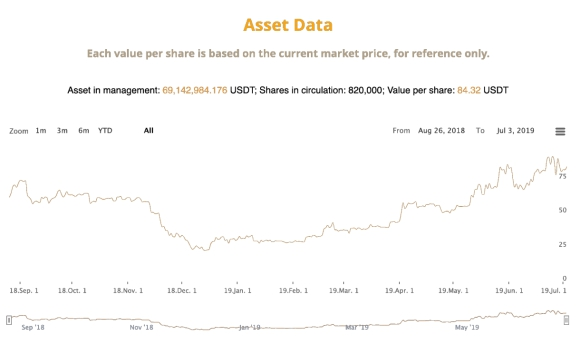

積立投資の事例として適切に提示するため、上記から月ごとのデータのみを抽出すると、下記のようになる：

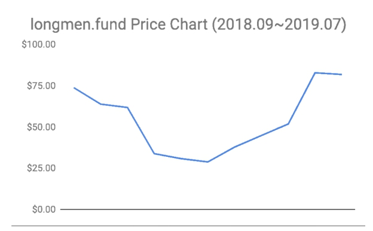 

もしあなたが、2018年9月から毎月、龍門ファンドに1,000ドルを投資し、11ヶ月継続した場合、以下のようなデータが得られるだろう：

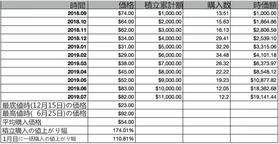

つまり、毎月積立投資の場合、あなたは最高値の2019年6月25日の92ドルと差となり、そして最安値の2018年12月15日の23ドルとも差が生じる……しかし、最終的にあなたの平均購入価格は54ドルであり、現在の価格は約85ドルである。11ヶ月を経て、累計11,000ドルを投資、現在あなたの時価総額は19,141.44ドルである――これはあなたが最後に投資した時の価格の82ドルで計算した結果である。先月より1ドル値下がりしていたにも関わらず、あなたの収益率は実に**74.01％**に達しているのだ！

以下のグラフを見ると、投資金額と現在の収益の推移をよりはっきりと見比べられることができるだろう。

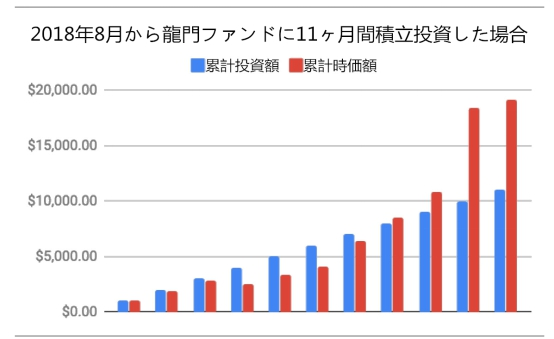

 

以上の龍門ファンドの11ヶ月のデータにより、その価格変動の推移が魅力的な「スマイル・ウェーブ」を描いた。

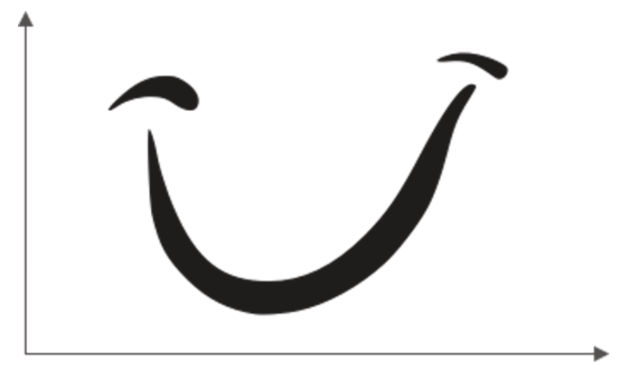 

市場で積立投資方式を用いる人は常に少数である。上記の**「スマイル・ウェーブ」**は、積立投資をしていない人から見ると、おそらく真逆の**「ジョーカー・ウェーブ」**に映るであろう。それは善意な笑顔ではなく、バットマンのストーリーで見たことあるジョーカーの様な邪悪な笑い顔である――まるでその口は悪意ある問いをつぶやいているかの様だ：「Why so serious?」

 

もう一度データを見てみよう。あなたの投資方法が、仮に大半の人がやりがちな、いわゆる「一括投資」……なら、あなたが2018年9月に一括で11,000ドルを投じたとする。すると11ヶ月後には、損することもなく、約**10.81％**の収益を得られた――**74.01％**よりは遥かに及ばないが、それでも損はしていない！

しかし、一括投資の性質から鑑みると、順調に11ヶ月後にアセットを持ち続けられた可能性は決して高くない。なぜなら、一括投資の人にとっては、このウェーブは「ジョーカー・ウェーブ」になってしまうからだ。

投資してから毎月は言うまでもなく、それからの毎日・一分一秒が、極めて苦痛で不安を覚える時間となるだろう。それから実に半年もの間に、あなたが唯一感じ取れることは、自分の資産が一分一秒ごとに目減りしていくことだけである。

苦痛と快楽は非対称的だ。それは私たちのDNAが感じ方を定めている。そして1,000円損した場合の苦痛は、1,000円の収益の快楽より大きく感じられる。あなたの感覚は、もうあの邪悪なジョーカーに弄ばれ苦しめられることになる。そんな時彼は舌を出してあの問いを呟く。「なぜそんなにシリアスになってしまったのか。」と……

もしあなたが積立方式の投資家なら、あなたは全く別世界にいるだろう。その二つの世界は同じように見えても、あなた以外の大半の人は、あなたの見え方を体感することはできないのだ。

**積立投資は、自分の長期の将来を見越して実行し続ける行為である。**故に、自分の将来をかけているのなら、選択するときは慎重に考え抜いたはずだ。当初の購入後の値下がりは、毎回の平均購入価格が下がる、あなたにとってのチャンスである。一括投資の人が厳しい冬を過ごし寒さに震えていた頃、あなたは真逆で、安い価格で購入しお金が増えていく幸せを感じていることだろう……

一括投資の人は長い苦痛には耐えられない。どんな人でも、長期間の苦痛には耐えられないのだ。これは「強い・弱い」とは関係ない。1ヶ月の苦痛の後、2ヶ月、または3ヶ月、さらに後から見るともうすぐターニングポイントに差し掛かる時、つまり6ヶ月目に（またはもう少し前に）、多くの人は様々な原因で退場する――取引市場ではこの行為を「肉を切り落とす（身を削るような苦痛である元金損失を被って手放す）」と呼ぶ。……韮（ニラ）たち（前述の「カモ」の意味）は自分で自分の肉を切り落とす。それが無残な元金損失なのだ。

積立投資をしているあなたはどうなるか？値下がりし続けても手放さないというのは、無理して手放さないだけなのか？いや、そうではない。あなたは本来やるべきことをやっているだけだ！値下がりしている間は、手放すどころか、安くなり続ける価格で購入できて嬉しくなる一方だ。逆に購入が邪魔されようものなら、あなたは怒るかもしれない。投資を邪魔されることは、人生を邪魔されることと同義だ！とさえ思うかもしれない。あなたは厳しい冬を過ごすかのように、寒さに震えるのだろうか？あなたはそんな寒さを感じることもなく、毎月の積立投資を通じて、気分は上々であろう。なぜなら、毎回の購入価格が安いからだ。つまり**「入場時間を早めた（まるで青田買いの様だ。）」**――あなたは毎日の様に後悔にかられ、「ああ！もし知っていたらよかったのに」とか、「どうすれば分かるようになるだろう」とか、出遅れて安いタイミングを逃したと考えるようになるだろうか？……いや。あなたは自分の積立方式が、自分の相対的な入場時期を早め続けていることを知っている。

そして6ヶ月後、価格が緩やかに上昇し始めるとどうだろうか。当初「肉を切り落とした」人たちはこのタイミングで戻って一括投資するだろうか？いや、違う。彼らはまだ恐怖におののいているはずだ。前回の苦い経験が、彼らに恐怖を強くもたらした。彼らが投資市場から離れている間、一切資産を投じることなく、値上がりしているのをただ指をくわえて見ているだけだった。値下がりの時、彼らは恐怖で逃げた。そして今、値上がりしてくるとさらに恐怖にかられた。――彼らの心構えは崩れ、価格はみるみる高くなり、そろそろ次のジョーカー・ウェーブになりそうなタイミングで、彼らはまた入場してしまった……

彼らには、こんな恐怖が繰り返される。どう動いても、感じるのはいつも悪意に満ちた世界のようだ。その訳は前述のように、どの投資ターゲットの価格ウェーブでも、全て無数のジョーカー・ウェーブによって構成されるからだ。それはどんなに恐ろしい事か！

このように、同じような世界でも、立場は完全に逆になりうるのだ。これは実に不思議なことであろう。もしあなたが積立投資を行っていれば、一瞬で同じ世界が別世界になる。あなたが見る価格ウェーブは、無数のスマイル・ウェーブによって構成されるのだ！この世界での幸せは数少ないが、この世界で得し続けるあなたは数少ない幸せな体験をすることとなる。

## **4.** **値上がりのみの投資ターゲットは本当にあるのか？**

あなたは取引市場の不思議さに気づき、ハードルなしで世界で最もスマートな人たちにあなたのお金で働いてもらい、世界で最もスマートな人たちに無料で最良な投資ターゲットを選んでもらえることに気づいたら、傲慢になることもなければ、卑下することもなくなるだろう。なぜなら、取引市場の大半の投資家が中途半端だからだ。――高そうなスーツに身を包むような投資マネージャーでさえも、大半は中途半端なものだ……

そこで、すぐにでも試せる非常に有効なテクニックを教えよう。

あなたに向かってどれほど専門家ぶる人に対しても、あなたは軽く一言、発するだけでいい。

> 「……では、どのようにすれば機会コストを抑えられますか？」

相手の目がすぐに泳ぎ始め、言葉があやふやになり始めることに気づくでしょう……この言葉の威力を疑っているなら、ぜひ何度でも試してみてほしい。

ところで、私たちは市場のスマートな人たちが無料で選んでくれた最良なアドバイスを採用する時に、一つのジレンマに遭遇するだろう。万科株だけを買うか、もしくは貴州茅台・アップル・コカ・コーラ社ないしは、中国タバコのどれか一つだけを買うのか、など、どれを購入するのかというジレンマである。大事なポイントがひとつある。

> **唯一のターゲットに投資する機会コストは無限に大きい！**

これはどんな人でも分かることだろう！

機会コストとは、あなたのお金がもしあるターゲットに投資したら、そのお金が同時に他のターゲットに投資することができなくなるということだ……例えば、あなたがAに投資したら、そのお金を同時にBへ投資することはできない。そして、Bの将来の値上がり分は、あなたのAに投資したお金の将来の収益の機会コストである。

もし、ひとつのターゲットにのみ投資をするのなら、あなたの機会コストは無限大である！まるっきり素人でも、何かしらの方法で機会コストを控えるべき理由が、一瞬で理解できるだろう。投資とは、全方向的に考える力が必要で、収益率だけを考えるのは論外である。その他にももちろんリスク……**「どのように機会コストを控える」**かも必ず考慮にいれるべき重要な要素である！

そのような方法があるのか？絶対にある！簡単な方法は、複数の優秀なターゲットに投資することだ。あなたがインデックス・ファンドやETFを購入する場合、あなたの投資ターゲットはもうひとつの優秀企業かプロジェクトではなく、複数の優秀企業かプロジェクトなのだ！

ここでは小さなポイントが見過ごされがちだ。複数の優秀ターゲットを購入することで、あなたは有効的に機会コストを控えると同時に、あなたの投資ターゲットの性質と品質が変わったということも重要だ！そして、**あなたの投資ターゲットは長期的に見ると、値上がりしかしない、すなわち、値下がりしないターゲットになったのだ！**

そんな事があるのか？いや本当にあるのだ！

優良企業の事業が、右肩上がりであり続けることは非常に難しい。どんなに優秀な企業でも衰退はありうる。あなたが耳にしたことがあるコダック・ノキアなど、多くの企業がそうだ。コカ・コーラ、貴州茅台のような企業の方が極めて稀である。と同時に、それらもいつかブラック・スワン事件に遭遇し、絶滅の危機に瀕する可能性がある。だから、ひとつの最優秀の企業だけに投資するということは、機会コストが無限大であると同時に、ブラック・スワン事件のようなリスクを有効に回避できる方法もないということを意味する。長期であればあるほど、これが当てはまる。

ここで見方を変えてみよう。この世に、長期的に見て値上がりしかしないターゲットはあるのか？実は存在するのだ！**それは、人類の経済発展だ。**

長期的に見ると、証券市場の価格指数がひとつのトレンドのみというのも、そのゆえんであり、上昇、短期の値上がり値下がりが、一つまた一つのスマイル・ウェーブ（またはジョーカー・ウェーブ）を構成し、すべてをつなぎ合わせると、たった一つのトレンドになる。上昇。中で起伏があったとしても最終的には上昇。

以下はS&P ダウ・ジョーンズ・ インデックス500のこれまで40年間（1979-2019）の価格トレンドグラフを見てみよう：

 

あなたが複数の優秀なターゲットに投資する時、あなたが「賭け」ているのは一つの企業ではなく、あなたが「賭け」ているターゲットの先、ターゲット全体の経済発展だ……あなたが中国株市場における複数の優秀なターゲットを購入したら、あなたは実は中国全体の経済発展に賭けた、ということになるのだ！あなたがアメリカの株市場における複数の優秀なターゲットを購入したら、あなたは実は世界全体の経済発展に賭けた、ということになるのだ！――世界中の優秀な企業はアメリカで上場しうる。あなたが[BOX](https://b.watch)（中にブロックチェーン業界の3種の良質な資産がある、それがBTC、EOS、XIN）を購入したら、あなたが「賭け」ているのはビットコインだけ、あるいはあるひとつのブロックチェーン・プロジェクトだけでなく、あなたが「賭け」ているのは、実はブロックチェーン業界全体の発展なのである。

そのため、私が[BOX](https://b.watch)を設計した際、最も重要だと考えたことが、ブロックチェーン技術の発展プロセスだ。多くの場で述べたあのブロックチェーン技術の発展プロセスだ：

> 信頼できる台帳→信頼できるコード→信頼できるランニングシステム→信頼できるハードウェア……

振り返ってみると、2011年、私はビットコインを見逃さなかった；2016年、私はイーサリアムを見逃さなかった；2017年、私はさらにEOSという、2019年当時で時価総額50億ドル、最もヒットしたプロジェクトのエンジェル投資家だった。同様に、MIXIN Networkも、私が多く投資したプロジェクトだ。1回や2回なら、運がよかっただけかもしれない、しかし、3回、4回と連続したとなると、もうただの運では片付けられない。この背景にあるロジックは、これらが、人類が未来に向けて頼れる唯一の使えるツールであるということだ。[BOX](https://b.watch)の設計は下心もなく、李笑来は管理費ももらわないのだ（これがおそらく世界で初めて管理費のかからないブロックチェーンETFだ）。そして、もっと重要なことは、李笑来が全ての人と同じ条件で[BOX](https://b.watch)の積立投資で稼ぐしかないということだ。

実は、証券取引市場の本当の不思議さはこの点にもある。ここではどんな人でも、全人類や全社会の経済発展に追いつけるのだ。グローバル化のよい点は、次のようなことが可能であることだ。：日本経済が衰退している時に、日本人がアメリカの証券を買ってアメリカの経済発展に追いつく。アメリカの経済が停滞している時に、中国の証券をアメリカ人が買い、中国の経済発展に追いつく。たとえ日本の証券を買ったり、アメリカの証券を買ったり、香港の証券を買ったりするのが不便であっても、中国人は世界中の人々と同様に、世界中ほぼどこでも存在するブロックチェーン取引市場でファイナンシャル・インターネットの革新的な決起と発展に追いつけるのだ。

ここに注目したいポイントがある：

> 値上がりのみのターゲットはなく、**長期的にみて値**上がりのみのターゲットだけがあるということだ。

  私は《韭菜的自我修養》の中で、大半の人が誤解しがちな真実を述べている。

> ●取引市場は、即時取引のプロセスにおいては確かにゼロサムゲーム――相手の利益はあなたの損によるもので、相手の利益とあなたの損は同額に見える。
>
> ●取引市場は、長期投資家にとってはゼロサムゲームではない――彼らの利幅は主に経済の増長によるもので、周囲の人の短期的な損から来るものではない。

これも「なぜ一般人が取引市場で頼れる唯一の投資方法が積立なのか」の、最も核心的な要因のひとつである。言い換えれば、長期投資、長期保有（ガチホ）することが安全ということだ。

大半の人は、投資を始めたばかりの時は、それほど多くのお金を投資しない。しかし積立式は、自分の取引市場外で稼ぐ力と長期的な積立紀律を合わせて賭ける――これは実に大きな賭けだ！あなたの時間は絶対的な資産であり、機会コストは無限大の資産である。だから、最も価値のある機会コストを無限大である優秀な資産を投資する際に、あなたはただ絶対安全なターゲットしか選べないのだ。そのターゲットとは何か？それは人類全体の経済の発展だ。他にはないのだ。

現在のタイミングから見ると、ブロックチェーン市場は証券市場より優れ、証券市場は不動産市場より優れ、不動産市場は債券市場より優れ、債券市場は銀行貯金より優れている。投資家は積立投資の開始初期はそれほど多くのお金を調達できないため、自分の将来を賭けて投資をする。そのため、投資のターゲットを選ぶ際は、様々な要素をもとに考え尽くし、最優なターゲットを選び抜くのだ。もし将来、最も優秀なターゲットがブロックチェーン市場でなくなったとしたら、他の最も優秀な市場に乗り換えるべきだ――これは別に口先だけの信念によるものではなく、実用主義（プラグマティズム）の価値観によるものだ。

この様な優れた選択は、あなたに不思議な感覚をもたらし、あなたは驚くだろう。「なぜ私は、こんなにも簡単に大半の人が想像もつかないような事実を見て分かったのか」と。

> 空の雲の境目は、実は地上の都市の境目とは、全く関係ない！

人が天気予報を聞いて今日の天気を判断している時に、あなたは既に空に視線を投じ、どの雲が雨になるのかを判断しているのだ……**レベルが**もう明らかに違うのだ！世界が違うと言っても過言ではないかもしれない。

最後に、これらよりも重要なポイントを補足する必要がある。

> 積立は長期・持続的に投資する行為であり、投資のターゲットは**「長期的に見ると上昇し続ける」**という属性の条件を満たさなければならない。

この条件を満たすことが極めて厳しいターゲットの場合、その結論は明らかである。債券・金・不動産――ましてやファッショナブルなスニーカーなどは、条件を満たす積立ターゲットではない。なぜなら、この必須条件をまったくもって満たせないからだ。この前提を踏まえると、あなたもすぐに分かるだろう、バフェットがテック株に異常に慎重な一方で、コカ・コーラに対しては慣用的な理由を……

## **5.なぜ、ほんのわずかな人しか積立投資を選ばないのか**

ここまで読んだあなたはきっと、好奇心にかられると同時に疑問に思うだろう。

> 積立方式が人の階級の固定化から脱却する唯一の頼れるルートなら、この方式をとる人がこんなにも少ないのはなぜか？

ある具体例を見てみよう。

> 中国では、大半の家庭が必死に積立している！

これは世界中を見ても、おそらく同じような状況だろう……しかし、大半の人の積立ターゲットは不動産だ。このことは、一体何を意味するのか？それは、実質的にはほぼ全ての人たちに積立投資の能力があるということだ。

しかし非常に残念なことに、全世界の人々は銀行に愚弄されている。人々は銀行から借り入れたローンに巨額な利息を支払うために、人生で最も生産能力の高い時期であるはずの2-30年間もの長い年月を不動産への積立に費やし、カタツムリのような一生を送るのだ。

この大半の人たちは、自称・他称問わず「家の奴隷（家のために一生苦労して働く）」である――たとえ経済が上向きの時代でも、ローンで家を買うことはそう簡単ではない。彼らは家の奴隷ではなく、本質的には銀行の奴隷だ。本質を知ることはとても恐ろしいことだ。家の奴隷たちは、真相を全く見ていないのだ。

> 彼らは人生で最も生産能力の高い時期に、家2つ分のお金で、家1つを買ったともいえる。ローンと2-30年間の利息の合計は、ほぼ不動産の価値と同じで、これは銀行のアクチュアリー達が予め苦心して演算した結果である。

あえて比較する必要もないのが、あえて比べてみよう。

  あなたとあなたの同級生二人が18年前、それぞれ別の選択をした。あなたはローンで家を購入することを選択した。つまり、不動産に積立投資することを選んだ。一方、あなたの同級生は茅台社の証券を選択した。彼は無知だったため、無料で使える市場の最もスマートな人たちの無料アドバイスを選ぶしか方法がなかった。18年後の今、この二人を比べてみるとどうなっただろうか？

仮にあなたが最初に買った不動産が、北京の不動産であったとしよう。北京の不動産価格上昇は、これまで中国で最も多い年間増長率が約18％であり、四捨五入すると、これまでの18年間であなたの不動産価値が20倍も増加した計算になる。これは驚くべき事だ！しかし実際には、こんなに楽観的な結果ではない。なぜなら、あなたは利息を支払わなければならないからだ。あなたが約2倍の価格で購入した不動産であなたが得られる価格の増加は20倍ではなく10倍なのだ。購入して18年間でローンが合計30年間の場合は、最初の何年間かは、あなたは元金を返せても、まだ少なくとも半分の利息が返済できていないのだ。つまりこの10倍の中でもあなたが本当に得られたのはその3/4、即ち7.5倍である……しかしこれは、あなたが不動産価格高騰前のいいタイミングで購入できた場合の話だ！2018年から不動産に積立投資し始める人は、2036年まで見てみると、そんな高い収益を保証できないだろう。

ではあなたの同級生はどうなったのか？彼がもっている茅台の株価が過去の18年間で180倍になった。それを年率換算すると、33.45％に相当する。しかしあなたの同級生は、当初の最安値で一括投資したわけではなく、今まで毎年ずつ積み立ててきた。さすがに彼が得られるリターンは180倍に及ばないが、それでも実に40倍くらいだ……

この比較の結果はちょっと酷いものだが、実はもっと絶望的な例がある。それを知ると、あなたはさらに不快になるだろう。

> ●あなたの不動産は確かに資産だが、流動性が非常に低い。
>
> ●あなたの同級生の株は同じく資産だが、その流動性は100％に近い……

資産にとって、流動性は決定的な要素だ。流動性なしでは、いくら価値のある資産でも価値がない。それはあたかも、ピストルには確かに弾が入っていて、敵を前にしているにも関わらず、その弾がひっかかって撃とうとしても撃てないようなものだ。それが「あなたの同級生の収益は実際には40倍」という理由だ。その資産は、流動性が実に高いのだ！

この比較は本当に不快なものだが、現実的には考えにくい。実際に起こる可能性が高いのは、同級生が茅台の証券に積立投資しないということだ。実際、これまでの18年間ずっと茅台の証券に積立投資してきた人は、片手で数えられるくらいだ。このような比較例が実際にあなたの身におきる可能性は、現実的には低いのだ。

> 積立投資とは、実は一つの**社会的な行動及び社交的な行動である。**

そのため、同級生にはあなたを不快にさせられるような将来があるはずもない。確率が極めて高いのは、彼の運命があなたとほぼ同じであるということだ。人間は社会的な動物で、同じ社会で生存しており、社会化の影響を強く受ける。あなたが結婚すれば、彼も結婚する、そうだろう？あなたはどうして家を買うのか？それはあなたの考えではなく、あなたの義母の考えだ。あなたが家を買わなければ、義母が安心して娘を嫁がせられないからだ。同級生の義母は違うとでも言えるだろうか？8-9割の高確率で、彼女たちは皆同じ考えを持っているだろう。この社会の大半の母親は、家も買えないような男に娘を安心して嫁がせることはできないのだ……これは彼女たちのせいではなく、皆がそうなのだ！

そして、北京・上海・広州・深圳のような大都市で最も多いのが俗に言う「千万負豪」だ――彼らの資産は、不動産を含めると少なくとも数億円レベルだが、彼らのポケットは常に空っぽで、使える現金があまりなく、かつ月々多くのローン・利子の返済が待っている。もし彼らに子どもができたら、状況はさらにシビアになるだろう。彼らの不動産が、いい進学校のある高いエリアを意識的に選んでいたなら尚更だ。資産から見ると貧乏ではないが、それでも家族全員が十数平米か二十数平米のうさぎ小屋の様な家に、ギュウギュウ詰めになって苦楽を同時に味わいながら暮らしているのだ。

積立投資の策略には、以下のいくつかの要素がある：

> ●ターゲットは一体何か？
>
> ●長期とは一体どのくらいの期間か？
>
> ●定期とは一体どのくらいの間隔か？
>
> ●毎回の投資金額の上限・下限はいくらか？
>
> ●想定外な事態が起きたときはどうするか？

不動産積立投資を、上記に当てはめてみよう。

不動産積立は巨大な社会的力が動かす。したがって、ターゲットはあまり考えなくてもいい。長期というのは銀行のアクチュアリーに定められている。なんとなく積立をはじめた人たちはそれについての関心もなく、彼らは皆、銀行からローンを借り長期返済している。その期間は大体30年間だ。定期の間隔というのも銀行が定めた通り、毎月だ。投入金額は逆算すればいいので、物件がよいと金額もその分高く、物件が悪いとその分金額も安くなる。もし想定外な事態が起きたらどうするか？人生はいつも想定外な事ばかりで、その時になってからまた考えよう！それではいけないのだが、現実はその通りだ。もし本当に想定外な事態が起こった場合は、借金をしてでもローンは返さなければならない。

しかし、 積立取引市場のターゲットは違うのだ。世の中のコンセンサスは大体以下のようなものだろう。

> ●「そんなの信頼できないでしょう？」
>
> ●「リスク大きいでしょう！」
>
> ●「あてにならないよ！」
>
> ●「私たちには全然わからないよ！」

  さらにもっと恐ろしいのが、

> ●「知ってる？あの人株で大損してビルから飛び降りたの！」

大半の人にとって、株の投資は絶対投機であり、投機は誰ひとりとして、いい結果がないのだ。それら全ての事をひっくるめて投資だと思っているので、積立とは何か、なぜ積立なのか、どう積立するのか、大半の人は全く分からない。その訳は、積立と一緒と考えている株投資で身の回りに成功した人の事例がないからだ。

そのため、この強い現実社会化の影響下で、積立方式を選んで証券に投資する人はほんの少ししかないのだ。

しかし今、インターネットが世界を変え続ける中で、このような積立投資家が直面するように定められていた孤独は、非常に解決されやすくなるだろう。積立投資コミュニティの誕生と発展が、この問題を解決しつつあるのだ。

大衆の意見に従う考え方がいいとは思えないが、その考え方に大きなメリットがある場合もある。例えば、家ではエクササイズは続けにくくても、ジムにお金を払い、高いトレーナー料金を支払うと、どんなに遠くのジムでもエクササイズをするようになるだろう。また、本当は独学でできる勉強も、優秀なメンバーが集まる教室か、寮の寝室ではもっと勤勉に、もっと努力し、より自然と優秀になるだろう。

**積立投資のコミュニティに参加するのは最優の方法だ。**もしあなたが[BOX](https://b.watch)に積立投資したいなら、[b.watch](https://b.watch) コミュニティに参加すべきだ。もしあなたがアメリカ株、あるいは香港株に投資したいなら、ネットでそれらの良質なコミュニティを探すべきだ。なぜなら、それ以外のところでは、あなたは変わり者扱いされ、何を言っても理解してもらえないからだ。同じような物事でも、相手は全く逆な意見か考えをもつ。理解してもらえないならまだしも、ひどい場合は蔑視される可能性もあるのだ。そうされるいわれもないのに、そのようなひどい目に遭わなければならないのは耐えられるものでもない。何もわからない人に馬鹿にされる、その心境を想像してみてはどうだろうか？

しかし、積立投資のコミュニティであれば違う。積立しない人が変わり者になるのだ。重要なのは自分と同じ考えも持つ人がいることによって、自分は孤独ではないということを実感できることだ。

## **6.なぜ彼らはあれほどに頭がいいのに、いつも間違った判断をするのか**

取引市場での投資を始めるまでは、自分が極めて正常だと誰でも思う……

しかし投資を始めてまもなく、大半の人は肩を落とし落胆する。なぜなら、大半の人は絶望的なことに気づくのだ。それは、**以前の全ての操作が間違っているということだ。**一回や二回ならまだしも、なぜ全ての操作が間違ったのか？こんな結果は誰であれ、素直に受け入れることはできない。

大きく値上がりした時に、自分は早くから売り払っていた。激しく値下がりしたのは自分が買ったばかりの頃だ。ある時は自分が設定した高値で売れたかと思いきや、後で設定していた安値で売り払っていたことに気づいた。あるターゲットの値上がりが遅いので、他のもっと速いターゲートに全部乗り換えたら、高速の車線変更のように、自分がいるところがいつも一番遅くなってしまった……

ある株市場の冗談が、そのカモたちの思いを実にうまく描いている。

> 私にはどうしてもわからないのだ。なぜか私のような小口の素人が、マーケット全体を左右しているようなんだ。例えば、値上がりがどんなにクレイジーでも、私が一旦買うと必ず下落する！たとえ30日間下落し続け、さらに下落しすぎてストップになったとしても、私が売ると必ず上昇する。私が売り払うと値上がりし、私が持ち分を増やすと全体がどん底になる。手に数百億元を持つ大口投資家たちが、私ごときの数万元を狙って逃がさないなんて一体なぜだ？！

この様に皆しばらく投資を行うと、自分が病気だと疑い始めるのだ。

実は本当に病気なんだ――**バカ病だ**。

ところで、**「馬鹿」**と**「愚か」**は実は別物だ。

馬鹿とは、もともとのIQ値が低いことを指す。愚かとは悟っておらず、よい教育を受けられていないことを指す。原始人のIQは決して低くはない。梁啓超（中国近代の有名な革命家）のIQも低いはずがない。しかし、原始人も梁啓超も、たとえアインシュタインでも、もし時空を超えて彼らが今に来たとしたら、ビットコインをすぐには理解できないだろう。それが「馬鹿」と「愚か」の違いだ。

愚かは馬鹿ではなく、未開化なだけだ。良好な教育を受けて開化していない為、このような結果になったのだ。これは生まれつきではなく、よい教育を受けたかどうかの差である。もし一人の8歳の原始人が時空を超えて今にきた後、学校に通って勉強したとしよう。さらに高校でも勉強すれば、どんなに馬鹿でも万有引力の法則をある程度は分かるようになる。コインの裏表の確率が同じであることも、ある程度はわかる様になる。もはや馬鹿でも愚かでもない。そして最終的には、コペルニクスや祖沖之より賢く見える様になるのだ！

取引市場に入ったばかりの投資家は、理論上は原始人が現代の金融市場に入ったようなものだ。彼らは馬鹿ではないが、まだ未開化で、教育を満足に受けておらず、愚かであるがゆえに、左右の違いがわからない。他の所では、左右がわからないことがたいしたことでないかもしれない。しかし、金融市場ではそうはいかない。毎回の愚かな判断の後には、お金の損失が待っている。非常に残酷なのである。

このような境遇では、大半の人は浅はかな結論に至ってしまう。それは、「ああ、私はこんなことは向いていないのだ！」、「うう、運が実に悪い！」、「もう私にはそんな運がないのよ！」、「ふぅ、おれのような人間にはちゃんとした仕事だけやっていればいいんだな……」

特に最後の文句は、ただ自分の愚かさに言い訳をしているだけだ。今までラブレターをもらったことのない人が、ラブレターをもらったことがない事実に対して「私はそんな人間じゃないんだから」と言う。まるで、ラブレターをもらった人たちがとても浅薄な人間のような言い方だ。

この様な症状が現れ、病巣も見つけたところで、どうやって治療するのか？

> **治療法はこれしかない。積立投資だ！**

取引市場には、頭のいい人が大勢いる。しかし、彼らは頭がよくても、愚かでないとは限らない。だから彼らは、何度も損をしている。積立投資、それはただの投資策だけでなく、別の観点から見ると、積立は必ず実行に落とし込む行為である。積立は理論上、最良な投資教育であり、最良の投資教育実践の場でもあるのだ。頭がいいかどうかは実は重要ではなく、重要なのは、積立を継続して実行している過程で、最良な投資教育を身に着けられることだ。積立投資家は、徐々に愚かさから脱却し、やがて文明にたどりつく。この過程を経ることこそが、最も重要なことなのだ。

たとえ症状がわかっても治療できないときは、人は自分に都合がいいように解釈しがちだ。取引の失敗についての彼らの結論は、驚くべき程に一致する。「ああ、貪欲しすぎた」。「貪欲」の一言で全てを解釈する。――しかし本当にそうなのだろうか？

次のような光景がよく見られる。ある投資家が、あるターゲットを買い入れた。仕入れ価格を仮に10元としよう。このターゲットが20元に値上がりした時、彼は売らなかった。しかししばらくして、このターゲットは値下がりし続け、とうとう彼が耐えられない値まで下がり切ってしまった。12元まで値下がりした時、彼が売り払ったとしても、2元まで値下がりした時に彼が売り払ったとしても、彼はとても後悔するだろう。そしてその後悔から出る結論は、「うう、私は貪欲すぎた！なんで20元の時に売らなかったのか？！」である。

取引市場では貪欲が普遍的であり、皆が貪欲だ。でなければ、どうして市場に来たのか？そもそも貪欲は罪なのか？いや違う。人は概念を混同させる力が強い。特に、全く逆の二つの概念をひとつに混同させる力は絶大だ。大儲けした時には彼らは貪欲さを雄心と呼び、大損した時には彼らは貪欲さを罪と呼ぶ。このような曖昧な定義は、自分を混乱させること以外に一体どんな意味があるというのか？

根本的な原因は「貪欲さ」にはない。原因は明白であるはずだ。

> その原因とは、その投資家が合理的な価格であるかどうかも判断できないターゲットを買ってしまったことだ。

10元の時に、彼はその10元が合理的かどうか分からず、20元の時でも、彼はその20元が合理的かどうか分からなかった。12元、2元の時でも同じだ。彼は相変わらず、その12元あるいは2元が合理的かどうかが分からなかったのだ。

彼は一体、何にしたがって行動しているのか？それは、いわゆる「フィーリング」と言われるものによって行動している。プロフェッショナルの言葉で言うと、**「目的地もなく散漫と歩いているだけ」**だ。散漫と歩いているだけで得られる結果は、ステップ踏みの運動と同じで、前には決して進まない。そして、彼らの運命は、目的地もなく散漫と歩いているだけの人にも及ばず、彼らはステップを踏み続けるだけ、いわざ現状維持ではなく、徐々に失敗の地獄へと後退し、堕ちていくのだ。

このバカ病を、積立投資はなぜ治せるのか？

 今まで述べてきた通り、積立投資とは、初めからほぼ必然的に長期的に値上がりするターゲットをロックオンし、そのターゲットは [BOX](https://b.watch) のような機会コストを抑えたものであり、投資対象は一つのプロジェクトではなく、新興産業全体の発展に賭けている。積立投資は本来、もともと決めていた複数の投資対象を、トレンドに則って長期に渡って持ち続けるものだ。

つまり、初めから購入の意思決定が合理的であり、何年か経ってから、或いは一定の長期の時期が経ってからでないと結果を得られないのだ。その期間中は、最終的な結果が分かるまでは高くても低くても、値上がりしても値下がりしても、全ての価格は合理的である。

この前提でいくと、購入時の価格が数パーセント上下に動いても関係はない。値上がりしても値下がりしても、自分とは全く関係ない。それは市場を散漫と歩いているだけの多くの人たちが出している騒音にすぎないから、何年か経ってから結果を見ようという気になるのだ。

## **7.どうして人々は最も優秀な投資ターゲットとすれ違ってしまうのか？**

既に何回も繰り返しているが、場合によっては他の観点から見る必要もある。

> 私たちが選ぶべき銘柄の中には貴州茅台があり、私たちが長期に持ち続けるべき銘柄の中にも貴州茅台がある。しかし、実際のところはどうだろうか？実際には、現在茅台株を持っているのは、0.05％にも届かない投資家のみであり、長期間持っている人の比率は、おそらくこれよりもずっと少ないのだ……

では、99％以上の投資家は、最も優秀な投資ターゲットとなぜすれ違ってしまったのか？誤った訳でもないのに、彼らは**奇妙に**もすべての**優秀**なターゲットとすれ違ってしまうのだ。この比率で茅台とすれ違うのなら、万科ともすれ違い、テンセントともすれ違い、コカ・コーラともすれ違い、ビットコインともすれ違うのだ！ここで説明すべきことは、貴州茅台の株価はこれまでの8年間で180倍値上がりし、ビットコインはこれまでの8年間で1-2万倍値上がりしたという事実だ……

やはり病気なのだ。**長期収益に恨みでもあるかのような病気なのだ。**

多くの人は最も優秀なターゲットを買ったことがないわけでもなければ、長期間持ち続けたことがないわけでもない。

これもよく見る病気である。

症状はこうだ、彼らが言うには**「もうこれだけ値上がりしたんだから、これ以上は上がらないでしょう？！世の中に上がり続けるものはあるのか？！」**そして、冷静に売り払ってしまうのだ。

もし、彼らが手放したターゲットが、その後確実に下落するターゲットならば、彼らの判断が正しかったのかもしれない。しかし問題なのは、あなたが目にする大半の場合の事実はその逆である、という現実だ。彼らは自分たちが思い込んでいるいわゆる「高値」のつもりによって追い出されただけだ。――実際高値でも安値でも、かなりの人が追い出されてしまうのだ。

積立方式の投資家はどうだろうか？積立の投資家は違うのだ。原理は同じだ。長期の値上がりを見込んでいなければ、最初から積立しない。積立は一過性の投資活動ではなく、長期にわたり定期に投入し続けてこそ成り立つ行為だ。だから一時的かつ短期的な高値や安値は、積立の投資家にはあまり影響しない。積立の投資家は、やるべきことをただやり続けるだけだ……

前にも述べたように、長期の成長を見込んでいるからこそ、自分の将来を賭けているのだ。そのため、積立の投資家が頼りにするのは、市場で最も「賢い」人たちが選んだ複数のターゲットのみだ。投資家でも投機家でも、自分たちのお金で選んでいることに変わりはない。そのため、全ての良質なターゲットには、ある同じ特徴が自然に出てくる。それは、**時価総額が非常に高く、流動性も非常に高く、資金が比較的非常に分散しているという特徴だ。**積立の投資家はこの様な簡単な方法で、彼らから見て信頼でき、長期にわたって値上がりするターゲットのみを選んでいる。価格変動を見ていても、彼らはリアクションを起こさない。ノーリアクションである。

一方で、積立投資をしない者の病気はこれだ。**「このターゲットは高すぎるんじゃない？」だ**。例えば中国の株市場の茅台、例えば誕生から10年経過したビットコイン。大半の人にとっては、茅台の株価やビットコインの価格の絶対値は高そうに見える。彼らは怯えつつ、いわゆる頭のよさや知恵で「次に十倍値上がりしそうな株」、「ストップ高株」或いは「次に百倍値上がりするコイン」を探そうとする。しかし、その大半は成功しないのだ。なぜなら、投資は価格を見るのではなく、値上がりのポテンシャルを見るものだからだ。多くの人は基数が小さければもっと上がりやすいと思い込みがちだが、それは全く根拠のない事だ。

しかし、積立の投資家はその落とし穴を回避できる。**積立の投資家の唯一の判断基準は、「そのターゲットが長期間持つに値するか」だけだからだ**。この基準が至って簡単だから、間違えようとも間違えにくい。積立の投資家は、投資ターゲットの価格の絶対値が高すぎる様に見えてもやめようとはしない。そのそれは考慮すべき核心ではないからだ。絶対値が高かろうが、長期的に値上がりするはずなら積立すべきだ。そして、長期・定期的に投資しているのだから、自然と長期的に持ち続けることになる。これが積立の投資家が、アップル社の時価総額が5,000億ドルの時でも買い続け、6,000億ドルの時でも買い続け、7,000、8,000億ドルの時でも買い続ける理由だ……一兆ドルになったら？買うべきなら買うのみだ。これが、なぜ積立の投資家がビットコインの価格が100ドルの時でも買い、1,000ドルの時でも買い続け、10,000ドルの時なお買い続け、そして4,000ドルに値下がりしても買い続ける理由だ。積立投資はこうであるべきなのだ。

不服な人ももちろんいるだろう。そして彼らは「まさか永遠に売らないのか？」と言うだろう。この判断は、投資家の財力と知識による。ここでバフェットのある言葉を考えるべきだ。**彼は「私の長期は永遠だ」**と言っている。この言葉は、いつも多くの人たちに誤解されてしまう。私が個人的にこの言葉から学んだことは、「永遠に持ち続けるからこそ、ターゲットを選ぶ時は十分に慎重に、努力を尽くして研究を重ねてからやっと選ぶのだ。その後は、自分が選んだことを自己責任として永遠に自分が責任をとる」。

他にも小さな問題点がある。**「まさか永遠に売らないのか？」**と疑っている人たちは、この事実を体験するチャンスは、残念ながらないだろう。本当にお金持ちになったら、お金に困ると心配するだろうか？お金を使いたくないと不安になるだろうか？お金を使うのも面倒となるだろうか？その境地に至るまでには、もっともっと実力が必要なのだ……本当に階級を超えたなら、人は絶対にこんな疑問を持たない。

もう一つの病は、前にも述べた**「頻繁に車線変更する」**という病だ。まるで、渋滞で何度も車線変更する人のようだ。例えば、彼らがあるターゲットを買った、としよう。しかし間もなく、自分が持っているターゲットよりも、他のターゲットがずっと値上がりしてしまった。彼らは耐えられなくなり、車線変更し、自分が持っているターゲットを売り、より値上がり幅の大きいターゲットに乗り換えた。しかし、新しいターゲットが自分の手に入ってから間もなく、値上がり幅が縮み、さらには値下がりし始めてしまった。運の悪さに屈服した彼らは、また元のターゲットに戻るかもしれない。そして、自分が投資に向いていないと認めるまで、これを反復し続ける。

積立の投資家は、自分たちが見込んで定めたターゲットを、他のターゲットと比べない。なぜなら、もう既に十分に比較したからだ。そうでなければ、なぜ積立のターゲットにしたのか？[BOX](https://b.watch) 積立の人はなおさらだ。早くから選別し、複数のターゲットを選別したのだ。彼らは自分がなにをやっているのかはっきりと認識している。自分たちが機会コストを抑えたことを、そして自分たちの投資ターゲットは、どれをとっても単独のブロックチェーンプロジェクトを超えており、賭けているのは業界全体の発展であるということを。積立ならば、その時々に見える優劣は単なるノイズでしかなく……影響も受けないのだ。

以上の内容を何度も繰り返し述べているが、どうかくどいと思わないで欲しい。

> **繰り返して述べているのは、積立投資が不思議すぎると同時に、簡単すぎるということを伝えたいからだ！**

私は常に信じている。この世に存在する多くのシンプルな手段によって、全ての人をあらゆる落とし穴から回避させられる、ということを。しかし、様々な原因によって、大半の人はいつも複雑で大げさな他の方法によって、自分たちの人生を無駄にしてしまうのだ。

随分昔の話だが、英語を教えている時、私はふと気づいた。なぜ皆、大げさなことばかりしているのか？毎朝一時間朗読すれば、それが何よりの方法なのに。英語が上達しない理由は簡単だ。話足りないのだ。他に原因はないのだ。なぜか毎回、私がこう言っても認められない。大抵「自分はこんなにたくさんの困難に面しているのに、なぜあなたのそんな一言で片づけられないといけないのか？」と思っているからだ。しかし、彼らは知らないのだ。自分たちが多くの困難や落とし穴に陥っているのは、自業自得であるということを。彼らは、単にあちこちの塾にお金を払って申し込んでは、ありとあらゆるいわゆる早道な方法を探し続けるだけだ。

私がライティングを教えていた時も、同様の問題に気づいた。最も重要なことを皆、頑としてやらないのだ。それは、有効なリーディングの量を増やすということ。この理屈はいたって簡単だ。インプットなしではアウトプットの原料がない！リーディング量の少ない人が、多くの人を楽しく読ませる文章を書いている所を私は見たこともなければ、想像することもできない。これは私一人だけの観点や推測ではない！ノーベル文学賞を獲得した中国の作家莫言もこう言っている――《[莫言十一学校講演：読書は創作の一番の先生](https://mp.weixin.qq.com/s/d1zlEFpi7tIKIT5wVILL3w)》。作家の先生に様々な奇妙な創作テクニックを強要したり、お金を払って塾に通い、変なタイトルで読者を惑わせる邪道を学んでいたりしている人が多い。どうしてもやりたがらないのが、最もシンプル・ダイレクト・有効で最もやるべきことをしない。それこそが、もっと本を読んでムダ話をやめるということだ！

もうひとつ、面白い現象としてダイエットを挙げる。一番簡単な方法は、実はエクササイズを続けることだ。科学的に見ると、これより有効な方法はないはずだ。しかし皆、あえてそうしない。多種多様な邪説こそ受け入れやすいのだ。これを飲め、これを食べろ、これがダメならあれをやれなど。頑としてエクササイズはしない。私は何がしたいのかさっぱり分からないのだが、これはダイエット市場の操作によるものだろう。毎年世界中に何百種、いや実に何千種もあるダイエット商品の新作が堂々とデビューしている。歴史を見ると例外なく無効だと証明されていても、ダイエット市場は消費市場で最も大きな市場になっている。そして、エクササイズしない彼らの言い訳は、「エクササイズは人間性に反している」である。ああ、彼らは自分たちの人間性を全てを他人の人間性と混同してしまっているのだ。そんな勘違いをしている人に、私たちはなんと言えばいいだろう？

**積立投資は、たった一つの方法がその全てだと言える。**多くの人は、その一つの方法の積立を見限ってしまう。簡単過ぎるのだろう。簡単な方法と複雑な方法なら、人びとは複雑の方を選びがちだ。複雑の方が、レベルが高そうに見えるからだ。もしくは、レベルが高い様に勘違いしてしまうのだ。しかし、くれぐれも注意してほしい。**積立の最大の威力は、方法がたった一つであるという所である。**方法が一つであれば、他にオプションがないため、それをやるしかないのだ。あなたは、そのたった一つの方法だけを行う。それが唯一行う行為である。そして、その行為は永遠に間違えないのだ。

対して、彼らのような多くの術を持っているつもりの人たちはどうだろうか？論理的に分析したら、彼らのデメリットがよく分かる。

例えば投資行為において、積立の投資家はたった一つの行為のみ、買うだけだ。対して、多くの術を持っている彼らはどうか？あるいは、積立でない投資家は？彼らは「買うべき時に買う」、そして「売るべき時に売る」。問題なのは、「**いったいいつが**買い時か、いつが売り時なのか？」だ。しかし彼らは、その時期を実は知らない。**知っているような顔**をしているだけだ。

もし、彼らが毎回買うべき時に本当に買って、売るべき時に本当に売り、当て続けられたらどんなによいだろうか！しかし現実はどうだろう？毎回神様にでも助けられない限り、彼らは半分の確率で買うべき時に売り、そして同様にまた半分の確率で売るべき時に買ってしまう。彼らは術が多い分、自分の成功確率を100％から25％まで低めてしまったのだ！

あなたがもし「私がまさか毎回半分の確率で間違えるわけがない」と思うならば、この計算式をみてほしい。あなたが毎回8割成功の自信があるとしても、あなたがいつも正しい確率は80％×80％＝64％だ。100％には遥かに及ばない。もしあなたが本当に自分のお金で試行錯誤を重ねていったら、あなたは確実にある結論にたどり着く。8割どころか、6割でも難しい。6割でもできたら御の字だ。しかし、6割の場合、毎回の成功率はたったの36％だけだ。これが「なぜ大半の投資家が最終的に自分のすべての操作が間違っていると思うようになる」ことの解説だ。現実的には、短期の価格変動は**散漫と歩いている**ようなもので、全く正確に予測できないということが理解できたら、あなたにも分かるだろう。彼らの成功率は50％×50％＝25％。これ以上でも、これ以下でもない。

さらに恐ろしいのは、彼らは積立投資の様に一つの方法だけではなく、もっと彼らの術は多いということだ！例を挙げると、彼らは短期で売り買いを繰り返すだけでなく、彼らはさらに複数あるターゲットの中で頻繁に車線変更するのだ……毎回正しい車線に変更できる保証の確率はそもそも低いのに、彼らは延々と変更し続けている！これでは、たとえ毎回80％の成功率があるとしても、前後4-5回も変更を繰り返していくと、成功率は絶対40％以下に落ちるはずだ……

計算してみれば、間違える確率の方がもっと高いはずだ。

各種のテクニックを研究し続ける投資家たちはもっと無残だ。彼らは2つや3つの方法だけでなく、さらにもっともっと多い！市場によく出回っている「投資のバイブル」などを読んで自分は悟ったと勘違いし、自称・他称の投資マスターのセミナーに参加すれば、投資のことが全て理解できたつもりになる。そして十分に検証することもなく、待てずに新しく習得した方法を使ってしまう……他の場面であれば、新しい方法を探して実践することはいい習慣かもしれないが、あいにく投資の領域ではこの習慣は死ぬほど有害である――実際、大半の投資家はこの様な自業自得な行為によって失敗してしまうのだ。人が試行錯誤できるチャンスは、贅沢に浪費できるほど回ってはこないのだ。

大半の人が最も優秀な投資ターゲットのすべてとすれ違う核心的な原因は、様々な原因により、一番安全で頼れる一つの方法を彼らが頑に使わないということだ。その方法こそが、積立投資である。

## **8.積立投資戦略を成功させる鍵は心の修練にある**

生活の中で最も興味深い感覚として、下記のものがある。

> 人は全員が同じ世界にいて、頭の上に同じ青い空、足元に同じ大地があり、同じ空気を吸い込んでいる……しかし、感覚や思考、意思決定は往々にして全く異なる。

それぞれが同じにならないのではなく、**全く異なるのだ**。この現象の原理は、私の著書《通往財富自由之路》の中で詳しく書いている。

同じ価格ウェーブ一つとっても、一部の人の目にはスマイル・ウェーブとして映り、他の人の目には全く違ったジョーカー・ウェーブとして映る。結果として、その後の行動も全く異なってくる。

取引市場は、一部の人々にとってはゼロサムゲームで、基本的に彼らにとってはカジノと同じだ；しかし、その他の人にとって取引市場はゼロサムゲームではなく、経済発展に歩調を合わせるために最適な場所である。

これと同様に、同じ投資指標や同じ価格に直面しても、ある人たちの目から見れば、それは売り時であり、他の人たちの目から見れば、それは絶好の買い時となる。この状況を風刺してこう言うこともできるだろう：

> 取引市場においてどちらか一方だけで取引は成立しないため、売り手と買い手は取引後にもお互いを大事にするべきだ。ただ、彼らは常に暗闇で密かに忍び寄り、別の馬鹿を見つけようとしているようだ……

李笑来の著書についても、これと同様、読み手は2つに分かれるはずだ。この本は実践者にとって最良の指南書だと信じる人もいれば、間違いなく読者に投資をけしかけるための本だと考える人もいる。

また、この世界では階級の固定化が進んでおり、普通の人には全くチャンスがないと考える人もいる。しかし、同じ青空と空気の下で、私たちは別の結論に至っている。**人々は階級の固定化を超えて、そして国・地域・民族・性別・年齢・容姿・性的指向を問わずに機会がある、と！**

これは私がよくいう**鏡の世界だ**。鏡の中と鏡の外では、それは同じ世界のようだが、これら二つの世界のどの点を取っても完全に反対なのだ！

左ハンドルで右側を走行する、中国のような場所に長い間住んでいたと想像してみてほしい。ある日突然、あなたがイギリスに行き、右ハンドルで左側を運転しなければならないとしたら、多少は混乱するだろう。そして、その変化に慣れるまでしばらく時間がかかるはずだ。

これは、私たちが突然別の鏡の世界に入ったときに直面する問題だ――ここでの危険性は、走行車線とハンドルの場所に適応することよりも高い。というのも、失敗が破滅のような結果になることもあり、いやそうなってしまうとむしろ死んだ方がましと思うこともあるかもしれない。

トレーディング以外で、私はトレーディングのような、**心の修練がすべてに影響を**及ぼす分野を見たことがない。

すべての学習や進歩は脳によって行われ、すべての調整や修正は脳によって行われ、危険な認識や危険回避はすべて脳によって行われ、制御不可能な危険な感情はすべて脳から発生する。推測・推論と長期検証は、すべてあなた自身の心の中から起こり、そして完結する。要するに、すべてはあなたの脳の中で起こるのだ。

脳の外側にあるものはほとんど意味がない――バフェットによると、ほとんどすべてが**ノイズ**にすぎないという。トレーディング以外の物事は、そうではないだろう。トレーディング市場とそれが必要とする技術を、私が小さい頃読んだ武術小説や神話、あるいは伝説として読んだものに例えると、最も重要なものは――修練である。私たち人間にとって、この脳以外、このような機能を持っていないからである。

引用

> ……His peculiar gift was the power of holding continuously in his mind a purely mental problem until he had seen straight through it.
>
> ……彼の才能はそれが完全に見通せるまで、頭の中で長期に渡っても持続的に思考できる力を持っていることだ。

これは、ケインズがニュートンを評価した言葉だ。ニュートンがしたことはそこまで複雑なことではない。実際には、私たち一般人が徹底的にあらゆる観点から積立投資戦略を検討し、立案するために長い時間がかかるのと、それほど変わらないだろう。

ブロックチェーン市場において8年の経験がある私が、シェアできる最大の経験と洞察は以下である：

> **心の修練を重視せよ**――これは最も重要なことだ。

どのようにしてその心理状態を最適化するのか：

> **投資市場に参入した瞬間から積立投資をするのだ。**

加えて前に使用した言葉を使うと、

> **どう安心するか？積立投資だ！**

前にも何度か提案した、いわゆる積立投資 [BOX](https://b.watch) シリーズのメリットは、

> 1.効果的に機会コストを希釈する――これは適格投資家がやらなければならない課題だ。
>
> 2.業界全体の発展や経済発展に賭ける――長期的に上昇し、下落しない投資対象を見つける唯一の方法だ。

しかし、最大のメリットは、

> 積立投資戦略を採用すると、普通の人であっても**パッシブでスマート**な投資家にすぐになれることだ！

パッシブでスマートとはどういうことか？パッシブでスマートというのは、賢くない人でも、正しく行動する方法を選択できることで、すべての決定と行動が自動的にスマートになるというものだ。この最良の例は、私が《自学是門手芸》で述べた原則だ：凡事徹底。才能があろうがなかろうが、この真面目にかつ真剣にこの、これ以上簡単にできないようなシンプルな原理に従えば、それだけで後の決定と行動が非常にスマートになるだろう！

先生というものは、通常最初に学生に法則を話し、その後その法則に基づいて実践させ、さらに監督して矯正する。やり過ぎた指導になる可能性もあるが、多少挫折があっても、最終的に少数の学生が成果を出せるようにする。大抵がこういうものだろう。

私が積立投資の戦略を見直している時、驚いたことにこの作用は全く逆だと発見した。積立投資をしなければ、あなたはそのメリットを知ることはない。積立投資を開始すれば、他人の過ちに気づくことができたり、いき過ぎを避けることができたり、法則に気づくことができたり、自動的に最適な結果を保証したりする。積立投資をする限り正しいし、しない限り間違えるだろう。

だから、私を信頼してくれ、私自身もよい友達だと思っている人に対して、私は通常一つだけ伝えて実践してもらう：

> **とやかく言わず、おっぱいを飲むのと同じ力で、同じ住宅ローンを返済するとの同様に [BOX](https://b.watch) 就好了……**を積立投資すればよい……**

積立投資戦略のポイントをもう一度詳しく見てみよう。

第一に、**長期的に購入**する結果として、自動的に人々の大半が非常に難しいと考える**「長期ホールド」**することにつながり、**忍耐力**を持った投資家になることができる。

第二に、**定期的に購入**を計画すると、**自動的に規律を守れる**希少な投資家になることができる。

また、毎回一定金額の投資を行うことで、それが自動的に許容範囲での投資を行えていることになる。

「私は毎月100元の投資を行うのですが、大丈夫でしょうか？」と私に尋ねる人がよくいる。私は「当然よい！」と答えるが、彼らは続けて「積立投資に最低投資額はあるのでしょうか？」と聞くので、「ない。」と私は答える。

なぜ私は断固としてそのように答えるのか？なぜなら毎回いくらお金を投資するかは、完全にあなたの個人的に決めることだ！[BOX](https://b.watch)には全く管理費はない！あなたがより多くのお金を投資したからといって他の誰かが多く稼ぐようになるわけではないし、あなたが投資するお金が少ないからといって他の誰かの稼ぎが少なくなるわけでもない……あなたが損したからといって誰も補填はしてくれないし、儲かったからといって管理費を払う必要もない。だから、このような設計になっていることで以下の事実を知ってもらう必要がある：

> **皆、自分自身に適切な意思決定を自分で行う必要がある。**

多くの人がこのように自己矛盾していることを理解していない。なぜならこのシンプルで使いやすい戦略の裏側にある意義について、深く思考をしていないからである。

積立投資を選んだからには、最初の一回の投資資金のリスクを取るだけではなく、その後も継続的に投資するリスクを取っているわけで、そのお金を稼ぐために費やした多大な時間と労力があるはずだ。積立投資することを選択したことで、投資する規模が大きく、投資回数も多くなる。また長期的に継続することでより資金は大きく、回数もどんどん多くなっていく。

そのため積立投資戦略において、**投資する「価値がない」と少しでも考えるのなら、投資を開始すべきではない。**なぜなら、投資資金はあなたの未来であり、それを継続的に投資するわけだから、この機会コストの価値というのは無限大だ！それをどうやって軽々しく投資できるだろうか？

これは**パッシブ戦略の効果だ**。あなたは経験豊富なベテランでないかもしれないが、積立投資の重要性を理解しているだけで、すぐにスクリーニングの方法を市場の最高水準まで上昇させることができる。市場に経験のあるベテラン投資家でも積立投資戦略を取るあなたを負かすことはできないし、あなたは市場において最もスマートな投資家になることができる。それは採用している戦略の原則が市場において最も優れたものだからだ！ここまで、私たちが長期的に上昇し、下落しない銘柄を探し出すことができる最もシンプルな方法を採用していることを見てきたはず！

したがって、積立投資をするという決定をした時、既にあなたは最高レベルの原則でスクリーニングできているということであり、そうでない場合はあなたの将来を賭けることができないのではないだろうか！だから、積立投資を開始したら、ひとまず試してみればいいのではないだろうか？1人民元を使って試してみるとよい。この1人民元が100倍になったら、手元には100元の資産があるはずだ。でも、それでどれだけ人生が変わるだろうか。もし仮に、慎重に検討して選んだターゲットに積立投資をし、それが100倍になったとしたら？人生が変わるはずだ。だからこそ、慎重に検討して決めたターゲットならば、そこにあなたの将来を掛け、それを継続して欲しい。これこそが、自分自身や自分の将来に真剣に向き合うということであり、階級の固定化から脱却した人生に繋がるのだ。

このいわゆる**「許容範囲」**というのは、**「借金して投資してはいけない」**ということに加え、**「節約するお金があったとしても投資資金だけは減らさないようにすべきだ。」**ということをハッキリと言っておきたい。

積立投資は、それはおとぎ話の中に登場する「定海神針 （注）」のようだが、単なる一つの単純な道具にすぎないように見える。しかし、これを引き抜いて使ってみると、長い修行期間が必要しれないが、その効果は間違いなく驚くものになるだろう。

（注）定海神針---古代中国の「禹（う）」という王様が、海の深さをはかるために使ったという伝説の宝物。

## **9.積立投資戦略の背後にある深いメカニズム**

まず初めに、対立する概念の組み合わせを見てみよう。

> **「能動的および受動的」**

一般的には、能動的と受動的という言葉は反対語であると考えられており、「能動的」はポジティブでプラス、「受動的」は消極的でありマイナスであると理解されることが多い。

### **9.1.自分の能動的な人格を養う**

多くの場合、人は受動的であり、能動的ではない。これはよいことではない。そのため、**能動的な人格を形成するためのイニシアチブを、あなた自身がとらなければならない。**

私はよく、次の例を挙げる。どんな仕事であれ、能動的または受動的な人を簡単に区別することができる。自分自身のために働くのは能動的な人、上司のために働くのは受動的な人と言える――彼らはまったく同じ給料を受け取るが、能動的な人は最後にオフィスを離れる時、自分の家のようにエアコンや電気を消す；一方、受動的な人は潜在意識で自身に関係あることとないことを区別するため、自分の家の場合には外出して1、2キロ行ったとしても電気を消しに戻るにも関わらず、最後にオフィスを出る時、ドアを閉めるということは覚えているものの、ドアがロックされていないことに注意が行かない。能動的な人は自分自身を欺くことはなく、賭けたエネルギーと時間に対しての期待に背かない必要があることを知っている；受動的な人は毎日他人を欺き、また自分自身をも欺いており、すべての場所で最小の代価で平均以上のリターンを得ようとし、そうでなければ不公平だと感じる！

さらによく観察してみると、**独立した思考ができる人というのは能動的であり**、彼らは疑問に思ったことを自発的に研究し、問題を発見し、そして思索の結果を検証する。その結果が誤っていても、彼らは常に自発的に実践するため、再度調整・修正することを何度も繰り返す。これは完全に閉じた循環プロセスで、独立した思考ができる人はこの能動的なプロセスの習慣を持っている。能動的はいつでもこのプロセスを経ており、自然に見えるため、外から見ると受動的な人と違って見えることはない。

学習能力が低い、アウトプットが少ない、独立して考える能力が低い、分析能力が低い、行動力が乏しい、などの結果は、受動的な性質の結果だ。時間が経つにつれて、自分自身を欺くのが難しくなり、早くに無力だと感じるようになる。速読、クリエイティブなライティング、プレゼンテーション、企画、リーダーシップ、お金の稼ぎ方など、多くの費用と時間をかけても、能動的に学ばなければ実用的な効果的なスキルを獲得することはできない。もちろんこれは投資についても同じことだ！

誤魔化すことができない状況が増えた場合に、これらの受動的な属性の人がすることは何か？**それは不平不満を言うことだ。**

**不平不満を言う人から距離を置こう**――彼らは自分が何をしているか分かっていない。彼らは自分達が正しいかのように、義憤で胸をいっぱいにして不平不満を言っているかも知れない。彼らは真実を知ることはない。この世界は公平ではないのだ。より正確かつ率直な言葉で言い表すなら、この世界は**不確実性**に満ちており、また**非対称性**に満ちている。

責任についても同じがこと言える。経営者とスタッフの責任は対称か？義務についても同じだ。両親の義務と教師の義務は対称か？スケジュール管理でも同じだ。設計者と営業マンのスケジュール管理は対称か？リスクでも同じだ。既得権益者と非既得権益者のリスクは対称か？幸福でも同じだ。男女の幸せは対称か？この非対称性を考えずに、表面上の公正さを論じても、実際には全く論理的ではなく、また理屈も通らない。彼らは無知であることを知らず、愚かで浅はかな考えに基づいて、怒りや痛みを感じている。

**ほとんどの場合、能動的に行動することを選択した人々は、基本的に間違っていない。** 能動的にタスクを完了することを選ぶ、能動的に方向を変更することを選ぶ、能動的に経験を総括することを選ぶ、能動的に責任を取ることを選ぶ、能動的に学習し進歩することを選ぶ。あなたはこのような人であるなら、どこでも問題なくやっていけるだろう！物事すべては人間関係に依存しており、能力などと関係がないと言うような、都市伝説を信じてはいけない。仮に本当にそうした場所にいるのなら、そこを離れればよい。その場所から離れずに、不平不満を言うなら、これは明らかに器量に乏しい！甘い汁が吸えないが故に不平不満を言うことも、間違いなく器量に乏しいのだ。

私は1972年にこの世に生を受け、成長していく過程で社会の激変を経験した。私たちの年代では、多くが「怒れる若者」であった。私自身も同じように無鉄砲であったが、幸いにも、怒りに任せて行動しなかった。ある人は両親の地位やコネを利用して異なる人生を送っているものもいるが、これに対して不満を持っている人は多い。そうした人に聞きたいが、あなたが努力して成功したとして子供に対して何もしないのか？社会は不公平か？いつどんな社会が公平であったのか？いくつかの不公平な事は起きるかも知れないが、その事だけを論じればよく、統計的な確率を用いずに、そうしたいくつかの事例で社会全体の良し悪しにつなげるべきではない。確かに不公平な事が発生した場合、**公正のために戦うべきではある。**公平というものは本来、空から落ちてくるものではないし、尊厳を獲得することと同じで、自分の能力で勝ち取らなければならないものである。

2018年1月には、（中国）民間航空局が、70歳以上の老人が飛行機に乗る際、県立以上の病院によって発行された飛行機搭乗適格証明を保持しなければならないという《中国民用航空旅客、行李国内運輸規則》を発行した。それに対して多くの人々が怒りに震えたというニュースが報道されていたが、私の母も例外ではなかった。私の母は1945年生まれで、その時ちょうど70歳を超えていた。人は制限を受けた際に強烈に憤慨することは想像するに難くない。とにかく、彼女は私が見た「怒れる若者」よりも怒っていた！

私は母と電話をして10分間ほどこのような話をした。「事故率という言葉の中には「率」という字が含まれており、事故数は全体に特定の事故率を乗じたものに等しい。中国では大規模な人口があるのだから、1万人に一人の事故率だったとしても台湾、シンガポール、オーストラリアなど数年分の事故数を足し合わせた数でも中国の事故数の1ヶ月分より少ないかもしれない。この規定は母さんのためだけ作られたものではないので、何も不公平ではないんじゃないかな。本当の不公平というのは、私がドライバーとキャンピングカーを手配して母さんの行きたいところに行けるようにするのに対し、このような条件のない人にとってそれはとても不公平ではないだろうか。」

人というのは、頭に血が登っている時には、明白な答え、説明、およびその解決策が目の前にあっても見えなくなってしまう。このように何度か説明した後、母は分かったようで、「ああ、私は怒るべきじゃないわね！私はよい息子を持って幸せだわ。」私たちはその後、お互いを持ち上げあい、私は「母さんが産んだおかげだよ。」と笑いあって電話を切った。

いつも不平不満を言っている人は、批判される必要があるかもしれない。善意を持って彼らに道理を話すと、彼らはそれに対して意味が無い説教と言う。また、善意を持って彼らに手本を示すと、彼らはそれを演技だと言う。ある人は過去数年間、事業を行なっていたが、事業がうまく行かなかった。振り返ると、環境によくなかったからと言っていたが、本当のところはどうだろう。過去40年間では、中国の経済成長は、世界の中でも有数の場所であり、どこが悪い環境なのだろうか？とにかく、誰であってもそれを否定することはできないだろうし、中国の経済成長は歴史の中でも最高の状態にある。コメディアンである趙本山がこう言ったことが、これは非常に正しいと思う：

> **自分自身に能力がないと、どこへ行っても環境がよくない。あなた自身が環境を破壊しているんだね！**

とにかく、他の人が不公平だと言っているのは、自分の能力なさに起因することが多いが、一つ言えるのはあまり面白くないということだ。

### **9.2.最も能動的な人々は境界さえ知らない**

あなたが自分の能動的な人格を気にし始め、能動的な人格を形成してくると、そうした**能動的な人々というのはあまりに少ない**と感じるだろう。

私の親友である霍炬（現在はPressOneのCTO兼COO）は、私に積極的に人と交わるように教えてくれた人物だ。私は元々引きこもりの部類だが、どうすれば効率的に人間関係を構築できるのか、とずっと考えてきた。何年も引きこもっていた結果として、私はインターネット上で広く読まれる文章を書くことができた。累計で10億回以上読まれた《放下你的无效社交》という記事もある。しかし、霍炬は私を変えた。彼の家で遊んでいる時、私は彼が名刺を片付けて独り言を言いながら、印を付けたことを見つけた。「さて、この人は3ヶ月間連絡していないな。連絡してみようか。 」

そこで、私は学んだ。つながりがあったとしても、どちらか一方が能動的に動く必要があり、もし両方ともが受動的であったならば、ゆっくりとつながりがなくなっていくだけだということを発見した。効果的にネットワーキングするには、自分自身を能動的に変える必要がある。

能動的なエネルギーというのは、どの個人にとっても素晴らしいのだが、**能動的であり続けることには限界がある**。その限界を超えるとその効果を失い、さらには悪い効果をもたらすことさえある。なぜ多くの家庭教育は最終的に失敗するのか？また、失敗の割合が非常に高いのはなぜだろうか？社会で議論が広く行われているにも関わらず、この問題を解決できないのはなぜだろうか？この厳然たる事実には、このように解釈できる。

> 両親は能動的な姿勢を取るべきではない場所で、常に能動の力を使う。

言い換えれば両親は知らず知らずのうちに「能動の境界」を超えている。

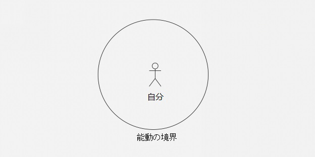

図中)自分、能動の境界

**能動の最初の境界は自分自身だ。**

自身の範囲内では、すべて能動的な態度をとるべきだ。しかし、それを超えると、能動はネガティブな作用をもたらす可能性が高い。両親が自分自身をよりよいものに変えようとしているなら、これは「能動の境界内」で能動を適用するべき。

ほとんどの両親によって最も使われる言葉、または最も頻繁に持たれている考えが「私たちの世代はすでに変えられない……」というものであることは残念なことだ。そして、彼らは次の世代が彼ら自身と異なることを望み、自分の外側、つまり能動の境界の外側にできることすべてを適用する。

彼らが予期していないことは、これらの行動がネガティブな結果をもたらすということだ。

> ●彼ら自身は両親として、将来にわたって改善しない；
>
> ●子供たちは無意識のうちに「常に自身に受動的である人物」になってしまう。

本来、正しい選択は次のとおりだ。

> ●両親は能動的に自分自身をよりよくするべき；
>
> ●子供はそれを羨ましく思い、状況をよくしたいと思うようになり、能動的になる。たとえ表面的なマネでも、よいスタートであると言えるだろう……

**正しい選択は常に実行が困難だ**。

もう一つの最も一般的な例は、道徳的要求に対する人々の態度だ。道徳における制限の対象は、他人ではなく自分自身であるべきだ。道徳を自分自身に対して高く設定するのは正しいことだが、道徳を他人に対して設定するのは、あまりにも世間知らずであるか、邪悪であるとさえ言えるだろう。法律は、自分自身に対してだけでなく、他の人にも遵守を求めるものだ。したがって、法律を用いて、自分の権利と利益を守ることは困難である場合が多く、なぜそうなのか考えてみるといい。

積立投資を開始すると、あなたは特定の属性を持つ投資家になる。あなたは自分自身と異なる投資家とたくさん出会うだろう。そして、彼らは投資している会社に対し、あれこれと要求をしていくかもしれない。本当に役に立つ提案をしたいと願っていても、最後には起業家を怒らせてしまい、お互いのことを考えたくもない状況になってしまうこともしばしばだ。なぜ彼らはそのようになってしまうのだろう？それは、彼らは能動の境界の外にいることを知らないからだ。境界の外にいる場合、彼ら自身の能動的な行動は無意味であり、それはすべてネガティブな効果がある。彼らは永遠に理解することはないだろう。立場を変えて、もし上述投資家が起業した場合に、出資者たちから様々な形で横やりを入れられてしまうと、それに太刀打ちできず、外野の言いなりになってしまいかねないからだ。そう、自分自身の能動の境界外にいる人達に影響されるとは、こういうことなのだ。自分が達成したいことに集中できず、周りの声にながされてしまい、自分の事業に集中できないことほど、恐ろしいことはないと思うのだが、いかがだろうか。

**能動の2番目の境界は、コントロールの範囲だ。**実際に、私たちはエアコンの温度、車の速度などをコントロールすることができる。今後の議論でも、あなたの想像をはるかに超えてコントロールできるものを示す。しかし、**コントロールできないものを識別することはさらに重要であり**、例えば、純粋な運は誰もがコントロールすることができないものだ。

場合によっては、テクニックが100％の役割を果たすが、極端な場合には運だけが100％の役割を果たす。この二つの間にあるものは、テクニックと運の両方の要素の割合が異なる。

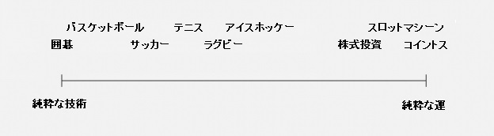

図中）囲碁、バスケットボール、サッカー、テニス、ラグビー、アイスホッケー、株式投資、スロットマシーン、コイントス、純粋な技術、純粋な運

上の画像は、2012年にMichael J. Mauboussinによって出版された本から引用したもの：**The Success Equation: Untangling Skill and Luck in Business, Sports, and Investing**

簡単に観察できるものとして、

> ●大多数の人々は、彼ら自身の能動の境界内の努力が足りない；
>
> ●より多くの人々は、彼ら自身の能動の境界の外側から自己認識できていない。

したがって、ほとんどの人生のジレンマは、以下に起因する。

> ●能動になるべきときに十分に能動でない；
>
> ●能動であるべきではないときにむやみに能動になる。

こういうことはないか、考えてほしい。

世の中には様々な人がいる。しかし、誰一人として特別な人などいないのだ。いわゆる老子が言った**「天地不仁，以万物為芻狗（注）」**のようなものだろう。したがって、確率論的な観点から言うと、ほとんどの人が自分のいる環境に非常に満足している可能性は低い。そのため、ほとんどの人は最初に周囲を変えたいという強い意欲を持つが、最後には運命だと諦めてしまう。

（注）世の中は慈悲深いものではなく、すべての個々が犬のように扱われ、特別扱いはされない

諦めた人たちはどこで間違いを犯したのか？彼らはただ単に、影響力の本質を理解していないだけだ。影響力とは、あなた自身が能動的に何かを言うとか、どう行動するかということではない……**影響力の本質とは、あなたが他人の能動を引き起こすことができるかどうかだ。** 鄧小平はこれをよく知っていた――そしてまさにこれが理由で、彼は中国全体を変えることができた。以下の意味をしっかり考えてみてほしい。積立投資をする人が最も重視するのは、自分の取引市場外でお金を稼ぐことができる能力である。なぜなら、それがすべての成長の基礎となるからだ。セールスは、お金を稼ぐための強力な能力だ。セールスが得意な人は影響力の本質をしっかり理解しており、能動の境界の外側でむやみに能動的な人は嫌われる営業マンだろう。経験を重ねていけば、あなたはより深くこのことを理解するだろう。

### **9.3.運命を決定する要因はしばしば能動の境界の外側にある**

これは間違いなく注目に値する現象だ。

> **あなたに大きな影響を与えるものは、その全てがあなたのコントロールできるものとは限らない……**

言い換えれば、決定的な要因は基本的にあなたの能動の境界の外側にある。

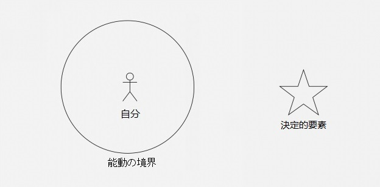

図中）自分、能動の境界、決定的要素

これを証明する例はたくさんある。

例えば、イギリスには1975年生まれのRonald Antonio O'Sullivanというスヌーカーがいる。この選手はとてもハンサムで、そして彼がもつ驚くべきスキルが理由で、より魅力が高まりつつあった。 15歳で世界ユース選手権で優勝した後、O'Sullivanは2018年までに65の大会で優勝した。彼の打つ球は非常に速く、両手をどちらも利き手のように使え、彼の注意は外の世界からの影響を全く受けない。彼が146ポイントを望んでいるとしたら、彼は絶対に146ポイント以外のポイントを取らない。多くの人が狙うであろう147ポイントを打とうとすらしない。とにかく素晴らしい選手だ。

私はO'Sullivan本人について話したいわけではない。

ここで私たちは、数年間、**不幸**にもO'Sullivanと競わなければならなかった、周りの選手たちに注目してみよう――彼らのうち、誰が努力を怠ったのか？誰が勤勉ではなかったのか？誰が彼自身の境界内で十分に能動的ではなかったのか？誰が優秀ではなかったのか？しかし、彼らのそれぞれが三国志で言うところの周瑜であり、怒りに悶えて絞り出された言葉は同じだ。「周瑜を生んでおきながら、なぜ孔明を生んだのか？」

O'Sullivanと出会った選手は、思い切ってスヌーカーを諦めることを選ぶか、またはスヌーカーチャンピオンになるという考えを諦めることを選ぶか、彼らの「運命」はO'Sullivan一人だけのためにどうにもならなくなってしまった。この決定的要因は、明らかに同じ世代のすべてのプレイヤーの能動の境界の外側にある。

O'Sullivanの観点から言うと、彼は明らかに稀なサクセスストーリーだ。彼自身の能動の境界の内側で極端に達し、大きな成功を収めた。数量の点からいうと、これは単なる一例であるだけだ。

ここではO'Sullivanの例はここまでにしておくが、よくある現象を明確に示すために、このやや極端な例を用いたいと思う。

> **運命を決定する重要な要素は、しばしば能動の境界の外側にある。**

しかしながら、上記の現象を受け入れることは、認識を改める上で非常に重要な出発点だ。境界内で、あなたのスキルを能動的に必死で磨くことは非常に困難だが、最も重要なことは、境界の外側に重要な要素があるという認識を持つことだ。それはつまり「もしそうなら、私はどうすればいいか？」とこれから能動的に考え、そして別のスキルセットを磨くことだ。

皆がある時、同時にため息をつくかもしれない。

> 自分がしていることは、なぜいつも一歩遅れているのか？

笑わないでほしいが、私自身も同じ気持ちになったことがある。私の故郷の東北の方言にも、「糞を食べてもいつもホヤホヤのものが食べられない！」というものがある。これは、99.99％の人々が遭遇する普遍的な問題であると思うが、あなたはどう思うだろうか？あなたは少なくとも1人の親戚、クラスメートなど、他の人によってこのように評価されるだろうと思う。

> あいつはね、何だろう、何をやっても上手く行かない、何をしても出遅れてしまう。運が悪いのだろうか？

私たちがこのように言う、またはこのように考えるとき、それは明らかに**「能動の境界の外側の決定的要因」**を**「運命」**として理解している。

1990年代初頭には、多くの有能な人々が中国を離れて、世界各地へ移住することを選んだ。少しずつ時間が経ち、すでに30年が経過したが、この期間は中国経済が困難を乗り越えて、ピークまで成長した30年と言えるだろう。当時、中国を離れた人々の中で、大多数は自分の経済力を評価したら、彼らはため息をつきながら人生の10年、20年を失ってしまった感覚だと答える……

これは運命だろうか？本質的に言うと、これは単なる**「トレンドの作用」**であり、個人の「運命」ではない。実際に彼らは当時、中国を去ることを選んだが、彼らは留まることも選択できたわけだ。したがって、中立的な意見を言うと、単に彼らの選択とトレンドが一致しなかった。これは高速道路で車線を変更したのに、元の道路が最速であることが分かった状況となんら変わらない。

運命を決定する重要な要因は、しばしば能動の境界の外側にある。能動の境界の外側にある最も重要な要因は何だろうか？それは一語だけで言い表せる。**トレンドだ。**

いわゆる「時流を読む傑物」というのは正しい描写で、トレンドを理解していないが故に時流に乗れない人物というのは、何者にも成れない。トレンドは能動の境界の外側にあるため、いわゆる「時代の寵児」というのも正しい描写で、トレンドは能動の境界の外側で決定的な役割を果たすので、トレンドがなければ英雄は誕生しない。

### **9.4.トレンドを牽引するための最適な戦略は、能動的でありながら受動的なことである。**

能動はもちろん、能動の範囲内で非常に重要だ。しかし、ほとんどの人が無視するもう1つの事実は次のとおりだ：

> **受動はさらに重要だ！**

能動の重要性は往々にして説明されるとすぐ理解できるが、受動の重要性は、多くの人が真剣に考えたことがない概念である「能動の境界」を前もって伝える必要があるため、明確にするのは困難だ。

**トレンド**を調査し始めると、**受動の巨大なエネルギー**を私達は体感することになる。受動エネルギーにどのように適応するかわからないというのは、ほとんどの人の人生における鬼門である。トレンドに関して、多くの人が不適切な言葉遣いをしている。例えば「トレンドを操作する」というものがある。トレンドはどうやって操作できようか！トレンドはあらゆる人の能動の境界の外側にあり、操作という能動的な行為からは全く影響を受けることはなく、これは人々の独りよがりの願望にすぎない。したがって、より適切な表現は**「トレンドに従う」**であり、従うというのは受動的な行為である。能動の境界の外側では、受動は非常に強力な魔法の力を持っている。

もし、どうしても「操作」という言葉を使いたいであれば、一部の人が「トレンドを操作する」という方法を探った結果はこうなる。

> **能動的に受動する**。

**能動的に受動する**、とは何だろうか？

> ●最も正しいトレンドを**能動**的に選択する。
>
> ●トレンドが動くのを**受動**的に待つ。

人々が選択できると思うことの大多数は、実際には価値がない。早朝にどの靴を履くのか、どの色のネクタイを選ぶのか、電車または飛行機を利用するのかなどを選択する。実際、これらの些細なことは、能動な境界の外側には影響を与えず、自身の感覚を変えるだけである。しかし、人々は自己の感覚にとても過敏であるので、トレンドによって生じた結果であっても、それをすんなりと受け入れることができない。その時に最良のことは言い訳を見つけることであり、例えば、環境が良くなかったなどと言う。

**平凡な人が平凡である根本的な原因は、トレンドとは関係のない選択に対して時間とエネルギーを浪費することである。**それはどのような人であっても同じで、人生で最も重要な決断は3つか5つだ。勉強、結婚、そしてキャリア以外で、これらよりも重要な2つ以上の決断ができるだろうか？もちろん、あなたは今、他の者より一つ多くなければならない。積立投資だ。これは重要な進歩であり、その困難さと意義は生物学的進化における「遺伝子突然変異」と同等だ。

一つの決定が重要で意味があるかどうかは、1つの判断基準だけを考えればよい。

> **その選択は、トレンドに合った選択か？**

最も正しいトレンドを能動的に選択することは、言うのは簡単だが行うのは難しい。

それが明らかに難しいのは、人は何度ひっくり返っても枝葉末節を諦めることができないからだ――自らが選んだトレンドを諦めなければ人生はよくならない、とわかっていても、一度選んでしまった（もっともらしく見えるが実は）正しくないトレンドを放棄することができず、気づかぬうちに正しいトレンドからますます離れていってしまう。最後、仕方なく運命を受け入れる。

トレンドをコントロールする前に、トレンドを把握する必要がある；トレンドを把握する前にトレンドを研究する必要がある；トレンドを研究する前に、トレンドを感じる必要がある……毎日どうでもよいことに時間とエネルギーを使っている人にとっては、たとえトレンドを教えてもらった後でさえ、勉強して理解することはもちろんのこと、感じる時間はない。トレンドを操作するに関しては、彼らの運命の外に存在しているのに違いない。

だから彼らはそのような誤った考えを持ち、そしていつも同じ気まずさに遭遇する。

> なぜ私は一歩遅れたのか？

しかし、次回も同じ状況になる運命にある。

多くの場合、とりわけ取引市場においては、「遅くなること」が問題になることはなかった。それでも「スマイル・ウェーブ」と「ジョーカー・ウェーブ」と呼ぶことができる取引曲線を思い出すことができれば、積立投資家は長期的に安定した継続的な投資を通して、スマイルウェーブと次々に出会うことができる。行動と戦略は、**「いつ市場に参入しても正しい」という事実を決定する**。スマイルウェーブと出会うたびに、平均コストが削減されるため、**参入時間を大きなセグメントで先に進めている**。積立投資ではない投資家は反対に、より早く入る場合にだけより低いコストを持つことができると誤って信じるだけでなく、さらに同じ曲線がジョーカーウェーブになるのでさらに**「参入タイミングを後方に移動」**するだろう。

Facebookは上場した後、その株価は何倍も上昇した。Facebookにエンジェル投資する機会を得るPeter Thielにならなければ、多くのお金を稼げないと言えるのか？違う！Peter Thielの人脈、名声、資本、能力を持っていなければ、例えあなたがシリコンバレーに住んでいても、あなたはMark Zuckerbergのエンジェル投資家になることはできないだろう。しかし、その後Facebookは上場したので、もしFacebookの株を買っていたら、Facebookがひどい相場でIPO初値を割ったとしても、その後明らかにスマイルウェーブが出現したわけだ！多くの人々が最終的にジョーカーウェーブによって蹂躙され、地面で踏みつけられても、あなたが積立投資の原則を理解しているなら普通の人物であっても、その投資は何百倍の収益をもたらすと証明している。

ブロックチェーンの世界に入って8年間で、私は無数の初期参入者を見たが、彼らは今日まで保有しているだろうか？明らかにそうではない。早めに参入しても、正しい戦略を持っていなければ、8年後に振り返ってみるときっと上手くいってないだろう。信頼できる戦略は積立投資の1つしかない。こじつける必要もないし、体面にこだわってひどい目に遭う必要もない。それは正確で現実的な説明だ。積立投資の意思決定戦略はシンプルすぎるためなのか、人々はそれを好まない。人はFancyのような、ファッショナブルで、複雑で、そしてハイエンドなものを好む。これは（すなわち、能動の境界では）重要ではないが、服を着飾るようなものだ。しかし、シンプルでないものを能動の境界の外に適用させると、大惨事を招くことはほぼ確実だ。2018年後半から2019年前半にかけ、いわゆる「クオンツ・ファンド」が大量に崩壊し、2018年後半から2019年前半には2人の（中国）有名人が自殺した。物事に通じているかのように振舞っている人ほど、自身が主導した失敗に耐えることはできない。

したがって、能動的に受動するために、開始する最初のステップは**些細なことを諦めることだ**。判断基準はシンプルで、**トレンドとは無関係のものはすべて些細なことだ**。些細なものをすべて捨てた後、残りはとても自然なプロセスだ。このようにして初めて、クリアに思考でき、どこで能動的であるべきか、どこで受動的であるべきかを明確に考え区別することができる。そして、**能動的に受動する**と呼ばれるものを真に理解することもできるだろう。

### **9.5.積立投資はなぜ「能動的に受動」なベストプラクティス戦略なのか？**

私は作家として、自分が正しいと信じることからぶれることなく、人に対して道理を説くのが好きな作者だ。自分の考えや決断、得た収益のことをみんなと共有する。失敗は語らない。なぜか？失敗というのは、すなわち上手くいかなかった、それをしなかったことで、失敗の経験は経験とは呼ばず、それはせいぜい教訓であるが、基本的にそれは役に立たない！勉強が苦手な両親が、自分の経験をまとめることによって彼らの子供を優秀な子に育てたのを、あなたは見たことがあるだろうか？

**私は、自分が実践したことだけ話す**――この点はブレない。他の人が行ったことは自分とどう関係があるのか？自身で実践した後に総括してまとめたものは、非常に価値がある経験だ。その過程で失敗することもあるが、最終的に修正して成功したのなら、その時点で学んだ教訓は本当に貴重な教訓であり、分かち合う価値がある。

私は道徳的優越感を持つのは好きではない。そして、実際には根拠のない道徳的優越感を持っている人を憎む。彼らは私の正反対の存在なのだ。道徳的優越感に浸っている人間は、どのような状況であろうと、あることないことを吹聴する。彼らが実際にそれを成し遂げたかどうか、成し遂げられるかどうかは、まったく話題にならない。むしろ、分かっているかどうかは重要ですらなく、重要なのは、他の人よりもそれらしいことを言っているかどうかだ。

次の文は決して誇張ではない。

> **意図的であるかどうかにかかわらず、すべての道徳論者は真の嘘つきだ。**

詐欺師がいつも賢く見える理由を知っているだろうか？新しいトレンドがあるとすぐに、彼らはより早く学ぶようなのだ！ 「ああ、これらの詐欺師は真に学習することができる！」と思考停止してしまう人も多い。学習能力を軽蔑しないでいただきたい。詐欺師が「すぐに学ぶ」ように見えるのは、学ぶ必要も勉強する必要もないからで、理解できない概念を区別するだけだからだ。自分が理解できないと分かっているため、他人も理解できないと見抜くことができる。そうして、騙す相手にめまいを起こさせるのだ！玉を煉瓦としてつかませるのだが、これは羨ましいことか？この観点から詐欺師を見ると答えは非常に簡単だ。道徳論はあらゆる点で本物の詐欺師と全く同じだ。彼らがやっていることは、他人を単に打ちのめすことだけなのだ。

多くの人がなぜ「分散化」を唱えているのかを説明しているが、慎重に聞くと全く理解していないことがわかる。分散化は、目標ではなくブロックチェーン技術モデルの1つの手段にすぎない。ブロックチェーン技術の目標は「オープンかつ透明で改ざんされない」ことであり、そのために分散化が採用されている。分散化は万能薬ではなく、すべての問題を解決することはできない。私がここに冷たくないビールの瓶を持っていて、分散化を使って冷やすことができるだろうか？ブロックチェーン技術で採用されている分散化は、特定の問題を解決するために使用され、政府や銀行を倒すために使用されるのではない。こうした論調は、本当にデタラメである。

また、ずっと「コンセンサス」と主張する人がまだいる。「愚かなひとのコンセンサスもコンセンサスだ。」これは実際には侮辱的な言葉で、雲を掴むような人々は1年以上もこれを馬鹿にし、背後にある意味さえ理解していない（2018年発生した李笑来内部談話の秘密録音された事件）。人々の間でどこに多くのコンセンサスがあるのか！ブロックチェーン技術における**コンセンサス**とは、**機械と機械の間のアルゴリズム的コンセンサス**を指す――機械は標準化され、アルゴリズムは統一されているため、コンセンサスが実装されている。どうすれば人々の間でそれが可能になるのか？人々の間で見つけることができる最大のコンセンサスは、彼ら全員がお金を稼ぎたいということだが、全員がそれが難しいことを知っている。

分からなければ飾らなければよいのではないか。分からなければデタラメを話さなければよいのではないか？優越したいという願望が強烈なんだろう。公の場では、雰囲気を大事にするために、私は比較的丁寧に話しているが、個人的な場では気を遣う必要はまったくない。

> **できないなら黙れよ。**

それはどれほど簡単か？

私の考えでは、 [BOX](https://b.watch) を設計するとき、それは本質的にオープンソースの積立投資戦略だ。プログラマーのコードは無料でオープンソースにすることができるし、私の記事や著書も無料でオープンソースにすることができる。私の投資原則をオープンソースにするのは今回が初めてではない。2017年6月3日、私は[《NBlockchain 的開源区塊鏈投資原則》](https://github.com/xiaolai/INB-Principles/blob/master/Chinese.md)を公開し、のちに《韭菜的自我修養》の中にも収録した。

 [BOX](https://b.watch) デザインの中核はシンプルだ。

> ●ブロックチェーン技術の開発動向と一致する高品質の銘柄を選択することにより、**投資対象をプロジェクトから業界全体のトレンドにシフトする**。
>
> ●李笑来がそれを公開した以上、**管理手数料をゼロに設定するべき**。
>
> ●李笑来はこのように考えているので、彼はこれをしなければならない。そのため李笑来は、お金を稼ぐために自分**自身も積立投資する**。
>
> ●積立投資は社会行動および社交的行動であるため、本名のみで参加できる**コミュニティ**を作る。

[BOX](https://b.watch)は**コインベース**のブロックチェーンETFファンドだ。コインベースとは何か？これはつまり、収益を計測する方法は、人民元やドルが基準ではなく、積立投資するたびに投資しているBTC / EOS / XINの数に基づく。どのくらいの額のBTC / EOS / XINを投資してきたのか。将来的には、あなたが手持ちの[BOX](https://b.watch)トークン（ロックチェーン証明書）を使って、BTC / EOS / XINに投資してどれだけの収益を上げたか知ることができる。

このプロセスでは、[BOX](https://b.watch)のすべての運営、すべての取引はオープンで透明で、そして**「100％保証金システム」**に厳密に従う。

したがって、この観点から言うと[BOX](https://b.watch)はコインベースの「元本保証」ファンドだ。

[BOX](https://b.watch)がコインベースに基づいて収益を生み出すことは可能か？ [BOX](https://b.watch)自体にはない。しかし、[BOX](https://b.watch)の流通市場[b.watch](https://b.watch)では可能だ。[b.watch](https://b.watch)は定期的に流通市場の手数料収入の50％を[BOX](https://b.watch)の保有者に還元する。（双方向で1000分の1）最初、この収入は確かに多くはないが、時間の経過とともに[BOX](https://b.watch)の取扱高は増加され、この手数料収入は一定の規模になる。

残りの50％の手数料収入は、[b.watch](https://b.watch)の基本的なビジネスモデルの基礎を構成する。その後、[b.watch](https://b.watch)の企業価値は徐々に上昇する。次の7年間で（李笑来は常に「7年間は一生だ」と言っていたので）、[b.watch](https://b.watch)の株式は、コミュニティ貢献へのポイントに対し、特定のアルゴリズムにしたがって、投資コミュニティの実務家に分配される。また適切なタイミングで流通市場での取引を開始する予定だ。

徹底することはどういうことだろう？[b.watch](https://b.watch)の計画は、最終的にすべての株式が発行され、自社が保有しないことだ。会社を維持する方法は？人件費と設備費については？李笑来が持ち出す。なぜか？ 李笑来も積立投資する予定で、李笑来は間違いなくたくさん投資することにしたためだ。お金を稼ぐことができないのなら、仕方ないが、お金を稼げるのであれば、李笑来が単独で責任を持つことは、実際何も問題ない。

BOXは基本的に、この本のすべての内容、すべての議論、真の価値を共有するすべてのベストプラクティスだ。あなたが読んでいるものは、実践に移せる内容を含んでいる本なのだ！

能動的な人格を鍛錬し始める；能動的な境界を探り始める；受動の力を理解し始める；トレンドを選び始める；受動的な知性を経験し始める；特定の領域で目標と持ち始め；忍耐と行動、規律を持つ人になる。要するに、あなた自身のために前進するのだ。

外部の人々が理解していなくても、コミュニティの人々があなたを理解しているはずだ。彼らは何も言う必要はない。彼らはただ静かに、あなたと一緒に積立投資をする。積立投資以外のものは、コミュニティやあなたとは何の関係もない。

2019年7月3日の七三韮フェスティバルの講演で、私はこのような話をした。これは実際には積立投資コミュニティに関するいくつかの基本的な規則だ。

> **1.多様性への許容**
>
> 今では、何千人もの人が集まる。したがって、私たちは最初からすべての人がここで多様性を容認しなければならないことを明確にしなければならなかった。
>
> 現在、このグループには5,000人以上の人がいるので、光がまぶしいと約30-40人がくしゃみをし（7％）、同性愛者は約30-40人（6％）、約2,000-3,000人のさまざまなレベルの信仰宗教（33％）があり、迷信レベルに約3,000-4,000人（66％）があり、約4,000人以上がさまざまな先入観のある軽蔑的な見方（85％）を持っている。また、誰もがいくつかの領域で平均を超えている（99％）と認識している。誰もが違う場所におり、彼らの話す言葉はそれぞれのアクセントで、受けた教育レベルは異なり、家庭状態や生活習慣は異なり、善悪の価値観も異なる。これはまさに多様性と言うものだ。
>
> しかし将来、このクラスはより多くの人々を受け入れる必要があるため、多様性は許容されなければならない。したがって、将来的には、どのグループチャットでも口論したり、個人的な攻撃をしたりしないでほしい。いったん争いが起こると、その原因にかかわらず、正当であるか、どちらが先かどうかに関係なく、両者は教室から削除される。
>
> **2.クラスの内容に関係のないものは評価しない**
>
> 理論的には、「あなたと関係のないものを評価しない」ということ。「どう思うか？」と聞きたいのなら、知乎（注）で質問して聞いてほしい。笑来積立投資塾で最も話題になるのはブロックチェーンの知識、投資の知識だ。**適切な方法できれいなお金を稼ぐこと、これが最も信頼できる方法だ。**社会、政治、文化などについては、笑来積立投資塾よりも議論するのに適切な場所があるはずだ。ここでは、人々はただ一つのこと、どのように成長し続けるか？よい状態を維持するには？に集中するだけだ。それと関係がないことに言及する必要はない。
>
> （注）知乎は中国最大手のQ&Aサイト
>
> **3.行動を通して人の尊敬を得る**
>
> ここにはたくさんの人がいるが、確率的には、間違いなくほとんどが知らない人だろう。見知らぬ人があなたに対し、自動的に敬意を払うとは思わないでほしい。丁寧であることはあなたにとって尊敬を表すものではなく、その人自身を尊重するためのものだ。
>
> 尊重されることは「稼ぐ」こと同様に「蓄積」することができるものだ。詐欺師への尊重は、遅かれ早かれゼロに戻る。（変な）ニックネームをつけて人を煩わしくさせる人もいるため、センスも重要なポイントである。あなたがお金を稼げるかどうかは、基本的に見知らぬ人の尊敬を獲得できるかどうかにかかっている。
>
> 将来的には、このクラスの全員に身分認証（KYC）を求めていくだろう。今後はニックネームの代わりに本名を使用することをお勧めする。私を信じてほしい、個人的なブランドは非常に重要なのだ。
>
> **4.全世界に敵対しないでほしい**
>
> あなたが中国にいるという理由で、黙らないといけないとは思わないでほしい。もちろん、あなたが中国にいるからこそ、黙ったほうがよいと思う。
>
> デタラメを話さないでほしい。責任を負うことができないことを言ってはいけない。**他人の安全を脅かすまであなたの勇気を表現する必要がない。**
>
> どんな環境でも成長できるはずだ。もしあなたが成長していない場合、環境を責めるべきではない。別の観点から見ると、あなたが馬鹿で、弱く、よくないというだけだ。
>
> **5.李笑来を持ち上げるのをやめてほしい**
>
> 李笑来は自分のことをよく知っているので、もしあなたが批評するなら、間違ってなければ彼は怒らないが、彼が何か間違ったことをしているのを知ったら、彼は怒るだろう。そう、彼は彼自身に対して怒る。また、李笑来を誇張して話さないでほしい。そうした誇張は得てして正しくないし、李笑来は欠点のある普通の人だ。彼はある領域で正しいことをしているだけだ。
>
> 軽薄な話は、関係者にとっても傍観者にとっても非常に恥ずかしいことだ。だから、そうしたことについて話さないでほしい。 李笑来に感謝の意を表明する気持ちを抑えられない場合は、彼が言った方法でお金を稼ごう――これは何より優れている。実践することが唯一の成功への切符であり、結果が出ればそれは初めて共有することができる経験だ。

積立投資の定義によると、長期にわたる行動は最も厳しい投資基準のスクリーニング原則を強制する。これは能動の選択だ。それから定期的な投資、長期保有、そして次々とスマイルウェーブを経験する、これはトレンドの強力な受動的な力で、あなたのために富を生み出す。一般の人々の生活の中では、このような驚くべき富を生み出すことができる別の長期的なシンプルな行為を見つけることは困難だ。富豪すら投資の中からしか新たな富を生み出すことはできない。

能動的に受動、この金融時代に富を創造するためのベストな実践戦略だ。

### **9.6.トレンドの受動的な力はどのくらい強力か？**

はじめに反対側から例を挙げる。私たちが通常話す**教育**は、受動のネガティブな力を示すことができるという優れた例だ。

教育の失敗を訴える各世代、つまり自身の教育の失敗を訴えるだけでなく、社会全体の教育の失敗を訴える人々が多くいる。中国だけでなく、グローバルで彼らはいわゆる教育を何度も再考している。しかし、あなたが視点を変えるならば、反対の説明を見つけるだろう。

> 実際、どの時代でもどの国でも、教育は非常に成功している！

なぜそのような結論があるのか。教育を定義する観点を変えたからだ：

> **いわゆる教育とは、本質的には、その国の社会システムが個人を変えたいようにする仕組みだ……**

誰もが一連の連動システムの中にいる。私たちのサークル、私たちの文化、私たちの社会、私たちの国、私たちの世界にそれは存在している。これらは「すでに成熟したシステム」だ。それらが客観的なものだと考え、だまされてはいけない。それだけではなく、システムそれ自体が生命力を持っており、また魂すら持ち合わせている。システム自体が力を持っているのだ。

どんなシステムにおいても、既得権と非既得権がある。前者は非常に少なく、後者は大多数だ。結果として、教育の目標は明確であり、既得権益者はそれを彼ら自身にとってより有益なものにするために使用するだろう。あなたは彼らが何をするか知っているはずだ！非既得権益者は、対立の過程で権力の不平等があることに気付き、多数は既得権益者のために奉仕することになる。また、抵抗する少数の非既得権益者は最終的には消滅する。もし、既得権益への抵抗が成功するならば、それらは即座に既得権益者となり、また既得権益を提供している次の「新しい」システムを作るだろう……これは事実であるので、不平不満を言うのは全く不要だ。地球上のどこでも同じだと思うが、そうではない場所があるのか。（いや無い。）

したがって、いわゆる教育は次のように定義される。

> **教育とは、あなたが所属するシステムが望む形であなたを変えたいようにする仕組みだ……**

教育がそのように定義されており、現状が事実であるならば、結論は明白だ。歴史におけるすべての教育は非常に成功しており、異常な成功とさえ呼ぶことができる。そしてますます成功していくだろう。この観点から、人々が文句を言う教育の失敗は、本質的には、システムへの既得権益の不快感に他ならない。

普通の人々に、他の道はないのか？まだある。

教育がそのように定義されている場合、**独学**はどのように定義されるべきか？

> **教育とは、所属するシステムが個人を変えたいようにする仕組みであるなら、それとは対照的に、独学はあなたがなりたいように変わる仕組みだ。**

したがって、より正確な表現は2つの相対的な用語になる。

> ●教育される
>
> ●自己教育

大多数の人々は、教育を受ける過程（すなわち、システムによる同化の過程）において非常に不快に感じる。これは当然のことだ。しかし、次の選択は闘争の強さを最もよく反映するものだ：**ごく少数の人だけが教育されることを放棄し、自己教育を選ぶ。**こうした自己教育は時々でなく、死ぬまで行う。驚くべきことは、歴史を注意深く観察すると、あなたは世界を変える人々が例外なく自己教育していることに気付くだろう。

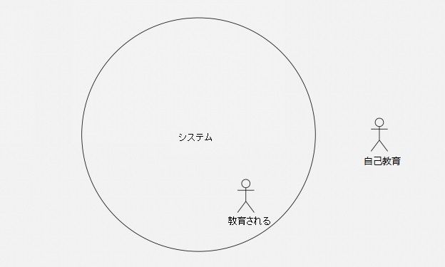

図中）システム、教育される、自己教育

一方、教育を受けた人でも、教育を受けることを放棄した人でも、彼らは最終的にシステムに同化される。受動的な力は彼らに非常に強力な影響を及ぼす。それはあまりに強力な力なので、それは神の力だと思っている。

1999年に制作された《一年又一年》というドラマがあるので、時間をみつけて観てほしい。物語は1978年に始まり、一話は一年分で、合計21のエピソードがある。エピソード中には映画の映写スタッフの物語があるので、一話毎にその年の映画を挙げている。また、一話毎にその年の曲も収録されている。さらに重要なことに、当時の最も重要な出来事の1つをあなたに思い出させる。物語は特によくはないが、各個人がシステム内でどれほど小さいのかをドラマは視聴者に感じさせ、受動的にしか直面できない要因がどれほど強力なのかを実感させる。

私たちが受動的にしか対抗できないネガティブな力の強さは強大で、同時に、それらのポジティブな力も同様に強大だ。私たちに関連した、大きな前向きな役割を果たす受動的なポジティブな力の例を下記で見てみよう。

資金管理の分野では、資金は2つのタイプ、**アクティブ・ファンド**と**パッシブ・ファンド**に分けられる。

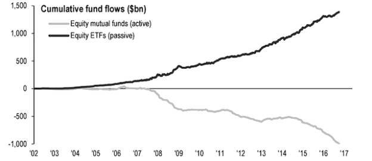 

上のグラフは、過去数年間における世界中のアクティブおよびパッシブファンドの資本流入を示している。資本がより一層、パッシブファンドを支持するのはなぜか？アクティブファンドがますます拒否されるのはなぜか？その理由は、資本が受動の力をますます認識しているからだ。

アクティブファンドでは、市場を分析した後に市場を上回る可能性のあるポートフォリオを選択する管理者が必要だ。これらの運用会社の期待に基づいて、投資家は非常に高い運用報酬と成功報酬を支払う必要があり、またこれらの運用会社の頻繁な取引の取引費用も負担する必要がある。これとは対照的に、パッシブファンドは分析スキルを宣伝せず、また頻繁に運用するのではなく、代表的な指標（S&P 500など）に受動的にしたがっている。

長年にわたり、ファンドマネジャーは様々な疑念を持たれていた。こんな冗談もあった。あるファンドマネージャーが、自宅に株券とサルを一緒に入れた。すると、サルは株券におしっこをした。ファンドマネージャーは、サルがおしっこをかけた株券でポートフォリオを組んでも、アクティブファンドマネージャーの成績を上回ることができた、という悪趣味な冗談だ。

それは本当か？それとも単なる冗談か？あなたが理解する必要があるのは、現代の証券取引市場の成長の歴史は、実はそれほど長くないということである。真の現代の取引市場は1970年代にやっと出現した。取引市場の様々な現象に対して、効果的な研究のためのデータは約40-50年分しかない。

[Wall Street Journal ](https://www.wsj.com/articles/indexes-beat-stock-pickers-even-over-15-years-1492039859)（2017年4月13日）の統計により、2016年12月31日現在、過去15年間の成績を見ると、中規模ファンドの95.4％がS＆P MidCap 400の成績より劣り、小額ファンドの93.2％がS&P SmallCap 600の成績より劣り、大規模ファンドの92.2％がS&P 500の成績よりも劣っている。

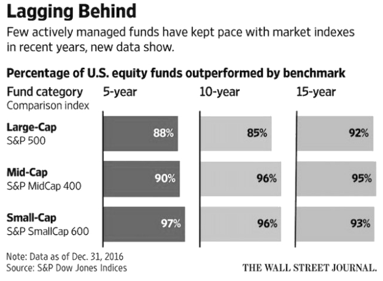 

アクティブファンドの支持者は、一見すると合理的な異議を唱えている。彼らは、ますます多くのお金がパッシブファンドに流れ込むにつれて、最終的には戦略を「トレンドフォロー」に変える結果、それがアクティブファンド管理を比較的より有利にすると考えている。しかし、短期的な市場の変化や新しいトレンドが、アクティブなファンドマネジャーに短期的な優位性をもたらすことを長期投資家は理解しているが、15年ベースの統計から見ると、それを無視できることも理解している。

この統計の最も興味深い部分はこのような結論だ。

> ●投資**サイクルが長ければ長いほど**、受動的な利点は大きくなる；
>
> ●投資**額が多ければ多いほど**、受動的な利点も大きくなる……

私の個人的な過去の経験もこれを裏付けしている。

2013年に私は、仮想通貨関連のプロジェクトに投資する初期の小規模ファンドを管理し始めた。 2018年までに、つまり4年間の管理期間と、1年間の清算期間、合計5年間で、ファンドの時価総額は開始時の約68倍になった……この成績は、人をびっくりさせるようなよい利回りだと思うが、ビットコイン投資への利益と比べ、ほんの少しだけ上回っていたため、実際にはかなり落胆した。つまり、もし当初すべての資金をビットコインに投入し、その後の5年間何もしなかった場合は、58倍になった。私のファンドは成功報酬の30％を引いた後、投資家のリターンは約48倍になった。それはビットコイン自体の成長よりわずかに低い成績だ。

さらに落胆する1つの要因がある。この5年間で、話すのは難しいが、本当にスリリングだった。数回全滅する可能性があったし、もしそうなったら運で復活するのは難しく、九死に一生を得た……このファンドはもう少しで閉じなければならなかったが、これはよくあることだ。特に、ブロックチェーンの世界は、変動の振幅が株式市場の数倍も大きい場所である。

結果的に閉じなかったが、実際にそれは驚きだった。ビットファンドが最終的に清算されたとき、私は次のステップではパッシブファンドにしか作れないと感じていた。1年をかけて考案し、ついにオープンソースのブロックチェーンETFファンド商品[BOX](https://b.watch) を設計した。現在の小冊子は、実際に私の理想的なパッシブファンドモデルを作成するプロセスを反映している。

次に、先にこのセクションの焦点に触れておく。

あなたの経験からも同じ結論がそのままあてはまるかどうか、見てみてほしい：

> ●**志が高ければ高いほど、より受動的な力が必要だ；**
>
> ●**多くのエネルギーを持っているほど、多くの受動的な力が必要だ……**

受動的な力は素晴らしいだけではなく、**それを長期で上回ることは常に困難だ。**

受動的な力が引き起こされると、それらは比類のないほど強力だが、**能動的なものは受動的でポジティブな力を引き起こし、受動的なものは受動的でネガティブな力を引き起こす。**だから能動的に受動することが最適な戦略である。

さらに、トレンドフォローに関しては、新しい洞察があるかもしれない。

> ●短期的な結果をトレンドフォローで見るのは間違いだ；
>
> ●長期的な結果を目指しトレンドフォローを伴うのは唯一の正しい選択……

たとえ誰もが彼らが「トレンドフォロー」という言葉を理解していると思っていても、少し真剣に考えた後では、正反対の結論のように異なった結果になる場合がある。

### **9.7.能動の境界内にはどのくらいのスペースが残っているのか？**

**「おしなべてあなたに大きな影響を与えるものは、全てあなたにコントロールできる代物ではない。」**これについては前述した。あなたは今、あなたに大きな影響を与える要因をコントロールすることはできないことを知っている。なぜなら、それらはあなたの能動の境界の外にあるからだ。

しかし、あなたは知っているだろうか？あなたの能動の境界の中で、あなたはすでに諦めているが、実際にはコントロールできることがたくさんあることを。そして、そうして諦めてしまうことが、どれだけもったいないことなのかを。単にあなたはそれについて真剣に考えたことがないかもしれないし、誰も指摘しなかったから気にならなかったかもしれない。

バットマンを例に挙げて見てみよう。

 

もちろん、この写真にはコミックヒーローのバットマンはいない。バットマンとして知られている人物（前方で自転車に乗っている）を見て欲しい。ダニエル・キッシュという（[Daniel Kish](https://en.wikipedia.org/wiki/Daniel_Kish)）。 1966年生まれのダニエルは、生まれてから13ヵ月未満で目のがんで盲目になった。この盲目の人はあなたが想像できないことをしている。彼は自転車に乗っており、他の補助装置はない。写真の他の2人も実は盲目で、ダニエルが教えたのだ！この種の魔法のスキルは実践できるだけでなく、教えることもできるのである！

ダニエルは「見る」方法を探した。彼は口を使って音を出し続け、その後ソナーによってコウモリのように世界を知覚している。この方法をEcholocationと呼んでおり、そして人々は彼を "バットマン"と呼んでいる。TED上に関するダニエルの[スピーチがあるので](https://www.ted.com/talks/daniel_kish_how_i_use_sonar_to_navigate_the_world/transcript?language=zh-cn)、それを見てアイオープナーになることを体感してほしい。

このバットマンの例は、特に驚くべきトピックをさらに説明するために使用される。

> **本当に能動的な人々は、運命を信じない。**

あなたは運命を信じているか？あえて全く信じていないと言うか？完全なる信仰と、全く信じないこととの間には長い距離がある。

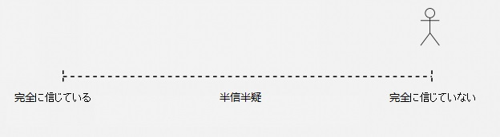

図中）完全に信じている、半信半疑、完全に信じていない

たった1秒の自己診断で、**全く信じないこと**、それなしでは生きていくのは本当に大変で難しいことがわかる。勇気が必要と思われる。また、あなたは突然**躊躇している**のだとなぜ思うのか？たとえ全く信じないことを選択したくても、その選択に抵抗する力があるかもしれない。あなたは全く信じないことを選択したくても、なぜ躊躇しているのかわからないかもしれない。

ため息をついて、卑屈にならないでほしい。これはあなただけの反応ではない。これは基本的に100％の確率に近い状況だ。99％？または99.99％？とにかく、その一方で、信じない1％または0.1％は非常に小さい数だ。全く信じない人はほとんどいない。しかも信じないほとんどの人たちは、無知で大胆不敵なだけだ……

そして、次に述べることも事実だ。

> 時間が経つにつれて、大多数の人々は右から左に移動する。つまり、ますます運命を信じるようになる。

考えてみてほしい。あなたは幼い頃、ほとんどすべての子供たちのように、運命を信じなかったはずだ。とはいえ、小さい頃は「人生」がどうなっているのかを知らない。また、どんどん運命を信じていくと、人は最後には完全に信仰してしまう。もちろん、彼らの中では、それは「完全な信仰」とは呼ばれず、それは**「悟り」**と呼ばれている。あなたが本当にここで「全く信じない」を選ぶことができないならば、仕方ない。あなたが躊躇していても、それでも何が起こっているのか知りたいのであれば、読む前に心の準備してほしい。

> **すべての真実は、あなたの気持ちを考慮に入れる義務を負わない。**

あなた自身が選んでほしい。これは間違いなく大きな勇気だ。勇気とは何か？**勇気とは偽造できない唯一の美徳だ。**

これからさらに質問をする。答える前に慎重に考えてほしい。

> 過去は未来に影響を与えるか？

さらに一歩進んでほしい。

> 過去が未来に影響を与えることは必然的だろうか？もしくは、過去は未来にどれだけの影響を与えたのか？大きいか？それともそれほど大きくないか？

まだ終わっていない、我々はさらに尋ねる必要がある。

> 過去が未来に影響を与える範囲がそれほど大きくない場合、過去と未来の間のつながりをシンプルに切り捨てることは可能だろうか。

運命とは何だろうか？実際には、運命を信じるかどうかは宗教とは全く関係がなく、迷信とも関係なく、完全に論理的思考の欠落によって引き起こされている。いわゆる迷信は単に思考の抜け穴を考えているのだが、抜け穴がどこにあるのか分からないし、結果だけを残す。電気が発明された後、悪魔と幽霊についての物語は以前ほど出なくなっただろう？

運命を信じるという本質は、過去が必然的に未来に影響を与えると考えることに他ならない。過去が未来に**必ず**しも影響を与えるとあなたが**思わないなら**、あなたは運命に疑いを抱くだろう。

私がなぜ**「本当に能動な人は運命を完全に信じない」**と言うのか、あなたは理解することができるだろうか？真に能動的な人はシンプルで正しい論理的思考を通して未来を見つけるので、時に、私達にとっては過去と未来の間の一見避けられない**関係を完全に断つことさえできる**。

最も雄弁な根拠は、皆が詳しいであろう確率論だろう。ギャンブラーの誤謬について聞いたことがあるだろうか。ギャンブラーは、**確率論の独立した概念**を知らず、次のコインフリップが独立した出来事であることを理解できない。前の結果は次の結果にまったく影響を与えることはなく、次のコインの表裏の確率は依然として1/2だ。

このようなシンプルな科学的知識を決して過小評価するべきではないし、この種のことは私たちの生活に大きな影響を与える。しかし、ほとんどの人は学んで知っているが、めったにそれを使わない。

あなたが独立した出来事の概念を理解することができるならば、ギャンブラーの誤謬に陥る人々をどれほど哀れに思うか理解することができるなら、自然に次のことを理解することができる。

> 過去が必然的に未来に影響を与えるであろうと誤って信じる人々は、実際にはもっと哀れだ。カジノのギャンブラーは、独立した出来事の概念を理解していないので、ギャンブラーの誤謬に陥る。彼らが失ったのは当時のギャンブルの資金だけである。しかし、過去が必然的に未来に影響を与えると思っている人々は、これからの未来をすでに失っている！

よい過去を過ごせた場合は問題ないが（ほとんどの人とってはとても低い確率の出来事である）、もし過去がよいものでなく（多くの人にとってこの確率は非常に高い）、そして過去が必然的に未来に影響を与えるであろうと思っていたとしたら、その後の人生はゾンビとの違いは何だろうか？

**いわゆる運命を完全に信じない人は、決心し、過去の悪い部分が将来に影響を与えないように最善を尽くす。**

人生で苦労する価値のあるものはすべてここにある。ここだけだ。

前述したバットマン、ダニエルはそのような人物だ。彼自身の努力を通して、彼は他の盲目の人々と比較して、最大限に「彼の目を失うこと」という過去の出来事を現在と未来に影響を及ぼさないようにした……

実生活において、私はまたこのようなもう一人の人物、中国人女性を知っている。廖智という名前だ。10年以上前、彼女が四川省・汶川地震にあったとき、なんとか助かったが、彼女は娘と両足を失った。彼女の仕事はダンサーだった！数年後、雅安地震の際に、記者が人々を救おうとしている少女を撮影したところ、命を救うために必死になっている少女の両脚が義足であることに気づき、驚いた。廖智は避けられないように思われる過去と未来の関係を断ち切るという能力を持っていた。その後、廖智は不幸な結婚生活を能動的に終わらせ、数年後、義肢を専門とするアメリカからやってきた台湾人と出会った。廖智が後に結婚して子供を産む、この大きな男性に対して何と言っただろうか？

> 「身長を2センチ高くできる？それで完璧でしょう。私は以前までそのような機会を持っていなかったんだから！」

あなたが完全に運命を信じるならば、投資をする必要はない。なぜなら（普通の人なら一般的だが）完璧ではない過去は将来を決定するからだ。積立投資では、過去は未来に影響を与えないだけではなく、実際にエントリー時間を前に進めて、タイムマシンに座って過去に戻って修正し、また未来に帰ってくるようなものだ。

これが、私がこれまで、現在、そして将来において重要なポイントを繰り返し言ってきた理由だ。

> **積立投資戦略の成功の鍵は、心の修練にある。**

心の修練はどこから始めたらよいのだろうか。運命を信じないところから始まる。過去のよくない部分が未来に影響を与えないようにし、そのつながりを断ち切らなくてはいけない。よい部分に関しては、引き続きよい作用が発揮するように維持させる。ここで一生懸命耐えることは、最も価値のある忍耐であり、素晴らしい将来の根源となる。そして、少しずつ能動的な境界を探索していき、その外側でトレンドを探し、受動的な力を体験する。

積立投資戦略はある銘柄に長い時間を掛け、**定期的に一定金額を投資することでしかなく、極めて簡単に見える。**

しかし、無になるほど思考や研究を重なっていくと、積立投資の素晴らしいところに気づくだろう。積立投資は実は非常に精巧で、人を規律的で且つ能動的にさせ、長期的に銘柄を保有する必要があることから、逆説的に長期的に上がる銘柄を探すように人を動機づける。その他、様々な役割を果たしている：

> ●能動的に受動することを深く体験できる、唯一無二の環境の提供；
>
> ●反論不可能な実際の結果を用いて過去と将来のつながりは必然ではないことを証明する；
>
> ●自分を見つめ直し、能動の境界内で極限まで努力できるようにする。

ましては、考えつかないと思うが、最終的には人を比較的に極めて稀である「綺麗」な人にする。あなたは静かに計画を完成させるのみで、失敗するか、膨大な富を得るかの二択だけだ。成功したら、あなたが得るのは**絶対に綺麗な富である**。これより綺麗な金を稼ぐ方法はあるか？こんな方法を手に入れたあなたは、他の諸々ごたごたのことをする意欲や原動力が湧くのだろうか。

## **10.鏡の世界で人はいかに正確な方を選択できるか**

確かに「一瞬の勝負」が存在する場面もある。取引市場に入り、積立投資戦略を選択した瞬間から、実はあなたはもうすでに勝っており、しかも簡単に勝っているのだ――これからのすべての瞬間において、あなたは**鏡の世界**の最も正確な1つである。簡単なことである。あなたが独学を決意した時から、**凡事徹底すれば**、あなたはすでに勝っており、しかも簡単に勝っているのだ。これからのすべての瞬間において、あなたは鏡の世界の中の最も正しい1つになるだろう（[《自学是門手芸》](https://github.com/selfteaching/the-craft-of-selfteaching)を参考）。

過去の多くの年月の中で、私はよく1つの思いを巡らせている。多くの役に立つ道理は、なぜほとんどの人の目には他の様子なのだろうかと。**鏡の世界**という概念でこのおかしい現象を説明できるが、ダイレクトに簡単で有効な解決方法を提供できない。私が取引市場で、投資の領域で、自分自身で積立投資戦略の素晴らしさに気づくまでは。

> **偉大な目標を持たない人は、いつも鏡の世界で間違った1つを選ぶ。**

私が運に恵まれた理由は、数年前には、今のようにはっきりと理解する前に、生まれつきで運命を信じていなかったからである。これは実際すでに第一のステップが完成していたということであり、この観点がもたらしたメリットは後になって初めて現れた。

人はたとえ道理を説明されても、多くのことを経験しなければ、理解できないし、深く理解できない。さらに言えば、あっさりと受け入ることを拒否し、見て見ぬふりをする。2018年の年末、アーノルド・シュワルツェネッガーが有名な講演「成功の真髄」を行った。

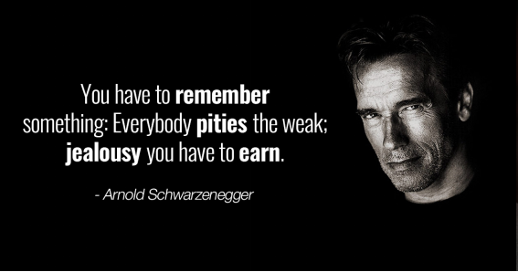 

> https://v.qq.com/x/page/c0818oag4pp.html

動画の中で彼は、私がここで立っていられる理由は、たった1つだ、と話した。

> 「I have a **goal**. 」

故意かどうかはわからないが、彼は「Dream」（夢）、「Ideal」（理想）よりも素朴な言葉である**「Goal」**（目標）を選んだ。この目標のために、彼は一生懸命（Work his butt off）やるしかないと。私はこの動画を何回も見ているが、毎回感じることが異なる。−この動画があったからこそ、私はこの動画を例として示し、自分の伝えたいことを伝えられると気づいた。偉大な目標があるか否かによって、鏡の世界の相反する両側に立つ。

私は《把時間当作朋友》で、自分の子供の頃の経験を読者と共有した。ある時先生が「私の夢」という作文の宿題を出した。翌日に私は宿題を出さなかった。なぜか？私は夢がないからだ。だから書けなかった。私が本当の話を先生に話した時、先生に話を聞かない子供だと思われ、授業中でみんなの前で笑われた。「親を呼んできてください。あなたのような学生を見たことがないと。」

父はもちろん他の親と同様に学校にきて事務室に行ったのだが、静かに先生の大騒ぎを聞いてから、何も言わずにタバコを取り出して黙って一本を吸い終えた。事務室はすっかり静かになっていた。父はやっと口を開いた。「陳先生、あなたの夢は何ですか？」父はタバコをもう一本出した。吸い終わるまで誰も一言を話さなかった。そして父は私の手をつなぎ、「家に帰えろう」と言った。

私がそれからの多くの年月に渡り、**夢という概念**を考えるのを拒否していたであろうことを想像するのは、そこまで難しくないだろう。私は長い間、自分は本当に夢のない人だと思っていた。もちろん、今の私が振り返ってみると、自分は本当に夢がないわけではなく、シンプルにそのような見かけ倒しの概念が好きじゃなかった。

もう一回言おう。夢という見かけ倒しの概念に洗脳されるところだったが、成長の過程で知らず知らずのうちに、もう一方のもっと簡単で、直接的で、使いやすい方法を私は運よく学ぶことができた。

> **自分がやりたいこと、やっていることに一生懸命、偉大な意義を付与する。**

昔、私がたまたま読んだ文章の中に、私が好きな作家である畢淑敏さんが経験したある大学の講義での出来事が書かれたものがあった。ある学生が1つの「究極な質問」をした。

> 畢先生、生命の意義はなんですか?

畢淑敏先生の回答は、

> **人生には本来意義がなく、意義は生きていくうちで出てくるものかな。**

畢淑敏さんはきっと知らないだろう。彼女の一言が、地球のあるところの一人の青年の頭の中に消えることなく刻まれていることを。

**私はこれの素晴らしさに気づいた。自分のしている行為に偉大な意義を付与すれば、人は突然と変わる**――なぜなら、これからそれをする度に、我慢しなくても、激励されなくてもよくなる。挫折することも、人が認めないことや支持してくれないことも気にしなくてよくなる。さらに言うと、誰かに阻止されたら、あなたは怒るようになる。これは自分を動かす強い原動力だ。

なぜ私がこんなに文章を書いたり、本を書いたり、授業をしたりするのが好きかというと、このような行為は私にとって大きな意義があるからだ。

どれだけ素晴らしい先生でも、独りよがりの罠にはまる。その時、人々はいい先生を見つけるのが難しいだけではなく、もっと恐ろしいのは、いい先生がいい弟子を見つけるのが難しいことである。だから、いい先生が弟子を募集する時には、相当気をつける必要があるのである。しかし、自分が工夫を凝らして招いたり、選別したりした、いわゆるよい生徒が数年後に平凡なものだと証明され、当初の独りよがりの自分がおかしいと証明されることがある。もちろん、今ではこの現象を説明できる。これはもちろん、彼らが能動の境界の外側で能動の力に頼ることしかできなかったからである。自分で教えるのは能動の境界の内側の話で、学生の成長は、ほとんどの場合先生の能動的な境界の外側にある。

今日の世界で、文章を書いたり、本を書いたり、ネットで講義したりする素晴らしさは知っているのだろうか？どれくらい意味が大きいか知っているのだろうか？

畢淑敏さんは数十年前、無意識のうちに辺境の町にいる若者を変えた。彼女は知っているのだろうか。彼女は知らない。これは彼女にとって重要なことなのだろうか。実はとても重要で、彼女の知識、彼女の認知が伝播された後、李笑来という若者に**“大愛”**（Big Love）を体現されたからだ。畢淑敏さんは知っていても（きっと知らない）、彼女がわざとやっているか否か（きっとわざとではない）によらず、彼女が気にするか否か（きっと気にしない）によらず、相手を選ばない伝播があってからこそ、その知識、その認知は大愛の効果を完成した。

これは智者にできる最大限の「脱独りよがり」である。だから、よいものをオープンソースにする意味がここにある。よいものは相手を選ばないで大愛の効果を完成させるということだ。私からすると、このことの意味は極めて偉大であり、諦められない偉大さがそこにあるのだ！そこであなたは想像することができる。もしあなたが私ならば、誰かがあなたが偉大だと思うことをするのを阻止したら、あなたはその人をスルーできないだろう。

多くの年月が経ち、李笑来はお金に困らない人となった。若い時、彼は40歳で隠退すると吹聴していた。43歳になると、やはり彼は引退できる条件が備わっていた。もちろんその後、引退の本質は自決に相当するということも発見した。この世で自分を絶つことができない以上、どうすればよいのだろうか。自分の好きなことをすればよい！あなたは何をするのが好き？それはきっとあなたが思う最も偉大な意義があることだろう。私にとっては何かというと、本を書いたり、講義をしたりすることだ。多くの人は理解できない。あなたはすでにあんなに多くのお金を儲かっているのに、どうしてまた本を書いたり、講義をしたりするのかと。ヘイトたちはもっとおかしく、「李笑来が本を書いたり、講義したりする事実は、彼がお金に困っているからだ」と思っているようだ……長年の経験から、鏡の世界の別側の人間に対して、いくら一生懸命に説明しても、彼らが聞こえるのは正反対のことだけである。だから、そのような説明に時間を使わず、自分が好きなことをやればよいだけのことである。**お金をたくさん稼ぐ意味はどこにあるだろうか。自分の好きなことをする時に外界に邪魔されないということを保証するためなのではないだろうか。**

だから、あなたは必ずしも「夢」という大きな言葉を使わなくてもよいのだ（私は若い時、その華やかな外見に騙されそうになった。この言葉が好きではない。見かけ倒しだと思う。）だが、あなたは私が思いも寄らないところで学び、長年実践してきた有効で簡単な方法を実践できる：

> **自分がしていることに偉大な意義を付与する。**

なぜ私が最初から「投資は人が階級の固定化を避ける唯一の方法」と主張するのか。読み返してみるとわかるだろう。これはあなたがしようとしていること、しなければならないことに偉大な意義を付与しているのである。もちろん、あなた自身にとっての偉大な意義を探すのも可能だ。

それだけではなく、私は様々な観点からあなたにその原理、影響、意義は何かを説明した。さらに重要なことは、どの観点からでも積立投資は全ての人が絶対にしなければいけないことが証明できる点であり、全ての人ができることだという点である。

何度も繰り返そう。

> 人にとって、**積立投資戦略**は絶対可能であり、そして全部自分でやらなければいけない。ここでいう人は、国・地域・民族・性別・年齢・容姿・性的指向によらない。キーポイントは頭のよさや学歴にもよらないことである。

**夢のある人になれて、本当によかった**といつも思っている。

## **11.夢がある人なら絶対に中途半端になるな**

取引市場に入ってから、あなたは様々なタイプの人間に出会うだろう。もちろん、その中のほとんどの人はあなたと同じタイプではなく、積立投資を行うあなたは少数に属すだろう。早くも、あなたは出会うほとんどの人が中途半端だと気づくだろう。もちろん、あなたは既に知っているだろうが、分散化やコンセンサスのことばかりをブツブツ言っているだけの人は中途半端な人で、自分には豊富な投資経験があるのにどうやって機会コストをコントロールするかを説明できない人も中途半端な人であることを……

もう一つの中途半端の例を挙げよう。

底値で買えたとか、高値を逃したとか言うのをあなたはよく聞くだろう。そのような話をしているのは全員バカで、本物のバカなのだ。これはその人達が長期投資家か、またはバリュー投資家か、あるいは短期投資家かによらずだ。なぜなら、短期であればあるほど、持続的に低いところで買って高いところで売っていく必要がある。ただ問題は彼らがそれをできないということである。二回ポジションを取れば、一回は負けるのはコインを投げて自分の運命を決めると変わらない。毎日手元にあるコインを投げるだけで、自分が何者だと錯覚する。本当に言葉を失う。

だから、底値で仕込むのもよいし、高値で売りさばくのもよいが、それは一連のステップの中の1つでしかない。底値で仕込めても高値で売れず、仕込んだ値段を割ったら元本割れになる。仮に高値で売れても、下で買い戻せなければ、最高値更新をそのまま見届けるしかない。つまり、底値で仕込めても、高値で売り逃げなければ意味がない。逆も同様で高値で売り逃げられても、底で買い戻さなくてはいけない。これこそ成功と言う。

**半分の成果で全部の成果を得たかのように言いふらす。このような人は馬鹿ではなく何だろうか。**

しかも、一般的に「底値で仕込めた」とか、「高値で売り逃げた」とかは嘘なのである。なぜなら、半分の成果で全部の成果を得たかのように言いふらす人は、残り半分の未実現の成果にやられるのだ。しかもその確率は100パーセントに近い。信じられないのなら、自分で観察してみたらよいのだ。ひいては、積立投資を始める前の自分を観察してみるだけで十分なのかもしれない。

実生活のなかで、このような人達を「中途半端」と言う。**中途半端の運命は非常に普通であり、普通に惨めなのだ。**普通の人たちの生活は普通に惨めなのではないだろうか。なぜなら大多数の普通の人達が中途半端だからだ。

様々な中途半端は本当に多い！

長くないうちに、あなたは先物取引を知ったり、実際にそれをやったりするかもしれない。しかし、その中であなたはより多くの中途半端と出会う。先物取引は理論的に現物取引を補佐する1つのツールである。

例えば、私がある理由で100ビットコインを売らなければならない。しかし問題は、私は長期投資家であり、私からするとビットコインの長期的価格は上昇するため、100ビットコインを売りたくないのだ。現実の中で、多くのマイナーはこのようなケースに陥る。通常、彼らが売れば、価格は急激に上がりだす……最も腹立たしい法則は、彼らが法定通貨（日本円、人民元、米ドル）を必要とする時には、コインの価格は急落する……ずっとこの繰り返しだ。

では、彼らはどうすべきか？彼らはこうすべきだ

> 1.現物市場で100ビットコインを売る。
>
> 2.先物市場で10ビットコインの10倍レバレッジのロングをする。

こうすると、

> ●もしその後ビットコインの価格が急騰したら、彼はきっと損はしない。なぜなら10倍レバレッジの分でカバーできるから。
>
> ●もしその後ビットコインの価格が急落したら、現物市場で売った100ビットコインことは妥当であり、10倍レバレッジの分をカバーできる。

なぜ99％の先物取引をする人は中途半端だと言うのか。それは彼らがフルセットで取引をしないからだ。現物取引をしない中で、直接先物の取引をする。これは100％の賭博になる。

だから、彼らのポジションが清算されたと聞いたあなたは、その理由がわかるだろう。普通の世界はこうであるべきではないだろうか。普通の中途半端は普通に惨めに生きるべきなのではないだろうか。

もしあなたが、先物取引をする必要が本当にあるなら、まずは最低限の内容を深く勉強をする必要があるだろう。[btcmex.com](https://btcmex.com/) で売買シミュレーションができ、比較的に長い間（例えば少なくとも3ヶ月）で研究を重ね、自分が本当にわかったと確信できてから実際に取引をしたほうがよい。あなたが先物取引をする時には、中途半端にはならないで、同時に現物でリスクヘッジ（例えばBigOne: [https://big.one](https://big.one/) または [https://b1.run](https://b1.run/)）をすべきだろう。上で述べたリスクヘッジの方法の逆バージョンも使える。

これは基本的に私の人生におけるスタンスである。

> **なにかやるのなら、徹底的に全部をやる。**

絶対に中途半端な人にはなるな――特に夢のあるあなたは、中途半端な人になるな！

中途半端な人にならないことを決心した瞬間から、あなたは覚醒したかのように、より多くの中途半端を発見することができる。彼らに驚かされ、自分が中途半端な人になるのが怖くなるほどに。**恐怖も1つの素晴らしい原動力になる。**

よく、あなたは誰かが底値でいくら仕込めたとか、最高値でいくら売り逃げたかのような自慢話を聞くだろう。中途半端の人は嘘の自慢話をするのに、下書きを書かない。なぜなら彼らはその必要性を感じないから。価格は独立して存在するものではなく、価格はボリュームとワンセットで初めて意味を持つ。価格だけを言う人は、中途半端な人である。

取引のページを見てみて欲しい。最低値または最高値の時に、どれくらいのボリュームがあったのか。それは永遠に変わらない事実だ。最高値と最低値でボリュームはいつも少ない。なぜならそれは正常な価格ではなく、マーケットによってすぐ修正される価格だからだ。その価格ではたくさん買えないし、たくさん売ることもできない。そのボリュームを超えれば価格は下落し始め、または逆に上昇し始める。そうすれば、その時の価格は最高値でも最低値でもなくなり、中途半端な人達が言う価格でなくなる。彼らが嘘の自慢話をする理由が何なのかを理解できない。次に何をするつもりだ?

そして他の中途半端な人たちは、このように言うだろう。あなたが聞いたこともない銘柄が短い間で何倍上がったか。このように言う人も、確実に中途半端な人である。何倍に上がったかはそんなに単純な話ではなく、他の要素と一緒に見る必要がある。その銘柄の流通量の分布や取引のボリュームなど。もし1つの銘柄の市場における流通量が少なく、ホルダーの保有量も十分に分散されていなく、取引のボリュームも少なければ、100倍上がっても意味がない。なぜなら、その100倍の上昇で利益を得られないからである。取引のボリュームが少なければ、出入りできる資金の量も少ない。10円しか投資できない銘柄が100倍上がったところで大きな意味はない。そしてホルダーの保有量が分散されていないなら、あなたが多くの資金を投じた際に、他のホルダーに売りつけられるだろう。これがいわゆるダンプであり、養分刈りなのである。

あなたがたとえ賢くなくても、愚かではない。少なくともこの本を読んだことで、啓蒙されている。本当のことを言うと、それらの惨めな中途半端な人も賢くないわけではない。愚かであるだけだ。だから物事の表面に騙される。原始人が迷信を信奉しているように。

しかし、最も可哀想な中途半端な人は、上述のような人たちではない。これまで私がみてきた最も惨めな中途半端な人たちは**長期的な策を練ったにもかかわらず、途中で諦める人だ。**途中で諦める理由は様々あり、途中で諦めた人は鏡の世界のそっち側に立ち、「社会にいる限り、全て自分の思い通りに動かない」などと言いながら自分を慰める。

現実の中で、このような人に会うたびに、彼らをメモし、彼らの惨めを観察し、彼らの自分への慰めを観察するとよいだろう。特に、彼らがかつて長く頑張れば頑張るほど、途中で諦める代償は大きく、最後はより惨めになるということだ。そして、当初の夢が大きければ大きいほど、最後により惨めになる。自殺しないために、ストーリーを作り続けて自分を騙すほどだ。

彼らの実際の状況を見て、あなたは怖くないか？私はわからない。当初私が彼らを観察していた時は、いつも鳥肌が立つほどだった。そして彼らのことで眠れない時もあった……しかし、年月が経った今、この恐怖に基づくパワーは、私に巨大な影響を与えた。私のような絶対誇張したり浮いたりしない性格は、きっと彼らによって鍛えられて出来たものだろう。子供の時、私はとても嘘の自慢話が好きな人だった！

その他、もし深く考えると、絶対に中途半端な人になりたくないあなたはもう1つの驚くべき結論を得る：

> **マーケットの大多数のファンドは積立投資に値しない！**

積立投資の核心は、1つの選択があること、**長期に渡って保有することだ**。自分に何度も、この銘柄は長期に渡って持っておくべきかを問い詰める必要がある。見てみるとわかるが、ほとんどのファンドはあなたに積立投資させる一方で、彼ら自身は同じ方式を取らず、あなたが積立投資したお金でアクティブ運用をする。素晴らしいファンドマネージャーがいる可能性は否定できないが、最終的に優秀なマネージャーは5％未満、積立投資家のあなたにとって、これは中途半端になってしまうリスクがある。自分の本来100％成功できる元本を他の人に委託し、わずか5％の成功確率を得る。これより惨めなことはない。

同じ理屈で、なぜ[BOX](https://b.watch) が最もよい積立投資の対象になるかをあなたは知るだろう。なぜならBOXはドミナント戦略において割引をしないからだ。**そして極限まで貫き、パフォーマンスに少しの影響も与えないのだ。管理費はまさかのゼロだ！**

## **12.あなたが持つ究極の優位性**

もう一度繰り返そう：

> 一般人にとって、積立投資戦略は絶対可能であり、そして全部自分でやらなければいけない。ここでいう一般人は、国・地域・民族・性別・年齢・容姿・性的指向によらない……キーポイントは頭のよさや学歴にもよらないことである。

私が繰り返しこのことを言う時に、あなたが完全に思いつかないだろう1つのことを伝えている。

> 一般人として、あなたは全ての一般人が持つ1つの**究極な優位性を持つ。ただし、あなたは思いつかなかった。**

一般人として、あなたはマーケットの中のいわゆる専門的なファンドマネージャーが持たない優位性がある：

> **あなたのお金は多くないが、あなたのお金には使用期限がない。**

マーケットの中の殆どのいわゆる専門的な分析、文章、概念などは一般人のあなたに完全に意味が無いものである。なぜなら、それらの専門的なファンドマネージャーは、彼らが直面しなければならない「制限」の前提で行った研究だからだ。彼らが直面する必要があるのはなんだろう。それはファンドのお金であり、ファンドマネージャーが管理するお金は**使用時間の制限がある**。ほとんどのアクティブ運用のファンドは清算期限があり、あなたが聞いたことのある7＋3または5＋2、そして中国にしか無い2＋1のことである。彼らの資金には使用期限が確定されているため、彼らの出発点は完全にあなたと異なる。彼らがしなければならないことは、一定の時間の制限の中で、よりよい成果を出すことである。でなければ、次のチャンスがないのだ！

一般人のあなたは、状況が異なる。あなたはそれほど大きな資金力は無いかもしれないが、持続的に投資することができ、長期に渡って保有することができる。どれほど長期保有するのかも、自分で決めることが可能である。これは究極の優位性であり、あなたに積立投資する資格がある根本的な理由である。

マーケットのほとんどのアクティブ運用型ファンドは、積立投資の資格がない。なぜなら、彼らが管理する資金には期限があり、条件的にそれは積立投資に向かないからだ。彼らがいかに賢くても、最終的にはファンド募集期間で自分の運命を決めなければならない。もし周期の底固めの所で資金集め出来たらよいが、ベア・マーケットでの資金集めは本当に困難である。ブル・マーケットの終わり頃にやっと資金集め出来たファンドは、高い確率で悲惨な運命になることが決まっている。周期を耐えられるかどうかは完全に確率論の話で、決定的な要因は能動の境界の外側にあり、受動のパワーは関係のない部分である。

あなたは少し信じられないと思う。「どうしてこの1つの要因が究極な優位性といえるのか」と。

多くの人はバフェットの文章を読むのが好きだ。彼が株主への手紙、彼の演説、彼の書籍など。私も好きで、暇な時はよく読み返している。しかし、ほとんどの人はバフェットの出発点を誤解している。

なぜなら、ほとんどの人はこの1つの重要な事実と前提を気にしない、または気づくことができなかったからだ：

> バフェットが現在、投資に使うお金のコストはゼロまたはマイナスなのだ！なぜなら、その殆どは彼自身の保険会社が提供している、時間制限がないお金だからだ！

様々な投資書籍でバフェットの理念、原則や哲学が引用されている時、往々にしてこの基本的事実を無視している。つまり、アクティブファンドの世界では、バフェットほど贅沢な投資条件を持つ人は殆どいないのだ！

しかし、視点を変えればわかる。あなたの姿勢が正しければ、バフェットと同様な究極な優位性があることを。

> ●マーケット外でお金を稼ぐ能力を磨ける。理論上、この能力は磨けば磨くほど強くなる；
>
> ●マーケット外で稼ぐお金は同じくコストが無く、あなたの時間と精力を割くことができる；
>
> ●簡単計算すると、自分が10年間健康を保つだけで地球上のほとんどのアクティブ運用をしているファンドマネージャーに勝つことができる。

この究極の優位性の背景にある本質と原理は、実は能動の境界からきている。

> ●一般人として積立投資を始めれば、ほとんどの決定的な要因は能動的な受動からコントロールすることができる。
>
> ●あなたと比べ、いわゆる専門家達は実に不利だろう。彼らが直面する全ての要因は重要でも重要でなくても、自分の能動の境界にあるものは、本当に少ないからである。

だから、#9.7.で言及したように、あなたは能動の境界内にはどのくらいのスペースが残っているのか、真面目に向き合う必要がある。なぜなら、あなたはここで絶対踏ん張らないといけない、と既に知っているからだ。あなたがここで優位性を発揮できる可能性は大きく、ここで行った全ての踏ん張りは将来において巨大な価値があり、引いては直接大きな富につながる可能性があることを既に知っている。

あなたは思いつかないかもしれないが、一般人にとって最大の抵抗勢力は家族である。

ちょっと怖い例を挙げよう。

> 十数年前に、私はある大企業の中堅幹部が話している場面に、偶然立ち会ったことがある。
>
> > ――あれ、君はどうやって彼らが話を聞くようにしたの？困っているんだよ。
> >
> > ――そんなの簡単だよ。奥さんたちをまとめて不動産の内覧をさせればいい！今話を聞かなくても、不動産の頭金を払えば、おとなしく話を聞くようになるよ。逃げることも出来ないようになるから！

これが私が挙げられる家族が最も大きな抵抗勢力になり得る例だ。感じて見たらいかがだろうか。

一般人は**究極的な優位性がある**が、一方で**究極的な劣位性もある**。私達は世界を気にしないことはできるが、家族を気にしなくてはならない。病気になったら看病し、喧嘩になったら仲直りをしなければならない。これらは小さなことではあるが、大きな決断を下ろす時に、なぜ家族は抵抗勢力となるのか？

キーポイントは、ほとんどの**一般人が、人を論理的に説得できる能力を持たないことだ。**1つの原理を説明したり、1つの道理を説明したり、精確に相手に説明したりした上で、相手の質問に完璧にロジックの解釈までする。これはそう簡単にできることではない。

年齢の増加によって、親を説得するのはより簡単になるが、どんどん難しくなるまたはそもそも不可能なのが自分の配偶者を説得することである。大多数の一般人にとってどうしても解決が難しい問題は当初配偶者を選ぶ際、相手の顔、スタイル、家庭環境などといった実はあまり重要ではないポイントばかり注目することである。本当の核心的なポイントは、**道理が通じる人間かどうかである**。

私自分の経歴の中で、最も感謝していることは、私の妻は道理が通じる人ということだ。最初の頃は、このことが最も重要なポイントであることを知らなかったが、私はいつも自分の運がよいと感慨しているが、それには理由がある。

時によっては意見が真二つになることもある。しかし、そのような時にはいつもどっちかからあまり時間が経っていないうちにこう話す「よく考えてみたけど、あなたが言っているこの部分は理にかなっていると思う。ただこの部分に関してはあまりよくわからないから、ゆっくり話してくれないか？」仮にこのようなコミュニケーション方法でなければ、あなたも私と同じく「誕生日を一緒に過ごせない。仕事する！」と言えるだろうか。試してみる？試すまでもないだろう。あなたはその結果を想像できる。

一言でコツを言うと：

> **家族と共同の夢を持つこと。**

これができれば、コミュニケーションは極めて楽になる。私の方法は、全ての方法を考え尽くし、相手に自分のすることの巨大な、引いては偉大な意義を理解させ、相手にとってのそのことが持つ意義を考えることである。それは真の意味で、相手にとっても巨大で偉大な意義を持つのだろうかと考えてみて欲しい。仮に自分にだけ役立つのであれば諦めるが、もし相手にも役立つのであれば、忍耐強くコミュニケーションを取らない理由はないだろう。

人の一生の中で、重要な意思決定はそう多くない。もしあなたが本当に積立投資の全ての詳細やその原理やパワーを理解しているのであれば、最後に1つの事実に気づく。重大な意思決定であれば、積立投資戦略を適用させることができる。学問、家庭、仕事、どれも積立投資戦略を応用できる。もしあなたが本当に積立投資の「コツ」を理解出来たら、あなたが誰であっても、どんなに普通の人間であっても、学問、家庭、仕事は全部うまく行ける。方法は簡単で、積立投資すればいい。ただ、今回は銘柄が変わっているだけだ。学問において、積立投資の方法で、一生成長できる；家庭において、積立投資の方法で、幸福度はどんどん上がる；仕事において、積立投資の方法をとっているあなたより他の人がよりできるわけがない。**一を知って十知るとは、まさにこのようなことだろう。**

## **13.最も重要なよい知らせ：一般人にとって長期は永遠ではない**

一般人がバフェットの言う**「私の長期は永遠」**と聞いた時、鏡の世界のどっち側の一般人でも、少しの絶望を感じるだろう。もちろん、どっち側の一般人も同じで、その少しの絶望はバフェットの話への懐疑ではない。その絶望は上述の全ての人が向き合うであろう苦痛と残念さである。

> 今になってやっと知れた！（または、もっと早く知ったらよかった！）

特に、バフェットが11歳の時に人生の最初の株を買い、早期のときからバリュー投資の父であるベンジャミン・グレアムに教えを求められるチャンスに恵まれることを思うとだ。他人と比較することは、我々の人としての本能で、この本能が起動されると、絶望は山を押しのけて海を覆すほどの勢いで生まれ、誰も希望を感じなくなる。

しかし、事実はそうではない。これは絶対に人を楽にする結論だが、ゆっくり論証していく必要がある。

このことはきっと多くの人の慰めになるだろう：

> **今の世代の人が稼げる金額は、前の世代の人より多い。**

しかも、少し多いだけではなく、桁違いである。これは多くの人が冗談で言うインフレによってもたらされるものではない。この現象の原因は簡単で明確である。それは人類社会が発展し、科学技術が進歩し、経済の規模が大きくなっているからだ……これは時代の恵みであり、しかも理論的には全員にとっての恵みである。すなわち、全ての人が得られるのである。

簡単に言うと、バフェットが11歳の時、彼の世界では今のアップルのような規模の会社はない。アップル社の時価総額は兆単位を超えており、人類の経済歴史上、1つの重要なマイルストーンである。その前まで、歴史上でこれほど自社製品を売れる会社はなかった。マクロ的には、これは人類社会の商業活動が発展し、経済規模が大きくなった結果である。

世代ごとに自分の理解能力の上限がある。バフェットはあれだけ悩みに悩んでアップルの株を購入した。これは彼の限界である。ビットコインやブロックチェーンはともかく、バフェットの理論体系や認知能力の限界から、GoogleやNetflix、Amazonもまともに理解できないだろう。理論的に世代ごとに限界があり、現在の若者もそうである。時間の経過に連れ、彼らの「自分の能動的な境界」探索は限界に達する。彼らが進歩していないわけではなく、進歩しなくても金が十分に足りる！ということだ。さらなる限界の探索は、必然的に次の世代が担う。

また、上述の理由よりももっと強力な、次の世代が前の世代よりも楽にする理由がある。

> **経済周期の長さは、漸次短縮している。**

人類の発展、経済発展を含め、なぜ少しずつ安定的に上昇できなく、上下動を繰り返しながら上昇していくのだろうか。私みたいに大人しくできないのだろうか！

このような変動はどこから生まれるのだろうか。あなたは次の名詞を聞いたことがあるかもしれない。略して「コンパ」、私はいつまで経ってもこれのフルネームを覚えられず、毎回GoogleでWikipediaからコピーして来ている。その名詞とは**「コンドラチェフの波」**。コンドラチェフは大周期を研究したソビエト連邦の人物であり、コンドラチェフの波は5-60年を1つの周期とする経済周期の現象であり、一般的にはこの波を上昇するA段と下落するB段の2つの段階に分ける。

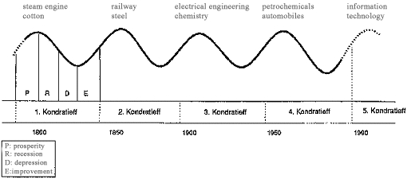 

上の図は波の理論のフレームでみた、世界の経済トレンドの概略である。

コンドラチェフの波は、実際の応用においてその意義は明確ではなく、学術的に研究されにくいため、あまり学術界で重視されていない。現在、コンドラチェフの理論は、非正統な多くの経済理論のもととなっている。

しかし、私達は1つの簡単な事実をこの中から抽出できる：

> ●1つの上昇はトレンドとは言えず、1つの下落もトレンドと言えない。
>
> ●1つの上昇と1つの下落で、1つの周期となる。
>
> ●トレンドを判断するのに少なくとも2つの周期の時間がかかる……

2つの周期の後、その2つの波動が構成するのは3つのトレンドの中の1つである：上昇、横ばい、下落。

しかし、過去40年間の世界の株式市場指数の推移を見ると、多くの上下で構成される周期でつながった上昇トレンドであることを確認することができる。

 

私達がビットコインの価格推移を見たり、ブロックチェーン・デジタルアセットのマーケット規模の推移をみたりすると、同様に多くの上下で構成される周期がつながった上昇トレンドであることが確認できる。

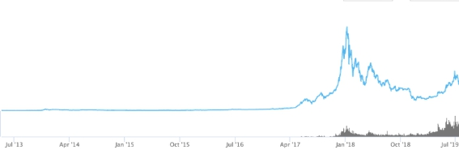 

では、なぜ20世紀、1930年代のアメリカが経済恐慌から回復するのにそれだけの時間がかかったのに対し（それは1つの周期の完成）、同世紀1990年代の金融危機から回復するのにかかった年月が、わずか数年だったのか。今世紀に至っては、リーマンショックから回復するのにさらに早くなったのか。

理由は簡単で、誰にでもわかる。

> 情報の高速な流通がグローバルでの協力をより簡単にし、危機は絶えずあるが、回復の時間はどんどん早くなっている。

これはまた**「経済周期の形成は本質的に多くの主体が協力または調整したり、協力または調整しなかったりすることから生まれたもの」**であるともいえよう。ここで言う複数とは多くの主体を指し、1つの主体が他の主体の存在すらわからないほどだ。コミュニケーションの効率が高くなるにつれ、周期の長さはどんどん短くなる。それは波動、すなわち、複数主体間の非協力が永遠と消えることがなくてもだ。

これこそが、ブロックチェーンに基づくデジタル・アセットの波動周期が短いかの主要因である。過去8年間で、私は多くの人からビットコインマイニング報酬の半減期、すなわち、4年周期で市場の判断の根拠とするのを聞いてきた。初期では、まだ少し理にかなっているかもしれない。しかし、ビットコインの市場規模がブロックチェーンに基づくデジタル・アセットの市場規模の全部でなくなった時点から、このような判断はその意味をなくしている。

私は、ブロックチェーンに基づくデジタル・アセットの周期は、全体的に株式市場の周期より短く、しかも将来においてさらに短くなると考えるキーポイントは、ブロックチェーンに基づくデジタル・アセットの複数主体間の協力・調整効率が高いからである。地球上で影響力のある株式市場は数個に限られているのに対し、ブロックチェーンの取引市場は？coinmarketcapで見てみるとわかるだろう。その数は数千であり、24時間365日、止まることなく取引されている。市場の調整効率は、従来の株式市場より遥かに高いのである。

周期は短縮している。この簡単な結論は一般人にとってどんな意義があるだろうか。簡単に言うと：

> **いわゆる「永遠」は短縮されている。**

永遠も短縮されているのに、長期は長いのだろうか。

長期とはなにか。一般人からすると、いわゆる長期は**「少なくとも2つの大きな周期が過ぎた」**くらいだ。もし3つの周期を超えることができれば、基本的にバフェットが言う永遠に相当するだろう。2つの周期はどれほど長いのだろうか。現在のブロックチェーンに基づくデジタル・アセットの総市場規模の周期は約3年から5年である。よって、7年前後の時間が経った時に、2つの周期が過ぎたと判断できる。注意してほしい。**重要なことは2つの大きな周期であり**、7年ではない。

どうやって周期を判断したらよいのだろうか。それは非常にシンプルで、最近の歴史的な最高点を探し、それを今の周期のB段（すなわち、下落段階の起点）とし、次のみんなが知っている最高点を探し、それを1つの周期とすればよいのである。

注意を要することは、このような大きな周期は、全ての人にとって、B段の起点のみ知られていることだ。B段がいつ終わるのか、A段がB段の終了後と同時に始まり、A段はいつ終わるのか。それは判断出来ないし、判断する必要性もないのである。なぜなら、1つの周期でしかないからである。しかし、2つの周期が過ぎれば、あなたは2つ周期が過ぎたことを知らないわけにはいかないのである。

そのときになれば、保有し続けるか、全て現金化するか、一部を現金化するかは本人の判断次第である。現在のあなたは、将来の自分の姿を想像することはできないが、経験者として言わせてもらうと、あなたの最大の変化は本当にそれを実現した全ての人と同じなのである：

> **かつてなく落ち着きがあり、余裕がある。**

あなたは一般人であり、あなたにとっての長期はどれほど長いのか。私は既にあなたに伝えている。それは非常に簡単で、2つの大きな周期以上ということだ。これはなぜ私達が一般人としてブロックチェーンに基づくデジタル・アセットを選び、[BOX](https://b.watch) 積立投資を選ぶかの理由である。2つの周期は本当に短いのだ。特に遠くない将来において、2つの周期を経験したあなたが戻ってみると、私の言うことをよく理解できるようになるだろう。

急ぐな、いわゆる長期はそんなに長くない。

---

## **終わりに**

私の伝えたい事が伝わったと願いたい――私はこれが本当に難しいことであるのを知っている。ここまで読んだあなたも、その難しさを理解しているだろう。

私はただ、すでに確立されている事実を皆さんに伝えたかっただけだ：

> **私達は普通の人だが、私達の一人ひとりが普通ではない生き方を手に入れるチャンスがある。**

方法も簡単だ：

> あなたの能動の境界の内側で、絶えず心の修練を行い、一生懸命マーケットの外で稼ぐ。それと同時に、能動の境界の外側で、能動的に[BOX](https://b.watch)を選び、マーケット外で稼いだお金で、定期的に投資する。長くやっていけば、あなたはトレンドが生む素晴らしい受動のパワーで、漸次階級の固定化の束縛から解放される。最終的に、自由を得る。

振り返ってみると、私が執筆した著書で道理を語るのは一日二日ではなかった。《把時間当作朋友》の出版も気づけば10年前だ。

今回、本書を執筆する時の心の持ち方はいつもと違うものだった。なぜなら、これは私が伝えてきたことの中で最も実践的なものだからだ。実践の方式や方法も明確すぎて、目標が非常に現実的であることから、非常にワクワクできたことだろう。

これは一冊の書籍にとどまることなく、1つの完全なるプロダクトである。

> ●実践方法論：積立投資
>
> ●実践ターゲット：BOXシリーズ
>
> ●実践追加補給ステーション：[b.watch](https://b.watch)
>
> ●実践コミュニティ：笑来積立レッスン

これは実は、コーディング技術を改めて勉強するようになった結果である。

2019年1月2日、私はやっと十数年前から書きたかった一冊の本の執筆に着手した。それは真の初心者のためのプログラミング書だ。2019年7月、[《自学是門手芸》](https://github.com/selfteaching/the-craft-of-selfteaching)が発売され、数日後、「コンピューティング類新書ランキング1位」となった。実は2019年の3月15日に、私はこの本の電子版をオープンソースでGitHubにアップした。結果、当日中で全世界のオープンソースプロジェクトの注目度1位となり、連続16日続いた。

私がプログラミングを勉強するのは、自分のプロダクトのコーディングをしたいわけではない。私の目的は簡単だ。

> 私が少しでもコーディングを理解できていれば、より多くの優秀なエンジニアとつながることができ、彼らとより低コストでコミュニケーションを取ることができる。

もし全く理解していなかったら、今手元にある、1つの完全であるプロダクト（BOX）と実践環境を提供出来なかった。

どんな想いが私を突き動かしたのか。それは、

> **実践を極めれば無敵である！**

私は実践を推奨し、出来なかったら役に立たないと考える。もし私が1つの道理をクリアに説明することができ、それを実践する銘柄と環境を提供できたら、それほど素晴らしいことはないだろう。

昔、妻は私に1つの歌を聞かせた。歌詞の意味は大体こんな感じだ。

> 「私が思いつく最もロマンチックなことは、あなたと一緒にゆっくり老いていくこと。」

私は笑った。私は、これはあなたで、私はそう思わないと話した。妻は、どう思っているの？と質問した。

私は、

> 「私が思いつく最もロマンチックなことは、あなたと一緒にゆっくり**富んでいくこと**。」

と答えた。韻は踏んでいないかもしれないが、もっとロマンチックになった気がした。最もロマンチックなことは、年月が経ち私が本当にそれを実現したことだ。

実はこれは私のオリジナルではない。以前読書する時に、バフェットは多くの人のことが理解出来ないということを読んだ。彼はなぜ人々はゆっくり富んでいこうとしないのかを理解できないようだ。人々は急激に富んでいこうとしているが、少しも実現出来ず、死んでいく。なぜゆっくり富んでいくことを受け入れられないのか。なぜゆっくり富んでいくことを好まないのか。

今、妻が私に言った言葉を少し変えてあなたに送る：

> **「私が思いつく最もロマンチックなことは、あなたがゆっくり富んでいくことを見届けること。」**

読んだから見える、想像できる、最終的に**実現できるまで**。これより幸せなことはあるだろうか。

私は想像できるから、実現できるから、他の人が自分のノウハウの共有から最終的に実現するまで見届けられる。これよりロマンチックなことはあるだろうか！

**李笑来**

二〇一九年七月十二日、北京にて

---

# **付録**

## **1.なぜブロックチェーン・デジタルアセットに投資する必要があるか**

理論上、積立投資戦略は多くの投資ターゲットに投資することができる。将来の十年の間、過去に広範囲に渡って重視されて来なかったのがブロックチェーン・デジタルアセットだ。

まずはビットコインから話そう。ビットコインは地球上最初のブロックチェーン技術を用いたデジタル・アセットだ。この点は疑う余地がない。過去の十年の間で、ビットコインを巡って様々な議論がなされてきた。毎回の価格の上昇下落に伴い、死亡宣告を繰り返し下されてきた。今まで、ビットコインは少なくとも364回死亡宣言された。皆さんはこのウェブサイトを覚えておくとよいだろう。このサイトでは歴史上のビットコイン死亡の言論を調べることができる。

https://99bitcoins.com/bitcoin-obituaries/

多くの人は新しい言葉を作り、専門家かのように、今のビットコインはコンセンサスを獲得……のようなことを言っている。ビットコインの技術の詳細については、私は他の専門的な講義で説明する。しかし、ここで明確に言えることは、ブロックチェーン技術における「コンセンサス」（Concensus）という言葉は、マシン同士の間でアルゴリズムを用いて実現するコンセンサスであって、人と人の間のコンセンサスではないということだ。

人と人の間では、標準化されたコミュニケーション・プロトコルは存在せず、有効なコンセンサスの形成はほぼ不可能である。無いわけではないが、各色人種の間の唯一のコンセンサスは金儲けしか思い浮かばない。これ以外は、特にコンセンサスがない。専門用語を気楽に使うのを慎むべきだ。

ビットコインがすごいのは、「価格コンセンサス」のようなものがあるからではない。これを説明するには**「皆難否」**という私が作った言葉を使う必要がある。「皆難否」とは何か。それは、あなたが受け入れるかどうかによらず、キーポイントは全ての人がなかなか否定できないこと。これが「皆難否」である。

つまり、すごいのは「人々が受け入れる」ではなく、**「皆難否」にある**――誰も否定できない事実ということだ。ビットコインがすごいのは、いつか人々に受け入れられるのではない。米ドルはすごいけど、北京の屋台で米ドルを支払うと、ほとんどの場合、断られるだろう。しかし、誰も本当の米ドルの価値を疑わない。

現在のビットコインはここまで来ている。上がっても、下がっても、どうせ「皆難否」である。ビットコインが誕生した十年後の今日、ブロックチェーンの価値は、同様に既に皆難否の属性を持つようになっている。一方で、ブロックチェーンに基づくデジタル・アセットの価値の上昇というトレンドも同様皆難否である。ブロックチェーン・デジタルアセットに投資する最大な理由はここにある。

8年前に、私がビットコインに投資し始めた理由はシンプルである。

> インターネットによる情報流通における大幅なコストカットが（限りになくゼロに近い）どうやって世界を変えてきたかを、我々は既に知っている。もし資産の流通におけるコストを大幅に削減（限りなくゼロに近い）できるものがあるとしたら、世界は間違いなくそれによって大きく変えられる。どれほど大きな変化かについては想像もつかない。30年前の我々が、インターネットによってどれだけ世界が変えられるのかを想像出来なかったように。だから、30年前にインターネットに投資するのが正解だとすれば、今私がブロックチェーンに投資するのも正解であり、前者は「情報のインターネット」だとすれば、後者は「価値のインターネット」だ。

8年後の今日、ビットコインは当初の**「社会実験」**でなくなり、とっくに**「社会実践」**となっている。今後持続的に発展していくトレンドからすれば、皆難否だけでなく、もっと重要なのは、このトレンドは非常に長く続くことである。

ビットコインのホワイトペーパーによると、2140年までマイニングされ続けられる。十年前に、このような計画を見ると、ありえないと思うかもしれない。しかし、十年が経過今、ビットコインはもはや「実験」ではなくなり、「実践」である。しかもこのトレンドは120年も続くのである。基本的に読者たちの生命の極限を超えている。このようなこともあり、私はこれより長いトレンドを見つけるのは不可能だと考えている。

一方で、もっと重要なことは、10年後の今日、投資できるブロックチェーンに基づくデジタル・アセットは1つだけではないということだ。私がこのマーケットに入った時、銘柄は1つしかなく、それがビットコインだった。その後、数千のアルトコインは出現しているが、今も活躍しているライトコインを含め、私の中で最も安心できるのはビットコインしかない。

1つの銘柄しか選べない時、1つの問題がある。**機会コストをコントロールできないことだ。**

今は昔と違い、投資に値する銘柄が多数ある。よって、多くの銘柄に投資することで、この重要な投資戦略を実行することができる。すなわち、機会コストをコントロールすることである。これは非常に重要な投資戦略であるが、多くの投資家がこのような基本的な概念を理解できていない。

これは、なぜ私が[BOX](https://b.watch)という多銘柄パッケージのソリューションを設計したかにもつながる。従来の金融マーケットにおいて、このような多銘柄のパッケージのことをETF（Exchange Traded Fund）と呼ぶ。このような概念はそう簡単に説明出来ないが、ETFの基本的な特徴から理解を深めることは可能だ。

> ●多銘柄を1つのパッケージとする；
>
> ●マーケットで取引できるTokenでこのパッケージとペッグする；
>
> ●一定の条件が満たせば、Tokenの保有者はTokenとパッケージの銘柄と交換ができる。

[BOX](https://b.watch) はそのようなETFだ。

## **2.なぜBOXに積立投資をするのか**

[BOX](https://b.watch)はBTC＋EOS＋XINの略称であり、[BOX](https://b.watch)自身も「箱」という意味を持つ。そして[BOX](https://b.watch)は李笑来が設計したETF商品であることから、多くの人に「養分箱」とも笑われているようだ。

[BOX](https://b.watch)の購買やパッケージとの交換はこのウェブサイトでできる：

https://b.watch

### **2.1.[BOX](https://b.watch) 詳細**

BOXは非常にシンプルで**「1つの主流ブロックチェーン・デジタルアセットの銘柄をまとめたパッケージ」**とペッグしたトークン（Token）である。パッケージ構成は以下の通りだ。

> ●1 BTC
>
> ●1500 EOS
>
> ●8 XIN
>
> ------
>
> = 10,000 BOX

つまり、1[BOX](https://b.watch)を交換したければ0.0001BTC＋0.15EOS＋0.0008XINが必要である。

> ●相応数量のBTC+EOS+XINで[BOX](https://b.watch)と交換できる。
>
> ●一定条件を満たせば、[BOX](https://b.watch)を返却し、相応数量のBTC+EOS+XINを取り戻すことができる。
>
> ●USDTを使ってマーケットで[BOX](https://b.watch)を売買できる。

[BOX](https://b.watch)でBTC+EOS+XINを取り戻す条件は以下の通りである：

> ●所有する[BOX](https://b.watch)の市場価格が10,000ドルを超えた場合、手数料1％；
>
> ●マーケットで売る場合、手数料は1％；
>
> ●積立投資を始める際に設定した取戻時期（例：自分で3年後を設定）……

[BOX](https://b.watch)は1つのETFファンド商品である。ただし、このファンドはあなたが以前から知っているファンドとは違う。「[BOX](https://b.watch)は管理費を徴収しない」のである。**言い換えれば、管理費がゼロである。その理由は設計者の李笑来はこの管理費用をもらいたくないからだ。**また、李笑来本人も[BOX](https://b.watch)の積立投資をしている。

[BOX](https://b.watch)は100％オープンである。[BOX](https://b.watch)の保有者アドレスは公開されており、いつでも調べることができる。なぜなら全ての記録がMixinのパブリックチェーン上に刻まれているからだ。詳細はbwatchの説明を参考。「養分箱」の中にどれだけのBTC＋EOS＋XINがあれば、どれだけの[BOX](https://b.watch) Tokenが流通されているかが分かる。そしてどれだけの[BOX](https://b.watch)がロックアップ（未発行や回収した数量を含む）されているかもオープンである。つまり、[BOX](https://b.watch)は好き勝手に発行量を増やすことが出来ず、好き勝手に流通量を増やすことも出来ない。このようなこともあり、[BOX](https://b.watch)が他の取引所で上場した際は、ユーザーは「好き勝手に流通量を増やしているかどうか」を確認できる。これは非常に重要なことであり、初心者は少し時間を掛けて理解することが必要だ。

### **2.2.[BOX](https://b.watch)の優位性**

[BOX](https://b.watch)のパッケージの選択と割合の配置は以下のルールに従う。

### **2.2.1.ブロックチェーンに投資するなら、主流のアセットに投資する**

新たなトレンドの中で、ブロックチェーンの主流アセットはより重視されるようになるだろう。2017-2018年のブル・ベアを経験したマーケットは教育され、新しい銘柄への「盲目的な楽観視」及び「盲目的な期待」はなくなった。単にホワイトペーパーを書いただけの、資金調達だけが目的のプロジェクトが非常に脆い、ということが証明されたためである。

爆上げするのは主流アセットか仕手アセットであることが、新たなトレンドだ。仕手アセットに触れないのは儲からないからではなく、短時間では儲かるかもしれないが、長期的には続かないからだ。よって、我々のような積立投資をする投資家には向かないのである。積立投資家が乗り越えなければいけないのは、1度限りのベア・マーケットではないため、長期銘柄しか選ぶことができない。つまり、「主流アセット」と「仕手アセット」の中で、我々は「主流アセット」しか選ぶことができないのである。

### **2.2.2.ブロックチェーン技術の発展のロジックに沿っていること**

多くの年月が経ち、正確には今までの8年間だが、多くの観察、投資、実践と思考を重ねた結果、ブロックチェーンが世の中を変える際にたどる発展ロジックは、以下のようなものだと私は考える。それは、

> 信頼できる元帳（BTC）→ 信頼できるコードプラットフォーム（ETH/EOS）→ 信頼できる実行環境（Mixin）→ 信頼できるハードウェア（？）……

実は、これは私の投資ロジックでもある。ビットコイン以降、私が初期投資をし、2017年閉鎖したYunbiは世界初のイーサリアム（ETH）の取引を提供する取引所であった。その後、私はエンジェル投資家としてEOSに投資した。そして、Mixinも私がエンジェル投資家として投資した。投資成功のキーポイントは「投資活動が業界発展のロジックに沿っていること」である。トレンドと友達になり、自分の投資に対して努力を続けることが大事である。トレンドを敵に回してはいけないのだ。

[BOX](https://b.watch)のパッケージ銘柄選択は、ブロックチェーン技術の発展ロジックに沿ったものである。

ここで、なぜETHとEOSを比較し、EOSを選んだのか、理由を説明しよう。信頼できるコードの段階では、ETHはEOSより早く出現している。しかし、両者の違いはDOSとWindowsの違いのようなもので、EOSはマルチスレッドであり、EOSの技術を担うBlock One社も現在ブロックチェーンの世界で資金力が最も強い会社である。よって、EOSを選ぶほうがより安心かつ、長期的に成功の蓋然性が高いのだ。

我々が任意の単一銘柄に積立投資するのではなく（例えばビットコイン）、銘柄のパッケージ（例えば[BOX](https://b.watch)）に投資することの副産物として、機会コストを効果的にコントロールできることに加え、投資の対象も「あるプロジェクト」から「ある業界」にシフトする。これはリスクヘッジとして最も有効な方法である。

### **2.2.3.配分比例の考慮**

現在（2019.7）のBitcoin Dominance は、ブロックチェーン市場において 63％を占める。この比例は短期的に上昇するかもしれないが、長期的にはブロックチェーン技術の発展と普及につれて下落していくと思われる。ビットコインが発展しなくなったのではなく、ビットコインが発展するのと同時に他のアセットも発展するため、長期的にみるとそのスピードはビットコインよりも早い可能性があるのだ。つまり、ビットコインが50％を占めるのは合理的であるのだ。

残りの半分は、およそ 4:1 の比例でEOSとXINになっている。これは個人的にXINの発展スピードはそれほど遅くないと考えるからだ。

人々の[Mixin](https://mixin.one)へのよくある誤解として、Mixinをただのチャッティングアプリだと思うことが挙げられる。実はMixin Messengerがチャッティングアプリであり、Mixin Networkはパブリックチェーンである。Mixin Messenger は Mixin Networkの最初のDappである。マーケットにあるほとんどのパブリックチェーンは（2019年7月の[EOS](https://eos.io)を含め）依然として、きちんとしたDappがないのである。最も一般的なDappはサイコロを投げるようなくだらないDappに過ぎない。

Mixin Networkは技術面で少し変わった道を選んだ。

他のパブリックチェーンは**ボトムアップ**式で、パブリックチェーンの開発が先で、開発したパブリックチェーンの上でDappを開発する。いわゆる「エコシステムの創造」である。

一方、Mixin Networkのやり方は**トップダウン**式で、非常に優れたDapp（即ちMixin Messenger）を開発してから漸次ベースのパブリックチェーンの開発を行っている。よって、Mixin Messengerは非常に早い段階から発表された（2017.12）。約1年後（2019.2）Mixin Networkのパブリックチェーンは正式にローンチされた。いわゆる「サイコロゲーム」のようなDappはMixin Networkの中ではMixin Messengerの中の1つのボットでしか無いのである。一方、Ocean.oneはMixin Networkの中のDEXである。より多くのアプリは開発中であり、私が設計した[BOX](https://b.watch)及びその取引所の [b.watch](https://b.watch)が一例として挙げられる。Mixin Networkのようなパブリックチェーンがなければ、そもそも作ることが出来ないのである。それに似たパブリックチェーンは試したことがないのではなく、使えなかったのだ。そのような背景もあり、私の設計では、XINの[BOX](https://b.watch)における比例は確かに高いかもしれない。

一言でまとめると、[BOX](https://b.watch)は損することのないETF商品である。もし損したら、ブロックチェーンという業界がだめだっただけで、私のせいでも、あなたのせいでもない。ただし、**ブロックチェーン業界がよければ、[BOX](https://b.watch)は絶対によいのだ**。ブロックチェーン業界は今後ますます発展していくと思われるため、私たちの勝率は高い。それだけのことだ。

## **3.b.watchに関して**

[b.watch](https://b.watch)は[BOX](https://b.watch) 購買、返却、取引をする場である。

現在、[b.watch](https://b.watch)が将来に期待できる収益は2つある。

> 1. [BOX](https://b.watch)返却の際に払う1％の手数料；
> 2. [BOX](https://b.watch)の取引市場における取引。BOX/USDTの取引の千分の一の手数料、即ち取引額の2％である。

これらの収入の50％は定期的に[BOX](https://b.watch)保有者に配布される。最初のうちは、収益はそれほど多くないと感じるかもしれないが、時間が経つに連れ、[BOX](https://b.watch)と[b.watch](https://b.watch)は非常に大きな発展を遂げるだろう。

今後生まれる可能性がある収益は：

> ●EOSのノード収益
>
> ●XINのノード収益

ノードとして、一定の蓄積が必要であることから、時期が熟した時に[b.watch](https://b.watch)はノード収益計画を始める。スーパーノードが収益を生んだ時に、原価を除いた収益はノード収益となり、100％BOXの保有者に配布される。

このような配分計画のもと、[b.watch](https://b.watch)の企業価値は基本的に「返却手数料の5％と取引手数料の1％」にある。将来の7年間で[b.watch](https://b.watch)の企業価値の100％は笑来レッスンで配分される。即ち、一定のルールで[b.watch](https://b.watch)の株を配布する。例えば、

> ●BOXの保有時間の長さ
>
> ●BOX積立投資のミッションの完成度
>
> ●笑来レッスンの売上

## **4.笑来積立投資レッスンについて**

**笑来積立投資レッスン**は、李笑来のブロックチェーン教育プロダクトである。

ブロックチェーンの世界で8年間を生きた後、李笑来という8年の先輩養分は、自分が生き残って来られた経験と智慧を共有したい強烈な意欲が湧いてきた。この気持は理解してくれるどろう。

ただし、李笑来がやりたいことは信頼できる投資の知識を伝播するのと同時に、多くの一般人と一緒にお金を稼ぐことだ。笑来レッスンのような、知識の伝播と同時にお金を稼げるケースは史上稀である。幸いなことに、ブロックチェーン業界の急速の発展が、我々にこのようなチャンスをもたらしたのだ。

笑来積立投資レッスンは、李笑来の知識のマネタイズの場所だけではない。もっと重要なことは、笑来積立投資レッスンは多くの受講者にとって**「マーケット外でお金を稼ぐチャンス」**である。李笑来は良質なコンテンツを提供し、受講者は勉強・吸収・実践する以外に、講義のセールスをすることでビットコインを得ることができる。お金を稼ぐだけではなく、ビットコインを稼ぐのだ。なぜなら、笑来レッスンはビットコイン支払いしか受付けないからだ。

笑来積立投資レッスンを売ることでビットコインを稼ぐだけではなく、自分が作った積立投資計画を完成出来た人はさらなるご褒美が待っている。

> ●[b.watch](https://b.watch)という世界初のチェーン上ブロックチェーンETF取引所の株をゲットできるチャンスがある。[BOX](https://b.watch) と一緒に成長し、さらに[b.watch](https://b.watch)と一緒に成長することができる。

総じて、笑来積立投資レッスンは、受講者と李笑来が一緒に成長できる場所である――**黙ってお金を稼ぐのは悪いことではない**。

それと同時に、私自身も[BOX](https://b.watch) の積立投資をし、長期的に[BOX](https://b.watch) を保有する。積立投資は、一般人が唯一頼ることのできる投資戦略である。しかし、言うのは簡単だが、実践するのは難しい。実際にやったことのない人、やってできなかった人は、どこが難しいかさえも理解出来ないであろう。しかも、最も重要なことは、一緒に頑張る仲間がいることである――長時間の孤独に耐え続けることは、誰にもできない。

笑来積立投資レッスンの独特なところは、講義する人である李笑来が、過去十数年間、自ら決めた1つの基本原則を守っている点だ：

> **つまり、自分が既に出来たことしか言わない。**

[BOX](https://b.watch/)（積立投資活動）も李笑来ができてから話し、改良を重ねたプロダクトである。なんとなく作ったものではない。

笑来積立投資レッスンは、李笑来が皆さんに投資の理念をシェアする場所である。繰り返しとなるが、知識と認知の伝達は簡単でないのだ。

> 知る、学ぶ、思いつくのは全て当然のこと。特に、投資のような階級を超えることを目標とすることにおいては。
>
> 最終的に、**実践できなければ意味がない。**

知識と認識は実践の中でしか価値を発揮できない。一方で、実践そのものも、知識と認識の指導が必要である。

投資の教育は非常に重要である。投資以前に、最も基本的なことであるお金を稼ぐ方法でさえ、両親がわからなかったり、学校では教えてくれなかったりするため、自分自身で模索しながら学んで行くしかない。そして、社会全体も金稼ぐことについて人々を誤導している。

多くの人は李白（唐の時代の詩人）のことを真似して視金銭如糞土（お金を糞土と見なす）、千金散盡還復來（お金は使っても戻ってくる）と言っている。李白は官僚の娘と結婚し、妻を家に置いて振り向かず、岳父のお金を使って毎日遊ぶ愚かなヒモ男だ。お金を使い切ったら、家に2日くらいいて、また岳父のお金で遊びにいく。だから彼は当然のごとく、視金銭如糞土（お金を糞土と見なす）、千金散盡還復來（お金は使っても戻ってくる）と思うようになったのだろう。彼が使ったお金は、彼自身が稼いだお金なのか？彼は、お金の稼ぎ方を知っていたのか？いや、彼はただのクズ男だ。

投資は非常に重要なスキルである。誇張なしで言うと、投機でさえ非常に難しいのである。なぜなら、失敗すると自殺したくなるからだ。去年の（中国人）某教授も、今年の某優秀な学生も、投機に失敗し自殺したのではないだろうか。

**お金を稼ぐのは恥ずかしいことではない。綺麗なお金を稼げないことこそ恥ずかしいことだ。**

私からすると、投資は全ての人にとって必須科目であり、真面目に投資の勉強をしない理由が思い当たらないのである。