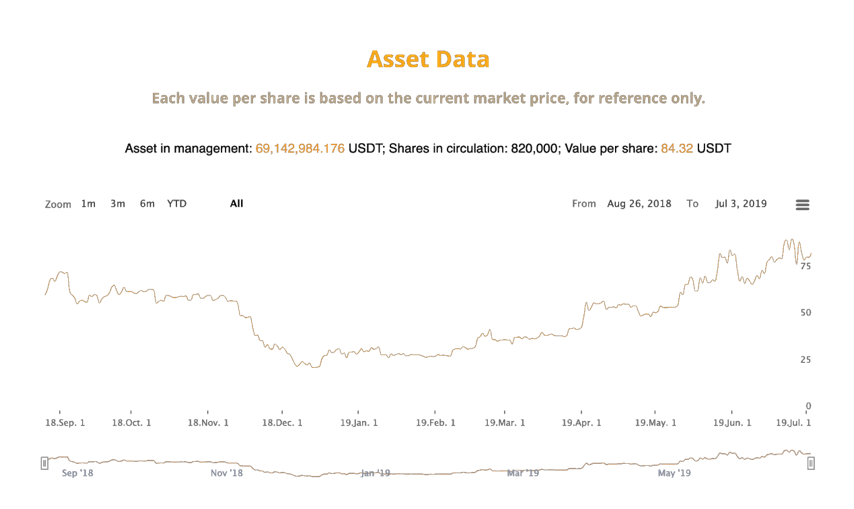
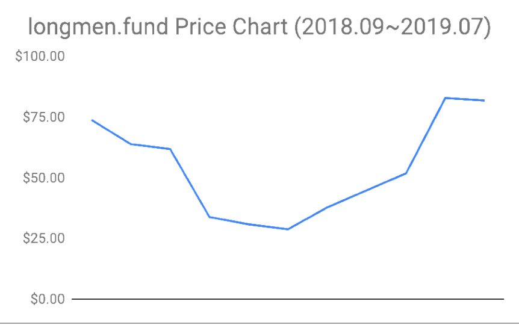
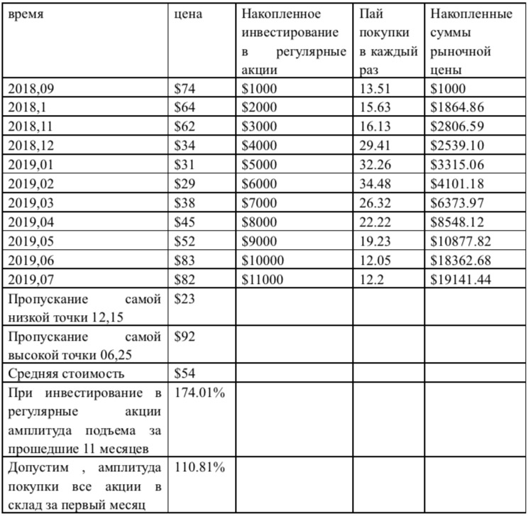
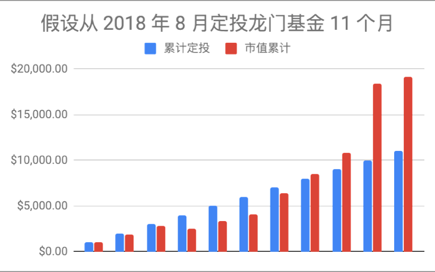
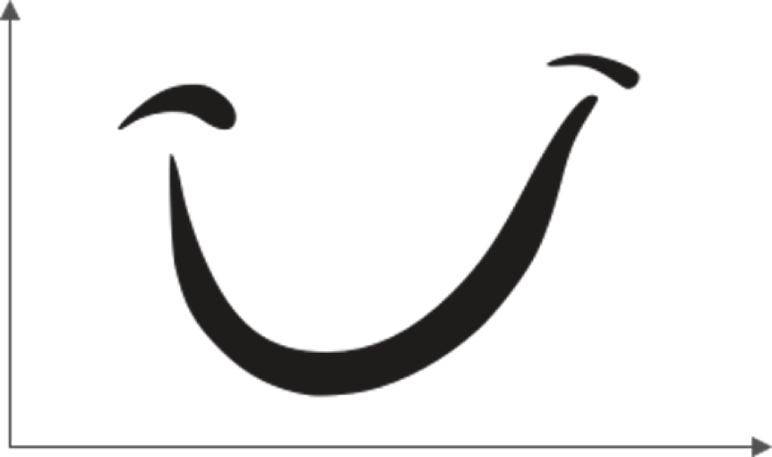
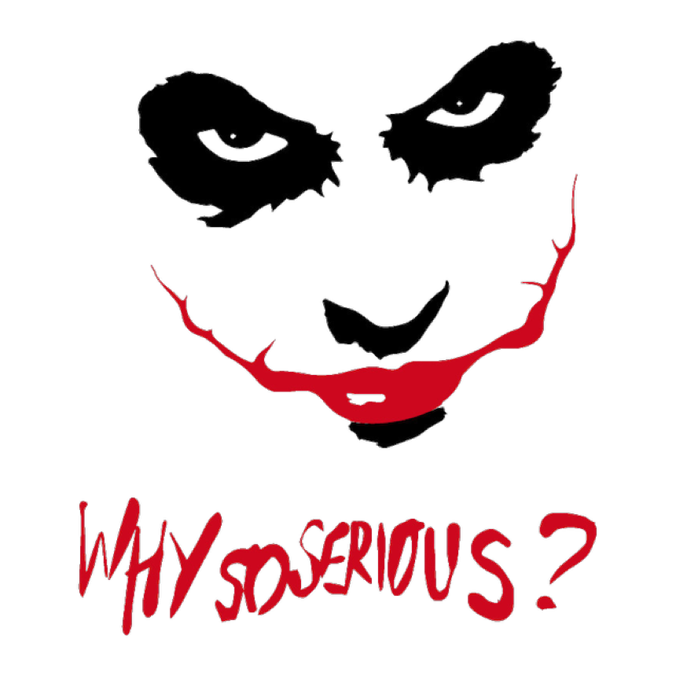

##3. Единственный правильный способ инвестирования простого человека-это инвестирование в регулярные акции.

Прямо начнем говорить с вывода：

В этом волшебном месте, где торгуются на бирже, единственный надежный способ инвестирования только является инвестированием в регулярные акции, запомните!

Поскольку [BOX](https://b.watch/), первый на земле блокчейн-ETF, только что был создан (3 июля 2019 года, так называемый "кругбиткойна- двое одиннадцатых", "фестиваль лук-порей третьего июля"), данные которого не были достаточно долго, поэтому его нельзя использовать в качестве примера, чтобы объяснить единственный надежный способ инвестирования для простого человека.

[Фонд Лонгмена](http://www.longmen.fund/), раньше явился битфундом . Он был основан Ли Сяолаем в 2013 году, ликвидирован в 2018 году. Некоторые инвесторы решили продолжить его через пять лет, поэтому он создал этот продукт ETF для фонду Лонгмена. В настоящее время фонд Лонгмена не публично торгуется. В настоящее время только несколько приглашенных, в соответствии с квалификацией и качеством, имеет право на участие в инвестировании\...\... Однако, поскольку он имеет долгие открытые и прозрачные данные. Его можно использовать в качестве примера для инвестирования в регулярные акции.

Вот скриншот на веб-сайте фонда Лонгмена в начале июля 2019 года：

Чтобы использовать эти данные в качестве примера инвестирования в регулярные акции, давайте покажем данные в каждом месяце：

Предположим, что вы регулярно инвестировали \$ 1,000 в месяц в фонд Лонгмена, начиная с сентября 2018 года, за 11 месяцев\...\... Ну, данные показаны следующим

образом：

Это означает, что вы пропустили самый высокий балл, \$92 июня 25, 2019; Вы также

пропустили самый низкий балл, \$ 23 декабря 15, 2018\...\... Но, в конце концов, ваша средняя цена составляет \$ 54. Текущая цена составляет около \$ 85.Через 11 месяцев вы всего инвестируете 11 000 долларов США; Ваша текущая балансовая стоимость составляет 19 141. 44доллар США. Даже если бы это было в последний раз, когда вы определили цену,\$82-это все еще упало на \$1 по сравнению с предыдущим месяцем\...\... Тем не менее, ваша доходность составляет 74.01%!

Посмотрите на приведенную ниже диаграмму, вы более четко увидите, какое отношение между инвестированной основной суммой и текущей прибылью составилось：

Допустим, с августа 2018 года начал инвестировать в фонд Лунмэнь за 11 месяцве.

累计定投 Накопленное инвестирование в регулярные акции

市值累计 Накопленные суммы рыночной цены

По вышепоказанным данным в период 11 месяцев ценовая кривая нарисовывает

увлекательную \"кривую улыбку\" .

Людей, которые принимают стратегии инвестирования в регулярные акции на бирже, всегда будет меньшинством. Вышесказанная эта так называемая "кривая улыбка", скорее всего, наоборот , будет противоположной "пошлой кривой"для тех, кто не принимает стратегии инвестирования в регулярные акции.Это совсем не доброе улыбающееся лицо, а злобное улыбающееся лицо Джокера, которого вы видели в истории Бэтмена . В его рту все еще мрачно бормочет: \"Why so serious?"

Теперь посмотрите на данные. Предположим, что ваш способ инвестирования - это то, что подавляющее большинство людей любят инвестировать, так называемый"поставление всех ставок на один бросок"\...\.... . Вы получите \$11,000 за бросок в сентябре 2018 года, а затем получите 11 месяцев. Вы не потеряете, потому что у вас будет около 10.81% прибыли!---- Хотя на 74.01% хуже, но ведь ничего не потеряно!

Однако,по характеристике одного броска, который вы любите, возможность , сколько вы получите после 11 месяцев, на самом деле невелика.Почему?Для человека, с любовью к одному броску эта совсем будет кривой убогой.

Не говорите о каждом следующем месяце, каждом следующем дни,каждый момент вы будете страдать и волноваться за это .За следующие полгода, единственное чувство- это то, что ваши активы сокращаются каждую минуту.

Боль и радость не симметричны.Наши гены определяют наше чувство. Боль от потери 10 долларов намного больше, чем радость за зарабрату в объеме 10 долларов.Это чувство совсем похоже на то, что вас разоряет этот злой клоун и видя, как он плюет на
язык и слушая, как он мрачно бормочет. Почему это так важно......

Если вы , как инвестор с принятием инвестирования в регулярные акции, находитесь в совершенно другом мире.Хотя они выглядят одинаковы, хотя подавляющее большинство людей, кроме вас, просто не испытает ваше чувств. Потому что все чувство как раз противоположны.

\*\* Инвестирование в регулярные акции, это поступка с собственной долгосрочной поддержкой.\*\*Итак, раз поставьте ставки на свое будущее, то выбор был продуман.Таким образом, падение цены после первой покупки, это шанс для вас, чтобы снизить среднюю цену.Человек с лювовью к одному броску переживает зиму, дрожит, но вы были, как раз противоположны, здоровы, счастливы за то , что добавили больше дешевых ставок для себя......

Человек с любовью к одному броску не может долго терпеть страдание за это. - На самом деле, никто не может долго терпеть страдание.Это не имеет никакого отношения к так называемому \"сильному\".С другой стороны, это не глупо,это просто незнайка.Через месяц после страдания, или через два, или три месяца после страдания вы оглядывайтесь назад, как это произойдет. То есть в шестой месяц(или раньше) многие люди отойдут от биржи по разным причинам. Называется это поведение"разрезанием мяса" на торговых рынках\...\.... Видите, лук-порей отрезан сам себе. Все, что было отрезано, было кровавым мясом.

Как насчет вас?Вы настояли на этом еще?Нет!Это должно было быть так!Если в этом вы увидите дешевую ставку и не были позволены ее купить, вы будете сражаться с ним.Ведь поставили вам препятствие,где разбогатели , как убили родителей.Как вы считаете, что это не так?Вы не холодны?Вы не дрожите?Вы не чувствуете этого!Вы взволнованы, и вы взволнованы за каждое инвестирование в регулярные акции. Потому что каждое снижение средней цены значит , что вы сокращаете время для приёма разбогатения. Вы не будете так раздражены каждый день, как незнайка. \" увы!Если бы

я знал это раньше! "Или "Откуда мне это узнать?"В общем, они чувствуют, что они

опаздывают\...\.... Вы не то же самое,вы знаете, что ваше поведение ставит себя в

относительное время приема постоянно впереди.

Через полгода цена медленно поднималась\...\..... Как вы думаете, вернулся ли тот, кто вырезал мясо в это время? Не будет.Они боятся от этого. Переживание, которое раньше были хуже смерти, заставляет их ожидать большего страха.Таким образом, почти стопроцентная вероятность случилась, что они колебались, и у них не было никакой ставки в руках.Им только придётся наблюсти за ростом цен\...\... Когда цена падает, они бегают из-за страха.Теперь, когда цена поднимается, они еще больше боятся до того ,пока их настроение не сломалось.Возможно, цена уже становится высока,и к тому времени, когда начнется следующая убогая кривая, они снова вступят в игру.......

Для них оборот очень страшен. Потому что никак это делая, они не чувствуют себя в

полном доброты мире.С предыдущим объяснением теперь это просто, потому что для них кривая линия цены любого инвестиционного объекта состоит из бесчисленных убогих кривых . Как страшна такая судьба?

Разве это не удивительно, что люди могут чувствовать себя противоположно, хотя в одном и том же мире?Если вы человек с инвестированием в регулярные акции, то на мгновение, тот же мир,это еще другой вид для вас. Потому что кривая линия цены, с которой вы сталкиваетесь, состоит из бесчисленных кривых линий улыбки!В этом мире счастье было бы редким и дефицитным. Скажите, разве это счастье, о котором нельзя говорить другим людям, более дефицитно и ценно?