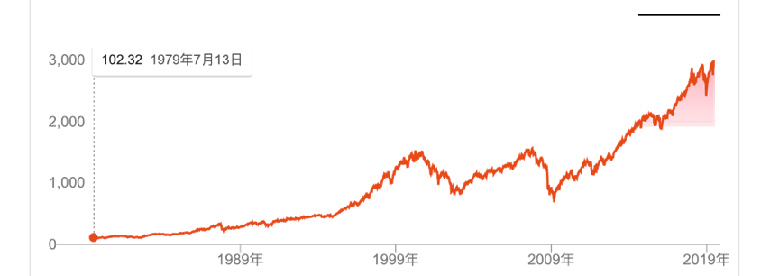

##4. Есть ли какие-либо инвестиционные объемы, которые только растут и не падают?

Когда вы, как простой человек, осознаете магию биржи и обнаруживаете, что там могут работать для себя самые умные люди в мире без порога, чтобы помочь вам выбрать лучший инвестиционный объект бесплатно. Хотя вы не были вне себя от радости, никак ненужно в малейшем самоунижении.Потому что подавляющее большинство как называемых инвесторов на бирже-незнайка , даже много директоров по инвестированию в костюмах явилось тоже незнайкой .......

Если вы не верите, я могу быстро научить вас очень эффективной технике ноу-хау.

Вы можете коротко спросить, когда сталкиваетесь с любым парнем, который играет эксперта перед вами：

> ...\... И как вы уменьшаете стоимость возможность?

Как правило, вы обнаружите, что собесседник мгновенно мигает в глазах,, а рот начинает мигать\...\... Не верьте, вы часто пытаетесь!

Перед нами стоит ещё одно смущение, когда мы принимаем бесплатные лучшие предложения, которые все умные люди на бирже предлагают нам. Если мы покупаем

только Ванко или любую из Гуйчжоу Маотай, Apple, кока-кола и китайский табак, мы сталкиваемся с серьезной проблемой：

> Альтернативные расходы на инвестирование только в один предмет неограниченны! Это абсолютно понятная концепция для любого простого человека!

Так называемый альтернативный расход означает, что если ваши деньги используются для инвестирования в определенный объект, эти деньги не могут быть использованы одновременно для инвестирования в другой объект\...\... Если вы инвестируете в A , эти

деньги не могут быть использованы одновременно для инвестиций в B. Таким образом, будущая рамка B становится альтернативным расходом для будущей прибыли от увеличения этих денег, которые вы инвестируете в A.

Если вы инвестируете только в один предмет, то ваш альтернативный расход на самом деле бесконечен!Таким образом, даже незнайка может мгновенно понять, почему вы должны найти способ для разбавления альтернативных расходов!Инвестирование-это полностью продуманная технология, которая не может думать только о возможной

доходности, но, конечно, о рисках расхода\...\... И " как разбавить альтернативные расходы" также является важным фактором, который необходимо учитывать!

Есть ли способ для решения? Конечно есть!Один простой способ-инвестирование в ряд качественных объектов. Когда вы покупаете индексный фонд или ETF, ваш инвестиционный объект больше не будет одним качественным бизнесом или проектом, а станет рядом качественных предприятий или проектов!

Здесь есть тонкий фокус, который многие игнорируют.Покупая ряд качественных предметов, вы эффективно разбавляете альтернативные издержки с одной стороны, а с другой, что более важно, свойства и качество ваших инвестиционных предметов меняются!Вашинвестиционный предмет превращается в долгосрочный предмет только вверх , а не вниз!

Существует ли такое удивление?Есть!Обязательно существует.

Высококачественное предприятие развивается до вечного расцветания , это было очень очень трудно.Самые хорошие предприятия также могут развиваться на спад. Вы слышали о Kodak, вы слышали о Nokia. Все эти компании были так.Такие компании, как Coca-Cola и Guizhou Maotai, являются чрезвычайно редкими, и даже они не знают, когда они столкнутся с катастрофой.Таким образом, инвестирование только в одну из лучших компаний, с одной стороны, с бесконечно высокими альтернативными расходами, а с другой стороны, нет никакого эффективного способа, чтобы чем дальше, тем больше в долгосрочной перспективе избавлять от катастрофы.

Но есть ли в этом мире предмет, который в долгосрочной перспективе только растет, а не падает?Есть!Это экономическое развитие человечества.

Вот почему в долгосрочной перспективе индекс цен на фондовой бирже развивается только в одну тенденцию к росту.Краткосрочные подъёмы и падения, которые составляют одну улыбающуюся кривую за другой (или убогую кривую). Все соединяются, получается только одна тенденция, то есть подъем. Хотя в середине существуется подъем и падение, в конце концов, все еще растет.

Ниже представлен график ценовых направлений за последние 40 лет (1979-2019 гг.) по индексу S & P 500：

Таким образом, когда вы инвестируете в ряд качественных объектов, вы не "ставите ставку "на какое-то предприятие,а вы"ставите" на то, что на самом деле становится экономическим развитием в целом\...\... Вы покупаете ряд качественных предметов на

китайском фондовой бирже, а вы на самом деле поставите ставку на общее экономическое развитие Китая!Вы покупаете ряд качественных предметов на фондовой бирже США, а вы на самом деле поставите ставку на общее экономическое развитие во всем мире. Потому что отличные компании во всем мире могут входить в США на биржу!Вы покупаете [BOX](https://b.watch/) (в мире blockchain существуется три качественных актива, BTC,EOS, XIN), тогда вы "ставите\", больше не является биткойном или каким-то блокчейн-проектом, вы в самом деле "поставите ставку" на развитие всей блокчейн- индустрии.

Поэтому, когда я программирую [BOX](https://b.watch/), самое главное, что нужно учитывать путь развития технологии blockchain, который я сказал во многих местах：

> Доверенные бухгалтельные книги→доверенные коды→доверенная обстанвка для выполнения→доверенные устройства......

По истории в 2011 году я, конечно, не пропустил биткойн; В 2016 году я не пропустил Ethereum; В 2017 году я был ангелом-инвестором EOS, самого горячего проекта Blockchain с рыночной капитализацией более 5 миллиардов долларов в 2019 году.Также, Mixin Network-это мой важный проект. Если один или два раза, это может быть только удача;Если два раза , даже три раза, это больше, не только удача, не так ли?Логика-это единственный относительно надежный инструмент, доступный человечеству, когда он сталкивается с будущим. В этой программе нет ничего эгоистичного смысла. Потому что программист [BOX](https://b.watch/) Ли Сяолай не взимает плату за управление (это может быть первый в мире блокчейн-ETF, который не взимает плату за управление).Более важно, что Ли Сяолай зарабатывается только инвестированием в регулярную акцию [BOX](https://b.watch/) в одних и тех же условиях, как у всех.

На самом деле, настоящее удивление фонодовой бирже расположено здесь!Здесь каждый может следить за экономическим развитием всего человечества или всего общества.Прелесть глобализации заключается в том, что простые японцы могут

покупать американские акции, чтобы идти в ногу с экономическим развитием США во время экономического спада в своей стране; Простые американцы могут покупать китайские акции, когда экономика США застаивается, чтобы идти в ногу с экономическим развитием Китая; Хотя простые китайцы покупают японские акции неудобно, покупать американские акции неудобно, даже покупать гонконгские акции неудобно\...\... Это также может идти в ногу с разрушительным подъёмом и развитием финансового интернета на почти вездесущем фондовой бирже blockchain по всему миру, как и все простые люди по всему миру.

Здесь существует скрытый фокус.：

> Нет предмет, который только поднимается вверх, а не падает вниз . Существует только в долгосрочной перспективе поднимается и не падает.

В книге \"самосовершенствование лука-порея\" я пытаюсь исправить истину, которую большинство простых людей неправильно понимают：

>-   Во время торговли на бирже действительно существует игра с нулевой суммой. Видно, что прибыль вашего оппонента исходит от вашей потери.

>-   Биржа-это абсолютно не игра с нулевой суммой для долгосрочных инвесторов, поскольку их рост в основном происходит от экономического роста, а не от краткосрочных потерь других.

Вот это самая важная причина, почему единственным надежным способом инвестирования на бирже для простых людей является инвестирование в регулярные акции. В свою очередь, как простой человек, у вас только долгосрочное инвестирование, долгосрочные холдинги являются надежными.

Простые люди не могут иметь много денег в ранний период. Но с помощью инвестирования в регулярные акции простые люди "поставляют ставку \" на свои собственные внебиржевые возможности и долгосрочную дисциплину фиксированного броска - это самая большая ставка!Поскольку ваше время является абсолютно эксклюзивным активом. Это может быть только альтернативный расход в неограниченном разделе. Итак, когда вы используете свой самый ценный, альтернативный, неограниченный качественный актив в качестве инвестированного предмета, вы можете выбрать только надежный предмет, что это?Это развитие экономики всего человечества. Кроме того, без второго выбора.

На данный момент рынок блокчейнов превосходит фондовую биржу. Фондовая биржа превосходит рынок недвижимости. Рынок недвижимости может превзойти рынок облигаций.Рынок облигаций может превзойти сбережение в банке\...\...Для инвестирования в регулярные акции простой человек, потому что у него не может быть слишком много денег в его руках, поэтому он должен поставить ставку на свою будущую инвестиционную стратегию.Поэтому при выборе инвестиционного предмета, конечно, нужно сделать все возможное, чтобы выбрать лучший предмет. Если в какой- то момент в будущем оптимальная тема больше не будет рынком блокчейнов, то следует

перейти к другому рынку высшего качества . Это совсем не зависит от того , что люди часто думают о вере, это определяется в прагматической ценности.

Этот прекрасный выбор принесет вам волшебные чувства, который чувствует себя

обычными.Вы будете поражены тем, как вы наблюдали и понимали факты, которые подавляющее большинство людей не могли себе представить.：

> Пределы небесных облаков на самом деле не имеют никаого отношения с пределами городов на Земле!

Когда кто-то еще слушает прогноз погоды, чтобы судить о местной погоде сегодня, вы уже пристально смотрите на небо, чтобы узнать заранее, из какого куска облаков или нескольких облаков будет дождь\...\... Обстановка заметно отличается!Даже

использование такого модного слова , как 《 структура 》 не чувствует себя

чрезмерно.......

В конце еще более важное необходимо добавится к этому ：

> Инвестирование в регулярные акции, это акт долгосрочного постоянного инвестирования. Поэтому инвестиционный предмет должен соответствовать свойству с " непрерывным долгосрочным бычьим направлением\".

Таким образом, вывод также очень очевиден, если он чрезвычайно строг по этому свойству. Облигация, золото, недвижимость - не говоря уже о кроссовках с модными брендами. Все это не являются удовлетворительными инвестированными предметами. Потому что они просто не могут соответствовать этому обязательному свойству.С этой точки зрения вы сразу поймете, почему Баффет был очень осторожен с технологическими акциями, но очень уверен в акции Coca-Cola......