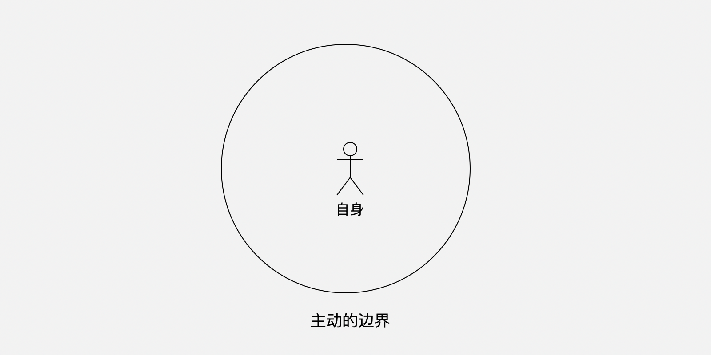
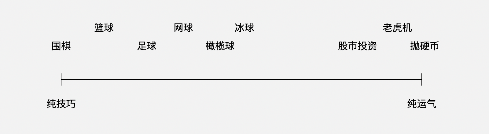
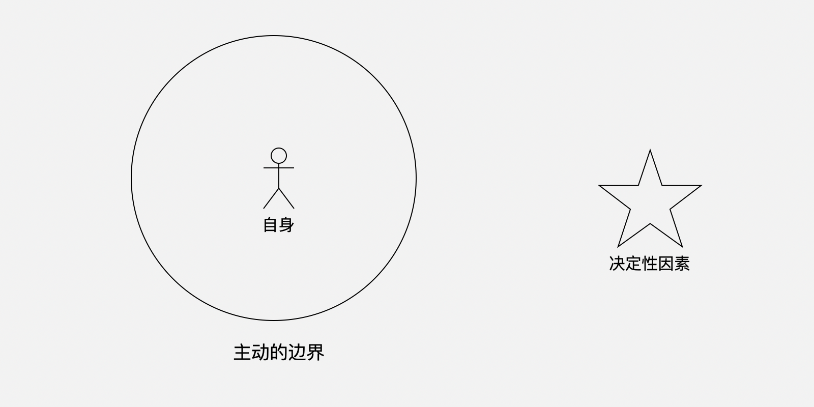
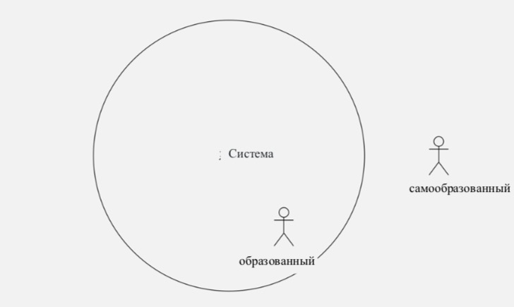
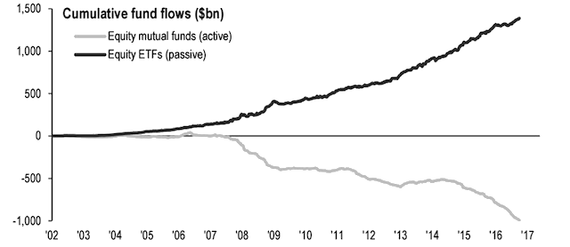
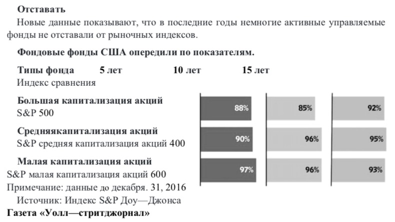
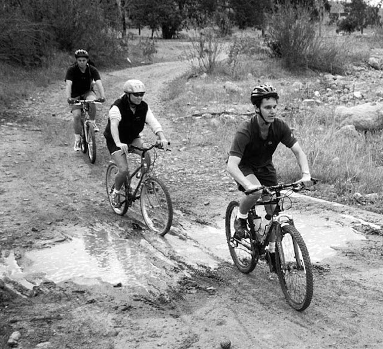
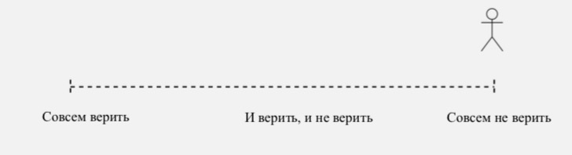

## 9. Глубокий механизм, лежащий в основе магической силы стратегии об инвестировании регулярные акции.

Начнем с того, что выглядит противоположное понятие： 

>Активный и пассивный

В общем, активный и пассивный считаются антонимами.\"Активный\" обычно понимается как позитивный, положительный. В то время как \"пассивный\" часто понимается как негативный и отрицательный.

### 9.1. Подготовьте свою активную личность

Во многих условиях человек пассивен, а не активен. Это действительно не очень хорошо.Кроме того, претенциозные вы должны активно подготовить и создать форму, чтобы побаловать себя активной личностью.

Я часто приводил такой пример. На любой работе вы можете легко узнать, активен ли человек или пассивен. Активные люди работают сами для себя, пассивные люди работают для босса . Хотя все они получают одинаковую зарплату у своего босса.Если активный человек в последний раз покинет офис, он выключит кондиционер, как будто покинет из своего дома; Пассивный человек подсознательно может отделить "что он должен делать" и "что со мной не имеет значения". Поэтому, хотя он уже покинул из своего дома на километр или два, он будет откидываться назад, чтобы выключить свет. Но если последний покинет офис, они просто помнят, что закрывают дверь. Даже если дверь не закрывается , они не чувствуют. Активные люди не обманывают себя, они знают, что они должны платить за свои усилия и время; Пассивные люди каждый день обманывают других, а также обманывают себя. Они хотят запутаться во всех местах,во всех областях ,хотят заплатить минимальную цену, чтобы получить более чем среднюю пользу. Иначе они чувствуют себя несправедливыми!

Более того, все независимые мыслители являются активными. Они изучают проблемы самостоятельно. Конечно же, заметят проблемы самостоятельно. В конце концов проверяют свои результаты мышления. Несмотря на то , что результат правильно или неправильно, они всегда будут применять сами. Если появилась ошибка немедленно , повторите это, отрегулируйте, исправьте, снова оргументируйте приложением. \... Это полная система процессов с замкнутым циклом в процессе применения. Независимые мыслители давно привыкли к этому активному способу, поэтому, в любое время всё оказалось естественно. Нет никакой разницы с другими пассивными людьми по наружной поступке.

Все, кто плохо учится, плохо практикует, плохо мыслит самостоятельно, плохо анализирует, плохо действует, является результатом пассивности у человека.Хотя со временем они окажутся все труднее и труднее запутаться, они уже ничего не могут сделать. Потратив столько денег, столько времени на учебу в течение многих лет, вы даже не самостояетльно занимаетесь какими-либо практическими и эффективными навыками, которые действительно полезны в обществе. Например, поисковое чтение, творческое письмо, выступление с речью, планирование, руководство, зарабатывание денег, не говоря уже об инвестициях!

Что могут сделать пассивные люди с этими свойствами, при таких условиях, что все больше и больше мест не могут быть смущены?Вы догадались: жаловаться.

Отойдете подальше от людей, которые жалуются весь день.Они не знают, что они делают. Они будут возмущены и безжалостно жаловаться на несправедливость, как если бы небесный путь стоял на его стороне.Они никогда не хотят знать правду:мир несправедлив.Чтобы описать это с более точным и беспристрастным словом, мир полон асимметрии, так же, как мир полон неопределенности.

Та же самая ответственность, симметрична ли ответственность босса и ответственности сотрудника? Симметричны ли обязательства родителей и учителей?То же самое торпление симметричны ли, дизайнеры спешат, и продавцы?Одинаковы ли риски заинтересователя и незаинтересователя?Одинаково ли счастье мужчины и счастье женщины? Не рассматривая объективное существование этой асимметрии, а говорите в буквальном смысле справедливости, на самом деле очень нелогично и не очень уверенно и смело.Но они не знают, что они основаны только на невежестве и глупости, они могут испытывать гнев и боль, основанные на поверхностности и истинности.

\*\*В подавляющем большинстве случаев выбор стать активным человеком в основном безошибочно.\*\* Выберите активное выполнение задачи, выберите изменение направления, выберите инициативное обобщение опыта, выберите сам взять на себя ответственность, выберите активный прогресс в учебе. Если вы такие люди , нигде не обидите \... Не верьте в такую городскую легенду, на что способны, ничего не делайте, все зависит от отношений \... Если, к сожалению, вы находитесь в самом деле в таком месте, уходите!Настойчиво не уходи, но жалуйся там, это явно плохой характер!Без приобретения капитала жалуетесь на несправедливость и, безусловно, плохой характер.

Я родился в 1972 году. Весь процесс роста-это процесс, который переживает большие социальные перемены.В наши годы многие молодые люди в конце стали всевозможными "возмущенными молодыми".К счастью, я был безрассудными, но я не \"вышел из себя от гнева\", поэтому не мог быть \"возмущеным молодым\".Кто-то живет по-разному благодаря отношениям с родителями,и многие недовольны. Скажите, будете ли вы пренебрегать своими детьми после того, как вы не догнались до своих сверстников в борьбе?Является ли общество несправедливым?Скажите, какое общество когда-либо было справедливым?Были некоторые несправедливые события. Все было хорошо.Не изучили статистическую вероятность, не могли бы вы просто отложить все общество случайным делом?Действительно, произошло несправедливое событие, тогда идите за справедливостью. Справедливость никогда не была чем-то, что небрежно упало с неба. Получение справедливости так же, как получение достоинства, вы должны бороться за свою силу,не так ли?

В январе 2018 года Генеральное управление гражданской авиации опубликовало в действие правила транспорта пассажиров и багажа гражданской авиации в Китае, согласно которым пожилые люди старше 70 лет летают на самолетах должны иметь сертификат, выданный уездной больницей или выше, о пригодности для полета.Новость пришла, и многие люди жаловались, даже вышли из себя от гнева.Среди них, которые жаловались, был один человек, моя мать.Моя мать родилась в 1945 году. Ей как раз

более 70 лет. \... Вы можете себе представить, какая острота после гневства людей после того, как они были ограничены.Все равно, она взорвалась больше, чем я видел!

Мы позвонились друг с другом, чтобы установить поездку. Я потратил более десяти минут, чтобы рассказать ей простую арифметику: частота несчастных случаев. В этом словосочетании "частота \" , которое не существует отдельно. Количество несчастных случаев равно тому , что конкретное число умножится на частоту несчастных случаев, не так ли? По одинаковой частоте неслучайных случаев в 1/10000, в таких странах, как Ирландия, Сингапур и Австралия, количество несчастных случаев, произошедших в течение нескольких лет, может не иметь большого количества несчастных случаев в одном месяце в Китае.Это правила есть не по вашему адресу, так что нет ничего несправедливого, не так ли?Истинная несправедливость заключается в том, что перед такими правилами я могу установить машину для путешествия и предоставить вам водителя для смены. В любом случае, я могу позволить вам пойти куда угодно. Но разве

это не несправедливо для тех, у кого нет таких условий?！

Все очевидные ответы, объяснения, выходы, решения и т. д., когда мозг переполнен, кажутся "затерянием", или даже если они явно "закрывают глаза".После нескольких раундов моя мать поняла, что, увы, я действительно не должна злиться!У меня есть хороший сын,кто лучше его?Затем мы похвалились друг с другом на мгновение. Я бы сказал, хотя я больше отлично был, ты родишь меня!Так что большая радость и рассеянность.

Те, кто жаловался весь день, должны быть отступлены.Они сказали, что это куриный бульон; Из доброжелательстваобъясняете им толк, а считается, что это шоу; и они вышли сами из дома и сделали что-то сами. Прошли годы.Оглянувшись назад, и жаловались, что в эти годы все было плохо \... На самом деле?За последние четыре десятилетия экономический рост Китая опережал мир. Где плохая окружающая среда?В любом случае, никто не может отрицать, что в целом экономический рост Китая в течение многих лет был абсолютно лучшим в истории.У Чжао Беншаня есть сегмент ,

очень правильный：

> Вы не способны делать , значит, что у вас нет способности.Куда вы идете плохая среда.Вы тот, кто разрушает большую среду.

Всё равно, несправедливо, с которым сталкиваютсядругие люди, скрывает некомпетентность. , действительно очень расстроен.

### 9.2. Большинство активных людей даже не знают границ.

Когда вы начинаете заботиться о своей активной личности, когда вы постоянно формируете свою активную личность, вы чувствуете, что слишком мало активных

людей, слишком мало.

Я объяснил об одном примере раньше, когда мой хороший друг Хо Цзю (теперь CTO и COO в PressOne) был тем, кто научил меня активно общаться.Подумайте, как может эффективное социальное общество иметь, такой как я в долносрочный период был у себя в темноте дома!Годы необщительности заставили меня написать статью, которая была чрезвычайно распространена в интернете и накопила более миллиарда читателей:

《бросьте свое неэффективное общество》.Но Хо Цзю изменил меня.Когда он играл в

своем доме, я увидел, что он на полдень, собирает свои визитные карточки,делая

отметки и бормоча в рот: \"Ну, этот человек, кажется, не был связан за три месяца.Кажется я пойти посмотреть на него......"

Итак, я научился.За последние десять лет я заметил, что подавляющее большинство эффективных отношений требует, чтобы хотя бы одна из них была активной,и обе были пассивными, что может привести к тому, что связь будет постепенно прекращаться.Видите ли, неэффективное общество действительно должно отпуститься, может быть эффективным?Чтобы эффективно общаться, вы должны превратить себя в активного человека в этой области.

Хотя активная энергия велика для любого человека. Но инициатива граничит. За пределами этой границы, инициатива теряет свою роль и даже происходит отрицательную роль \... Почему подавляющее большинство семейного образования в конечном итоге терпит неудачу?Почему процент неудач оказался настолько высоким, насколько это возмутительно?Почему широкое обсуждение в обществе не решает эту

проблему?Существует возможное объяснение для этого холодного ледяного факта.：

> Родители всегда применяют инициативную силу там, где они не должны быть активными.

Другими словами, родители неосознанно пересекают \"активную границу\".

自身 Сама

主动边界 предел инициативы

Первые пределы инициативы-это сама.

В пределах себя все должно быть активным; Однако, вне себя, за пределами активной границы, инициатива, скорее всего, будет иметь отрицательный эффект.Если родители стремятся превращать себя лучше,это применяет инициативы "в рамках инициативы.

К сожалению, большинство родителей чаще всего говорят или мелькают мысли" \" наше поколение уже выглядит так\...\".Они начинают надеяться, что следующее поколение не будет одинаковым с нами самим.Поэтому они применяют все действия, которые они могут предпринять за пределами своих собственных, то есть за пределами своих активных границ-своих детей.

То, чего они не ожидали, что результаты, которые они сделали, были почти обречены отрицательно без каких-либо переменных：

>-   Они сами, как родители, не улучшат свое будущее；
>-   Их дети были невольно превращены родителями в "людей, которые никогда не были

пассивными к себе\"."......

Правильный выбор должен был быть：

>-   Родители должны взять на себя инициативу, чтобы стать лучше и лучше；
>-   Вызвать у ребенка лучшее из-за зависти, а затем ребенок будет проявлять инициативу,

даже если только поверхностная имитация-хорошее начало...... Видите ли, правильный выбор всегда сложнее реализовать.

Другим наиболее распространенным примером является отношение людей к моральным требованиям.В морале-сдерживаемый объект должен быть самим собой, а не кем-то другим.Принятие этических требований к себе является правильным; Однако, принятие этические требования к другим, как правило, либо слишком наивны, либо злонамеренны.Закон используется для того, чтобы требовать от всех, не только от себя, но и от других.Потому, что он требует от себя и от других, то есть от всех людей; Таким образом, взяв в руки законное оружие для защиты своих прав, часто бывает трудно. Вы можете подумать о том, почему именно.

Если вы начинаете с инвестирования в регулярные акции ставки, вы становитесь инвестором с определенными свойствами.Затем вы встретитесь с инвесторами, которые не похожи на вас.Они целыми днями наводят порядок в компаниях, в которые инвестируют, искренно планируют, в конце концов они не разозлятся,и даже могут действительно разозлиться до такой степени, что о чаю не думает, о еде не хочет.Почему они стали такими?Потому что они не знают, что они находятся за пределами своих собственных границ; они не знают, что за пределами этих границ их собственные инициативы бесполезны. Если таковые имеются, все отрицательные эффекты.Они также никогда не поймут, потому что они просто не смогут сделать эффективную бизнес-модель самостоятельно, чтобы в конечном итоге получить

массовые инвестиции.Если бы они действительно это сделали, они бы знали, насколько ужасно, что многие люди хотят влиять на себя. Как гораздо страшнее, если бы они были настолько склонны к окружающим.

Второй границей инициативы является область контроля.На самом деле, мы можем контролировать такие вещи, как температура кондиционера, скорость автомобиля и т. д. \... И даже последующая дискуссия позволит вам увидеть, что мы можем контролировать больше вашего воображения \... Однако гораздо важнее идентифицировать вещи, которые мы не можем контролировать, такие вещи, как чистая удача, что никто не может контролировать.......

В некоторых случаях навыки играют стопроцентную роль; В других крайностях только удача играет стопроцентную роль, а между двумя крайностями состав навыки и удачи различаются......

纯技巧 чистая навыка

围 棋 шахматы 篮球 баскетбол 足 球 футбол 网球 теннис

橄榄球 регби

冰球 хоккей

股市投资 инвестирование в акции

老虎机 игровые автоматы 抛 硬 币 иросить монету. 纯运气 чистая удача

Данный рисунок исходится из Книги Michael J. Mauboussin , опубликованная в 2012 году: The Success Equation: Untangling Skill and Luck in Business, Sports, and Investing。

Легко наблюдать：

>-   Подавляющее большинство людей просто не достаточно работают в рамках своей собственной инициативы .；
>-   Больше людей занимаются за пределами своих активных границ, не самознательно занимаются......

Таким образом, подавляющее большинство жизненных трудных положений можно отнести к：

>-   Недостаточно активно, когда это необходимо；
>- Возиться с инициативой, когда она не должна быть активной •

Подумайте об этом, не так ли?

Этот мир не заботится ни о каком особом человеке и так называется если \"небеса и земля безнравственны, все существенные похожи на собаку\".Таким образом, с точки зрения вероятности, подавляющее большинство людей вряд ли будут слишком довольны тем, где они находятся, поэтому у подавляющего большинства людей изначально было много желания изменить свое окружениедо тех пор, пока, наконец, не будет принято решение и не будет отказано.

Где тот, кто в конце бросился, делает что-то неправильно?Они просто не понимают суть влияния: влияние не в том, что вы говорите по своей инициативе,что вы делаете по своей инициативе \...Суть влияния заключается в том, что вы делаете, может вызвать инициативу других?\*\* Дэн Сяопин знал об этом-именно благодаря этому он изменил весь Китай.Пожалуйста, внимательно изучите это предложение, что люди, которые инвестировали в регулярные акции, больше всего ценят их способность дополнительно зарабатывать деньги, потому что это основа всего роста.Продажи-это сильная способность зарабатывать деньги дополниельно.Люди, которые хорошо разбираются в продажах, понимают природу влияния. Тот , кто способен по продаже, понимает суть влияния. Тот не проявляет инициативу за пределами активной границы, устают от продажи.Ваш опыт позже даст вам более глубокое понимание об этом.

### 9.3 Факторы, решающие судьбу, часто находятся за рамками инициативы

Это, безусловно, примечательное явление.：

> Все, что оказывает на вас значительное влияние, не контролируется вами.......

Другими словами, это более распространенное явление. Решающие факторы в основном находятся за пределами ваших активных границ.

自身 Сам

主动的边界 Предел активности

决定性因素 Решающий фактор

Примеров много.

Например, в Великобритании игрок в снукер Ронни Антонио Осалливан родился в 1975 году.Этот человек очень краси. Благодаря его потрясающим навыкам он выглядит все более красивым и очаровательным.После того, как он выиграл15-летний чемпионат мира среди юниоров, к 2018 году Осаливан выиграл 65 титулов.Он быстро вышел из поляка.У него левая и правая руки были одинаковы хороши.Его внимание могло быть полностью защищено от внешнего влияния.Даже хотелось 147 очков, чтобы играть точно 146 очков \... Называем его гением легендарным, все равно он волшебный.

Однако хотелось говорить, что это не о Осалливане самом.

Здесь мы уделяем больше внимания игрокам, которые, к сожалению, столкнулись с Осалливаном в эти годы.Кто из них не старательно работает?Какой из них не трудолюбивый?Какой из них недостаточно активен в своих границах?Какой из них не совсем превосходный?Однако каждый из них был Чжоу Юй,стиснув зубы, чтобы выжать слова, которые были одинаковыми:как раз родился Чжоу Юй, почему ещё родился Чжу Гэлян?

Для тех игроков, которые столкнулись с Осалливаном, либо решили просто отказаться от снокера, либо отказаться от своей"мечты\",ставшей чемпионом снокера стала беспомощной из-за одного человека Осалливана.Решающий фактор, который, по- видимому, выходит за рамки инициативы всех игроков современников.

С точки зрения Осалливана, он, по-видимому, был редким случаем успеха.Когда он был активен до крайности в своих границах, а затем получил огромный успех; Но в количественном выражении это было бы примером, даже единичным, без представления.

Пример Осалливана заканчивается здесь я просто хочу показать общее явление с этим, хотя и несколько ограниченным примером.：

> Ключевые факторы, определяющие судьбу, часто находятся за пределами инициативы.......

Однако принятие этих явлений является чрезвычайно важной когнитивной отправной точкой сознания.Это уже сложно,что за пределами границ активно и старательно закаляет свои разные навыки и спасобности. Но это самое важное не включается в этом сложным, а в осознании о более важным , более ключевом факторе.Начало активно думать: \"что же мне делать, если это так?\" Затем оттачивается еще один набор навыков.

Все они в какой-то момент произносят одинаковое восхищение.： 

> Почему вы всегда чувствуете себя поздниий шаг , что бы вы ни делали?

Не смейтесь, когда-нибудь, это же моя собственная загадка.В нашем родном городе на северо-востоке говорится: \"как вы всегда чувствуете, что хотя вы едите дерьмо, не

успеете горячим?\" ！ \"Скорее всего, это универсальная головоломка, с которой

сталкиваются 99,99% людей \... Как вы думаете?Я предполагаю, что у вас будет хотя бы родственник, одноклассник или кто-то был оценен так：

> Он, мы не можем оценить.Как вы выглядите, что он делал, он не может выполнять.Чемон занимался ,то не спешил?Это может быть плохая судьба?

Говоря или думая об этом, очевидно, что понимание "решающего фактора за пределами активной границы понимало о судьбе.

В начале 1990-х годов многие из относительно более способных людей решили покинуть Китай и отправиться в мир . Когда мы стремясь к своей мечте.Время мало- помалу летит.Оглядывая эти тридцать лет,это, по сути, тридцать лет, когда экономика Китая процветала до своего пика.Большинство из тех, кто покинул свои дома в то время, измеряли себя с экономической силой, Поэтому они в конце жаловались на то: они чувствовали, что их жизнь была опустошена за десять или двадцать лет......

Это судьба?По сути, это просто \"роль тенденции\", а не "судьба" какого-либо человека.Потому что в тот момент, когда они решили уйти, на самом деле они также могут остаться.Таким образом, нейтральное объяснение не что иное, как: их выбор не соответствует тенденции.Это ничем не отличается от того, что вы думали, что другая дорога будет быстрее, когда вы застряли на высокой скорости, но оказалось, что эта дорога была самой быстрой.

Ключевые факторы, определяющие судьбу, часто находятся за пределами активной границы \... каковы наиболее важные факторы за пределами активной границы?Только одно слово: тенденция.

Так называемые"знающие люди \", это правильное описание.Потому что люди, которые не понимают тенденции или даже не чувствуют их, могут быть только посредственными.Так называемый"герой времени \" также является правильным описанием, потому что тенденция находится за пределами активной границы, но играет решающую роль.Без тенденции нет героя.

### 9.4 Оптимальная стратегия ориентирования на тенденцию может быть только активной и пассивной

Инициатива, конечно, важна. Она расположена в рамках инициативы.Однако еще один факт, который игнорируется подавляющим большинством：

> Пассивность оказалась важнее!

Важность инициативы часто узнается; важность пассивности трудно понимается, потому что нужно заранее сообщить о концепции" активной границы\", о которой многие люди никогда не задумывались.

Когда мы начинаем изучать тенденцию, мы испытываем огромную пассивную энергию. Не понял, как реагировать на пассивную энергию.Это слабость для подавляющего большинства людей.Многие люди непроизвольно используют неправильные формулировки, такие как \"запрягать тенденцию\".Как тенденция может быть запрягнута!Тенденция , эта вещь объективно существует вне пределов чьей-либо инициативы" использование такого активного поведения не влияет на тенденцию.Это просто принятие желаемого за действительное.Таким образом, более подходящая формулировка должна быть"соответствовать тенденции. Вы видите,"соответствие" - это быть пассивным, потому что за пределами активной границы пассивность имеет очень сильную и очень удивительную силу.

Это не сработает, если вам нужно использовать термин "вождение", потому что есть

действительно небольшая часть людей, которые в конечном итоге находят оптимальную стратегию" ориентироваться в тренде \" с большим количеством активного мышления：

> Активная пассивность

Что называется активная пассивность?

>-   Активно выбирает наиболее правильныетенденции；
>-   Пассивно ожидает, когда тенденция вступает в игру......

Подавляющее большинство людей воспринимается как нечто избранное . На самом деле не имеет ценности.Выходя утром, выбираете обувь ,цвет к галстуку, поезд или самолет

и т. д. \... На самом деле эти вещи не могут вызвать никакого влияния за пределами активной границы, в лучшем случае это просто чувство собственного чувства.Но,люди настолько одержимы своим чувством \... Раз так одержим своим чувством, а затем чувствуете сами.Результат, вызванный тем фактом, что многие годы спустя были отброшены тенденциями, трудно терпит.Потому что люди, одержимые своим чувством , лучше всего находят оправдания.Например, плохая окружающая среда или что-то еще.

\*\* Подавляющее большинство банальности сводится к тому, чтобы тратить время и силы на выбор, не связанный с тенденцией .\*\* Будьте одинаковы для всех: три или пять самых важных решений в вашей жизни существуются.Помимо учебы,брака и карьеры, вы предлагаете еще два решения, которые более важны, чем они?Конечно, теперь вы, безусловно, на один больше, чем кто-либо другой: инвестирование в регурярные акции.Это ключевой прогресс, сложность и значение которого эквивалентны "генетическим мутациям \" в биологической эволюции.

Является ли решение значительным, имеет ли смысл, просто посмотрите на метрику балансирования：

> Это выбор против тенденции?

Активный выбор наиболее правильной тенденции, легче сказать, чем сделать.

Причина, по которой это явно сложно, заключается в том, что люди, всегда не могут отказаться от пустяков.Даже если они думают, что нет жизни, без этого.Они все еще решили отказаться от тенденции.Тогда примите, рано или поздно, беспомощную судьбу.

Прежде чем управлять тенденцией, должно ловить её. Прежде чем ловить момент, должно исследовать её. Прежде чем исследовать её, должно испытывать её.Люди, которые тратят все свое время и силы на пустяки весь день, могут иногда получать информацию о том, какая происходит тенденция. Поскольку у них больше хлопот для обработки, даже после того, как их информируют, у них нет времени, чтобы глубже испытывать, не говоря об исследовании, овладении. \... Что касается управлении, это, безусловно, вне их судьбы.

Вот почему у них была эта загадка и всегда была такая же неловкость： 

> Почему я опоздал опять?

Однако в следующий раз они обречены на все те же обстоятельства.

Во многих случаях, особенно на торговых рынках,"опаздание" никогда не является проблемой.Если вы вспомните, что такое "кривая улыбка" и "кривая убогость", то вы поймете, кто торгует, могут провести одну кривую улыбку за другой своим долгосрочным и устойчивым поведением. Их поведение и стратегия определяют тот факт, что"каждый раз, когда вы входите, это правильно\".Каждый раз, когда они проводят

кривую улыбку, это равносильно тому, чтобы "сдвинуть" свое время приема вперёд , потому что средняя стоимость уменьшается!Те, кто противоположны, ошибочно думая, что только более ранний вход может иметь более низкую стоимость; они также "переводят назад" свое время входа, потому что одна и та же кривая превращается в жалкую кривую.......

После опубликования Facebook, его акции выросли во много раз.Разве человек должен быть Питером Тиллом, у него будет шанс, инвестировать в Facebook, чтобы заработать много денег?Нет!Facebook не может быть ангелом-инвестором Марка Цукерберга, даже если вы живете в Силиконовой долине;Но, если бы вы купили акции Facebook в то время, даже если Facebook вышел из вырезанной, сломанной цитаты, тогда это была бы явно кривая улыбки!Несмотря на то, сколько людей в концебыли топчаты этой жалкой кривой, на землю с трением, шагом дьявола.Стоит действительно понять истину об инвестировании в регулярные акции, независимо от того, где вы простой человек, оказывается, что стратегия и действие принесут сотни раз больше прибыли!

Я видел бесчисленное количество ранних купцов за восьмь лет в мире blockchain.Все они держатся до сегодняшнего дня?Очевидно, нет.Хотя вы входите рано, если у вас нет правильной стратегии , верьте, надёжная стратегия осталась только одной,то есть инвестирование в регулярные акции.Через восемь лет, оглядываясь назад, вы были выброшены рано.Это правильное и реалистичное описание без лишних слов, без преувеличении .Стратегия об инвестировании в регулярные акции выглядит слишком простой, и людям это не нравится.Люди любят причудливые вещи, которые кажутся модными, сложными и высокостепеными.На самом деле не имеет значения, что они надевают на себя (т. е. в пределах активной границы); Но не простое, применяется за пределами активной границы, в основном, должно понести катастрофу.Со второй половины 2018 до первой половины 2019 года на рынке рухнуло большое количество так называемых "количественных фондов". Во второй половине 2018 года, в первой половине 2019 года, два известных человека покончили жизнь самоубийством , чем больше претенциозных людей, тем больше они не могут терпеть неудачу, вызванную их своей инициативой.

Итак, первый шаг, который вы хотите сделать для активной пассивности, это отказ от пустяков.Мера проста:все, что не имеет ничего общего с тенденцией, - это пустяки.После отказа от всего этого, все остальное будет естественным.Потому что только тогда можно четко подумать, а затем отделить, где быть активным,где быть пассивным, чтобы действительно понять, что называется активной пассивностью.

### 9.5 Почему принятие решений об инвестировании в регулярные акции является оптимальной стратегией"активной пассивности\"?

Я автор-восхищатель. Я делюсь своими мыслями, моими решениями, моей удачей,а не моими неудачами.Почему?Неудача-это то, что нужно делать, нужно выполнять. Опыт неудачи не называется опытом,это больше,считается уроком.В основном, все еще бесполезно!Когда вы видели, как родители плохоучащихся воспитывали своих детей хорошоучащимися?

Я говорю только о том, что я делал и сделал.Это очень, очень тяжело.Какую связь с вами самими, имеет то, что другие делают?После того, как вы это сделаете, обобщенное действительно имеет ценность. В процессе этого существуется неудача, но благодаря настройке окончательного успеха настройки, объясните, что урок в то время действительно был ценным уроком, который стоит поделиться.

Мне не нравится моральное превосходство.На самом деле ненавидит всех, у кого есть необоснованное моральное превосходство.Они-моя противоположность, абсолютная противоположность.Независимо от дела, что они могут разговаривать и похвалить. То , что сами не сделали , сами не выполнили , аюсолютно не важно. Даже они действительно понимают это или нет, это не важно. Их единственное просьба была выше других.

Следующее утверждение абсолютно не преувеличено.：

Вся этика настоящие мошенники, независимо от того, намеренно они или нет.

Вы знаете, почему мошенники всегда выглядят умнее?Как будто всегда они учатся новой тенденции быстрее!Даже многие люди должны были вздохнуть: \"увы, эти лжецы действительно учатся!\"\"Не оскорбляйте способность к обучению!Мошенники, "быстро учащиеся\", потому что им не нужно учиться или изучать.Они просто различают некоторые понятия, которые они не понимают, потому, что они уверены, что они не понимают, другие не понимают тоже, поэтому они просто берут кого-то прямо, чтобы подсчитать!Захват нефрита, как кирпич, чтобы обманывать людей, что можно завидовать?С этой точки зрения взгляд на прошлое очевидно , что этическая сука и, в любом случае, настоящие мошеники точно такие же: их просьба это не что иное, как сбить кого-то другого. Что касается средств, то это также недобросовестность.

Это объясняет, почему так много людей болтаются "децентрализованными \" во рту весь день. При внимательном прослушивании они заметили, что они вообще не понимают.Децентрализация-это просто средство в технологической модели blockchain,а не цель.Цель технологии blockchain - \"открыто прозрачно и неизменяемо\".Для достижения этой цели используются децентрализованные средства.Децентрализация не является возможной.Не может быть использована для решения всех проблем .У меня есть бутылка пива в жаркий день, не слишком холодная. Вы децентрализованно похолодаете ?Децентрализация используется в технологии blockchain для решения конкретных проблем, а не для подрыва банков и подрыва правительства. Слушая весь день бред , демонизируя как проповедь, очень раздражают и утомляют.

Есть люди, которые кричат "консенсус \" весь день.\"Идиотский консенсус-это тоже консенсус\", который на самом деле является иронией.Те , кто слышал звон, да не знал, где он, болтает об этомболее года.Они даже не узнали иначее значение. Где столько консенсуса между людьми!Консенсус в технологии blockchain относится к алгоритмическому консенсусу между машинами и машинами. Машины стандартизированы,алгоритмы унифицированы, поэтому существует консенсус.Как это может быть между людьми!Самый большой консенсус между людьми, которых я могу найти,это то, что все хотят зарабатывать деньги, но все знают, что это сложно.

Разве это не сложно, принепонимании сделал вид понимания?Трудно не говорить глупости, не понимая этого?Желание казаться выше других , это слишком сильное желание?Публично, чтобы заботиться обо всем настроении, я говорю более образовано в частном порядке совершенно не нужно ничего украшать,что есть,то и

говорю：

Не говорите об этом, если вы этого не сделаете. Как просто?！

При разработке [BOX](https://b.watch/) мне кажется, что это, по сути, стратегия с открытым исходным кодом.Код программиста может быть с открытым исходным кодом без комиссии;моя книга и статья могут быть с открытым исходным кодом без комиссии. Так может ли моя инвестиционная стратегия с открытым исходным кодом без комиссии?Это не первый раз, когда я открываю свои инвестиционные принципы.3 июня 2017 года я опубликовал \"[принципы инвестирования в блокчейн с открытым исходным кодом о INBlockchain](https://github.com/xiaolai/INB-Principles/blob/master/README.md)\".Затем также приняли его в Книгу \"самосовершенствование лука-порея\".

Конструкция [ВОX](https://b.watch/)очень проста.：

>-   Перемещение инвестиционных предметов от одного проекта к целой отраслевой тенденции путем выбора качественного набора объектов, соответствующих тенденциям развития блокчейн-технологий；
>-   Раз Ли Сяолай с открытым исходным кодом, то ли должен установить плату за управление на ноль；
>-   Теперь, когда Ли Сяолай так думает, он должен это сделать .Поэтому способ заработки денег у Ли Сяолая это тоже инвестирование в регулярные акции.
>-   Раз инвестирования в регулярные акции является социальным, общественным поведением, сделайте сообщество инвестирования в регулярные акции, в котором могут участвовать только фактические имена практиков .

[BOX](https://b.watch/)-это биткойн-фонд ETF Blockchain.Что такое биткойн?То есть, способ измерения прибыли основан не на юанях или долларах США, а на количестве BTC/EOS/XIN, которое вы вкладываете каждый раз, когда вы делаете ставку.Сколько BTC/EOS/XIN вы вложили в общей сложности, тогда в будущем вы сможете использовать [BOX](https://b.watch/)token (blockchained ваучер) в ваших руках, чтобы снять, сколько BTC/EOS/XIN вы когда-либо вкладывали.

И в этом процессе все операции [BOX](https://b.watch/), все контакты, все открыто и прозрачно.Строго соблюдать "стопроцентной системы маржи".

Таким образом, с этой точки зрения, [BOX](https://b.watch/)-это "резервный" фонд для биткойнов.

Итак, есть ли вероятность того, что [BOX](https://b.watch/) производит прибыль на основе биткойнов? У самого [BOX](https://b.watch/) нет.Тем не менее, существует на вторичном рынке Exchange[BOX](https://b.watch/) .На [B.watch](https://b.watch/) будет регулярно держит акции 50% от комиссионного дохода на вторичном рынке для владельцев [BOX](https://b.watch/) (одна тысячная в обоих направлениях) - это, конечно, не так много в начале.Но со временем резервы [BOX](https://b.watch/) растут.Этот доход, вероятно, будет иметь определенный размер.

А оставшиеся 50% комиссионного дохода составляют основная бизнес-модель[B. watch](https://b.watch/)- это базовый состав.Ну, [B.watch](https://b.watch/)корпоративная ценность также будет постепенно увеличиваться.В будущие семь лет (потому что всегда Ли Сяолай говорит:"семь лет- это жизнь"), Акции [B.watch](https://b.watch/) рассчитываются на основе определенного алгоритма, вклад сообщества распределяется в виде баллов среди практиков в данном инвестиционном сообществе.Затем, в нужное время, открывается торговля на вторичном рынке.

Что называется тщательным?План [B.watch](https://b.watch/) заключается в том, что в конце все акции выдаются и не сохраняются отдельно.Как это поддерживается?Как насчет стоимости персонала,стоимости оборудования?Ли Сяолай заплатит на это.Почему?Потому что Ли Сяолай тоже инвестирует в регулярные акции.Он конечно, инвестировал много.Если вы не можете заработать деньги,то ладно.Если зарабатываете деньги, это действительно ничего не стоит,Ли Сяолай сам взял на себя ........

[Box](https://b.watch/)-это, по сути, все, что есть в книге, все, что обсуждается, все лучшие практики, которые могут принести реальную ценность.То, что Вы читаете, - это книга, в которой объясняется, что можно сразу начать практиковать!

Вы начинаете молоть свою активную личность; вы начинаете исследовать активные пределы; вы начинаете понимать пассивную силу;вы начинаете выбирать тенденции;вы начинаете ощущать пассивную мудрость;вы начинаете превращать себя в целеустремленного, терпеливого, действующего и дисциплинированного человека в определенной области . В общем, вы начинаете стремиться к себе.

Неважно, что чужие не понимают. Люди в сообществе понимают вас.Они даже ничего не нужно говорить,они просто молча инвестировать с вами .Все, что находится за пределами определенного инвестирования, не имеет ничего общего с сообществом, с вами.

3 июля 2019 года, на лекциях фестиваля третьего июня лука-порея, я сказал об этом. На самом деле это является некоторыми основными правилами для определенного

сообщества：

>1. Терпимость к разнообразию
>Здесь сейчас уже более тысячи человек.Поэтому, с самого начала, ясно, что все здесь должны быть терпимы к разнообразию.
>Сейчас в этой группе более пяти тысяч человек, около тридцати или сорока человек чихают, когда видят сильный свет (7%), около тридцати или сорока человек- гомосексуалисты (6%), около двух или трех тысяч человек имеют разную степень о религиозности (33%), около трех или четырех тысяч человек имеют разную степень о суеверии (66%), около четырех тысяч человек имеют различные предвзятые представления о презрении (85%), почти все считают, что они в какой-то степени выше
>среднего （ 99% ） \...\... Люди находятся в разных местах, со своими собственными
>акцентами, разные степени образования,различные семейные условия,разные
>привычки к жизни и работе, разные ценности, разные хорошие и плохие суждения \... это разнообразие.
>Тем не менее, в этом классе будет больше людей в будущем, поэтому разнообразие должно быть терпимо.Таким образом, не ссоритесь в любом групповом чате в будущем и не нападайте на кого-либо.Когда происходит ссора, не спрашивайте о причинах, несмотря на правильность и последовательность, обе стороны будут перемещены прямо из класса.
>2. Не оценивайте тему, которая не имеет ничего общего с классом.
>Теоретически это должно быть \" не оценивать то, что не имеет ничего общего с собой".Если вы хотите спросить \" \... что вы думаете?\"\"Выходите прямо к стене и поверните направо, чтобы знать.На классе Ли Сяолая объясняется больше в будущем, - это знания о блокчейне,знания об инвестициях- \* \* Зарабатывайте чистые деньги с помощью законных средств, что является самым надежным.\*\* Социальные, политические,культурные и т. д., Каждая тема из них имеет более подходящее место для обсуждения, чем на классе Ли Сяолая .Здесь люди заботятся только об одном,как они продолжательно растут?Как сохранят хорошее настроение?В том, что не касается этогонет необходимости для упоминания.
>3. Научитесь получать уважение от незнакомцев путём действия
>Здесь много людей, и, с точки зрения вероятности, больше людей, безусловно, незнакомы вам.Не думайте, что незнакомец автоматически даст вам какое-либо уважение.Это не значит, что вас уважают, это просто из уважения к себе.
>Уважение к этому, как и к деньгам, \"заработано\","накоплено\".Уважение с обманой рано или поздно обнуляется.У некоторых людей даже псевдоним тошнит всех. Не думайте, что это не важно, сможете ли вы заработать деньги или нет, в основном, полностью зависит от того, сможете ли вы нормально получите уважение от чужого уважения.
В будущем все в этом классе будут аутентифицированы (KYC) . Я предлагаю вам начать с настоящего имени, а не просто написать псевдоним.Поверьте, личный бренд важен.
>4. Не противоположно всему миру.
Не думайте, что только потому, что вы находитесь в Китае, вы должны держать свой рот.Конечно, это действительно потому, что вы находитесь в Китае, поэтому вы должны быть более способными держать свой рот.
Не бредите, не говорите, за что вы не можете брать ответственность.Больше не берите чужую безопасность, чтобы показать свою храбрость.
Вы можете расти, несмотря на каую среду.Но если вы не можете расти, вы не должны обвинять себя в плохой среде - потому что, с другой точки зрения, это просто покажется глупо, слабо,не способно.
>5. Не похвалите Ли Сяолая.
Ли Сяолай сам знал,как важен.При ошибочной критикой,если он не сделал ничего плохого, он не сердится.Если он заметил, что он сделал что-то неправильно, но он злился на себя, как он не сделал это правильно; Вы ошибочно хвалились , он не был бы радостным, потому что он знал, где-то неправильно похвалился. Тем более, Ли Сяолай является простым человеком со всей недостаткой. Но просто, в некотором деле он поступит правильно.
Но хотя это очень неудобно, как для сторон, так и для зрителей.Так что не говорите хвастную речь.Если вы не можете не поблагодарить Ли Сяолая, заработайте деньги, используя то, что он сказал. Это лучше, чем что-либо еще.Только практика-это билеты на успех,и только результаты могут быть использованы для обмена опытом.

В соответствии с определением инвестиций, действие долгосрочного холдинга приводит к самому строгому принципу для выбора инвестиционных предметов- это активный выбор.Затем регулярное инвестирование, долгосрочное удержание , испытание одной за другой кривой улыбки,это сила, которая дает вам деньги и всю тенденцию к созданию богатства для вас.В жизни любого простого человека трудно найти еще один длинный простой акт, который может создать такое удивительное богатство.На самом деле, даже богатые люди могут в конце получить новое богатство в своих инвестициях.

Активная пассивность-это лучшая практическая стратегия для создания богатства в эту финансовую эпоху.

### 9.6. Насколько огромна пассивная сила для, соответствующей тенденции?

Давайте приводить пример с противоположной стороны. **Образование**, о котором мы говорим обычно, является отличным примером. Это можно демонстрировать пассивные негативные силы.

Не смотрите на поколения людей, жалующихся на поражение образования -- не только своё поражение, но и все общественное. Это не только в Китае, но и по всему миру они размышляют о их так называемое «Образование» раз за разом--- но если вы изменяете точку зрения, вы найдёте удивительное и противоположное объяснение:

> На самом деле, в любую эпоху, в любой стране, образование всегда былоисключительным успешным!

Почему является такой вывод? Потому что мы определяем образование с другой точки зрения:

> **Так называемое «Образование», по существу, это то, что система, в которой находится каждый человек, хочет,** чтобы он превращался в какой-то вид...

Каждый человек находится в системе с рядом взаимосвязанных систем: наш круг, наша культура, наше общество, наша страна, наш мир \... Всё это «зрелые системы». Не ошибочно думаете, что они только объективно существуют . На самом деле, не только это. Эти системы существуют живыми, даже с душами. Они имеют чудесную силу и средства.

Посмотрите, в любой системе существуют заинтересованные лица и незаинтересованные: первых очень мало, а последних --- подавляющее большинство. В результате этого цель образования ясна, и заинтересованные лица будут использовать её, чтобы сделать её более полезной для себя --- вам не нужно говорить, вы знаете, что они будут делать! Незаинтересованные вскоре обнаружат неравномерность в процессе конфронтации, поэтому подавляющее большинство обратится к служению заинтересованным лицам, а в прцессе напряженом противостоянии те немногие противники из незаинтересованных в конце концов

уничтожатся; Если сопротивление незаинтересованных будет успешным, тогда они мгновенно станут заинтересованными лицами и откроют следующую «новую»

систему, которая также служит к заинтересованным лицам\... Это факт безразличный, поэтому жалобе совершенно не нужно. Это одинаково везде на планете. Разве это не так?

Поэтому так называемое «Образование» определяется только следующим образом:

> **Образование --- это та система, в которой ты** находится,хочет , чтобы ты стал какой-то вид. ...

Если образование так определено, и если нынешнее состояние действительно обстоит

так, то вывод очевиден: всё образование в истории было довольно успешным, и его даже можно назвать исключительным успехом, и оно всегда было все более и более успешным. С этой точки зрения, неспособность образования, на которое жалуются люди, по сути, является дискомфортом заинтересованных лиц в системе.

У простых людей есть выход? Всё так же есть.

Если образование так определяется, а **самообучение**?

> Если образование --- это то, кем эта система хочет, чтобы вы стали, тогда, напротив, самообучение --- это то, кем вы хотите быть.

Следовательно, более точная формулировка может состоять из двух относительных терминов:

>-   быть образованным
>-   самообразование

Подавляющее большинство людей чувствуют себя крайне неудобность в процессе

образования (т.е. в процессе ассимиляции системой)--- это естественно. Тем не менее, следующий выбор --- тот, который лучше всего отражает настойчивость попытков ： большинство людей перестают получать образование, и лишь ничтожное меньшинство

людей выбирают самообразование. Люди, которые выбирают самообразование, так делать не только время от времени, но и на всю жизнь. Примечательно, что после тщательного наблюдения истории вы обнаружите, что **люди, которые меняют мир, все самоучки**.

С другой стороны, являются ли они образованными или оставленными образованными людьми, они ассимилируются системой в конце концов --- пассивная сила оказала на них очень сильное влияние, настолько сильное, что каждый ничего не может сделать, и в конечном итоге думал, что это была сила бесов и божеств.

Есть телепьеса под названием «Год за годом», выпущенная в 1999 году. Я предлагаю вам посмотреть в свободное время. История начинается в 1978 году, и каждый эпизод рассказывает историю на тогдашний год, всего 21 сериал. В истории существует киномеханик, поэтому в каждом сериале можно упомянуть о тогдашнем фильме.Кроме того, в каждом сериале

есть песня в те годы. Более того, каждый сериал напоминает вам об одном из самых важных событий в те годы \... История не особенно хороша, но вы действительно чувствуете, насколько маленьким является каждый индивидуум в системе и насколько мощными факторами , чтобы только пассивно противостояли.

Сил негативных настолько велика, с которыми мы можем только пассивно столкнуться, в то же время насколько одинакова мощна их позитивная сила. Давайте посмотрим на пример пассивных позитивных сил, связанных с нами, которые играют огромную позитивную роль.

В области управления фондами фонды делятся на два типа: **активные** и **пассивные**.

Поток совокупных средств (\$ биллион)

В картине показан приток капитала активных и пассивных фондов по всему миру за последние несколько лет. Почему капитал больше выступает за пассивные фонды? Почему активные средства больше отвергаются? Потому что капитал все больше осознает силу пассивности.

Активным фондам нужно менеджера, который анализирует рынок, а затем выбирает инвестиционное сочетание, которое может превзойти рынок. Исходя из ожиданий этих менеджеров, инвесторы должны платить очень высокую цену за управление и долю, а также нести операционные издержки частой торговли этих менеджеров. Напротив, пассивные фонды не рекламируют свои аналитические способности, не проводят частые операции активно, просто пассивно следуют за репрезентативным индексом (таким как S & P 500) \...

За многие годы консультирование об управляющих фондами никогда не было

редкостью. Неко Паевые инвестиционные фонды (активные) ции в дом, помещаете обезьяну и через ETFs капиталы (пассивные)

состание инвестиции , в которых обезьяна мочилась, и конечный результат также может перегнать эти менеджеров фондов\...

Это правда? Или это действительно просто шутка? Что вам нужно понять, так это то, что история современного фондового рынка не была долгой. По---настоящему современный фондовой рынок появился только в 70---ые годы 20 века. До сих пор у нас только данные около 40 или 50 лет, которые могут изучаться эффективно.

По данным*Газеты «[Уолл---стритджорнал](https://www.wsj.com/articles/indexes-beat-stock-pickers-even-over-15-years-1492039859)»*(13 апреля 2017 г.), до 31 декабря 2016 г. 95,4% средств среднего фонда отставали от S & P MidCap 400, а 93,2% малых фондов отставали отS & P SmallCap 600, 92,2% крупных фондов отстали от S & P 500 за 15 лет.

У поклонников активного фонда есть, казалось бы, разумное возражение. Они считают, что по мере того, как все больше и больше денег поступает в пассивные фонды,

это в конечном итоге превратит стратегию в «следующий поток», который сделает активное управление фондами относительно более выгодным. Однако долгосрочные инвесторы на самом деле понимают, что краткосрочные изменения на рынке или новая тенденция дадут активным управляющим фондами краткосрочное преимущество, но исходя из 15---летней статистики, долгосрочные инвесторы могут их игнорировать...

Наиболее интересная часть в этой статистике -- такой вывод:

>-   Чем **длиннее инвестиционный цикл**, тем больше пассивное преимущество;
>-   Чем **больше сумма инвестиций**, тем больше пассивное преимущество \... Мой личный прошлый опыт подтвердил этот вывод мне.

В 2013 году я начал управлять ранним фондом, который был особенно маленьким и инвестировал в проекты, связанные с биткойнами. К 2018 году, то есть в четырёхлетний управленческий период и одногодичный период ликвидации, через 5 лет после этого рыночная стоимость фонда выросла примерно в 68 раз по сравнению с первоначальной суммой \... Хотя это выглядит очень удивительно, на самом деле это совершенно плачевно --- потому что этот счёт превзошёл Биткойн немного. Другими словами, если бы все средства были использованы для покупки биткойнов в то время, а я даже не делал за следующие 5 лет, то это было бы увеличилось в 58 раз. Вы можете видеть, что конечный результат будет не хуже, чем текущий. Конечно у меня выгода, и после 30% открытой прибыли доход инвестора стал примерно в 48 раз, чуть ниже, чем рост самого Биткойна.

Что ещё более обескураживает, это другой фактор. За последние 5 лет для этого фонда, хотя о нём трудно говорить вложить всю душу, но обязательно волновать --- несколько раз почти гибель всей армии, трудно вернуться благодаря удаче, один шанс из десяти смертей, что остаться в живых \... В процессе этот фонд действительно к чёрту, на самом деле, нормально. Тем более, что мир блокчейнов --- это место, где амплитуда колебаний во много раз больше, чем на фондовом рынке.

Не кончиться крахом, это случайность. Успех, на самом деле, сюрприз в случайности. Поэтому, когда битовый фонд был окончательно ликвидирован, я почувствовал, что на следующем этапе я могу пробовать пассивный фонд. Другого выбора не было вообще. После более чем года размышлений, я, наконец, разработал [BOX](https://b.watch/), продукт фонда ETF с открытым исходным блокчейном. Нынешний буклет фактически отражает вывод и мышление в процессе создания моей идеальной модели пассивного фонда.

Вернемся к нашей речи.Обращайте внимание на фокусе этого раздела в первую очередь.

Подумайте, тот же вывод, сопоставленный с индивидуумом, может быть применён прямо или нет:

>- Чем выше стремление, тем больше пассивных сил необходимо;
>- Чем больше у вас энергии, тем больше пассивной энергии вам нужно ...

Пассивная сила не только велика, но **её всегда сложнее превзойти**.

После запуска пассивных сил они становятся беспрецедентно мощными, однако инициатива вызовет пассивные положительные силы, а пассивные --- пассивные

отрицательные силы. Итак, сказано, что только активная пассивность является оптимальной стратегией.

Кроме того, что касается конформизм, у вас могут появиться новые идеи:

>-   Определённо неправильно смотреть краткосрочные результаты с потоком;
>-   Ориентация на долгосрочные результаты -- может быть, единственный правильный выбор при большом потоке \...

Видите ли, даже если все думают, что понимают слово «следуй за большим потоком», после небольшого серьёзного размышления они получат разные, даже диаметрально противоположные выводы.

### 9.7 Сколько места у вас в пределах активных границ?

Как упоминалось ранее, «**Все, что оказывает серьёзное влияние на вас, является чем---то, что вы не можете контролировать**». Теперь вы знаете, что не можете контролировать факторы, которые оказывают серьёзное влияние на вас, поскольку они находятся за пределами ваших активных границ.

Тем не менее, вы знаете, что в пределах ваших активных границ вы можете контролировать множество вещей, от которых вы напрямую отказались \... И насколько это ужасно, вы никогда об этом не задумывались серьёзно, никто не указал вам остро. Так что вам все равно.

Давайте посмотрим на пример, Бэтмен.

Конечно, на этой фотографии нет героя Бэтмена, который является в карикатуре --- я хочу показать вам ведущего велосипедиста, известного как Бэтмен, которого зовут Даниэль Киш（[*DanielKish*](https://en.wikipedia.org/wiki/Daniel_Kish)）. Даниэль родился в 1966 году. Когда ему было менее чем 13 месяцев, он заболел раком глаза. Да, этот слепец делает то, о чём ты не можешь думать полностью --- он ездит на велосипеде без другого вспомогательного оборудования\... Другие люди в картине тоже слепцы, которых учил Даниэль! --- Да, такого рода магические навыки можно не только практиковаться, но и обучать других!

Даниэль исследовал способ «увидеть». Он постоянно использует свой рот, чтобы издать звук, а затем он воспринимает мир как летучую мышь с помощью сонара. Он называет этот метод эхолокацией \... Поэтому люди называют его «Бэтмен». На TED есть *[речь](https://www.ted.com/talks/daniel_kish_how_i_use_sonar_to_navigate_the_world/transcript?language=zh-cn)* Дэниела. Давайте посмотрим, и вы знаете что такое «откровение».

Этот пример Бэтмена будет использован для удивительной темы:

> Активные люди абсолютно не верят в судьбу.

Вы верите в судьбу? Вы смеете говорить, что вы совсем не верите? Между полной верой и полным недоверием существует большое расстояние, независимо от того, на каком уровне вы стоите, это не «совсем верить в судьбу».

Всего за одну секунду саморассмотрения вы обнаружите, что **совсем не верить в судьбу**

---действительно тяжело! Кажется, что это особенно нужно мужество, или почему вы вдруг обнаружите, что вы **колеблетесь**? И все ещё **очень** нерешительно! Даже вы можете почувствовать, что в вашем сердце есть сила, которая противоречит вашему выбору--- хотя вы действительно хотите решить вообще не верить, но вы колеблетесь, хотя вы не понимаете, почему, не знаете, что колеблется, в любом случае, сомнение явно существует.

Не вздыхай, не унижайся. Это не чувство одиночества. Это случилось близко к 100% вероятности. Это 99% или99,99%? С другой стороны, 1% или 0,1% --- это очень небольшое число. Немногие совсем не верят в судьбу --- их очень мало, и большинство из них просто невежественны и бесстрашны \...

И это также факт:

> Со временем подавляющее большинство людей будет двигаться справа налево--- то есть все больше и больше верить.

Подумайте об этом, когда вы были очень молоды, как почти все дети, не очень верить, но в то время вы не знали, что такое «судьба». И те, кто становятся все более и более верить, в конце концов будут полностью верить в судьбу, конечно, в их самообъяснении это не называется «наконец совсем верить», а «**постичь смысл существования**». Если вы действительно не можете выбрать «совсем не верить», тогда забудьте об этом. Если вы сомневаетесь, но все же хотите знать, что происходит, будьте готовы, прежде чем читать:

> Все истины не обязаны заботиться о ваших эмоциях.

Выбери сам. Это определённо требует мужества и все ещё много мужества. Что такое мужество?**Мужество --- единственная добродетель, которую нельзя подделать**.

Задаю ещё вопрос.Пожалуйста,подумайте, прежде чем ответить: 

> Влияет ли прошлое на будущее?

Поглубже могу я спросить,

> Повлияет ли прошлое на будущее обязательно? Если нет, то какое влияние прошлое оказало на будущее? Это большое влияние? Или оно не такое большое?

Все ещё не закончено, мы должны спросить до конца:

> Если степень прошлого влияния, которое влияет на будущее, не так велика, возможно ли просто разорвать связь между прошлым и будущим?

Что такое верить в судьбу? На самом деле, вопрос о верности не имеет связь с религией. Он тоже не связан с суевериями. Он полностью вызван циклом логического мышления. Так называемое суеверие --- это просто существовал пробел размышления,

но мы не знаем, где находится. Видите ли, после того, как было изобретено электричество, история о демонах и призраках обманывалась не так легче, чем была раньше, правда?

По сути, вера в судьбу, это просто люди думают, что прошлое неизбежно повлияет на будущее. Если вы **не так** думаете, то вы и верите, и не верите. Подумайте, правильно или нет?

Теперь вы можете понять, почему я бы сказал, что «**Активные люди абсолютно не верят в судьбу**»? Поскольку активные люди по простому правильному логическому мышлению обнанужат, иногда мы можем даже **полностью отрезать** неизбежную **связь** между прошлым и будущим.

Наиболее красноречивое основание начинается с теории о вероятности, которая знакома всем.

. Вы слышали о заблуждении игрока? Игроки не знают концепцию **независимых событий** теории о вероятности и не могут понять, что после следующего броска монеты, плюсы и минусы --- это независимое событие, поэтому все предыдущие результаты никак не повлияют на следующий результат --- в следующий раз вероятность о плюсе и минусе монеты осталась тоже1/2 \...

Никогда не стоит недооценивать такое простое научное знание. Такие вещи оказывают огромное влияние на нашу жизнь --- но большинство людей знают и учатся, но редко используют\... Что касается сделать, это никогда нельзя упоминать.

Если вы можете понять концепцию независимого события, если вы можете понять, как жалки те, кто попадает в заблуждение игрока, то вы, естественно, можете понять другое:

> Те, кто ошибочно полагают, что прошлое неизбежно повлияет на будущее, на самом деле более жалки. Игроки в казино не понимая концепцию независимых событий,попадают в заблуждение игрока. То, что они проигрывают, это только его азартная ставка в то время, и те, кто считает, что прошлое неизбежно повлияет на будущее, напрямую теряют все будущее!

Существует отличное прошлое, это хорошо(эта вероятность очень мала для большинства людей), если оно не является хорошим в прошлом (это большое событие о вероятности для всех), и в то же время, считается что прошлое неизбежно повлияет на будущее, в чём же разница в последующем жизни с живыми мёртвыми?

Так называемое совсем не верить в судьбу , состоит в том, что человек решает, а затем старается изо всех сил, чтобы его плохая часть в прошлом не повлияла на его будущее.

Все, за что стоит бороться в жизни ,осталось здесь, только здесь.

Бэтмен Даниэль --- такой человек. С помощью своего собственного усилия прошлые события, «слепота в обоих глазах», в большей степени не влияет на его настоящее и будущее в сравнении с другими слепцами\...

В реальной жизни я также знаю другого человека. Она китаянка--- Ляо Чжи. Более десяти лет назад, во время землетрясения в Вэньчуане она пережила, но потеряла свои ноги и свою

дочь. Она --- танцовщица! Несколько лет назад, во время землетрясения в Яане,

журналист случайно сфотографировал девушку, которая отчаянно пыталась спасти людей. Журналист

был удивлен, что две ноги у девушки, которая изо всех сил пыталась спасти другого

, были протезами\... Ляо Чжи --- редкий способный связник, который может отрезать связь между прошлым и будущим.Этой связи кажется неизбежной.Но на самом деле обязательной.

Позже Ляо Чжи активно покончила со своей несчастной брачной жизнью. Несколько лет спустя она встретила Тайваньца из США, который по профессии специально готовил художественные протезы. Вы догадались, когда Ляо Чжи встретил этого высокого человека, который женился на ней, что говорила с ним?

> **Можете ли вы заставить меня вырасти** на два сантиметра**? Это было бы прекрасно**--- у меня не было такой возможности раньше!

Если вы полностью верите в судьбу, вам не нужно делать никаких инвестиций, потому что ваше нехорошее прошлое, которое имеет простые люди, обязательно определит ваше будущее. Ранее мы видели, что с помощью автоматического инвестиционного плана вы не только не позволяете прошлому влиять на ваше будущее, даже потому, что вы фактически планировали время входа вперёд, вы словно сидите в машине времени и возвращаетесь в прошлое, чтобы исправить это и снова вернитесь в будущее.

Вот это почему я неоднократно говорю об этом раньше, сейчас и в будущем:

> **Ключ к успеху стратегии инвестиций** в регулярные акции включается **в психологическом построении.**

Где начинается психологическое построение? Начните с того, что никогда не верить в судьбу. Не позволяйте неприятным частям вашего прошлого влиять на ваше будущее и обрывайте связь между ними --- что касается хорошего прошлого, пусть оно продолжает работать. Борьба в этом месте, это самая ценная борьба, это корень всего будущего добра. Затем начинайте постепенно исследовать и подтверждать активную границу, ищите тенденции вне активной границы и испытайте пассивную силу \...

Стратегия инвестиций в регулярные акции выглядит очень простая, не более чем **инвестировать** определённую сумму **денег для какой---нибудь инвестиционной** цели **в определённый длительный период**.

Тем не менее, после глубокого обдумывания, глубоких исследований и даже исследования без чувств, мы поймём, что **стратегия фиксированных инвестиций** на самом деле очень удивительна. Это не просто сделает вас случайным,дисциплинированным ,мотивированным людьми, не только заставляет вас находить наилучшую цель для инвестиций, которая всегда поднялась по способу владения в длительное время,и не падала вниз, но и также тайно делает много:

>- предоставляет вам уникальную среду, которую можно использовать для глубокого понимания чудесных пассивных сил за пределами активных границ;
>- **показывает, что связь между прошлым и будущим абсолютно не неизбежна с неопровержимыми реальными результатами;**
>- **даёт вам возможность: серьёзно относиться к себе, чтобы быть прекрасным за предельным в активных границах \...**

Даже вы не думаете об этом: благодаря этой вы превратитесь во вредкого и чистого человека относительно --- вам просто нужно выполнить план тихо, либо потерпеть неудачу, либо получить большое богатство. Если вам это удастся, тогда вы получаете **абсолютное чистое богатство**\... Спросите, есть ли более чистый способ заработать деньги, чем этот?Если вы имеете такой способ, у вас какое---нибудь желание и сила, чтобы сделать беспорядок?
