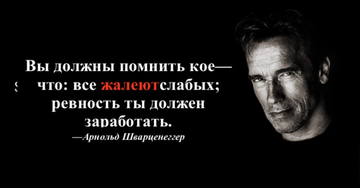

## 10. В мире зеркального изображения, почему вы, как обычный человек, всегда можете выбрать правильно?

Иногда действительно существует момент «решающее победу мгновение». Когда вы выходите на торговый рынок и выбираете **стратегию фиксированных инвестиций**, вы фактически полностью выиграли, и выиграли очень просто --- дальше вы находитесь на правильной точке из всех в **зеркальном мире**. Это так просто. Когда вы решаете научить себя, как только вы начинаете **обращать внимание на все клише**, вы выигрываете напрямую и просто --- на всех последующих точках вы находитесь в правильном положении в зеркальном мире (см. «*[Самостоятельное изучение --- это мастерство](https://github.com/selfteaching/the-craft-of-selfteaching)*»).

За прошлые многие годы у меня часто было недоумение: Почему так много полезных истин, на самом деле, в глазах большинства людей --- это другой взгляд? Концепция **зеркального мира** может быть использована для объяснения этого странного и беспомощного явления, но она не даёт прямого решения, которое является действительно простым, грубым и эффективным. До тех пор, пока однажды, на рынке торговли, в инвестиционной сфере, я увидел волшебство стратегии фиксированных инвестиций, я, наконец, понял очень простое решение:

> **Люди, без великих целей, всегда** выбирают такую ошибочную **ошибку в зеркальном мире.**

Причина, по которой мне так повезло, заключается в том, что я не верил в судьбу много лет назад. Прежде чем было невозможно понять ситуацию так же ясно, как сейчас. Но фактически я завершил первый шаг, и преимущества этой концепции будут реализованы только через много лет.

Некоторые причины, даже если они находятся перед вами, их мало испытаний поддерживают, это непостижимо, не вполне понятно и даже просто отказывается принимать и закрывает

глаза об этом . В конце 2018 года Арнольд Шварценеггер выступил с знаменитой речью

«Истинная правда успеха».

> *https://v.qq.com/x/page/c0818oag4pp.html*

В видео, по его словам, причина, по которой я стою здесь сегодня, только существует

одна:

> У меня есть цель.

Я не знаю, намеренно это или случайно, он использовал слово «Цель», которое более простое, чем «Мечта» и «Идеал». Для этой цели он может работать только старательно (Work his butt off). Я смотрел это видео много раз. Каждый раз я чувствую себя по--- другому --- именно благодаря этому видео я заметил, что могу объяснить свои мысли с помощью этого примера и доказать это всем: Существование у вас великих целей ,вы будете заставлять вас в две противоположные стороны зеркального мира.

Я поделился опытом моего детства в книге «считаю время другом». Однажды учитель оставил домашнее задание: писать сочинение «моя мечта

». Я не выполнял на следующий день. Почему? У меня нет мечты, поэтому я не могу написать его\... Когда я говорил учителю правду, учитель считал меня непослушным ребёнком, и демагогическим на классе в классе. Поэтому он придумал ужасное средство: Иди! Приведи своих родителей! Я никогда не видел таким , как ты!

Конечно, отец был всегда ждущий, как другие родители. Когда он прибыл в офис, он просто стоял, тихо слушал громкий шум учителя, и ничего не говорил. Он вытащил папиросу курил её. В офисе было совершенно тихо, и мой отец сказал: «Учитель Чен, я хочу услышать, какая ваша мечта?» Он зажег ещё одну сигарету. Никто не заговорил до того , чтобы он выкурил сигарету. Затем он повернулся в сторону и потянул меня за руку и сказал: «пойдём домой».

Итак, вы можете себе вообразить, что через много лет я отказывался думать о концепции мечты. Поэтому я всегда думал, что у меня действительно нет мечты. Конечно, сегодня я оглянулся назад и чувствовал, что на самом деле у меня нет мечты, это не правильно. Я естественно отвергаю такую пустоцветную концепцию.

Ещё раз, моя судьба достаточно удачна. Хотя я был почти введён в заблуждение мечты.

Я думаю, что я неосознанно изучил другой метод, который на самом деле более груб и прост,

доступ в процессе развития

Придайте большое значение тому, что вы хотите сделать и что вы делаете.

Много лет назад я случайно прочитал статью о писателе, который мне понравился, Би Шумин. На её лекции в университете студент задал «чрезвычайтый трудный вопрос»:

> Учитель Би, в чём смысл жизни? 

Ответ Би Шумина:

> Жизнь бессмысленна, благодаря жизни смысл живёт?(основное значение) 

Господин Би Шумин никогда не узнает, что в уголке земли, где она не могла знать, её слова неизгладимо остались в голове молодого человека.

Я сознаю, что этот навык очень мощный! Пока вы придаёте очень большое значение

одному из своих действий, вы, кажется, внезапно меняете свою личность--- потому что когда вы делаете это, вам не нужно настаивать и воодушевляться, вы просто не боясь неудач, вам все равно, что другие не согласятся и не поддерживают вас. Даже если кто---то помешает вам сделать это, вы боретесь до конца с ним --- мощная самодвижущая сила.

Знаете ли вы, почему я люблю писать статьи, писать книги и давать лекции? Потому что значение вида поведения великолепно!

В далёком прошлом отличный учитель тоже попадёт в ловушку самодовольства. В то время людям было не только трудно найти хорошего мастера. Что ещё страшнее, так это то, что хорошему мастеру очень трудно найти хорошего ученика. Поэтому, когда хороший мастер принимает ученика, он очень осторожен! Тем не менее, так называемые хорошие учащиеся, которые он изо всех сил выбрал или отобрал, спустя много лет оказались простым человеком, и доказывает, что изначальная самодовольство очень смешно и беспомощно\... Конечно, вы можете описать это явление сейчас: Потому что им приходится полагаться на инициативу за пределами активной границы --- успех в учебе находится в пределах активных границ, аразвитие учащихся, в большинстве случаев, находится за пределами активных границ учителя.

Знаете ли вы, что является чудесным в современном мире, когда пишут статьи, пишут

книги и преподают в Интернете? Насколько велик смысл?

Вы думаете о том, как мистер Би Шумин сменил молодого человека в маленьком приграничном городке много лет назад. Она знала? Нет. Это важно для неё? На самом деле, это очень важно, потому что после распространения знания и познания Би

Шумина, «Большая любовь»（BigLove） отражается в молодом человеке по имени

Ли Сяолай --- безразличная любовь --- настоящая любовь! Независимо от того, знает

ли Би Шумин (конечно не знает), является ли она преднамеренной (конечно не преднамеренной), заботится ли она (конечно нет), только благодаря неразборчивому общению, это знание и признание реализуют большую любовь!

Это максимум, что может сделать сознательный и мудрый человек: «Избавься от самодовольства»! Поэтому открывать источник хороших вещей --- это такой смысл. Пусть хорошая вещь завершит безразличную большую любовь. На мой взгляд, это значение чрезвычайно велико, и нельзя отказаться! Итак, вы можете себе представить, если бы вы были мной, кто осмелился бы остановить вас, не позволив вам сделать

такое великое дело, вы будете совершенно обеспокоены им, это правда?

Через много лет Ли Сяолай стал человеком с деньгами. Когда он был молодым, он хвастался, что вышел на пенсию в 40 лет! В возрасте 43 лет Я действительно обладает условиями для выхода на пенсию --- Конечно, потом я обнаружил, что выход на пенсию

--- самоубийство\... Поскольку я не могу и не хочу так, что же делать? Продолжайте делать то, что вам нравится! Что вы любите делать?Конечно, что вы можете сделать с самым большим смыслом! Что это для меня? Писать книги и давать лекции. Многие люди не понимают, вы заработали так много денег, как вы все ещё можете писать книгу и давать лекции? Противные люди более забавные. Они думают, что «Ли Сяолай ещё пишет книгу---этот факт», может доказать, что у Ли Сяолая не хватает денег\...Благодаря многолетнему опыту я понимаю, что для людей, которые отражают другой конец, даже если я пытаюсь объяснить, они слышат и сморит наоборот: мне не нужно много работать, а потом я делаю то, что мне нравится больше всего. В каком значении заключается заработка много денег? Разве это не просто для того, чтобы внешний мир вас не беспокоил, когда вы делаете то, что вам нравится делать?

Таким образом, вам не нужно использовать высокое слово «мечта»(поскольку я был почти введён в заблуждение из---за его великолепного внешнего вида, когда я был молодым, тогда мне не нравится это слово. Я думаю, что оно пустозвонное). Но вы можете использовать моё случайное обучение, которое я практикую за многие годы и доказываю, что это простой эффективный метод:

> Придайте большое значение тому, что вы делаете.

Оглядываясь назад, вы поймёте, почему я сразу должен сказать вам: «Инвестиции --- это единственный надёжный способ для простых людей, кто хотите избавиться от укрепления класса». Это то, что я помогу придать вам большое значение для того, что вы должны делать, и обязательно сделаете. Конечно, вы также можете найти свой собственный великий смысл.

Не только это, но я объясню вам с разных сторон: каков его принцип, какова его роль и каково его значение? Что ещё более важно, независимо от того, с какой стороны, можно доказать, что фиксированное голосование --- это обязательно является тем, что должны делать все простые люди. Более того, что фиксированное голосование --- это то, что могут делать все обычные люди. Это очень реалистично, не преувеличено.

Действовать по мере своих сил и не нужно думать о глупостях.

Сколько раз повторять не излишне:

> Для всех простых людей стратегия фиксированных инвестиций абсолютно осуществима, действующая нет ничего лишнего слова, и все зависит от самих. Простые люди, упомянутые здесь, независимо от национальных границ, региона, расы, пола, возраста, роста , фигуры и независимо от сексуальной ориентации \... Ключ к этому--- даже независимо от IQ и образования!

Во всяком случае, сейчас я чувствую, что стать человеком с мечтой---это очень хорошо.

# 