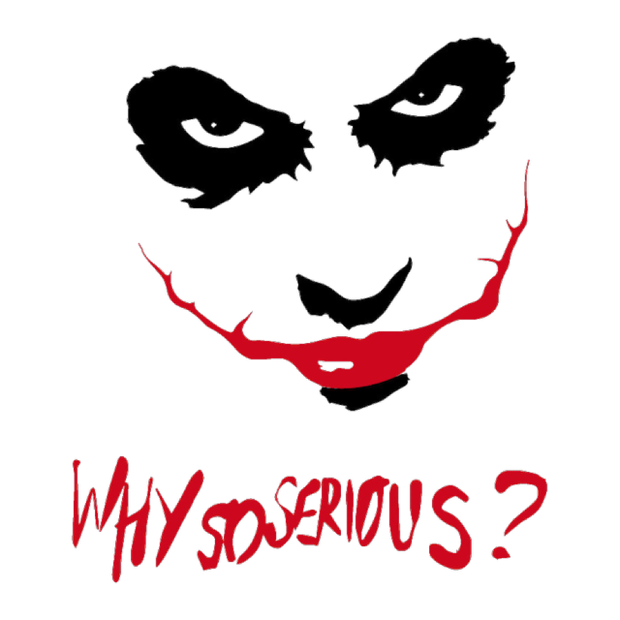

##3.El *DCA* es la única manera correcta de inversión para la gente común

Permítame decirte la conclusión primeramente:

> En este lugar mágico del mercado de transacción, **la única forma confiable en que la gente común puede invertir es el *DCA***. ¡Recúerdalo!

Dado que [BOX](https://b.watch/), el primer ETF de blockchain en la tierra, se acaba de establecer (el 3 de julio de 2019, similar al \"viernes negro en julio del círculo de bitcoin\" ), su historia de datos no es suficientemente larga, así que no se puede servir como ejemplo para mostrar la inversión regular para el público.

El Fondo [Longmen](http://www.longmen.fund/), cuyo predecesor fue Bit Fund, fue fundado por Li Xiaolai en 2013, y se liquidó en 2018. Luego, algunos inversores decidieron quedarse y continuarlo. Por lo tanto, crearon el producto ETF llamado el Fondo Longmen. Actualmente no está abierto al público, sólo un número muy reducido de personas calificadas fueron invitadas a invertir\...Pero debido a que cuenta con datos transparentes a largo plazo, aquí lo tomamos como un ejemplo del objetivo de la inversión regular.

Abajo es una captura de pantalla del sitio web del Fondo Longmen a principios de julio de 2019:

Como ejemplo de la inversión regular, sólo echamos un vistazo a los datos mensuales:

Asumiendo que desde el septiembre de 2018, inviertes \$1.000 mensualmente en un plan de inversión automática en el Fondo Longmen por 11 meses, entonces los datos son como siguientes:

De acuerdo con los datos, bajo la condición de que inviertas mensualmente en un plan de inversión automática, has perdido el punto más alto de \$92 el día 25 de junio de 2019 así como el más bajo, de \$23 el 15 de diciembre de 2018\...Pero al fin su precio promedio es de \$54, y el precio actual es de alrededor de \$85. Durante los 11 meses, has invertido un total de \$11.000 y su valor actual es de \$19.141,44. Si calculamos al precio cuando invertiste la última vez, \$82 - aunque es \$1 menos del mes anterior- ¡has obtenido un rendimiento de **74.01%**!

Se ve más claramente la relación entre el capital que invertiste y tu ganancia actual en el diagrama de abajo:

En los datos de los 11 meses del Fondo Longmen, la curva de precio forma una \"curva de sonrisa\" fascinante.

Siempre ha sido la minoría que adopta la estrategia de la inversión regular, pero para los que no la adoptaron, la llamada \"**curva de sonrisa**\" es probablemente una opuesta \"**curva malvada**\". Definitivamente no es una sonrisa amable, sino malvada del payaso que viste en la historia de Batman, y murmurando : "Why so serious?"

Ahora volvemos a ver los datos, asumiendo que tu método de inversión es igual que la mayoría, la llamada \"inversión de golpe\"(Lump Sum), e invertiste \$ 11.000, luego de 11 meses, no tendrías pérdidas del capital, porque habría aproximadamente el **10,81%** de beneficios - aunque es mucho menos que el **74,01%.**

Sin embargo, si te gusta \" inversión de golpe\", es poca la posibilidad de que puedas insistir por 11 meses, porque verías absolutamente la curva malvada.

Estarías muy ansioso en todos los siguientes momentos, días y meses. Y durante los próximos seis meses, el único sentimiento sería que tus activos se están reduciendo a cada segundo y minuto.

Ya que nuestros sentimientos son determinados por los genes, el dolor y la felicidad no son simétricos. El dolor de perder 10 dólares es mucho mayor que la felicidad de ganar 10 dólares. En este caso te sientes absolutamente como si el malvado payaso te está torturar, sacó la lengua, murmurando tenebrosamente, ¿por qué lo tomas tan serio?

Sin embargo, si eres un inversor en el *DCA*, te encontrarás en un mundo completamente diferente, aunque se ven iguales, aunque aparte de ti, la mayoría de las personas no pueden entender tus sentimientos, porque todos sus sentimientos son opuestos.

**La inversión regular consiste en un comportamiento que requiere soporte a largo plazo**. Ya que has apostado en tu propio futuro, debes haber considerarlo cuidadosamente a la hora de la selección. Por lo tanto, para ti las caídas del precio aparecidas después de la primera compra, son momentos de bajar el precio promedio. Cuando los que invirtieron de golpe experimentan y tiemblan en el frío invierno, lo que pasa a ti es contrario, sientes refrescante, y alegre por tener más fichas de bajo precio\...

Los que invirtieron de golpe no pueden soportar el dolor por mucho tiempo, en realidad, nadie puede hacerlo. Esto no tiene nada que ver con ser \"fuerte\". Desde otro punto de vista, no es estúpido, sino ignorante. Después de un mes triste, o dos, o tres, o si vuelvan a verlo posteriormente, fue en aquel momento cuando parecía que iban a superarlo, es decir, en el sexto mes (o antes), muchos se marcharon por diversos motivos - este comportamiento se denomina \"cortar la carne\" en el mercado de transacción\...el "puerro"(inversor minorista fracasado) se corta a sí mismo y lo que corta es carne sangrienta.

Y para ti todo debería ser así. No dejarás a nadie que te impida comprar las fichas de precio bajo. En lugar de frío o temblores, sientes entusiasmo cada vez de invertir en el plan, porque cuando se reduce el precio promedio, es equivalente a \"**anticipar tu tiempo de entrar**\". No te molestarás tanto como los demás, diciendo \"¡huy, si lo supiera antes!\" o \"¿por qué me lo enteré tan tarde?\" En general, sienten que llegan tarde\... Y tu caso es diferente, sabes que tu comportamiento está constantemente adelantando a tu tiempo relativo de entrar.

Después de seis meses, el precio comienza a subir lentamente\... ¿Crees que los que \"cortaron la carne\" se lanzarán a apostar todo de nuevo en este momento? No, ya están casi muertos de miedo. La experiencia terrible les causará un miedo más fuerte. Por eso lo que pasa, casi al 100% de probabilidad, es que están dudando, viendo cómo sube el precio sin fichas en las manos\...En momentos de caídas del precio huyeron por miedo, y ahora más miedo tendrán cuando sube el precio. Irónicamente, después de que su estado de ánimo se derrumba, vuelven a invertir. Es posible que el precio haya sido muy alto, y la próxima curva malvada esté a punto de comenzar\...

Es un ciclo horrible para ellos, porque no importa cómo lo hagan, siempre sienten un

mundo malicioso. Con las explicaciones anteriores, es muy simple ahora: para ellos, la curva de precios de cualquier objetivo de inversión se compone de innumerables curvas malvadas. ¡Qué terrible es tal destino!

En el mismo mundo, las diferentes personas pueden sentir lo contrario. Si inviertes regularmente, en el mismo momento, el mismo mundo es otra forma para ti, porque la curva de precios que enfrentas está formada por innumerables curvas de sonrisa. La felicidad es rara y escasa en este mundo. Ahora te pregunto, ¿no es más escasa y más preciosa este tipo de felicidad que no se puede decir a los demás?