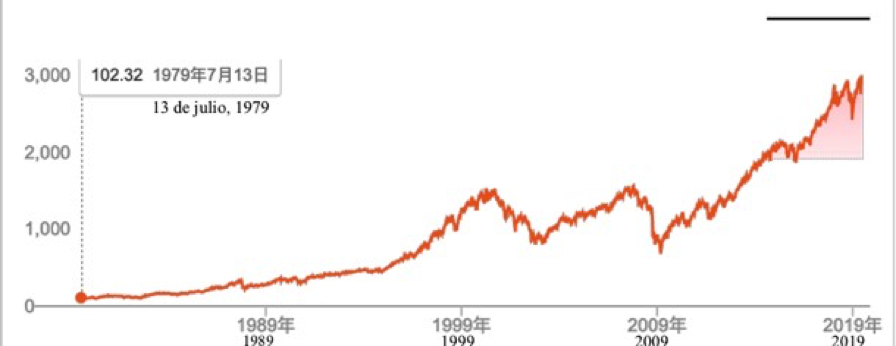

##4.¿Existe algún objetivo de inversión que sólo sube y no baja?

Como persona común, cuando te da cuenta de la magia del mercado de transacción, y descubres que puedes hacer que las personas más inteligentes del mundo trabajen por tu dinero sin umbral, y te ayuden a elegir el mejor objetivo de inversión gratuitamente, es absolutamente innecesario estar orgulloso o humilde, porque la gran mayoría de los llamados inversores en el mercado de transacción faltan de experiencia, lo mismo pasa a la gran mayoría de los gerentes de inversión en trajes.

Si no lo crees, puedo enseñarte rápidamente una técnica muy efectiva.

Cuando alguien juegue como experto delante de ti, puedes hacerle esta pregunta:

> ¿Cómo diluyes el coste de oportunidad?

Generalmente, encontrarás de inmediato que él o ella comenzará a hablar evasivamente... Puedes repetir esta prueba varias veces si todavía no estás convencido.

Al adoptar el mejor consejo gratuito proporcionado por todas las personas inteligentes en el mercado, nos enfrentaremos a otra situación embarazosa, es que, si sólo compramos Vanke, o cualquiera de Kweichow Moutai , Apple, Coca-Cola y China Tobacco, tendremos un grave problema:

>¡Es ilimitadamente grande el coste de oportunidad de invertir en sólo un objetivo! Este es definitivamente un concepto que cualquier persona ordinaria puede entender.

El llamado coste de oportunidad significa que si inviertes tu dinero en un determinado objetivo, no podrás invertir el dinero en otra opción alternativa al mismo tiempo... El dinero que inviertes en A no puede ser simultáneamente invertido en B, entonces, las ganancias futuras de B se convertirán en el coste de oportunidad de las ganancias futuras de tu inversión en A.

Sería infinito el coste de oportunidad si sólo inviertes en un objetivo. Por eso, hasta los novicios pueden comprender instantáneamente por qué debemos encontrar una manera de diluir el coste de oportunidad. La inversión es una técnica de pensamiento integral, que no es suficiente sólo considerar la posible tasa de rendimiento, Además, debes tomar en cuenta el riesgo, y "**cómo diluir el coste de oportunidad**" también es un factor importante.

¿Hay alguna manera para resolverlo? ¡Definitivamente! Una forma simple es invertir en una gama de objetivos de calidad. Cuando compras un fondo de índice o un ETF, tu objetivo de inversión ya no es una empresa o un proyecto, sino una serie de empresas o proyectos de calidad.

Mucha gente pasa por alto un hecho sutil: al comprar una gama de objetivos de calidad, por un lado, diluye efectivamente el coste de oportunidad, y por otro lado, el atributo y la calidad de tu objetivo de inversión han cambiado. A largo plazo, ¡**tu objetivo de inversión se ha convertido en un objetivo que sólo aumenta y no cae**! Por muy espléndida que sea una empresa, es muy difícil mantener la prosperidad para siempre, y cabe la posibilidad de decadencia.

Es absolutamente increíble.

Por muy espléndida que sea una empresa, es muy difícil mantener la prosperidad eternamente, y cabe la posibilidad de decadencia, incluyendo las marcas conocidas como Kodak y Nokia. Por eso las compañías como Coca-Cola y Kweichow Moutai son extremadamente raras, pero si ocurre un evento del cisne negro, también se enfrentarán al desastre. Por lo tanto, invirtiendo sólo en una de las mejores compañías, tendrás un coste de oportunidad infinitamente alto. Por otra parte, no existe una manera efectiva de evitar el evento del cisne negro. Cuanto más lejos colocas la perspectiva, más correcto sería lo mencionado.

Pero, ¿existe en el mundo un objetivo que sólo crece y no cae a largo plazo? Sí, ese será el

desarrollo económico de la humanidad.

Esta es también la razón por la cual, a largo plazo, el índice de precios del mercado de valores tiene una sola tendencia, al alza. Los altibajos a corto plazo constituyen una tras otra curva de sonrisa (o curva malvada). Cuando se unen todas las curvas, y a pesar de los altibajos inevitables en el medio, al final sólo queda una tendencia, que será la subida.

Abajo es una gráfica de tendencias de precios en los últimos 40 años (1979 ~ 2019) del índice S&P 500:

De modo que, cuando inviertes en una serie de objetivos de alta calidad, ya no "apuestas" en una empresa determinada, sino en el desarrollo económico general...Si compras una gama de objetivos de calidad en el mercado de valores de China, estás apostando al desarrollo económico de China. O si inviertes en el mercado de valores de EE. UU., entonces estás apostando al desarrollo general del mundo, porque las empresas excelentes de todo el mundo pueden cotizarse allí. Y si compras BOX (que contiene tres tipos activos de alta calidad en el mundo de blockchain: BTC, EOS, XIN), lo que "apuestas" ya no se limite a bitcoin, o un proyecto de blockchain. Lo que realmente "apuestas" es el desarrollo de toda la industria de blockchain.

Cuando yo diseñaba BOX, la consideración más importante fue la ruta de desarrollo de la tecnología de blockchain, como he mencionado en muchas ocasiones:

> Libro de contabilidad confiable→ Código confiable → Entorno de ejecución confiable → Dispositivo confiable...

Históricamente, desde luego no perdí la oportunidad de bitcoin en 2011; en realidad, no perdí la de Ethereum en 2016; en 2017, fue un inversor ángel en EOS, el proyecto de blockchain más popular, con una capitalización de mercado de más de $5 mil millones en 2019. Del mismo modo, MIXIN Network es también el proyecto más importante en mi inversión - Si se acierta una o dos veces, puede ser buena suerte, pero con éxitos repetidos, ya no es sólo buena suerte, ¿sí? La lógica es la única confiable herramienta disponible para los humanos frente al futuro. No contiene egoísmo secular en este diseño, porque el diseñador de BOX, Li Xiaolai, no cobra la tarifa de administración (puede ser el primer ETF de blockchain que no cobra la tarifa de administración) y, lo más importante es que Li Xiaolai sólo puede ganar dinero invirtiendo regularmente en BOX en las mismas

condiciones que los demás.

De hecho, esto es ¡la verdadera magia del mercado bursátil! Aquí, cualquier persona puede alcanzar el desarrollo económico de la humanidad o la sociedad. Lo maravilloso de la globalización es que la gente común en Japón puede comprar acciones estadounidenses para seguir el desarrollo económico de Estados Unidos durante la recesión económica doméstica; el público estadounidense también puede invertir en acciones chinas para seguir el desarrollo económico de China cuando la economía de su país está estancada; y en China, aunque comprar acciones japonesas o estadounidenses o incluso las de Hong Kong no es conveniente para la gente común, también puede mantenerse a la par con el surgimiento y desarrollo significativos de Finanzas de internet en el mercado de comercio de blockchain por todo el mundo, al igual que todas las personas comunes mundiales.

Aquí hay un punto importante secreto:

>No existe un objetivo que sólo sube y no baja, pero **a largo plazo** sí existen objetivos que sólo crezcan y no caigan.

En el libro *Autocultivo de los puerros*, traté de corregir una verdad malinterpretada por la mayoría de la gente común:

>- El mercado de transacción es, de hecho, un juego de suma cero en el proceso de negociación en tiempo real: parece que la ganancia del oponente proviene y es exactamente igual a tu pérdida.
>- El mercado de transacción definitivamente no es un juego de suma cero para los inversores a largo plazo, porque su ganancia se debe principalmente al crecimiento económico y no a las pérdidas de otros participantes a corto plazo.

Ésta es también la esencial razón por la cual, el único método de inversión confiable para las personas comunes en el mercado de transacción es la inversión regular. Por otro lado, como una persona normal, será infalible sólo cuando inviertes y posees la inversión a largo plazo.

Es imposible que la gente común tenga una gran cantidad de dinero al principio. Sin embargo, mediante la inversión regular, la gente común "arriesga" su propia capacidad de ganar dinero fuera del sitio y una disciplina a largo plazo a la inversión regular. Ésta es una gran apuesta, ya que tu tiempo es un activo absolutamente exclusivo, un activo de infinito coste de oportunidad. Por lo tanto, cuando inviertes tu activo de calidad más valeroso, y de coste de oportunidad ilimitado, sólo puedes elegir un objetivo infalible. Y esto sería el desarrollo de la economía de toda la humanidad. Aparte de esto, no hay otra opción.

En el momento actual, el mercado de blockchain tiene precedencia sobre el de valores, el de valores es mejor que el inmobiliario, el de inmuebles puede ser mejor que el de bonos y el de bonos puede ser mejor que los ahorros bancarios...Y la inversión regular es una estrategia en que las personas comunes arriesgan sus futuros, porque no cuentan con demasiado dinero al comienzo. Por lo tanto, para elegir el mejor objetivo de inversión, por supuesto debemos hacer más esfuerzo posible. Si en algún momento del el futuro, el objetivo óptimo deja de ser el mercado de blockchain, entonces deberías cambiar a otro mercado mejor: esto no es determinado por la creencia, sino por los valores pragmáticos.

Esta sutil elección te hace sentir mágico, aunque pensabas que habías sido una persona normal. Te sorprenderás de cómo has comprendido los hechos con facilidad que la mayoría de las personas no pueden imaginar:

> Son irrelevantes el límite de las nubes que flotan en el cielo y el de las ciudades en el suelo.

Mientras los otros aún están escuchando el pronóstico para juzgar el tiempo local de hoy, ya has fijado en el cielo y has encontrado maneras de saber de anticipación cuáles nubes lloverán... Son obviamente diferentes los **grados**, incluso no es demasiado si usas la palabra "**panorama**"...

Finalmente, hay que añadir los puntos clave más importantes:
>
> La inversión regular es un comportamiento de inversión continua a largo plazo, por lo que el objetivo de inversión debe cumplir con el atributo de ser "**alcista constante a largo plazo**".

Siendo extremadamente estricta en este atributo, la conclusión es muy obvia. Ninguno de los bonos, el oro y los bienes raíces, por no mencionar las zapatillas deportivas de moda, son opciones calificadas porque simplemente no cumplen los atributos necesarios. Desde esta perspectiva, entenderás de inmediato por qué Buffett es muy cuidadoso con las acciones tecnológicas, pero Coca-Cola le da mayor seguridad...