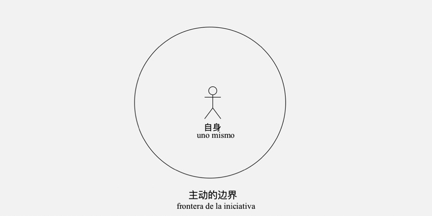
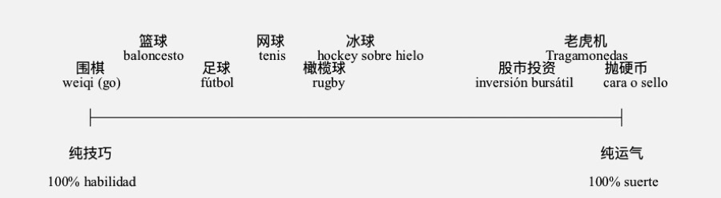
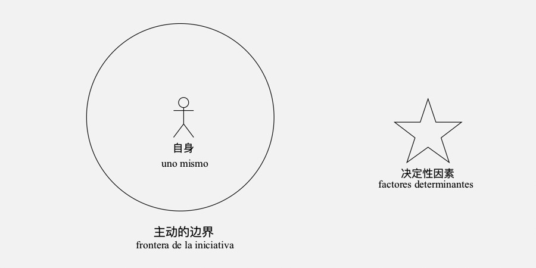
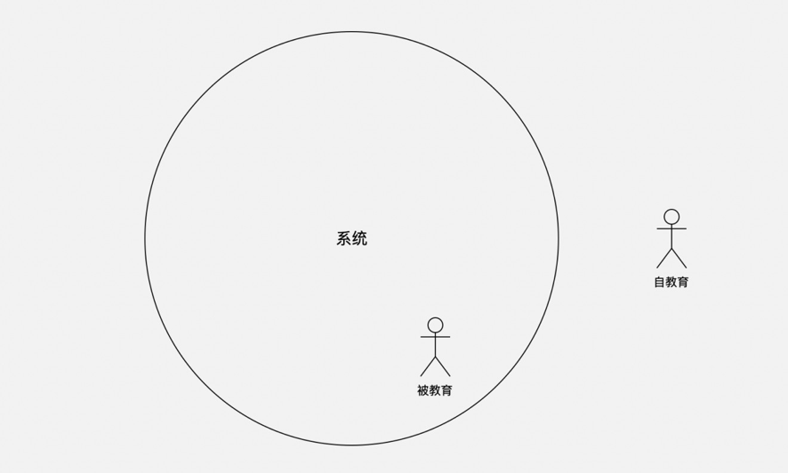
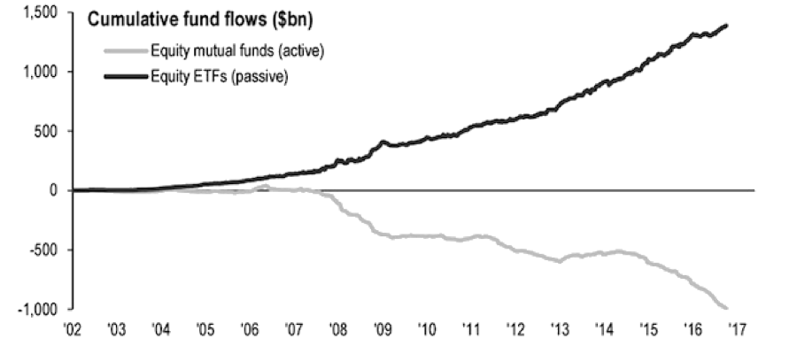
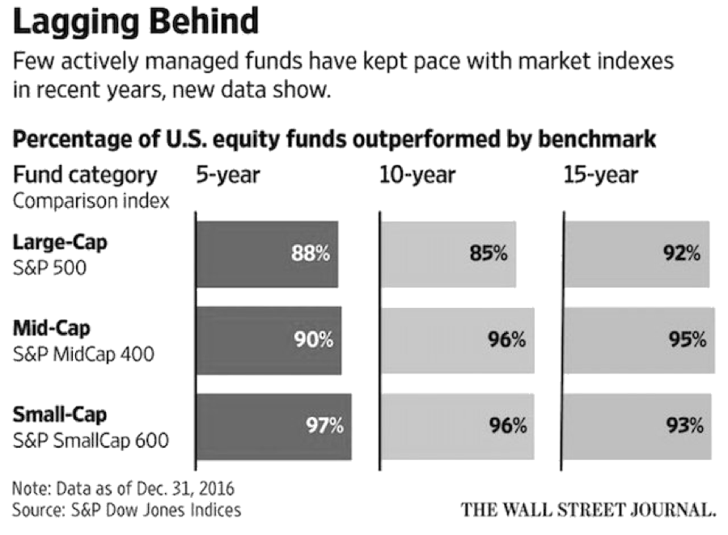
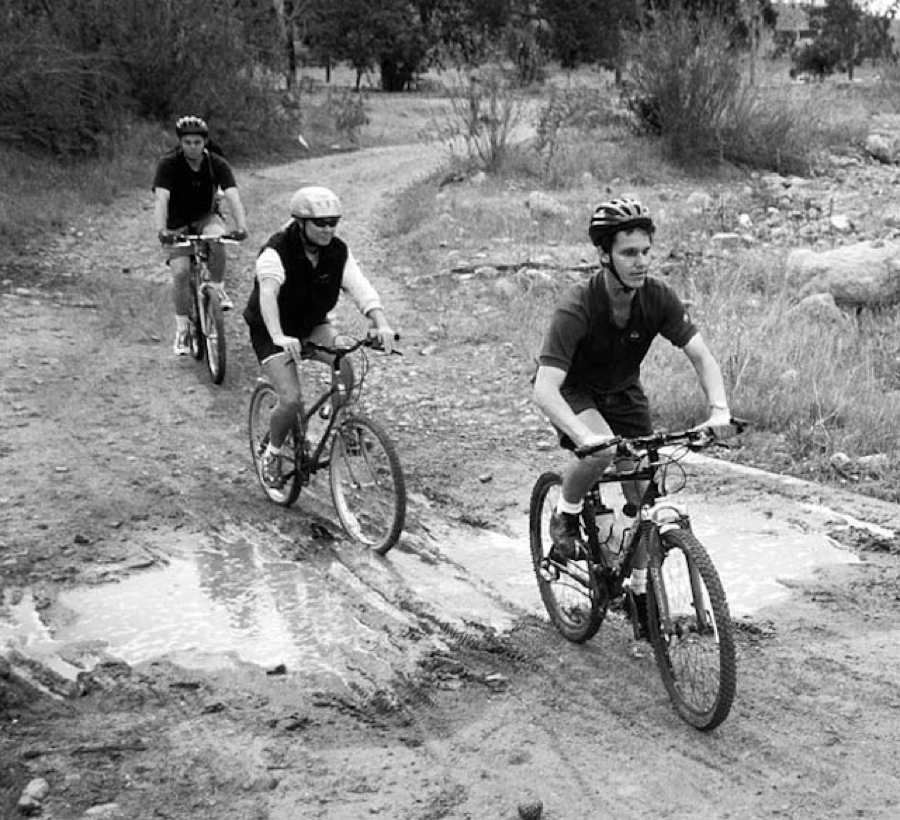
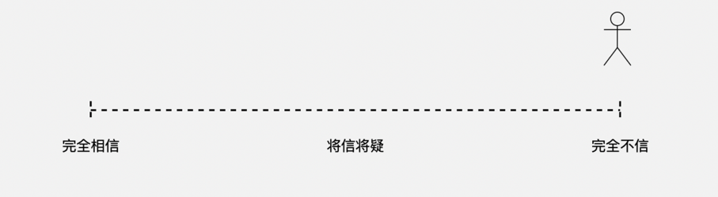

##9.El mecanismo profundo detrás del poder mágico de la estrategia de *DCA.*

Vamos a comenzar con un par de conceptos que parecen opuestos: 

> Activa y pasiva

Generalmente, se consideran antónimos. Se entiende que \"activo\" es positivo, mientras que relativamente, \"pasivo\" a menudo se entiende como negativo.

###9.1.Desarrollar una personalidad activa

En muchos casos, no es algo bueno siendo una persona pasiva en vez de activa. Especialmente para los presuntuosos, quienes **deben tomar la iniciativa de cultivar una personalidad activa que los proteja**.

A menudo doy este ejemplo: en cualquier puesto de trabajo, se puede distinguir fácilmente si una persona es activa o pasiva. Las activas trabajan para sí mismas mientras las pasivas trabajan para el jefe, aunque ambas reciben el salario del jefe igualmente. Si la última que sale de la oficina fue una persona activa, apagará el aire acondicionado y las luces, al igual que al salir de su propia casa. Y para las pasivas, distinguen claramente entre \"lo que debo hacer\" y \"lo que no está relacionado conmigo\". Por eso, si uno sale de su casa y recuerda que no ha pagado las luces, volverá incluso de una distancia de un par de kilómetros. Pero si es la última que sale de la oficina, sólo cierra la puerta, incluso no se da cuenta de que la puerta no está bien cerrada\". Las activas no se engañan a sí mismas, saben que deberían ser dignas de su energía y tiempo gastados; las pasivas engañan a los demás y se engañan a sí mismas, quieren burlar todos pasos y obtener un beneficio superior al promedio con pagos mínimos en todas las áreas, de lo contrario, se sienten injustos.

Si observamos de cerca, **todos los pensadores independientes son activos,** toman la iniciativa de estudiar los problemas, los descubren y finalmente verifiquen espontáneamente los resultados de reflexiones. Y siempre los apliquen espontáneamente sin importar su exactitud. Si algo sale mal, espontáneamente vuelvan otra vez, lo ajustan, corrigen y demuestran nuevamente a través de la aplicación\... Éste es un sistema completo de proceso de circuito cerrado, y los pensadores independientes se han acostumbrado a esta manera activa. Entonces, en cualquier momento, cuando se inicia este proceso, parecen tan natural que no se ven diferentes de las personas pasivas desde el exterior\...

Los que faltan de capacidades de aprendizaje, de práctica, de pensamiento independiente, de análisis y así como de acciones, se deban a la personalidad pasiva. Con el tiempo, les resultará cada vez más difícil salirse con la suya, pero no pueden hacer nada al respecto. Tras gastar tanto dinero y tiempo en estudiar, no han tomado la iniciativa de autoaprender ninguna habilidad práctica y efectiva en la sociedad, tales como la lectura basada en búsquedas, la escritura creativa, pronunciar discursos, la planificación, el liderazgo, ganar dinero, y mucho menos la inversión.

Bajo la situación de que hay cada vez más ocasiones donde no pueden burlar los pasos,

¿qué hacen las personas pasivas? Lo has adivinado: **queja**.

**Aléjate de aquellos que se quejan todo el día**, no saben lo que están haciendo. Se quejan de la injusticia, enojados, como si la justicia estuviera de su lado. Nunca quieren saber la verdad: el mundo es injusto. Para describirlo en un vocabulario más preciso, imparcial y discreto: el mundo está lleno de **asimetría**, así como de **incertidumbre**.

¿Es simétrica la responsabilidad del jefe y la del personal? ¿Es simétrica la obligación de los padres y la de los profesores? ¿Es simétrico el trabajo de horas extras del diseñador y el del vendedor? ¿Es simétrico el riesgo de los beneficiarios de intereses creados y el riesgo de los demás? ¿Es simétrica la felicidad de los hombres y la de las mujeres? Es muy ilógico e irracional hablar sobre la equidad literal sin considerar la existencia objetiva de la asimetría. Pero no saben que su ira y dolor se basan en la ignorancia y la superficialidad.

**En la mayoría de los casos, es básicamente correcto elegir ser una persona activa**. Por ejemplo, completar la tarea por iniciativa propia, cambiar activamente la dirección, resumir activamente la experiencia, asumir la responsabilidad, aprender y progresar activamente\...Si eres ese tipo de persona, es imposible ser excluido en cualquier lugar. No creas en las leyendas urbanas que dicen que es inútil la capacidad, y todo depende de sus relaciones sociales\...Si desafortunadamente estás en un lugar así, ¡déjalo! Los que no se marchan resueltamente, mientras se quejan, serán obviamente de mala cualidad moral. Se quejan de la injusticia por no haber sacado provecho.

Nacido en 1972, he presenciado los grandes cambios sociales en el proceso de crecimiento. En nuestra era, muchos jóvenes eventualmente se convirtieron en una variedad de \"jóvenes enojados\". Afortunadamente, no era tan furioso, así que no pude hacerme un \"joven enojado\". Al ver que alguien ha vivido una vida diferente mediante la ayuda de las relaciones sociales de sus padres, muchos están insatisfechos. Disculpe, pero si consigues superar a tus pares por esfuerzos, ¿ignorarás a tus hijos? ¿Es injusta la sociedad? y ¿qué sociedad es justa? Al ocurrir algunos eventos injustos, es bueno hablar del evento mismo, pero por favor no impliques el caso a toda la sociedad sin conocimientos de la probabilidad estadística. Además, frente a un evento injusto, puedes **luchar por la justicia**, ya que la justicia nunca te caigas del cielo, tienes que luchar por ella, igual que la dignidad por tú mismo.

En enero de 2018, la Administración de Aviación Civil de China publicó las *Regulaciones de Transporte Doméstico para Viajeros y Equipajes*, en que estipularon que para viajar en avión, los ancianos mayores de 70 años deberían poseer un certificado emitido por hospitales a nivel del condado o superior. Cuando salió la noticia, mi madre se encontraba entre los que se quejaban mucho. Ella nació en 1945, tenía un poco más de 70 años\... Puedes imaginar lo feroz que era la ira cuando descubrió ser restringidas. De todos modos, ella reaccionó más fuerte que los jóvenes enojados que había visto antes.

Cuando organizamos el itinerario por teléfono, gastó más de diez minutos diciéndole una aritmética simple: en la frase \"la tasa de accidentes\", existe la \"tasa\", así que no era una situación ajena a los demás. Y el número de accidentes es igual al número específico de personas multiplicado por la tasa de accidentes. Bajo la misma tasa de accidentes de uno en diez mil, la suma de los accidentes durante varios años en países como Irlanda, Singapur y Australia, puede ser menor que el número de accidentes en China en un mes, basada en la grande población de China. La regulación no apunta a ti sola, por lo que no hay nada injusta, ¿sí? La verdadera injusticia es que, frente a la regulación, puedo organizarte una coche, así como los turno de chóferes. De todas maneras, puedo ayudarte ir a donde quieras, pero ¿es esto injusto para aquellos que no tienen esas condiciones?

Cuando el cerebro humano está congestionado, todas las obvias respuestas, explicaciones, salidas, soluciones están \"desaparecidos\", o aunque están claramente frente a uno, directamente \"cierra los ojos\". Tras varias rondas, mi madre lo entendió y dijo: ¡oye, ciertamente no debería estar enojada! Tengo un buen hijo, ¿quién tiene una fortuna mejor que la mía? Luego, nos alabamos mutuamente por un rato, y le dije que \"soy tu hijo sea cuán excelente\", así puse un fin feliz al diálogo.

Los que se quejan todo el día deben ser refutados. Si les explican amablemente las razones, ellos dicen que es una sopa de pollo(artículo inspirativo); si les hacen de buena intención una demostración, dicen que es una actuación; luego salen a trabajar a su propia manera, y después de varios años, regresan y dicen que en estos años ha sido malo el entorno económico\...Pero la realidad es que en los últimos 40 años, China ha ostentado el liderazgo global en cuanto al crecimiento económico. ¿De dónde viene un mal ambiente económico? Sea quien sea, no se puede negar que en general, el crecimiento económico a largo plazo de China ha mostrado el mejor estado de la historia. A ese respecto, el chiste de [Zhao Benshan](https://en.wikipedia.org/wiki/Zhao_Benshan) desvela la verdad:

> Admítelo si no tienes la habilidad, ¿cómo es que adonde vas, el ambiente local es malo?

¡Quizás eres el que destruyes el ambiente!

De todos modos, es realmente aburrido embellecer tu incompetencia con la experiencia injusta de los demás.

###9.2.La mayoría de las personas activas ni siquiera conocen las fronteras

A medida que comienzas a preocuparte por la personalidad activa, y continúas formando y cuidando la personalidad activa, descubrirás que **son muy pocas las personas activas**.

He mencionado un ejemplo de mi buen amigo, Huo Ju (actual CTO y COO de [PressOne](https://press.one/)), quien me enseñó la socialización activa. Piénsalo, ¿cómo pueden tener una interacción social efectiva las personas caseras como yo? Tras años sin relacionarme, escribí el artículo que se difundió ampliamente en Internet con una lectura acumulativa de más de mil millones: *Deja tu socialización inválida*. Sin embargo, Huo Ju me ha cambiado. En una visita a su casa, vi que él pasaba una tarde organizando las tarjetas de presentación, haciendo marcas, y murmurando: \"Bueno, parece que han sido tres meses desde que contacté a esta persona, debo ir a verlo\... \"

Entonces lo aprendí, y en un abrir y cerrar de ojos ya pasaron diez años. He descubierto que, de hecho, la mayoría de las relaciones efectivas requieren que al menos una de las dos partes tome la iniciativa. Y si ambas son pasivas, pierdan lentamente el contacto. Debemos abandonar las interacciones sociales inválidas, ¿pero qué hacemos con la socialización efectiva? Para obtener una vida social efectiva, debes convertirte en una persona activa en eso.

Aunque la energía activa es grande para cualquier individuo, **existe una frontera de la iniciativa**, más allá del límite, perderá su efecto e incluso tendrá un efecto negativo\...¿Por qué falla la gran mayoría de la educación familiar? ¿Por qué la proporción de fallas es escandalosamente alta?¿Por qué la amplia discusión en la sociedad no puede resolver este problema? Una posible explicación para este hecho frío es:

> Los padres siempre usan el poder positivo en lugares donde no deben tomar la iniciativa. En otras palabras, los padres inconscientemente pasaron los \"límites de la iniciativa\".

**La primera frontera de la iniciativa es uno mismo.**

Para todo dentro la frontera de uno mismo, debería adoptar una actitud proactiva; sin embargo, fuera de sí mismo, y más allá del límite de la iniciativa, es más probable que la iniciativa tenga un efecto negativo. Si los padres están tratando de perfeccionarse, eso significa que apliquen la \"iniciativa\" dentro de los límites.

Lamentablemente, los pensamientos populares y palabras más frecuentes de la mayoría de los padres son: \"nuestra generación ha sido así\...\", luego comienzan a esperar que la próxima generación sea diferente con ellos. Por lo que apliquen todo lo posible fuera de sí mismo, es decir, fuera de sus límites de la iniciativa: en sus hijos.

Inesperadamente, el resultado está casi destinado a ser negativo:

>- Ellos mismos como padres, no tendrán mejoras en su futuro;
>- Sus hijos se convierten involuntariamente en \"personas pasivas consiga\" \...

La opción correcta habría sido:

>- Los padres deben tomar la iniciativa para perfeccionarse;
>- Impulsado por la admiración, el hijo desee mejoras, y tomará la iniciativa. Incluso la imitación superficial es un buen comienzo\...

**La opción correcta siempre es más difícil de implementar.**

Otro ejemplo más común es nuestra actitud sobre la norma moral. El objeto de restricción de la moralidad debe ser uno mismo en vez de los demás. Es correcto que uno mantiene rígidos requisitos éticos a sí mismo, pero es demasiado ingenuo o insidioso si pide que los demás hagan lo mismo. Pero la ley es aplicable a todos, no sólo ponen límites a sí mismo, sino también a los demás. Dado que la ley se aplica a todos, tomar el arma de la ley en defensa de los derechos e intereses a menudo resuelta difícil. Puedes pensar cuidadosamente el por qué.

Si comienza una inversión regular, te conviertes en un inversor con ciertos atributos. Luego te encontrarás con grupos de inversores diferentes contigo, quienes están maestreando todos los días a las compañías invertidas, y están ansiosos por ofrecer sugerencias. Al final, a menudo se enojan e incluso les quita las ganas de comer. ¿Por qué se vuelven así? Es que no saben que están fuera de sus propios límites de la iniciativa; no saben que fuera de la frontera, su propia iniciativa es inútil, y si lo es, todo es negativo. Y nunca entenderán, que

simplemente no sean capaces de hacer un modelo comercial efectivo y, en última instancia, obtener la inversión del público. Si realmente lo consiguen, sabrán cuán terrible es cuando tanta gente de afuera quiere influir en ellos, y cuán terrible es si pueden ser influenciados tan fácilmente por el mundo exterior.

**El segundo límite de la iniciativa es el rango de control.** De hecho, podemos controlar cosas como la temperatura del aire acondicionado, la velocidad del coche, etc. Incluso en las discusiones posteriores te mostraré lo que podemos controlar, más allá de su imaginación\... pero **es más importante la identificación de cosas que no se puede controlar**. Por ejemplo, la pura suerte es algo que nadie puede controlar\...

En algunos casos, la habilidad juega un papel del 100%; en el otro extremo, sólo funciona la suerte. Entre los dos extremos, la proporción de la habilidad y la suerte son diferentes\...

La gráfica de arriba es citado del libro publicado en 2012 por Michael J. Mauboussin: ***The Success Equation: Untangling Skill and Luck in Business, Sports, and Investing***

Es fácil de observar que:

>- La gran mayoría no se esfuerzan suficientemente dentro de sus propios límites de la iniciativa;
>- Más personas hacen tonterías sin darse cuenta fuera de sus propios límites de la iniciativa\...

Por lo tanto, la gran mayoría de los dilemas de la vida se pueden atribuir a:

>- No es suficientemente activo en momentos necesarios;
>- Es proactivo cuando no deba tomar la iniciativa.

Piénsalo, ¿no es cierto el caso?

El mundo no da cuidado especial a nadie. Dijo *Laozi* en su libro *Tao Te Ching*, \"***el universo es inconsciente; considera a todos como insignificantes***\". De modo que, desde un punto de vista probabilístico, es poco probable que la mayoría de las personas estén muy satisfechas con su entorno. Por lo tanto, tienen muchas ganas de cambiar su entorno inicialmente, hasta que se rinden y la abandonan finalmente.

Y aquellos que finalmente se rinden, ¿qué han hecho equivocadamente? Simplemente no entienden la esencia de la influencia: la influencia no es lo que dices por iniciativa propia, o lo que haces por iniciativa propia\...**Su esencia es: lo que haces puede activar la iniciativa de los demás. ** Deng Xiaoping fue plenamente consciente de la influencia, y precisamente por eso, cambió toda China. Por favor, intenta comprender esta oración cuidadosamente. Para las personas que adoptan el *DCA*, lo que más aprecian es su capacidad para ganar dinero fuera del mercado, porque es la base de todo crecimiento. La venta es un tipo de esa capacidad fuerte para ganar dinero fuera del mercado. Los que son hábiles en la venta comprenden la naturaleza de la influencia: quien usa la iniciativa fuera de los límites activos es un vendedor fastidioso. Tu experiencia futura te hará cada vez más consciente de esto.

###9.3.Los factores determinantes del destino a menudo están fuera de la frontera de la iniciativa

Éste es definitivamente un fenómeno notable:

> Cualquier cosa que tenga un gran impacto en ti es fuera de tu control\...

En otras palabras, es un fenómeno más general: los factores decisivos están básicamente fuera de tu frontera de iniciativa.

Hay muchos ejemplos.

Como el caso de un jugador de snooker en el Reino Unido, Ronnie Antonio O\'Sullivan, nacido en 1975, muy guapo y cuenta con increíbles habilidades, por lo que se está volviendo cada vez más guapo y más encantador. Desde que ganó el Campeonato Mundial Juvenil a la edad de 15 años, O\'Sullivan ha ganado 65 campeonatos hasta el año 2018. Es muy rápido en golpes, con las dos manos igualmente hábiles, y puede concentrarse completamente, inmune al mundo exterior. Incluso si no quiere 147 puntos, puede obtener 146 puntos precisamente\...Sea un genio, o una leyenda, es increíble de todos modos.

Sin embargo, no voy a hablar de O\'Sullivan.

Prestamos más atención a los desafortunados jugadores opuestos de O\'Sullivan en estos años, ¿cuál de ellos no ha trabajado duro o no es diligente? ¿Quién no es suficientemente activo en su propia frontera? ¿Cuál no es excelente? Sin embargo, cada uno de ellos es como Zhou Yu, y piensan lo mismo: ¿por qué me da un rival como O\'Sullivan?

Para aquellos jugadores que se han encontrado con O\'Sullivan, ya sea que elijan simplemente renunciar al snooker u opten por renunciar a la idea de ser un campeón de snooker, no tienen remedios para cambiar su \"destino\" debido a ese rival - este factor determinante está claramente fuera de los límites de la iniciativa de todos los jugadores de la misma era.

Desde la perspectiva de O\'Sullivan, es obviamente un caso exitoso raro: ha llegado al extremo dentro de sus propias fronteras y ha logrado un gran éxito; pero en términos de cantidad, es un ejemplo excepcional, o el único caso, sin ninguna representatividad.

Aquí me detendré en el caso de O\'Sullivan, pese a su significado limitado, muestra claramente un fenómeno común:

> Los factores clave que determinan el destino siempre están fuera de los límites de la iniciativa\...

Sin embargo, la aceptación del fenómeno mencionado es un punto de partida cognitivo extremadamente importante. Es muy difícil perfeccionar activamente y desesperadamente las habilidades dentro de los límites, pero lo más importante es ser consciente de que hay factores más importantes y críticos fuera de los límites. Y luego comienzan a pensar activamente las medidas y así forman otro conjunto de habilidades.

En cierto momento, todos suspiran con lamentación:

> ¿Por qué siempre actúo un paso por detrás en cualquier cosa que hago?

Fue también una confusión para mí. En el dialecto de mi pueblo natal en el noreste, dicen: \"Siempre llega tarde, incluso en el camino de comer caca.\" Es probable que sea un problema universal para el 99.99% de nosotros\...Supongo que al menos uno de tus parientes, compañeros de clase o algún conocido ha recibido semejantes comentarios:

> Sobre él, no sé qué decir, ¿cómo puede uno fracasa en todo lo que hace? Tal vez tiene una mala fortuna.

Al decir esto o pensar así, obviamente entienden \"**el factor decisivo fuera del límite de la iniciativa**\" como \"**destino**\".

A inicios de la década de 1990, numerosos chinos sobresalientes optaron por marcharse del país y vivir en el resto del mundo, siguiendo sus sueños. Con el tiempo, y en un abrir y cerrar de ojos, han pasado treinta años -- son precisamente los 30 años desde que la economía china atravesó el viento y las olas y llegó al pico. La gran mayoría de los que salieron de sus hogares evalúan a sí mismos con el criterio de la fuerza económica, por lo que suspiran al final: como si su vida se había vaciado durante diez o veinte años\...

¿Es eso el destino? En esencia, es el \"**efecto de la tendencia**\", en lugar del \"destino\" de un individuo. Porque en el momento de elegir irse, de hecho, también pudieron elegir quedarse. Por lo tanto, el dicho neutral es: sus elecciones no coincidieron con la tendencia. Esto es como cambiar el carril en el autopista pensando que el otro sería más rápido, por resultó más rápido el carril de antes.

Ya sabemos que los factores críticos del destino siempre están fuera de los límites de la

iniciativa\...entro ellos, el elemento clave es esta palabra: **la tendencia**.

El dicho de"quien entiende las circunstancias es un hombre sabio\" es una descripción correcta, porque sin conocerlas, o incluso sin sentirlas, son destinados a ser mediocres. El dicho de \"la era hace héroes\" también es cierto, porque la tendencia está fuera del límite de la iniciativa, pero juega un papel decisivo. Sin tendencia, no hay héroe.

###9.4.La única estrategia óptima para aprovechar la tendencia es tomar la iniciativa de ser pasivo

Sin lugar a dudas, la iniciativa es importante, dentro de la frontera. Sin embargo, otro hecho ampliamente ignorado es:

> ¡La pasividad es aún más importante!

La importancia de la iniciativa siempre se entiende inmediatamente; mientras, la importancia de la pasividad es difícil de aclarar, porque hace falta explicar de antemano el "límite de la iniciativa", un concepto en el que muchas personas nunca han pensado seriamente.

Una vez que comencemos a estudiar la **tendencia**, nos daremos cuenta de la **enorme energía de la pasividad**: sin saber cómo adaptarnos a esta energía, es el punto débil de la vida para muchos, quienes no pueden evitar el uso de una frase inapropiada, por ejemplo, "dominar la tendencia": ¿cómo es posible dominarla? La tendencia es algo que existe objetivamente fuera del límite de la iniciativa de cualquier persona. La "dominación", siendo un comportamiento activo, no tiene ningún efecto en la tendencia, es sólo la ilusión de las personas. Por lo tanto, el dicho más apropiado debería ser: "obedecer la tendencia", como ves, la "obediencia" es pasiva, ya que fuera del límite de la actividad, la pasividad tiene una fuerza poderosa y mágica.

Si de veras tienes que utilizar la palabra "dominar", también funciona para una fracción pequeña de las personas que finalmente encuentran la estrategia óptima para hacerlo a través de muchas reflexiones proactivas:

> Pasivamente activo

¿Qué es?

>- Elegir proactivamente la tendencia más correcta;
>- Esperar pasivamente que la tendencia funcione...

La mayor parte de las cosas consideradas como opciones en realidad no tienen ningún valor. Por ejemplo, antes de salir de casa en la mañana, la selección de zapatos o el color de la corbata, y la opción entre tren o avión, etc.. De hecho, tal pequeñeces no causarán ninguna influencia fuera del límite de la iniciativa, y el mayor cambio es la sensación de uno mismo, la cual no faltan los obsesivos... Dado que están tan obsesionadas con el sentimiento de sí mismo, tienen que aceptar el resultado de ser abandonados por la tendencia tras muchos años, y ellos son expertos en encontrar excusas, tales como el entorno social no es bueno.

**La causa raíz de la gran mayoría de la mediocridad, se puede atribuir al tiempo y la energía malgastados en las opciones irrelevantes con la tendencia.** Es lo mismo para todos: sólo tenemos tres a cinco decisiones más importantes en la vida. Aparte de la educación superior, el matrimonio y la carrera, ¿puedes dar más de dos decisiones más importantes que éstas? Claro, ahora tienes una decisión más que otros: **la inversión regular**. Es un avance clave, cuya dificultad e importancia es equivalente a la "mutación genética" en la evolución biológica.

Para evaluar si una decisión es importante y significativa, basta con esta medida:

> ¿Es una opción que refleja la tendencia?

Elegir proactivamente la tendencia más correcta es más fácil decir que hacer.

Es obviamente difícil porque la gente no puede dejar las cosas insignificantes, incluso piensan que sin ellas, no es la vida. Todavía eligen abandonar la tendencia, entonces, van a aceptar el destino impotente tarde o temprano.

El orden de tratar la tendencia es sentirla, investigarla y aprovecharla...A los que han gastado todo su tiempo y energía en las pequeñeces, a lo mejor pueden enterarse ocasionalmente de una tendencia que está ocurriendo, pero debido a que tienen más cosas triviales que hacer, no tienen tiempo en absoluto para sentirla si bien han sido informados, y mucho menos estudiarla y aprovecharla... En cuanto a la dominación, seguramente está más allá de su destino.

Entonces tienen ese tipo de confusiones, y siempre se encuentran en la misma situación embarazosa:

> ¿Por qué llego un paso tarde otra vez?

Sin embargo, la próxima vez se repetirá la misma situación.

En muchos casos, sobre todo en el mercado de transacción, "llegar tarde" nunca ha sido un problema. Si aún recuerdas la curva de transacción que se puede llamar "curva de sonrisa" y "curva malvada" al mismo tiempo, comprenderás que los inversores del *DCA* pueden experimentar una curva de sonrisa tras otra a través de su comportamiento de inversión regular y estable. Su comportamiento y estrategia determinan el hecho de que "**cualquier momento en que ingresa al mercado es correcto**". Cada vez que pasan una curva de sonrisa, están "**anticipando**" mucho su tiempo de ingresar, porque el costo promedio se reduce. Al contrario, aquellos que no aplican el *DCA*, creen erróneamente que pueden tener costos más bajos sólo si ingresan antes, y que "**desplazarán hacia atrás**" su tiempo de ingresar porque la misma curva se convierte en una curva malvada...

Desde que Facebook cotizó en el mercado de valores, sus acciones han aumentaron muchas veces más. ¿Acaso sólo cuando uno se convierta en Peter Thiel, el inversor ángel, tendrá la oportunidad de invertir en Facebook y ganar mucho dinero? ¡No! Sin la red de relaciones, la fama, el capital, y la habilidad de Peter Tiel, incluso si vives en Silicon Valley, no puedes ser un inversor ángel de Mark Zuckerberg; pero si compraste las acciones de Facebook en el momento de su cotización, aunque seguido por una reducción a la mitad de valor, y la caída por debajo del precio IPO, y luego era obviamente una curva de sonrisa. No importa cuántas personas finalmente fueron torturadas por la curva malvada, siempre y cuando realmente comprendan la verdad del *DCA*, cuya estrategia y acción resultará traer cientos de veces de ganancias sin importar quién eres, y de dónde vienes.

Durante los ocho años en el mundo de blockchain, he visto innumerables inversores que ingresaron temprano, ¿se han mantenido la tenencia hasta hoy? Obviamente no. Si bien ingresas temprano, sin una estrategia correcta(créeme, el *DCA* es la única confiable), cuando miras hacia atrás después de ocho años, ya estás muy atrasado. No intentes de defender lo indefendible, o negarlo por vergüenza, ésta es una descripción correcta y realista. El *DCA* parece demasiado simple y a la gente no le gusta, porque le encanta *fancy*, las cosas que parecen modernas, complicadas y de alta gama: no importa el gusto personal (es decir, dentro de los límites de la iniciativa), por ejemplo, el vestuario; sin embargo, aplicar las cosas complicadas fuera de la frontera de la iniciativa, incurrirá en la catástrofe. Desde la segunda mitad de 2018 hasta la primera mitad de 2019, una gran cantidad de los llamados "fondos cuantitativos" en el mercado colapsaron, y dos personalidades se suicidaron. Cuanto más pretencioso que sea, menos puede soportar el fracaso que tomó la iniciativa.

Así que, para ser activamente pasivo, el primer paso para comenzar es **renunciar a la bagatela**. El criterio es simple: **todo lo irrelevante con la tendencia es insignificante**, y el resto es natural. Porque sólo de esta manera, podemos pensar claramente, y luego distinguir dónde tomar la iniciativa, y dónde debería ser pasivo, para comprender realmente lo que significa la **pasividad activa**.

###9.5.¿Por qué el *DCA* es una estrategia de prácticas mejores de ser \"activamente pasivo\"?

Soy un autor hardcore de artículos inspirativos, y comparto mis pensamientos, mis decisiones, mis adquisiciones igualmente con todos, pero no mi fracasos. Porque el fracaso significa que no lo he hecho bien, pues la experiencia del fracaso no puede llamarse experiencia, sino una lección, y básicamente es inútil. ¿Has visto a algunos padres que eran malos estudiantes ahora pueden convertir a sus hijos en estudiante sobresalientes al resumir sus propias experiencias?

**Sólo hablo de lo que he hecho y he realizado**; es un punto muy importante. ¿Qué tienen que ver conmigo los hechos de los demás? Después de hacerlo yo mismo, puedo resumir una experiencia verdaderamente valiosa. En el proceso, también hay fallas, sin embargo, debido al exitoso ajuste final, las lecciones aprendidas son realmente preciosas y valen la pena compartir.

No me gusta el sentido de superioridad moral, y de hecho odio a aquellos que la tengan infundadamente, quienes serán mi opuestos. Ellos pueden hablar y baladronear de cualquier cosa, no importa si lo han conseguido o lo han hecho bien, e incluso si realmente no lo entienden, su única demanda es mostrar la superioridad a los otros.

La siguiente afirmación no es exagerada:

> Todos los que lanzan acusaciones a los demás aprovechando la moralidad son verdaderos estafadores, ya sean intencionales o no.

¿Sabes por qué los estafadores siempre se ven más inteligentes? Tan pronto como aparezca una nueva tendencia, parece que siempre aprenden más rápido. Por eso mucha gente los admira, \"¡esos estafadores son realmente capaces de aprender!\" Por favor no insultes la frase de capacidad de aprendizaje. La razón por la cual ellos parecen \"aprender rápidamente\" es que no tienen que aprender o investigar, simplemente distinguen algunos conceptos que no entienden, y convencidos de que tampoco lo entienden los demás, luego lo toman directamente para marear a los otros. Es como golpear a alguien con un jade como un ladrillo, ¿en qué vale la pena envidiarlo? Desde este ángulo es muy sencillo: los que aprovechan la moralidad son exactamente iguales que los verdaderos estafadores: sus objetivos son derribar a otros, igualmente maquiavélicos.

Esto explica por qué tanta gente habla de \"descentralización\", pero cuando se escucha con atención, se descubrirá que no lo entiende. La descentralización es no más que un medio en el modelo de la tecnología de blockchain, no es un objetivo. Su objetivo es ser \"abierto, transparente, y no manipulable\", y para lograrlo, se adopta el método de descentralización,

pero no es una panacea para resolver todos los problemas. Si aquí tengo una botella de cerveza no tan frío, ¿vas a refrigerarla con la descentralización? La descentralización se usa para resolver problemas específicos en la tecnología de blockchain, pero de ninguna manera se usa para subvertir el banco o el gobierno. Los que dicen tonterías, demonizando el concepto en un \"sermón\" son realmente molestos.

Otros disputan sobre el \"consenso\" todos los días. \"Un consenso estúpido también es un consenso\". Ésta es en realidad una insinuación irónica, pero los tipos sensibles de rumores ni siquiera entendieron el significado detrás. ¡No existen tantos consensos entre las personas! El **consenso** en la tecnología de blockchain se refiere al **consenso algorítmico entre máquina y máquina**: las máquinas están estandarizadas y los algoritmos están unificados, por lo que existe el llamado consenso. Pero ¿cómo es posible que pase eso entre personas? El mayor consenso que puedo encontrar entre las personas es que todos quieren ganar dinero, pero todos saben que es difícil.

No pretendas que lo entiendes, no digas tonterías, ni muestres demasiados deseos de ser superior, en resumen: 

> cállate si no puedes hacerlo.

Al diseñar el [BOX](https://b.watch/), en mi opinión, es esencialmente una estrategia de inversión regular de código abierto. El código de un programador puede ser de código abierto sin cobrar; mis libros y artículos pueden ser abiertos y sin cobrar, entonces, ¿puede mi estrategia de inversión ser de código abierto y sin cobrar? No es la primera vez que publico el código fuente de mis principios de inversión. El 3 de junio de 2017, escribí los \"*[Principios de la inversión de blockchain de código abierto de InBlockchain](https://github.com/xiaolai/INB-Principles)*\", el que posteriormente fue incluido en mi libro *Autocultivo de los puerros*.

El núcleo del diseño [BOX](https://b.watch/) no puede ser más simple:

>- **Trasladar el objetivo de inversión de un proyecto determinado a la tendencia de toda la industria** seleccionando una gama de objetivos de alta calidad que sean consistentes con la tendencia de la tecnología de blockchain;
>- Ya que Li Xiaolai lo abrió, él debería establecer la tarifa de administración a cero;
>- Puesto que Li Xiaolai piensa de esta manera, tiene que aplicarlo, por lo que su forma de ganar dinero es también el *DCA*.
>- Dado que el *DCA* es un comportamiento social, es una comunidad del *DCA* que sólo admiten nombres reales.

[BOX](https://b.watch/) es un fondo ETF blockchain **basado en monedas digitales**. Es decir, la forma de

medir las ganancias no se basa en el renminbi o el dólar estadounidense, sino en la cantidad de BTC / EOS / XIN que inviertes en el *DCA*. Con el [BOX](https://b.watch/) token(comprobante de blockchain) puedes retirar la suma acumulada de BTC / EOS / XIN que invertiste.

En el proceso, todas las operaciones y transacciones de [BOX](https://b.watch/) son abiertas y transparentes, y cumplen estrictamente con el \"**sistema de 100% fianza**\".

Desde esta perspectiva, [BOX](https://b.watch/) es un fondo \"garantizado\" basado en monedas digitales.

Entonces, ¿es posible que [BOX](https://b.watch/) genere ganancias basadas en las monedas digitales? No, pero sí en [b.watch](https://b.watch/), la bolsa de transacciones del mercado secundario de [BOX](https://b.watch/), y [b.watch](https://b.watch/) regalará periódicamente a los inversores de [BOX](https://b.watch/) el 50% de los ingresos de la tarifa de administración del mercado secundario(una milésima en ambas direcciones). Al principio, este ingreso no será mucho, pero con el tiempo, la reserva de [BOX](https://b.watch/) se mejora constantemente, y este ingreso puede tener cierta escala.

Y el otro 50% restante de los ingresos de comisiones constituye la composición básica del modelo comercial básico de [b.watch](https://b.watch/), así el valor corporativo de [b.watch](https://b.watch/) aumentará gradualmente. En los próximos siete años (porque Li Xiaolai siempre dice: \"siete años es una vida\"), las acciones de [b.watch](https://b.watch/) se distribuirán entre los inversors en forma de puntos, de conformidad con la contribución a la comunidad calculada con ciertos algoritmos. Y en el momento adecuado permitirán transacciones en el mercado secundario.

El plan de [b.watch](https://b.watch/) es que eventualmente se distribuyen todas las acciones, entonces ¿cómo mantenerlo? ¿Qué pasa con los costes del personal y de equipos? Pues los sufragará Li Xiao. Porque Li Xiaolai también está aplicando la inversión regular, y definitivamente en una cifra considerable, con ganancias de la cual, será fácil asumir solo el coste, y lo haré igualmente aún en caso de poca ganancia.

**El *DCA* en [BOX](https://b.watch/)** es básicamente la mejor práctica de valores generados por todo el contenido, todas las discusiones, todos lo que he compartido en este libro. Lo que estás leyendo es un libro que puede aplicarse en práctica de inmediato.

Al leer el libro, comienzas a cultivar la personalidad activa, explorar la frontera de la iniciativa, comprender el poder de la pasividad, elegir las tendencias, experimentar la inteligencia pasiva, y comienzas a convertirte en alguien ambicioso, paciente, proactivo, y disciplinado en áreas específicas. En fin, comienzas a tener un anhelo por ti mismo.

Ignora las incomprensiones de afuera, porque los compañeros en la comunidad te entienden. Ni siquiera tienen que decir nada, simplemente aplican el *DCA* silenciosamente juntos contigo. Cualquier cosa fuera del *DCA* no tiene nada que ver con la comunidad y contigo.

En la conferencia del 3 de julio de 2019, festival de los"puerros", hice el siguiente discurso, que en realidad fue sobre las reglas básicas de la comunidad de la inversión regular:

>1. Tolerancia a la diversidad.

> Estamos en un sitio con miles de personas, por eso, hace falta aclarar al principio que aquí todos debemos tolerar la diversidad.
>
> Ahora hay más de cinco mil miembros en este grupo, entre ellos, alrededor de treinta a cuarenta estornudan cuando vean el sol fuerte (7%), cerca de treinta a cuarenta son homosexuales (6%), aproximadamente dos a tres mil tienen diferentes niveles de creencias religiosas(33%), aproximadamente tres a cuatro mil son supersticiosos a diferentes niveles(66%), más de cuatro mil tienen diversas opiniones preconcebidas en la cadena de desprecio(85%), casi todos piensan que están por encima del promedio (99%) en algunos aspectos\...Vienen de diferentes lugares, con sus propios acentos, diferentes niveles de educación, diferentes condiciones familiares, diferentes hábitos de vida y trabajo, y diferentes juicios sobre valores buenos o malos\...Esto es diversidad.
>
> Sin embargo, esta clase tendrá que acomodar a más personas en el futuro, por lo que se debe tolerar la diversidad. Serán prohibidos las disputas en ninguna charla grupal, y cualquier ataque personal. Una vez que se produzca una disputa, ambas partes serán eliminadas directamente del aula a una manera imparcial.

>2. No evalúes las cosas irrelevantes con el contenido de la clase.

> Mejor dicho, debería ser \"no evalúes las cosas que no están relacionadas contigo\". Si quieres saber las opiniones ajenas, consulta directamente el sitio web Zhihu(similar a Quora). En el aula de *DCA* de Xiaolai, lo que más se hablará es el conocimiento de blockchain, y de inversión: ganar dinero limpio a través de los canales lícitos es lo más confiable. \*\* En cuanto a los temas sobre la sociedad, la política, y la cultura, existen sitios más apropiados para discutirlos. Aquí, sólo nos interesa una cosa, ¿cómo seguir creciendo y mantener una buena actitud? No hace falta mencionar otros temas.

>3. Aprende a ganar el respeto de los extraños mediante la acción.

> En términos de probabilidad, la mayor parte de los presentes son definitivamente desconocidos para ti. No pienses que los extraños te respetarán naturalmente. Su cortesía no es una señal de respeto hacia ti, sino por auto respecto de sí mismo.
>
> El respeto, igual que el dinero, se obtiene \"ganando\" y \"acumulando\". El respeto conseguido por engaño volverá a cero tarde o temprano. Incluso algunos nombres de
>
> usuario son tediosos para otros - no pienses que eso no importa. Tu capacidad de ganar dinero depende casi por completo de si puede obtener el respeto de los extraños naturalmente.
>
> En adelante, verificarán a todos en esta clase su identidad real(KYC), por eso, sugiero que uses tu nombre real en lugar de un apodo desde este momento. Créeme, la marca personal es muy importante.

>4. No estés en contra del mundo entero

> No pienses que porque estás en China, tienes que morderte la lengua. Claro, por esta razón, debes cuidar más tus palabras.
>
> No digas tonterías, no digas algo de lo que no puedas ser responsable. **No muestres su coraje a riesgos de la seguridad de los demás.**
>
> Tienes la oportunidad de crecer en cualquier entorno, pero si no lo conseguiste, no debes culpar a las circunstancias en absoluto. Si lo miras desde otro ángulo, la causa podría ser que eres débil.

>5. No endiose a Li Xiaolai

> Li Xiaolai sabe su propia capacidad. Si lo criticas cuando no comete un error, no se enojará, pero si descubre que realmente ha hecho algo mal, se enojará consigo y se reprochará; No será más feliz si lo endiosa, porque sabe que algunas personas no lo elogian apropiadamente\... Y, Li Xiaolai es una persona común con defectos, sólo que ha hecho algo con éxito.
>

Sin embargo, las palabras de adulación son muy embarazosas para todos. Así que no le digas la adulación. Si no puede evitar expresar su gratitud a Li Xiaolai, simplemente usa el método que dijo para ganar dinero: esto es mejor que todo. La práctica es el único boleto al éxito, sólo con el resultado se puede compartir la experiencia.

De acuerdo con la definición de inversión regular, la acción de la tenencia prolongada requiere criterios más estrictos de selección de objetivos de inversión: es la elección activa; luego, la inversión regular, la tenencia a largo plazo y pasar una curva de sonrisa tras otra: ésta es aprovechando la poderosa fuerza pasiva, y hacer que tu dinero y toda la tendencia de desarrollo creen riqueza para ti. En la vida de la gente común, es difícil encontrar otro acto simple y duradero que pueda crear una riqueza tan sorprendente. De hecho, incluso los ricos, al final, sólo pueden obtener una nueva riqueza en inversiones.

Tomar la iniciativa de ser pasivo es la mejor estrategia de prácticas para crear riqueza en esta era financiera.

###9.6.La Poderosa Fuerza de Resignarse en Una Manera Pasiva

He aquí un ejemplo negativo en primer lugar. Lo que solemos llamar EDUCACIÓN es buen ejemplo para demonstrar la fuerza de pasividad.

Deja de ver que se quejan de la frustración de la educación una generación tras otra \-- se queja no sólo de la educación que uno recibe es un desastre, sino también de la educación que recibe toda la sociedad. No sólo en China, sino mundialmente la llamada "educación" es una y otra vez reflexionadad \-- pero desde otra perspectiva se nota sorprendentemente una explicación contraria:

> ¡De hecho, la educación siempre ha sido un éxito extraordinario en cualquier época, cualquier país! 

¿Por qué se llega a tal conclusión? Porque hemos cambiado la definición de la educación desde otra perspectiva:

> Lo que se llama la educación es esencialmente la manera de que el sistema quiere que cada individuo que sea\...

Cada uno se encuentra dentro de un sistema intrínseca, como por ejemplo nuestro círculo, nuestra cultura, nuestra sociedad, nuestro país, nuestro mundo\... Son sistemas bien desarrolladas. No te equivoques con la idea de que son simplemente existentes, los sistemas en realidad tienen vida, incluso tienen alma, con una fuerza poderosa como el dios.

Ojos, en cualquier sistema hay beneficiados, que son muy pocos, y la mayoría absoluta no. De modo que la meta de la educación es clara: los beneficiados hacen que la educación sea más favorable para ellos mismos. No me hace falta que te diga, ya sabes qué hacen. A lo largo de la enfrentamiento, los no favorecidos descubren pronto que la situación no es equitativa, entonces la mayoría se adapta a servir a los beneficiados; los pocos que siguen luchando darán por exterminados; si por sorpresa ganan una lucha los no favorecidos, se convierten en los beneficiados instantáneamente, e inician un nuevo sistema favoreciendo a ellos mismos. Es un hecho sin diferencia cualquiera, con lo cual es absolutamente inecesario quejarse. ¿No está pasando la misma dondequiera en la Tierra?

Por tanto, la definición de educación es nada más que así:

> Es la manera que el sistema donde te encuentras quiere que seas\...

Con la educación así definida, con la situación dada por hecha, la conclusión es obvia: todas las educaciones en la historia son existosas, incluso extraordinariamente, más y más exitosas. En este sentido, las quejas sobre la frustración de la educación son meramente incomodidades de los no favorecidos en un sistema.

La gente normal como nosotros tiene una salida? Pues sí.

Si la educación se define de tal manera, cómo podemos definir **autoeducación**?

> Si la educación es la manera que el sistema quiere que seas, entonces autoeducación es la manera que tu quieres que seas.

Las palabras más adecuadas son problablemente estas dos contradictorias:

>- Ser educado
>- Autoeducar

Normalmente la mayoría absoluta del pueblo se siente incómodo durante el proceso de ser educado o ser asimilado por el sistema. Pero la siguente opción muestra mejor la perseverancia de los luchadores: la mayoría absoluta deja de ser educada, \*\*sólo quedan pocos que decidan autoeducar. \*\*Los que autoeducan, no sólo en todos los momentos, sino para toda la vida. Cabe destacar que **todos los que cambian el mundo autoeducan sin excepción**, si se contempla la historia.

> （系统：el sistema，被教育：un educado，自教育：un autoeducador）

Si se ve desde una perspectiva contraria, los educados, y los que han dejado de ser educados, son finalmente asimilados por el sistema \-- la pasividad es una influencia tan efectiva sobre ellos que se le quedan a nadie alternativas, y al final hace creer que es una fuerza de dios o demonio.

Se recomienda una serie que se llama "Año tras Año" (en Chino《一年又一年》), una

producción de 1999. La historia empieza en el año 1978, cada episodio cuenta la historia de un año entero, 21 episodios en total. Hay un carácter que es un proyector de un cine, así que cada episodio menciona una película y una canción del año, para que recuerdes de los acontecimientos del año\... Las historias no son maravillosas, pero te hacen sentir verdaderamente la trivialidad de cada individuo en un sistema, y el poder que te puede reaccionar sólo pasivamente.

Sin embargo, la fuerza positiva es poderosa de tal manera como para comparar con la negativa cuando podemos hacer nada más que enfrentarnos pasivamente. Vamos a ver un ejemplo en el que la fuerza pasiva desempeña un papel tremendamente positiva.

En la área de gestión de fondo, hay dos categorías: fondo activo y fondo pasivo.

Arriba es el influjo global de capitales de fondos activo y pasivo en los últimos años. ¿Por qué el fondo pasivo es cada vez más popular? Por qué el activo gusta menos? Es justamente porque los inversores de dan cuenta del poder de pasividad.

El fondo activo requiere un sinfín de managers que se encargan del análisis del mercado para formar un portafolio de inversiones que puede ganar. Los inversores pagan mucho para la gestión y el beneficio basados en la expectativa de los managers, y asumen los gastos de sus frecuentes negocios. En cambio, los fondos pasivos no se jactan de su

capacidad de analizar, no hacen operaciones frecuentes activamente, sino pasivamente siguen un indice como ejemplo S&P 500\...

Muchos años transcurridos, nunca faltan dudas sobre los managers de fondo, incluso hay chistes que dicen, si arrojas los stocks y un mono en una habitación, luego formas un portafolio con los stocks que el mono ha meado, puedes ganar más que los managers de fondos activos\...

¿Realmente es así? O simplemente es un chiste? Lo que tienes que saber es que el merdcado bursátil moderno no tiene una larga historia. Se asomó el mercado en los años sesenta del siglo pasado, así que uno maneja solamente cuarentena años de los datos y fenómenos del mercado para estudiar.

Según los estadísticos de [Wall Street Journal](https://www.wsj.com/articles/indexes-beat-stock-pickers-even-over-15-years-1492039859) (13 Abril de 2017), 95.4% de los fondos de tamaño mediano se quedan detrás de los S&P MidCap 400, 93.2% de los fondos de pequeño tamaño se quedan detrás de los S&P SmallCap 600, 92.2% de los fondos de gran tamaño se quedan detrás de los S&P 500, en los últimos 15 años hasta el día 31 diciembre de 2016\...

Los hinchados de fondos activos tienen una razón plausible para negar, que es conforme el dinero se va más a los fondos pasivos, la estrategia se queda nada más que "dejarte llevar", así la gestión de los fondos activos conlleva más ventaja. No obstante, los inversores de largo tiempo comprenden que los managers de los fondos activos gozan de una ventaja temporal durante un brusco cambio del mercado, o una nueva tendencia social, pero se puede ignorar a través de una estadística de 15 años\...

Lo más divertido de esta estadística es tal conclusión:

>- Más largo el tiempo de inversión, más ventajoso se vuelve el fondo pasivo;
>- Más dinero para invertir, más ventajoso se vuelve el fondo pasivo\...

Lo confirma mi experiencia personal. En el año 2013, empecé a gestionar un pequeño fondo sobre bitcoin que empezó poco. Hasta 2018, sumándose 4 años de gestión y 1 año de liquitación, el valor de este fondo se convirtió en 68 veces del que empezó\... parece tremendo pero de hecho decepcionado: el resultado no ganó mucho en comparación con el aumento de valor de bitcoin. En otra palabra, si me hubiese comprado bitcoin con todo el capital y no hubiese hecho nada en los siguientes 5 años, se habría aumentado 58 veces el valor, no muy inferior de lo que conseguí. Por supuesto tengo 30% de retorno económico, y hace que el beneficio sea 48 veces, un poco menos del aumento de bitcoin.

Otro factor que más decepciona es que durante aquellos 5 años la gestión era asombrosa, para no decir dolorosa, muchas veces casi hasta la muerte, y se volvió sano por fortuna. Si hubiera fallado, sería normal, sobre todo porque el mundo de cadena de bloques fluctúa muchísimas más que el mercado bursátil.

El hecho de no haber fallado ya es una sorpresa, que haya ganado es una felicidad sorprendida. Entonces después de la liquitación, creía que el paso sigiuente sería gestionar un fondo pasivo sin otra alternativa: después de más de un año de consideración, inventé *BOX*, un fondo de cadena de bloques con código abierto. Este folleto es un resúmen de las ideas a lo largo de mi creación del modelo idonéo del fondo pasivo.

Hablando de eso, vamos a prestar atención a los enfoques de este capítulo. Piénsalo bien, se puede aplicar la misma teoría reflexionando a un individuo:

>- Uno que sea más ambicioso, necesita más fuerza pasiva;
>- Uno que sea más energético, necesita más fuerza pasiva\...

El poder pasivo no sólo es muy grande, sino **insuperable de largo plazo.**

Una vez iniciado el poder pasivo, es excepcionalmente fuerte, pero **la actividad engendra la fuerza positiva de la pasividad, la pasividad engendra la fuerza negativa de la pasividad.**De ahí que se diga que la óptima estrategia es la pasividad activa. 

Además, tendrás una nueva opinión sobre "dejárte llevar":

>- Dejárte llevar por el resultado de corto plazo es seguramente un error;
>- Dejárte llevar por el resultado de largo plazo es probablemente la única opción correcta\...

Aunque sea una palabra tan fácil como "dejárte llevar" que todo el mundo cree que la entiende, se puede llegar a una conclusión distinta, incluso contraria a través de una calculación meticulosa.

###9.7.Cuanta Libertad Tienes Dentro de la Actividad

Como dicho arriba, "**lo que te ha influido enormemente no lo puedes controlar**". Ahora te enteras de que los factores influyentes son incontrolables porque están fuera de tu capacidad activa.

¿Pero sabes una cosa? Tu has abandonado el control sobre muchos factores dentro de tu capacidad activa que podrías controlar... y la cantidad es horrorosa, simplemente nunca se te ha ocurrido cautelosamente y sobre lo cual nadie te ha informado, por eso te ha importado un pimiento.

Vamos a ver un ejemplo del Batman.

En esta foto no hay el heroe Batman. Lo que quisiera enseñaros es el que lidera en bicicleta. La gente le llama Batman, pero su nombre real es *[Daniel Kish](https://en.wikipedia.org/wiki/Daniel_Kish)*. Nació en 1966, se le robó la vista por el cáncer de ojo cuando tenía apenas 13 meses. Sí, este ciego está haciendo lo que nunca pensaría jamás -- Está montando un bici, sin nungún aparato auxiliar... Los otros dos son ciegos también. ¡Era Daniel que les enseñó a montar bici! -- Sí, él no sólo puede aprenderselo, sino también entrenar a los demás.

Daniel ha explorado una manera de "mirar": él no para de producir ruido con la boca como si un murciélago percibiera el mundo con un sonar. Él nombra este método como *Echolocation*... por eso la gente le llama Batman (hombre de murciélago). Hay un discurso de Daniel en [TED](https://www.ted.com/talks/daniel_kish_how_i_use_sonar_to_navigate_the_world/transcript?language=zh-cn) que merece la pena ver y experimentar qué es "abrir los ojos".

El ejemplo de Batman nos conlleva un tópico extremadamente asombroso: 

> Las personas que tienen una actitud realmente activa no creen en el destino.

¿Crees en el destino? Te atreves decir que crees en nada en el destino? Hay una larga distancia entre la creencia completa en el destino y la en absoluto. Ninguna escala que te encuentras es "la creencia en absoluto en el destino".

> (完全相信：la creencia completa 将信将疑: dubitativo 完全不信: la creencia en absoluto）

Déjate reflexionar un segundo, ¡descubrirás que es muy muy difícil **NO creer en absolouto en el destino**! Parece una cosa que requiere mucho coraje, si no, por qué de repente de das cuenta de que estás **dudando y vacilando**, ¡pero **mucho**! Incluso sientes que hay un esfuerzo en tu cabeza que rechaza lo que has elegido -- aunque prefirirías no creer en absoluto, tu sí dudas y vacilas, no sabes por qué y para qué, pero tienes una duda tremenda.

No suspires, no te deprecies. No es un sentimiento personal, sino una situación con casi 100% de probabilidad. ¿99% o 99.9%? Da igual porque si se ve al revés, 1% o 0.1% son cifras triviales. Poca gente puede creer en el destino en absoluto -- entre poca gente que hay, la mayoría es nada más que ignorante o temerario...

Encima, esto es verdad:

> Según pasa el tiempo, la mayoría absoluta se pone más y más izquierda -- es decir, creer más y más en el destino.

Imagínate, cuando eras pequeño, no creía en el destino, como casi todos los niños; pero en aquel entonces no se sabía qué es destino. Los que creen más y más en el destino creerán cien por cien en ello al final -- por supuesto, según sus propias explicaciones, esto no es "creerán cien por cien en ello al final" sino "descubrir la verdad". Al final y al cabo si no puedes terminar creyendo nada en el destino, no pasa nada. Si tienes ganas de saberlo a pesar de las dudas algunas, prepárate antes de seguir leyendo:

> Todas las verdades no tienen por qué tener cariño para tu estado de ánimo.

Tu elije. Tienes que tener coraje, pero mucho mucho coraje. ¿Qué es coraje? Es la única virtud que no se puede falsificar.

Otra pregunta más, contesta después de considerar cuidadosamente:

> ¿El pasado afecta el futuro? 

Más allá:

> ¿El pasado afecta necesariamente el futuro? Si no, ¿hasta qué punto? Mucho? O no mucho?

No ha terminado la pregunta, nos hace falta preguntar hasta el fondo:

> Si el pasado no afecta mucho el futuro, ¿es posible cortar la relación entre ellos?

¿Qué significa creer en el destino? En realidad, no tiene nada que ver con religión, tiene poco que ver con superstición, es consecuencia de un error de la lógica -- la llamada superstición es un error en el pensamiento sin saber dónde está el error. Mira, después de la invención de la luz, las historias de fantasma se ven difícil contar, no?

Lo de creer en el destino es esencialmente creer que el pasado afecta indiscutiblemente el futuro -- si uno cree que el pasado no afecta necesariamente el futuro, tendrá duda en el destino, piensa a ver ¿si es así?

Ahora entiendes por qué digo que "**la gente que tiene una actitud realmente activa no cree nada en el destino**" o no? Porque esa gente, mediante un pensamiento lógico que es sencillo y correcto, puede llegar a la conclusión de que a veces podemos incluso cortar completamente la relación que parece inevitable entre el pasado y el futuro.

El argumento más irrefutable viene de la probabilidad, una ciencia del que todo hemos estudiado. ¿Has oido hablar de la falacia del apostador? Los apostadores no saben el concepto de independencia, no entienden que una vez arrojada la moneda es independiente de otra vez, todos los resultados anteriores de cara o cruz no afectan nada al de la próxima vez, la probabilidad para uno de los dos lados de la moneda siempre es 1/2...

Nunca menosprecies estos conocimientos sencillos, que tienen un impacto sobre nuestra vida -- es que la mayoría los sabe, los aprende, pero apenas los utiliza, mucho menos los practíca.

Si te enteras del comcepto de evento independiente, si sabes cuán pobres son los apostadores en la falacia, entenderás naturalmente otra cosa:

> Los que piensan equivocadamente que el pasado afectaría definitivamente el futuro son miserables. Los apostadores en un casino caen en la falacia de los apostadores y pierden su dinero para el apuesto. Pero los que creen que el pasado afectaría definitivamente el futuro pierden todo el futuro tan pronto como después de ahora!

Está bien si uno tiene un buen pasado (aunque para la mayoría la probabilidad es muy baja). Si el pasado no fue agradable (que es muy posible para todo el mundo), y se considera que el pasado influye sin duda el futuro, la vida enseguida será como un zombi.

**Lo llamado "no creer nada en el destino" significa que uno se decide vivir con todo su esfuerzo para evitar que la parte negativa del pasado influya su propio futuro.**

Todo lo que merece la pena está aquí, solamente aquí.

Batman Daniel es así un hombre, cuya ceguera afectó lo menos posible en comparación con otra gente sin vista su presente y futuro...

En la vida real conozco a otra así, es una china que se llama Liao Zhi. Hace más de 10 años en el terrémoto de Wenchuan ella perdió a su hija y sus piernas -- era una profesional bailarina! Años más tarde, un periodista grabó por casualidad a una chica que no paraba de salvar a lagente en el terrémoto de Yaan. Se sorprendió de descubrir que la valiente salvadora tenía las dos piernas prostéticas... Liao Zhi es una de las pocas personas que tiene la capacidad de cortar la conección entre el pasado y el futuro. Años después ella conoció a un Taiwanés con nacionaliad estadounidense, que se especializaba en prótesis. Adivina qué dijo Liao Zhi a este chico grande con quien luego se casó y tenía hijos.

¿Me puedes hacer crecer dos centimetros más? 

> Sería perfecto! -- Nunca tuve una oportunidad parecida!

Si crees totalmente en el destino, no te hará invertir en nada, porque tu pasado apenas bello como todo la gente normal determina inevitablemente tu futuro. Hemos visto antes que se puede hacer inversión automática para que tu pasado no afecte el futuro, e inlcuso, como has adelantado el tiempo de entrada, es como si viajaras con una máquina del tiempo para modificar tu pasado antes de volver al futuro.

Por lo consiguiente, dije, digo y diré una cosa importante repetidas veces:

> **La clave para tener éxito en la inversión automática consiste en la construcción de la mentalidad.**

¿Por dónde empieza a construir la mentalidad? Se empieza desde el momento de no creer en absoluto en el destino. No dejes que la parte negativa de tu pasado afecte tu futuro, corta el vínculo. La parte positiva la dejas seguir. Hay que esforzarse en eso, porque vale la pena, que es el origen de toda la felicidad. Luego poco a poco se explorará y se confirmará la frontera activa, fuera de la cual se buscará la tendencia, se experimentará el poder de la pasividad...

Parece que no hay nada más sencillo que la inversión automática, que es **invertir periodicamente una cierta cantidad de dinero en un objeto en una larga duración del tiempo**.

Sin embargo, entenderemos la maravilla de inversión automática después de una consideración meticulosa y un estudio profundizado, e incluso una exploración independiente del sentimiento alguno. Es tan delicato que no sólo te hace una persona motivada y disciplinada con muchas oportunidades, sino te obliga elegir una mejor meta de inversión que sube en lugar de baja de largo tiempo mediante una larga duración de posessión, encima hace cosas clandestinamente:

>- Te ofrece un único ambiente en el que sientes el poder de pasividad fuera de la frontera de actividad;
>- Te demonstra irrefutablemente que la relación entre el pasado y el futuro no es inevitable;
>- Te da una oportunidad de tratar uno mismo en serio para hacer las cosas hasta el máximo...

A lo mejor no te imaginas, te hace una de las pocas personas limpias -- realizas tu plan tranquilamente, o fallas, o te forras. Si lo llevas a cabo, la riqueza que consigues es legal de pie a cabeza... ¿Hay una manera más limpia de ganar dinero? Tendrás otra voluntad o motivación de hacer otras cosas misceláneas si haces de esta manera?