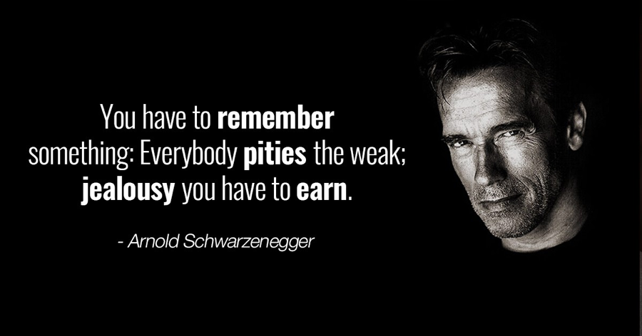

##10.Cómo Eliges Tú en el Mundo de Espejismo como una Persona Normal

A veces existen momentos que "deciden todo". Cuando empiezas a hacer negocios en el mercado bursátil y eliges el plan de inversión automática, simplemente has ganado de verdad. \-- A partir de ahora te encuentras en los momentos correctos en el mundo de espejismo. Tan simple como es. Cuando te decides a estudiar por tu propia cuenta, mientras empieces a prestar atención a los dichos tradicionales, ganas, ganas de una manera fácil. \-- A partir de ahora te encuentras en los momentos correctos en el mundo de espejismo. (Véase *[Estudiar por su priopia cuenta es un trabajo manual](https://github.com/selfteaching/the-craft-of-selfteaching)*)

Solía tener un misterio en muchos años pasados, que es por qué la mayoría de la gente ve distintas las razones útiles. El concepto de espejismo puede explicar este fenómeno curioso y insolucionable, pero no ofreció una solución sencilla, tajante e efectiva. Hasta un día,

experimenté lo misterioso de la inversión automática en el mercado bursátil, me di cuenta de una solución tan sencilla:

> Los que no tienen un gol grande, eligen siempre lo falso.

He tenido mucha suerte porque hace años, cuando no pude darme cuenta tan claramente como ahora, no creía tanto en el destino. Ha sido un primer paso. Este pensamiento te conlleva muchas ventajas de que años más tarde te diste cuenta.

Algunas razones no se entienden, no se pueden comprender profundamente sin vivirlas aunque estén disponibles. La gente las ignora o rechazan a reconocerlas. En el final de 2018 hizo un discurso famoso Arnold Schwarzenegger: la verdad de éxito.

> https://v.qq.com/x/page/c0818oag4pp.html

En el video decía: la razón por que he podido ponerme de pie aquí es única: 

> I have a gol. (Tengo un gol.)

No se sabe si ha sido deliberadamente o no, pero usó una palabra más sencilla que "Sueño" o "Ideal", "Gol". Para este gol, sólo podía romperse el culo para trabajar (work his butt off).

He visto varias veces este video, y cada vez siento algo distinto. \-- También gracias a este video, me parece que he podido contar mis ideas con claridad para confirmar una cosa a todo el mundo: con o sin un gol grande, te deja en dos extremos del mundo de espejismo.

Compartí una experiencia de mi infancia en "El Tiempo es un Amigo". Mi profesor una vez nos ordenó escribir una redacción titulado "mi sueño". El día siguiente no realicé mi tarea.

¿Por qué? No tengo sueño, ¿cómo voy a poder escribirlo?\... Le dije la verdad al profesor,

quien me consideró un alumno malo que fanfarroneaba en la clase. Él me dijo que vinieran mis padres a la escuela, que yo era un chico sin precedente.

Mi padre, por supuesto como todos los padres, vino a la oficina de mi profesor y escuchó tranquilamente lo que dijo en voz alta. Sin decir nada, mi padre sacó un cigarrillo a fumar hasta se volvió silencia la oficina. Dijo: "Sr. Chen, me gustaría saber qué es su sueño." Él empezó fumar de nuevo. Hasta terminar de fumar nadie dijo ni una palabra. Mi padre se volvió a mí y dijo: "Vámonos a casa."

Se puede imaginar que durante muchos años seguidos rechacé a pensar en mis sueños, y siempre me he considerado una persona sin ambición. Bueno, al volver a pensar en mis pasados, no creo que fuera una persona sin sueño, sino simplemente rechazaba los conceptos superfaciales.

Encima, he tenido bastante suerte. Aunque casi me engaña el sueño, un concepto que considero superfacial, he aprendido un método más sencillo, más directo y más útil sin darme cuenta:

> **Otorgar desesperadamente un gran sentido a lo que quieres hacer o estás haciendo**.

Años antes leí en un artículo por casualidad que A Bi Shumin, una de mis favoritos escritores le preguntaban una "ultrapregunta":

> Señora Bi, ¿cuál es el sentido de vida? 

Señora Bi Shumin contestaba:

> La vida no tiene sentido en sí misma. Se vive el sentido? (no son sus palabras concretas)

Nunca se le ocurrirá a ella que aquella oración suya se ha inscrito en la mente de un chico jóven en un rincón desconocido en la Tierra, y no se puede borrar.

**Me parece muy útil el método. Mientras otorgues un sentido tremendo a un comportamiento tuyo, de repente te convirtirás en otra persona** \-- con la causa que sigues haciendo, no te hace falta insistir o animarte, porque no tendrás miedo a la frustrucción, no te importará si los demás te apoya o si están de acuerdo contigo, en un caso extremo, tu le dejas de considerar un amigo tuyo quien te disuada. Esto se llama estar automotivado.

¿Sabéis por qué me gustan tanto escribir libros y hacer discursos? Porque tienen mucho sentido!

En el remoto pasado, por muy bueno que fuera un profesor, se caía en la trampa de orgullecimiento. En aquel entonces, era difícil encontrar un buen maestro, peor aún, es difícil

para un buen maestro encontrar un buen alumno \-- así que los maestros solían tener mucho cuidado al recrutar. Resulta que los llamados buenos alumnos que al principio se recrutaron con mucha afán eran verdaderamente mediocres después de años de confirmación, y confirmó enseguida que su propio orgullecimiento era irremediablemente chistoso\... Por supuesto, ahora puedes describir el fenómeno así: es porque son obligatoriamente dependente demasiado del poder de actividad fuera de la fontera activa \-- enseñar bien es dentro de la frontera mientras el crecimiento de un alumno esta fuera del control.

¿Sabéis por qué son fantásticos escribir artículos y libros e impartir clases? Cuán gran sentido tienen?

Si te das cuenta de que Señora Bi Shumin cambió sin querer la vida de un chico en un pueblo lejano \-- ella lo sabe? Ella no lo sabe. Le importa a ella? De hecho es importante, porque su conocimiento y su mente se convirtieron después de defusar en "gran amor" (big love) en un chico que se llama Li Xiaolai \-- ¡el amor sin diferenciar es real amor! Da igual si Señora Bi Shumin lo sabía (seguramente no lo supo), da igual si elle lo hizo a próposito (seguramente era sin propósito), da igual si le importaba (seguramente no le importaba), se convirtieron en el gran amor el conocimiento y la mente gracias a la defusión sin diferenciar.

Es lo máximo que un sabio pueda hacer para alejarse del orgullecimiento. Hacer que las cosas buenas sean de recursos abiertos es convertirlas en el gran amor sin diferencia \-- en mi opinión, ¡tiene un sentido indiscutiblemente grande! Uno puede imaginar, si fueras tu, te enfadarías con quién se atrevería disuadirte de hacer una cosa tan grande, ¿no?

Muchos años después, Li Xiaolai se hizo una persona que no le hizo falta el dinero. De jóven alardeaba que se jubilaría a los 40. A los 43 años estaba dispuesto a jubilarse \-- mientras tanto, se dio cuenta de que la jubilación es fundamentalmente un suicidio\... dado que nadie quiere ni puede suicidarse, que hace? Sigue haciendo lo que gusta a uno! ¿Qué es lo que te gusta hacer? Por supuesto lo que más gran sentido tiene! Para mi han sido escribir libros e impartir clases. Mucha gente no entiende por qué sigo escribiendo libros e impartiendo clases puesto que he ganado tanto dinero. Los críticos son más graciosos, creen que el hecho de que Li Xiaolai siga escribiendo e enseñando es que le faltaba dinero\... Mis años de experiencia me hicieron comprender que la gente en el otro extremo del espejismo seguirá oyendo y viendo lo contrario por mucho que me esfuerce en explicarselos \-- Por tanto, no me esfuerzo, seguir con mis cosas favoritas es mucho mejor.

**¿Qué sentido tiene ganar un montón de dinero? No es justamente para protegerte de las molestias cuando estás haciendo algo que te guste?**

Entonces, no es necesario usar palabras tan grandiosas como "sueño" o "ideal" (de jóven casi me engañan por sus apariencias brillantes, no me gusta esta palabra y la considero superfacial), pero tú puedes aplicar el método sencillo que inventé por casualidad y llevaba varios años practicándo para confirmar su eficacia inevitable:

> **Otorgar un gran sentido a lo que estás haciendo.**

De vuelta sabrás por qué te dije antes de nada que invirtir es la única manera fehaciente que una persona normal pueda escalarse del status social. Es lo que te ayudo en otorgar un grandisimo sentido en algo que debes hacer. Claro, puedes buscar el sentido que te pertenezca más grande para ti.

No se limita en eso, te voy contando en todas las perspectativas sus principios, sus papeles, sus connotaciones\... Más importante aún, se puede probar en todas las perspectivas que la inversión automática es definitivamente lo que cada uno debería hacer. Más importante aún, es cada uno podría hacer, porque es realístico, verdadero, correspondiente a tu alcance, que no hace falta pensar en porquerías.

Nunca es demasiado repetir:

> Para cada uno la inversión automática es absolutamente viable, no se engaña, y sólamente depende de ti mismo. Lo que aquí quiere decir "cada uno" es independientemente de la nacionalidad, la región, la raza, el sexo, la edad, la apariencia física, la orientación sexual\... lo más imperativo, independientemente de la inteligencia o la educación en absoluto!

De todos modos, me parece que **es feliz ser una persona ambiciosa.**