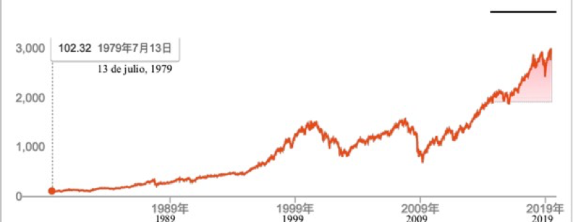

##13.La buena noticia más importante: para la gente común, el largo plazo no es para siempre

Al saber lo que dijo Buffett: \"Para mí, el **largo plazo** es **para siempre**\", una persona común de cualquier lado del mundo espejo, sentirá un poco de desesperación, aunque definitivamente no es por dudas sobre las palabras de Buffett, sino proviene de la pena o el dolor que casi todos tienen que enfrentar, como mencionado antes:

> "¿Por qué me lo enteré tan tarde?\" (o \"¡si lo supiera antes!\")

Particularmente, cuando sabemos que Buffett compró su primera acción cuando tenía 11 años, y a una edad temprana tuvo la oportunidad de preguntar a Benjamin Graham, el padre de la inversión de valores\...La comparación con otros es nuestro instinto humano, una vez que se inicia, cualquiera sentirá una desesperación enorme.

Pero éste no es el caso - una conclusión puede traer mucha liberación, pero necesito demostrártela lentamente.

Definitivamente hará que muchas personas comunes se sientan consoladas: 

> Cada generación gana más dinero que la generación anterior.

Y, no es un poco más, sino una diferencia en magnitud. Pero no se debe a la inflación como el bromeo de mucha gente.

La razón de este fenómeno es simple y clara, la sociedad humana se está desarrollando, la ciencia y la tecnología están avanzando y la escala de la economía está aumentando\...Es el dividendo de la época, y teóricamente es inclusivo, es decir, cada uno en cada generación debería tener acceso, o al menos tener la oportunidad de recibir el dividendo de su era.

En pocas palabras, cuando Buffett tenía 11 años, no existió en su mundo una compañía que alcanzó el nivel de billones. De hecho, es un hito espectacular en la historia de la economía humana cuando la capitalización de mercado de Apple superó un billón. Anteriormente, nunca hubo una empresa de diseño y producción de productos de consumo que pudiera vender sus productos a un nivel tan universal, y durara muchos años. En el nivel macro, es el resultado del continuo desarrollo de los comercios en la sociedad humana y la creciente escala económica.

Hay un techo de comprensión para todas las generaciones. Buffett luchó durante tanto tiempo antes de comprar las acciones de Apple. Es básicamente su límite de capacidad, sin mencionar bitcoin o blockchain. No puede entender Google, Netflix y Amazon conforme a su sistema teórico y los límites cognitivos. En teoría, cada generación tiene su límite, incluida la generación más joven actual. Con el tiempo, la exploración de sus propios límites de la iniciativa llegará al fin, no porque no quieran progresar, sino por otra motivación respaldada por la teoría económica: si no progresa más, todavía es suficiente. Por lo tanto, la exploración más profunda de límites será inevitablemente realizada por la próxima generación.

¿Por qué el desarrollo humano, incluido el desarrollo económico, no puede aumentar gradualmente y constantemente?¿por qué siempre aparecen los altibajos y fluctuaciones?

¿no puede ser tan estable como yo?

¿De dónde viene este tipo de fluctuaciones? Tal vez hayas conocido \"K-waves\", nunca he podido recordar su nombre completo, y para citarla, cada vez tengo que consultar Google o Wikipedia: \"**Kondratiev waves**\". El \"Maestro K\" fue el primer ruso en estudiar los ciclos largos. El llamado K-waves es un fenómeno del ciclo económico de aproximadamente 50 a 60 años. Generalmente, un ciclo largo se divide en dos fases, la fase A ascendente y la fase B descendente.

En la gráfica de arriba, se explica brevemente las tendencias económicas mundiales en el marco de la teoría de los ciclos largos.

El significado instructivo de la teoría de K-waves siempre no está claro en las prácticas y es difícil cuantificar académicamente, de modo que la comunidad académica no la valora mucho. Ahora es considerada la piedra angular teórica de la economía heterodoxa.

Sin embargo, esto no afecta los hechos simples que entendemos aquí:

>- Una sola subida, o una sola caída no se puede llamar una tendencia.
>- Una subida más una caída constituyen un ciclo.
>- Se necesitan al menos dos ciclos para juzgar la tendencia\...

Después de dos ciclos, las dos fluctuaciones pueden formar una de las tres tendencias: al alza, lateral o a la baja.

Y cuando observamos la tendencia del precio del índice bursátil mundial en las últimas cuatro décadas, veremos que la tendencia general al alza formada de muchos ciclos ascendentes y descendentes.

La tendencia de los precios de bitcoin, o la tendencia de los precios de la capitalización bursátil total de los activos digitales de blockchain, es igualmente una tendencia al alza que está conectada por una serie de ciclos ascendentes y descendentes.

Entonces, ¿por qué gastaron tanto tiempo(un ciclo) para recuperar la Gran Depresión de Estados Unidos de la década 1930, y la reparación de la crisis financiera asiática en la década de 1990 tomó sólo unos pocos años? Y en este siglo, ¿por qué se repara aún más rápido la recesión económica mundial provocada por la crisis de las hipotecas de alto riesgo en EE.UU.?

La razón es tan simple y directa que cualquiera puede entender:

> El flujo de información a alta velocidad hace que la colaboración global sea más coherente y más fácil, por lo que aunque la crisis continuará ocurriendo, la velocidad de reparación se está acelerando.

Por otro lado, la formación del ciclo económico se debe esencialmente a la colaboración multiparte que vacila de vez en cuando entre la concordancia y la discordancia. \*\*A medida que la comunicación entre múltiples partes, me refiero a muchísimas partes, hasta que los nodos no saben la existencia de otros nodos, es cada vez más eficiente, la duración del ciclo se vuelve cada vez más corto, aunque tal vez nunca pueden eliminarse las fluctuaciones, en otras palabras, las discordancias ocasionales.

Esto es también el motivo principal por el cual el ciclo de fluctuación de los activos digitales de blockchain es relativamente más corto. En los últimos ocho años, siempre me encuentro con las personas que toman el ciclo de reducción de la extracción(mining) de bitcoin a la mitad, es decir, cada cuatro años, como un fundamento para determinar el ciclo. Tal vez tienen cierta razón al principio, pero este juicio está perdiendo gradualmente su significado cuando la capitalización bursátil de bitcoin ya deja de ser la capitalización de mercado total de los activos digitales de blockchain.

En mi opinión, el ciclo de fluctuación de los activos digitales de blockchain es generalmente más corto, y será aún más corto en el futuro, que el ciclo de la bolsa de valores. Y la razón principal es que obviamente el mercado de transacción de blockchain tiene mayor eficiencia de coordinación de múltiples partes. Pues son muy pocas las bolsas de valores influyentes en el planeta, pero si echas un vistazo a coinmarketcap.com, sabrás que hay miles de mercados con incesantes transacciones por las 24 horas del día, y los 365 días del año. Así que naturalmente su eficiencia de la coordinación es mucho mejor que la del mercado bursátil tradicional.

El ciclo se está reduciendo, y ¿qué importa tiene esta conclusión simple y confiable para la gente común? En pocas palabras es:

> El llamado \"para siempre\" se está acortando. 

Entonces, ¿será todavía demasiado largo el plazo?

El largo plazo, a mi juicio, es \"**al menos dos ciclos largos**\" para la gente común. Y si puedes pasar tres ciclos, es básicamente equivalente al \"para siempre\" de Buffett\...pero

¿cuánto duran los dos ciclos? Actualmente, el ciclo de fluctuación del valor de mercado de los activos digitales de blockchain es de aproximadamente tres a cinco años, por lo tanto, es muy probable que los dos ciclos concluyen en alrededor de siete años. Ten en cuenta que la clave es **dos ciclos** largos en vez de siete años.

¿Cómo se juzga un ciclo? Brevemente, vas a buscar la cima más reciente, y la consideras como el punto de partida de la fase B(la fase descendente) del actual ciclo, hasta la siguiente punto más alto, desde donde aparece una caída. Eso significa que ya se ha completado la fase A(la fase ascendente) tras la fase B, y se ingresa al próximo ciclo\...y así sucesivamente.

Cabe señalar que para cualquiera, sólo se puede conocer el punto de partida de la fase B de tal ciclo grande, porque ese es la cima conocida más cercana. Respecto a ¿cuándo es el fin de la fase B y al mismo tiempo, el inicio de la fase A, y ¿cuándo termina la fase A? Es imposible e inútil juzgarlo por el momento, ya que es sólo un ciclo. Después de dos ciclos, lo sabrás naturalmente.

Entonces, podrás hacer comoquiera, por ejemplo, continuar la tenencia, retirar todo en efectivo, retirar una parte, o continuar manteniendo una parte\...Puede que no te imagines cómo serás en el futuro, pero, con mi experiencia, te digo que el mayor cambio que pasará

en ti será exactamente el mismo para todos los que realmente lo cumplen: 

> Estarás tranquilo y calmado como nunca antes.

¿Cuánto dura el largo plazo para la gente común? Ya te dije, por lo menos dos ciclos grandes. Es precisamente la razón por la que finalmente elegimos aplicar la inversión regular en los activos digitales de blockchain como [BOX](https://b.watch/), porque aquí los dos ciclos son realmente cortos, especialmente en el futuro cercano, después de que cumplas los dos ciclos. Mirando hacia atrás, entenderás completamente lo que digo ahora.

No te preocupes, porque el llamado largo plazo en realidad no es tan largo.