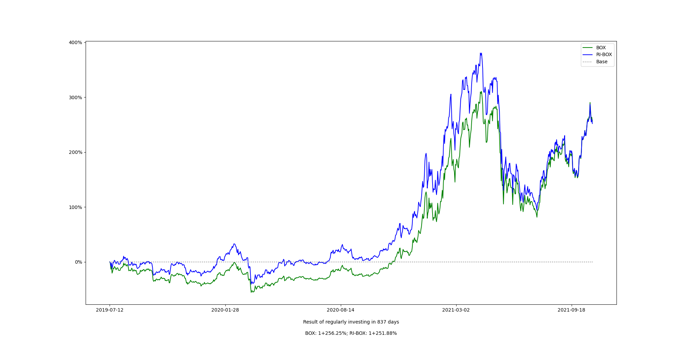

# BOX 历史价格变化

```box_price_history.txt``` 是 csv 格式的文本文件，每日北京时间晚 23:58 更新一次，BTC、EOS、XIN 的价格从 Coinmarketcap 抓取获得。

更新数据之后，图片 ```box-historical-price-change.png``` 亦会同步更新



如果你本地安装了 Jupyter-lab，那么，可以在本地运行 ```visualization.ipynb``` 生成最新图表。

本仓库 ```data``` 目录中的每日自动更新是我自己一个 linode 上的 crontab：

``` bash
58 15 * * * cd /root/regular-investing-in-box && git pull && /root/anaconda3/bin/python /root/regular-investing-in-box/data/boxhistoricalprice.py && git add . && git commit -am "box historical price file auto-updated" && git push -u origin master && git pull && /root/anaconda3/bin/python /root/regular-investing-in-box/data/visualization.py && git add . && git commit -am "box historical price figure re-generated" && git push -u origin master
```


View visualization.py on gogole colab:
> https://colab.research.google.com/drive/19fmIYzWM2E2VgtSApiIzT8cr1mTH2szR
