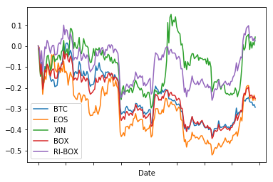
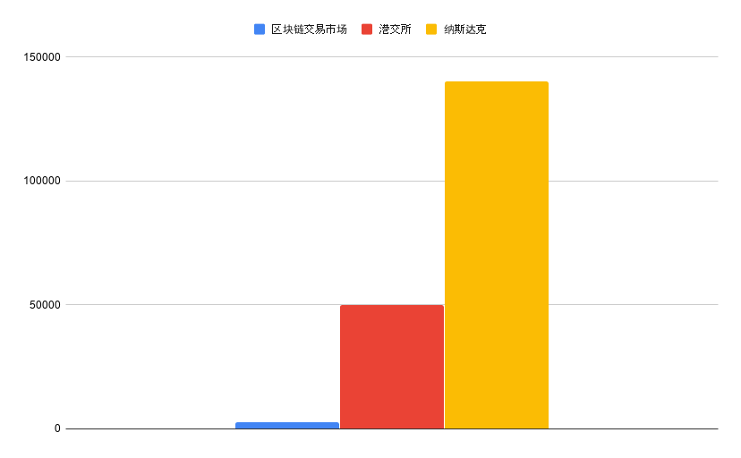
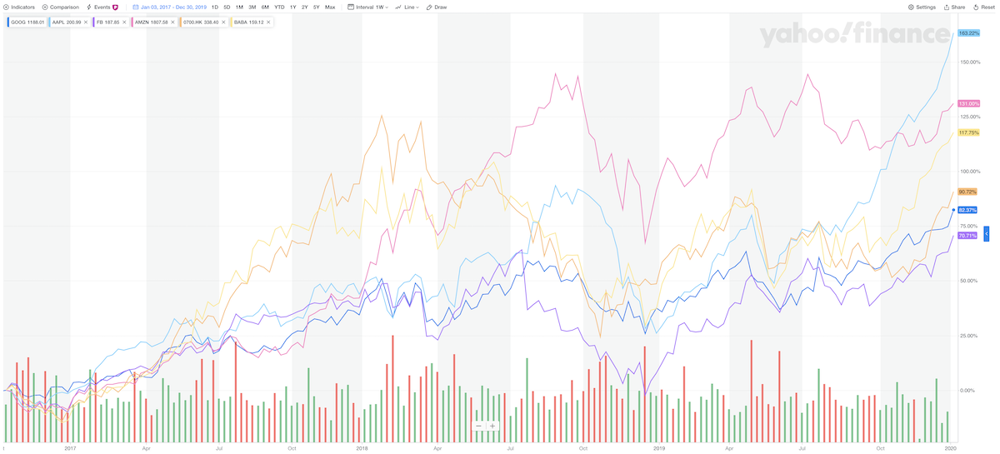

# 博客

## 2020.02.15 中英两个版本的 epub 已可下载

> * [定投改变命运（第三版）epub](https://github.com/xiaolai/regular-investing-in-box/raw/master/docs/epub/OnRegularInvesting_cn.epub)
> * [On Regular Investing epub](https://github.com/xiaolai/regular-investing-in-box/raw/master/docs/epub/OnRegularInvesting_en.epub)

另，次日新增 mobi 下载，请查看顶部下拉菜单。

## 2020.01.26 BOX 历史价格自动更新

我在 github 仓库里，添加了一个 ```data``` 目录，里面的 BOX 历史价格文件会每日 23:59 更新一次价格。

而后，可以使用这个文件去用 Python 制作价格变动图表，代码如下：


```python
import matplotlib.pyplot as plt
import pandas as pd
from re import sub

series = pd.read_csv(
    "https://raw.githubusercontent.com/xiaolai/regular-investing-in-box/master/data/box_price_history.txt",
    sep="\t"
)

number_of_rows = series.shape[0]

daily_invested = 1

# add column "Total Invested"
total_invested = []
for i in range(0, number_of_rows):
    total_invested.append((i+1)*daily_invested)
series["Total Invested"] = total_invested

# add column "Daily Bought"
BOX_daily_bought = []
for i in range(0, number_of_rows):
    BOX_daily_bought.append(daily_invested/float(sub(r"[^\d.]", "", series.at[i, "BOX Price"])))

series["BOX Bought"] = BOX_daily_bought

# add column "Value Accumulated"
value_accumulated = []
for i in range(0, number_of_rows):
    holding = 0
    for j in range(0, i+1):
        holding += series.at[j, "BOX Bought"]
    value_accumulated.append(holding * float(sub(r"[^\d.]", "", series.at[i, "BOX Price"])))
series["Value Accumulated"] = value_accumulated    


# add BTC price change
btc_price_change = []
eos_price_change = []
xin_price_change = []
box_price_change = []
ri_box_change = []
for i in range(0, number_of_rows):
    btc_price_change.append(float(sub(r"[^\d.]", "", series.at[i, "BTC Price"]))/float(sub(r"[^\d.]", "", series.at[0, "BTC Price"])) - 1)
    eos_price_change.append(float(sub(r"[^\d.]", "", series.at[i, "EOS Price"]))/float(sub(r"[^\d.]", "", series.at[0, "EOS Price"])) - 1)
    xin_price_change.append(float(sub(r"[^\d.]", "", series.at[i, "XIN Price"]))/float(sub(r"[^\d.]", "", series.at[0, "XIN Price"])) - 1)
    box_price_change.append(float(sub(r"[^\d.]", "", series.at[i, "BOX Price"]))/float(sub(r"[^\d.]", "", series.at[0, "BOX Price"])) - 1)    
    ri_box_change.append(series.at[i, "Value Accumulated"]/series.at[i, "Total Invested"] - 1)
series["BTC"] = btc_price_change
series["EOS"] = eos_price_change
series["XIN"] = xin_price_change
series["BOX"] = box_price_change
series["RI-BOX"] = ri_box_change

# print(series)

ax = plt.gca()
series.plot(kind='line', x='Date', y='BTC', ax=ax)
series.plot(kind='line', x='Date', y='EOS', ax=ax)
series.plot(kind='line', x='Date', y='XIN', ax=ax)
series.plot(kind='line', x='Date', y='BOX', ax=ax)
series.plot(kind='line', x='Date', y='RI-BOX', ax=ax)
plt.show()
```



## 2020.01.24 多年前的一篇短文

我曾经用过 xiaolai.li 这个域名，后来不用了。现在，这篇文章只能在 [archive.org](https://web.archive.org/web/20140523062542/xiaolai.li/bitcoin-period) 上看到了。

**Bitcoin Period**

**What is bitcoin?**
> Money.

**Is it a scam?**
> No.

**Can I have some coins?**
> Yes.

**What is the best way to get some coins?**
> Buy.

**Is there any way to have coins other than buying?**
> Mine.

**Is it safe?**
> Depends.

**What can I buy with bitcoin?**
> Anything.

**I once heard of it, but couldn’t get it, what should I do?**
> Learn.

**Is it too expensive now?**
> No.

**Is it too late now?**
> Never.

**Should I buy bitcoin as an investment?**
> Don’t.

**What is the best move after getting some coins?**
> Hold.

**The price is too high, should I sell them all?**
> No.

**The price is dropping too fast, what should I do?**
> Nothing.

**How much will the price of bitcoin go up to?**
> Higher.

**People are asking questions, I cannot explain, what should I do?**
> Try.

**… but how?**
> Harder.

**Are you crazy?**
> Maybe.

## 2020.01.22 区块链市场前景

比特币作为世界上第一个应用，并没有像最初很多人以为的那样，“颠覆主权货币” —— 顶多，是地球上多了一个社区货币而已。

然而，区块链交易市场却实实在在地在颠覆传统证券交易市场。



当前区块链交易市场内总市值只有 2500 亿美元左右，港交所的总市值大约为 5 万亿美元，而纳斯达克的总市值大约为 14 万亿美元。

哪怕是区块链交易市场总市值隔天马上翻上 20 倍，也才追上港交所；要隔天翻上 56 倍才可能赶上纳斯达克…… 可传统正确交易市场也不是静止不动的，也在发展…… 等有一天，区块链交易市场市值规模真的追上的时候呢？

也就是说，如此粗略估算，区块链交易市场市值规模也至少有 50 ～ 100 的空间……

看起来很像是胡说八道呢！

## 2020.01.12 GAFATA 近三年表现

2017 年 1 月 1 日，在《通往财富自由》专栏之中，我向读者们介绍了 GAFATA 这个投资组合。

时间真快，转眼三年过去 —— 三年时间说长不长，说短不短，但，在交易市场里，时间就是能够积聚力量的……



> [点击这里查看实时图表](https://finance.yahoo.com/chart/GOOG#eyJpbnRlcnZhbCI6IndlZWsiLCJwZXJpb2RpY2l0eSI6MSwiY2FuZGxlV2lkdGgiOjE0LjI0MDUwNjMyOTExMzkyNCwidm9sdW1lVW5kZXJsYXkiOnRydWUsImFkaiI6dHJ1ZSwiY3Jvc3NoYWlyIjp0cnVlLCJjaGFydFR5cGUiOiJsaW5lIiwiZXh0ZW5kZWQiOmZhbHNlLCJtYXJrZXRTZXNzaW9ucyI6e30sImFnZ3JlZ2F0aW9uVHlwZSI6Im9obGMiLCJjaGFydFNjYWxlIjoibGluZWFyIiwicGFuZWxzIjp7ImNoYXJ0Ijp7InBlcmNlbnQiOjEsImRpc3BsYXkiOiJHT09HIiwiY2hhcnROYW1lIjoiY2hhcnQiLCJ0b3AiOjB9fSwibGluZVdpZHRoIjoyLCJzdHJpcGVkQmFja2dyb3VkIjp0cnVlLCJldmVudHMiOnRydWUsImNvbG9yIjoiIzAwODFmMiIsImV2ZW50TWFwIjp7ImNvcnBvcmF0ZSI6eyJkaXZzIjp0cnVlLCJzcGxpdHMiOnRydWV9LCJzaWdEZXYiOnt9fSwiY3VzdG9tUmFuZ2UiOnsic3RhcnQiOjE0ODMzNzI4MDAwMDAsImVuZCI6MTU3NzYzNTIwMDAwMH0sInN5bWJvbHMiOlt7InN5bWJvbCI6IkdPT0ciLCJzeW1ib2xPYmplY3QiOnsic3ltYm9sIjoiR09PRyJ9LCJwZXJpb2RpY2l0eSI6MSwiaW50ZXJ2YWwiOiJ3ZWVrIn0seyJzeW1ib2wiOiJBQVBMIiwic3ltYm9sT2JqZWN0Ijp7InN5bWJvbCI6IkFBUEwifSwicGVyaW9kaWNpdHkiOjEsImludGVydmFsIjoid2VlayIsImlkIjoiQUFQTCIsInBhcmFtZXRlcnMiOnsiY29sb3IiOiIjNzJkM2ZmIiwid2lkdGgiOjIsImlzQ29tcGFyaXNvbiI6dHJ1ZSwiY2hhcnROYW1lIjoiY2hhcnQiLCJzeW1ib2xPYmplY3QiOnsic3ltYm9sIjoiQUFQTCJ9LCJwYW5lbCI6ImNoYXJ0IiwiYWN0aW9uIjoiYWRkLXNlcmllcyIsInNoYXJlWUF4aXMiOnRydWUsInN5bWJvbCI6IkFBUEwiLCJnYXBEaXNwbGF5U3R5bGUiOiJ0cmFuc3BhcmVudCIsIm5hbWUiOiJLNUFCS0ZEU0dXIiwib3ZlckNoYXJ0Ijp0cnVlLCJ1c2VDaGFydExlZ2VuZCI6dHJ1ZSwiaGVpZ2h0UGVyY2VudGFnZSI6MC43LCJvcGFjaXR5IjoxLCJoaWdobGlnaHRhYmxlIjp0cnVlLCJ0eXBlIjoibGluZSIsInN0eWxlIjoic3R4X2xpbmVfY2hhcnQifX0seyJzeW1ib2wiOiJGQiIsInN5bWJvbE9iamVjdCI6eyJzeW1ib2wiOiJGQiJ9LCJwZXJpb2RpY2l0eSI6MSwiaW50ZXJ2YWwiOiJ3ZWVrIiwiaWQiOiJGQiIsInBhcmFtZXRlcnMiOnsiY29sb3IiOiIjYWQ2ZWZmIiwid2lkdGgiOjIsImlzQ29tcGFyaXNvbiI6dHJ1ZSwiY2hhcnROYW1lIjoiY2hhcnQiLCJzeW1ib2xPYmplY3QiOnsic3ltYm9sIjoiRkIifSwicGFuZWwiOiJjaGFydCIsImFjdGlvbiI6ImFkZC1zZXJpZXMiLCJzaGFyZVlBeGlzIjp0cnVlLCJzeW1ib2wiOiJGQiIsImdhcERpc3BsYXlTdHlsZSI6InRyYW5zcGFyZW50IiwibmFtZSI6Iks1QUJLTjRRSk8iLCJvdmVyQ2hhcnQiOnRydWUsInVzZUNoYXJ0TGVnZW5kIjp0cnVlLCJoZWlnaHRQZXJjZW50YWdlIjowLjcsIm9wYWNpdHkiOjEsImhpZ2hsaWdodGFibGUiOnRydWUsInR5cGUiOiJsaW5lIiwic3R5bGUiOiJzdHhfbGluZV9jaGFydCJ9fSx7InN5bWJvbCI6IkFNWk4iLCJzeW1ib2xPYmplY3QiOnsic3ltYm9sIjoiQU1aTiJ9LCJwZXJpb2RpY2l0eSI6MSwiaW50ZXJ2YWwiOiJ3ZWVrIiwiaWQiOiJBTVpOIiwicGFyYW1ldGVycyI6eyJjb2xvciI6IiNmZjgwYzUiLCJ3aWR0aCI6MiwiaXNDb21wYXJpc29uIjp0cnVlLCJjaGFydE5hbWUiOiJjaGFydCIsInN5bWJvbE9iamVjdCI6eyJzeW1ib2wiOiJBTVpOIn0sInBhbmVsIjoiY2hhcnQiLCJhY3Rpb24iOiJhZGQtc2VyaWVzIiwic2hhcmVZQXhpcyI6dHJ1ZSwic3ltYm9sIjoiQU1aTiIsImdhcERpc3BsYXlTdHlsZSI6InRyYW5zcGFyZW50IiwibmFtZSI6Iks1QUJLVjFPNDAiLCJvdmVyQ2hhcnQiOnRydWUsInVzZUNoYXJ0TGVnZW5kIjp0cnVlLCJoZWlnaHRQZXJjZW50YWdlIjowLjcsIm9wYWNpdHkiOjEsImhpZ2hsaWdodGFibGUiOnRydWUsInR5cGUiOiJsaW5lIiwic3R5bGUiOiJzdHhfbGluZV9jaGFydCJ9fSx7InN5bWJvbCI6IjA3MDAuSEsiLCJzeW1ib2xPYmplY3QiOnsic3ltYm9sIjoiMDcwMC5ISyJ9LCJwZXJpb2RpY2l0eSI6MSwiaW50ZXJ2YWwiOiJ3ZWVrIiwiaWQiOiIwNzAwLkhLIiwicGFyYW1ldGVycyI6eyJjb2xvciI6IiNmZmJkNzQiLCJ3aWR0aCI6MiwiaXNDb21wYXJpc29uIjp0cnVlLCJjaGFydE5hbWUiOiJjaGFydCIsInN5bWJvbE9iamVjdCI6eyJzeW1ib2wiOiIwNzAwLkhLIn0sInBhbmVsIjoiY2hhcnQiLCJhY3Rpb24iOiJhZGQtc2VyaWVzIiwic2hhcmVZQXhpcyI6dHJ1ZSwic3ltYm9sIjoiMDcwMC5ISyIsImdhcERpc3BsYXlTdHlsZSI6InRyYW5zcGFyZW50IiwibmFtZSI6Iks1QUJMNDBGMkMiLCJvdmVyQ2hhcnQiOnRydWUsInVzZUNoYXJ0TGVnZW5kIjp0cnVlLCJoZWlnaHRQZXJjZW50YWdlIjowLjcsIm9wYWNpdHkiOjEsImhpZ2hsaWdodGFibGUiOnRydWUsInR5cGUiOiJsaW5lIiwic3R5bGUiOiJzdHhfbGluZV9jaGFydCJ9fSx7InN5bWJvbCI6IkJBQkEiLCJzeW1ib2xPYmplY3QiOnsic3ltYm9sIjoiQkFCQSJ9LCJwZXJpb2RpY2l0eSI6MSwiaW50ZXJ2YWwiOiJ3ZWVrIiwiaWQiOiJCQUJBIiwicGFyYW1ldGVycyI6eyJjb2xvciI6IiNmZmU3ODYiLCJ3aWR0aCI6MiwiaXNDb21wYXJpc29uIjp0cnVlLCJjaGFydE5hbWUiOiJjaGFydCIsInN5bWJvbE9iamVjdCI6eyJzeW1ib2wiOiJCQUJBIn0sInBhbmVsIjoiY2hhcnQiLCJhY3Rpb24iOiJhZGQtc2VyaWVzIiwic2hhcmVZQXhpcyI6dHJ1ZSwic3ltYm9sIjoiQkFCQSIsImdhcERpc3BsYXlTdHlsZSI6InRyYW5zcGFyZW50IiwibmFtZSI6Iks1QUJMQktKNEQiLCJvdmVyQ2hhcnQiOnRydWUsInVzZUNoYXJ0TGVnZW5kIjp0cnVlLCJoZWlnaHRQZXJjZW50YWdlIjowLjcsIm9wYWNpdHkiOjEsImhpZ2hsaWdodGFibGUiOnRydWUsInR5cGUiOiJsaW5lIiwic3R5bGUiOiJzdHhfbGluZV9jaGFydCJ9fV0sInN0dWRpZXMiOnsidm9sIHVuZHIiOnsidHlwZSI6InZvbCB1bmRyIiwiaW5wdXRzIjp7ImlkIjoidm9sIHVuZHIiLCJkaXNwbGF5Ijoidm9sIHVuZHIifSwib3V0cHV0cyI6eyJVcCBWb2x1bWUiOiIjMDBiMDYxIiwiRG93biBWb2x1bWUiOiIjRkYzMzNBIn0sInBhbmVsIjoiY2hhcnQiLCJwYXJhbWV0ZXJzIjp7IndpZHRoRmFjdG9yIjowLjQ1LCJjaGFydE5hbWUiOiJjaGFydCJ9fX0sInJhbmdlIjp7ImR0TGVmdCI6IjIwMTYtMTItMzFUMTY6MDA6MDAuMDAwWiIsImR0UmlnaHQiOiIyMDIwLTAxLTEyVDAxOjA3OjUyLjQ2M1oiLCJwZXJpb2RpY2l0eSI6eyJpbnRlcnZhbCI6IndlZWsiLCJwZXJpb2QiOjF9LCJwYWRkaW5nIjowfX0=)

当年写《通往财富自由》专栏的时候，很多傻逼说，这个专栏是割韭菜的，是收智商税的什么的…… 傻逼就是傻逼，没救。

现在三年过去了，专栏读者中照做的人有了一倍以上的收益 —— 三年一倍以上，那就是至少 26% 的复合年化回报率 —— 这可是优于沃伦·巴菲特的成绩。

傻逼们呢？傻逼们的普遍特征就是，一天过去，他还那个样子，一个月过去，他还是那个样子，一年过去，他还是那个样子，三年过去呢？他还是那个样子…… 只不过，有个他不知道的东西，叫做通货膨胀，把他变得更傻了，他却不知道而已……

**行动才能发生改变**，这是不变的真理。


## 2020.01.04 九十年前的一篇文章

大约 90 年前，有一位先知，[John Jacob Raskob](https://en.wikipedia.org/wiki/John_J._Raskob) 倡议美国民众可以每月投资股市 15 美元（那时候，美国人的周薪平均约为 17～22 美元）…… 这是目前有据可查的最早的 “定投策略”…… 

谁曾想，1929 年 8 月份，Raskob 的文章《Everyone Ought to Be Rich》发表后不到 7 周，美国历史上最惨烈的股市崩盘事件发生了…… 民众当然并不会深入理解 Raskob 的意图，于是，此后的近百年时间里，Raskob 一直背负着骂名……

可实际上 Raskob 并没有错…… 一点儿都没有错。

今天我们再研读 Raskob 当年的文章，会有另外一番滋味。

> Everyone Ought to Be Rich
>
> > * [Text Edition](/blog/Everybody-Ought-to-Be-Rich-1929-by-John-Raskob/)
> > * [Download PDF](https://onregularinvesting.com/blog/Everybody-Ought-to-Be-Rich-1929-by-John-Raskob/EverybodyOughtToBeRich.pdf)


## 2020.01.02 增加本书 PDF 版本下载

> * [定投改变命运（第三版）PDF](https://onregularinvesting.com/pdf/on-regularinvesting-cn.pdf)
> * [On Regular Investing（3rd/ed）PDF](https://onregularinvesting.com/pdf/on-regularinvesting-en.pdf)

## 2019.12.29 重要投资书籍列表（持续更新）

| 书名                                                         | 英文版购买链接                                               | 中文版购买链接                            |
| ------------------------------------------------------------ | ------------------------------------------------------------ | ----------------------------------------- |
| The Most Important Thing: Uncommon Sense for The Thoughtful Investor by [Howard Marks](https://www.amazon.com/Howard-Marks/e/B004LE5B00/ref=dp_byline_cont_all_1)<br />《投资最重要的事》 | [kindle + audiobook](https://www.amazon.com/Most-Important-Thing-Uncommon-Thoughtful/dp/B0090VTBGO/) | [京东](https://item.jd.com/12558042.html) |
|Stocks for the Long Run 5/E: The Definitive Guide to Financial Market Returns & Long-Term Investment Strategies by [Jeremy J. Siegel](https://www.amazon.com/Jeremy-J-Siegel/e/B000AR9N42/ref=dp_byline_cont_ebooks_1)|[Kindle + audiobook](https://www.amazon.com/dp/B00GWSXX26/)||
| The Behavioral Investor by [Daniel Crosby](https://www.amazon.com/Daniel-Crosby/e/B00O72MW1W/ref=dp_byline_cont_all_1) | [kindle + audiobook](https://www.amazon.com/The-Behavioral-Investor/dp/B07T69W543/) |                                           |
| The Laws of Wealth: Psychology and the Secret to Investing Success by [Daniel Crosby](https://www.amazon.com/Daniel-Crosby/e/B00O72MW1W/ref=dp_byline_cont_all_1) | [kindle + audiobook](https://www.amazon.com/Laws-Wealth-Psychology-Investing-Success/) |                                           |
| Thinking, Fast and Slow by [Daniel Kahneman](https://www.amazon.com/Daniel-Kahneman/e/B001ILFNQG/ref=dp_byline_cont_all_1)<br />《思考：快与慢》 | [kindle + audiobook](https://www.amazon.com/Thinking-Fast-and-Slow/dp/B005Z9GAJG/) | [京东](https://item.jd.com/11029168.html) |
| Principles: Life and Work by Ray Dalio<br />《原则》 | [kindle + audiobook](https://www.amazon.com/Simon-Schuster-Audio-Principles-Life/dp/B074B2CZJG/) | [京东](https://item.jd.com/12257413.html) |
| The Little Book that Still Beats the Market by [Joel Greenblatt](https://www.amazon.com/Joel-Greenblatt/e/B000APHNTQ/ref=dp_byline_cont_all_1) | [kindle + audiobook](https://www.amazon.com/Little-Book-Still-Beats-Market/dp/B00435KR9C/) | [京东](https://item.jd.com/63819136479.html) |
| Warren Buffett and the Interpretation of Financial Statements by [Mary Buffett](https://www.amazon.com/Mary-Buffett/e/B004MUG92W/ref=dp_byline_cont_book_1)<br />《巴菲特教你读财报》 | [kindle+ audiobook](https://www.amazon.com/Warren-Buffett-Interpretation-Financial-Statements/dp/1849833192/) | [京东](https://item.jd.com/11732393.html) |
| Fooled by Randomness: The Hidden Role of Chance in Life and in the Markets by [Nassim Nicholas Taleb](https://www.amazon.com/Nassim-Nicholas-Taleb/e/B000APVZ7W/ref=dp_byline_cont_all_1)<br />《随机漫步的傻瓜》 | [kindle + audiobook](https://www.amazon.com/Fooled-Randomness-Hidden-Chance-Markets/dp/B0012IZFRW/) | [京东](https://item.jd.com/57536995960.html) |
| Predictably Irrational: The Hidden Forces That Shape Our Decisions by [Dan Ariely](https://www.amazon.com/Dan-Ariely/e/B001J93B34/ref=dp_byline_cont_all_1)<br />《怪诞经济学》 | [kindle + audiobook](https://www.amazon.com/Predictably-Irrational-Hidden-Forces-Decisions/dp/B0014EAHNQ/) | [京东](https://item.jd.com/12284718.html) |


-----

## 2019.12.27: 《让时间陪你慢慢变富 —— 定投改变命运》印刷版开启预售

我是 2019 年 7 月 12 日写完这本书的第一版的，随后根据国内的出版部门相关规定，略作删减，完成了第二版 —— 就是现在正在预售的印刷版。


这本书本质上是开源的，第一版的完整内容在这里：

> https://github.com/xiaolai/regular-investing-in-box

甚至有 “有声版”：

> https://github.com/xiaolai/regular-investing-in-box/tree/master/audiobook

出版发行的“第二版”，完整内容在这里：

> https://github.com/xiaolai/regular-investing-in-box/blob/master/new-edition-for-publishing.md

写完第一版之后，我在践行群里向群成员继续阐述定投原理，以及定投策略采用者将会面临的种种问题…… 到了 2019 年国庆节的时候，和之前我自己所有的节假日一样，我把自己关在一个房间里，完成了此书的第三版。

与过往略微不同的是，这一次的第三版，我干脆中英文平行创作了 —— 反正有好朋友王渊源帮助，咱啥也不怕哈。过去的一个月里，王渊源同学在修订第三版英文版的同时，在践行群里发布了“有声版的初次版本”（因为王渊源同学也会像我一样，反复修订）。

第三版的《定投改变命运》，可通过以下网址查看：

> https://onregularinvesting.com

这个网站的它的源文件在这里：

> https://github.com/xiaolai/regular-investing-in-box/tree/master/docs

这本开源书籍的 github 仓库，迄今为止，大约有 3.4k Stars，有 1.3k Forks。

可能有人会问，明明是开源的书，我为什么要买纸质版呢？

首先呢，李笑来写的书，大部分都是开源的，除非合作出版方有所顾忌 —— 我有时也要照顾合作方的心理。

关键在于，纸质版的书，是很好很好的礼物 —— 你真的关心谁，你就送李笑来的书给他，因为那些书会改变读者的命运，以史为鉴。

把李笑来的书送给对方，还有另外一个好处 —— 它会自动帮你判断对方对你的重视程度…… 那么好的内容送到对方手里，结果几天过去，不见对方提及，终归是非常说明问题的，至于能够说明什么，自己仔细想想就知道了。

过往的许多年里，李笑来的书籍，很可能是国内 “被动销量” 最高的书籍之一。不看的人直接不看，看的人看过之后，不仅会再买一本收藏，并且还会买很多本，送给家属、送给亲戚、送给同事、送给朋友、送给下属…… 我自己见过无数次有老师自己掏钱给全班同学买，也见过无数次有领导掏钱给全公司的人买。

老李卖书，自卖自夸 —— 可以收进现代汉语词典了罢？哈哈。

下图是朋友圈晒图专用图片，识别二维码可以直接到达当当购物小程序：


希望知识真的可以改变你的命运……

也希望支持我的朋友们，都在朋友圈发一遍最后这张专用图哈哈哈，感谢！