<h1 style="text-align: center;">On Regular Investing</h1>

 by <em>Xiaolai Li</em>, rewritten in English by <em>John Gordon</em> & <em>Xiaolai Li</em> &copy;2019

    

## Warning

While the financial trading markets are no doubt the best to make money through critical thinking and the application of knowledge, there’s also no other place where people are more severely punished for a lack of critical thinking.

> Investing is risky, so make your decisions carefully!

As [Howard Stanley Marks](https://en.wikipedia.org/wiki/Howard_Marks_(investor)), who was listed as the 327th wealthiest person in the United States in 2017, once said:

> “There are *old* investors, and there are *bold* investors, but there are no *old bold* investors.”

Don’t be so naïve as to believe that you can turn into a superman just because you learned something new yesterday. Translating knowledge into meaningful action takes much more time than you’ve ever imagined. Relax, take it easy, and don’t rush. You can lift a very heavy weight, but without proper training you can hurt yourself.

## Preface

It’s been ten years since I published [*Befriending Time*](https://item.jd.com/34924669813.html), and it’s still a bestseller. While I was writing the book, I tried to adhere to the following principle:

>*Will this book still be useful to readers in ten years?*

In addition to being bestsellers, my books are often perennial sellers. Here are my secrets for writing a book that continues to sell well over time: **simple**, **direct**, **brutal** and **effective**.

Because I have been writing in this simple, direct, brutal and effective way for so long, I have a deep understanding of the following fact: 

> Solving the single most important problem can directly avoid the problems that so many others face.

Actually, most problems in life are due to failing to resolve the most important problem right from the start. If you can handle the most important problem in the beginning, then even though there will still be many other difficulties, they won’t be the eternal problems that so many people face.

When facing the few truly essential decisions in life, many people also ignore the most important problem. For instance, when choosing whom to marry, “Is she or he reasonable?” is always outside the scope of consideration, even though it is the single most important factor. Instead, they focus on appearance, education, background, etc., without considering which factor will be the most important in the future. Of course, maybe this is because they themselves aren’t a reasonable person (yes, it’s true, most people aren’t very reasonable, and they stay this way throughout their lives). 

Because they haven’t eradicated the most important problem, it sprouts like a seed, growing both a tree above ground and a deep root structure below, creating countless new problems. And so we see the same situation again and again: people surround the “problem tree” above ground, wasting lots of time and energy trying to find ways to solve perceived problems that wouldn't have existed at all if they made the right decision a long time ago. They don't even notice that the real problem is in the roots of the tree.

Another common yet surprising example can be found in most people’s perception of “success”. *Most people see success as an end point* , and this misunderstanding leads to countless new problems that could have been avoided if this one mistake had been avoided in the beginning. Success is hard to achieve if we see it as an end point, because we will imbue such a final goal with so many unrealistic hopes and fantasies that we will be unlikely to reach it. Even if some who take success as an end point are lucky enough to reach it, the process will make them abnormal. The craziness that follows success, and the result of that craziness, is actually the result of the mistaken belief from years before that success is an end point. 

In fact, success is a new beginning. If you start a business, this is a beginning rather than an end. Each time your business raises money from venture capital, that is also a new beginning. Even if you go public, that’s still a new beginning rather than an end point, because you have to continue to help the company grow. In fact, the most tragic failures in life always come from perceiving a new beginning as an end point. 

Investment is also one of these few essential decisions in life, but most people haven’t seriously thought about it, let alone made a decision. The investment arena is divided into two extremes -- it’s a binary world in which you’re either a 1 or a 0. Either you are extremely successful, or you are not extremely successful, and then you are mediocre like everyone else, which is basically equal to zero. In my view, the existence of this phenomenon is also related to the fact that most people fail to resolve the most important problem at the beginning.

So what’s the most important concept in the area of investment? **Long-term**.There are more scams in the investment world than in any other area. Why? Because people who have not deeply understood the important concept of long term are always confronting their “problem tree”. Each leaf on the tree is a perceived problem that they must solve, and each branch is something bigger that they need to think about. They ignore the roots underground, though, because they are too mysterious to understand. In fact, this tree should not even exist.

There is a huge gap between knowing and doing, and long-term practice is the only way to cross this gap. A strategy of **regular investing** is the simplest way to practice investing, as all you have to do is regularly purchase a set investment over the long term. However, simple itself doesn’t necessarily mean easy.

In Greek mythology, there is an island inhabited by the beautiful Sirens. Their incomparable appearance and voices caused passing sailers to lose their minds and crash into the rocks. Only two heroes were able to safely pass. The first was Orpheus, who played the lyre so beautifully that it drowned out the voices of the Sirens. The second was Odysseus, who used wax to plug his sailors’ ears and ordered them to tie him to the ship’s mast so that he could hear the Siren’s song that he knew he would be unable to resist.

The strategy of regular investing is correct, but the target investment must be chosen by each individual investor. In this book I will provide you the tools to make your own decision about what to invest in. I will do so by showing you what I’m regularly investing in, and explaining the reasoning behind that choice.

*On Regular Investing* is not only an open-source book, it’s also paired with [BOX](https://b.watch), the first digital asset ETF with no load or management fees, which I designed. Regular investing is simple, but not necessarily easy, because it’s as if the boat we are sailing in is passing by the island of the Sirens. BOX is the boat, and those who are investing in BOX with us are the sailors who need to fill their ears with wax. The wax is continuous learning about regular investing, which I hope to provide in this book and in my classes. I suppose I am Odysseus, tying myself to the mast. Since there are no management fees, the way I make money is simple: like everyone else, I am in the same boat, regularly investing in BOX.

We should solve the most important problem at the very beginning, and not let it take root and grow into a problem tree that gives us a plethora of persistent troubles to deal with. This might be the single most important piece of wisdom in life. 

Before long, you will discover that the strategy of regular investing is not only applicable to investing. Actually, it’s applicable to most areas of life, including study, work, and personal relationships. These are all areas in which the strategy should be used from the very beginning. 

So again, the reason I am writing this book is because I hope that ten, twenty, or even thirty years from now its content will still be useful to many.

## Part One: Regular Investing

Investing is not easy, and successful investing is even harder. But just because something isn't easy doesn't mean there isn't a simple, direct, brutal and effective strategy that almost everyone can correctly master and deploy.

### 1.1 The Strategy and Results

Regular investing is quite simple: 
>Regularly invest a set amount in a particular investment over a long period of time.

For example, **every week** (regularly) for the next **five to ten years** (a long period of time) invest **200 USD** (a set amount) in [**BOX**](https://b.watch) (a particular investment). Of course, you could change BOX to any investment that is worth investing in and holding over a long period of time, such as shares in [Apple](https://finance.yahoo.com/quote/AAPL/), [Maotai](https://hk.finance.yahoo.com/quote/600519.SS/), [Coca-Cola](https://finance.yahoo.com/quote/KO), or an [S&P 500](https://en.wikipedia.org/wiki/S%26P_500_Index) Index Fund.

Is such a simple strategy really effective? The numbers don't lie.

Suppose you started investing in the S&P 500 on October 8th, 2007. Knowing what we know now, that seems to be the worst time to enter the market, because what immediately followed was the 2008 financial crisis, and it was that day that the stock market began to crash. So if you started investing \$1,000 USD per week on that day...

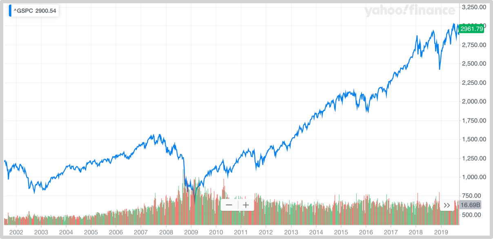

What would the result be? Back in October 8th, 2007, would be really hard to say. But looking at it from today, more than a decade later, the answer is clear: the results were fantastic! We experienced a crash in the market from \$1,561 to a low of \$683, but we kept buying at that low price. Later, the market recovered, and by October of 2019 the S&P 500 had exceeded \$2,960.

But this description is missing an important detail. The chart below shows the value of your total assets (the red line) and the value of your total investment (the blue line). 

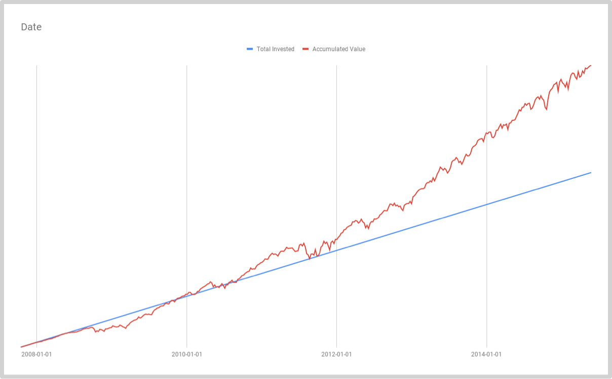

There is an extended period of time when your asset value drops below your total investments. But towards the end of 2009 the red line passes the blue line, and it almost never drops below it again, growing faster over time.

>Note: The historical data in this chart is from [Yahoo Finance (^GSPC)](https://finance.yahoo.com/quote/%5EGSPC/history?p=%5EGSPC), and the chart was created in Google Sheets; you can view the data and chart [here](https://docs.google.com/spreadsheets/d/1QE3itAH_TwUv4Gp9EVwwIz3Xb8taT5N-etfJCkYEvrg/edit?usp=sharing).

The key point is that you entered the market at the worst time –- on October 8th, 2007, the S&P 500 was at \$1,561, and it didn't return to this price until March 25th, 2013.

But if you take another look at the chart above, you'll see that the red line crosses the blue line for the first time in 2009. So while it took the S&P 500 **286** weeks to return to its high, your strategy of regular investing began to see steady positive returns after just *111* weeks. When you started to see positive returns, the S&P 500 was still 30% off its all-time high. When the S&P 500 finally returned to its high after 286 weeks, your strategy was already showing returns of *32.64%*.

Let's take a look at an even more striking example. Suppose you started regularly investing in Bitcoin in December of 2017, when Bitcoin was at it's all-time high of \$19,800. Shortly afterwards, the price crashed, and it still hasn't returned to its all-time high. The chart below assumes you started regularly investing in Bitcoin on December 11th, 2017, and kept it up for 87 weeks. 

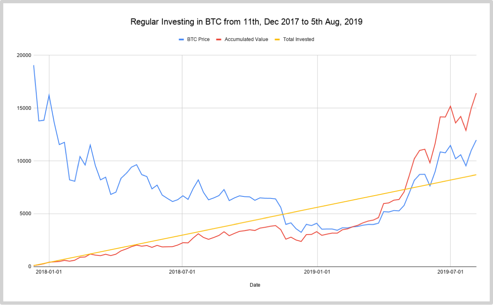

>Note: The historical data in this chart is from [Yahoo Finance (Bitcoin USD)](https://finance.yahoo.com/quote/BTC-USD/history/), and the chart was created in Google Sheets; you can view the data and chart [here](https://docs.google.com/spreadsheets/d/1pzc6p4UhyAMtqaKis2_uU3hbi8Um34ArTiUQr1tZpc0/edit?usp=sharing).

Even though you entered the market at the worst time, your investment has still been profitable in USD terms, with the red line (your assets in USD terms) passing the blue line (your total investment in USD terms) on May 6th, 2019. If you invested \$100 each week, by the 87th week you would have invested \$8,700, but your Bitcoin would have been worth \$16,417, for a gain of **88.71%**. This is despite the fact that Bitcoin remained over 62.85% off of it's all-time high, which was when you started investing. 

This can seem really flabbergasting at first: 

>With regular investing, even if you start at what seems like the worst time, such as just before a market crash, your overall investment will become profitable **before the market recovers**.

Some fans of regular investing always emphasize a partially correct fact, which is that regular investing will effectively reduce your average cost. But the other side of the coin is that it also probably raises your average cost. It's obvious, isn't it? So these fans are using an incorrect reason to choose the correct strategy . But how long can an operating system with an error at the base level continue to run for?

The reason why regular investing is effective is that **it matches up with the following reality of markets**:

>**Bear markets are much longer than bull markets.**

For example, over the last *one thousand days*, the blockchain markets have had *less than 150 days* of a true bull market. The same phenomenon is true no matter which price chart you are looking at, whether it be the S&P 500, Apple, Google, Amazon, Facebook, Tencent, or Alibaba. Bear markets are always very long, and bull markets are always very short. Bull markets are so short that we call them bubbles, like the dotcom bubble at the end of the last century.

Once you understand this key point, you will understand the following; 

>With regular investing, **your profits essentially all come from the bear market!**

Most investors don't understand this, and it is the core reason why their investments are destined to fail. They want to make money quickly in the ephemeral bull market. It's really quite depressing: most of the "investors" who enter the market during a bull market are destined to lose their shirts, because before they realize it, the short bull market has ended, and the long bear market has begun. Regular investors, on the other hand, are slowly accumulating throughout the bear market.

In fact, the strategy of regular investing is not only applicable to trading markets, it's useful in almost all important areas of life, whether it be study, work or family. "Lifelong learning" is essentially a regular investing strategy, isn't it? If you could draw a "price curve" for an individual's learning, it would look a lot like the S&P 500. Even though it increases substantially over time, it goes through long periods of flat growth or even drops. Often when you are investing time in learning something it feels like you would be better off not learning it. The "bear market" is long, isn't it? This explains why so few people are able to become true lifelong learners. The reason is the same: everyone wants to make money quickly in the bull market and then leave.

[Jeff Bezos](https://en.wikipedia.org/wiki/Jeff_Bezos) once asked [Warren Buffett](https://en.wikipedia.org/wiki/Warren_Buffett), "Your investment thesis is so simple... Why doesn't everyone just copy you?" Buffett's [reply](https://www.beingguru.com/2019/05/warren-buffett-nobody-wants-to-get-rich-slow/) was quite striking:

>**Because nobody wants to get rich slow.**

The most important part of Buffett's strategy is to hold for the long term. He has said that "Our favorite holding period is forever." At its core, the reason why regular investing works is that it is the ideal version of a long-term holding strategy. Most of the time, even Buffett doesn't just buy a target all at once; he enters his position over time. Those who follow the regular investing strategy also **continue to buy at regular intervals over the long term, and hold the asset throughout the process**.

### 1.2 How Long Is "Long-term"?

The core of the regular investing strategy is long-term holding. It's well recognized that the longer you hold the more likely you are to make a profit, but there is a key question we have to answer if we are to have a deeper discussion:

>**How long is "long-term"?**

If we don't have an accurate answer to this question, we can't even really use the concept of "long-term". For any concept to be useful it must be clearly defined, and since we must combine concepts together, if we have multiple unclear concepts then the accuracy of our judgement will be severely impacted, just as multiplying 80% by itself five times will leave us with less than 32%. In the course of reading this book, you will encounter several concepts that must be used together, and they must be clearly and accurately defined in order to be useful.

Unlike most people, I have a fairly clear, accurate and useful definition of long-term:

>Long-term means longer than **two full market cycles**.

A clear and accurate definition of "long-term" thus depends on a clear and accurate definition of another concept: "market cycle". So what's a full market cycle? Let's use bitcoin's historical price chart as an example.

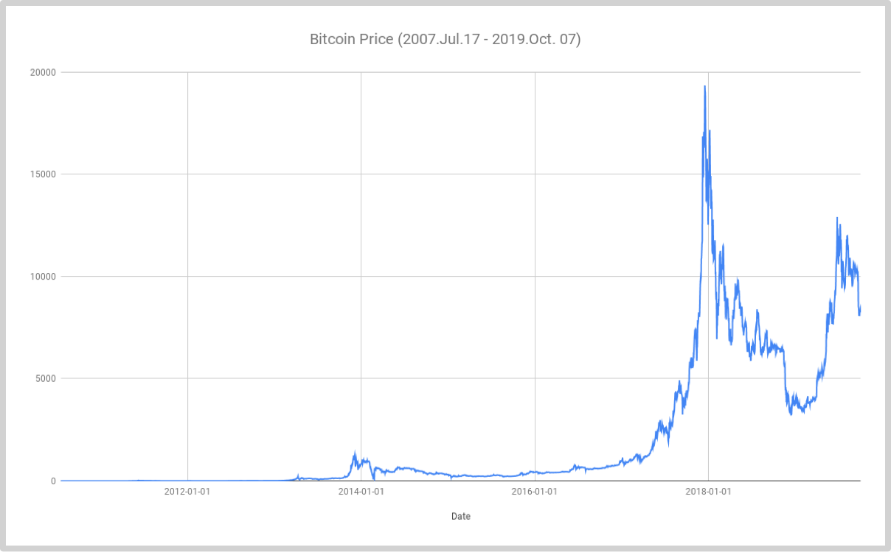

A full market cycle is composed of a period of falling price (Period B) and a period of rising price (Period A). In this chart we can see a full market cycle, with Period B beginning in December of 2013, when prices started falling, and Period A ending in December of 2017, when bitcoin reached its historical high. 

How can you tell when a market cycle begins? Actually, we can only make this determination **after the fact**. Since short-term prices can rise and fall unpredictably, it's impossible to know when a high or low point for a given period has been reached. It's hard to know how long after the fact it will be before we can make the determination, but we can be sure that it will be long enough that it will not be useful for short-term trading decisions.

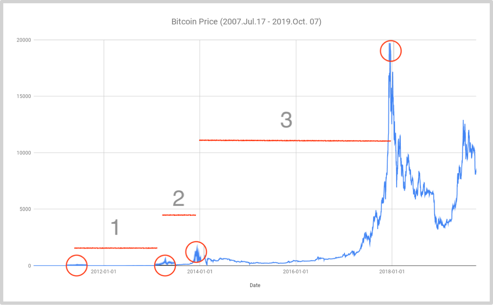

On the same chart, I have marked the three full market cycles that I have personally experienced with bitcoin. The first started around June 8th, 2011, at a price of \$32, and ended on April 11th, 2013, at a price of \$266; the second started at the end of the first and ended on December 19th, 2013, at a price of \$1,280; the third started at the end of the second and ended on December 17th, 2017, at a price of \$19,800. Actually, I have experienced more cycles than this, since I entered the bitcoin market two months before the June 2011 high of \$32, and I have continued and will continue to hold Bitcoin since the December 2017 historical high of \$19,800.

There are several details in this chart that are worth looking at closely. For example, we can clearly see that, as I mentioned earlier, bear markets are much, much longer than bull markets. 

Why do we need to emphasize at least **two** market cycles? Because many people misunderstand **trends**. They see that today's price is higher than yesterday's, and that yesterday's price was higher than the day before, and they think they have identified an "upward trend". They then erroneously assume that tomorrow's price will be higher than today's. But it's actually impossible to judge a trend in the short term, even over the course of one entire cycle.

>Only after **two full cycles** can we make an **accurate** judgement about whether a trend is more likely to be upward or downward.

Furthermore, please note the use of "more likely to be" in the sentence above. Even after two full cycles, we still cannot be 100% sure about the future trend based on historical data. At this point in time (October 2019), bitcoin's price has still not returned to its historical high, and we cannot be 100% sure that Bitcoin will ever exceed its historical high. We will only be able to make this determination after the fact –- long after the fact. In the end, from any point in time, we can only make investment decisions based on less than 100% certainty. Since the future is full of risk and unknown factors, we can only use terms such as "more likely". Actually, this is precisely why investing is so interesting.

In the chart above, we can barely see the high reached in June of 2011. But if we separate each historical high into separate charts, we see that they look strikingly similar.

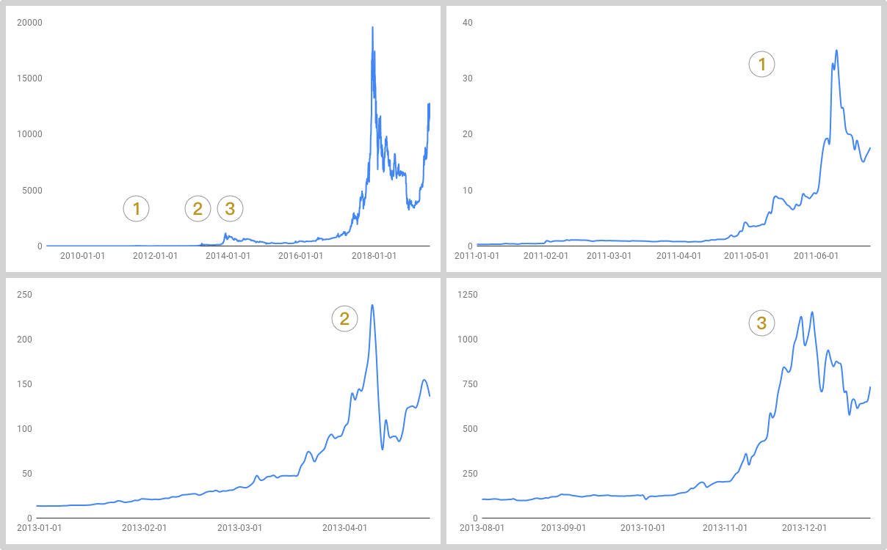

Each of these charts looks quite similar to the overall historical chart, which is to say that even as I am in the midst of my fourth full cycle, and even though I have made similar judgments based on "more likely" before, I still can't be completely sure this time. I still can only use "more likely" as the basis for my judgement. It's just that I've been quite lucky in that my previous three judgements based on "more likely" were proven to be correct.

Let's briefly summarize what we have discussed thus far:

> * a period of rising or falling prices does not necessarily constitute a trend –- **it's impossible to determine a trend over the short term**;
> * a period of falling prices (Period B) followed by a period of rising prices (Period A) constitutes a **full cycle**;
> * we can take each **historical high** as the starting point for Period B of a full cycle;
> * we can only determine the historical high of a period **after the fact**;
> * it takes **at least two full cycles** to determine a **trend**;
> * the best we can do is determine that a trend is **more likely**;
> * an upward trend often results in a **new historical high**, but we can only determine the highest price of a cycle after the fact;
> * long-term holding refers to holding for **at least two full cycles**, or through two bear markets and two bull markets.

If we use this upgraded way of thinking to look at any price chart, we will get a completely different result than before. Below is the price chart for the S&P 500 from 1956 to 2019:

> Note: The historical data in this chart is from [Yahoo Finance (^GSPC)](https://finance.yahoo.com/quote/%5EGSPC/history?p=%5EGSPC), and the chart was created in Google Sheets; you can view the data and chart [here](https://docs.google.com/spreadsheets/d/1RsmiifuZajR_POx1zO_--qUcOgwb7tABNQpT-O69Ryk/edit?usp=sharing).

There's an easy way to understand how economic cycles are shaped:

>Economic cycles are shaped by participants in the economy coordinating well at some times and poorly at others.

When many parties -– and "many" here refers to so many that some parties don't even know of the existence of others -– are communicating more and more efficiently, the length of cycles will become shorter and shorter, even if fluctuations, which occur when parties are not coordinating well, may never be completely eliminated.

If we look at it from this perspective, we can easily understand why the Great Depression of the 1930s took so long to recover from (i.e., complete the cycle), yet the recovery from the Asian Financial Crisis of the 1990s only took a few years, and the recovery from the worldwide recession brought about by the US subprime crisis was even faster. 

The reason is simple and easily understood:

>The rapid flow of information makes worldwide cooperation easier and more seamless, so even though crises will continue to occur, **recoveries are becoming more rapid.**

This is also why blockchain assets see shorter fluctuation cycles. Over the past eight years I've often heard people use the halving of bitcoin's block reward every four years as a way to distinguish bitcoin's cycles. Maybe that was useful early on, but, now that Bitcoin is no longer the only valuable blockchain asset, using the block reward halving as a basis for determining cycles has slowly lost significance.

I think the reason why blockchain asset markets have shorter cycles than stock markets is due to the fact that the players in the market are clearly coordinating more efficiently. We can see this just by looking at the number of trading markets. There are only a few influential stock markets, but there are thousands of markets on which to trade blockchain assets, and trading continues 24 hours a day, 365 days a year. This type of coordination greatly exceeds the coordination of traditional securities markets. 

It is truly great news:

>**Cycles are getting shorter and shorter.**

Cycles in stock markets have already shrunk from decades to less than a decade, and they continue to shrink. Blockchain market cycles are already shorter, and they are also shrinking.

In my view, long-term doesn't mean forever, but is a clearly defined concept of two or more full market cycles. In the stock market, two full market cycles will take about ten to fifteen years; in the blockchain market, two full market cycles will take six to eight years. Either way, they are both futures worth waiting on, right?

### 1.3 Why to Use Money to Make Money

For most people, money only has one use: consumption. Sadly, this is the basic reason why most people are unable to achieve financial independence. They have almost never seriously thought about money's second and much more important use: investment.

For those who only know how to consume and don't understand investment, it's hard to escape their original fate. They can only make money by selling their time, and the amount of time that they can sell is extremely limited –- we have much less time than we think. 

There is a set of data that can help us understand how little time we actually have to sell. If we take an average lifespan of 78 years...

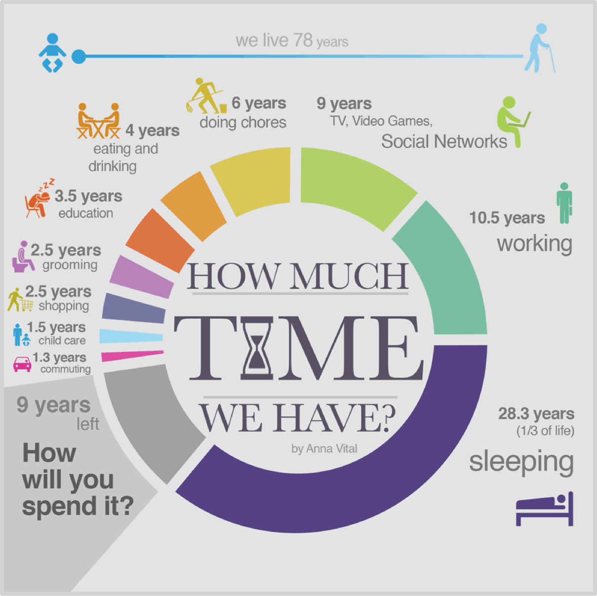

> * We sleep for 28.3 years;
> * We work for only 10.5 years (*this is the time that most people are able to sell*);
> * We spend 9 years watching TV, playing video games, and using social networks; 
> * We spend 6 years doing chores;
> * We spend 4 years eating and drinking;
> * We only spend 3.5 years on education;
> * We spend 2.5 years grooming;
> * We spend 2.5 years shopping;
> * We spend 1.5 years on child care;
> * We spend 1.3 years commuting.

According to these estimates, we only have nine years left to allocate as we please! The amount of time we have to sell is our work time of 10.5 years plus the nine years we spend on leisure. Even if we allocate all of those 9 years to paid work, we still haven't even doubled the time we have to sell. And we still sleep for longer than the time we have available to sell. Sleep is expensive!

When I was young, I worked very hard just like everyone else.

Upon graduating from college I started working in sales, and there were weeks in which I spent six nights sleeping on a train. I'd get off the train in the morning, find a place to shower and change clothes, spend the day running sales trainings, and then hop back on a train at night to head to the next city, where I'd start all over again.

People who have known me for a long time know that I don't have holidays. This is because, shortly after I graduated from college in 1995, I realized that there are so many holidays! In China, out of **365** days in the year, there are *115* legal holidays (including weekends)! That means we spend a third of the year resting! Something didn't seem right. Later I realized that "legal" holidays are established to limit corporations. If a corporation forces someone to work on a holiday without extra pay, it's illegal, but there's no limit on what an individual can do. There's no law at all that says, "today is a legal holiday, so if you don't rest you're breaking the law!" So, from that point on, I decided that I would have nothing to do with legal holidays. It's been 24 years since 1995, and I have done my best to ignore weekends and holidays. I just do what I want to each day! I've published a lot of books, and most of them have been written by myself over the Chinese New Year while everyone else was on vacation. I've worked very hard, haven't I?

About ten years ago, I suddenly realized what a waste of time it was to worry about hairstyles. Everybody spends a couple of hours to get their hair cut each time, and they often end up waiting for a long time at the barber. So I decided that I would cut my own hair. A good Phillips trimmer only costs about \$50, and you can use it for many years. So I've had the same hairstyle for the last decade -- a three millimeter buzzcut. It's easy to just use the trimmer every few days for a few minutes before I shower. Can you see how hard I work to save time?

The numbers, however, are rather disappointing. By not having a holiday in 24 years, how much time have I freed up to sell? Even if I don't rest on holidays, I'm only likely to have four hours of effective work every day. If you've worked for yourself, you know that the amount of truly effective work time you can have in one day is quite limited. So how much effective work time have I created by having no holidays over the past 24 years?

> 24 x 115 x 4 = 11,040

Just over 10,000 hours. So how many years is that?

> 11,040 ÷ (365 x 24) = 1.26

You see? I've been so hard on myself, and all for what? All for merely *14%* more time than other people who work very hard but still take holidays. And what about the decision I made 10 years ago to cut my own hair? How much time have I saved with that? If you cut your hair once a month, and it takes 1.5 hours, that's 18 hours per year. Over ten years, that's 180 hours. You see? I took such good care of my time and was so hard on myself, but I only saved 7.5 days! All that effort, and I only end up with *0.228%* more time than everybody else!

[Frank H. Knight](https://en.wikipedia.org/wiki/Frank_Knight), one of the most influential economists of the 20th century, has a [famous postulation](https://books.google.de/books?id=J76dBHOB0yUC&pg=PA48&lpg=PA48&dq=Ownership+of+personal+or+material+productive+capacity&source=bl&ots=FWMMVl-FhM&sig=ACfU3U2d1JxOO9DWYcnkTnzkPx3nMjMnfQ&hl=en&sa=X&ved=2ahUKEwiys6vF7prmAhWRwAIHHXp5ApEQ6AEwAHoECAcQAQ#v=onepage&q=Ownership%20of%20personal%20or%20material%20productive%20capacity&f=false):

>Ownership of personal or material productive capacity is based upon a complex mixture of inheritance, luck, and effort, probably in that order of relative importance.

Of course, this doesn't mean that effort isn't important. Some measure of success can be achieved through effort, but huge success depends on luck, and we all know that we can't control luck (or inheritance!). The problem, as we have seen, is that we have a limited amount of time that we can sell, so effort is of the least relative importance.

However, it's different if we use money to make money. **The core of investing is using money to make money, and money doesn't rest –- as long as you make the right investment, it works for you 24 hours a day, 365 days a year.** How can your sweat and tears compete with that?

The reason we admire Warren Buffett so much is due to the following fact: 

>Warren Buffett was born in 1930 and bought his first stock when he was 11. It's now 2019, so he has been investing for 78 years!
>
>*78* years! The average person only lives 78 years, and they only have an extra nine years to allocate. But Buffett's money has already been working hard for him 24 hours a day, 365 days a year, for 78 years! 

It's not hard to understand what a huge difference investing can make. 

### 1.4 What Can We Use to Regularly Invest?

It's an undeniable fact that most people don't invest. And they have an answer as to why they don't invest:

>I don't have any money to invest!

This is a frustratingly common misunderstanding. In fact, in addition to investing money, we have another resource that we can invest -- **time**.

It's not just non-investors who forget this. Even the few who do invest don't realize that, in addition to money, their time is also an investible asset. They haven't thought about how important time is, and how strong an influence it has over us.

Warren Buffett is undoubtably the most commonly-researched investor in the world, and you'll find his name in most books on investment, this one included. There's no way around it, as most of what he says is correct, and, perhaps more importantly, he's been so successful that most of what he says on the topic must be correct, and most people can't help but agree with him.

Buffett is not just successful, he's also always very open in sharing his thoughts and ideas. The problem is, he's told us everything that we need to do, so why can't we just go do it? Even though the difference between knowing and doing is the difference between monkeys and humans, there is a yet more important reason: 

>Warren Buffett has a zero cost of capital!

Berkshire Hathaway's key turning point in its early years came in 1967, when it bought National Indemnity Company and entered the insurance industry. Remember, Berkshire was a textile company that Buffett took control of in a fit of anger, and he regretted getting into the textile industry for many years. It wasn't until 1985 that Berkshire finally exited the textile business, nearly 20 years after Buffett took control in 1965.

But after entering the insurance market in 1967, Berkshire became an investing machine. The reason was simple: Buffett not only had a huge amount to invest, the funds also came at zero cost, and they could be used almost indefinitely. This was a huge relative advantage over all other investors in the world.

Books about Buffett talk about his incredible returns, and they treat his investment principles as the Bible. Even a casual statement at Berkshire's annual meeting can be taken as law. But 99.99% of investors will never have access to massive amounts of free capital to invest over an unlimited term, and that's a big reason why Buffett has been extraodinarily successful.

Regular investors are different. They may not have that much money, but they are investing more than just money. Since they are continuously investing over the long term,

>they are also using time to invest.

The reason I have been able to hold bitcoin and other blockchain assets over the long term is not, as many people think, because I have "faith". In fact, faith doesn't require logic, and can't depend on logic, because if it did depend on logic, all faith would be shaken in the end.

The core reason I have been able to hold these assets is that I have the ability to continuously make money over the long term outside of the market, because I have upgraded my personal business model.

>The vast majority of people can only sell their time once, but, after upgrading, I can sell my time multiple times. For instance, by writing books or teaching online.

Even though there is a ceiling on this business model, it has allowed me to not be tied down by daily expenses. It also allows me to always have money to use for investment that, despite being limited in amount, has no cost, is constantly flowing in, and can be invested over an unlimited term. Without this, all of my achievements in the investment space would have been impossible. So my regular investment into blockchain assets is not just money, but all of the effective time that I have spent working, and the sustainable income that has come from repeatedly selling this time.

So regular investing is something that people with ambition but limited resources can do, and it is something that only this type of person can do. When Buffett purchased a controlling stake in Berkshire Hathaway, he was already not a poor man. After purchasing National Indemnity Company and entering the insurance industry, almost all of his investments were long-term buy-and-hold investments. Buffett didn't need a strategy of regular investing. Or, to put it more precisely, he didn't need to improve upon his buy-and-hold strategy. The simplest strategy in the world was already enough for him.

As far as other fund managers, they are even less able to pursue a regular investing strategy, primarily because 99.99% of fund managers (or, everyone except Buffett) have a limited term for their capital. For some it may be ten years, for others it may be three to five years, but no matter how long it is it's still a limit, and that entails great risk. In the investment world it's rare to have a middle ground -- it's either a 1 or a 0. If capital has a term the risk is 1, if it doesn't the risk is 0, and there is no 0.2 or 0.8. Lots of people don't understand this, so they line up like lemmings to take risks and end up falling off a cliff. The riskiest job in the world is President of South Korea, and right after that is the fund manager who guarantees immediate redemption of capital.

To put it another way, most "professional investors" don't have the ability to do regular investing, because they are not managing their own money, and their funds have a deadline after which they need to be returned. Once it's time to settle the funds, it doesn't matter if it's a bull market or a bear market, it's still time to settle, so how can you be sure of your earnings? Most people have never thought about how a fund's success is not dependent on the manager's acumen and strategy but instead dependent on the time the fund was established. Funds that are established at the end of Period B and the beginning of Period A are quite likely to succeed, because during that period you can make money investing in almost anything. The problem is that is the time at which investors are the most scared and circumspect, so it's hard to raise money. The easiest time to raise money is at the end of Period A, when everyone has gone crazy in the bull market. But if they raise money at that time, and the money has a term, it's going to be very difficult to succeed. 

Selling one bit of your time more than once is an upgrade of your personal business model. It's such an important upgrade that it is hard for anyone to free themselves from the shackles of increasing daily expenses without it. At first you only have to take care of yourself; then you have to take care of your spouse; then you have to take care of your children and even your parents. Most people are defeated by these basic life expenses. An individual must make enough money to cover these expenses, which first increase and then may level out or even decrease later in life, before they can have money left over to practice regular investing. If you don't upgrade your personal business model, it's hard to have any money left over.

As I see it, regular investing requires a trifecta of successful personal business model upgrades:

> * from selling your time once to selling the same time multiple times;
> * from only using money to consume to using money to make money (starting to invest);
> * from just investing money to also investing time.

Even more importantly, a strategy of regular investing systematically reduces risk.

### 1.5 The Strategy of Regular Investing Does Not Need to Be Further Improved

We're always trying to find ways to improve our strategies. Everyone wants the strategies that **they** use to be as good as possible. When it comes to regular investing, though,

> **any efforts to improve the strategy of regular investing are futile.**

From the establishment of the BOX Regular Investing Practice Group in late July of 2019, to October 9th, 2019, 3261 members have joined. After understanding the essence of the regular investing strategy, the group members know that most of the profit from regular investing comes from the long bear market. Because they have a different way of thinking, they now have a completely opposite take on the same world. Each time the price drops, they don't feel disappointment and fear, they feel happy, and even excited, because they can buy more at a cheaper price. Their decisions are the opposite of the outside world.

Below is the historical price of BOX over the past few months:

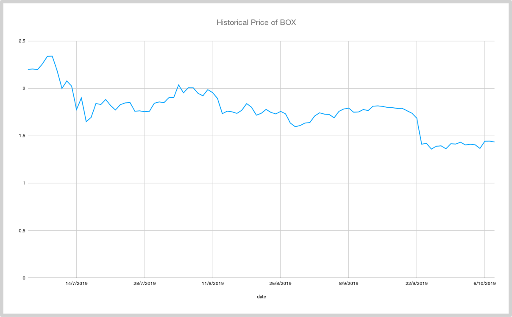

The chart below adds the daily amount of newly-circulating BOX, which is the amount invested in BOX each day. To make the chart easier to read, the amount of newly-circulating BOX has been divided by 100,000:

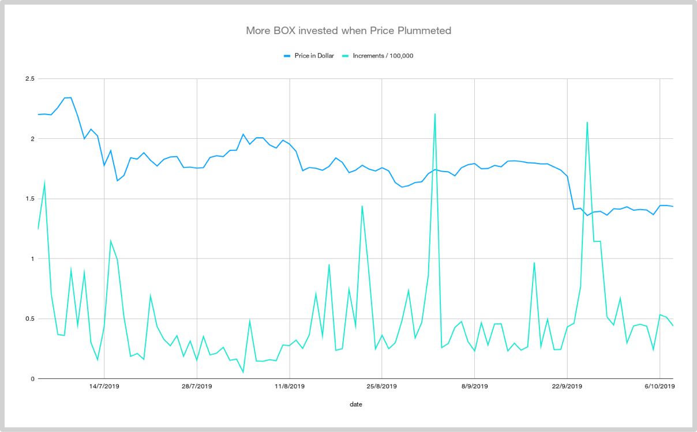

>Note 1: The charts were created with Google Sheets, and you can view the charts and data [here](https://docs.google.com/spreadsheets/d/1caNGqbFZKEjSPr9kf1gJhB2j8pLrHje0PsPZJKJdGIM/edit?usp=sharing).

>Note 2: The amount of newly-circulating BOX on September 2nd, 2019, was 221,010, but it really shouldn't count, because I alone bought 180,621 BOX on that day. I'm an old hand at regular investing, so of course I don't pay attention to daily fluctuations in price.

We can see that each time there is a large drop in price the amount of newly-circulating BOX greatly increases. The clearest example is found on the three days from September 25th to September 27th, which saw newly-circulating BOX of 214,048, 114,240, and 114,505, respectively, with September 25th showing an increase of five times the normal amount! 

It's also clear from this data that people's reactions are late, because the drop in price actually happened several days earlier on September 22nd, when the price dropped from \$1.68 to \$1.41. As we can see in the chart, the increase in the amount of new BOX purchased always came days after the drop in price.

Furthermore, the group members had listened to my classes, in which I repeatedly emphasized the following:

> **Any efforts to improve the strategy of regular investing are futile.**

Yet many of them still couldn't resist being driven by this simple thought: wouldn't it be better if I bought a little more when the price drops? 

Let's discuss why this "improvement" to the strategy of regular investing isn't actually an improvement at all. First of all, each time we use the current price as a reason for making a decision, we are always actually making the decision after the fact. Even more importantly, we are neglecting an important fact: the short-term direction of the price after we make our decision is an independent event, and not tied to the prior change in price. After we buy, the price could go up, go down, or stay the same -- we don't know!

Someone who increased their investment amount in July after a price drop would have discovered in September that their "improvement" to the strategy was useless and actually cost them money, because the increased investment in July actually ended up increasing their average cost.

Whether or not an investor has a clear grasp of statistical probability is the factor that has the greatest influence on the accuracy of their decisions. Sadly, too many people don't pay enough attention to this basic knowledge, and they have no idea that this lack of knowledge causes them so much trouble and grief.

A person who understands statistical probability couldn't help but laugh at the following phenomenon:

>Some people, lacking basic knowledge of statistical probability, try their best to prove on which day of the week prices are lowest.

Someone made a chart, and did some programming in Python, to support the following conclusion:

>After analyzing every 350-day period of weekly regular investing in bitcoin over the 900-day period from July 17th, 2010, to January 2nd, 2013, the following conclusions have been reached:
>
>> Investing on Monday performed 1.2% better than the average of the other days.
>> Furthermore, it is best to avoid Sunday, as Sunday performed 0.8% worse than average, perhaps because people have more time on Sunday, or perhaps because they feel more optimistic on Sunday.

Are these sorts of conclusions meaningful? It's basically impossible to use logic to convince people who don't understand the independence of random events, but in [an article written in 1984](https://g.co/kgs/kwb7vc), Warren Buffett gave a fun and yet deep example that might help:

>I would like you to imagine a national coin-flipping contest. Let’s assume we get 225 million Americans up tomorrow morning and we ask them all to wager a dollar. They go out in the morning at sunrise, and they all call the flip of a coin. If they call correctly, they win a dollar from those who called wrong. Each day the losers drop out, and on the subsequent day the stakes build as all previous winnings are put on the line. After ten flips on ten mornings, there will be approximately 220,000 people in the United States who have correctly called ten flips in a row. They each will have won a little over \$1,000.
>
>Now this group will probably start getting a little puffed up about this, human nature being what it is. They may try to be modest, but at cocktail parties they will occasionally admit to attractive members of the opposite sex what their technique is, and what marvelous insights they bring to the field of flipping.
>
>Assuming that the winners are getting the appropriate rewards from the losers, in another ten days we will have 215 people who have successfully called their coin flips 20 times in a row and who, by this exercise, each have turned one dollar into a little over \$1 million. \$225 million would have been lost, \$225 million would have been won.
>
>By then, this group will really lose their heads. They will probably write books on “How I turned a Dollar into a Million in Twenty Days Working Thirty Seconds a Morning.” Worse yet, they’ll probably start jetting around the country attending seminars on efficient coin-flipping and tackling skeptical professors with, “If it can’t be done, why are there 215 of us?”

In addition to not fitting our basic understanding of statistical probability, another reason why "invest on Monday and not Sunday" is unlikely to work is the following:

>If it is really effective, then everybody will start doing it, and then it will no longer be effective.

## Part Two: Choosing a Target for Regular Investing

Regular investing is simple, direct, brutal and effective. However, in addition to depending on the ability of the practitioner to earn money outside of the market, it depends even more on the selection of a quality investment target. If a mistake is made in the selection of the target, the result over the long term will be terrible.

It's important to note that what we are discussing is "how regular investors should choose an investment target", and not "how investors should choose the correct investment target". The former is a subset of the latter, and actually only has one additional condition: 

>Is it worth holding over the long term?

In the investment world, the Greet letter *alpha (α)* is used to refer to returns that exceed overall market returns. The goal of regular investors when choosing their investment target is to create *alpha*. They won't sell before at least two full market cycles have passed, because to do so would be to waste all of their previous efforts. All they do is buy, so they won't know for a long time whether or not their *alpha* is positive or negative.

### 2.1 Investing Advice That You Can Blindly Follow

The hardest question for those just entering the market is this:

>Which one should I pick?

How can someone who doesn't even know what their criteria should be make a choice? How can someone who can only see the superficial and not the true nature of something make a correct choice about what to hold over the long term without wavering? There is a simple, direct, brutal and effective strategy that is also free:

>**Blindly follow** the advice of truly successful investors who have shown excellent returns over the **long term**.

"**Blindly follow**" sounds extremely terrifying, but we actually can blindly follow the advice of truly successful investors who have shown excellent returns over the long term (please notice the key term: "long term"), because in the investment world there is an amazing phenomenon:

>The more long-term successful experience investors have, the more open they are.

Warren Buffett started writing public letters to investors a long time ago, and later on he continued to share his investing ideas and decision-making process on television and though other media. Starting in 1965, Buffett has written a public letter to investors each year. As of 2019, he has been writing them for 54 years! Ever since 1973, he and Charlie Munger have held freewheeling Q&A sessions at yearly shareholder meetings. In 2019, the 46th year, a record 16,200 people attended, not including people watching online around the world.

>Berkshire Hathaway's shareholder letters from 1977 to 2018 are available here: 
>
>>[http://www.berkshirehathaway.com/letters/letters.html](http://www.berkshirehathaway.com/letters/letters.html)
>>CNBC's website has a special section called the "Warren Buffet Archive":
>>[https://buffett.cnbc.com/warren-buffett-archive/](https://buffett.cnbc.com/warren-buffett-archive/)

Warren Buffett's mentor, [Benjamin Graham](https://en.wikipedia.org/wiki/Benjamin_Graham), was also someone who shared without reservation. In addition to teaching investing classes, he wrote several books, most notably [Security Analysis](https://www.amazon.com/Security-Analysis-Foreword-Buffett-Editions-ebook-dp-B0037JO5J8/dp/B0037JO5J8/) (1934) and [The Intelligent Investor](https://www.amazon.com/Intelligent-Investor-Definitive-Investing-Essentials/dp/0060555661/) (1949). Warren Buffett read *The Intelligent Investor* when he was 19, and he became a fan of Benjamin Graham. One Saturday in 1951, while in the library of Columbia Business School, Buffett learned that Benjamin Graham was Chairman of GEICO, and immediately decided to pay a visit to the company's office. Many years later, in an interview with *Forbes*, Buffett recalled that the investment he made in GEICO at the age of 20 was one of the investments he was most proud of.

Joel Greenblatt's investing returns are perhaps even more impressive than Warren Buffet's -- from 1985 to 2006, his annual compounded returns exceeded 40%! Having been successful over the long term, Joel Greenblatt is also quite willing to openly share. He has published three books, namely [You Can Be a Stock Market Genius](https://www.amazon.com/You-Can-Stock-Market-Genius/dp/0684840073/) (1999), [The Little Book That Still Beats the Markets](https://www.amazon.com/Little-Book-Still-Beats-Market/dp/0470624159/) (2010), and [The Big Secret for the Small Investor](https://www.amazon.com/Big-Secret-Small-Investor-Investment-ebook/dp/B004J4WKHE/) (2011). He is so down to earth that his standard for writing the books was that his teenage children could understand them. 

Greenblatt didn't just share his ideas in his books, he also made a website, [Magic Formula Investing](https://www.magicformulainvesting.com), that allows investors to use his ideas to build their own portfolios. All you have to do is enter a few parameters and the site will give you a ready-to-go portfolio based on the "Magic Forumula".

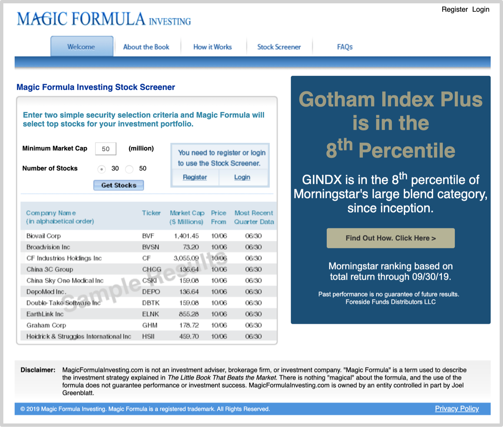

[Ray Dalio](https://en.wikipedia.org/wiki/Ray_Dalio), the founder of [Bridgewater](https://www.bridgewater.com), is yet another investor who has been successful over the long term and is willing to share his ideas. Long before his book, [Principles](https://www.amazon.com/Principles-Life-Work-Ray-Dalio/dp/1501124021/), was officially published in 2017, he released [a version for free online](https://archive.org/stream/BridgewaterRayDalioPrinciples/Bridgewater%20-%20Ray%20Dalio%20-%20Principles_djvu.txt). In 2019, he even released an app called [Principles in Action](https://apps.apple.com/us/app/principles-in-action/id1211294305), which helps readers put the principles in his book into practice.

In the investing sphere, one must use money, time and action to create real results, and everyone is either a 0 or a 1. Investors who can successfully produce returns over the long term are 1s, and the rest are 0s, including those so-called experts who spend all of their time yelling through the television or other media but have no skin in the game. Investors like Warren Buffett, Joel Greenblatt and Ray Dalio don't need to spend all day screaming through the television, because their ideas have already been clearly expressed through their books, writings and speeches.

Perhaps the most simple, direct, brutal and effective strategy that novice investors can use is to just buy whatever Warren Buffett buys. They don't need to dream about "beating Warren Buffet", they can just “keep up with Warren Buffett" by buying shares in his companies. The easiest way to do this, of course, is to just buy Berkshire Hathaway shares. If novice investors feel that Berkshire Hathaway's share price is too expensive (it was over \$310,000 in October of 2019), then they can look at its individual holdings and choose the stocks they want!

>CNBC has a page listing all of Berkshire's stock holdings:
>
>> [https://www.cnbc.com/berkshire-hathaway-portfolio/](https://www.cnbc.com/berkshire-hathaway-portfolio/)

Of course, if a novice investor actually did this, their success would be dependent on whether they were able to hold the stocks for as long as Warren Buffett does. For the vast majority of people, holding for the long term is a much bigger challenge than making the initial choice of what to buy.

Alternatively, they could go to Joel Greenblatt's [Magic Formula Investing site](https://www.magicformulainvesting.com), enter a few parameters, and buy the suggested collection of stocks. It's important to note, however, that Greenblatt's Magic Formula is not suitable for regular investing, since his method is to choose a new batch of stocks each year. See? Regular investing isn't the only effective strategy, it's just the easiest for most people to put into practice.

So why can we blindly follow these truly successful investors who have shown excellent returns over the long term? It's because they have used their own strategies over the long term, and their strategies have passed the test of time. They are also skilled at thinking with a long-term perspective, or else they wouldn't have been able to carry out their strategies over the long term. In their eyes, the long-term effectiveness of a strategy is not related to how complicated it is. To the contrary, only simple strategies can actually be carried out over the long term. Furthermore, the long-term effectiveness of a strategy is not correlated with the intellect of its user. The core prerequisite for the long-term effectiveness of an investment strategy is whether or not it is faithfully carried out over the long term.

**In fact, there is no secret to success. Even if there were, it would be an "open secret".** All paths to success are open, as are all of the necessary tools and knowledge. It's just that few people are able to patiently follow a path, picking up knowledge and understanding bit-by-bit, and persistently execute along the way. How few? They're actually quite hard to find.

These people are the rare ones who have achieved a **unity of knowledge and action**. Actually, the suggestions of anyone in any field throughout history who has achieved a unity of knowledge and action are worth accepting and putting into practice. If we understand it right away, that's great, just do it. If at first we don't understand, we can **blindly follow**.

The key point is that investing ideas from the most successful investors are free! You don't even need to worry that these ideas will be adopted by everyone and lose their effectiveness, because history has shown that the vast majority of people won't use these ideas. Maybe it's because most people are afraid of simplicity. They think that success is difficult, so they must discover a complicated secret or they won't be able to succeed. There's also another important and common fear involved that keeps people from following this priceless advice: it's terrifying to use our own money to carry out the ideas of others that we still don't understand!

Of course, there's yet another reason: 

>People like to use their own smarts and efforts to get a reward. 

"Even if I make money by buying whatever Warren Buffet buys, it doesn't *feel* like success." This might be the actual feeling that many people are hiding.

### 2.2 Value Investing and Trend Investing

When people talk about **value investing** and **trend investing**, they often mistakenly see them as opposites. In fact, they are only opposites when viewed from a short-term perspective. 

For regular investors, however, who always view things from a long-term perspective, value investing and trend investing are not opposites. In the long term, which is to say after two full market cycles, value investments will show a trend of compound growth, and investments that trend upward over the long term will also certainly be valuable. A simple change in perspective can cause the relationship between two terms to be completely opposite!

I often say the following:

>Don't have blind faith in value investing.

I also often say this:

>Don't have a one-sided understanding of value investing.

Why do I feel that I always have to remind people of this? Because I often see this situation:

>Most people are clearly (short-term) trend investors, because the bull market was obviously the reason they entered the market! But as soon as they get trapped by falling prices in a bear market, they suddenly become value investors!

So, in most situations, people who mention the concept of value investing to you actually only became value investors after getting trapped in the market. I can also guarantee to you that, once the market picks up, they will suddenly turn into what they would call trend investors.

This is truly a fascinating phenomenon. They completely fail to understand that the huge loss and the awkward situation that they are facing are entirely due to having a different perspective. Even sadder is that these people, who use the short term as the basis for their decisions, also don't know that they have no way of understanding the free and correct advice on the market that is available from those most successful investors who can be blindly followed. And it's all due to a different perspective! Because those "truly successful investors who have shown excellent returns over the long term" all look at things from a long-term perspective.

To take it a step further, **trend investing is better than value investing when viewed from a long-term perspective**.

Even though Benjamin Graham's value investing thesis is obviously correct, few people notice that it has a hidden limitation:

>According to his thesis, you must always pay attention to the current price.

Behind this hidden limitation is an even more deeply hidden factor:

>Even though it is possible to determine whether the current price is lower than the current value, it's nearly impossible to determine the future price and value, especially the price and value after two full cycles.

It's an almost impossible feat to both pay attention to the details of the present and seriously consider everything that could happen in the distant future. This is the key reason why truly successful value investors are so rare. A good analogy is the saying that if you wear one watch you'll basically know what time it is, even if it's a few minutes slow or a few minutes fast, but if you wear two watches you'll be very mixed up.

According to value investing theory, you must work hard to find an investment with a price below its actual value. But when will you sell it? According to the theory, once its price exceeds its actual value you should sell it, whether it's been ten days or ten years since you purchased it. 

Following this theory, even Warren Buffett will make mistakes. His most famous mistake was his investment in Disney -- he actually made two mistakes trading Disney stock. In 1966, 36-year-old Buffett met Disney founder Walt Disney in California. Following the meeting, Buffett bought 5% of Disney ([NYSE:DIS](https://www.google.com/search?q=NYSE:+DIS)) for \$4 million at a price of \$0.31 per share.

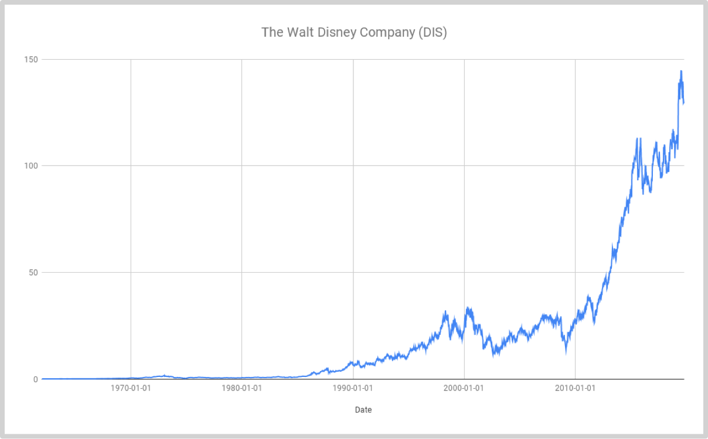

>Note: Historical data is from [Yahoo Finance (DIS)](https://finance.yahoo.com/quote/dis), and the chart above was created in Google Sheets; you can view the data and chart [here](https://docs.google.com/spreadsheets/d/1Vni-yvkOk7FPixEzQjGa4T7qLa-DzpaQuwlO0xTzrwI/edit?usp=sharing).

In his [1995 investor letter](https://www.berkshirehathaway.com/letters/1995.html), Buffett relayed this story. He bought Disney stock in 1966 at \$0.31 per share, and then sold it a year later for \$0.48 per share, making a profit of 50%. Over the next thirty years, Buffett could only watch as Disney stock rose, reaching \$13 in 1995. 

But the story was not over. In 1995, Buffett helped Disney purchase Capital Cities/ABC, of which he was a shareholder, and once again ended up with a 3.6% stake in Disney! He sold his shares within three years, though, and missed out as Disney's stock continued to rise up to \$129 in October of 2019. [Business Insider calculated](https://markets.businessinsider.com/news/stocks/warren-buffett-made-20-billion-mistake-by-selling-disney-twice-2019-8-1028484967) that, had Buffett continued to hold 8.3% of Disney through 2019, his shares would have been worth \$21 billion, and he would have received \$1.5 billion in dividends.

Of course, this story doesn't mean that Buffett failed in his investment, and he certainly didn't actually "lose" \$22.5 billion. After all, he made a profit on Disney, and he didn't just spend the money after selling -- he kept investing according to his strategy, and he has a 55-year track record of around 25% returns. Over the past 53 years, not accounting for dividends, Disney has returned just over 19% compounded annually. If dividends are taken in to account, Buffett would have been better off holding Disney, but he certainly didn't "lose" as much trading Disney as some people think.

What this story really tells us is that, over at least two full cycles, value investing, which requires constant focus on price, is not necessarily better than long-term trend investing.

Therefore, **regular investors focus more on the overall trend**. Even though we are also value investors, the difference is that we view things from a long-term perspective. While it can make people uncomfortable, the logic is sound:

>If the correct trend is chosen, then while the difference between price and value is not unimportant, it's not as important as people think.

With a focus on long-term trends, and the requirement of only focusing on the long term, regular investment targets must be chosen in a different way. Compared to many other investors, regular investors have an extra screening criterion:

>Sustained growth over the long term.

Don't discount the importance of "one extra criterion".

Amazon ([NASDAQ: AMZN](https://finance.yahoo.com/quote/AMZN/)) currently has the highest market cap of any e-commerce company in the world.  According to [Morningstar's calculations](http://performance.morningstar.com/stock/performance-return.action?t=AMZN), it has provided investors with a compound yearly return of 40.42% over the past five years. Over the past 15 years, the compound yearly return has been 28.51%.

Have you thought about why Amazon started by selling books, even though there were so many other potential items to sell? Aside from the fact that the book market is a large market, and the fact that people need and want to buy books frequently, there is one extra screening criterion that the book market fulfills: once you have sold a book, you very rarely need to provide customer service. Just this one extra criterion eliminated 99.99% of the other choices!

Regular investors can only choose investments that grow sustainably over the long term (of course, the more growth the better!). Just this one seemingly simple criterion eliminates 99.99% of the options, because, strictly speaking, there is no one individual investment that we can be sure will meet this criterion, no matter how good it looks now. This is because companies are just like people:

>In the long run, we are all dead. 
> -- John Maynard Keynes

So what should a regular investor do?

### 2.3 A Long-term Perspective and Macro Observation

Everyone can understand how difficult it is to pick the best possible investment, especially in the midst of price fluctuations. It's as difficult as a world champion archer standing on a boat being rocked by waves in the middle of the ocean hitting the bullseye on a target on the shore.

Only investing in one investment also entails opportunity cost. Time and money are limited resources, and if you use them in one way you can't use them in another. So, if you invested in A but B performs better, the opportunity cost of your investment decision is quantifiable. 

Fortunately, we have another simple, direct, brutal and effective solution:

>Invest in everything.

This sounds a little bit crazy, and perhaps a bit stupid, but let's put aside whether it's actually crazy and/or stupid, and first ask: Is it possible to invest in everything? The answer is definitely yes! The [MSCI World Index](https://en.wikipedia.org/wiki/MSCI_World) tracks the price of 1,650 mid- and high-cap stocks in 23 developed countries. If we actually invested in this index, what would our results be?

>Note: It's possible to buy ETFs that track various world stock indexes. The iShares MSCI World ETF (NYSEARCA: [URTH](https://www.investopedia.com/markets/etfs/urth/)) tracks the MSCI World Index; the iShares MSCI ACWI ETF (NASDAQ: [ACWI](https://www.investopedia.com/markets/quote?tvwidgetsymbol=acwi)) tracks the MSCI All Country World Index, which includes emerging markets; and the Vanguard Total World Stock ETF (NYSEARCA: [VT](https://www.investopedia.com/markets/quote?tvwidgetsymbol=vt)) tracks the FTSE Global All Cap World Index, which also includes developed and emerging markets.

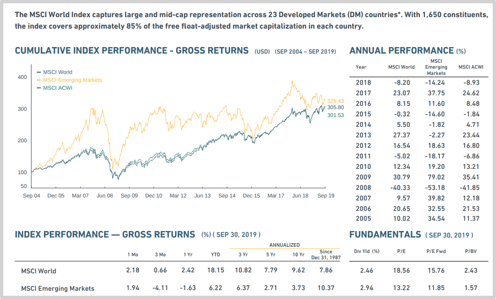

In addition to the MSCI World Index, there are several other MSCI indexes, including the MSCI Emerging Markets Index. From December 31st, 1987, to September 30th, 2019, the MSCI World Index has shown yearly compounded returns of 7.86%, and the MSCI Emerging Markets Index has shown yearly compounded returns of 10.37%. This makes sense, as you would expect emerging markets to grow faster, albeit with more risk.

An investment in a fund that tracks the MSCI World Index is like a bet on the growth of the world economy, and an investment in an S&P 500 fund is like a bet on the US economy. If we look again at the chart of the S&P 500, we can see that it has also provided around 9% returns over several decades!

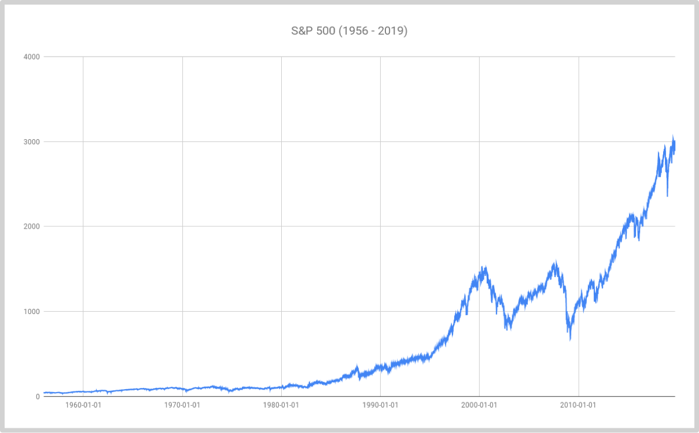

>Note: The historical figures above are from [Yahoo Finance (^GSPC)](https://finance.yahoo.com/quote/%5EGSPC/history?p=%5EGSPC), and the chart was created in Google Sheets; you can view the chart and data [here](https://docs.google.com/spreadsheets/d/1RsmiifuZajR_POx1zO_--qUcOgwb7tABNQpT-O69Ryk/edit?usp=sharing). 

Investing in the S&P 500, with an annual compound growth rate (ACGR) of 9%, performed better than investing in the MSCI World Index, which had an ACGR of 7.86%, but the MSCI Emerging Markets Index performed even better, with an ACGR of 10.37%. What's the easiest way to explain this?

> * The US grew faster than the world;
> * emerging markets grew faster than the US.

Now we can see that, when we choosing investments, in addition to "one" (quite dangerous) and "all" (mediocre), there is another choice: "part". So which parts are worth choosing? I like this analogy even better than "betting on the world": 

>Choosing investments is like choosing a method of transportation. If you walk, you can still get there, it will just take longer. But if you have a bike you shouldn't walk, if you have a car you shouldn't bike, and if you have an airplane you shouldn't drive -- you should take whatever will get you there the fastest.

We've seen that emerging markets develop faster, so it's easy, we can just choose the "emerging market part", right? Or could we just choose one fastest-growing country, or even just choose the fastest growing industry in that country? Sure! Choosing a market that is growing faster is just like choosing a faster method of transportation. 

It's extremely difficult to pick the best investment out of tens of thousands of possibilities, but it's quite easy to pick a couple of the the fastest-growing areas out of ten or so regions. Everyone knows that the US and China are the fastest-growing places in the world. If I were to design an ETF, I would look for my investments in just these two places. This ETF would have a high probability of doing better than the MSCI World Index, wouldn't it? To take it a step further, it wouldn't be that difficult to further limit my investments to the fastest growing one or two industries in each country. At least legendary investor [Masayoshi Son](https://en.wikipedia.org/wiki/Masayoshi_Son) doesn't think it would be difficult:

>Making money is easy. All you need to have done is invested in the Internet 20 years ago, because at that time the Internet was the future of the world. Now, you should invest in AI, because AI is the future of the world. 

Actually, I have already designed a no-load, no-management-fee index fund. The working name is "Odyssey", and it should be issued in the US in October of 2020. It will be made up of about 30 investments, all in listed companies in the US and China. There is only one selection criterion:

>"Who has constantly growing user data?"

I agree with Masayoshi Sun's point of view, and believe that in the foreseeable future AI will be the best industry. However, my point of view is slightly different. For instance, I believe the following: 

>No matter how good the algorithm is, it needs data to feed it. Public companies with large and growing amounts of user data already have sufficient profit-making ability. If in the future algorithms are large trees, then growing amounts of data are fertile ground. Without fertile ground, the trees can't grow. Most algorithm companies will in the end be used by large companies with data.

When I started to buy lots of bitcoin in 2011, many people thought I was crazy. They all said the same thing: "Isn't it too risky?" They felt like it was too risky, but I had the opposite feeling:

>Isn't it too risky not to invest in Bitcoin?

This was the logical reasoning behind this feeling:

>We've seen the incredible changes brought about by the Internet allowing information to flow rapidly with basically zero cost, so what kind of incredible changes would be brought about if assets could also flow rapidly with basically zero cost?
>
>After ten years, the Internet is still bringing about massive change. Even if it isn't exactly what we initially imagined, it's still amazing. In the same way, ten years from now the financial Internet is extremely likely to have brought about incredible change, even if we can't know exactly what those changes will be...

So for me at the time, blockchain was the future, blockchain was a trend, and blockchain would likely be the fastest growing industry. Looking back from eight years later, it has become the fastest growing industry, and my investment has grown at a scale not even imaginable at the time.

You see? "Choosing the fastest growing sector" is the most simple, direct, brutal and effective method. It's also the most direct conclusion that can be derived from macro observation. For those who can't think based on the long term, this statement isn't understandable as an effective piece of advice. To them, it seems stupid, and you can imagine them yelling out, "Who doesn't know this!?" Yes, everyone knows this, but not everyone thinks based on the long term, so they are not used to macro observation, and so of course they can't understand the power of long-term macro observation. 

Can we take it further, and ask ourselves, "Can I choose the fastest growing company in this fastest growing sector?" I don't think it's worth it, because doing so is essentially returning to the most dangerous situation, and becoming more vulnerable to regression to the mean. The core skill of macro observation is very simple: don't go to extremes. The reason is that we hate risk, and we hate systematic risk even more. The core strategy is always "a part of a part":

> * Look for one or more regions in the world;
> * in those regions look for one or more sectors;
> * in those sectors look for the best companies...

However, whether we're choosing regions, sectors, companies or projects, we should never pick just one. So in a global sector such as blockchain, as long as opportunities are available, my choice is no longer a single investment, but the mix of investments in BOX, which includes BTC, EOS, and XIN.

The diagram below may make it easier to understand.

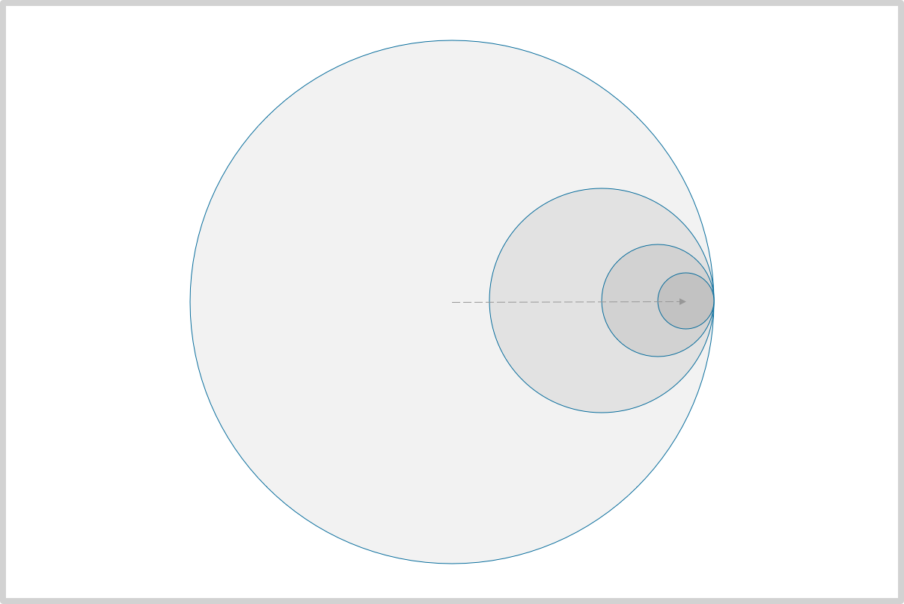

The largest circle represents the entire world, and you are standing in the middle holding a bow and arrow....

>You look around, hoping to find the best place to shoot your arrow. It's difficult, because in the entire circle there are limitless places to chose, and it's basically impossible for you to choose the best possible place and hit it from so far away...
>
>So you think about it, and you choose "everywhere". You decide to change tools, and trade your arrow for a net. This is much better! It's easy, and even if the results are average, it's much better than shooting arrows all day and hitting nothing...
>
>But you'd like to have better results, so you first choose a general direction. You're not just choosing randomly, you have a reasonable basis for your choice: you decide to shoot your arrow in the direction of the area that is developing most rapidly. This way you're more likely to hit something, right? Or you could put down your arrows, and just throw your net in that direction!
>
>But then you realize that you could use the same basic rationale to adjust your general direction. If there are regions that are growing more rapidly, then there must also be sectors within those regions that are growing the most rapidly. The same logic still works.
>
>You've already made three guesses: 1) a net might work better than an arrow; 2) certain regions might grow more rapidly than the whole; and 3) some sectors within those regions might grow even more rapidly. If you keep guessing, your accuracy will certainly suffer. So what should you do? Don't use an arrow, use a shotgun! This way, although your accuracy will suffer, you'll be more likely, and perhaps almost certain, to hit something. Anyway, since it's so far away, no one can be completely accurate, but after so many adjustments, you're more likely than others to be accurate!
>
>In the end, you have another discovery, which is that using an arrow is never the best choice...

Choosing a mix of multiple investments, rather than just one, has a powerful effect. The most famous example once again comes from Warren Buffet. In April of 2017, United Airlines had a [PR disaster](https://en.wikipedia.org/wiki/United_Express_Flight_3411_incident) on their hands when, after overselling a flight, they had 69-year-old David Dao dragged off of an aircraft. Quite a few of the media reports that followed were about Warren Buffett, because he owned a large amount of stock in United's parent company. The reports said that, since the company's stock had gone down 4%, losing more than \$1 billion in market value, Buffett had lost more than \$90 million. At the end of trading that day, the stock was down just over 1%, so Buffett's paper loss was around \$24 million. 

But did Buffett really lose money? No. In addition to United, he also had stock in American Airlines, Delta Airlines, and Southwest Airlines. The stock prices of those three airlines all went *up* that day, giving Buffett an overall paper *gain* of \$140 million on his airline stocks! Buffett's diversification in the airline sector insulated him from the price volatility of a single airline stock. Had Buffett not had diversified his holdings in the airline sector, the result would have been quite different!

### 2.4 Major Trends All Have Bubbles

Words that have been paired most frequently with "bubble" include "tulip" and "Internet". In 2019, a new one has been added: "Artificial Intelligence". People are worried that that a global AI bubble is about to burst, even though just a year ago startups in the AI sector were the hottest in the world. On October 5th, 2018, *Forbes* reported that there were 14 AI unicorns just in China (a "unicorn" is a startup with a valuation of over \$1 billion). In aggregate, these companies had valuations of over \$40 billion. A year previously, AI startups had been even hotter, with a report from Tsinghua University stating that 369 investments had been made in AI startups in China, with the total investment reaching \$27.7 billion.

But why are people suddenly worried about a bubble? It's because there has been a rash of negative news stories about the AI sector. For instance, it was reported that [Facebook](https://observer.com/2019/08/facebook-audio-transcription-scandal-ai-dilemma/) infringed on user privacy in order to develop their voice recognition system, and that [IBM](https://www.technologyreview.com/f/613131/ibms-photo-scraping-scandal-shows-what-a-weird-bubble-ai-researchers-live-in/) used similar methods to develop their facial recognition system. AI has also been used for what some consider to be nefarious purposes, such as in the case of [Cambridge Analytica's](https://www.theguardian.com/technology/2018/apr/16/cambridge-analytica-scandal-highlights-need-for-ai-regulation) use of Facebook user data in the US elections, and [Amazon's](https://futurism.com/amazon-ai-fire-workers) use of AI to fire low-productivity workers.

Perhaps the silliest story was about Kiwi Campus, a startup founded at UC-Berkeley in 2017 that makes robots, called Kiwibots, that deliver food on campuses. It has received multiple rounds of funding, and its CEO received an entrepreneurship award from MIT in 2018. In the summer of 2018, however, it was reported that the "AI robots" were actually being controlled remotely by students in Columbia being paid \$2 an hour.

The AI sector seems too hot. With startups raising too much money, unclear valuation methods, and frequent issues with applications of the technology, it's hard not to be reminded of the Internet bubble. So, of course, people start to worry that there may be an AI bubble that could burst...

But is it such a bad thing for a bubble to burst?

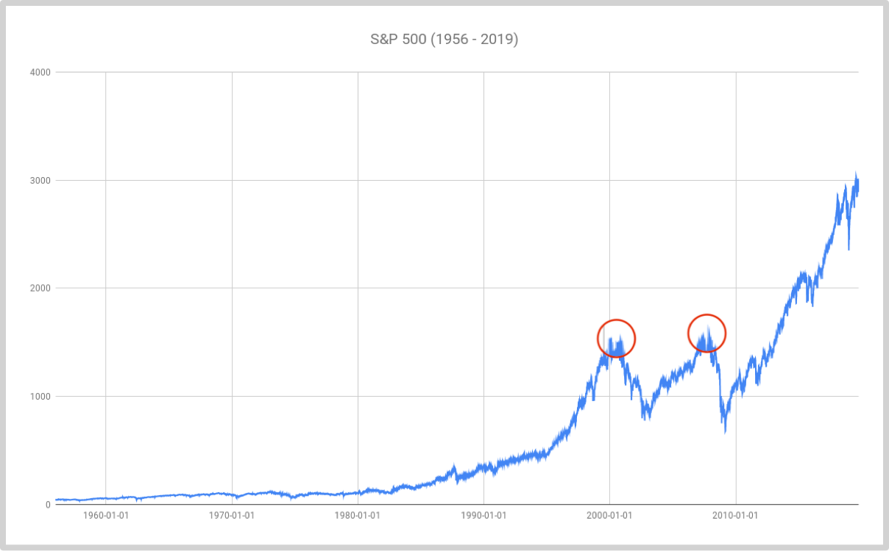

Let's take another look at the historical price chart for the S&P 500. The two red circles indicate the peak of the Internet bubble in 2000 and the peak of the housing bubble that led to the financial crisis in 2008. If we were living in the world of 2000 to 2003, it would seem to be a terrible winter for the Internet, with companies going bankrupt and dissolving. From our vantage point in 2019, however, we can see that from 2000 to 2019 the Internet grew from being the world of a few to being everyone's world. According to the World Bank, in 2000 only 1.8% of people in China were online; by 2019, WeChat --  just one app -- had over [1.1 billion users](https://new.qq.com/omn/20190516/20190516A0AY8B.html). This is the story of the Internet in China -- from 1.8% of the population using the Internet to 70% of people using just one app in around 20 years. Long-term trends can take a while, but they are quite powerful!

For regular investors, even if we entered the market at the height of the bubble in 2000, looking back after two full cycles, in 2015, our entry point still looks like a "low" price. It turns out that the secret to "buy low, sell high" is quite simple:

>Wait for a long time after you buy before you sell.

So is the popping of the AI bubble a good thing or a bad thing? It's hard to say for others, but for regular investors a bubble popping is always a good thing. In fact, **the popping of a bubble may be a great opportunity for a regular investor to enter the market.**

If we look back over history, industries representing all great trends went through bubbles. The difference between the tulip bubble and the Internet bubble was that, while tulips were not completely without value, there was no way for their value to grow sustainably. The Internet, however, had a value that could grow over time. All the way through the Internet bubble the Internet was growing, creating value, and changing the world. 

Why do all great trends go through bubbles? The best explanation comes from John Fisher's [Transition Curve](https://www.ucd.ie/t4cms/Transition%20Curve%20Cranfield%20Article.pdf): 

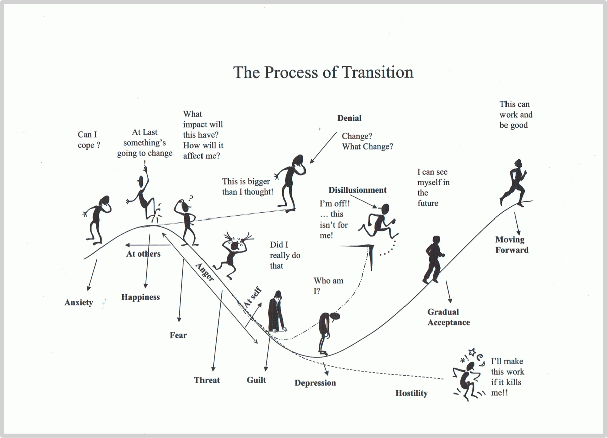

When going through a transition, after some initial anxiety, people feel happy because they think that, "At last something's going to change!" But then they often begin to experience a myriad of negative emotions. Some people deny the negative emotions, and then crash later on, while some slowly fall into feelings of fear, guilt and even depression. While some eventually give up, others slowly begin to accept and adapt to the change. But this only happens after a long process.

Major trends, which become apparent after many years, must initially go through the process of acceptance described above. The first crest in the curve is the cause of the bubble, and the ensuing trough is the reason for the bubble bursting. This is shown most clearly in the markets, because the market price at each moment is a representation of everyone in the market's collective understanding of an investment. When people are feeling disillusioned, the bubble pops.

So, contrary to what most people think, the popping of a bubble quite possibly represents opportunity. Whether or not there actually is an opportunity depends on whether or not the object of the bubble has long-term sustainable value and growth potential. If it does, then there is an opportunity. It's possible, though, that bubbles may continue to occur until its value has been fully realized.

After reaching an all-time high of \$19,800 in December of 2017, bitcoin entered a long bear market. As of October 2019, it remains in a bear market, with its price less than 43% of its all-time high. But is the popping of this bubble different from the popping of previous bubbles in the bitcoin market? As of October 11th, 2019, bitcoin had been pronounced dead [337 times](https://99bitcoins.com/bitcoin-obituaries/) since its inception. Each short bull market has been called a bubble, and they have all popped, but the popping of the bubble in 2017 has one difference from previous bubbles:

>No one denies bitcoin's value. 

This is an extremely important, if subtle, difference. I have a very simple, direct, brutal and effective way to determine if a trend has been established: 

>Don't look at how many people have already accepted it, look to see if most people can no longer deny it.

**Undeniability** is an important sign of an established trend. It doesn't matter whether or not they understand it, or whether or not they accept it. If they can't deny it, then the trend has basically already "filled up the bubble". This is the best signal for regular investors to decide when to enter the market. This is why I didn't introduce BOX, my no-load, no-management-fee blockchain ETF, until July of 2019, even though my thinking about and designs for a blockchain ETF began in 2015.

It's important to point out that most novice investors fall into the trap of "looking for the next...". Actually, very few people succeed by choosing carefully and holding over the long term (whether through regular investing or not), and the vast majority of people never make deep macro observations from a long-term perspective, but everyone is jealous of those who have already succeeded, so they can't help but think:

>If only I had also chosen correctly that early!

But it's hard for that thought not to evolve into this next thought:

>I also want to find an investment that I can get in early on!

This is a dangerous thought, especially for novice investors! The problem is, the more of a novice one is, the stronger this thought is. Just ask yourself, have you had this thought? Then ask yourself again, didn't you have this thought as soon as you started investing? Doesn't this thought always make you feel anxious?

There are lots of details that those who are about to fall into this trap don't know. For instance, there are actually very few major trends that will really change the world. Also, if a new major trend does appear, it will probably be years from now, rather than right now or in the immediate future. More importantly, the development of a great trend that has already been identified will continue for a long time with increasingly rapid growth. Actually, "this one" is much more realistic than "the next one".

If we're able to grab on to one major trend in our lifetime, we're already very lucky!

### 2.5 The Trend Within the Trend

Choices are the most important thing, especially in investing. If we review what we've gone through so far, we have already made many choices:

> * One or everything (global)
> * The best parts (regions)
> * The best parts of the best parts (sectors)
> * A combination of the best investments in the best parts of the best parts

It's a lot of decisions, but they are easy to summarize. All of them are decisions about **trends**. Not choosing just one investment, but stepping back and choosing to invest in everything, is done in order to reduce risk and **keep up with the global trend**. In this case, *alpha* is zero. Choosing the best parts of the whole is done in order to find the parts that are developing the fastest, and in doing so create positive *alpha*. Choosing the best parts of the best parts is done to create even higher *alpha* by following trends. Finally, choosing combinations of investements in the best parts of the best parts is pursuing the same goal: first reduce risk, and then see if it is possible to increase *alpha*.

In order to choose our combination of investments, the most simple, direct, brutal and effective principle is this:

>Match the sector's development trends.

Below, I will take BOX as an example, because it is a combination of investments that was chosen through this process.

> **Risk Warning** 

> The strategy of regular investing is objectively correct, but it is impossible to remove subjective judgement from the choice of investments for regular investing. So the choice of investments for regular investing is the responsibility of each investor. Each investor must use their own money and time over the long term to take responsibility for their own choices. Please be cautious.
>
> This section is primarily about how I chose BTC, EOS, and XIN to be the components of BOX, and it necessarily contains some of my own subjective judgements. You must use your own objective understanding of the objective world to choose your own investments.
>
> **Conflict of Interest Notice**
>
> * I am a long-term holder of BTC (from May of 2011)
> * I was an angel investor in BlockOne, which developed EOS (May of 2017)
> * I was an angel investor in Mixin Network (October of 2017)

After eight years of observation, thinking and practice, I think that blockchain technology has a development path that is slowly becoming apparent: 

>Trusted ledger (BTC) → Trusted platform for code (ETH/EOS) → Trusted execution environment (Mixin) → Trusted hardware (?) ...

[Bitcoin](https://bitcoin.org/) was the world's first blockchain application. At its core it is a open, transparent, immutable, distributed, trusted ledger. Projects such as [Ethereum](https://www.ethereum.org) and [EOS](https://eos.io), which came along later, have the goal of becoming a blockchain application platform, which is to say that application code can be written to and executed on an open, transparent, immutable, distributed, trusted ledger. Putting a ledger on a blockchain allowed for a trusted ledger, and putting application code on a blockchain allowed for trusted code. [Mixin Network](https://mixin.one) combines a Trusted Execution Environment (TEE) and a Directed Acyclic Graph (DAG) to create an open, transparent, immutable, distributed digital asset storage network, or a trusted execution environment. Maybe in the near future we will also see trusted hardware.

The reasons for not choosing Ethereum are technical. It currently uses a [Proof-of Work (PoW)](https://en.wikipedia.org/wiki/Proof_of_work) consensus mechanism, and this type of consensus mechanism, which measures confirmations in minutes, is fundamentally unsuitable for an application platform. Ethereum's experience over the past three years has shown that this flaw cannot be resolved in a PoW system. Even if Ethereum switches to a Proof-of-Stake (PoS) system, it will necessarily require a hard fork. Ethereum already underwent a poorly considered hard fork in 2017 that gave birth to Ethereum Classic, which has no clear use case. All of this is to say that investors in Ethereum are faced with a great amount of risk.

There is one final reason why I chose these investments. From inception until they are widely accepted, almost all technologies go through the following three stages:

>Inception → Adoption by businesses (2B) → Adoption by individuals (2C)

From this perspective, EOS is a blockchain platform for businesses, and Mixin Network's first dApp, Mixin Messenger, is a platform for individuals. One of Mixin Messenger's most important components -- in fact it is a base-layer feature of Mixin Network's public chain -- is a distributed, multi-coin wallet with the best user experience in the industry. 

Furthermore, these three investments have reached the "undeniable" stage. Of course they haven't been accepted by everyone, but no one can deny their value. This is the best time for regular investors to enter the market.

The figure below shows the price change of BOX, BTC, EOS, XIN, and the profit change of investing BOX regularly (daily):

> Note: [click this link to view the data](https://github.com/xiaolai/regular-investing-in-box/tree/master/data)

Let's take Odyssey, the no-load, no-management-fee stock ETF that will be issued in the second half of 2020, as another example. As I mentioned in a previous chapter:

>I agree with Masayoshi Sun's point of view, and believe that in the foreseeable future AI will be the best industry. However, my point of view is slightly different. For instance, I believe the following: 
>
>>No matter how good the algorithm is, it needs data to feed it. Public companies who have large and growing amounts of user data already have sufficient profit-making ability. If in the future algorithms are large trees, then growing amounts of data are fertile ground. Without fertile ground, the trees can't grow. Most algorithm companies will in the end be used by large companies with data.

The main point is in this sentence:

>Most algorithm companies will in the end be used by large companies with data.

This sentence is making a judgment about an obvious trend that is itself in accordance with the trend. In this sector, this will definitely happen, so we should be prepared in advance.

There has long been debate in the investment world about whether *alpha* -- results that beat the market -- actually exists, even though rare investors such as Warren Buffet, Joel Greenblatt and Ray Dalio have consistently beaten the market over the long term. There's a joke that shows the silliness of blind adherents to "efficient market theory":

>A student saw a hundred dollar bill on the ground and exclaimed to his professor, "Look! Is that a hundred dollar bill?" The professor didn't even deign to look, saying, "That's impossible! If it were really a hundred dollar bill, somebody would have picked it up a long time ago."

If the market were 100% efficient, then *alpha* could not exist. The problem is that, if we look at any given moment in the market in isolation, it's 100% inefficient. Price and value sometimes matching up doesn't mean anything -- a broken clock is right twice a day! If we put all of the individual moments back together, then over the long term the market should be efficient, but how long is long term? No one knows. If we look at it from the perspective of a regular investor, after two full cycles, the variance between the current price and the historical price at any given moment will seem even greater.

Obviously, I believe that *alpha* exists, and I'm always thinking about how to find better strategies to create it. If you do well, *alpha* is positive; if you do poorly, *alpha* is negative. As a regular investor, your final results can be described by the following formula:

>**p = δ + α - γ**

**p** represents your final performance. **δ**, or *delta*, the fourth letter of the Greek alphabet, represents the performance of the overall market. **γ**, or *gamma*, the third letter of the Greek alphabet, is borrowed from [a concept](https://www.morningstar.com/content/dam/marketing/shared/research/foundational/831611-GammaEfficientPortfolio.pdf) introduced by Morningstar in 2013. My definition of *gamma*, however, is slightly different. Here, *gamma* refers to returns that you would have gotten if you hadn't made mistakes. This is an extremely important and interesting concept, and it is one of the core concepts explored in Part Three of this book. 

>**β**, or *beta*, the second letter of the Greek alphabet, refers to the correlation between your returns and overall market returns. When *beta* is 0, they are completely uncorrelated. For instance, if you "regularly invest in US dollars", then your returns will be completely uncorrelated with the stock market. When *beta* is 1, your returns are 100% correlated with the market. In our equation, **p = δ + α - γ**, *delta* is equivalent to a *beta* of 1.

For regular investors, all *alpha* comes from careful decisions that are made before starting to invest. Regular investors are lucky in that once they start investing they don't need to worry about things like choices, adjustments, or other issues that keep other investors up at night. 

As you have seen, the choice of investments for regular investing doesn't require many tactics or smarts. As long as you get the process basically right you should be okay. However, the difficult part of being a regular investor is that even before you start you have to be sure that you have made your choice and will stick with it over the long term. This is probably the best example I can come up with of how something can be "simple but not easy".

## Part Three: The Process of Regular Investing

Your final returns will match up with this equation:

>**p = δ + α - γ**

In this equation, *gamma* (γ) will always be positive, because all people make mistakes, and they all make the same mistakes...

### 3.1 Winning Without Fighting

In his book, [*The Success Equation: Untangling Skill and Luck in Business, Sports, and Investing*](https://www.amazon.com/dp/B00A07FR4W/), [Michael J. Mauboussin](https://en.wikipedia.org/wiki/Michael_J._Mauboussin) shared the following image:

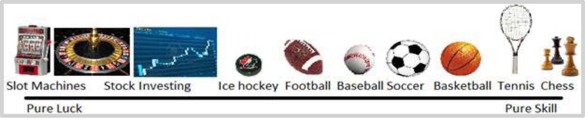

Activities on the far right, such as chess, depend 100% on skill, and there is essentially no luck involved. Activities on the far left, such as playing slot machines, depend 100% on luck, and there is essentially no skill involved. Most of the rest of the activities in the image depend on some mixture of luck and skill. So in most situations, if you want to be hugely successful, you have to be more skillful than others and also get lucky. Investing, however, is on the left side of the picture, implying that luck is more important than skill. In fact, luck is much more important than skill, which is why so many smart people end up being unsuccessful in the trading markets.

However, since there are many different types of investing, we need to slightly adjust Mauboussin's placement of investing in the image. For example, long-term holding and frequent trading are clearly completely different. Also, carefully selecting assets to hold over the long term is generally acknowledged to be a successful strategy. If someone doesn't believe this, just show them [the chart of the S&P 500 over the past several decades](https://docs.google.com/spreadsheets/d/1RsmiifuZajR_POx1zO_--qUcOgwb7tABNQpT-O69Ryk/edit?usp=sharing). Regular investing is at its core simply an improvement to the strategy of carefully selecting assets to hold over the long term. Since it hardly depends on any luck, this type of investment should actually be on the right side of the image.

Regular investors only do one thing:

> Buy. 

Regular investing seems so simple that most people will initially doubt its effectiveness. They think that making money is so difficult that there must be some sort of advanced secret. They say, "That's impossible. How could it be so easy to make money?" When faced with the simple and the complicated, people always want to choose the complicated, because they mistakenly assume that if something is complicated it must be more advanced.

But please take note: **the power of regular investing comes precisely from the fact that it only involves doing one thing**. This is because doing only one thing means that regular investors have no room to make mistakes by doing other things, which ensures that *gamma* is 0. All you have to do is buy. In the future you will understand that doing other things is a mistake that may greatly increase *gamma*. 

What about people who think they have all sorts of tricks? If we look at it logically, we will see where their weaknesses are.

For example, we know that regular investors only do one thing: buy. And those with lots of tricks? They want to carry out the well-known secret strategy of "buy low and sell high", so they need to buy when they should buy, and then sell when they should sell. The problem is, when should they **really** buy? They don't know for sure, and each time they buy it's only when they **think** they should.

To take it a step further, these frequent traders are missing a key point: in order for their strategy to work, being right just once isn't enough -- they have to be right **twice**. They must buy when the price is really low and sell when the price is really high. It's the combination of these two trades that will produce the result they're hoping for. If they only get one of the steps right, their effort was all for naught. 

If they were able to be right every time, buying when they should and selling when they should across multiple trades, then that would be great! But without help from some higher being, they've basically got about a 50% chance of selling when they should buy and buying when they should sell. They just added one thing (trying to buy low and sell high), and their chances of success have dropped from 100% to 25%.

Regular investors are different. Each time they buy they are "buying low", because, if they eventually decide to sell after two or more full cycles, the price that they initially bought at will always seem cheap. See? That well-known secret of "buy low and sell high" is always working for regular investors.

Frequent traders are definitely not willing to concede this point. "How could I have a 50% chance of making a mistake?!" Alright, let's say you have an 80% chance of being right. Actually, you have to be right twice in a row, so your chances of success are only 80% x 80% = 64%. That's still much lower than 100%! Furthermore, if you have actually tried investing using your own money, you know that being right 80% of the time is incredibly unlikely. If you're right even 60% of the time you can be considered an expert! And if you're right 60% of the time, your chances of being right twice in a row drop to 36%. This explains why the vast majority of investors end up thinking that every action they took was wrong. Once you understand that short-term price movements are an unpredictable ["random walk"](https://en.wikipedia.org/wiki/Random_walk_hypothesis), you will understand why the chances of success are really 50% x 50% = 25%. No more no less.

But we're not done yet! Another hidden and serious detail has been been left out. Frequent traders don't understand that what they are depending on is **judgement after the fact**. Putting aside whether their judgement is correct or not, by the time they realize something, and think, "Oh, this must be an upward trend", they've already missed a portion of the rise in price. And by the time they realize, "Oh, this looks like a downward trend", they can't avoid having participated in some of the drop in price. 

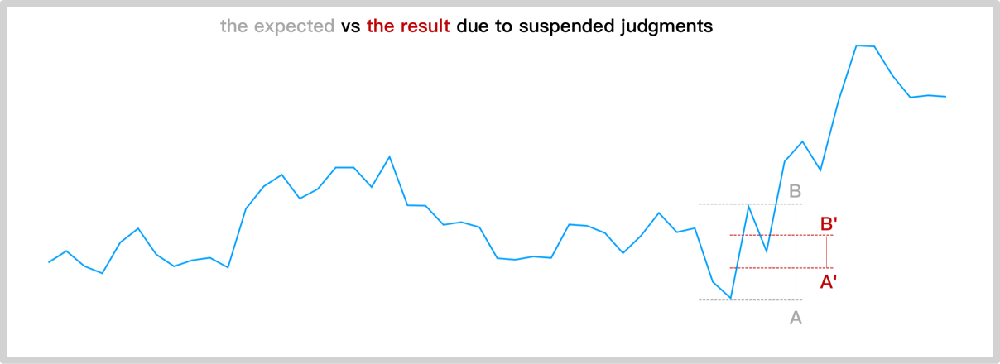

This phenomenon is easy to see in the picture above. Even for the 25% of the time that they are right twice in a row, they actually only make about a third of the profit that they think they should. In their imagination, they buy at A and sell at B, but because their judgement of the short-term trend is actually made after the fact, they actually buy at A' and sell at B'.

>Just as an aside, the core problem with [momentum investing](https://en.wikipedia.org/wiki/Momentum_investing), which many people seem to fall in love with, is basically the same. Since you can only base decisions on judgments after the fact, even if you do everything right your gains are still smaller than you had imagined. 

But there's still more! Another detail that must be considered is that the chance of guessing right is actually much lower than 50%, because in addition to **going up** or **going down**, the price could **stay the same**. So our odds of guessing correctly are actually 1/3 instead of 1/2, and our chances of guessing correctly twice in a row are even more startling: 1/3 x 1/3 = 11.11%...

Even worse, these traders don't just have one more thing that they do, they have tons of things that they try to do! For instance, not only do they trade frequently over the short term, they also switch between different investments. It's already very unlikely to make one correct decision to switch from one investment to another, and yet they switch frequently! Even if they're likely to be right 80% of the time, if they switch four or five times their chances of being successful drop below 40%.

Those who constantly research all kinds of investment tactics are even worse off. They read a random investment guide or listen to an investment lecture and are as excited as if they'd reached enlightenment. They can't wait to try out each new strategy. In other fields, this eagerness to find and try new tactics can be an asset, but in investing it can be deadly. Most investors end up being defeated by this sort of behavior, because the price of experiments in investing is so high!

This is why most investors who are truly able to reflect on their behavior after some time in the market resign themselves to accepting the following fact:

>Everything I tried to do was wrong.

Their conclusion is not incorrect, because the more things they did the more likely they were to be wrong, and it all happened without their being aware of it. They didn't know that all of their short-term trading strategies depended on luck; they didn't know whether their strategies were really effective; they didn't know that they had to be right twice in a row to be successful; they didn't know that they were missing two thirds of their potential profits because they were making judgements after the fact; and they definitely didn't know that there is a cost to turning even correct knowledge into action. In the face of these factors, even the fees that Warren Buffett has called "vampires" -- because they can kill your returns -- don't seem so scary.

Behavioral economist [Meir Statman](https://www.scu.edu/business/finance/faculty/statman/) once referred to a Swedish study which showed, based on figures from 19 stock exchanges, that accounts which traded frequently lost an average of 1.9%-4% per year. A [paper](https://papers.ssrn.com/sol3/papers.cfm?abstract_id=219228) by Brad Barber and Terrance Odean showed that men traded 45% more frequently than women, and that men had 1.4% lower yearly returns. Single men traded 67% more frequently than women, and had 2.3% lower returns. A study by [Vanguard](https://investor.vanguard.com/corporate-portal/) discovered that the returns of accounts that frequently changed strategies lagged far behind those of accounts that never changed strategies (see Chapter 2 of Daniel Crosby's [*The Behavioral Investor*](https://www.amazon.com/dp/B07HH99WH8/)).

Based on the figures above, frequent traders will likely have a *gamma* of at least 2%, whereas, had they just bought and held, their *gamma* would have been 0. Don't underestimate this 2%, because over 30 years a *gamma* of 2% will cost you 45% of your returns! So we can see that regular investing is the best strategy for **winning without fighting**.

### 3.2 Don't Miss It!

October 19th, 1987, is known as "[Black Monday](https://en.wikipedia.org/wiki/Black_Monday)". On that day the Dow Jones Industrial Average suddenly crashed. It had risen 38% since the beginning of the year, but that day it dropped **22.6%**, and people around the world went into a panic as they watched the crash live on television. Before this, never had so many people watched such a disaster unfold on live television.

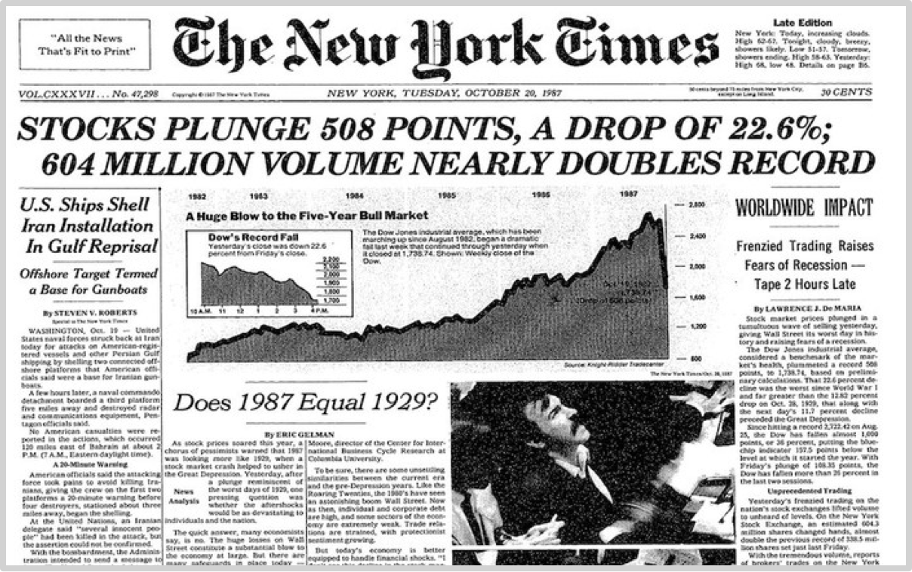

The Black Monday crash, which started in Hong Kong and spread to the rest of the world, reminded people of the stock market drop of October 28th, 1929, which also happened to be a Monday. More than twenty years after Black Monday, on September 29th, 2008, following the popping of the housing bubble, the stock market crashed again, setting off the 2008-2009 financial crisis. It was also a Monday.

If there is a heaven there is also a hell. Or, to put it another way, without the existence of such a terrible hell, people wouldn't have such a yearning for heaven.

People can't help but think, "Wouldn't it be great if I could successfully avoid the worst days of the stock market?" It wouldn't just be great, it would be fantastic! In his 2009 paper "[Black swans, market timing and the Dow](https://pdfs.semanticscholar.org/9c64/3d7ed23a1ecdb862a169ff8654e9d1fd15ef.pdf)", IESE Professor [Javier Estrada](https://www.iese.edu/faculty-research/faculty/javier-estrada/) calculated that, if you had been able to avoid the **ten** worst days in the market from 1900 to 2006, your returns would have increased by **206%**!

Of course, I hope you've also realized the following fact: there is no way to successfully avoid all of the worst days. It's just like how there will always be some rainy days when you forget to bring an umbrella.

Even if you actually were able to avoid all of the worst days, you would be faced with another uncomfortable fact:

>The best days often fall very close to the worst days. 

If you really avoided all of the worst days, then you would almost certainly also "avoid" some of the best days. In the [following chart](https://theirrelevantinvestor.com/2019/02/08/miss-the-worst-days-miss-the-best-days/) from *[The Irrelevant Investor](http://theirrelevantinvestor.com)*, the red dots mark the worst days, and the green dots mark the best days. 

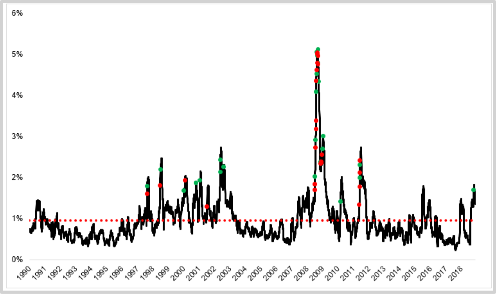

According to [statistics](https://www.businessinsider.com/cost-of-missing-10-best-days-in-sp-500-2015-3) from JP Morgan, *six* of the ten best days in the stock market occurred within two weeks of the worst ten days. Now, if you missed the best ten days of a ten year period, what would the influence on your returns be?

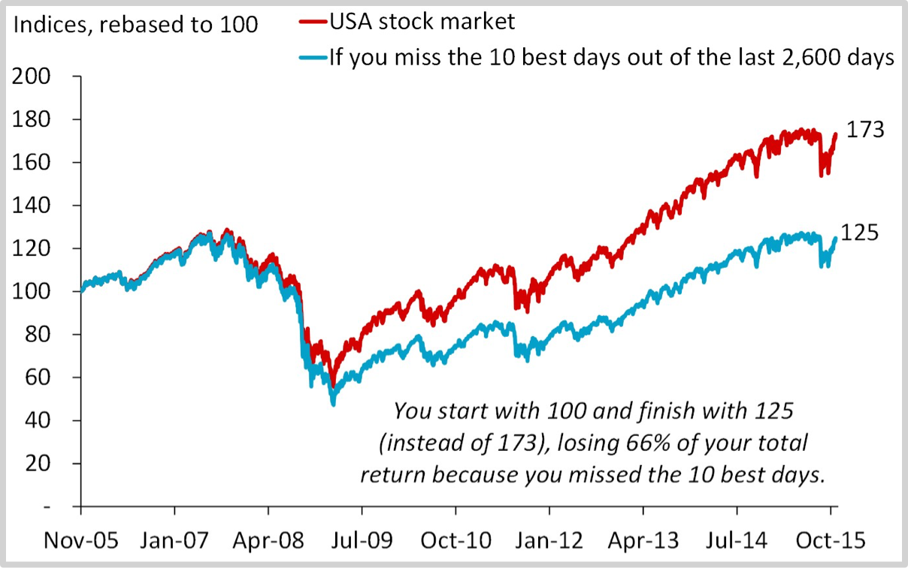

If you missed the best ten days, you would lose *66%* of your returns, which is to say that your *gamma* would be 66%. If you hadn't made mistakes, that 66% would be yours! Missing the best days has very serious consequences! As we can see in the following chart, if you started investing in 1990, but missed the best 25 days, your returns would be worse than a five-year treasury bond.

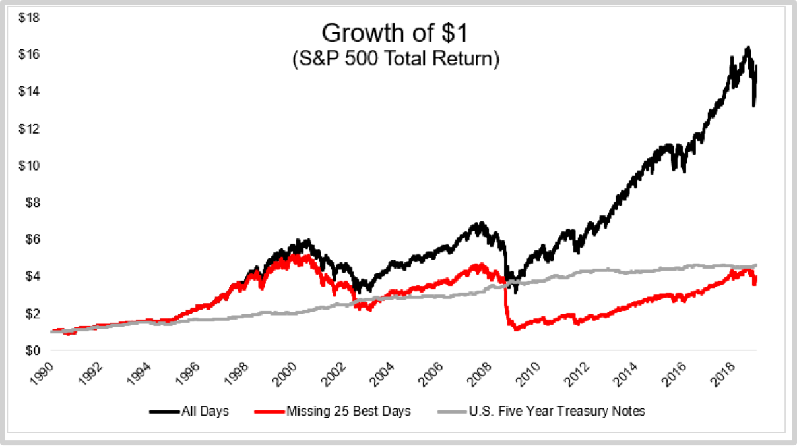

So, what should we do? We should do nothing! Never underestimate the power of the Daoist concept of "doing nothing". Actually, it's hard to find a better example than the the trading markets to illustrate its power.

Scary headlines attract more eyeballs, so the media makes a bigger deal of large price drops than it does of large increases. The media always prefers to report bad news instead of good news. Aside from the fact that bad news attracts more viewers and readership, reporting bad news is also a better fit for the media's self image. After all, if the media reports good news about a person or company, people tend to suspect that they are kissing up to someone. The April 2017 event on the United Airlines flight (bad news) was widely reported, and stories about Warren Buffett losing \$20 million on his United stock (bad news) were all over the place, but no one wrote an article about how Warren Buffett's overall airline stock holdings rose by more than \$140 million that day.

Frequent traders always seem to make a big deal out of nothing. This is understandable, because they are always looking at price fluctuations, so their mood fluctuations are much more extreme than long-term holders. Whenever prices go down, you will see them in chat groups and forums all over the Internet screaming, "It's crashing!" But when the price goes back up just as much, they seem to have disappeared. Why is this?

Behavioral psychologists would explain it this way: people hate loss, and the pain of losing a dollar is much greater than the pleasure of gaining a dollar, so even when the price goes up just as much, those people don't get as excited. This explanation makes sense, but I also have another more realistic explanation:

>The people running around screaming "crash!" can't handle the price dropping. They were almost certainly so terrified that they sold all of their holdings after the price dropped. When they price went back up, they'd either lost all of their money or exited the market, so they didn't have anything to get excited about. Just like in a ghost story, it's as if they were screaming in another world, and the people in this world had no way to hear them.

The vast majority of people who jump into the market for the first time don't understand investing strategy. Actually, they don't have any strategy, and their reason for entering the market is that they have seen the good days that others have had. But the core reason why most people end up quietly leaving the market is that there are always more bad days than good. The reason why the market still goes up in the long term, despite having more bad days than good, is that, in aggregate, the gains of the good days greatly exceed the losses of the bad days. The problem is that most people have a natural tendency to want to make decisions based on current events, and it's only the few people who have received good education about investing and practiced it over the long term who are able to truly gain the skill of macro observation based on a long-term perspective.

Success in regular investing depends primarily on the following factors:

> * the careful choice of an investment;
> * the complete execution of the regular investing plan.

Regular investing is an excellent strategy. It's simple, direct, brutal and effective. However, it's rare to see people become successful by using it. One reason is that novices who have just entered the market are often unable to choose the best investment, so in most situations the best they can do is blindly follow the advice of truly successful investors who have shown excellent returns over the **long term**. They know that this is the only way for them to get more *alpha*. Unfortunately, those who choose to do this also have an inherent weakness, which is that, because they are actually ignorant, they can't be resolute. It's just like when someone is driving and always feels like their own lane is moving too slowly, so they switch to the other lane, but then find out that their original lane was actually the fastest. 

Since all that regular investors do is buy, they definitely experience all of the bad days, including the worst days. However, precisely because of this, they also don't miss any of the good days. Again, the reason regular investing is effective is that it is naturally 100% in accordance with reality.

### 3.3 Investing is Not Normal Business

Most investors do not realize until very late in the game that investing is vastly different from other types of business. Most investors, like normal businesspeople, love to use the concept of "cost". Every day they compare the present value of their assets to their "cost", and determine their gains or rate of return. Doing this has a strong effect on the fluctuations of their mood.

Most businesses that we see in daily life do calculate their gains in this way. For instance, when starting a restaurant you have your setup costs and your daily expenses. Your setup costs must be amortized over time, and those costs and your daily expenses must be subtracted from your daily revenue to determine your profit. If your business does better and better, one day you will have accumulated enough profits to open up a new restaurant, and you will be very excited, because if things keep going that way you will be able to continue to expand.

The subtle difference between investing and normal business is that investing doesn't have setup costs, and it doesn't have daily expenses, unless you trade multiple times each day and incur a lot of commissions.

The money that you use to invest should not be considered to have a cost. It's okay to borrow money to do business, but borrowing money to start investing is definitely a mistake. People who borrow money to start investing are asking to fail. In fact, they've already failed, they just don't know it. Stay away from them.

Money that has a cost can turn any good investment into a grave. The most common example is borrowing money to buy a house. Real estate can often be a good investment. For example, if you already have enough money and don't need to borrow money from a bank. The problem is that 99% of people don't have enough money to buy such a large asset with cash, which gives banks an opportunity to make money. Please be aware that real estate really isn't an opportunity for the average person to make money. The banks hire the best actuaries, and they design terms under which they can only make money, so people end up spending twenty or thirty years and the price of two houses to buy one house. Why is it always twice the price? Why are the terms basically the same around the world? Because the actuaries set them up so that when a person buys one house the bank earns the price of the house! Real estate is very illiquid, partially because most people live in their house, and if they sell it they won't have anywhere to live. Even if the price looks like it's always going up, it can't go up forever, and when it finally crashes (for instance, dropping over 25% in one year during the mortgage term), the "investment" will have become a "noose".

In 2018, during the long bear market in the blockchain asset market, there was a depressing phenomenon:

>The more serious a team was, the earlier they went bankrupt...

A year is certainly short term, but in just a year these serious teams had two bad things happen at once. Speculators had already sold their tokens at a good price, and scam projects had not only done this, they also had no daily expenses, so they were sitting on a beach somewhere enjoying their ill-gotten gains. Meanwhile, serious projects saw themselves as long-term holders, so they hadn't sold their tokens except to pay expenses, and they also were working hard on their projects, so they had to pay a steady and perhaps growing amount of expenses. Prices continued to decline in the bear market, and at the end of 2018 they were again cut in half. But these projects still had to pay fixed expenses, and they had to sell more and more tokens to do so. Many serious projects had the same fate -- they worked incredibly hard to keep things going but eventually ran out of resources.

Money that comes with a cost is scary, but it's just like a small ghost. Money that has a limited term of use is terrifying, like the grim reaper. In Chapter 4 of Part One I wrote this:

>The riskiest job in the world is President of South Korea, and right after that is the fund manager who guarantees immediate redemption of capital.

Immediate redemption means that at any given point in time, you **must** be able to access a certain amount of money **immediately**. People **die** because of this. I'm not exaggerating or using a metaphor -- when I say die here I mean die. It's cruel to use people who have lost their lives as an example, so I won't give examples here, but whenever there are extreme movements in the market, you will see this sort of news story.

For regular investors, investing is even more different than normal business. If we must calculate the cost of their investments, **their true cost, relatively speaking, is their time, because the time that they invest is much more important than the money that they invest**. In the previous chapter we saw how overall time invested is more important than choosing the right time. You must be invested every day, not missing the bad days and definitely not missing the good days.

**The greater and more important cost is time**. This concept can change how investors feel, and thus change their decisions and results. When you think that your only cost is money, it's hard to resist the impulse to "get your costs out". But once you know that your main cost is time, you will understand that you can't get back the time you have already invested.

More importantly, this understanding will get rid of your impulse to "take profits", because you know that doing so will greatly reduce the impact of your future time! The main cost for regular investors is the time required to be in the market for two or more full cycles. In traditional stock markets, this is around twenty to thirty years. In blockchain digital asset markets, this is around five to eight years. As a regular investor, you know that your results depend on your overall time in the market, so your thinking is quite different from most investors. You know that giving up your time, even if it seems like just a little today, has a huge impact when viewed from the perspective of having been invested for two or more full cycles. It's hard for you to be so cruel to yourself.

There is another important thing to remember: 

>Many people underestimate or ignore the possibility of something unexpected happening in their lives. 

But life is actually full of unexpected events, so your living costs are always much higher than your worst estimates. How much money should you use to invest? People often ask, "Is it enough if I invest 10% of my income?" For this question, though, often using percentages won't help us reach a meaningful conclusion.

Imagine that your money is an egg.

> * The yolk represents your daily expenses.
> * The egg white represents the savings you have prepared to deal with risk.
> * The shell represents the money you have to invest, which can stay in the market no matter what over the next two full cycles.

A lot of people fail at investing not because of their intellect, confidence, or resolve, but because they underestimate the cost of unexpected events in their lives. That is to say, they fail to imagine that the egg white is so thick. For instance, their tooth falls out, a relative comes down with a terminal illness, they are in a car accident, or their child makes an expensive mistake. There are countless examples, but suffice it to say that unexpected events come in many shapes and sizes, and they can be very expensive.

This explains why it doesn't help to talk in percentages. For example, you have \$100,000, and you invest 10%. Then, before one full cycle has even passed, you have an unexpected expense of \$200,000, and your \$10,000 has already shrunk. What do you do?

After being in the market for a period of time, all investors come to the same deep understanding:

>Every time you want to sell an investment for cash the price will always fall. 

What is the cause of this counterintuitive phenomenon? One cause is that bear markets are always longer than bull markets. Also, when you really need money it's usually when it's hard to make money outside of the market, which implies a weaker economy, so it's natural for the market to fall. Another factor at work is that when the price is rising you're less willing to sell. At times like that, longer-term holders don't have a strong impulse to spend. So the greatest losses always come when you "can't help but sell".

You should now have a better understanding of this piece of advice, which you have probably heard countless times:

>Only invest money that you can afford to lose.

Money that regular investors invest should have no cost and no term. You must be able to invest it for at least two full cycles, and you must have enough money set aside to deal with unexpected events. 

This upgrade in thinking is the core reason why regular investors have a relative *gamma* of 0 or close to 0. If money has a cost, *gamma* will naturally rise, and if money has a term, then the potential for *gamma* is unlimited. If preparations for unexpected events are not made, then the potential for *gamma* is not only large, it also cannot be avoided.

### 3.4 The Ability to Continuously Earn Money Outside of the Market

The core of regular investing is the ability of practitioners to make money outside of the market. Regular investors must be able to continuously invest over the long term, which means they need to have the ability to consistently earn money outside of the market over the long term. The money that they earn outside of the market must be able to cover all of their daily expenses and also expenses from any unexpected events. Above and beyond this, the more they can consistently earn over the long term the better. This is the part that is truly difficult. Regular investing itself is so easy that it can be summarized in just one word: buy.

**Selling the same bit of time repeatedly** is the most important upgrade of a person's personal business model, because it's the most basic way to effectively make money while you sleep. In an average lifespan of 78 years, a person only has 10.5 years of work time that they can sell. But if they can make money while they sleep (28.3 years), make use of their nine years of free time, and also use their time in such a way that they are selling it repeatedly, then they actually have income every second of every day. No matter whether they are riding in a car, getting dressed, or spending time with their children, they are always making money. Not only are they making money with at least three times the amount of time as a normal person, they are selling their time repeatedly, so the difference can be huge!

However, most people aren't able to complete this kind of upgrade, and it's true that there aren't many ways to achieve it. Aside from publishing books and teaching online, I haven't been able to find any other feasible methods for myself. Of course, in this Information Age, writing a popular software program is probably an even better way. All of these effective methods are extremely competitive, but that is to be expected given the potential payoff.

Actually, if you can't be the best, it's fine to try to come in second. So, is there an easier way?

The answer is: **sales**. Because, at its core...

>**Sales is buying other people's time and then selling it repeatedly**.

This is the ultimate reason why people who work in sales often seem to have a higher income than those who work in other sectors. They aren't able to use their time to create a popular product, so they can't sell their time more than once, but they are able to repeatedly sell products created by others, and with the help of Internet tools they are able to ensure that the sales process continues even while they sleep. 

As long as you observe carefully, you will come to the same conclusion:

>No matter the company, salaries in the sales department are always high.

In addition to sales being important, there is another hidden reason for this: sales is the easiest work to quantify, so salespeople are the most likely to be paid based on performance.

A key similarity between sales and regular investing is that the choices of what to sell and what to invest in are both very important. What is the best thing to sell? It must be something that people need, and something that requires continuous communication to complete the sale.  We can observe that the highest paid salespeople often sell things like real estate, cars, courses, or insurance. Why is this? First of all, it's because these are all things that people need. But even more importantly, these items require repeated communication in order to complete the sale.

In fact, everyone should focus on their ability to sell, because at the core of successful selling is one of life's most important skills: **effective communication**. Isn't every successful sale an example of effective communication? For a child, convincing their classmate to keep a secret from the teacher is a successful sale. For an adult, convincing someone to fall in love with them is a successful sale, and so is securing a promotion or a raise. The ability to sell is the ultimate skill.

After I graduated from university, my first job was in sales. Actually, even though I've had many different jobs since then, in my view they all had sales at their core. For instance, being a teacher was a sales job, because if the students didn't like me, no matter how correct everything I told them was they still wouldn't pay attention. Writing and publishing books is a sales job, because if my titles don't attract readers they won't even give me a second look. As an angel investor, what is the difference between my money and the money of others? There is none, so why should an entrepreneur take my money and not somebody else's? Because I am better at sales.

What is the core of selling? **Trust.**

Please never think that sales is based on tricking people. People who think like this lack the ability to think long term. Short-term trust can perhaps be gained through trickery, but long-term trust must be built up slowly over time. Trust is valuable because it is so fragile. Just a little bit of carelessness can destroy it. Warren Buffett understands it this way:

>It takes 20 years to build a reputation and five minutes to ruin it. If you think about that, you'll do things differently.

If a client is willing to buy a house, a car, a course, or insurance from you, in addition to the product being truly worth buying, it also depends on their trust in you. At its core, trust is much more important than the product being sold. Without trust, no sale will take place. But trust is so important that excellent salespeople will not be willing to sell bad products. They often ask themselves, would I buy this? Would I sell it to a member of my family? Would I sell it to an old friend? People who lack a long-term perspective find this hard to believe, and they may even think that this attitude is fake, but actually salespeople who have excellent performance over the long term take these questions very seriously, and they benefit enormously from this type of thinking.

Train your ability to sell. It's so important, and can be extremely useful in every aspect of your life. Furthermore, everyone has the chance to train themself to be a good salesperson. The most important thing is that it's an upgrade of your personal business model.

Unfortunately, sales still isn't something that everyone is able to do well. So, taking another step back, is there anything else to do? Of course there is. You can improve your ability to cooperate. Since people rarely take this concept seriously, let's make up a new word to describe it: **cooperability**. Being good at cooperating with others is actually also a small upgrade to your personal business model. It's not an easy thing to do, because increasing your "cooperability" also requires strong communication skills, trust, and being really good at something.

Lots of people are very bad at cooperating. They get quite frustrated, but they always blame their lack of cooperability on the wrong thing: a strong personality, or a bad temper. That's all a mirage, because there is only one reason for poor cooperability: they are not able to do their part well enough. A strong personality or a bad temper is not the reason they can't cooperate well with others. If they were able to do their part well, then others would be willing to cooperate with them even if they had a bad temper. The other party would focus on doing their part of the cooperation well.

You must have a special skill that makes others want to cooperate with you. If you try to cooperate with someone but they are unwilling, the most probable reason isn't that they don't understand your value, it's that you don't have enough special skills to make them want to cooperate with you. It's sad that so many people don't discover that they have no skills until they're over thirty. 

What's most important at this stage? The correct answer seems too obvious: **honesty**. People with no skills are all dishonest in many ways. They are dishonest to other people, and only get by through various guises. They are dishonest with themselves, and their guises sometimes trick themselves. They treat the learning of knowledge in a dishonest way, and never fully believe in the utility of knowledge, so in their studies they always miss a lot of details and end up knowing nothing. All of this leads to the most serious defect, which is that, because they can't help but put all of their attention on the gains and losses and opportunities of the moment, it's impossible for them to have the ability to make macro observations from a long-term perspective.

Another way to improve cooperability is by **not complaining**. The best people to cooperate with are those who never complain. The reason is simple: complaining is useless. People with poor cooperability complain about everything. They complain about the broader environment, they complain about the quality of their partners, they complain about luck, they complain that others aren't being fair, they complain that their family doesn't give enough support... Consciously or not, they are in the habit of using these complaints to cover up an obvious fact: they didn't do their part well enough. If someone is able to truly reject all complaining, then it will definitely cause them to put all of their energy into doing their part, which naturally improves their cooperability.

Life is at its core a trading market. Every principle that works in trading markets also works on the stage of life.

When I look back on my choices from many years ago, the strategies I used to make my major choices were identical to the strategies for choosing investments that I have outlined in Parts One and Two of this book. First, I wanted to go to a place that was developing more rapidly, so I moved from a small border town to Beijing. Which sector was developing the fastest? To be frank, I didn't see clearly enough, because I chose education instead of tech. I had one choice left, and I chose New Oriental, at the time the fastest growing company in the education sector. Afterwards, I followed the steps in this chapter. I worked there for seven years, honestly doing my part and cooperating with others as best I could. I had a strong personality and a bad temper, but I improved my ability to sell, my ability to lecture, and my ability to write. By the time I left, I had upgraded my personal business model, and I was getting better and better at selling my time repeatedly. Once I'd grown my egg white to a large enough size, I started investing. I become a regular investor, and all of my success in the market has been due to one secret: **I've been constantly working hard and honestly to make money outside of the market**.

### 3.5 The Stages of Regular Investing

Almost all traders have fallen victim to the following curse:

>As soon as I bought the price fell...

This isn't just a joke or a case of them being unlucky. It's a fact. The reason is simple: if even an outsider like you has been enticed into the market, then the bull market must be almost over. The vast majority of the time, people enter the market because the price is rising, so "as soon as I bought the price fell" isn't a curse, and it's not just bad luck, it's a common and inevitable phenomenon that almost everybody runs into.

So no matter whether or not you regularly invest, when you first enter the market you'll almost inevitably be faced with a **long slump**. 

I like to read instruction manuals. If you give me something new, I'll be extra happy if it has an instruction manual. Reading instruction manuals can teach us about new features and new ways of using things. It's a great feeling to be able to quickly and fully grasp all of the ways to use a new thing.

Unfortunately, there's no instruction manual for investing. In fact, none of the important things we encounter in our lives have instruction manuals. No one gives us a marriage instruction manual when we get married, and no one gives us a parenting manual when we have children. Of course, when we were born no one gave our parents a manual either, and now that we are grown up our parents are just like us: they still don't have an instruction manual for life.

But humans are different than other animals. Most importantly, we have spoken and written language, so we don't start from scratch when we are born. Once we learn to read, we are "standing on the shoulders of giants".

But if we are able to stand on the shoulders of giants, why do most of us end up living under the heel of giants? The best explanation is that, very early on, most of us gave up on the best strategy, **blindly following**, which we talked about in detail in Part Two. Independent thinking early on may sometimes be a good thing, but more often than not it's bad. This is because independent thinking doesn't have any value in and of itself; it's only truly effective when it's based on broad experience and knowledge. The problem is that early on we lack knowledge and experience! Without knowledge and experience, independent thinking is severely limiting.

Blindly following is particularly difficult for adults, because they've been fighting to think independently for a long time, and it's difficult for them to go back. In this case, a simple trick can be helpful:

>You can think independently, but you must leave your actions on paper. That is to say, you can use a notebook to record your independent thinking, but in your actions you blindly follow.

Outside of investing, you don't necessarily need to do this. But when it comes to investing, you must do this! Investing isn't an area in which you can try things out and make mistakes, because each mistake will lead to the loss of your valuable money and even more valuable time. If it's just an untested, stupid new investing strategy, it's not worth using your money and your life to test it out.

This simple trick is even more powerful when combined with another trick:

>Carefully observe the decisions and results of others, learn necessary lessons and experience from their mistakes, and write them down on paper.

Observe the mistakes of others, see the financial price that they pay, and see how they use their precious lives to test things out. It almost seems like cheating, but there is no better way to broaden your knowledge and experience. One of my favorite pastimes is reading the different points of view that people share on online forums and in chat groups. I take notes and periodically review them. It's been indispensable for my personal development.

The fact that we are likely to enter the market at a bad time, coupled with the fact that slumps tend to last for a long time, challenges one of our stronger inclinations: when we are faced with a loss we have a strong desire to make a change. Our mind isn't designed for investing; it was designed over millions of years to struggle to survive. So at this stage there is only one way to resist the overpowering desire to struggle:

>Cultivate a long-term perspective. 

There was a news story in 2017 about a dispute twenty years prior between two British women. Valerie Vivian wanted to build a new building on her land, but Betty Kelley and her family organized the neighbors to stop her. Their reason for doing so was that the new building would block the view from the Kelley's window. The two families went to court, and Vivian was unable to secure a permit for the new structure.

What did Vivian do after returning from court? She quietly planted a row of saplings on the border between the two properties. After five years, the saplings had grown into a row of small trees. After fifteen years, the fast-growing trees that Vivian had chosen had grown into a twenty to thirty-meter-high wall of trees! The picture above shows Vivian leaving court, this time victorious and smiling, twenty years after the initial dispute. How did she win? She had won twenty years earlier, it's just that the Kelley family had to wait a long time before they realized that they had lost, and lost thoroughly. Vivian, on the other hand, knew every day of those twenty years that she was winning, and it must have brought her more happiness than the average person.

Weather reports are always wrong, but there are some events in the future of which we can be 100% sure. For instance, if you plant a tree it will grow. Regular investors are like this. Their investments are like planting a tree. You might not see much after four or five years, but after twenty or thirty years (or two full cycles), the seeds they planted will have grown into giant trees.

After a long slump passes, a new stage will begin: **the first harvest**.

This stage will be extremely short, but it is actually the hardest to pass through. First, you will discover that your world becomes noisier. In addition to external distractions, you will start to have all sorts of delusions. The most common delusion is that you will feel like you've gotten smarter! Not only that, your perceived intellect will continue to rise along with the price! You will start to speak more loudly, your intonation will become sharper, and everyone around you will agree with whatever you say. You will become more and more confident.

It's good to have a certain amount of confidence, but if you have even a little bit too much your IQ will drop to zero. As you become more overconfident, your IQ will become negative, and you will start to do all sorts of stupid things. Of course your living expenditures will increase, but the most subtle stupid thing you will do is give up your previous long-term investments. Even more insidiously, you will give up your future long-term investments, as you will forget that the investments you give up at this point would have appreciated substantially over the next full cycle. At this stage, people pay the price of an island to buy a luxury car. They think they are throwing away a thousand dollars, but they are actually throwing away ten thousand! Your stupidity at this stage can cause you to lose future earnings that you couldn't get back even if you worked for a thousand years.

When compared with another type of stupidity, however, the stupidity mentioned above hardly counts. At this stage, the few people who have ambition are led by that ambition to make an even stupider mistake: they start to invest like crazy. Their intentions are positive. They just want to make progress, and investment is of course a good thing that can help them do better. Actually, very few people have such a positive attitude. The problem is that their intellect didn't really improve, and even if they have expanded their knowledge it's still not enough, so they end up losing through "skill" all of the money that they made through "luck".

There is a psychological phenomenon that acts as a catalyst here called the House Money Effect. In a casino, gamblers can't help but not see their winnings as real money, and they are likely to be more careless with it. They see the money they brought to the casino as money that they really earned, but they see their winnings as not really theirs, so they have no compunctions about spending it. Sometimes they even feel like they have to spend it. The majority of people, who have no ambition, just spend lavishly, and the few who have ambition make irresponsible investments. 

This stage is the best for strengthening the **ability of doing nothing**. During times like these, doing nothing requires skill! This is easier for regular investors, because they have cultivated the ability to do nothing in the market but buy. Hopefully, it's a habit that they have already developed for a long time. Also, regular investors have something more important to do: make money outside of the market. Furthermore, since the price has risen, they need an even stronger ability to make money outside of the market, so they are working hard to truly improve themselves, and it's hard to have delusions. Actually, the ability to make money outside of the market is the best way to test if a person is truly improving, because outside of the market you are not being buttressed by trends. In the market you compete based on your choice of investment; outside of the market you compete based on your skills.

Once this short second stage passes, you will enter the third, most difficult-to-bear stage: **the second slump**. The pleasure of earning a dollar is much less than the pain of losing a dollar -- this is a bias that all of us naturally have. Like the first stage, this stage is very long, and it will perhaps be longer, since you will experience the second slump from its beginning to its end, whereas, if you were enticed to enter the market by a temporary price increase in the middle of the slump, you may have only caught part of the slump in the first stage.

In this stage your experience of losses will be different from the first stage, because in absolute terms the losses will be much larger. Furthermore, because the size of the losses will have increased, your imagination will also be stronger, and you will find your brain full of the following idea:

>If only...

For instance, "If only I had sold everything in January, I could live in a house three times the size of my current house!" Or, "If I'd only sold last month, my wife wouldn't have anything to argue with me about!" And on and on... Even worse, you will always have other people to compare yourself with: "Look at them, they got out early!"

In fact, if you just change your perspective you can relax. It's as if you steered a boat from a small river into a bigger river. You need to experience again what you previously experienced, it's just that the waves are a little (or a lot!) bigger. You got motion sickness in the small river, and now you feel uncomfortable again. You'll probably vomit a few times in the big river, but you'll eventually get used to it, just like you got used to the small river. You just have to keep reminding yourself that, even if you still have a long way to go, you'll eventually make it to the ocean. The waves are even bigger there, but once again you'll eventually get used to it.

In this stage you must establish the following new worldview: 

>Every endpoint is also a new beginning. Until you die.

Taking the end as a beginning is a basic concept that all people who continuously develop over the long term must have. I was at New Oriental for seven years (from 2000 to 2007), and in 2006 the company went public on the New York Stock Exchange ([NYSE:EDU](https://finance.yahoo.com/quote/EDU)). I experienced what is actually quite a common phenomenon. When a company goes public, many people decide to cash out as quickly as possible and leave, because they are like most people and see an ending as the ending. But what actually happened? 

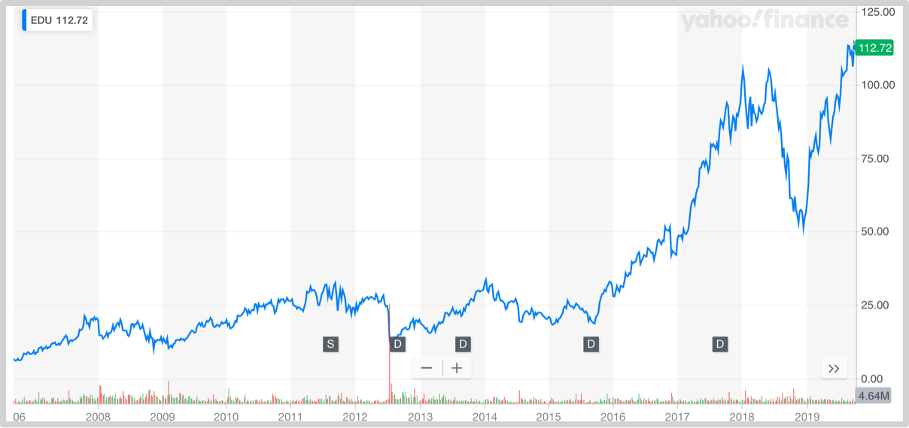

Not taking into account dividends, over the past thirteen years New Oriental has provided shareholders with yearly compounded returns of 26.2%! So those who sold right after the company went public missed out on those returns, and they almost certainly weren't able to match them elsewhere. Even though the stock fluctuated over the past thirteen years, and even "crashed" a few times, it still had better total returns than even Warren Buffett over the same period. And how many people can say they beat Warren Buffett?

Viewed from this perspective, Yu Minhong, my former boss, can be seen as a model. He took each end point as a new beginning and kept moving forward. Over the last thirteen years, and also during the six years before that, I've seen countless people criticize him from every angle that you can imagine. But in fact, from this perspective, none of the criticism had any merit.

Once you make it through this stage, you'll enter the next stage: **another harvest**. This time, you will be entering the ocean. You might feel surprised -- the wind and waves are stronger than both of the rivers -- but you feel calm. For me, at least, I was surprised at how calm I felt. But I quickly discovered that it was normal. If you're like me and what you see every day is people who are still in the rivers but act as if they are experiencing the violent storms of the ocean, you can't help but be calm.

At this stage, there will quite possibly be one thing that keeps you from feeling calm. You may not have found a goal that is worth your continued effort. Imagine that you have all the money you could ever need but you still haven't found what you are living for. It's terrible, isn't it? What I have been most lucky in is that, even before my egg white was prepared, I had found something that was worth doing for my whole life: learning and growing. Many reporters have looked at me funny during interviews and expressed that they find this hard to believe. But I hope you can understand the excitement and joy that can come to someone who clearly knows that they are not particularly gifted, but has been able to constantly improve through long-term, continuous learning. 

Many years ago I discovered a simple principle:

>Teaching is the best way to learn.

So I like to teach, and I have been teaching for twenty years. I've taught tests, writing, entrepreneurship, investment... Teaching is something that I can do until the day I die, and it's something that I love doing. I can always change what I'm teaching, because I always want to learn new things. It's that simple. In my experience, **finding something that is worth doing for your whole life is the best armor a person can have**. Now I teach thousands of students online, and in the future it will be even more. I wake up in the morning, teach for ten minutes, and I am happy. The bigger the projects you work on, the more trouble is involved, but for me there are no troubles that teaching for ten minutes won't fix.

## Part Four: Objectivity, Objectivity, Objectivity!

The key to successful investing is to be completely objective -- about yourself, the world, and every aspect of everything. Any time we are not sufficiently objective, our **gamma** goes up.

### 4.1 We Are Extremely Unreliable

It's easy to despair when looking at research done by psychologists around the world over the years. They have repeatedly shown us one result: humans are completely unreliable, and we make absolutely terrible decisions.

[Daniel Kahneman](https://en.wikipedia.org/wiki/Daniel_Kahneman), who won the Nobel Prize in Economics in 2002, and his research partner, [Amos Tversky](https://en.wikipedia.org/wiki/Amos_Tversky), discovered many years ago that people have an extreme aversion to loss. We've already mentioned several times that the pain of losing a dollar greatly exceeds the pleasure of gaining a dollar. Actually, even the way that we describe something can lead to different choices. 

For instance, [a paper](https://www.ncbi.nlm.nih.gov/pmc/articles/PMC2631940/) by Benedetto De Martino and his collaborators describes an experiment in which participants were told that they had received an amount of money, such as fifty British pounds. They were told that they would not necessarily be able to keep all of the money, but would instead have to choose between a "sure" option, in which they would keep a portion of the money, and a "gamble" option, in which they would either keep all of the money of lose all of the money. The expected outcomes of both options were the same, meaning that the average results of the "gamble", if repeated over time, would be the same as the "sure" option. For each round of the experiment, subjects were split into two groups, with the only difference being that the "sure" option was framed in different ways:

> * Gain frame: you can keep 20 out of the 50 pounds.
> * Loss frame: you will lose 30 out of the 50 pounds. 

Obviously, the results of these two frames are the same, because the subject ends up with 20 pounds no matter what. But since the second frame described a loss, the tests subjects' loss aversion was activated. The key is what happened next: the activation of their loss aversion influenced their subsequent decisions. 

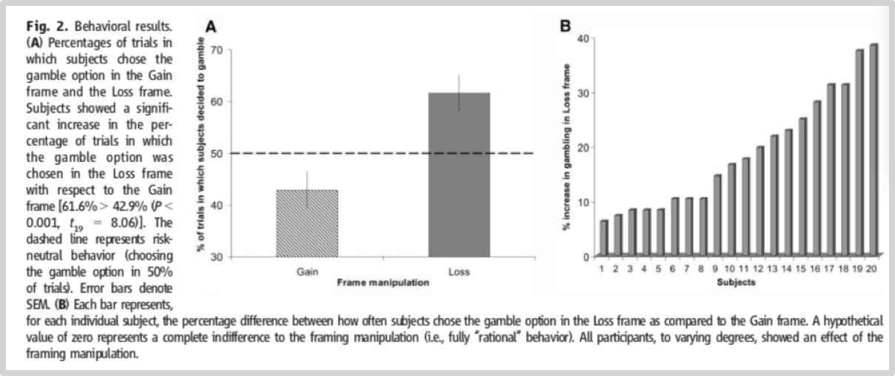

While only 42.9% of the subjects who had been presented with the Gain frame chose to gamble, 61.6% of the subjects who had been presented with the Loss frame decided to gamble. Remember, the amount that participants would keep with the "sure" option was the same for both frames -- the only difference was the way the option was described. Furthermore, this effect was present in all of the test subjects, albeit to various degrees.

It turns out that people take many risks because they are afraid! Or, to put it another way, it turns out that the reason many people take risks is not that they are brave! And furthermore, the thing that they are afraid of doesn't exist...

But we're not done yet...

The most interesting part of the experiment was perhaps the post-experiment interview. Most of the subjects, when directly asked, were unaware of any bias, but 20% of them were aware of the framing effect, and they couldn't really understand why they had made the choices that they did. Their feelings can be described like this:

>I knew what was happening, but I couldn't control myself...

This is really scary. Even when we know what is going on, we still can't control ourselves.

The results of this experiment should leave serious investors like us speechless and terrified. Why? Because we are investing with our own money, not just twenty British pounds. And we're not just investing with the money that we have today, but also with our future money and time, and with the money that we hope our money will make in the future. We have our money, our time, and what we believe to be a correct goal, but now we see that sometimes we may be unable to stop ourselves from making a wrong or even catostrophic decision, even when we know exactly what is happening! Could anything be more terrifying than this? It's like a ghost story or horror movie! Ghost stories are all the same, from east to west, from past to present, and you can sum them up in one sentence: for some reason, the main character sees themself moving toward destruction, but there is nothing they can do, even though they can see it happening, because they can't control themself...

This experiment still wasn't over, though. As the subjects made their choices, the researchers monitored their brain activity using functional magnetic resonance imaging technology (fMRI), and they observed an incredible phenomenon.

This image basically reveals why we can't control ourselves.

The results of the experiment showed that when the subjects were unable to control their loss aversion their amygdalae were extremely active. What are the amygdalae? They are two almond-shaped clusters of neurons in the brain that play an important role in our decision-making, memory, and emotions or moods. They can trigger emergency responses such as the fight or flight reflex when we are faced with danger. The amygdalae are small, but they are extremely important in processing emotions, particularly fear.

If you look back on times when you have felt extremely fearful, you will remember that your fear wasn't just an emotional state, but also a physical one. Your heart rate increased, your stomach felt empty, you felt uncomfortable, and you began to sweat. You felt like your brain was empty, because your brain lacked blood and oxygen. This emergency response of the amygdalae was what doomed the subjects; it was what caused the subject to feel, "I knew  what was happening, but I couldn't control myself". 

Even more disappointing is that we are unwilling to change. When our mistakes are pointed out to us, we become even more stubborn in our mistaken choices. At this point, you're probably thinking, "But I'm not like this, am I?" Allow me to answer for you: you are like this, because we are all like this to some extent. 

Francis Bacon made [the following observation](https://rintintin.colorado.edu/~vancecd/phil3600/Bacon.pdf):

> Once a human intellect has adopted an opinion (either as something it likes or as something generally accepted), it draws everything else in to confirm and support it.

What about about when that opinion is proven wrong? [Nassim Taleb](https://en.wikipedia.org/wiki/Nassim_Nicholas_Taleb) observed the following: 

> “My characterization of a loser is someone who, after making a mistake, doesn’t introspect, doesn’t exploit it, feels embarrassed and defensive rather than enriched with a new piece of information, and tries to explain why he made the mistake rather than moving on.”
>

In *The Behavioral Investor*, Daniel Crosby used the debates over plastic bags and gun control as examples:

> * Making a paper bag takes three times as much water as making a plastic bag; only 24% of people reuse paper bags versus 67% reuse of plastic bags; paper production creates 70% more air pollution than plastic production; it takes 91% more energy to recycle a pound of paper than a pound of plastic.
> * 98% of guns used in the commission of a crime are stolen; over 100,000 people successfully defend themselves with a gun each year; 9 times out of 10 gun owners defend themselves without firing a shot; more people drown each year than have been accidentally shot since 1980; kitchen knives kill ten times as many people each year as assault weapons.

It doesn't matter which side you belong to, the important thing is that we can see how strongly people hold their opinions, and, if we observe carefully, we will be surprised to see how the fierceness of the debate has nothing to do with the facts. It's as if people don't care about the facts -- all they care about is whether they win or lose. Facts and figures can't change people's opinions. If you win, you keep fighting; if you lose, you keep fighting. And if you happen to notice the facts, will they defeat you? No, you'll keep on looking for facts that support your opinion. 

This phenomenon of an opinion growing stronger in the face of evidence that proves it wrong is called "[the backfire effect](https://rationalwiki.org/wiki/Backfire_effect)" in psychology. Researchers have discovered that the backfire effect becomes even stronger when the evidence that contradicts the opinion is slightly ambiguous. For instance, after a relatively uneventful New Year's Day in the year 2000, those who thought that Armageddon was coming at the turn of the millennium didn't think, "Oh, it turned out I was wrong, maybe Armageddon isn't coming." Instead, they thought, "Maybe it's isn't coming right at the year 2000", or "Maybe it has been delayed because we weren't pious enough".

The backfire effect, and its tendency to be even stonger when there is not 100% clarity, is even more obvious in investing. The clearest example is the prognosticator who constantly gives inaccurate predictions. They may have been proven wrong many times, but because there is so much uncertainty in the investing world, they not only don't admit defeat, they double down, saying, "Just you wait! I'll be proven right someday!"

There are so many ways in which we are unreliable. Daniel Kahneman and Amos Tversky started exploring behavioral economics around 1972. We now also have behavioral psychology and behavioral finance. More than 130 common cognitive biases have been identified (most of them are listed on [this Wikipedia page](https://en.wikipedia.org/wiki/List_of_cognitive_biases)), and I'm sure many more will be discovered.

Overconfidence leads to mistakes, protecting our self-image leads to mistakes, the way we talk about things leads to mistakes, our moods lead to mistakes, a lack of rest leads to mistakes, changes in blood sugar levels lead to mistakes, and even sunlight can make us more likely to make mistakes. Furthermore, our perception of risk is always incorrect, our perception of gains and losses is twisted, a lack of information can cause mistakes, and too much information can cause mistakes. The list goes on and on. Even worse, even when we are aware of our biases we still can't control ourselves, and when we've clearly been proven wrong we double down on our beliefs.

Can you see how unreliable we are?

### 4.2 Don't Be Your Own Worst Enemy

With more and more evidence showing how unreliable we are, there is an old saying that has become an article of faith for many people: 

>You are your own worst enemy.

**Don't believe this!** Since it's only partially true, it provides no useful guidance for anyone. Don't spend all day thinking about how to "defeat yourself". If you treat yourself as an enemy, and spend all day thinking that you are someone to be defeated, you'll never be happy. Even if some people who do this make it to some end point, they still won't be happy, and they might kill themselves trying. If you think about it, it's no wonder that some people don't want to keep moving forward after they've reached some arbitrary end point.

I prefer [Plato's](https://en.wikipedia.org/wiki/Plato) [Chariot Allegory](https://en.wikipedia.org/wiki/Chariot_Allegory) from two thousand years ago. That was a time when even doing an autopsy could be considered witchcraft, so Plato had no way of knowing what we now consider to be common knowledge about the human brain. Namely, that it has three levels, which can be referred to colloquially as the reptile brain, the monkey brain and the human brain.

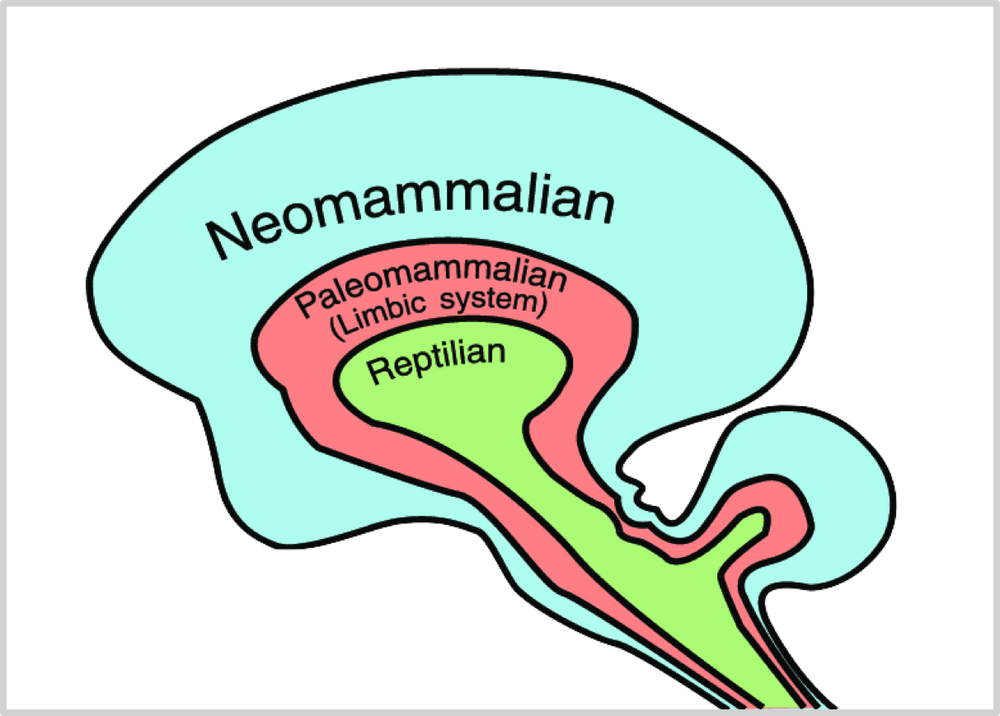

Put simply, the innermost portion, the reptile brain, is in charge of intuition; the middle portion, the monkey brain, is in charge of handling emotions; and the outermost portion, the human brain, is in charge of logic and reasoning. It's not an exaggeration to say that all of human culture is based on the neomammalian cortex, which I refer to here as the human brain. The largest difference between humans and other mammals is the development of this cortex.

When the subjects of the experiment mentioned in the previous chapter were presented with choices, they used their human brain to understand them. As soon as they started to take action, their loss aversion was activated by their monkey brain, but the not-always-correct instinct that loss is a bad thing comes from the reptile brain. When the subjects were unable to control themselves, this was because their monkey brains acted faster than their human brains, so whenever they had to make an immediate decision, the monkey, or even the reptile, raised its hand first. By the time the human had realized what was going on, it was too late. This is why the best way to have a cool head in daily life is to first close our eyes and do nothing.

The metaphor that Plato came up with 2,000 years ago is surprisingly similar to what scientists today have postulated after closer observations of how brains work. Take a look:

| Brain structure | Colloquial name | Plato's Chariot Analogy |
| -------- | -------- | -------------------- |
| Outer cortex | Human brain | Driver                 |
| Inner cortex   | Monkey brain | White horse                 |
| Brainstem     | Reptile brain | Black horse     |

I like Plato's metaphor better than the "human, monkey, and reptile" names because driver, white horse, black horse and chariot describe a unified system. The chariot is our body, and our brain has three selves: a driver, a white horse, and a black horse. These three selves shouldn't be enemies, they should **work together**. The better they work together, the more efficient the chariot is. If they can't work together, the chariot is useless.

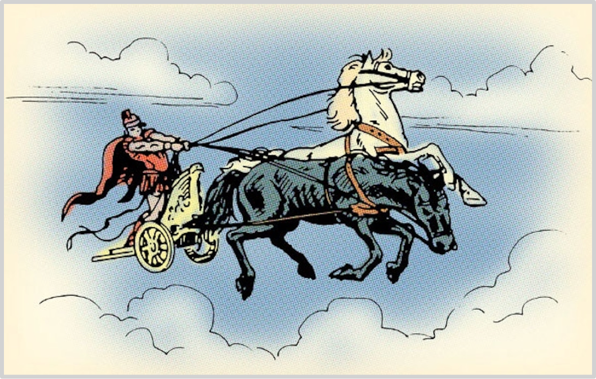

In the beginning, the black horse is the strongest, because, from a genetic perspective, it is the oldest. It provides the most basic and rapid responses that allow us to survive in a treacherous world. Reptiles have no driver and no white horse, but they have been able to survive for so long -- much longer than humans -- with just one black horse. If a smaller animal of a different species enters its world, it eats it (Feed!); if a smaller member of its own species of the same sex enters its world, it attacks it (Fight!); if a member of its own species of the opposite sex enters its world, it copulates with it (Fuck!); If a larger member of its own species of the same sex enters its world, it runs away (Flee!). If something that is none of the above enters its world, it stays still (Freeze!) All of this is without contemplation and without emotion.

The white horse is younger than the black horse, so it is weaker, but it can handle more situations. Emotions can help us judge good and bad, and make us feel happy or sad based on the results of our choices. This helps us learn and remember so that we can make better and more rapid choices the next time. All of the basic emotions, such as happiness, sadness, fear, revulsion, anger and surprise, can be seen as shortcuts to access our learnings. A certain situation will give rise to a certain emotion, which will activate an instinct that activates a behavior, or the emotion may even directly activate the behavior.

You can understand the process like this. When you encounter a situation, if the black horse can handle it it handles it directly. But the black horse can only directly handle limited types of situations, and if it can't handle it it hands it off to the white horse. Once the white horse has processed it, it hands it back to the black horse to take action.

We can't treat the white horse or the black horse as enemies. We can't be like those "clever" people who try to eliminate all emotions. Actually, without the white horse the driver has no way to mature, and the chariot would be dominated by the black horse. In fact, emotion is the basis of decision. There have been countless studies showing that if a person's emotional faculties are damaged it impairs their ability to make effective decisions. Even more importantly, emotions are the best and most direct way for people to communicate, and it is because of emotions that people are social animals. At the same time, it is our need for social connection that has developed our emotional faculties.

We can define "keeping a cool head" in the following way:

>No matter what happens, all three roles process it once before passing it on to the driver for a final decision.

That is to say that you do not take any action until all three roles have processed the situation. This simple, direct, brutal and effective strategy will change the performance of the whole chariot. The driver will quickly understand that both the black horse and the white horse can have incorrect responses. The driver will further discover that, after repeated communication between the three roles, the white horse may listen to the driver, and the black horse can develop new and correct intuition. 

The driver starts off as the weakest of the three, and it is only by keeping a cool head that they can participate, gain experience, and continuously grow. As the driver continuously grows, the white horse and the black horse go through countlesss cycles of correction and coordination, and they all end up different than before. So when people tell you to "trust your intuition", you now know that your black horse and the black horse of an expert may be completely different. The expert can trust their intuition, but maybe you can't.

Members of my Regular Investing Practice Group have already experienced this magical process. 

Before they started regularly investing, their black horses were the same as everyone else's, running away whenever the price fell. As to why they ran away, they didn't even have time to think about it, or even time to be afraid, because they had already run away. This intuition led to the fear and disappointment of the white horse, and the chariot was far away before the driver even knew what had happened. 

After reading books, listening to classes and engaging in repeated discussion and thought, the members of the practice group started to exhibit surprising changes. 

When the price fell, the black horse still wanted to run, and the white horse was still afraid, but the driver thought about it and said to the white horse, "No! You shouldn't be afraid or disappointed, you should be happy! This situation is good for you, because you can buy at cheaper prices." The white horse understood that its initial reaction was wrong, so it corrected itself. The next time the price fell, the white horse was happy instead of disappointed. After several rounds of this, the black horse also understood, and it began to change: "If the white horse is happy, why should I run?" After each round of successful communication, the driver became more powerful and was able to work more effectively with the horses. 

So now, when the price drops, the members of the group have a completely different response!

You must calmly accept this fact:

>Your brain contains three roles: the driver, the white horse, and the black horse.

More importantly, these three roles must be friends with each other instead of enemies. In addition to continuously learning, the driver must be in constant communication with the black horse and the white horse, helping them develop new and correct emotions and intuitions that allow the chariot, which is the whole of you, to be its best.

Always remember:

>You must be a good friend to yourself, and you must be sufficiently patient with yourself.

As far as how to keep good relations between the three roles, it's really quite simple: "Let's work it out between the three of us." As far as what the chariot, which is your body, should do, first just stay still.  **Waiting five minutes before taking action** is always effective. Don't laugh -- this simple method will greatly reduce your *gamma* in the trading markets.

### 4.3 Long-term Education and the Mirror Effect

The following is my favorite analogy for education:

>Education is like a pair of glasses. You are in the same world before and after putting on the glasses, but you can see more clearly and accurately after putting on the glasses. You are in the same world before or after you learn something, but you can see the world more clearly and accurately through the lens of education.

Over the years, collecting analogies has become a hobby of mine. Even though it's been so long that I don't remember where this analogy came from, it's still my favorite, bar none. Regarding the the results of education, I have come up with another extremely accurate analogy that I call "the Mirror Effect":

>The world in the mirror and the world outside of the mirror look the same, but they are actually reversed.

Do you see? It's the same price drop, but in the world outside of the mirror all of the black horses immediately run away, all of the white horses run away in fear, and the driver loses control. But in the world inside the mirror? The black horse stays still, the white horse is happy, and the driver is in control.

The Mirror Effect can be seen all over the investing space. For instance, almost every stock market around the world is legally required to post a notice similar to the following in a clearly visible location:

>Investing involves risk! Please make decisions carefully!

Of course, many true stories about the risks of investing have been passed down over time: Newton losing it all in the markets, Churchill's investing failures, or a group of Nobel laureates with huge market losses. Most of us also have stories of friends or relatives who lost everything trading. 

According to JP Morgan's statistics, since 1980 more than 40% of all stocks have at one time or another experienced a loss of 70% or more. So the stock market does sound quite dangerous! However, Wharton Professor [Jeremy Siegel's](https://en.wikipedia.org/wiki/Jeremy_Siegel) [data](https://knowledge.wharton.upenn.edu/article/jeremy-siegel-on-why-stocks-are-and-will-remain-the-best-bet/) tells a different story: 

Siegal looked at historical data from 1802 to 2012 and found that, for any given ten-year period, stocks performed better than cash *80%* of the time. Furthermore, stocks performed better than cash over every twenty-year period. Stocks also performed much better than gold, which many people think of as a safe asset. Contrary to many people's intuition, which is that stocks are the riskiest asset, stocks performed better than other assets over the long term, with annualized returns of 6.6% over 210 years. Cash, which people tend to think of as the safest asset, actually had negative real returns of -1.4%. When you see these numbers, you should think to yourself, "Where is risk the greatest?" In the stock market? Or out of the stock market?

>Based on this "discovery", Professor Siegal published a book entitled, [*Stocks for the Long Run: The Definitive Guide to Financial Market Returns & Long-Term Investment Strategies*](https://www.amazon.com/gp/product/B00GWSXX26/ref=dbs_a_def_rwt_hsch_vapi_tkin_p1_i0), which as of 2014 was on its fifth printing.

The *alpha* of regular investors comes from their careful choice before they start investing. Once they start investing, *alpha* has already been decided, so the only thing to do is to reduce *gamma* by avoiding mistakes. Siegal's most shocking point is the following:

>The vast majority of people make the wrong choice in the beginning.

Not only do they make the wrong choice, they make it while brimming with confidence! This is another surprising example of the Mirror Effect in education. It's clearly the same thing, but people are divided into two opposite groups, and the worse a decision people make the more stubborn they are in defending it. How does this surprising phenomenon occur? What's the main reason for it?

Actually, it can be explained in one sentence:

>**The mirror in this case is an understanding of the long term.** It is this mirror that brings about so many surprising examples of the Mirror Effect.

Almost all of the surprising Mirror Effects are due to different understandings of the long term. It's an eternal fact that most people have no concept of the long term and only see that which is right in front of them.  To put it another way, for the vast majority of "chariots", the black horse is always the strongest, the white horse always follows the black horse, and driver never grows at all.

To make another analogy, we can see the concept of long term as sunglasses that filter out all light that is not related to the long term, just as normal sunglasses filter out UV rays. With these sunglasses, we can't help but use our ability to make macro observations. It's just like wearing polarized sunglasses while driving, which not only filters out the harmful UV rays, but also keeps the harshest light away from your eyes. The sunglasses allow you to see more clearly and accurately.

After wearing these "long-term" sunglasses, the financial news media that you used to read and watch suddenly seems completely different. You see things you didn't see before, and you think about things in an opposite manner.

People on TV discuss the efficiency of the market, and both sides get all excited arguing with each other. In the past, you might have been confused, and felt that both sides seemed to be making good points. But with these long-term polarized sunglasses you suddenly understand that there is really nothing to argue about. The facts are quite simple:

> * From a long-term perspective, the market tends to be relatively efficient, and the longer the term the more efficient it will be.
> * But at any one point in time the market is extremely inefficient.

Then you start to really like the concept of "market efficiency". The more people there are who expect that the market will be efficient in the short term the better, because that's the only way you can have a relative advantage. If the market were completely efficient, then there would be no reason for the market to exist, because price and value would always be the same, and people wouldn't need to trade. The fact that the market is always inefficient is its reason for existence, and it is the reason why people like us have an opportunity. Fortunately, because we are always wearing "long-term" sunglasses, we just have to use our time to wait for the market to show its long-term efficiency.

Once you have done all you can to develop your concept of the long term, you will discover how different and simple macro observations are, and you will be surprised to discover this fact:

>The more important the problem the easier it is to solve, and the hardest problems are the easiest to solve. But people waste all of their wisdom trying to solve complicated yet unimportant problems.

In Chapter 3 of Part Two, we saw how regular investors choose their investments. All they do is make several simple choices that only need to be right in the general direction, but their future returns are likely to be greater and more certain than active traders. Most other people in the market, however, spend huge amounts of time and energy to apply their entire intellect to their choices. And all for what? They want to use all of the possible data to come up with a more precise conclusion, but is their probability of success greater? History shows us that they are wasting their efforts.

In the 1990s, a huge amount of talented people left China. When they look back from thirty years later, how do they actually feel? Many of them feel like they lost the best years of their lives. Why? Because over the past thirty years China has been the fastest growing region in the world, and a rising tide lifts all boats. Many less-talented people who stayed in China are now better off than those who chose to leave, and this can be hard for those talented people -- who seemed to be making the right decision in the moment -- to face. Even harder to accept is that those who didn't leave may have wanted to leave but couldn't. Why is it like this?

The best explanation may be that they put all of their attention on the present, so they could only ignore facts that should have been obvious but would only come into play in the future.  There is a famous experiment, called "[The Invisible Gorilla](https://www.youtube.com/watch?v=IGQmdoK_ZfY)", in which subjects are asked to watch a video of two groups of students passing a ball, and to count the number of times that the students in white pass the ball.

After watching the video, many people were able to count correctly that the ball was passed sixteen times, but failed to notice the large gorilla that walked across the stage, stopping to beat its chest several times.

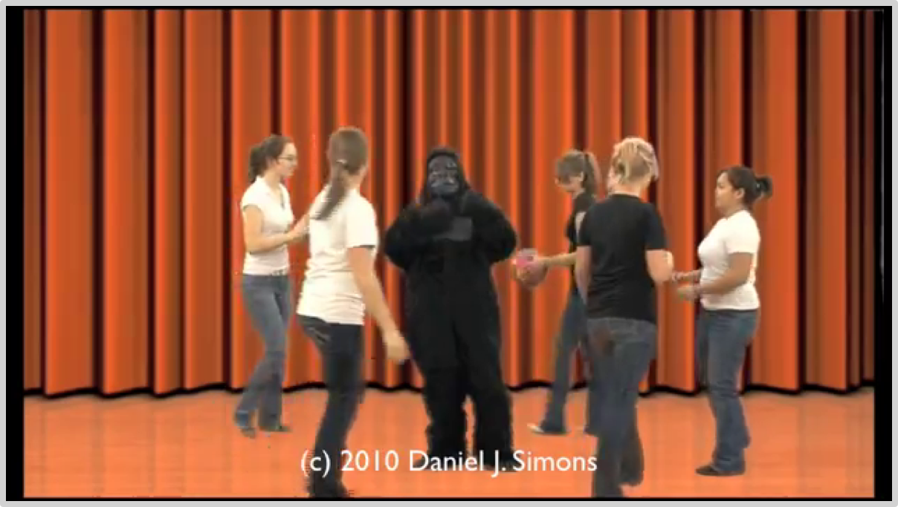

Some people may have heard of this experiment, so they correctly count the number of passes and notice the gorilla, but they fail to notice that the curtain behind the students changed color from red to orange.

Actually, since this is just how our brain works, there is no reliable way to deal with this problem. We either focus fully on the present, or we focus fully on the future. Anyway, those are the two worlds inside and outside of the mirror, and they are always the opposite of each other. Of course, Siegal's research tells us that, as far as making money goes, focusing only on the future is a better deal.

If you are able to clearly remember everything we discussed prior to this chapter, you will discover many examples of the Mirror Effect, and almost every time the mirror that causes everything to look completely opposite is "long term". When you read this book again, I suggest that you keep a list in a notebook of all the examples of the Mirror Effect. In the years to come, you can add to this list as you come across new examples. As you go through this process, you will discover that these sunglasses will slowly become invisible, and you may not even need the sunglasses anymore, because the ability to think long-term will become a natural function of your eyes.

This is the value and necessity of investment education. Your driver must mature, and your black and white horses must be trained. In the end, they will bring you into a mirror world in which everything will look the same but actually be the opposite of what you once saw. In fact, though, the world inside the mirror is the actual nature of the objective world. This is the secret of investment: have a 100% objective understanding of the objective world, and a 100% objective understanding of oneself. It's really very difficult. It's only difficult, though, from the perspective of the present, and it's certainly not impossible. Looked at from a long-term perspective, it shouldn't be difficult at all. 

### 4.4 The Difference Between Knowing and Doing

**Knowing** is one thing, **doing** is another. The difference between knowing and doing is greater than almost anyone imagines.

Think back to when you were learning to write in elementary school. There were words that you always seemed to spell wrong, no matter what. For instance, maybe you would always spell "believe" as "beleive", mixing up the order of "i" and "e", even when they weren't "after c". The teacher corrected you so many times, but you would still get it wrong. Eventually, though, you finally got to the point where you would spell it right every time. 

If even simple knowledge can be this difficult, taking a long time to finally master, then what about more complex knowledge? It can take even longer.

Logic is perhaps the clearest example. [*Beyond Feelings: A Guide to Critical Thinking*](https://www.amazon.com/Beyond-Feelings-Guide-Critical-Thinking/dp/0078038189/), which is now on its 9th edition, is the book that first taught me logic. One foggy morning I went to the library and searched for *thinking*. Among the results I saw *critical thinking*, a combination I had never seen before. I chose the book which had been updated the most times, which was *Beyond Feelings* (at the time it was on its 3rd edition). Why did I search for thinking? Because the day before two people were having a heated debate, and it pained me to discover that I thought they were both right! First, this was impossible; second, it meant that I wasn't able to think. Or, at least, something was wrong with my way of thinking. At the time I was nearly 25 years old.

Even though I'd learned some logic before graduating from college, and even though I had incorrectly assumed that I had very strong logic, I discovered that the difference between knowing nothing and knowing as much as I knew was very small. My goal was clear, so reading the book gave me more pleasure than pain. By the time I finished I felt like an entirely new person! But that was an illusion, because I quickly discovered that I still frequently fell for logical fallacies. In retrospect, this is not surprising, since every logical fallacy has countless iterations. Slowly, this book became the book that I would re-read the most times over the course of my life. The mirror effect is ubiquitous, though, and this book that has had a huge impact on my life is [trash](https://www.amazon.com/gp/customer-reviews/R3S1K0E2LMJE8V/ref=cm_cr_dp_d_rvw_ttl?ie=UTF8&ASIN=0078038189) in the eyes of some.

Was it enough to read this book multiple times? No. Several years later, when I was teaching at New Oriental, there was a period during which I taught the writing and logic portions of the GMAT. I was extremely glad that I had trained myself in logic for several years, but it was still difficult. GMAT questions are often like this:

>Of the choices below (A, B, C, D, E), which, if correct, would severely weaken the author's argument?

Looking back, my most valuable periods of self-teaching were when I was repeatedly reading *Beyond Feelings* and teaching logic at New Oriental. Those two periods of training myself in logic have played an indispensable role in my wealth accumulation over the long term.

Earlier, I noted the following:

>More than 130 common cognitive biases have been identified, and I'm sure many more will be discovered.

In my Regular Investing Practice Group, I have repeatedly gone over the reasons for these cognitive biases, their effects, suggestions for how to avoid them, and recent examples. But will this be immediately effective? It won't. This is true for almost everyone, and I am certainly no exception. Every once in a while I will discover that I have once again fallen for a logical fallacy that I thought I had already taught myself to avoid. 

There's another hidden reason why the distance between knowing and doing is so great: 

>Your past decisions necessarily lack your current rich experience. 

In programming there is a concept called "[forward references](https://en.wikipedia.org/wiki/Forward_declaration#Forward_reference)", which will often cause the compiler to report an error, because, according to the programming language's rules, a variable must be declared before it can be referenced. In life, however, forward references are all over the place. The best example might be young people not understanding love in their first relationship.

Another example of not becoming aware of the mirror effect until it's too late is the phenomenon of people regretting in old age not working harder earlier in life. It's easy to see in hindsight, but when most people are young they are unable to see the true importance of gaining knowledge. Their decisions are based upon independent thinking without broad experience, like a frog in the bottom of a well. Later on in life people realize the importance of knowledge and experience, but by then it is too late and they are left with regret.

All truly important activities in life are of this type:

>You need to get started no matter what, and you learn as you go.

Love, marriage, parenting, and even birth are all like this. To do well at these things we can't just use what we learned in school. What we learned in school doesn't have forward references. We learn step by step, first this then that, and that is always based on this. This is why people always talk about how carefree life in school is. In real life, though, there is always regret as we learn new things and discover that previous decisions were incorrect. As we learn, we discover new information that would have helped us make a better decision.

This is especially the case in investing. We can't base our previous decisions on what we learn in the future, so not only are we destined to have regrets, we may even lose all of our money.

This is one of the hidden advantages of regular investing:

>Regular investing gives practitioners a long period to learn, observe, practice and make corrections. A period of at least two full cycles, which is long enough for anyone to cross the gap between knowing and doing.

Because regular investors only do one thing -- buy -- they don't need to do anything else, so once they start they have plenty of time to expand their knowledge, primarily by observing the mistakes of others. This makes them the most likely cross the gap between knowing and doing. After two full cycles, they have enough knowledge and experience to make quality decisions without regret. 

There is an investing phenomenon that is worth paying attention to, especially for long-term holders:

> **The earlier the mistake the greater the long-term cost**, because the cost is compounded over the long term.

Furthermore, the longer the mistake persists, the greater the effect is over the long term. We can use the following approximation to illustrate this:

>98% 30 ≈ 54.55%

Regular investors are fortunate because they do the right thing from the start, and as long as they keep doing it for two full cycles they can't make a mistake. Throughout this process of not making mistakes, there are only two things they need to do: 1) constantly strengthen their ability to make money outside of the market, and 2) more importantly, constantly learn about investing, patiently crossing the gap between knowing and doing.

### 4.5 The Border Between Active and Passive

We previously mentioned the following: 

>This is the secret of investment: have a 100% objective understanding of the objective world, and a 100% objective understanding of oneself.

This is to say that successful investors must have an objective understanding of themselves and reality. Actually, there is a hidden and even more important area that they must objectively understand: the border between themselves and reality.

Our body is not the border between ourselves and reality, because we are able to actively cause change in areas outside of our body.

We can make extensions to our body. For instance, we can extend our legs using transportation tools like bicycles and cars, and we can extend our brains using Internet devices. Actually, once we are sufficiently proficient with any tool it effectively becomes a part of our body. Clearly, we can influence the world outside of our body. For instance, we can use our trust and respect to gain the trust and respect of another; as parents we can use our behavior to become a model for our children; and as an investor we can hold assets over the long term to achieve excellent long-term returns. 

However, there is a border which encompasses the area of reality that we can influence through our behavior. Within this border, we can constantly advance through hard work. Outside of this border, there is nothing we can do.

If an individual is unable to clearly recognize the existence of this border, they will always live a life of chaos and pain.

The clearest example of this is parents raising children. If parents focus their efforts on improving themselves, then they are within their own border, which is good. But in most situations we find that parents focus their efforts outside their own border, where they actually can do nothing. Children aren't stupid. Actually, their brains have a radar-like ability to see whether or not their parents follow their own advice. If their parents' actions don't match up with their words, the child will find it quite painful, especially since they still don't have a clear understanding of their own border. Their parents are constantly invading their border, and they don't have the ability to defend themselves. This is the source of most negative reactions in children. The child feels pain, and the parent feels even more pain, precisely because they are exerting effort in an area that they can't control. They keep failing and trying again with increasingly worse results until both sides are exhausted.

Of course, a more common example occurs in the investing world. Do investors really need to participate in operations? Maybe sometimes. But we can be almost certain that traders in the secondary market shouldn't participate in the operations of the companies they invest in. In fact, not needing to participate in operations is one of the biggest advantages of investing in the secondary markets.

However, the operators of almost every publicly traded company receive many letters from shareholders every day. These shareholders have all sorts of complaints and advice, and they often end up working themselves into quite a tizzy. They are incognizant of the fact that they are wasting effort outside of their own border. They have idea that effort outside of that border is completely useless, and that if it has any effect at all it will be negative. They will never understand, because they themselves lack the ability to create an effective business model and eventually secure investment from the public. If they were able to do so, they would discover that it's terrible to have so many people on the outside trying to influence you, and that it's even worse to be actually swayed by those on the outside. You could even say the following: a company that is easily swayed by the secondary market is not worth investing in.

Let's take another look at the equation that describes our returns: 

>**p = δ + α - γ**

The p (performance) on the left side of the equation represents our final returns. On the right side, δ (*delta*)is an investment that matches the returns of the market with a β (*beta*) of 1. For regular investors, α (*alpha*) depends on our careful choices before we start investing. Finally, γ (*gamma*) represents gains that were lost due to mistakes. 

We have shown several times that as long as you don't do anything you won't make mistakes, so *gamma* should be zero and performance should be maximized. Unfortunately, you will always have the impulse to do something to change things and make them better. There's no way around it, because you are human, and our brains were designed to survive in dangerous environments. For tens of thousand of years, "do something when you encounter danger" was the best strategy, and those who chose to "do nothing in the face of danger" died out long ago. Our brains are still the same today, only able to understand immediate danger, and unable to understand future gains. It's just like we mentioned in Chapter 3 of Part Four: even in the face of more than two hundred years of data showing otherwise, people still think that cash is a truly safe investment. 

But if you invest in an MSCI World Index fund, or an S&P 500 fund, what can you do? Can anything you do influence it? You can't change the direction or speed of the development of the world. You also can't change the direction or speed of the development of a country, region or industry. And even if you hold stock in a company, you're unlikely to be able to change it. Actually, aside from changing yourself, there's not much you can change. The sooner you realize this the better.

Most funds are established to chase *alpha*. Even though there are some clearly successful examples, they are extremely rare, and we can't eliminate the possibility that they were just lucky. Even Warren Buffett has clearly been lucky: he was born in the US. In addition to the US having been the fastest growing area in the world over the past fifty-five years, it has also had a stable legal environment in which private property has been relatively protected. If Warren Buffett had been born in South Korea, which has the highest rate of presidents and tycoons going to jail, how would he have done?

How difficult is it to create *alpha*? Someone once joked that if you threw stock certificates in a room, let a monkey into the room, and made a fund based on which stocks the monkey peed on, you could still beat the fund managers of most actively-managed funds. Sadly, the joke is correct!

According to [a report](https://www.wsj.com/articles/indexes-beat-stock-pickers-even-over-15-years-1492039859) in the Wall Street Journal, in the fifteen years ending in 2016, *95.4%* of mid-cap funds underperformed the S&P MidCap 400, *93.2%* of small-cap funds underperformed the S&P SmallCap 600, and *92.2%* of large-cap funds underperformed the S&P 500...

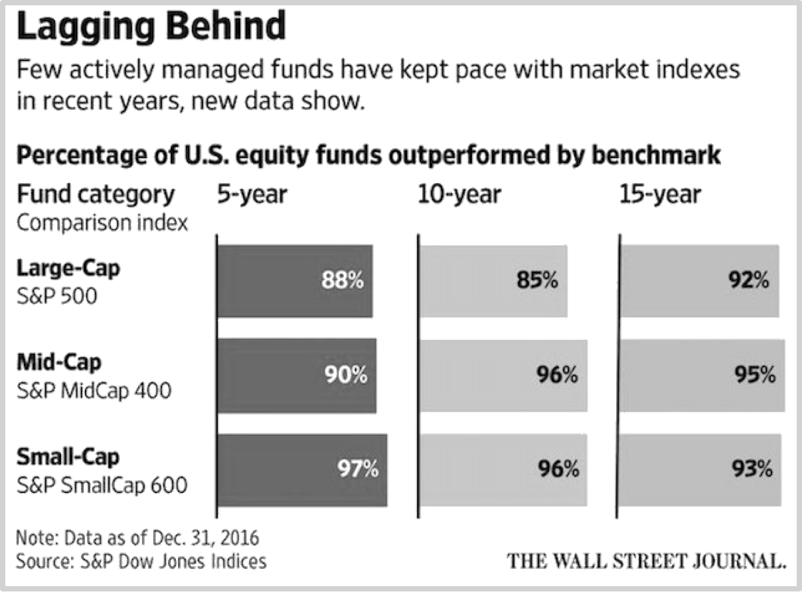

Across the world in recent years more and more money has been flowing into passively-managed funds, and relatively less has been invested in actively-managed funds. It is said that money is smart, and it flows to where it can grow. Another example is how it flows from the hands of those who love to spend to those who choose to invest.

American theologian Reinhold Niebuhr's "[Serenity Prayer](https://en.wikipedia.org/wiki/Serenity_Prayer)" is in fact a deep meditation on these boundaries. Its most common form is as follows:

>God, grant me the serenity to accept the things I cannot change,
>Courage to change the things I can,
>And wisdom to know the difference.

**Awareness of borders, a long term perspective, and macro observation.** Together, these three concepts can change a person's personality. My students and I have all felt this. People say that personality can decide one's fate, but I tend to believe that personality isn't innate, and that personality is only an overall expression of the interplay between the black horse, the white horse and the driver at different times and different stages of development. 

For example, deep thinking about these three concepts has made it very difficult for me to become angry. There is nothing that is worth my getting as angry as I used to get when I was younger. I have started to ponder the following phenomenon:

>Why are some people able to succeed in even the harshest environments?

My choice to be a regular investor, and my eventual ability to explain regular investing in detail, all started from asking myself this question. Looking at things from a long-term perspective can lead you to the opposite of your previous conclusions; macro observations can lead you to choices that will produce better results over the long term; and awareness of borders can help you avoid trouble and wasted efforts. I have no need to complain about a poor environment, and I don't want to complain about how society is unfair. Unfairness in society is like the markets: as long as you look at it from a long-term perspective it's pretty fair, but if you look at it minute-by-minute it's always unfair. Most importantly, I am increasingly able to accept always being underestimated. Just like in the stock market, you will only be very briefly overvalued, and it's probably a bubble, right?

Objectivity is very important. Not only objectivity about the world, but objectivity about yourself, and careful objectivity about the border of your self. Furthermore, it's even more important to be objective over the long term. This is the secret of investing. Of course, it's an open secret. 

## Conclusion

Regular investing is easy. It's just an improvement on "choose carefully and hold over the long term" that needs no further improvement. Even if you can't rigorously follow the process of investing regular amounts on a set schedule, it's still okay, as long as you are able to hold over the long term.

Your final returns can be calculated by this equation:

>**p = δ + α - γ**

As a regular investor δ (*delta*) is outside of your border, and there is nothing you can do to affect it. The process of making careful choices is where you create α (*alpha*). Your ability to lower γ (*gamma*) depends on how you manage yourself. Your awareness of borders also influences your *alpha* and *gamma*.

Your investments must never leave the market, and you must invest your money, invest your time, and be a friend with time. You should constantly increase your ability to make money outside of the market by gradually upgrading your personal business model. No matter what you do you must learn how to sell. You must cross the wide gap between knowing and doing, becoming your own friend rather than your own worst enemy. You must be clear about borders, and always do your best at your own part. Regular investing is the most graceful performance art, and it can make your every second count.

There is no secret to success. Or, if there are secrets, they are open secrets. Successful people are just those who have used the correct methods that everyone knows to **do** the correct things that everyone knows.

It's not an exaggeration to say that regular investing can change a person's life. 

China enforced the One Child Policy from 1979 to 2015. People of child-rearing age in 1979 are around seventy now, and the are in a special state called "the loneliness of old age". They have been retired for ten or more years, and their only child is currently in the middle of their busiest stage of life, having just had kids. Because times have changed, more and more of them don't life in the same cities as their children, and so many of these parents no longer see their children regularly. They've got nothing to do, and no one to accompany them.

There is an awkward fact:

>When they were younger they never imagined that they would live this long.

When they retired a decade or so ago, they hadn't yet realized that many of their generation could easily live to 100. It's only now, as many of their own parents are approaching 100, that they have discovered that "old age" can last so long! Where did these lonely old people mess up? They didn't imagine that they could live so long, so they long ago gave up on their own personal development. Long ago they mistook a new beginning for their own ending.

Back to investing, most people look at compound interest calculations over twenty or thirty years and think that the numbers have nothing to do with their lives. But this generation actually has much more time to invest than they imagine. On average, they have at least 45 years. It's a big mistake to underestimate this!

What does it mean to live to 100? Your great-grandchildren will be grown and able to start investing. The two full cycles we have been talking about are economic cycles, but if your family has four generations of adults when you are 100, that is four full generational cycles.  We should think carefully about this fact, and think about how we will deal with it.

Regular investing can not only change a person's life, it can change a family's fate over generations, and it is a process that you will be able to see yourself. It's very important. 

Xiaolai Li
October 2019, Beijing

## Appendices

## 1. About BOX

>**Risk Warning**
>
>The strategy of regular investment is objectively correct, but it is impossible to remove subjective judgement from the choice of investments for regular investing. So the choice of investments for regular investing is the responsibility of each investor. Each investor must use their own money and time over the long term to take responsibility for their choices. Please be cautious.
>
>This section is primarily about how I chose BTC, EOS, and XIN to be the components of BOX, and it necessarily contains some of my own subjective judgements. You must use your own objective understanding of the objective world to choose your own investments.
>
**Conflict of Interest Notice**
>
> * I am a long-term holder of BTC (from May of 2011)
> * I was an angel investor in BlockOne, which developed EOS (May of 2017)
> * I was an angel investor in Mixin Network (October of 2017)

[BOX](https://b.watch/) is an abbreviation for **B**tc + e**O**s + **X**in, and it is a "box" of these three assets. The purchase and redemption of BOX can be done on the [b.watch](https://b.watch/) website. 

### 1.1 Details of BOX

Quite simply, BOX is **a blockchain token that tracks a basket of mainstream blockchain assets**. Its components are as follows:

> * 1 BTC
> * 1500 EOS
> * 8 XIN
>
> ------
>
> = 10,000 BOX

Put another way, to exchange for 1 BOX, you would need 0.0001 BTC + 0.15 EOS + 0.00008 XIN.

> * You can use the respective amounts of BTC, EOS, and XIN to exchange for BOX.
> * After meeting certain conditions, you can also redeem BOX for the respective amounts of BTC, EOS, and XIN.
> * You can also use USDT to directly purchase BOX on secondary markets. 

The necessary conditions to redeem BOX for BTC, EOS, and XIN are as follows:

> If the market value of your BOX exceeds \$100,000, the redemption fee is 1%.
> Alternatively, you can sell it directly on a secondary market, in which case both parties will be charged a commission of 0.1%.
> If you are regularly investing, you can choose a time after which you may sell (e.g., three years).

BOX is an ETF product, but it is different from the funds you have seen before, in that it doesn't charge a management fee. Why? Because I don't want to earn a management fee. And I am also regularly investing in BOX.

BOX is 100% open and transparent. The addresses in which assets are held are public, and you can check them at any time. All of the records are on the Mixin public chain, and you can find instructions to check the addresses on the b.watch website. How much BTC, EOS, and XIN are in BOX? How many corresponding BOX tokens are circulating? How many BOX tokens are still in "cold storage" (including those for future distribution and those that have been redeemed)? The data to answer all of these questions are open and transparent, so it is easy to check the current issuance of BOX and confirm its underlying assets. If BOX is listed on any exchange, users can use also use this data to confirm that the exchange is not artificially inflating the supply of BOX. (As to why this is important, it will take a novice some time to learn and understand.)

### 1.2 The Advantages of BOX

The components and allocation of BOX were determined in accordance with the following principles.

### 1.2.1 It is best to invest in mainstream blockchain assets

In the new round of trends, mainstream blockchain assets will receive disproportionate attention. The market has been educated by the bull and bear markets of 2017 and 2018, and the "blind optimism" around new tokens has been fully deflated. Projects that raised millions just based on writing a white paper have been discredited. In the new round, the assets that may see huge appreciation are either mainstream assets or multi-level marketing (MLM) assets. The reason to stay away from MLM assets isn't that they can't make money -- actually, they can make a lot of money! -- but because they can't succeed over the long term, and are thus not suitable choices for regular investing. Regular investors invest through more than one cycle, and thus they can only choose long-term investments. So, between mainstream assets and MLM assets, we can only choose mainstream assets. 

### 1.2.2 The internal logic of the development of blockchain technology

After eight years of observation, investment, practice and thinking, I believe that there is a development path that blockchain technology will follow in changing the world:

> Trusted ledger (BTC) → Trusted platform for code (ETH/EOS) → Trusted execution environment (Mixin) → Trusted hardware (?) ...

Actually, this is also the investment path I have followed. After bitcoin, the exchange that I invested in, Yunbi, became the first exchange to list Ethereum (ETH), and I was an angel investor in EOS and Mixin. The core of successful investing is investing in accordance with the way things are developing, which befriends trends and allows trends to constantly work in favor of your investments, rather than allowing trends to become enemies and obstacles to your investments. 

The choice of components of BOX is in accordance with the internal logic of the development of blockchain technology.

As to why EOS was chosen instead of ETH, despite the fact that ETH appeared before EOS in the trusted code stage, the difference between them is like the difference between DOS and Windows, in that EOS is multithreaded. Furthermore, BlockOne, the technical team behind EOS, is one of the most well-funded teams in the space, so EOS is a more reliable choice and is more likely to be successful over the long term.

When our investments go from an individual investment (like BTC) to a combination of investments (like BOX), we both reduce opportunity cost and change from investing in one project to investing in an entire industry. This is an extremely reliable way to reduce risk.

### 1.2.3 Thoughts on allocation

As of July 2019, the "Bitcoin dominance index", which is the percentage of of all blockchain assets that bitcoin represents, was 63%. Although this number may continue to rise in the short term, it will drop as blockchain technology and applications become more widespread. It's not that bitcoin won't continue to develop, it's just that other assets are likely to develop faster than bitcoin over the long term. So, from a long-term perspective, it is reasonable to have a 50% allocation for bitcoin.

The remaining 50% is allocated to EOS and XIN with a 4:1 ratio. This is because I think that XIN will develop rapidly, maybe even faster than EOS.

**Note:** The 5:4:1 ratio is based on USD prices at the inception of BOX. Over time, these ratios are not fixed. The fixed ratios are based on the components:

> 10,000 BOX = 1 BTC + 1,500 EOS + 8 XIN

The main misunderstanding people have of [Mixin](https://mixin.one) is that they think Mixin is merely a chat app. Actually, while Mixin Messenger is a chat app, or a social networking app, Mixin Network is a public chain, and Mixin Messenger is Mixin Network's first Dapp. The vast majority of public chains (even including EOS as of July 2019) still have no good Dapps. Most Dapps are basically just dice games. 

Mixin Network has taken a different technical development path. 

Other public chains have followed a *bottom-up* approach, first developing the public chain and then developing on-chain Dapps. This is called "building an ecosystem".

Mixin Network has taken a *top-down* approach, first creating a great Dapp, Mixin Messenger, and then gradually completing the development of the base public chain. Thus, Mixin Messenger was first released in December of 2012, and, more than a year later, in February of 2019, the Mixin Network public chain was officially released. Dapps such as dice games can simply be bots running on Mixin Messenger. Ocean.one is a self-governing decentralized exchange running on Mixin Network, and it represents pioneering technology in the blockchain space. Other products that are being developed, like BOX and its b.watch exchange, would be impossible to realize without the Mixin Network public chain. It's not that I haven't tried other public chains, it's that they are unusable. This is the reason for XIN's allocation in BOX.

In summary, BOX is an ETF product that I believe is very likely to succeed. If we lose money on it, it is because the blockchain industry has failed, and that is neither my fault nor yours. However, **as long as the blockchain industry does well, BOX will do well**, and the blockchain industry is just taking off, so were are likely to do well. It's that simple.

## 2. About b.watch

[b.watch](https://b.watch) is an exchange to buy BOX and redeem it for its components.

Currently b.watch's profits may come from two areas:

> 1. A 1% commission when BOX is redeemed.
> 2. A 0.1% commission charged to both buyer and seller when BOX is traded on secondary exchanges, for a total commission of 0.2%.

50% of these earnings will be periodically distributed to BOX holders. At first, these earnings don't seem like much, but over time the development of BOX and b.watch will be amazing. 

Later on, other sources of potential income may include:

> * Income from an EOS Block Producer
> * Income from XIN nodes

It takes a large amount of reserves and preparation to become an EOS Block Producer or a XIN node. When the time is right, b.watch plans to run these nodes, and after deducting operation costs 100% of proceeds will be distributed to BOX holders. 

Under this system, the corporate value of b.watch is basically a 0.5% commission on BOX redemptions and a 0.1% commission on BOX trading. After seven year, 100% of BOX shares will be distributed to my Regular Investing Practice Group members according to certain conditions. For instance:

> * Time holding BOX
> * Degree of successful completion of regular investing tasks
> * Affiliate sales of the Regular Investing Practice Group

## 3. About the BOX Regular Investing Practice Group

The *"BOX Regular Investing Practice Group"* is my blockchain education product. After eight years of surviving in the blockchain world, I have a strong desire to share my survival experience and wisdom. I'm sure that you can understand. 

But what you might not have thought of is that what I want to do even more is to make money with lots of other people by sharing reliable investing knowledge and following my own advice. It's rare to have a chance like I have with the Regular Investing Practice Group to help my students make money by sharing knowledge. Fortunately, the rapid development of the blockchain industry has given us an unprecedented opportunity. 

The Regular Investing Practice Group is a place for me to make money from my knowledge, but more importantly it is a way for students to **make money outside of the market**. I am in charge of creating valuable content, and students, in addition to learning and putting the knowledge into practice, have the opportunity to earn bitcoin by selling memberships to the group. That's right, it's not just earning money, it's earning bitcoin, because the Regular Investing Practice Group only accepts bitcoin.

In addition to earning bitcoin by selling memberships, those who put the knowledge presented in the class into practice by completing their regular investing tasks also have other benefits:

> * They are eligible to receive shares in b.watch, the first on-chain ETF exchange in the world, thus benefiting not only from the development of BOX, but also from the development of b.watch.

In brief, the Regular Investing Practice Group is is a place for me and my students to **develop together and make money together**.

At the same time, I am also *leading by example* by regularly investing in and holding BOX. Regular investing is the only reliable investing strategy for most people, but it is always easier said than done, and those who haven't done it have no way to know how difficult it really is. The most important thing is to have people to accompany you, so no one has to suffer loneliness for too long.

The Regular Investing Practice Group is different from other groups and courses because I have followed the following principle over the past ten years:

>*I only talk and write about things I have already done.*

BOX is something that I only talked about once it was created, and I have kept improving it. It's not something that I started on a whim.

The Regular Investing Practice Group is a place for me to share my investing principles. Knowledge and understanding is not something that can be simply shared without a cost. I often say the following:

>Knowing something, learning something, and thinking something are useless, especially in activities like investing where the goal is to change one's life.
>
>In the end, **doing is all that matters**.

Knowledge and understanding can only have their value realized in the process of doing. Doing, however, requires the guidance of knowledge and understanding. 

Investing education is important. Even more basic than investing, making money isn't something that most parents or schools teach, so it must be learned through one's own trial and error. Also, society has brainwashed a generation on this topic. 

**There's no disgrace in making money -- it's only a disgrace to make unclean money.**

So from my perspective, everyone should seriously study investing. I can't think of any reason why not.

## 4. How to Join the BOX Regular Investing Practice Group

### 4.1 Download Mixin Messenger

Mixin download links:

> * iOS
>   * Mainland China App Store accounts，download [Mixin 畅聊版](https://apps.apple.com/cn/app/mixin-%E5%AF%86%E4%BF%A1%E7%95%85%E8%81%8A%E7%89%88/id1457938019) on the App Store
>   * Other App Store accounts，[download Mixin Messenger](https://apps.apple.com/app/mixin/id1322324266) on the App Store
> * Android
>   * In China，[download on the Tencent App Store](https://a.app.qq.com/o/simple.jsp?pkgname=one.mixin.messenger)，or [download on the Xiaomi App Store](http://app.mi.com/details?id=one.mixin.messenger)
>   * Outside of China, [download on the Google Play Store](https://play.google.com/store/apps/details?id=one.mixin.messenger)

iOS users with Mainland China App Store accounts who download [Mixin 畅聊版](https://apps.apple.com/cn/app/mixin-%E5%AF%86%E4%BF%A1%E7%95%85%E8%81%8A%E7%89%88/id1457938019) must add the wallet bot (ID: *7000101425*) in order to sent, receive and store digital assets.

Also, the exit bot (ID: 7000101276) provides OTC service within Mixin.

### 4.2 Adding the “BOX Regular Investing Practice Group” Bot

Search for *7000102069* to add the “BOX Regular Investing Practice Group” bot. However, without the recommendation of a member of the group, you will be unable to pay and join the group, so you must ask around in other groups to find someone who is willing to recommend you. 

### 4.3 Blockchain Open Class

Search for and add the following bot: *7000102093*.

I often hold open classes in this group, and you can also find recordings of previous open classes here. Just click on the robot icon and then the “course record” icon to access the recordings

## About the Author

Li Xiaolai is an investor and a lifelong learner. [http://lixiaolai.com]( http://lixiaolai.com) · [xiaolai@github](https://github.com/xiaolai)

### Publications

> * *21-Day TOEFL Core Vocabulary Breakthrough*
> * [*High-scoring TOEFL Essays*](http://lixiaolai.com/#/twe185/)
> * [*Befriending Time*](http://lixiaolai.com/#/befriending-time/)
> * *The Road to Financial Freedom*
> * *The Self-Cultivation of Leeks* ([Chinese](http://lixiaolai.com/#/the-self-cultivation-of-leeks/cn/), [English](http://lixiaolai.com/#/the-self-cultivation-of-leeks/en/))
> * [*Self-learning is an Art*](http://lixiaolai.com/#/the-craft-of-selfteaching/)
> * [*On Regular Investing (Third Edition)*](https://onregularinvesting.com/)

### Other Links

> * [*I Also Have Something to Say*](http://lixiaolai.com/#/i-have-a-say/)
> * [*Everyone Can Learn English*](http://lixiaolai.com/#/everyone-can-use-english/)
> * [*Squeeze A Little and it Will Come: A guide to orgasms for women*](http://lixiaolai.com/#/ji/)
> * *INBlockchain's Open-source Investing Principles* ([English](http://lixiaolai.com/#/INB-principles/en/), [Chinese](http://lixiaolai.com/#/INB-principles/cn/))
> * [*Bitcoin Whitepaper (Chinese and English)*](http://lixiaolai.com/#/bitcoin-whitepaper-cn-en-translation/Bitcoin-Whitepaper-EN-CN.html)
> * [*Little Book of Blockchain*](https://blockchainlittlebook.com/#/)

-----

> * [Download PDF of this book](https://onregularinvesting.com/pdf/on-regularinvesting-en.pdf)
> * [Download ePub of this book](https://github.com/xiaolai/regular-investing-in-box/raw/master/docs/epub/OnRegularInvesting_cn.epub)
> * [Download mobi of this book](https://github.com/xiaolai/regular-investing-in-box/raw/master/docs/mobi/OnRegularInvesting_cn.mobi)

This book is released under the [CC-BY-NC-ND license](https://creativecommons.org/licenses/by-nc-nd/3.0/deed.en).

