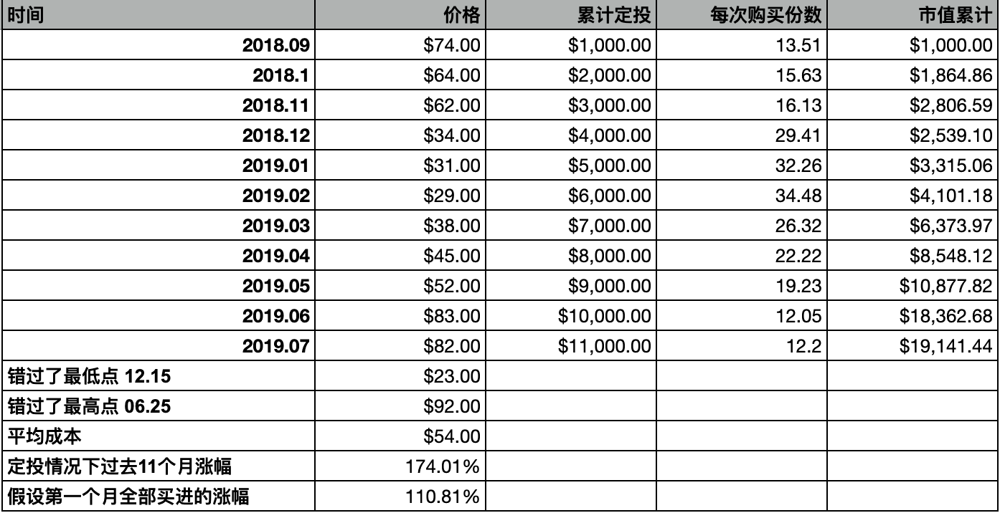
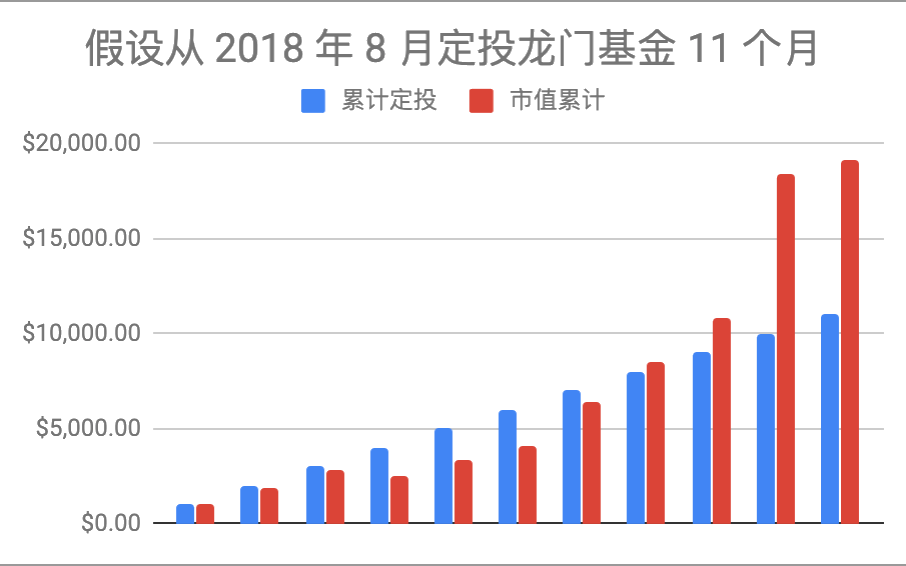
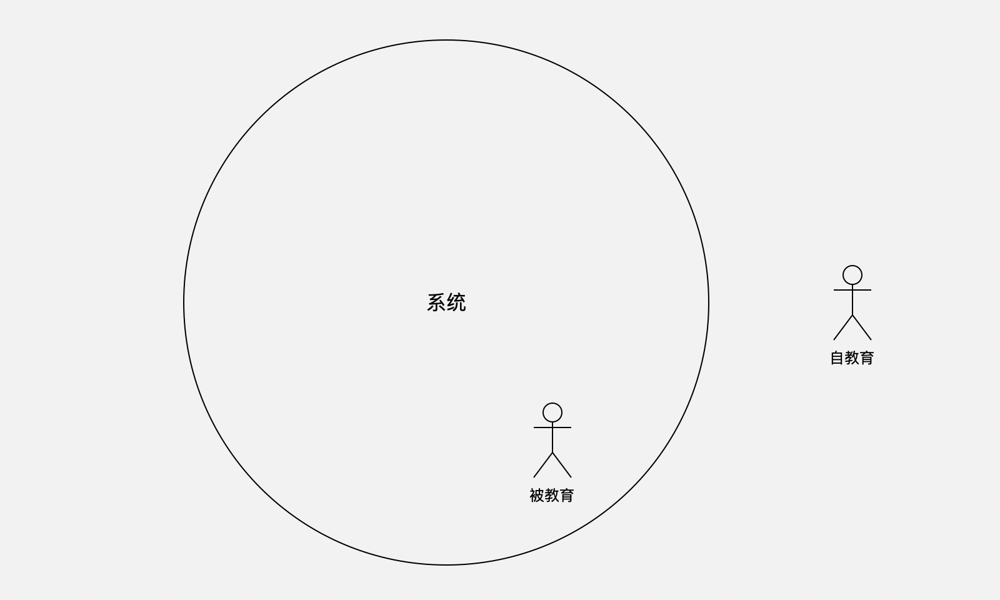
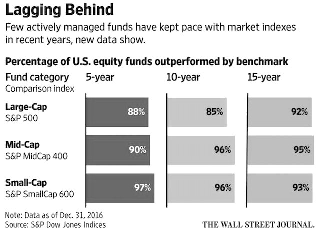
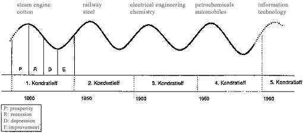
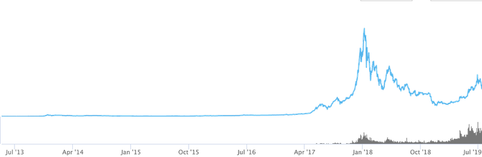

# 定投 —— 大佬的自我修养

*—— 让时间陪你慢慢变富……*

**李笑来**

二〇一九年七月

*普通人错过这本书的“踏空成本”无限大……*

https://b.watch

---

## 前言

我猜，作为一个普通人，你肯定不止一次听过一个令人心惊胆颤的词汇：**阶层固化**。

无论阶层固化是否真的已经存在，无论它是否真的正在逐步形成，它都肯定是令普通人一听就心头一紧的词汇。我不知道别人是怎样的感觉，反正我清楚地记得年轻的自己第一次听到这个词汇的时候那种接下来很久都忧心忡忡的感觉  —— 那不是恐惧，那好像是绝望。

这个词汇是全球很多人的焦虑来源。不是你一个人害怕它，更不是你一个人对它无可奈何。或早或晚，你会得知韩国人和日本人早就接受了他们的社会已然阶层固化的现状，你也会听说连有着各不相同的美国梦的美国人都在不同程度上体会到了阶层固化的正在形成，国内的自媒体就更不用提了，他们喜欢死了这种天然不经修饰就可以引发绝大多数人焦虑的标题…… 讲述这个词汇的文章，无一不是忧心忡忡，无一不是无可奈何，无一不是絮絮叨叨之后毫无任何可行解决方案。

这本书要讲的是**普通人摆脱阶层固化的路径** —— 绝对可行，毫无水分，并且全靠你自己。这里所说的**普通人**，不分国界、不分地域、不分种族、不分性别、不分年龄、不分高矮胖瘦美丑、不分何种性取向…… 关键在于，甚至压根不分智商和学历！换言之，这个解决方案，甚至对在北京跑腿送外卖的小哥都适用……

很难令人相信竟然有这样的解决方案。更令人难以置信的是，那解决方案说出来竟然只有两个字：

> **定投**

**投资**，是我能找到的唯一一个普通人可以跨越阶层的通路。而**定投**则是唯一一种所有普通人都有机会做、并且都有能力做好的投资方式。

> 所谓的定投，就是针对某个投资标的在很长的时间内定期投资一定的金额。

例如，在未来的 **5 到 10 年之中**（很长的时间），**每周**（定期）投资 **[BOX](https://b.watch)** 这个无管理费的区块链 ETF 产品（投资标的）**150 美元或者 1000 元人民币**（一定的金额）…… 当然，你可以把 [BOX](https://b.watch) 替换为任何值得长期投资并持有的标的，比如苹果公司股票、贵州茅台股票，可口可乐股票，或者标准普尔指数基金。

在任何一个社会，在任何一个时代，绝大多数人都处于终生抱怨的状态。然而，在今天这个时代 —— **今天这个有着自由且成熟的证券交易市场存在的时代** —— 绝大多数终生抱怨的人其实并不知道他们每个人（对，就是每个人）都实际上因为无知错过了自己摆脱一切抱怨的机会。

可自由参与的证券交易市场，是当今现代世界里的奇迹 —— 正是因为它的存在，所有的普通人才有了至高无上的机会 —— 这一点书中会详细论述。

很少有一本书，可以这样宣传它自己：

> 不读这本书的“**踏空成本**”对所有普通人来说都接近于**无穷大**。

我没有言过其实 —— 虽然这也确实是自卖自夸，但，老李卖的那瓜也确实好吃呢！

请继续读下去！

…… 不仅如此，**读完之后还要反复读**，直到你决定开始定投，直到如果竟然有人敢拦着不让你去定投你就恨不得跟他拼命的地步 —— 我知道，真正读懂的你，一定就是这样的。

## 1. 投资是普通人摆脱阶层固化的唯一靠谱方式

事实上，阶层固化在任何时代、任何国家都或多或少存在，轻重程度不一而已 —— 根本就没任何必要大惊小怪。

现在的问题是，打拼和汗水，是摆脱阶层固化的靠谱手段吗？这个问题的答案是很令人绝望的：不是。从能否摆脱阶层固化这个角度来看，打拼和汗水真的非常不靠谱。这不是我一个人独自的看法。被认为是二十世纪最有影响力的经济学家之一的富兰克·奈特（[Frank H Knight](https://en.wikipedia.org/wiki/Frank_Knight)）有个著名的观点：

> “决定一个人富有的三个条件，一是**出身**，二是**运气**，三是**努力**；
>
> —— 而这三者之中，**努力是最微不足道的。**”

当然，这并不是说努力就不重要了，因为相对成功可以靠努力，巨大成功只能靠运气 —— 谁都知道运气是普通人无法左右的；而出身（或者联姻）么 —— 更不是普通人可以仰仗的因素。

有一组数据可以帮助我们理解为什么努力那么微不足道。如果按照我们每个人的平均寿命为 **78** 年计算的话，

> * 睡觉时间加起来大概是 28.3 年；
> * 工作占据了我们人生的 10.5 年；
> * 花在各种各样社交媒体上的时间有 9 年；
> * 花在做家务的时间有 6 年；
> * 花在吃喝上的时间有 4 年；
> * 花在真正接受教育的时间真的不长，只有 3.5 年；
> * 花在化妆打扮上的时间有 3 年；
> * 花在购物上的时间有 2.5 年；
> * 花在照顾小孩的时间有 1.5 年；
> * 花在路上的时间有 1.3 年；
>
> ……

如此计算下来，剩下的，可供你自由支配的时间只剩下了 9 年…… 仅仅 **9** 年！

什么叫拼？如果别人一天工作 8 小时，你一天工作 10 小时，你的确比别人拼；但事实上，你只不过是比别人多拼了 2 小时而已 —— 也就是说，只有在那 2 小时里，你真的在拼 —— 因为其它的 8 小时里，你跟别人没有什么不同…… 

什么叫真拼？就是所有人其实都只有 9 年可自由支配的时间，你却把那 9 年时间全部用来去拼…… 可是，就算全部用来去拼，加起来也不过是 9 年时间…… 上面的数据中，还没有扣除掉你可能生病的时间、你可能情绪低落的时间，也没有考虑到各种各样稀奇古怪的意外事件毫无例外地注定会发生！

这就是为什么打拼、汗水或努力实际上根本无法让你摆脱阶层固化的根本原因 —— 在哪个国家都一样，在哪个时代都一样。

为什么投资可以？**投资的本质就是用你的钱去帮你赚钱 —— 而钱这个东西，它是不休息的，它一年 365 天，每天 24 小时，在投资正确的前提下，它都在为你工作**…… 请问，你的汗水和努力怎么跟它比拼？我们之所以很羡慕沃伦·巴菲特就是因为以下的事实：

> 沃伦·巴菲特 1930 年出生，11 岁买了他人生第一支股票，到现在 2019 年，已经 78 年了！
>
> 78 年！—— 别人平均寿命 78 岁，其中只有 9 年是可以用来额外打拼的所谓有效寿命，可是巴菲特呢？巴菲特的钱已经帮着他 78 年每年 365 天、每天 24 小时地拼着……
>
> 这相当于说，不从事任何投资活动的普通人就算活上 8 辈子也追不上他！因为 78 除以 9 等于 8.6667…… 
>
> 而且，巴菲特老爷子的身体还很健康，还会继续活下去…… 更为关键的是，他已经把自己的投资活动做成了一个企业并且上市了（波克夏·哈撒韦公司）—— 也就是说，就算巴菲特老爷子去世了，这家上市公司的钱还在毫不间歇地干活……

很惊人！

年轻的时候，我和其他年轻人一样，是非常拼的。

刚从学校毕业出来做销售的时候，我曾经可以一周内六个夜晚睡在火车上，早上下车找个洗澡的地方换衣服，然后做一天的培训工作，而后晚上踏上火车睡上一觉，醒来后就在另外一个城市里继续工作……

认识我很多年的人都知道，李笑来是不过节假日的。这是为什么呢？因为在 1995 年大学快毕业的时候，有一天我突然想，怎么节假日这么多？**一年 365 天，法定节假日竟然有 115 个！** 也就是说，一年的 1/3 被 “休息” 掉了！总觉得哪里不对。后来注意到 “法定” 两个字，于是恍然大悟 —— 哦，这个法定节假日是用来限制用工企业的，到了法定节假日，企业不让人休息，那是违法的…… 也就是说，这个法定节假日不是限制个人的 —— 没有任何法律可以说：“今天是法定节假日，你不休息，你违法了！”于是，我就决定，从此之后，法定节假日与李笑来无关！于是，从 1995 年开始到 2019 年，24 年过去了 —— 我就是没有周六周日、没有元旦春节，每天该干嘛就干嘛地走过来的。我出版过的很多书，都是在别人过春节的时候我把自己关在家里动手整理出来的。我是不是真的很拼？

大约十年前，我突然发现 “在意自己的发型” 是时间成本非常高的习惯。每个月都要花上一两个小时去理发，动不动还要在理发店等很久…… 于是，我决定以后自己理发。一把飞利浦电动理发器真的很便宜，三百多块钱，能用好几年。于是你就看到了我随后十几年里的固定发型，3 毫米圆头板寸。这很简单，基本上就是在某次淋浴之前，用推子在镜子前自己三五分钟搞定。你看，在节省时间方面，我是不是真的很拼？

可是呢？数据是令人无比沮丧的。你看我，24 年没有节假日，我给自己多拼出来多少有效寿命呢？我们算一算。就算我不把节假日当作休息日，每天平均下来，有效工作时间 4 小时就很了不起了 —— 你真的为自己工作过，不磨洋工的话就知道了，一天下来有效工作时间是非常少的。那么，这 24 年我的有效工作时间是多少呢？

> 24 × 115 × 4 = 11,040 

一万多个小时。那么这相当于多少年呢？

> 11,040 ÷ (365 × 24) = 1.26

你看，我对自己下手这么狠，那么结果是什么呢？结果不过是相对于“其他真的很拼的人们”多拼了 14% 而已…… 我 10 年前决定自己理发，给自己省了多少时间呢？每月 1 次，每次平均 1.5 小时，那么一年下来就是 18 个小时，10 年下来，就是 180 个小时…… 你看，我用实际行动精打细算，已经真的够狠了吧？那能增加多少有效寿命呢？或者说相对于别人多拼了多久呢？不过是 7.5 天而已，用了这么大的力气，只不过是比所有人增加了 2.28‰ 而已啊！

你现在明白了，**不投资是不可能摆脱阶层固化的。**

然而你一定被警告过：

>  **投资有风险，决策需谨慎！**（或，股市有风险，投资需谨慎！）

但是，是否真的如此呢？是真是假，只能靠你自己的行动去检验，在你没有长期践行之前，没有尚未践行的你能够直接理解的答案。

## 2. 证券交易市场是世界第九大奇迹

可投资的标的有很多种，黄金、古董、艺术品、房产、早期创业公司、上市公司的股票…… 也许你并不知道，在金融高度发展的今天，甚至连潮牌运动鞋都是可投资标的。

不过，在这里我们讨论的**投资**，尤其是使用**定投**这种方式投资的**标的**，指的是：

> **那些在交易市场上可购买、可交易的上市公司的股票，或者是那些正在发展的下一代证券交易市场上可购买可交易的各种区块链数字资产。**

在我看来，传统的**证券交易市场**绝对值得被称为**世界第九大奇迹** —— 除了公认的世界七大奇迹之外，爱因斯坦曾经将 “**复利**” 称为**世界第八大奇迹**。

证券交易市场为普通人提供了一个若是没有它就不可能有的绝佳机会，什么机会啊？**摆脱阶层固化的机会。**

为什么这么说呢？我们天天被各种创业故事所吸引，那是因为故事中的主角据说出身草根但最终完成逆袭，成为独角兽的缔造者、领导者，或者上市公司的董事长…… 这些主角已然不受阶层固化限制，可问题在于，这并不是适合普通人的通路。既然事实已经证明他们能够创造出那么大商业价值，他们就不是普通人 —— 他们是极端出色的人，无论他们是否出身草根，无论他们早期是否贫困，成功本身只是在证明他们本来就是具备成功特质的人。随后的讨论中，也会让你能够清楚地看到一个冷冰冰的事实：

> 即便是如此优秀、如此努力的人，最终的成功，更多靠的还是运气 —— 他们要有足够的好运去获得趋势的支撑。

即便是在上市公司工作，都无法跟运气摆脱干系。恰好在一家将来能够上市的公司早期加入，这绝对是运气。但，实例看多了你就会明白，等到公司上市的时候，依然在理念上、能力上、关系上都跟得上并且一直被重用的概率其实是非常非常低的。在这样优秀的公司即将上市之前，即便是在那里应聘成功的都不是一般普通人能做到的，年龄要恰好、学历要足够、能力要当时正好被公司需要…… 你再去问问那些在上市公司工作的人就明白了，除了压力很大之外，他们有多少人实际持有公司的股票？没有公司的股票，就意味着说自己无论如何努力，那公司的发展跟自己都没有任何实际关系。

可是，因为有证券交易所的存在，无论是谁 —— **不分国界、不分地域、不分种族、不分性别、不分年龄、不分高矮胖瘦美丑、不分何种性取向** —— 都可以在任何时间点上购买世界上最优秀的企业的股票，让自己的钱 24 小时不间断地跟随着那些世界上最优秀的企业共同成长 —— 这才是真正有质量的“拼”！尤为惊人的是，在正常的情况下，作为投资者，这些普通人完全不需要额外做任何事情 ！最惊人的是，购买世界上最优秀的企业的股票，竟然几乎没有任何门槛！

普通人的钱，是不大可能有什么有效的增值机会的，因为普通人很难创造真正的商业价值。人群中只有极少数极少数人在想尽一切办法创造商业价值，以便改变自己的命运，最后竟然成功做到。证券交易市场上的企业，虽然也有垃圾企业，但，毕竟都是按照一定的标准严格筛选出来的企业，人群中真正善于创造商业价值的人才绝大部分都集中在那里。

只要普通人用自己的钱购买了优秀企业的股票，那即意味着说，普通人因此瞬间升级为老板，而那些最会创造商业价值人就在为这些普通人打工 —— 哪怕这些普通人事实上肯定是无能的老板。

人们总以为 “选择股票” 是很困难的事情 —— 其实，**一点都不难！**因为那所谓的 “困难”，完全是惯性思维造成的，实际上，那只不过是人们总是不肯、或者不敢使用最简单直接粗暴有效的方法的结果。这个方法太简单了，简单到令人难以置信：

> **直接选择市场上所有人都最看好的股票。**

注意这个“**最**”字。在深证你就直接买万科，在上证你就买直接贵州茅台，在纳斯达克你就直接买苹果，在港交所你就直接买腾讯，在区块链交易所你就直接买比特币…… 

这就是交易市场的神奇之处的本质 —— 在这里，**你可以利用他人的智慧。**

刚才你已经看到了，普通人拿很少很少的钱也可以让世界上最优秀的公司里的最优秀的人帮他们赚钱！你知道更神奇的是什么吗？更神奇的是，你可以让整个市场上最聪明的人帮你选择。你不是不会吗？你不是不懂吗？你不是觉得自己笨吗？你不是就算不笨也需要很花时间才能学会吗？其实，你想多了，因为这些都不重要 —— 你不是佩服巴菲特吗？那你就直接去买他正在持有的公司，这就相当于是让巴菲特免费为你思考…… 当然，巴菲特也不见得是最好的，那怎么办？你可以直接选择所有人都看好的那个标的。 这就是刚才所说的，万科、茅台、苹果、腾讯、比特币，都是市场上最聪明的人们已经帮你选好了的品种 —— 并且这些最聪明的人提供的建议竟然是彻头彻尾免费的！

不用怀疑这种零成本的判断。如果整个市场最看好的标的最后竟然败了，事实上你也没有什么可怨的 —— 因为那已经是最好的建议了！同样的道理，当中烟国际 2019 年在港交所上市的时候，你直接买就是了！因为那是全中国最具现金生产能力的公司！

你知道最神奇的是什么吗？这种最简单直接粗暴且肯定有效的方法，99% 以上的人并不采用！给你看个数据就知道这个 “最神奇” 有多么惊人了。据 2019 年 3 月 31 日统计，贵州茅台（600519）股东总数为 80,594 户 —— 同期中国股市开户户数累计约为 1.5 亿…… 差不多是万分之五的比例而已 —— 这里面还有大量的机构投资者，也就是说，普通人中，也许只有万分之一不到的人敢用这种简单直接粗暴却极其有效的原则。

如果你选择了市场上最被看好的那个标的，由此产生的效果是什么你知道吗？接下来，你不需要研究，你不需要分析，你不需要独自盯盘，甚至你根本就不需要与任何人讨论，事实上，什么都不用你做，因为所有这些，都由市场上最聪明的人替你做完了，并且免费！ —— 这绝对是现代交易市场上投资者的最高境界。传闻说，茅台股东的生活也很简单，就是读书、健身、旅游、陪家人…… 这的确是真实的。

因此，难道证券交易市场不应该被称为世界第九大奇迹吗？管它是第几大，反正，它就是个奇迹般的存在。

如果说，传统证券交易市场可以被称为世界第九大奇迹，那么，**区块链交易市场在我看来必须被称为世界第十大奇迹。**区块链交易所，就是传统证券交易市场的颠覆版 —— 单从一点上你就可以看出惊人的颠覆：

> * 现在全球已经有成千上万个区块链数字资产交易所；
> * 它们形成了一个日不落的交易王国，全年 365 天，每天 24 小时，从不休市；
> * 未来的交易人数来自全世界……

苹果现在是一家万亿美元市值的公司，过去 52 周内，苹果股票的日交易量为 28,834,582，按照 2019 年 7 月份的价格，大约 200 美元计算，苹果股票的日交易额约为 57.7 亿美元。

比特币 2019 年 7 月 10 日的流通市值大约为 2,247 亿美元，不到苹果公司的 1/4；但，比特币的当日交易额却有 294.7 亿美元，是苹果股票日交易额的 5 倍还要多…… 这差异已经不是一般的大了吧？而市值只有 50 多亿美元的 EOS，这只不过是苹果公司市值的 1/200，可它的日交易额有多少呢？是 23 亿美元，逼近苹果股票日交易额的 1/2……你说惊人不惊人？在可预见的未来，这个差异只能越来越大。

这就解释了为什么如果股票比债券更值得投资的话，那么，区块链数字资产就比股票更值得投资。

## 3. 普通人投资的唯一正确方式就是定投

先直接说结论：

> 在交易市场这个神奇的地方，**普通人唯一靠谱的投资方式只有定投** —— 切记！

由于 [BOX](https://b.watch) 这个地球上第一个区块链 ETF 刚刚成立（2019 年 7 月 3 日，所谓 “币圈双十一” 的 “七三韭菜节”）其数据还不够久，所以无法拿来当作示例去解释定投这个普通人唯一靠谱的投资方式。

龙门基金（https://longmen.fund）的前身是比特基金，由李笑来于 2013 年创立，2018 年清算，部分投资人决定在五年之后继续走下去，于是，就创建了龙门基金这个 ETF 产品。龙门基金现在并不对外开放，当前只有符合资质的少数被邀请的人可以进行投资……但，由于它有长期公开透明的数据，所以，可以在这里用来作为定投标的的例子。

以下是龙门基金的网站 2019 年 7 月初的截图：

为了使用这个数据作为定投的例子，我们只取每个月的数据看一看：

假设你从 2018 年 9 月开始，每月定投龙门资本 1,000 美元，一直定投了 11 个月…… 那么，数据大抵如下：

也就是说，在每月定投的情况下，你会错过最高点，2019 年 6 月 25 日的 \$92 美金；你也会错过最低点，2018 年 12 月 15 日的 \$23…… 但，最终你的均价为 \$54，而当前价格差不多 \$85 左右。11 个月后，你累计投资了 \$11,000；而你现在的账面价值是 \$19,141.44 —— 即便这是按照你最后一次定投时的价格，\$82 —— 竟然还比上一个月跌了 \$1…… 然而，你的收益率已经足足有 **74.01%** 了！

看以下配图，你能更清楚地看到你所投入的本金和当前收益的关系：

在以上龙门基金的 11 个月的数据之中，价格曲线画出了一个迷人的 “微笑曲线”。

市场上采取定投策略的人永远是少数，而上面这个所谓的 “**微笑曲线**”，对并未采取定投策略的人来说，很可能是截然相反的 “**猥琐曲线**”。那绝对不是一张善意的笑脸，而是一张你在蝙蝠侠故事里见到过的那个小丑的邪恶的笑脸 —— 他的嘴里还在阴森地嘟囔着：“Why so serious?”

现在再看看数据，假设，你的投资方式是绝大多数人爱干的那种，所谓的“一把梭”…… 那么，你在 2018 年的 9 月份一把梭进去 \$11,000 美元，然后拿到 11 个月后，倒也没有赔，因为你会有大约 **10.81%** 的收益！—— 虽然比 **74.01%** 差远了，可毕竟没有赔啊！

然而，按照你那特爱一把梭的属性来看，你能一路拿到 11 个月之后的可能性其实并不大。为什么呢？对一把梭的人来说，这个曲线绝对是猥琐曲线。

别说接下来的每个月了，接下来的每一天、每时每刻，你都会痛苦万分焦虑不已。在接下来的整整半年之内，你唯一的感受就是你的资产在每分每秒地缩水。

痛苦和快乐并不是对称的。我们的基因决定我们的感受。赔掉 10 块钱的痛苦远远大于赚到 10 块钱的快乐。你那感觉绝对就好像是正在被那个邪恶的小丑蹂躏，并且看着他吐吐舌头，听着他阴森地嘟囔，干嘛那么当回事儿啊……

如果你是采用定投方式的投资人，那么你所身处的完全是另外一个世界 —— 虽然它们看起来一模一样，虽然除了你之外绝大多数人根本无法体会你的感受，因为所有的感受都是截然相反的。

**定投是使用自己的长期去支持的行为。**所以，既然赌上了自己的未来，那么，在选择的时候就经过了深思熟虑。于是，第一次买入之后产生的价格下跌，对你来说每一次下跌都是降低均价的时机。一把梭的人在那里体验着寒冬，瑟瑟发抖，你却截然相反，你神清气爽，你为你又增加了更多的低价筹码而倍感幸福……

一把梭的人忍受不了太久的痛苦 —— 事实上，任何人都无法长期承受痛苦。这跟所谓的“坚强”完全没有任何关系。从另外一个角度来看，这也不是愚笨，这只是愚昧。在一个月的痛苦之后，或者两个月、或者三个月，甚至在事后看来眼看就要挺过去了的时候，即，在第六个月的时候（或者之前），很多人会基于种种原因离场 —— 交易市场上把这种行为称为“割肉”…… 你看，韭菜都是自己割自己的，并且割下来的都是血淋淋的肉。

定投的你呢？你在坚持吗？没有啊！本来就应该那样啊！如果在这过程中，你看着低价筹码却被人拦着不让你买，你会跟他拼的 —— 挡人财路，犹如杀人父母。你说是不是？你冷吗？你瑟瑟发抖吗？你感受不到啊！你兴奋着呢，每次定投都很兴奋，因为每次均价降低都相当于是“**向前平移了你的入场时间**” —— 你才不会像很多半吊子那样天天懊恼，“唉！我要是早知道就好了！” 或者 “我怎么才知道呢？” 他们总而言之就是觉得自己来晚了…… 你不一样，你知道你的行为正在把自己的相对入场时间不断提前。

六个月后，价格开始缓慢爬升了…… 你以为当初割肉离场的人会这个时候冲进来一把梭吗？不会的。他们怕死了 —— 之前生不如死的经历会让他们对恐惧的预期更为强烈。于是，几乎百分之百概率发生的事情是，他们在犹豫之中，手中没有任何筹码地眼睁睁看着价格上涨…… 跌的时候他们正是因为怕死了才跑的，现在涨的时候他们更害怕 —— 直到他们的情绪崩溃，可能价格已经很高了，就要开始下一个猥琐曲线的时候，他们竟然又入场了……

对他们来说，轮回是非常可怕的，因为无论他们如何做，他们感受到的都是恶意满满的世界。有了之前的讲解，现在解释起来就很简单，因为对他们来说，任何投资标的的价格曲线，都是由无数个猥琐曲线构成的。你说这样的命运有多么可怕？

你看，明明是同样的世界，人们却可能感受截然相反，这是不是很神奇？如果你是采取定投策略的人，那么，一瞬间，同样的世界对你来说是另外一个样子，因为你所面对的价格曲线是由无数个微笑曲线构成的！这世界，幸福本来就是罕见稀缺的。我就问你，这种不可向人诉说的幸福是不是更稀缺更宝贵？

## 4. 究竟有没有只涨不跌的投资标的

当你作为一个普通人，认识到交易市场的神奇之处，发现在那里竟然可以无门槛地让世界上最聪明的人为你的钱打工，让世界上最聪明的人帮助你免费选择最佳投资标的的时候，虽然不必得意忘形，但也绝对没有必要有一丝一毫的自卑。因为，交易市场上的绝大多数所谓投资者都是半吊子 —— 甚至连那些西装革履的投资经理中的绝大部分也都是半吊子……

不信的话，我可以很快地教你一个非常有效的雕虫小技。

在遇到任何在你面前扮演专家的家伙的时候，你都可以轻描淡写地问一句：

> …… 那你如何稀释机会成本呢？

通常情况下，你会发现对方会瞬间眼睛里好像瞳孔发散，嘴巴里开始闪烁其词…… 不信你就经常试试！

当我们采用市场上所有的聪明人集体为我们提供的免费最佳建议之时，我们会面临另外一个尴尬，就是，只买万科、或者只买贵州茅台、苹果、可口可乐甚至中国烟草中的任何一个的话，我们面临一个严峻的问题：

> **只投资单个标的的机会成本无限大！**

这绝对是任何普通人都能理解的概念！

所谓的机会成本，指的就是你的钱若是被用来投资了某个标的，那些钱就不能同时被用来投资另外一个标的…… 如果你用一些钱投资了 A，那么那些钱就不能同时用来投资 B，于是，B 的未来涨幅就会成为你投资 A 的那些钱未来收益的机会成本。

如果你只投资了唯一的标的，那么，你的机会成本其实是无限大的！所以，即便是彻头彻尾的小白，都可以瞬间明白为什么一定要找个什么方法去稀释机会成本！投资么，是个全面思考的技术，不能只考虑可能的收益率，除此之外，当然还要考虑风险…… 而“**如何稀释机会成本**”也是必须考虑的重要因素！

有没有办法呢？肯定有！一个简单的办法就是投资一系列优质标的。当你购买指数基金或者 ETF 的时候，你的投资对象不再是某一个优质企业或者项目，而是一系列优质企业或者项目！

这里有个微妙的重点被很多人忽略了。通过购买一系列优质标的，你一方面有效地稀释了机会成本，另外一方面更重要，你的投资标的的属性和质量变了！**你的投资标的变成了长期来看只涨不跌的标的！**

有这么神奇吗？有！绝对有。

优质企业做到基业长青是非常非常难的。再优秀的企业也有可能走向衰落。你听过的柯达你听说过的诺基亚都是如此。可口可乐、贵州茅台这样的公司极为罕见的同时，即便是他们也保不齐哪天遇到黑天鹅事件而面对灭顶之灾。所以，只投资某个最优秀的企业，一方面机会成本无限高，另外一方面也没有任何有效方法规避黑天鹅事件 —— 放到越远的长期视角来看越是如此。

但是，这世界有没有长期来看只涨不跌的标的？有的！那就是**人类的经济发展**。

这也是为什么长期来看，股票市场的价格指数只有一个趋势，上涨。短期的涨跌，构成一个又一个的微笑曲线（或者猥琐曲线），全部拼接起来，就只有一个趋势，上涨，就算中间肯定有起伏，最终，还是上涨。

以下是标准普尔 500 指数过去 40 年（1979 ～ 2019）间的价格趋势图：

所以，当你投资一系列优质标的的时候，你所 “赌” 的，不再是某个企业而已，你所 “赌” 的标的实际上变成了整个经济发展…… 你买了中国股市上一系列的优质标的，那么你其实是在赌中国的整体经济发展！你买了美国股市上的一系列优质标的，那么你其实是在赌全世界的整体经济发展 —— 因为全世界各地的优秀企业都可能去美国上市！你买了 [BOX](https://b.watch)（里面有区块链世界里的三种优质资产，BTC、EOS、XIN），那么，你所 “赌” 的就不再是比特币而已，或者某个区块链项目而已，你实际上 “赌” 的是整个区块链行业的发展。

所以，当我设计 [BOX](https://b.watch) 的时候，考虑得最重要的是区块链技术发展路线，我在很多地方都说过的那个区块链技术发展路线：

> 可信账簿 → 可信代码 → 可信执行环境 → 可信设备……

历史上，2011 年我当然不算错过比特币；2016 年我也事实上没有错过以太坊；2017 年，我更是 EOS 这个在 2019 年市值超过 50 亿美金的区块链最热项目的天使投资人。同样，MIXIN Network 也是我重仓的项目 —— 若是一次两次，那可能是好运而已；若是再一再二再三，甚至再三再四的时候，那就不仅仅是好运了，是吧？逻辑是人类面对未来时唯一相对靠谱的可用工具。这个设计中，也没有世俗意义上的私心，因为 [BOX](https://b.watch) 的设计者李笑来是不收管理费的（这可能是世界上第一个不收管理费的区块链 ETF），并且，更为重要的是，李笑来只能通过与所有人一样的条件定投 [BOX](https://b.watch) 去赚钱。

实际上，证券交易市场的真正神奇之处在这里呢！在这里，任何人都可以跟得上整个人类或者整个社会的经济发展。全球化的美妙之处在于，日本的普通人可以在本国经济衰退的时候去买美国的股票跟上美国的经济发展；美国的普通人可以在美国经济滞涨的时候去买中国的股票跟上中国的经济发展；中国的普通人就算是买日本股票不方便买美国股票不方便，甚至买港股也不方便…… 那也可以和全球所有的普通人一样，在全球几乎无所不在的区块链交易市场上跟上金融互联网颠覆性崛起和发展。

这里有个隐秘的重点：

> 没有只涨不跌的标的，只有**长期来看**只涨不跌的标的。

在《韭菜的自我修养》那本书中，我尝试着去纠正绝大多数普通人误会的一个真相：

> * 交易市场在即时交易过程中的确是零和游戏 —— 看起来对手的盈利来自于并恰好等于你的亏损。
> * 交易市场对那些长期投资者来说却绝对不是零和游戏 —— 因为他们的增长主要来自于经济增长，而不是他人短期的亏损。

这也是为什么普通人在交易市场唯一靠谱的投资方式就是定投的最核心原因。反过来看，作为普通人，你只有长期投资、长期持有才是万无一失的。

普通人早期是不可能有很多钱的，但是，通过定投的方式，普通人把自己的场外赚钱能力和长期的定投纪律一并 “赌” 了进来 —— 这可是很大很大的重注！因为你的时间是绝对排他性资产，它只能是机会成本无限大的资产。所以，当你把你最具价值、机会成本无限大的优质资产用作投资之时，你只能选择万无一失的标的，那是什么？就是人类整个经济的发展，除此之外，别无二选。

以当前的时间点来看，区块链市场优于股票市场，股票市场优于房地产市场，房地产市场可能优于债券市场，债券市场可能优于银行储蓄…… 而定投，是普通人因为自己手中一开始不可能有太多钱，所以只好赌上自己的未来的投资策略，所以，在选择投资标的的时候，当然要想尽一切办法选择最优标的。如果在未来的某个时间点，最优标的不再是区块链市场，那么就应该换到另外一个最优质的市场 —— 这根本不是什么人们常常挂在嘴边的信仰决定的，这是实用主义价值观决定的。

这种精妙选择方式带来的结果，会给自以为普通的你带来神奇的感受。你会惊讶于你怎么就那么貌似轻车熟路地观察到并理解了绝大多数人想象不到的事实：

> **天上飘着的云的边界其实与地上城市的边界全无关系！**

当别人还在听天气预报判断今天本地天气的时候，你却已然把目光锁定在天上，想办法提前获知究竟是哪一块或者哪几块云会下雨…… **境界**已然明显不同！哪怕用一下**格局**这个高大上的词汇甚至都感觉并不过分……

最后，还有更为重要的关键需要补充：

> 定投是长期持续投入的行为，所以，投资标的必须满足 “**长期不断看涨**” 的属性。

于是，若是在这个属性上极度严格，那么结论也非常显而易见。债券、黄金、房产 —— 更不用提潮牌运运动鞋了 —— 都不是合格的定投标的，因为它们根本没办法满足这个必须满足的属性。从这个角度，你也能马上理解为什么巴菲特对科技股异常小心，却对可口可乐异常放心了……

## 5. 为什么只有很少的人使用定投这么神奇的策略

读到这里的时候，你必然会越来越好奇，甚至干脆是狐疑：

> 定投策略既然这么神奇，甚至是普通人摆脱阶层固化的唯一靠谱通路，怎么最终采用这个策略的人那么少呢？！

我们先看一个显而易见的事实：

> 在中国，绝大多数的家庭都在拼死拼活地定投！

其实，放眼全世界，可能都差不多…… 只不过，这绝大多数的人，定投的标的是房产。这说明什么？这说明事实上几乎所有人都有定投的能力。

非常遗憾的是，全世界人民都被银行忽悠透了 —— 人们在从银行贷款支付巨额利息的前提下，用他们生命中最具生产力的一段时间，即，长达二三十年的时间里，定投房产，过着蜗牛般的一生。

这绝大多数人中的绝大多数，自称或者被称为 “房奴” —— 即便是在经济环境大好的时代，贷款买房也不是什么美好的经历。本质上来看，他们不是房子的奴隶，他们是银行的奴隶。本质说出来就很可怕，这些房奴从来没认真审视过一个真相：

> 他们实际上是在一生最具生产力的时间里，用两套房产的钱，买到了一套房产 —— 房贷在二三十年间的利息总和总是和房产价值差不多一致，这是银行的精算师们提前努力演算的结果。

不比是不气人的。

你和你的同学，两个人，在 18 年前，做出了不一样的选择，你选择贷款买房 —— 定投房产；而你的同学选择定投茅台股票 —— 因为是他就是个笨蛋所以只能免费使用市场上最聪明的人的免费建议…… 18 年后的今天，你们俩对比一下是怎样的呢？

假设当初你买的是北京的房产，北京的房产价格上涨是这些年全国最强的，年化复合增长大约 18% 左右，四舍五入之后，大约相当于在过去的 18 年里你的房产价值增长了 20 倍！看起来真的很惊人！但，事实上并没有这么乐观。因为你是需要支付利息的，所以，相当于你是用两倍的价格购买的房产，所以，你能占据的增长应该是 10 倍而不是 20 倍。还有，这才 18 年，贷款总计 30 年，头几年你算是还清了本金，可现在至少还有一半的利息没有还完，也就是说，这 10 倍里你实际上真正拥有的只不过是它的 3/4，即，7.5 倍…… 这还是你在房价起飞之前入场时机非常好的情况下！那些 2018 年才开始定投房产的人，放眼望到 2036 年，谁也不敢保证还能有这样高的收益了吧？

那你的同学呢？他手里的茅台股票在过去的 18 年里增长了 180 倍！这相当于年化复合增长是 33.45%！而你这位笨蛋同学并不是当初最低价一把梭的，而是在这些年里逐步定投的，那么，他的增长不会有 180 倍那么多，但也绝对是实实在在的 40 倍左右……

这个比较结果看起来有点过分了吧？其实还有更绝望的呢，说出来能气死你：

> * 你的房产，的确算作是资产，可其流动性趋近于零；
> * 你的同学的股票，同样算作是资产，可其流动性却几乎是 100%……

**对资产来说，流动性是决定性因素。**如果没有流动性的话，无论多有价值的资产，都和面对敌人的时候你的手枪里虽然确实有子弹但那子弹却被卡在弹夹里就是射不出来差不多…… 这就是为什么说，你那位笨蛋同学的收益是实实在在的 40 倍的原因，因为他手中资产的流动性太好了！

虽然这个比较实在是令人生气，这种比较很可能并不存在，因为更大的概率是，你的笨蛋同学压根就不大可能去定投茅台股票 —— 事实上，在过去的 18 年里一直定投茅台股票的人，真的屈指可数。这样的惨案，很难发生在你的身边……

为什么呢？因为**定投实际上是一个社会化行为，甚至是社交化行为。**

你的笨蛋朋友不会有令你生气绝望的未来，极大概率上来看，他的命运其实应该和你差不多，因为你们都是社交动物，你们都在同一个社会里生存，都受到强大的社会化影响…… 你看，你要结婚，他也要结婚，是不？你为什么要买房子啊？那不是你的主意，那是你丈母娘的主意，因为如果你没有买房的话，你的丈母娘就不放心把女儿嫁给你！你以为你那笨蛋同学的丈母娘不一样吗？十有八九的概率在这方面她们是一模一样的，这个社会里大多数的母亲都无法安心地把女儿嫁给一个连房都买不起的男人…… 这也不怪她们，关键在于大家都这样啊！

于是，北上广深这种大城市里，最常见的是那种千万负翁 —— 他们算算自己的资产，包括房产，怎么也有个千万级别，可是，他们的兜比脸干净，很少有钞票可供他们花销，并且还有一大笔银行利息每月要还。若是他们有了孩子就更惨，若是他们的房产是刻意选择的学区房就惨上加惨，虽然从资产上看肯定不算是穷人，但全家几口挤在十几二十几平方米的蜗居里苦中作乐地生活着。

定投这个策略，包括以下几个要点：

> * 标的究竟是什么？
> * 长期究竟是多久？
> * 定期究竟是多长的间隔？
> * 每次投入至少多少金额？
> * 出现意外的时候怎么办？

定投房产，有着巨大的社会化动力去驱动 —— 标的几乎不用多想；长期早已经被银行的精算师算好，而不知不觉就开始定投的人们也从来不关心这事儿，因为反正在他们看来所有人都是从银行贷款，人人都分期，一般都是分期三十年；间隔多久一次的定期也是银行定好的每个月；投入金额反向倒过来算就是了，房子好一点，就金额高一点，房子差一点，金额就低一点；至于出现意外的时候怎么办？唉，人生总是充满意外的，到时候再说罢！事实上也确实是如此，到真的出了意外的时候，就算再去借钱，也要把房贷还上……

定投交易市场上的标的就不一样了。社会化的共识基本上就是：

> * “那根本不靠谱吧？”
> * “风险多大啊！”
> * “感觉太不实在了！”
> * “咱也干脆弄不懂啊！” 

甚至更惊悚的是：

> * “难道你不知道吗？那谁谁就是炒股亏了…… 都跳楼了！”

对于绝大多数人来说，投资股市，就必然是投机，听说投机没有一个有好下场的，就这样！至于定投是什么，为什么定投，如何定投，绝大多数人根本不知道，因为身边就不可能有已然成功的案例具备说服力。

在这种强大的现实社会化影响之下，选择定投策略去投资股票或者证券的人只能是极少数极少数。

在互联网不断改变世界的过程中，这种定投者曾经注定的孤独，有可能得到极大的解脱。定投社区的产生和发展解决了这个问题。

从众心理在绝大多数情况下被认为不是什么好事儿，但，在少数情况下，从众心理也有巨大的好处。这就好像你在家里是很难坚持锻炼的，所以，你宁肯付年费，也宁肯付很高的教练费，甚至宁肯路程很远也要去健身房去锻炼一样。这就好像其实所有的学习都可以独自完成，但在一个成员优秀的班级或者寝室里就不由自主地更勤奋、更努力，甚至自然而然地更优秀一样。

**参与定投社区一定是最优策略。**如果你想要定投 [BOX](https://b.watch)，那你就要去参与 [b.watch](https://b.watch) 社区。如果你想要投资美股，或者投资港股，那你就想办法到网上去寻找相应的优质垂直社区。为什么呢？因为在外面，你是异类，你说什么都很难被理解，因为即便是同样的东西，同样的情况，对方都可能持有截然相反的意见或者感受；不被理解倒罢了，你甚至可能被鄙视 —— 这不是吃上了最没必要的暗亏吗？被傻逼痛骂傻逼的情况，你认真感受一下？

在定投社区里就不一样了，你不定投才是异类 —— 这就是为什么很多优质社区里其实静悄悄的重要原因，别的都不重要，重要的是知道自己有同类，自己有同道，自己并不孤独。

## 6. 为什么他们都那么聪明却总是做出错误决策

没开始在交易市场投资之前，每个人都觉得自己正常得要命…… 

开始做投资之后，用不了多久，绝大多数人都会变得垂头丧气，精神低落，情绪焦虑。为什么呢？绝大多数人都会绝望地发现，**过往的一切操作都是错的！**错个一两次就罢了，怎么可能一切的操作全都是错的呢？在这样的结果面前，没有人能处之泰然。

大涨了，发现自己早就卖了；大跌了，竟然出现在自己刚刚买入之后；某一天发现自己昨天逃顶了，却在几天之后痛苦地发现自己只不过是被震荡出局而已；某一天觉得自己抄底了，却在几天之后发现自己几天之前只不过是在接刀子而已；觉得自己手中的标的相对另外一个标的涨得太慢，所以就换车了，结果发现跟在高速公路上并线一样，反正就是自己所在的车道总是最慢…… 

有个股市的段子，能够清楚地描述那些 “韭菜” 们的感受：

> 我一直想不明白：为什么我一个小小散户竟能左右整个市场？不管之前涨势多么疯狂，我一买入它必定下跌！哪怕已经破了 30 日支撑线，死叉叉了一次又一次，我一卖出它就上涨。我一空仓大盘疯涨，我一满仓大盘狂泻。手握百亿资金的庄家们竟死死盯着我手里这几万块钱不放。这到底是为啥？！

所以说，每个人在进行所谓的投资一段时间之后，就开始怀疑自己有病。

事实上，的确有病 —— 啥病？**愚昧病**。

“**愚笨**”和“**愚昧**”其实并不一样。

因为蠢笨是指智商差，而愚昧是指未开化、未受教育。原始人的智商并不差，梁启超的智商也不会差，但无论是原始人还是梁启超，甚至哪怕是爱因斯坦，若是真的有时光机可以让他们“穿越到未来”见到比特币，他们都一样，很难一下子弄明白搞清楚。这就是“愚笨”和“愚昧”的差别。

愚昧并不是因为笨，而是未开化，未经良好的教育开化，因此才造成的结果。这不是天生的，这只是有没有受过有效教育的差别而已。一个 8 岁的原始人穿越到今天，只要正常上学，他就算笨，也不会愚昧，到了高中，他再笨也能明白万有引力定律大抵上是怎么回事儿，他再笨也大致明白抛硬币为什么正反面的概率相同 —— 可能最终显得比哥白尼、祖冲之聪明多了！

所以，刚刚冲进交易市场的所谓投资者，理论上来讲就好像是原始人冲进了现代金融市场，他并不笨，但，他未经开化，他未经教育，他愚昧，所以，他很懵…… 在别的地方，懵就懵了，没啥大事，但在这里不一样，每一次的愚昧决策之后的懵，都是真金白银的损失，非常残酷。

对于这种境遇，绝大多数人的总结都是肤浅的。无非是，“哎呀，我不适合做这事情！”，“哎呀，我的运气太不好了！”，“唉！咱没那个命！”，“唉，看来咱这种人只适合做点实实在在的事儿……”

最后那句，绝对是为了自己的愚昧找借口。就好像一个丑姑娘从来没有收到过情书，但对于她自己从来没收到过情书的解释却是“咱不是那种人！” —— 说得好像收到情书的那些漂亮姑娘就怎样了似的……

所以，症状看到了，病根也找到了，那应该咋治呢？还是那句话：

> **何以解忧？唯有定投！**

交易市场上从来都不缺聪明人，然而，虽然他们聪明，但他们不见得不愚昧，所以他们才屡屡吃亏。定投，不仅仅是一种投资策略，从另外一个层面上来看，定投是必须践行的行为，所以，理论上来看，定投是最好的投资教育，也是最好的投资教育实践 —— 所以，一个人是否聪明根本不重要，重要的是，在定投的持续践行过程中，最好的投资教育完成了，定投者会逐步摆脱愚昧走向文明。

你看，人们看到病症却不会治病的时候，总是可以拿出很多自己容易理解的解释。对于交易失败，他们的总结惊人地一致：唉，太贪了。好像“贪”这个字能够解释一切似的 —— 可真的是这样的吗？

常见的情况是这样，一个人买入了一个标的，例如，成本是 10 元。而后，当这个标的涨到 20 元的时候他没有卖，但过了一段时间，这个标的一路下跌，跌到他受不了的地步…… 无论是跌到了 12 元他出手卖了，还是跌到了 2 元他出手卖了，他都会后悔。然后，对自己的后悔做出的评价就是，唉！我太贪了，为什么 20 元的时候我不卖呢？！

在交易市场上，贪婪是普遍的，所有人都贪婪，否则你来这里干什么？那么，贪婪是不是罪呢？肯定不是。人们混淆概念的本领出奇地大，尤其是那种把两个截然相反的概念混为一谈的本领。赚了大钱的时候，他们把贪婪称为雄心，赔了大钱的时候，他们把贪婪称为罪过。那这种模棱两可的定义有什么用呢？除了让自己的脑子变乱之外。

其实，根源根本就不在所谓的“贪婪”上。根源原本应该非常清楚：

> 这些所谓的投资者购买了他根本看不懂，所以他也根本无法判断合理价格的标的。

10 元的时候，他根本不知道这 10 元是合理还是不合理？20 元的时候，他还是不知道这 20 元是合理还是不合理？12 元的时候、2 元的时候，他依然不知道这个 12 元或者 2 元是否合理还是不合理？

他出手的依据是什么？其实只不过就是所谓的“跟着感觉走”。用行家的术语来说，就是“**随机漫步的傻瓜**”。因为随机漫步的结果就是原地不动 —— 当然，这类人的结局，还不如随机漫步的傻瓜呢，因为他们不会停留在原地，他们会慢慢沉沦到地狱。

为什么定投能治这个病呢？

你看，定投的意思是说，从一开始就锁定了一个几乎必然长期看涨的标的，并且定投的还是 [BOX](https://b.watch) 这种稀释了机会成本的标的，并且押注的还不是某一个项目，而是整个新兴行业发展。进而，定投计划本身就决定了说，要长期持有多个周期……

也就是说，一开始的购买决定就是合理的，然后，不到几年之后，或者说，不经过一个长期的时间段以后，是没办法知道结果的。在此期间，所有的价格其实都是合理的，不管高低、不论涨跌 —— 直到最终结果闪现之前。

在这种前提下，购买的时候价格上下浮动几个百分点其实是没区别的。涨啊跌啊，其实跟自己完全没关系的，那只是市场上的众多随机漫步的傻瓜们发出的噪音而已。多年之后再看分晓…… 

## 7. 人们是如何做到神奇地避开最优质投资标的的

已经反复举过的例子有时候还是需要从另外的角度去审视。

> 在我们看来必选的之中有贵州茅台，在我们看来必须长期持有的之中有贵州茅台 —— 结果呢？结果只有万分之五不到的股民当下持有茅台，长期持有的比例估计比这个还少很多很多……

那 99% 以上的股民是如何眼睁睁地，甚至可以被称之为**神奇地**避开了**最优质**的投资标的的呢？甚至，不夸张地讲，他们可以神奇地避开**所有的**最优质标的！这个比例能够避开茅台，就能够避开万科，就能够避开腾讯，就能够避开可口可乐，就能够避开比特币！需要提及的是，贵州茅台在过去的八年涨了一百八十倍；比特币在过去的八年里涨了一万到两万倍……

答案是，他们还是有病：**跟长期收益有仇的病。**

事实上，很多人并不是没有买过最优质标的，也不是没有持有过相当长一段时间。

这也是很常见的一种病。

症状是这样的，他们会说，“**都涨这么多了，还会再涨吗？！天下哪儿有不停地涨的东西？！**” 然后，很冷静地交出了筹码。

如果，他们放弃的是随后确实处于下降趋势的标的，那么他们可能是对的 —— 可问题在于，现实生活中你看到的更大概率情况是相反的。他们只不过是被他们以为已经很高的价格踢出局了而已 —— 事实上，无论是高价还是低价都有让相当一部分人震荡出局的作用。

定投者会这样吗？定投者不会。还是同样的原理，如果不长期看好，最初干嘛要定投啊？因为定投不是一次性的投资活动，是要靠随后长期定期的投入才能够完成的动作。所以，一时的、短期内的高价或者低价，对定投者都不会产生什么影响，定投者的最牛特征就是，他们该干嘛就能干嘛……

之前也说过，正因为是指望着长期，下的赌注也是自己的未来，所以，定投者仰仗的是市场上最聪明的人们选出的一系列的标的 —— 无论是投资者还是投机者都同样用他们的钱投票，于是，一切优质标的都顺其自然地有着共同的特征：**市值相对非常大、流动性相对非常好、筹码相对非常分散** —— 定投者就是用这样的简单方法选择了在他们看来靠谱的长期来看只涨不跌的标的，看着同样的价格波动，他们的反应是截然相反的：无动于衷。

另外一个相关的病症是这样的，他们会说，“**这个标的咋这么贵？**” 比如中国股票市场上的茅台股票，比如已经流通十年之后的比特币…… 绝大多数人只是因为茅台股票的价格或者比特币的价格绝对值看起来很高，就退怯了，转而用尽他们的聪明才智去寻找 “下一支十倍股”、“下一个涨停股” 或者 “下一个百倍币”—— 绝大多数都没有成功。为什么呢？因为投资不是看价格的，是看增长潜力的。很多人误以为基数小就更容易增长，这是完全没有依据的。

定投者依然会避开这个陷阱。因为**定投者的唯一判断标准就是该标的是否值得长期持有**。这个标准简单直接粗暴，乃至于很难出错。定投者不会因为投资标的价格绝对值看起来过高而退却，因为那根本就不是需要考虑的核心。管它绝对值多高呢，只要还能长期增长，就应该定投，长期定期投入，当然只能长期持有…… 这就是为什么定投者在苹果 5000 亿市值的时候还在买，在它 6000 亿市值的时候仍然在买，在它 7000 亿、8000 亿市值的时候依然在买…… 一万亿呢？该买还买。这就是为什么定投者在比特币价格 100 美元的时候买，1000 美元的时候接着买，10000 美元的时候还是买，后来跌落至 4000 美元的以后依然买 —— 定投，不就应该是这样的吗？

有人不服气了，说，那难道永远不卖了吗？唉，这就看投资者的资金实力、脑力实力了，这一点上巴菲特的话值得深思，他说，**我的长期是永远**。这句话通常被人们肤浅地解读。我个人在这句话里学到的就是，既然要永远持有，那么选择标的的时候只能万分小心，竭尽全力去研究，而后再做选择。随后，既然自己选了，那就要自己负责，永远为自己负责。

另外一个小问题在于，那些在疑惑 “**难道永远不卖了吗？**” 的人并没有机会体会一个事实：真有钱了，还会怕自己没钱花吗？会怕自己不想花钱吗？懒得花钱，明显是更需要实力的…… 真的做到了跨越阶层，一个人肯定不会有这种疑惑的。

另外一个病症是之前提过的 “**频繁更换车道**”。这种人就好像在路上堵车的时候不断并线换道的人一样。他买了一个标的，但， 没多久就会发现别的标的涨得比自己手中的这个标的更多…… 然后就忍不住了，并线换道，把自己手中的标的卖出去，买入另外一个标的。可是，没多久，他就会发现新标的到了他手中之后，就涨得不像它原来那么猛了，甚至反倒开始跌了…… 自认倒霉的他可能还会换回去，直到承认自己的确不适合干这行为止。

定投的人不会这样，他们不会用自己已经认准的标的去和别的标的比较，因为早就比过了啊，否则，为啥选择定投的那个标的呢？定投 [BOX](https://b.watch) 的人更是如此，早就选好了，并且相当于选择了一系列的标的，清楚地知道自己已经稀释了机会成本，清楚地知道自己的投资标的已经超越了某个单个区块链项目，进而押宝的是整个行业发展…… 更何况，既然是定投，一时一刻的看起来的优劣算什么呢？连噪音都不算…… 根本就不会因为这种东西影响任何方面。

千万不要嫌以上的内容重复和啰嗦：

> **一切的重复都因为定投太神奇的同时太简单了！**

我总是相信，这世界有很多非常简单直接粗暴的手段，可以让所有人避开所有的坑。然而，基于种种原因，绝大多数人总是选择另外一些复杂间接花哨的手段去浪费自己的生命。

在当年教英语的时候，我就发现，都折腾那么多干嘛啊？每天早上朗读一小时，比啥都强。英语学得不好，很简单啊，说少了。没有啥别的原因了。也不知道究竟是什么原因，我每次这么说的时候总是得不到认同。大抵上是因为很多人认为自己遇到了这么多困难，怎么可能你一句话就能说清楚呢？他们并不知道自己遇到的那么多困难那么多坑其实完全就是自己挖的。所以，他们四处花钱报班，寻找各种奇怪的所谓方法捷径…… 到最后，只不过是最多求得了一时的心安，而后依然在坑里继续被自己折磨。

我教写作的时候也发现同样的问题。最重要的事情人们坚决不干：提高有效阅读量。这道理很简单啊，没有输入哪儿来的输出啊！我从来没见过，也无法想象一个阅读量很小的人会写出让很多人读起来津津有味的内容。这不是我一个人的观察和猜想啊！诺贝尔文学奖得主莫言先生也是这么说的呢 —— 《[莫言十一学校演讲：阅读是创作最好的老师](https://mp.weixin.qq.com/s/d1zlEFpi7tIKIT5wVILL3w)》。要么是整天缠着写作老师要各种神奇的写作技巧，要么是花钱报班学会了标题党之类的各路歪门邪道…… 偏偏就不干最简单直接粗暴有效也是最应该干的事儿：多读书少废话！

另外一个有趣的现象是所谓的养生。其实最简单直接粗暴的方法就是持续锻炼。从科学角度来看，不可能有比这个更有效的方式。然而人们偏不！各种五花八门的歪理邪说才有最大的市场。喝这个吃那个，这个不行，那个不能，但坚决不锻炼。也不知道想干嘛。当然最搞笑的是减肥药市场。每年全球都有几百种，其实可能是上千种减肥新品粉墨登场。历史上无一例外被证明为无效，但，生生是创造出来一个消费市场中最大的一块蛋糕。干嘛不锻炼呢？他们说锻炼反人性…… 唉，傻逼们真以为自己的性情不是傻逼性情，而是所有人的人性，对于这种错误，我们能说点啥好呢？

**定投只有一招一式 。**很多人会误以为只有一招一式的定投没什么了不起 —— 太简单了。简单与复杂之间，人们总是倾向于选择复杂，因为复杂总给人感觉更高级，或者让人误以为更高级。但，请千万注意，**定投的最大威力恰恰就来自于它只有一招一式 。**因为，只有一招一式的结果就是，定投的你完全没有任何其它选择，你只要做就好了。你只有一个动作，那也是唯一的动作 —— 而且那个动作永远不会出错。

那些自以为有很多把式的人呢？纯逻辑分析一下你就知道他们的劣势在哪里了。

比如，在投资动作上，定投者只有一个动作，就是买。有很多把式的人呢？或者说非定投者呢？他们要在“该买的时候买”，随后还要“在该卖的时候卖”。问题在于，“**到底**什么时候该买什么时候该卖呢？” —— 他们往往实际上并不知道，只是**以为**自己知道而已。

如果，他们每次都能做对，该买的时候就真的买了，该卖的时候就真的卖了，并且还能连续做对 —— 那该有多好啊！可事实上呢？除非每次都犹如神助，否则的话，基本上他们总是有一半的概率在该买的时候选择了卖，接下来同样也总是有一半的概率在该卖的时候选择了买…… 这样的结果是，他们只因为多了一招一式，就把自己的成功概率从 100% 降低至了 25%！

别不服气，你会觉得我怎么可能每次都有一半的概率出错？！行，就算你每次都有八成的把握，那实际上你总是正确的概率也只有 80% x 80% = 64% 的成功率…… 比 100% 低太多了！更何况，如果你真的肯用自己的钱不断试错，你会确定的得到一个结论，别说八成把握了，六成把握都很难！甚至，做到六成把握都是相对的高手了！可若是六成把握的话，次次都成功的概率是 36% 而已 —— 这也就解释了为什么绝大多数投资者最终会感觉自己的一切操作全都是错的…… 事实上，如果你能理解短期价格变化完全是**随机漫步**，因此根本无法正确预测的话，那你就会明白，他们的成功率就是 50% x 50% = 25%，不偏不倚。

更为可怕的是，他们不仅仅比一招一式只多出来另外一招一式，他们的把式实在是太多了！比如，他们不仅短期不断买卖，他们还在若干个标的之间频繁更换车道…… 保证每次都能正确地更换车道，这概率本来就没多少，他们还反复换！就算每次有 80% 的成功概率，前后连续换上四五次之后，那成功率就绝对掉到 40% 以下了……

所以，他们的感觉一点儿都没错，因为折算下来出错的概率总是更高。

而那些不断研究各种技术的投资者更惨，他们何止两招两式啊，他们的把式太多了！随便读本什么投资宝典，就感觉自己恍然大悟，随便听个什么大师讲座就醍醐灌顶 —— 忍不住马上把新学到的把式演练一遍…… 在其他领域，这种心急火燎地寻找并应用新把式，绝对是好习惯，可偏偏在投资领域，这个习惯会害死人 —— 事实上，绝大多数普通投资者都是这样被自己害死的，因为普通人哪儿有那么奢华哪儿有那么多试错机会啊？

绝大多数人能够做到神奇地避开所有的最优质投资标的，核心原因就在于，基于种种原因，他们坚决不肯只使用最安全最靠谱只有一招一式的策略 —— **定投**。

## 8. 定投策略成功的关键完全在于心理建设

人活一辈子，最神奇的感受就是：

> 明明大家身处同样的世界，头顶同样的蓝天，脚踏同样的大地，呼吸着同样的空气…… 却常常感受、思考、决策截然相反。

不是各不相同，而是干脆利索的**截然相反**。这个现象的原理我在《通往财富自由之路》里详细写过。

你看，同样的一个价格曲线，在一些人眼里是微笑曲线，在另外一些人眼里是截然相反的猥琐曲线，随后所面临的境遇和感受都截然不同；随后所做所为也同样都截然不同。

你看，同样是交易市场，对一些人来说那是零和游戏，所以交易市场对他们来说基本上就是赌场；但对另外一些人来说，截然相反，交易市场对他们来说从来都不是零和游戏，是跟上经济发展的最优场所。

你看，面对同样的投资标的，面对同样的价格，在一些人眼里是卖出的好机会，在另外一些人眼里，截然不同地是买入的好机会 —— 这是最讽刺的段子：

> 交易市场里的交易双方，明明应该在交易之后互道珍重，因为他们的的确确是一个巴掌拍不响的关系，但他们却偏偏永远是暗地里互道一声傻逼而后各自再接再厉地去寻找另外的傻逼……

你看，同样是李笑来的书，干净利索地被分为两派，一部分坚信这是最好的践行者指南，另外一部分人坚信这绝对是鸡汤，就算它不是毒鸡汤，也是贩卖焦虑的安慰剂！

你看，我们生活在同样的世界，有人就坚定地认为阶层固化早已完成，普通人再也没有任何机会；在同样的蓝天大地和空气之下，我门却平静地得出另外一个结论：**普通人有一个机会去超越阶层固化，且还是不分国界、不分地域、不分种族、不分性别、不分年龄、不分高矮胖瘦美丑、不分何种性取向的！**

这就是我经常提到的**镜像世界**。镜子里、镜子外，好像是看起来一模一样的世界，但，这两个世界中的任何一个点都竟然都是截然相反的！

想象一下，如果你长期生活在一个开左舵车靠右行驶的世界，比如中国；然后，突然有一天你去了英国，突然之间你必须开右舵车靠左行驶…… 那你多少会崩溃的，虽然那不是你绝对适应不了的世界，但，你就是需要一段时间去适应，否则一定会出事。

这就是我们突然进入另外一个镜像世界的时候所面临的困境 —— 只不过这里的危险比适应道路通行方向更为猛烈，因为不小心产生的失败同样可以是灭顶之灾，并且还是让你活生生遭受的生不如死的灭顶之灾。

除了交易市场之外，我从来没见过哪一个领域像交易市场这样几乎**完全依赖心理建设**。

一切的学习与进步都是大脑完成的，一切的调整或修正都是大脑完成的，一切的危险感知和风险躲避都是大脑完成的，一切的不可控的危险的情绪都是大脑产生的，一切的猜想推理与长期之后的验证也都是在自己的脑子里发生发酵而后终结的…… 总而言之，一切都发生在你的大脑之中。

大脑之外的一切，事实上全都无足轻重 —— 按照巴菲特的说法，几乎一切都只不过是**噪音**。而在交易市场之外，好像都并非如此。交易市场和它所需要的技艺之中，是唯一我可以把小时候读的武侠小说、甚至神话故事、或者有关怪力乱神的传说中的描述竟然可以当作有效内容的领域，最重要的只有两个字：修炼。或者换一个词也行，修行 —— 因为我们人类的身上几乎只有一个器官能干这种事情，我们的大脑。

这里顺带插入一段引用的文字：

> … His peculiar gift was the power of holding continuously in his mind a purely mental problem until he had seen straight through it. 
>
> …… 他那出奇的天赋在于，他有一种力量能够长期持续地在脑子里思考一个纯心智的问题，直至彻底将其看透。

这是凯恩斯评价牛顿的话。真的没多复杂，牛顿干的事儿，其实和我们普通人花很长时间把定投策略从各个角度彻底搞懂没啥区别。

所以，对我这根已经有着八年区块链交易市场经验的正统老韭菜来说，可分享的最大经验和最大感悟就是：

> **重视心理建设** —— 这是唯一最重要的工作。

如何进行最优化的心理建设呢？答案是：

> **从进入市场的那一刻开始就只做定投。**

之前也用过另外一句文邹邹一点的描述：

> **何以解忧？唯有定投！**

在此之前，多处提到定投 [BOX](https://b.watch) 这类所谓 “一系列优质标的” 的好处，它们是：

> 1. 有效稀释机会成本 —— 这是合格投资者必须做好的功课。
> 2. 押注的标的是整个行业发展或者整个经济发展 —— 这是靠谱地找到唯一长期只涨不跌的投资标的的方式。

但是，最大的好处在这里：

> 采用定投策略会使任何普通人从一开始就变成**被动聪明**的投资者！

什么叫被动聪明呢？所谓的被动聪明，指的就是一个人可能并不聪明，但因为它选择了一个正确的方式行动，乃至于随后的一切决策和行为都自动变得更聪明。最佳的例子就是我在《自学是门手艺》里提到的一个原则：重视一切老生常谈。一个自学者无论他天资如何普通，只要他认真且决绝地接受并坚持这个简单到不能再简单的原则 —— 重视一切老生常谈 —— 那么，其后他的任何在自学领域中的决策和行为都会因此自动变得更聪明，直至真的绝对聪明！

我做老师那么多年，一般都是先向学生讲道理，然后再想办法引导学生按照道理去做，然后还要监督、还要矫正、甚至可能还要矫枉过正，经过大量的挫折之后终于熟悉，然后才可能让少数学生修成正果。难道不是这样的吗？

当我审视定投这种投资策略的时候，惊讶地发现，它的神奇之处在于，它的作用是反向的。你不定投，你永远不知道它的好处。你一旦开始定投，它会反过来让你看到别人的错误，它会反过来让你避免矫枉过正，它会反过来让你懂得道理，它会自动保证最优的结果…… 除非你不做，只要做就是对的，不偏不倚。反过来，只要不做，就是错的，不偏不倚。

所以，对于我身边信得过我，我也觉得对方心理素质不错的朋友，我通常只有一句话，然后他们也直接照做：

> **少废话，你就直接像你用吃奶的力气还房贷一样去定投 [BOX](https://b.watch) 就好了……**

我们再仔细审视一下定投策略中的要点：

首先，**长期买入** 的结果就是自动完成了绝大多数人认为非常难以坚持的 “**长期持有**”，你变成了**有耐心**的人。

其次，**定期买入**的计划，自动把你变成了最难得的那种人：**有纪律**的人。

还有，每次投入一定金额，这里的隐含意义在于，这是把你自动变成了**量力而行**的人。

经常有小白问我，“我每个月投资 100 元行不行？” —— 我说，当然行！他们可能还会接着问，“那，定投社区有没有最低定投限额？” —— 我说，“没有！” 

为什么我如此斩钉截铁地回答呢？因为每次投资多少钱，完全是你个人的决定啊！ [BOX](https://b.watch)是没有管理费的啊！没有人会因为你多投而多赚钱，也不会有人因为你少投了而少赚钱…… 你赔了钱也没有谁给你补上，而你赚钱了也不交管理费，所以这种设计本身就是要告诉大家一个事实：

> **大家要自己做对得起自己的决定。**

很多小白并没有意识到自己那样想的自相矛盾之处 —— 因为他们尚未对定投这个简单容易上手的策略随后带来的巨大意义进行深入思考和感受。

你想啊，既然你选择了定投，那即意味着说你不仅仅是拿着第一次投入的那一点点钱去搏，你的赌注是随后很长一段时间里持续投入的很多钱，以及为了在场外赚到那些钱所要耗费的时间与精力。定投的人，“赌资”规模是很大的，“赌注”数量是很高的，并且如果你做的不错的话，它们还会持续变大，持续变高……

所以，在定投的策略下，**哪怕让你有一丝一毫 “不值得” 的端倪，你都绝对不应该开始定投** —— 因为你的资本是你不可替代的将来，在定投策略下，“你的未来”这个雄厚的资本投进去，机会成本是无限大的！你如何掉以轻心？

你看，这就是**被动的聪明**。你可能原本不是经验丰富的老手，但只因为你深入了解了定投的意义，你突然之间就把筛选原则提高到了市场最高水准，任凭外面有多少老鸟，在这方面是没有人能够超越你的，你在这方面突然已经是最聪明的了，因为你使用的原则是整个市场上最高水准的原则！当然，你之前也看到了，正因如此，我们用最简单直接粗暴的方法有效地找到了长期来看只涨不跌的标的！

所以，当你决定定投的时候，就是你已经用最高水准的原则筛选过标的之后，否则你没办法用你的未来去赌！所以，一旦你开始的时候，你舍得只不过是试试吗？你用区区 1 人民币去试试…… 结果在一两个周期之后，标的涨了 100 倍，所以，你手中有了 100 元的资产！感受一下？深思熟虑之后你的，请务必认真对待自己和自己的未来！

所以，这个所谓的 “**量力而行**”，除了一方面清楚地告诉你 “**不要借钱去投资**” 之外，另外一方面还从另外一个方向上清楚地告诉你 “**省什么钱都不要省了投资的钱**”！

你看，定投这个东西，神奇的很、厉害的很 —— 它就好像那神话故事里的定海神针一样，看起来不过是一根棍子而已，简单死了，朴素死了，可是，你要真的能把它拔出来、用起来，可能还真的需要很多年的修行呢！然而，一旦它被用起来，效果又确实非常惊人。

## 9. 定投策略神奇力量背后的深刻机理

让我们从一对看起来是对立的概念说起：

> **主动**与**被动**

一般来说，主动与被动被认为是反义词。“主动” 通常被理解为积极的、正面的，而相对地，“被动” 常常被理解为消极的、负面的。

### 9.1. 培养自己的主动人格

在很多情况下，一个人是被动的，而非主动的，确实不是什么好事儿。进而，自命不凡的你，**必须主动培养塑造呵护自己的主动人格。**

我经常举一个例子。在任何工作岗位上，你都可以很轻松地分辨出一个人是主动的还是被动的。主动的人为了自己工作，被动的人为了老板工作 —— 虽然他们都一模一样地领老板的薪水。主动的人若是最后一个离开办公室，他们会顺手关空调关灯，就好像离开自己的家一样；被动的人潜意识里就能分清楚 “什么是自己该干的” 和 “什么是跟我没关系的”，所以，虽然真离开自己家的时候都走出了一两公里也会折回去把灯关上，可若是自己最后一个离开办公室，他们只记得顺手关门，就算门没锁上他们也感觉不到。主动的人不会糊弄自己，他们知道自己应该对得起自己付出的精力和耗费的时间；被动的人天天糊弄别人顺带也糊弄自己，他们在一切地方都想蒙混过关，在一切领域都想付出最小的代价获得平均以上的收益，否则就觉得不公平！

再仔细观察一下，**一切的独立思考者都是主动的**，他们会自发地研究问题，当然也会自发地去发现问题，最后自发地去验证自己的思考结果，而那结果无论正确与否，他们始终会自发地去应用，如若出错，马上自发地重新来过，调整、纠正、再次通过应用去论证…… 这是一个完整的闭环流程体系，独立思考者早就习惯了这种主动的方式，于是，在任何时候，调用这个流程的时候，显得那么自然而然，从外部表现看起来跟其他被动的人没有什么区别。

一切学习能力差的、动手能力差的、独立思考能力差的、分析能力困乏的、行动能力萎靡的，都是一个人属性被动的结果。虽然随着时间的推移，他们会发现自己蒙混过关越来越难，但早已无能为力。花了那么多钱那么多时间上了那么多年的学，竟然没有主动自学过任何在社会上实际有用实际有效的技能 —— 比如检索式阅读、比如创作型写作、比如演讲、比如策划、比如领导、比如赚钱、更不用说投资了！

在越来越多的地方无法蒙混过关的情况下，这些属性被动的人能做的是什么呢？你猜对了：**抱怨**。

**远离那些整天抱怨的人** —— 他们不知道自己正在做什么。他们会义愤填膺豪气万丈地抱怨不公平，好像天道站在他那边一样。他们永远不想知道真相：这世界就是不公平的。用更准确更不偏不倚不卑不亢的词汇去描述，那就是，这世界充满了**不对称性**，正如这世界充满了**不确定性**一样。

同样是责任，老板的责任和员工的责任是对称的吗？同样是义务，父母的义务和老师的义务是对称的吗？同样是赶工，设计师的赶工和销售的赶工是对称的吗？同样是风险，既得利益者的风险和非既得利益者的风险是对称的吗？同样是幸福，男人的幸福和女人的幸福是对称的吗？不考虑这种不对称性的客观存在而谈什么字面上的公平，其实是很没逻辑的，很不理直气壮的。可他们并不知道自己仅仅是基于无知和愚昧，才会有基于肤浅却真真切切能够感受到那愤怒和痛苦。

**在绝大多数情况下，选择做个主动的人基本上是没错的。**选择主动完成任务，选择主动修改方向，选择主动总结经验，选择主动承担责任，选择主动学习进步…… 如果你是这样的人，在哪儿都不可能受到排挤的！不要相信那种都市传说，说什么有能力没什么用一切都靠关系…… 如果真的不幸你所身处的确实是那么个地方，离开就是了！坚决不离开，却又在那里抱怨，这明显是人品差啊！占便宜占不到就抱怨不公平，绝对是人品差。

我 1972 年出生，整个成长过程就是一个经历社会巨变的过程。我们那个年代里，很多年轻人最终都成了各式各样的 “愤青”。很幸运的是，我很愣头青，但我不 “出离愤怒”，所以，没办法做个 “愤青”。有人靠父母的关系过上了不一样的生活，很多人不满；请问，如果你通过奋斗拼倒了你的同龄人之后你会对你的子女不管不顾吗？社会不公平吗？请问，哪个社会公平过呢？有些不公平事件发生了，就事论事就好，没学过统计概率，就不要随便把个案牵扯到全社会好不好？的确不公平的事件发生了，那就去**争取公平** —— 公平从来都不是天上随便掉下来的砸你个趔趄的东西，获得公平跟获得尊严一样，是要自己靠自己的能力去争取的，不是吗？

2018 年 1 月，民航总局颁布的《中国民用航空旅客、行李国内运输规则》规定，70 岁以上的老人乘坐飞机，须持县级以上医院出具的适合乘坐飞机的证明。消息传出，很多人抱怨，甚至出离愤怒。抱怨得最狠的人群之中，有一个人，我母亲。我母亲 1945 年出生，正好 70 多了…… 你可以想象人在自己受到限制之后产生的愤怒有多激烈。反正，她比当年我见到的愤青爆裂多了！

我们俩通电话安排行程，我花了十多分钟给她讲一个简单的算术：事故率，这个词里面的这个 “率” 字，不是单独存在的，事故数量等于特定人数乘以事故率，不是这样吗？那中国人口基数这么大，同样万分之一的事故率，在爱尔兰、新加坡、澳大利亚这种国家，好几年发生的事故数量加起来都可能没有中国的一个月事故数量多。这种规定又不是针对你一个人的，所以，也没有什么不公平，不是吗？真正的不公平在于，在这种规定面前，我可以安排旅行车，给你安排好轮班的司机，反正我能让你去你所要去的任何地方，可这是不是对那些没有这种条件的人来说，实在是太不公平了？！

人就是这样，在大脑充血的时候所有显而易见的答案、解释、出路、解决方案等等都好像是 “不翼而飞”，或者即便明明摆在面前也会直接 “视而不见”。好几轮来回之后，我母亲想明白了，说，唉，我确实不应该生气啊！我有个好儿子，这谁比得了呢？接着，我们互吹了一会儿，我也要说，我再厉害不也是你生出来的么！于是，大欢而散。

那些整天抱怨的人应该被怼怼了。好心好意给他们讲道理，他们说那是鸡汤；好心好意给他们做示范，他们说那是表演；然后自己出去做事，好几年过去，回头说，这些年大环境不好…… 事实上呢？中国在过去的四十年里，经济增长一直领先全球，哪里大环境不好了？反正，无论是谁，都无法否认，整体上来看，这些年来，中国的经济增长长期绝对处于历史上最好的状态。赵本山有段吐槽，非常正确：

> **自己没能力就说没能力，怎么你到哪儿，哪都大环境不好，你就是个破坏大环境的人啊！**

反正，拿着别人遭遇的不公平粉饰自己的无能，确实挺没劲的。

### 9.2. 大多数主动的人竟然不知道边界

随着你开始在意你的主动人格，随着你不断塑造呵护你的主动人格，你就会感受到，**主动的人太少太少了。**

我以前讲过一个例子，我的好朋友霍炬（现在是 PressOne 的 CTO 兼 COO）是教会我主动社交的人。你想想，我这样的长期暗宅，怎么可能会有有效社交么！多年的不社交，使我写出了那篇网上流传极广，累计阅读量超过十亿的文章：《放下你的无效社交》。可是，霍炬改变了我。在他家玩的时候，我看到他花了一下午的时间整理自己的名片，做标记，嘴里嘟囔着：“嗯，这个人好像有三个月没联系了，应该去看看他……” 

于是，我就学会了。转眼十多年过去，我发现事实上绝大多数有效关系，都需要其中的至少一方主动，两个都被动，那就只能慢慢断了联系。你看，无效社交的确要放下，可有效社交呢？为了获得有效社交，你必须把自己变成一个在这方面主动的人。

虽然主动的能量对任何个体来说都很大，然而，**主动是有边界的**，超出那个边界之外，主动就会失去作用，甚至会产生负作用…… 为什么绝大多数的家庭教育都最终是失败的呢？为什么失败的比例竟然高到那么离谱的程度呢？为什么社会上的广泛讨论都无法解决这个问题呢？这个冷冰冰的事实有个可能的解释：

> 家长们总是在不应该主动的地方不断运用主动的力量。

换言之，家长们在不知不觉中跨出了 “主动的边界” 而不自知。

**主动的第一个边界是自己**。

在自身范围内，一切都应该采取主动的态度；然而，在自身之外，超出主动边界之后，主动更可能产生的是负作用。如果家长们努力的是把自己变成更好的自己，那么这是把“主动”应用在主动边界之内。

可惜的是，绝大多数家长最常说的话或者最常闪过的念头就是：“我们这一代已经就这个样子了……”，然后他们开始寄希望于下一代跟自己不一样，于是，他们把自己可以主动的一切行为应用在他们自身之外，即，他们的主动边界之外 —— 他们的孩子身上。

他们万万没想到的是，他们这么做的结果几乎是没有任何变数地注定负面的：

> * 他们自身作为父母，自己的未来不会有任何改善；
> * 他们的孩子被父母不知不觉变成了 “对自身从来都是被动的人”……

正确的选择原本应该是：

> * 家长应该主动把自身变得越来越好；
> * 使得孩子因羡慕产生变好的愿望，进而孩子会采取主动，哪怕仅仅是表面模仿都是好的开始……

你看，**正确的选择总是更难实施。**

另外一个最常见的例子是人们关于道德要求的态度。道德这东西，所制约的对象应该是自己，而不是别人。拿着道德对自己高要求是对的；但，拿着道德对别人高要求通常要么是太天真，要么是居心叵测。法律这东西，就用来要求所有人的，不仅要拿来要求自己，也可以拿来要求别人 —— 又，正因为它是要求自己和别人，即，所有人；所以，拿起法律的武器捍卫自己的权益，通常会困难重重，你可以仔细想想究竟是为什么。

若是你开始了定投，你就成了具备一些特定属性的投资者。然后就会批量遇到那些和你不一样的投资者，他们整天对被投资的公司指手画脚，真心真意地出谋划策，到最后常常会很生气，甚至能实实在在地生气到茶不思饭不想的地步。他们为什么会变成那样呢？因为他们不知道自己正在自己的主动边界之外；他们不知道那边界之外，自己的主动是毫无用处的，若是有的话，全都是负面效果。他们也永远不会理解，因为他们根本不可能有能力自己作出一个有效的商业模型最终获得大众的投资。如果他们竟然真的做出来了，他们才会知道，外面那么多人想要影响自己是多么可怕的事情，自己若是那么容易就被外界左右了又是多么更为可怕的事情。

**主动的第二个边界是控制范围**。事实上，我们确实能控制一些东西，比如空调的温度，汽车的速度等等…… 甚至，随后的讨论中会让你看到我们所能够控制的东西远远超出你的想象…… 然而，**识别出那些不能控制的东西更重要**，比如，纯运气这个东西，就是所有人都不能控制的……

在一些事儿上，技巧起着百分之百的作用；在另外一个极端上，只有运气才起着百分之百的作用，在两个极端之间，技巧和运气成分各不相同……

上图来自于 *Michael J. Mauboussin* 于 2012 出版的书籍：**The Success Equation: Untangling Skill and Luck in Business, Sports, and Investing**。

很容易就会观察到：

> * 绝大多数人在自己的主动边界之内努力根本不够；
> * 更多的人在自己的主动边界之外胡搞瞎搞不自知……

所以，绝大多数生活窘境都可以归结为：

> * 在该主动的时候不够主动；
> * 在不该主动的时候乱主动。

想想看，是不是这样？

这个世界对任何一个个体都没有特殊的照顾，正所谓“**天地不仁，以万物为刍狗**”。于是，从概率上来看，绝大多数人不大可能会对自己所身处的周遭过分满意，于是，绝大多数人最初都有很多改变周遭的意愿 —— 直至最终认命而后放弃。

那些最终放弃了的人哪儿做错了呢？他们只不过是不理解影响力的本质：影响力不在于你主动说什么，你主动做什么…… **影响力的本质是：你的所做所为能够引发他人的主动？**邓小平就深知这一点 —— 也恰恰由于这一点，他改变了整个中国。请仔细理解这句话，定投的人最珍惜的是自己的场外赚钱能力，因为那是一切增长的基础。销售，就是很强的一种场外赚钱能力。善于销售的人都明白影响力的本质，在主动边界之外胡乱应用主动的人，都是被人厌烦的销售。以后你的经历会让你越来越深刻地了解这一点。

### 9.3 决定命运的因素常常在主动边界之外

这绝对是个值得注意的现象：

> **凡是对你产生重大影响的，都不是你所能控制的……**

换言之，这是更普遍的现象 —— 决定性因素基本上都在你的主动边界之外。

有很多例子。

比如，英国有个斯诺克球手，罗尼·安东尼奥·奥沙利文，1975 年出生。此人长得很帅，又由于他球技惊人所以显得越来越帅越来越迷人。15 岁获得世界青年锦标赛冠军之后，至 2018 年，奥沙利文已经获得了 65 个冠军。他出杆速度极快，左手和右手同样出色，他的注意力可以做到完全不受外界影响，甚至不想要 147 分就能打出准确地打出 146 分…… 说他天才也好，说他传奇也罢，反正很神奇。

然而，我要说的并不是奥沙利文这个人。

在这里，我们更关注的是这些年里**不幸**遭遇到奥沙利文的球手们 —— 他们中的哪一个不努力？哪一个不勤奋？哪一个在自己的边界里不够主动？哪一个不是相当地优秀？然而他们各个都是周瑜，咬牙切齿挤出来的话是一样的：既生瑜何生亮？

对于这些遭遇奥沙利文的选手们来说，要么选择干脆放弃斯诺克，要么选择放弃当斯诺克比赛冠军的念想，他们的“命运”，因为奥沙利文一个人而变得无可奈何 —— 这个决定性因素，显然在同时代所有球手的主动边界之外。

从奥沙利文的角度望过去，他显然是个罕见的成功案例 —— 在自己的边界里主动到了极致而后获得了巨大的成功；但数量上来看，这就是个例，甚至是孤例，没有任何代表性。

奥沙利文的例子就用到此为止，我只是想用这个虽然有些局限的例子很清楚地展示一个常见现象而已：

> **决定命运的关键性因素常常在主动边界之外**…… 

然而，对以上现象的接受是个极为重要的认知起点。在边界之内，主动、拼命地磨练自己的各项技能，这已经是很难的事情了，然而，更为重要的竟然不是这个最难的事情，而是意识到边界之外有更重要、更关键的因素；进而开始主动思考 “既然如此，那我应该怎么办？” 进而磨练出另外一整套技巧。

所有的人都会在某个时候发出不约而同的慨叹：

> 为什么总是感觉自己无论做什么都晚了一步呢？

别笑，曾经，这同样也是我自己的迷思。用我们老家的东北话讲，就是：“咋感觉总是连吃屎都赶不上热乎的呢？！” 很可能它是个 99.99% 人遇到的普世难题…… 你觉得呢？我猜你至少会有个亲戚、同学什么的，被别人这样评价：

> 他呀，咱也说不上，你说怎么能干啥啥不成，干啥啥不赶趟呢？可能就是命不好罢？

这样说或者这样想的时候，显然是把 “**处于主动边界之外的决定性因素**” 理解成了 “**命**”。

上个世纪九十年代初，很多很多相对更有能力的人选择离开中国，奔赴世界各地 —— 向往他们的梦想。时间一点一点过去，转眼三十年 —— 偏偏这三十年基本上是中国经济乘风破浪直至巅峰的三十年。当年背井离乡的那些人之中，绝大多数是用经济实力衡量自己的，于是，他们最终的慨叹是：感觉自己的生命被掏空了十年二十年……

这是命吗？本质上来讲，这只是 “**趋势的作用**” 而已，不是哪一个个体的 “命” —— 因为他们在当初那个时刻选择离开的时候，事实上同样可以选择留下。所以，中性的说法只不过是：他们的选择与趋势走向不符。这跟在高速上堵车时以为另外一条道更快于是就变道，结果却发现原来那条道最快没什么区别。

决定命运的关键性因素常常在主动边界之外…… 主动边界之外最关键的因素是什么呢？一个词而已：**趋势**。

所谓 “识时务者为俊杰”，是正确的描述，因为不理解趋势，甚至感受不到趋势的人，只能是平庸之辈。所谓 “时势造英雄”，也是正确的描述，因为趋势处于主动边界之外，却又起着决定性的作用，没有时势，就没有英雄。

### 9.4 驾驭趋势的最优策略只能是主动地被动

主动当然很重要 —— 在主动的边界之内。然而，被绝大多数人所忽略的另外一个事实是：

> **被动竟然更重要！**

主动的重要性，往往一点就破；被动的重要性却很难讲清楚，因为要事先沟通好 “主动的边界” 这个很多人从未认真思考过的概念。

一旦当我们开始研究**趋势**的时候，就会体会到**被动的巨大能量** —— 不懂如何顺应被动的能量，是绝大多数人一生的死穴。很多人会不由自主地使用不当的措辞，比如，“驾驭趋势” —— 趋势怎么可能被驾驭么！趋势这个东西，就客观存在于任何人的主动边界之外，“驾驭” 这种主动行为是对趋势毫无影响的，那只不过是人们的一厢情愿而已。所以，更恰当的措辞应该是，“**顺应趋势**”，你看，“顺应”，就是被动的，因为在主动边界之外，被动有着很强大而又非常神奇的力量。

如果非要用 “驾驭” 这个词汇，也不是不行，因为确实有一小部分人是通过大量积极主动的思考最终找到 “驾驭趋势” 的最优策略：

> **主动地被动**

什么叫**主动地被动**？

> * **主动**地选择最正确的趋势；
> * **被动**地等待趋势发挥作用……

绝大多数被人们认为是选择的东西，实际上并没有价值。早晨出门选择穿哪一双鞋子，或者领带选择哪一种颜色，抑或坐火车还是坐飞机等等…… 事实上这些鸡毛蒜皮的事情根本无法引发任何主动边界之外的任何影响，最多改变的是自我感受而已。可是，人们又是那么痴迷于自我感受…… 既然那么痴迷于自我感受，就接着自我感受好了，多年之后被趋势抛弃这个事实造成的结果，也不是咽不下去，因为痴迷于自我感受的人最擅长的事情就是找借口，比如，大环境不好什么的。

**绝大多数的平庸，根源都可以归结为把时间精力浪费在与趋势无关的选择上。**放在任何人身上都一样：一生当中最重要的决策三五个而已。求学、婚姻、事业，这三个之外你再举出两个以上的比它们更重要的决策试试？当然，你现在肯定比别人多了一个：**定投**。这就是关键性进步，其难度和意义，等同于生物进化中的 “基因突变”。

一个决策是否重大，是否有意义，只看一个衡量标准就好了：

> **它是针对趋势的选择吗？**

主动地选择最正确的趋势，说起来容易做起来难。

之所以它显而易见地难，就是因为人们翻过来掉过去就是没办法放弃鸡毛蒜皮 —— 甚至他们认为若非如此，就没有了生活。那没办法，他们依然选择了放弃趋势。那就接受早晚无奈的命运罢。

驾驭趋势之前要把握趋势；把握趋势之前要研究趋势；研究趋势之前要感受趋势…… 整天被鸡毛蒜皮耗费了所有时间精力的人，最多能偶尔被人告知某个趋势正在发生而已 —— 又由于他们有更多的鸡毛蒜皮要处理，所以，即便是被人告知之后，也根本没时间精力去深入感受，更别提去研究、去把握…… 至于驾驭么，肯定在他们的命运之外。

所以他们才有那种迷思，并且总是遇到同样的尴尬：

> 我怎么又晚了一步呢？

然而下一次他们注定还是一样的境遇。

在很多的时候，尤其是在交易市场上，“来晚了” 从来都不是什么问题。如果你还能回忆起那个同时可以被称为 “微笑曲线” 和 “猥琐曲线” 的交易曲线你就明白了，定投者可以通过自己长期稳定持续的定投行为度过一个又一个的微笑曲线，他们的行为和策略决定了一个事实，“**无论什么时候进场都是对的**”。他们每次度过一个微笑曲线，就等于把自己的入场时间 “**向前平移**” 了一大段 —— 因为平均成本降低了么！与之截然相反的那些非定投者，他们不仅误以为只有更早入场才可能有更低的成本；他们还会因为同样的曲线变成了猥琐曲线而进一步 “**向后平移**” 了自己的入场时间……

Facebook 上市之后，它的股票到现在涨了许多倍。难道说一个人必须成为彼得·蒂尔才有机会天使投资 Facebook 才能赚很多钱吗？不是啊！你没有彼得·蒂尔的人脉、名望、资本、能力，所以，就算你住在硅谷，也没办法成为马克·扎克伯格的天使投资人；但，后来 Facebook 上市了啊，如果你在那时候买了 Facebook 的股票，即便是 Facebook 随后就走出了一个腰斩、破发的行情，那随后的就明显是个微笑曲线啊！不管有多少人最终被那个猥琐曲线蹂躏，踩在地上摩擦摩擦、魔鬼的步伐，只要你真懂定投的道理，无论你是哪里的普通人，事实证明那策略那行动会带来几百倍的回报啊！

我在区块链世界里的八年，当然见过无数早期入场者，他们都持有到今天了吗？显然没有啊。即便你很早入场，若是你没有正确的策略 —— 别不信，靠谱的策略只有一个，定投 —— 那么，八年过后回望过去，你老早就被甩出去了。不用强词夺理，不用死要面子，这就是正确的而又现实的描述。定投策略看起来太朴素，人们不喜欢。人们喜欢 Fancy 的东西，那些显得时髦、复杂、高端的东西 —— 放在自己身上（即，主动的边界之内）真的无所谓，穿着打扮就是这样；但是，不朴素的东西应用在主动边界之外，基本上肯定招致灭顶之灾。2018 年下半年 ～ 2019 年上半年，市场上大量的所谓 “量化基金” 都崩盘了，2018 年下半年，2019 年上半年，分别有两个知名人物自杀了 —— 越是自命不凡的人越是无法承受自己主动招致的失败。

所以，想要做到主动地被动，启动的第一步，就是**放弃鸡毛蒜皮**。衡量标准很简单：**一切跟趋势无关的，都是鸡毛蒜皮。** 放弃一切鸡毛蒜皮之后，剩下的一切都是自然而然的。因为只有这样，才能清楚思考，而后分清在哪儿应该主动，在哪儿应该被动，才能真正理解什么叫做**主动地被动**。

### 9.5 为什么定投是“主动地被动”最佳践行策略

我是硬核鸡汤作者，我向所有人无差别地分享我的思考，我的决策，我的收获 —— 不讲我的失败。为什么？失败了，就是没做好、没做到，失败的经验不叫经验，那顶多算作教训，可是，基本上还是没什么用！你什么时候见过学渣父母通过总结自己的经验教训把自己的孩子培养成了学霸？

**我只讲我做过且做到的事情** —— 这一点非常非常硬核。别人做到和你自己有什么关系？你自己在做到之后，总结出来的东西，是真正有价值的经验，做到的过程中，也有失败，但，由于最终调整成功，说明当时的教训的确是有价值的教训，值得分享。

我不喜欢有道德优越感，也事实上讨厌一切有着无根据的道德优越感的人。他们是我的反面，绝对的反面。无论什么事情，他们都可以拿出来说，拿出来吹，自己有没有做到，自己有没有做好，根本不重要，甚至自己是否真的懂都不重要，他们唯一的诉求就是能够显得高人一等。

以下这个论断绝对不夸张：

> **一切道德婊都是真正的骗子，不管他们有意还是无意。**

你知道为什么骗子们总是显得更聪明吗？一有什么新的趋势，好像总是他们学得更快！乃至于很多人不得不叹服，“唉，那些骗子学习能力真强啊！” 不要侮辱学习能力了好嘛！骗子之所以显得 “学得很快”，是因为他们不用学、不用研究，他们只是分辨出来一些他们自己不懂的概念，而后因为确信自己不懂所以别人也不懂，于是就直接拿去把别人侃晕算逑！抓起玉石当作砖头去砸人，这有什么可值得羡慕的？从这个角度望过去就非常直观了 —— 道德婊和无论从哪个方面来看都和真正的骗子是一模一样：他们的诉求同样只不过是把别人打倒而已，至于手段么，同样都是不择手段。

这就解释了为什么那么多人整天嘴里挂着 “去中心化”，但仔细一听就发现他们根本不懂。去中心化只是区块链技术模型中的一个手段，而不是目标，区块链技术的目标是 “公开透明不可篡改”，为了实现这个目标，采用了去中心化的手段。去中心化不是万能的，不能用来解决一切问题 —— 我这里有一瓶啤酒大热天的不太凉，你去中心化地给我冰一下？去中心化在区块链技术里是用来解决特定问题的，根本就不是用来颠覆银行颠覆政府的 —— 整天听那帮人胡说八道，把妖魔化当作布道，也是真烦真累。

还有人整天吵吵 “共识”。“傻逼的共识也是共识”，这其实是一句暗讽的话，捕风捉影的家伙们逼逼了一年多他们也竟然都没听出来背后的意味。人与人之间哪儿有那么多共识啊！区块链技术里的**共识**，指的是**机器与机器之间的算法共识** —— 机器是标准化的，算法是统一的，所以才有所谓的共识。可人与人之间怎么可能啊！我能找到的人与人之间最大的共识只有一个，就是都想赚钱，但都知道很难。

不懂就不要装很难吗？不懂就别胡说很难嘛？想要显得高人一等的欲望实在是太强烈了罢？公开场合，为了照顾普遍的情绪，我说话还是比较文邹邹的，私下里就完全没必要粉饰什么，有什么说什么：

> **做不到就别逼逼。**

多简单个事儿啊？！

在设计 [BOX](https://b.watch) 的时候，在我看来，本质上就是个开源定投策略。程序员的代码可以开源不收费；我的文章书籍可以开源不收费，那么，我的投资策略可不可以开源不收费呢？这并不是我第一次开源我的投资原则。2017 年 6 月 3 日，我开源了 《[INBlockchain 的开源区块链投资原则](https://github.com/xiaolai/INB-Principles/blob/master/Chinese.md)》，后来也同样收录在《韭菜的自我修养》一书之中。

 [BOX](https://b.watch)的设计核心简单得要命：

> * 通过选择一系列优质的符合区块链技术发展趋势的标的，**把投资对象从某个项目移到整个行业发展趋势上**；
> * 既然李笑来把它开源，那么李笑来就应该**把管理费设置为零**；
> * 既然李笑来是这么思考的，那么他就要这么做 —— 所以，李笑来赚钱的方式是**自己也定投**。
> * 既然定投是社会化行为、社交化行为，所以就做一个只有践行者实名才能参与的**定投社区**。

 [BOX](https://b.watch)是**币本位**的区块链 ETF 基金。什么叫币本位？就是，衡量收益的方式并不是基于人民币或者美元的，而是基于每次定投的时候你所相当于投入的 BTC/EOS/XIN 数量。你总计投入了多少 BTC/EOS/XIN，那么将来你就能用你手中的 [BOX](https://b.watch) token（区块链化凭证）提走你曾经累计投入的多少 BTC/EOS/XIN。

而在这个过程中， [BOX](https://b.watch)的一切运营，一切往来，全部公开透明，且，严格遵守 “**百分之百保证金制度**”。

所以，从这个角度望过去， [BOX](https://b.watch)是币本位的 “保本” 基金。

那么， [BOX](https://b.watch)有没有可能产生基于币本位的收益呢？ [BOX](https://b.watch)本身没有。但是， [BOX](https://b.watch)的二级市场交易所 [b.watch](https://b.watch) 会有。[b.watch](https://b.watch) 会定期向 [BOX](https://b.watch) 持有者空投 50% 的二级市场手续费收入（双向各千分之一）—— 刚开始的时候，这个收入肯定不会很多，但，随着时间的推移， [BOX](https://b.watch)的储备不断提高，这个手续费收入有可能具备一定的规模。

而留下来的 50% 手续费收入，构成 [b.watch](https://b.watch) 的基本商业模式基本组成。那么，[b.watch](https://b.watch) 的企业价值也会逐步提高。在未来的七年之中（因为李笑来总是说，“七年就是一辈子”），[b.watch](https://b.watch) 的股份会根据一定的算法计算社区贡献以积分形式分发给定投社区里的践行者 —— 随后在恰当的时候开放二级市场交易。

什么叫做到彻底？[b.watch](https://b.watch) 的计划是，最终所有的股份都发放出去，不单独保留。那如何维护？人员成本、设备成本怎么办？李笑来出。为什么呢？因为李笑来也在定投，并且，李笑来肯定定投不少。赚不到钱就算了，赚到钱的话，那一点成本李笑来独自承担真的不算什么……

**定投 BOX** 基本上是这本书中所有的内容、所有的探讨、所有的分享能够产生实际价值的最佳实践。你正在阅读的是一本里面所讲解的内容可以马上用来启动践行的书！

你开始锤炼你的主动人格；你开始探索主动的边界；你开始了解被动的力量；你开始选择趋势；你开始体会被动的聪明；你开始把自己在特定的领域里变成有目标、有耐心、有行动、有纪律的人 —— 总而言之，你开始有了一个属于自己的向往。

外面的人不理解没关系，社区里的人理解你。他们甚至不用说什么，他们只是默默地和你一起定投就可以了。定投之外的任何事情，与社区、与你都没有任何关系。

2019 年 7 月 3 日，七三韭菜节的讲座里，我说过这样一段话，其实是关于定投社群的一些基本规则：

> 1. **容忍多样性**
>
> 这里现在已经是过千人的会场。所以，从一开始就要跟大家说清楚，大家在这里必须做到容忍多样性。
>
> 现在这个群里五千多人，那么大约会有三四十个人看到强光的时候会打喷嚏（7%），大约会有三四十个人是同性恋（6%），大约两三千人有不同程度的宗教信仰（33%），大约会有三四千人有各种不同程度的迷信（66%），大约有四千人以上有各种先入为主的鄙视链看法（85%），几乎所有人都认为自己在某个方面处于平均水准以上（99%）…… 大家身处不同的地方，讲话都有着各自的口音，受教育程度不同，家庭条件不同，生活工作的习惯不同，好坏优劣的价值观判断不同…… 这就是多样性。
>
> 然而，这个课堂将来要容纳更多的人，所以，必须容忍多样性。所以，将来在任何群聊中都不要争吵，不要有任何人身攻击。一旦发生争吵，不问事由、不问对错、不问先后，双方都会被直接移出课堂。
>
> 2. **不评价和课堂内容无关的事情**
>
> 理论上，应该是 “不评价和自己无关的事情”。如果你想问 “…… 你怎么看？” 出门直走撞墙右转去知乎。笑来定投课堂中，将来所讲最多的就是区块链知识、投资知识 —— **通过正当的途径赚干干净净的钱，这事儿最靠谱。**社会、政治、文化等等，都各自有比笑来定投课堂更合适的地方去讨论。在这里，人们只关心一件事情，如何持续成长？如何保持良好心态？与此无关的，一律没必要提及。
>
> 3. **要学会通过行动获得陌生人的尊重**
>
> 这里的人很多，从概率上来讲，更多人对你来说肯定是陌生人。不要以为陌生人会自动给你任何尊重。人家礼貌一些，并不代表你受尊重，那只是人家出于对自己的尊重。
>
> 尊重这东西，跟钱一样，是“赚”来的，是“积累”出来的。骗来的尊重早晚会归零。有的人连取个昵称都能令人厌烦 —— 不要以为这并不重要，你是否有能力赚钱，基本上完全取决于你是否能正常地获得陌生人的尊重。
>
> 将来，这个课堂里每个人都是要真实身份验证的（KYC） —— 我建议你从现在开始就用实名，而不是随便写的昵称。相信我，个人品牌很重要。
>
> 4. **不要与整个世界作对**
>
> 不要以为仅因为你身在中国所以你才要管住你的嘴。当然，也确实是因为你在中国，所以你必须更能管住你的嘴。
>
> 不要胡说八道，不要说一些你不能负责的话。更**不要拿着别人的安全表现你的勇敢。**
>
> 你可以成长，无论是在什么样的环境下。但若是你未能成长，你其实根本不应该怪罪环境不好 —— 因为从另外一个角度望过去，那只不过是你笨、你弱、你不行而已。
>
> 5. **不要吹捧李笑来**
>
> 李笑来自己知道自己几斤几两，你乱批评，如果他自己没有做错他不会生气，如果他发现自己的确做错了，他会生气，但他生的是自己的气，气自己怎么没做对；你乱夸，他也不会更开心，因为他知道有些地方别人根本夸不对…… 而且，李笑来就是个浑身缺点的普通人，只不过，有些事儿他做对了而已。
>
> 但是，肉麻这事儿，无论是对当事者还是对旁观者都是非常尴尬的事情。所以，别说肉麻的话。如果你忍不住要对李笑来表达谢意，那就用他说的方法赚到钱 —— 这比啥都强。只有践行才是成功的门票，只有结果才是可以用来分享的经验。

根据定投的定义，由长期持有的行动倒逼出最严格的投资标的筛选原则 —— 这是主动的选择；而后定期投入、长期持有，度过一个又一个的微笑曲线 —— 这是借势那强大的被动的力量，让你的钱和整个发展的趋势为你创造财富。在任何普通人的生活中，都很难再找到另外一个长期持续的简单行为能够创造如此惊人的财富了 —— 事实上，即便是富人，到最后也只能在投资中获得新的财富。

主动地被动，是这个金融时代里创造财富的最佳践行策略。

### 9.6 顺应趋势的被动力量究竟有多么强大

先从反面举一个例子。我们平时所说的**教育**，就是能够展示被动的负面力量的绝佳例子。

你别看一代又一代的人在抱怨教育的失败 —— 不仅抱怨自己的教育失败，还抱怨整个社会的教育失败，不仅中国如此，全世界范围内都在一次又一次地反思他们所谓的教育 —— 可如果你肯换个角度，就会发现惊奇莫名的截然相反的解释：

> 事实上，在任何时代、在任何国家，教育这个东西，从来都是异常成功的！

为什么会有这样的结论？因为我们换了个角度去定义教育：

> **所谓的教育，本质上来看，就是一个个体所在的那个系统想让他变成什么样子……**

每个人都身处在一系列环环相扣的系统之中，我们的圈子，我们的文化，我们的社会，我们的国家，我们的世界…… 这些都是 “已然相当成熟的系统”。不要误以为它们只是客观存在，事实上，绝不仅仅如此，这些系统实际上是有生命的，甚至是有灵魂的，它们有着神灵般的力量和手段。

你看，在任何一个系统内，都有既得利益者和非既得利益者；前者是极少数，后者是绝大多数。于是，教育的目标很清楚，既得利益者会利用它使其对自己更为有利 —— 不用我说，你都知道他们会怎么做了！非既得利益者在紧张的对峙过程中很快就会发现势不均力不敌，于是绝大多数转而服务于既得利益者；少数依然反抗的非既得利益者最终会被消灭；如果某一次非既得利益者的反抗竟然成功了，那么他们会瞬间变成既得利益者，开启下一个同样是服务于既得利益者的 “新的” 系统…… 这是无差别的事实，所以是完全没有必要抱怨的现状，地球上任何地方都一样，不是这样的嘛？

所以，所谓的教育，不过是这样定义的：

> **教育就是你所身处的那个系统想让你变成什么样子……**

如果教育是这样的定义的、如果现状的确是如此的，那么，结论显而易见：历史上所有的教育都相当成功，甚至可以被称为异常成功…… 而且还从来都是越来越成功。如此看来，人们所抱怨的教育失败，本质上来看，只不过是非既得利益者在系统内的不舒适感而已。

普通人有没有出路呢？依然还是有的。

如果教育是那样定义的，那么**自学**应该如何定义呢？

> **如果，教育就是这个系统想让你变成什么样子，那么，与之相对地，自学，就是你自己想要变成什么样子。**

所以，更准确的措辞可能是两个相对的词汇：

> * 被教育
> * 自教育

绝大多数人在面对被教育的过程（即，被系统同化的过程）中感到极度不适 —— 这很自然。然而，接下来的选择却是最能够体现挣扎者之坚强的：绝大多数人放弃了被教育，**只有极少数人选择了自教育。**自教育的人，不仅时时刻刻自教育，而且终生如此。令人瞩目的是，仔细观察历史之后，你会发现，**改变世界的人无一例外都是自教育的。**

反过来看，无论是被教育的人，还是放弃了被教育的人，他们最终还是被系统同化了 —— 被动的力量在他们身上都发挥了极为强大的影响，强大到令所有人无可奈何，最终以为那是来自神鬼的力量。

有一部剧集，叫《一年又一年》，1999 年的制作。建议你抽空翻翻。故事从 1978 年开始，每一集讲一整年的事儿，总共 21 集。故事里有个角色是电影院的放映员，所以，每一集里都能提到一部当年的电影。另外，每一集里都有一首当年的歌曲，更为重要的是，每一集都能让你回想起当年相当重要的事件之一…… 故事谈不上特别好，但它却能让你真真切切地感受到，每个个体在一个系统里究竟有多么渺小，感受到那些你只能被动面对的因素究竟有多么强大。

那些我们只能被动面对的因素负面力量有多么强大，那么与此同时，它们的正面力量就同样有多么强大。下面我们看一个与我们相关的被动的力量发挥巨大正面作用的例子。

在基金管理领域，基金被分为两种，**主动型基金**和**被动型基金**。

上图展示的是，过去若干年来，全球范围内主动型基金和被动型基金的资金流入情况。为什么资本越来越青睐被动型基金呢？为什么主动型基金越来越被嫌弃呢？就是因为资本越来越清楚地认识到被动的力量。

主动型基金，需要一票管理人，他们负责分析市场，而后挑出一个能够跑赢大市的投资组合。基于对这些管理者的期待，投资者需要支付相当高昂的管理费和分成，并且还要承担这些管理者的频繁买卖之交易费用。与之相反，被动型基金不标榜自己的分析能力，不去做主动的频繁操作，只是被动地跟随某一个代表性的指数（比如 S&P 500）……

许多年来，对基金管理者的质疑从不罕见。甚至有人开玩笑说，你把股票扔进一个屋子，放一只猴子进去，过一会，把那些猴子在上面撒了尿的股票挑出来形成一个投资组合，最终的结果也能跑赢那些主动基金的基金经理……

果真如此吗？抑或它真的只不过是个玩笑而已？你要了解的是，现代化的证券交易市场发展壮大的历史并不长，真正算得上现代化的交易市场直到上个世纪七十年代才出现，人们对交易市场中的各种现象，迄今为止只有四五十年左右的数据可供有效研究。

根据 [Wall Street Journal ](https://www.wsj.com/articles/indexes-beat-stock-pickers-even-over-15-years-1492039859)（2017 年 4 月 13 日）的统计，截至 2016 年 12 月 31 日，按 15 年的表现来看，总计有 95.4% 的中型基金落后于 S&P MidCap 400，93.2% 的小型基金落后于 S&P SmallCap 600，92.2% 的大型基金落后于 S&P 500……

主动基金的拥趸们有一个貌似合理的反对意见。他们认为，随着越来越多的钱流入被动型基金，最终会使策略变成“随大流”而已，而这会使得主动基金管理相对更有优势。然而，长期投资者其实都明白市场的短期突变或者一个新的潮流会让主动基金管理者获得短暂的优势，不过，从基于 15 年的统计结果来看，长期投资者们可以将其忽略不计了……

这份统计最好玩的地方在于这样的结论：

> * 投资**周期越长**，被动的优势越大；
> * 投资**额度越大**，被动的优势越大……

我个人过往的经验更是向我自己印证了这一点。

2013 年的时候，我开始管理一个起步特别小的早期基金，投资比特币相关的项目。到了 2018 年，即，4 年管理期，加上 1 年清算期，总计 5 年之后，该基金市值变成了起始金额的 68 倍左右…… 这虽然看起来非常惊人，但实际上令人相当气馁 —— 因为这个成绩并没有跑赢比特币涨幅多少。换言之，如果当时把所有资金全部用来买成比特币，而其后的 5 年里我什么都不做，那么就是 58 倍，你看最终的成绩也不会比现在这个成绩差多少。我做基金当然是有开润的，30% 的开润之后，投资人的回报就变成了 48 倍左右，略输于比特币自身的增长。

更令人气馁的是另外一个因素。这 5 年来，为了这个基金，虽然谈不上呕心沥血，也肯定是惊心动魄 —— 若干次险些全军覆没，好不容易靠运气极好而卷土重来，九死一生…… 在这过程中，这个基金万一真的挂了，其实也是正常的，尤其在于，区块链世界是个波动振幅比股票市场大无数倍的地方。

没挂，是意外。竟然跑赢，其实是意外中的惊喜。所以，当比特基金终于清算之后，我觉得我自己下一步只能做一个被动型基金了，完全没有其他选择 —— 经过一年多的沉淀思考，最终设计了 [BOX](https://b.watch) 这个开源区块链 ETF 基金产品。而现在的这个小册子，其实也是创建我理想中的被动型基金模型的过程中总结的思考。

话说回来，先关注这一节的重点。

你想想看，同样的结论，映射到个体身上，是不是貌似也可以直接套用：

> * **志向越远大的人，越需要被动的力量；**
> * **能量越充足的人，越需要被动的力量……**

被动的力量不仅很大很大，并且**它总是越长期越难以超越**。

被动的力量一旦被触发就无以伦比地强大，但，**主动会引发被动的正向力量，被动引发的是被动的负向力量。**所以才说，只有主动地被动才是最优策略。

另外，关于随大流这事儿，你可能有了新的见解了：

> * 看着短期的结果随大流肯定是错的；
> * 瞄准长期的结果随大流弄不好是唯一正确的选择……

你看，即便是所有人都以为自己懂的一个词，“随大流”，在稍微认真思考之后都会得到不一样的、甚至截然相反的结论。

### 9.7 在主动的边界内你还有多少空间

之前提到，“**凡是对你产生重大影响的，都不是你所能控制的**”。你现在知道了，你之所以无法控制那些对你产生重大影响的因素，是因为他们在你的主动边界之外。

然而，你知道吗？在你的主动边界之内，有很多你原本可以控制的被你直接放弃了…… 并且那程度有多可怕，只不过是你从来没有认真想过，只不过是从来没有人尖锐地向你指出所以你才可以不在意而已。

先看个例子，蝙蝠侠。

这张照片里当然没有漫画英雄蝙蝠侠 —— 我要给你看的是前面领头骑自行车的人，这个被人称为蝙蝠侠的人，大名叫丹尼尔·克什（[Daniel Kish](https://en.wikipedia.org/wiki/Daniel_Kish)）。1966 年出生的丹尼尔，出生不到 13 个月，就被眼癌夺去了双眼。对，这个盲人正在干你完全想不到的事儿 —— 他在骑自行车，没有任何其他辅助设备…… 另外两个人也是盲人，是丹尼尔教出来的！—— 对，这种神技不仅他能练出来，还能教出去！

丹尼尔摸索出来一种方法去“看”。他不断地用嘴发出声音，而后通过声纳像蝙蝠一样感知世界，他把这种方法称为 *Echolocation* …… 也因此人们将他称为“蝙蝠侠”。TED 上有丹尼尔的[一个演讲](https://www.ted.com/talks/daniel_kish_how_i_use_sonar_to_navigate_the_world/transcript?language=zh-cn)，去看看罢，体会一下什么叫“大开眼界”。

这位蝙蝠侠的例子，将被用来进一步讲解一个特别令人惊讶的话题：

> **真正主动的人完全不信命。**

你信命吗？你敢说你一点都不信命吗？在完全信命和完全不信命之间，有个长长的距离，无论你站在哪个刻度上，都不是“完全不信命”。

仅仅一秒钟的自我审视，你就会发现，**完全不信命**，真的好难好难！它好像是个特别需要勇气的事情，不然你为什么会突然发现自己在**犹豫**呢？而且还是**非常**犹豫！甚至，你能感觉到，你内心深处有一股力量在抵触你的选择 —— 虽然你很想选择完全不信，但你就是在迟疑，虽然你不明白为什么，也不知道在迟疑什么，反正那迟疑明摆着就在那里。

别叹气，也别自卑。这不是你一个人的感觉。这基本上是接近 100% 概率的境遇。究竟是 99%？还是 99.99%？反正，反过来看，1% 也好，0.1% 也罢，都是很小很小的数字。很少有人能够完全不信命 —— 极少数那一部分之中，还有绝大部分只不过是无知无畏而已……

并且，这也是事实：

> 随着时间的推移，绝大多数人的站位会从右向左靠拢 —— 也就是越来越信命。

想想看，你在很小的时候，和几乎所有小朋友都一样，是不太信命的罢；不过，那个时候也不知“命”这个东西究竟是啥。而越来越信命的人到最后会彻底信命 —— 当然，他们自我解释之中，那不叫“最后彻底信命”，那叫“**大彻大悟**”。如果你实在没办法在这里选择“完全不信命”，那就算了。如果你虽然有些迟疑，但还是想知道怎么回事儿，那么在读下去之前，请做好准备：

> **一切的真相都没有任何义务照顾你的情绪。**

自己选罢。这肯定需要勇气，并且还是很大很大的勇气。勇气是什么？**勇气是唯一不可伪造的美德。**

再问一个更进一步的问题，请仔细思考后再回答：

> 请问过去影响将来吗？

再深入一步，请问，

> 过去必然影响将来吗？如果不是，那么过去在多大程度上影响将来？是很大程度？还是程度并没有多大？

还没完，我们需要问到底：

> 过去影响未来的程度如果并不是那么大的话，有没有可能干脆切段过去和未来之间的联系？

什么叫信命？其实啊，信命这件事跟宗教全无关系，跟迷信也关系其实并不大，它完全是个逻辑思考漏洞造成 —— 所谓的迷信，不过是思考有漏洞却不知道漏洞在哪里而导致的结果而已。你看，电被发明出来之后，关于妖魔鬼怪的故事就不像那之前那么好编了，不是吗？

信命这事儿，从本质上来看，无非是以为过去必然影响将来而已 —— 如果觉得过去**未必**影响将来，那么就是对信命这事儿将信将疑，想想看是不是这么回事儿？

现在你能明白为什么我会认定 “**真正主动的人完全不信命**” 了嘛？因为真正主动的人会通过简单正确的逻辑思考发现，有些时候我们甚至可以**彻底切断**过去与将来之间的那看似必然的**联系**。

最雄辩的根据来自于大家熟悉的概率学。你听说过赌徒谬误吧？赌徒们不知道概率学理的**独立事件**概念，他们无法理解下一次抛硬币之后的正反概率是独立事件，所以，之前的所有结果都根本不会影响下一次的结果 —— 下一次的抛出的硬币正反面的概率依然是 1/2…… 

绝对不要小瞧这种简单的科学知识，这种东西对我们的生活影响是非常巨大的 —— 只不过，绝大多数人知道、学到，但很少用到…… 至于做到，根本无从谈起。

如果你能理解独立事件的概念，如果你能明白那些陷入赌徒谬误的人有多么可怜，那么你就能自然而然地明白另外一件事情：

> 那些误以为过去必然影响将来的人其实更可怜。赌场上的赌徒，因为不懂独立事件的概念而陷入赌徒谬误，输掉的仅仅是他当时的赌资而已，而那些相信过去必然影响将来的人们，直接输掉的是现在之后的所有未来！

有个好的过去倒也罢了（这种概率对绝大多数人来说非常低），若是过往并不美好（这对所有人来说都是极大概率事件），且同时认为过去必然影响将来的话，那随后的生活跟活死人有什么区别？

**所谓的完全不信命，就是一个人下定决心而后竭尽全力，尽量不让自己过去中不好的部分影响自己的未来。**

人生一切值得挣扎的地方，就在这里了，只有这里。

前面蝙蝠侠丹尼尔就是这样的人。他通过自己的努力，使得“失去双眼”这个过往事件，最大程度上，相对于其他失明者，不影响自己的现在和将来…… 

现实生活中，我还认识另外一个这样的人，是中国人，一位女性 —— 廖智。十多年前，她在汶川地震的时候，逃出生天却失去了女儿失去了双腿 —— 她的职业可是个舞蹈演员啊！几年后，雅安地震，一位记者无意中拍到了一个拼命救人的姑娘，惊讶地发现这位正在奋不顾身救人的姑娘的两条腿都是假肢…… 廖智就是那种罕见的有能力切断过去和将来之间那种看似必然实则不然的联系的人。后来廖智主动结束了自己之前并不幸福的婚姻生活，几年后她遇到了一位来自美国台湾人，是专门做义肢的，你猜廖智见到这个后来与之结婚生活生子的高高大大的男生说的是什么？

> 你能让我长高两厘米吗？那样就完美了 —— 以前我可没有这样的机会！

如果你彻底信命，你就不用做任何投资了，因为你那作为普通人普遍并不美好的过去必然决定你的未来。之前我们看到，通过定投模式，你不仅事实上不让过去影响你的未来，甚至，因为你事实上向前平移了你的入场时间，你就好像是坐着时光机回到过去修正了你的过去而后再次回到未来一样。

这就是为什么我之前、现在、以后都会反复说一个重点：

> **定投策略成功的关键在于心理建设。**

心理建设从哪里开始啊？从绝不信命开始。不要让你的过去之中不美好的部分影响你的未来，掐断它们之间的联系 —— 至于美好的过去，让它继续发挥作用。在这个地方拼命挣扎，这是最具价值的挣扎，一切未来美好的根源。然后开始逐步探索确认主动边界，然后在主动边界之外寻找趋势，体会被动的力量…… 

定投策略看起来无比简单，无非就是**针对某个投资标的在很长的时间内定期投资一定的金额。**

然而，经过深入思考，深入研究，甚至不顾自己感受地探索，我们就会明白，定投策略的神奇之处，它事实上非常精巧，它并不仅仅是让你成了一个有机会的人、有纪律的人、有动力的人，它不仅通过锁定长期持有的方式倒逼你寻找长期只涨不跌的最佳投资标的，它还暗中做了很多很多事情：

> * 它向你提供一个独一无二的可用来深刻体会主动边界之外被动的神奇力量的环境；
> * 它用不可反驳的实际结果向你展示过去与将来之间的联系绝对不是必然的；
> * 它给你一个机会让你认真对待自己在主动边界之内做到极致……

甚至，你可能都想不到，它最终会让你变成个相对极为罕见的干净的人 —— 你只要安静地完成计划就好了，要么失败，要么收获极大的财富。如果成功，那么你收获的是**绝对干净的财富**…… 试问，还有比这个更干净的赚钱方式吗？有了这种方式的你，还有什么意愿和动力去做乱七八糟的事儿吗？

## 10. 在镜像世界里作为普通人的你如何总是能选择对的那一个

有的时候，的确存在 “决胜一瞬间” 的时刻。当你进入交易市场，选择了**定投策略**的那一瞬间，你实际上已经彻底赢了，并且还是很简单地赢了 —— 接下来在所有的节点上，你身处**镜像世界**里正确的那一个。就这么简单。当你决定自学的时候，只要你开始**重视一切老生常谈**，你就直接赢了，很简单地赢了 —— 接下来的所有节点上，你都身处镜像世界里正确的那一个（参见《[自学是门手艺](https://github.com/selfteaching/the-craft-of-selfteaching)》）。

过去的许多年里，我常常有一个迷思，为什么那么多有用的道理，事实上在绝大多数人眼里是另外一个样子呢？**镜像世界**这个概念可以用来解释这种奇怪而无奈的现象，但并没有直接提供一个真正简单粗暴直接有效的解决方案。直到有一天，我在交易市场上，投资领域中，亲历了定投策略的神奇之处之后，我才反过来想明白一个特简单的解决方案：

> **没有伟大目标的人总是在镜像世界里选择错误的那个。**

我个人运气好的原因在于，许多年前，根本没有可能像现在这样清楚地想明白之前，就天生不太信命。可这就实际上已经完成了第一步，这个观念带来的好处要在许多之后才真正体现出来。

有些道理，即便摆在眼前，没有很多经历支撑，是无法理解、无法深入理解，甚至干脆就事实上拒绝接受、视而不见的。2018 年年底的时候，阿诺德·施瓦辛格有一个著名的演讲，《成功的真谛》。

> https://v.qq.com/x/page/c0818oag4pp.html

视频里他说，我之所以今天站在这里，只有一个原因：

> I have a **goal**. 

不知是有意还是无意，他用了一个比 “Dream”（梦想）、“Ideal”（理想）更为朴素的词汇，“**Goal**”（目标）。为了这个目标，他只能拼命（Work his butt off）。这段视频我看了很多遍，每次感触都不同 —— 也正是因为这段视频，我才发现我可以通过这个例子讲清楚我的想法，证明给大家看：有伟大的目标和没有伟大的目标，会让你身处在镜像世界中截然相反的两侧。

我在《把时间当作朋友》里分享过我自己小时候的一段经历。有一次老师留下作业，命题作文，《我的理想》。第二天我没交作业，为什么呢？我没有理想啊，所以，写不出来啊…… 当我实话实说给老师听的时候，被老师认为是个不听话的孩子，还在课堂上哗众取宠 —— 于是，祭出大招：去！把你家长找来！就没见过你这样的！

父亲当然跟其他家长一样随叫随到，到了办公室，只是静静地站在听完那老师的大吵大闹，什么都没说，只是拿出卷烟默默地抽完一支。办公室里彻底安静下来了，父亲才张口：“陈老师，我想听听，你的理想是什么？” 他又点了一支烟，直至他抽完都没有人说话。然后他转身，拉起我的手，说，“咱回家吧”。

所以，你可以想象在其后的许多年里，我是拒绝思考**理想**这个概念的。所以，我长期以来就以为自己是个真正没有理想的人。当然，今天的我回头看，我觉得自己并不是真的没有理想，而是天然拒绝那种华而不实的概念而已。

再一次，我的运气足够好，虽然我差点被理想这个我认为华而不实的概念反向误导，但我在成长过程中不知不觉地学会了另外一个实际上更简单直接粗暴好用的方法：

> **为自己想做的、正在做的事情拼命赋予伟大的意义。**

许多年前，我偶然读到一篇文章，其中提到我很喜欢的一位作家毕淑敏在某大学讲座，在场有学生问了个“终极问题”：

> 毕老师，生命的意义是什么？

毕淑敏先生的回答是：

> **人生本无意义，意义是活出来的罢？**（大意如此）

毕淑敏先生绝对不会知道，在地球的某个她无法了解的角落，她的一句话就那样不可磨灭地刻在了一个小伙子的脑子里。

**我发现这招很厉害！只要你把你的某个行为赋予了极其伟大的意义，你就好像突然换了个人似的** —— 因为接下来在你做那件事的时候，你无需坚持，你无需被鼓励，你根本就不怕挫折，你完全不在意别人不认同不支持，甚至，若是谁竟然拦着你不让你去做那件事，你会跟他彻底翻脸 —— 强大的自驱动力。

你知道为什么我这么喜欢写文章、写书、讲课吗？因为这种行为意义巨大啊！

在遥远的过去，再牛的老师都会掉入自以为是的陷阱。那个时候不仅人们很难找到好师傅，更可怕的是，好师傅很难找到好徒弟 —— 因此好师傅招徒弟的时候，都是很小心的！可是，自己费尽心机招来或者筛选出的所谓好苗子在许多年后被证明为是平庸的货色，进而证明了当初的自以为是很可笑、很无奈…… 当然，你现在可以这样描述这个现象：这当然是因为他们不得已在主动边界之外过分依赖主动的力量 —— 自己教好是在主动边界之内的，学生的成长，绝大部分情况下都是在老师的主动边界之外。

你知道在今天这个世界，写文章、写书、在网上讲课神奇在哪里吗？意义有多么伟大吗？

你想想看毕淑敏先生在许多年前无意之中就改变了一个远在边疆小城里的小伙子就知道了 —— 她知道吗？她不知道。对她重要吗？实际上很重要，因为她的知识、她的认知，在传播之后，在那个叫李笑来的小伙子身上体现出了 “**大爱**”（Big Love）—— 无差别的爱是真正的大爱！不管毕淑敏先生知不知道（肯定不知道），不管她是不是故意（肯定不是故意），不管她在不在意（肯定不在意），只因为有了那无差别的传播，那知识、那认知就完成了大爱的效果！

这是一位知者、智者能做到的最大限度的 “摆脱自以为是” 啊！所以，把好东西开源，就是这样的意义，让那好东西完成无差别大爱的效果 —— 在我看来，这个意义极其伟大、无法舍弃地伟大！于是，你就可以想象，换作你是我，谁竟然敢拦着你，不让你去做这么伟大的事情，你就彻底跟他急，是不是这样？

许多年后，李笑来成了个不缺钱的人。年轻的时候他吹牛说，四十岁就退休！到了四十三岁，果然具备了可以退休的条件 —— 当然，事后发现退休本质上相当于自绝…… 既然不能也不想自绝于人世，那怎么办？继续做自己喜欢做的事情呗！你喜欢做什么事情？肯定是你能做的具备最伟大意义的事情啊！对我来说是什么？写书、讲课。很多人不理解，你都赚了那么多钱了，怎么还写书讲课？黑子们更逗，他们认为 “李笑来还在写书讲课这个事实” 能够证明李笑来还是非常缺钱…… 多年的经验使我明白，对于镜像另外一端的人们，就算我努力解释，他们听到的看到的依然是截然相反的而已 —— 所以，我就不要费力了，接着干自己最喜欢干的事儿多好。**赚到很多钱的意义在哪里？不就是为了保证了自己去干自己喜欢干的事情的时候不被外界打扰吗？**

所以，你不一定非要用 “理想” 那么高大上的词汇（正如我年轻的时候差点被它华丽的外表给误导，那么不喜欢这个词汇，认为它华而不实），但你可以用我意外学来，并实践多年，亲证必然有效的简单方法：

> **为自己正在做的事情赋予极其伟大的意义。**

你再回头看看就明白了，为什么一上来就告诉你 “投资是普通人摆脱阶层固化的唯一靠谱方式”？这就是我在帮你为你要做的、必须做的事情赋予了一个极其伟大的意义。当然，你也可以自己去找属于你的、对你来说非常伟大的意义。

不仅如此，我会从各个角度为你阐述，它的原理是什么，它的作用是什么，它的意义是什么？更为重要的是，无论从哪个角度，都可以证明，定投绝对是所有普通人都该做的，更为重要的是，定投绝对是所有普通人都能做的，很现实、不浮夸、量力而行，不用胡思乱想。

重复多少遍都不过分：

> 对所有普通人来说，**定投策略**绝对可行，毫无水分，并且全靠你自己。这里所说的**普通人**，不分国界、不分地域、不分种族、不分性别、不分年龄、不分高矮胖瘦美丑、不分何种性取向…… 关键在于，甚至压根不分智商和学历！

反正，现在的我觉得，**做个有理想的人，真好。**

## 11. 既然是个有理想的人就绝对不要沦为半吊子

进入交易市场之后，你会遇到形形色色的人 —— 当然，其中绝大多数都不是你的同类，定投的你就是属于极少数。很快，你就会发现，你遇到的绝大多数人都是半吊子。当然，你已经知道了，跟你闪烁其词去中心化的肯定是半吊子，跟你夸夸其谈共识的肯定是半吊子，说自己投资经验丰富却从来没想过应该如何稀释机会成本的也肯定是半吊子…… 

给你再讲一个半吊子的例子。

你是不是经常听谁谁谁在那里炫耀，我在什么时候抄底了！我在什么时候逃顶了！说这话的人都是傻逼，真真切切的傻逼。为啥呢？因为，先别说他们是不是长期投资者，他们是不是价值投资者，就算他们是短线操作爱好者。即便如此，他们依然是那个群体中的傻逼。那又为什么呢？

你想想就明白了。越是短线的操作，越需要更多次的成功才有效，是吧？要持续低买高卖很多次才能真正赚到钱。可问题是他们做不到啊。做两次败一次，跟抛硬币有什么区别？天天手中抛着硬币决定命运，却以为自己在乘风破浪，这幻觉，也真的没谁了。

所以，抄底也好逃顶也罢，只是一系列动作中的一个。他的确抄底了，但，未成功逃顶，所以又跌破了，那他不还是赔钱吗？他逃顶了，但，接下来在底部他并未买回，而后眼睁睁地看那标的再创新高，他不还是赔了吗？所以，抄底成功，之后还要逃顶成功；或者反过来，逃顶成功之后，还要有抄底成功，这才叫真正的成功。

**拿着一半操作吹整个的牛逼，你说这样的人是否一定是常见的大傻逼？**

况且，一般来说，什么“抄底成功” 啊，“逃顶成功” 啊，都是吹牛逼而已。因为拿着一半吹整个牛逼的人，很快就会被另外一半打脸，并且大概率几乎是百分之百，不信你就以后认真观察试试看。甚至啊，你都不要观察别人，你就好好观察定投开始之前的你自己就够了。

现实生活中，这种人就叫做 “半吊子”。**半吊子的命运是很正常的，就是很正常地惨** —— 正常人的生活不是都很惨吗？因为大多数所谓的正常人其实都是半吊子。

各式各样的半吊子实在是太多了！

没有多久，你就会得知甚至参与到期货合约交易之中。可是，在那里你会遇到更大比例的半吊子。期货合约交易，理论上来讲是现货交易的辅助工具。

比如，我现在因为某种原因，需要卖出 100 个比特币。可问题在于，我是长期投资者，在我看来，比特币是长期看涨的，然而我又不得不卖出 100 个比特币…… 现实生活里，很多矿工就经常面临这样的尴尬境遇。通常都是，他们一卖，币价就开始疯涨…… 最气人的铁律是，一旦他们需要法币（比如，人民币或者美元）的时候，比特币价格就狂跌 —— 好像永远如此。

那他们应该怎么办呢？他们应该这样，

> 1. 在现货市场上卖出 100 个比特币；
> 2. 然后在合约市场上用比如 10 个比特币买个 10 倍杠杆卖看涨合约。

这样的话，

> * 如果其后比特币价格大涨，那么，他肯定不会亏，因为那 10 倍杠杆的合约肯定让他弥补了“少赚”的钱；
> * 如果其后比特币价格大跌，那么，现货市场上卖出的 100 个比特币算是值当了，少亏了很多钱，所以，那 10 个比特币就算是亏得起了……

为什么说 99% 合约交易者都是半吊子呢？因为他们做活不做全套，在不做现货交易的情况下，直接只做期货合约交易…… 这就没有任何套保作用了，成了百分之百的赌博。

所以，当你听说他们又爆仓了的时候，你还不理解为什么吗？难道正常世界不就应该是这样的吗？难道那些正常的半吊子不就应该活得正常地惨一点吗？

所以，如果你真的需要做期货合约交易，那么起码需要先深入学习一下。[btcmex.com](https://btcmex.com) 上就有一个模拟交易，你先进去用 “假币” 四处玩玩，花上相当长一段时间（比如至少三个月）认真研究其中的每个细节，确信自己真的搞懂了，再开始操作。当你需要做期货合约交易的时候，不要做半吊子，要同时在现货交易所（比如 BigOne: [https://big.one](https://big.one) 或者 [https://b1.run](https://b1.run)）使用套保策略 —— 上面讲解的套保策略反过来也是可以应用的。

这基本上是我们的人生态度：

> **要么不做，无论是什么，只要是决定做，那么，做活就要做全套。**

绝对不能做半吊子 —— 尤其，你是个有理想的人，怎么可以沦落到半吊子的地步么！

一旦你开始决心不做半吊子，你就好像是被开了慧眼一样，总是更轻易地发现更多的半吊子 —— 直至有一天被他们吓倒，开始害怕自己竟然会沦为半吊子。**恐惧也是很好的动力。**

经常，你会遇到某人吹牛，说自己在最低点上抄底了多少多少，或者反过来，说自己在最高点上逃顶了多少多少…… 半吊子吹牛是不打草稿的，他们以为没那个必要。集中竞价撮合的交易市场上，价格，并不是独立存在的东西，它要与盘口单量结合在一起才真正算数。单独提价格，那就是半吊子。

你去看看那交易界面。在那个最低价格或者那个最高价格的时候，盘口交易量有多少？这是永远不变的事实：在最高点和最低点上，盘口交易量总是很少很少的 —— 因为那不是正常价格，那是很快会被整个市场迅速纠正的 “短暂失真价格”。在那个价位上，根本就买不到多少，或者根本就卖不出多少 —— 超出那个量，价格就会继续下降，或者反过来继续上升，于是，那就不再是最低点或者最高点了，那就不是半吊子吹牛中的抄底或者逃顶了…… 不太理解他们吹这个牛的目的是什么？究竟要下一步干什么？

另外一些半吊子会跟你大呼小叫，说某个什么你听都没听说过的标的在多短的时间内涨了多少多少倍…… 说这话的绝对是半吊子。涨多少倍，不是单独算数的东西，它必须结合其他因素才能看出是否有意义。该标的的流通量分布是怎样的？该标的这段时间的交易量是怎样的？如果一个标的，市场上的流通量很少，筹码也不足够分散，交易量实际上很小，暴涨一百倍也没什么用，因为你根本无法在这暴涨 100 倍中获利 —— 交易量太小，所以，你能进出的资金量也相对很小很小。你只能投 1 块钱，然后一天内暴涨 100 倍，这有什么太大的意义吗？又由于筹码不足够分散，有持有过量筹码的人存在，那么，一旦你投入更多资金的时候，他们就直接把筹码卖给竟然敢出那么高价的你 —— 这就是所谓的 “理性砸盘”，这就是所谓的 “庄家割韭菜”…… 你还愿意去玩吗？

就算你笨，你也不愚昧啊！毕竟你是读过这本书的人啊，毕竟你已经文明了很多，毕竟你已经被开化了，不是吗？说实话，那些可怜的半吊子，其实也不是愚笨蠢，他们只是愚昧而已，未被开化，所以不足够文明，所以容易被各种表象所迷惑而已 —— 正如原始人只能迷信一样。

不过，最可怜的半吊子，不是以上提及的这些人。这些年我见过的最惨烈的半吊子，是那种**明明做了长期的决策，却最终半途而废的人**。半途而废的原因很多很多，已经半途而废的人总是在镜像世界的另外一侧，嘴里说着什么 “人在江湖身不由己” 之类的话安慰自己。

在现实世界里，你每遇到一个这样的人，你就把他们记录下来，然后观察他们的惨状，观察他们的自我安慰…… 尤其观察一点：他们当初曾经 “坚持” 得越久，他们半途而废的代价就越高，那么下场就越惨。并且，当初的理想越大，那么随后下场就越惨 —— 惨到他们必须不断靠编故事骗自己才能不自杀的地步。

看到他们的实际情况，你会不害怕吗？我不知道。当初我认真观察那些人的时候，常常觉得毛骨悚然，甚至因为他们而自己睡不着觉…… 但，许多年过后，这种基于恐惧的动力，对我来说绝对是起了巨大的作用。我这种绝不浮夸的秉性，说实话绝对是他们历经多年给我慢慢磨练出来的 —— 小时候我可是个特爱吹牛、特能白话的人！

另外，如果你肯深入思考的话，绝对不想当半吊子的你会得到另外一个惊人的结论：

> **市场上的绝大多数基金绝对不值得定投！**

这从何谈起？你看，定投的核心就是定投者只有一个选择，**长期持有**。于是，你就得反复逼问自己，这个标的究竟是否值得你长期持有？你看看就知道了，绝大多数的基金，是让你定投，而后他们自己却并不采用同样的方式，而是拿着你定投给他们的钱去做他们自以为是的主动管理 —— 不排除的确有极度优秀的管理者存在，但最终也只有 5% 不到的管理者被证明为极度优秀 ——那对于定投者你来说，这不就是被动地成为了彻头彻尾的半吊子了麻？！把自己原本 100% 成功的策略委托给他人之后，换来了 5% 的成功率，哪儿有比这个更惨的？！

同样的道理，你会反应过来，为什么 [BOX](https://b.watch) 是最好的定投产品 —— 因为它在优势策略上不打任何折扣。**并且它还做到了极致，效果上一点点折扣都没有 —— 它的管理费竟然为零！**

## 12. 你作为一个普通人你究竟有什么样的极端优势

再说一遍：

> 定投绝对可行，毫无水分，并且全靠你自己。这里所说的**普通人**，不分国界、不分地域、不分种族、不分性别、不分年龄、不分高矮胖瘦美丑、不分何种性取向…… 关键在于，甚至压根不分智商和学历！

当我反复说这段话的时候，是在提醒你一个你完全没有想到的事实：

> 作为普通人，你有着所有普通人都具备的至少一个**极端优势** —— **只不过，你从来没想过而已。**

你作为一个普通人，有着市场上所有那些所谓专业的基金经理所不可能具备的优势：

> **你的钱虽然不多，但，你的钱没有使用期限。**

市面上绝大多数所谓专业的分析、文章、甚至哪怕一些概念，对于你这个普通人是完全不起作用的，因为那些都是专业的基金经理们在一个他们不得不面对的实际限制基础上进行的研究、得出的结论。他们必须面对的是什么呢？就是基金的钱，基金经理们所管理的钱，是有**使用时间限制**的。几乎所有的主动型基金，都有结算期限，比如你常常听说的 7+3 或者 5+2，甚至只有国内才有的 2+1。因为他们的资金使用期限是确定的，他们的出发点就完全不同了，他们必须做的事是，在一个时间期限里跑出一个好成绩，否则，没有下一次了！

你作为普通人，就不一样了。虽然你好像钱并不是很多，但你可以持续投入，你可以长期持有，至于究竟是多长的长期，全由你自己来决定 —— 这就是极端优势，这也是你有资格定投的根本原因。

市面上绝大多数主动管理型基金，是完全没有定投资格的 —— 因为他们所管理的资金时间期限，所以条件完全不允许。乃至于他们无论多聪明、无论多机智、最终都沦落到基本上只靠基金募集时间决定自己命运的地步。万一是在一轮周期筑底的过程中募资成功，那么这个基金就算是命好 —— 可在熊市里募资真的很难啊！话说 “连地主家也没有存粮” 啊！而那些大多数因为牛市来了而能够开始募资、最终募集成功时已然身处牛市尾巴的基金，从出生的一刹那就决定了他们大概率悲惨的命运 —— 能否扛住周期完全是概率决定的，决定性因素根本就不在主动边界之内，而被动的力量根本沾不上边…… 

我知道你有点不敢相信，估计在想着 “怎么可能就这么一个因素就可以被称为极端优势了？”

很多人喜欢读沃伦·巴菲特的文章，他写给股东的信，他发表的演讲，他编撰的书籍 —— 我也喜欢读，闲着没事儿就拿出来翻…… 然而，绝大多数人可能会在很大程度上误会巴菲特的出发点。

因为绝大多数人并不在意或者没注意到一个重要的事实和基础：

> 巴菲特现在用来投资的钱是零成本甚至负成本的！因为那之中绝大部分都是来自于他自己的保险公司所提供的相对来看几乎没有任何时间限制的钱！

漫天飞舞的投资书籍里在引用巴菲特的理念、原则或者哲学的时候，往往彻底忽略了这个基本事实 —— 在主动管理型基金的世界里，几乎没有几个人能有巴菲特这么甚至可以被称为是奢靡的投资条件和基础！

然而，换个思路你就明白了，只要你态度端正，你实际上跟巴菲特有着同样的极端优势。

> * 你下决心不断磨练你的场外赚钱能力，理论上它应该越磨练越强；
> * 你在场外赚到的钱是同样没有成本的，你的时间和精力不用也是白费；
> * 简单计算的话，你只要保证自己十年健康就在这方面打败了地球上几乎所有的主动管理型基金的投资经理们……

这个极端优势背后的本质和原理，其实还是来自于主动边界：

> * 你作为普通人开始定投，那么几乎所有的决定性因素都可以通过主动地被动去掌握；
> * 那些相对于你所谓的专业人士就惨了 —— 他们所面对的所有因素，不管是重要还是不重要，处在自己主动边界之内的，实在是太少了……

所以，你就明白了，就好像在 #9.7 中所提到的那样，你要认真审视在这方面，在你的主动边界里，你还有多大空间？因为你已然清楚地知道，这里绝对是你最需要挣扎的地方，在这个地方，你的优势还有很大很大的发挥空间，你在这里所做的一切挣扎，都在未来有着巨大价值、甚至干脆直接是巨大财富。

你可能最想不到的事情是，普通人最大的阻力永远来自于家人。

给你讲个都市恐怖故事：

> 十多年前，我偶尔听到某大公司两个中层干部正在讨论如何让下属乖乖听话：
>
> > —— 唉，你是咋做到让他们乖乖听话的啊？我可是真是愁死了！
> >
> > —— 那还不简单吗？组织老婆团一起去看房！我告诉你呀，别看他们现在在你面前牛逼哄哄，只要他们买了房，今天交了首付，明天就是孙子！没跑！

这就是我能够举出来的，家人往往是普通人最大的阻力的最惊悚的例子。你感受一下？

普通人是有**极端优势**，但普通人也有**极端劣势**：我们可以不在乎整个世界，但我们必须在乎家人不是？即便他们并不一定占理，是不是？生了病要照顾，吵了架要哄，这些都是小事，可一旦要做重大决策的时候，为什么家人永远是处于必须阻挠的状态呢？

核心关键在于，**绝大多数普通人并没有磨练出真正的以理服人的能力。**说清楚一个原理，讲清楚一个道理，并且能准确无误地表达给对方，而后还能针对对方的各种疑问作出逻辑完整的解释…… 这不是一朝一夕就能够磨练出来的。

随着年龄的增加，说服父母，会变得越来越容易，但越来越难的或者从来都没办法容易的，是说服配偶。对绝大多数普通人有个难以解决的历史问题是，他们当初在选择配偶之时，所关注的基本上都是对方的长相啊、身材啊、家境啊之类实际上是鸡毛蒜皮的因素 —— 真正的核心因素根本就没考虑过：**对方是不是一个能够讲道理沟通的人？**

我自己的经历之中，最感激的就是，我的老婆是个能够通过讲道理沟通的人。虽然当初我们在一起的时候，我还不知道这才是最重要的因素 —— 你看，我总是慨叹自己运气好，真的是有原因的。

有的时候我们分歧会非常严重，但，每次有点不欢而散之后，过一会儿，或者过几个小时，甚至不用隔夜，我们之中的某一个就会主动去找对方说，“我仔细想了想，你说的这里和这里还是很有道理的…… 那，还有我搞不明白的地方，要不你耐着性子再试试？” —— 假设不是这样的配偶，没有这样的沟通方式，你跟我一样对对方说，“过生日我不陪你了，我要工作！” 试试？根本不用试吧？你就知道那会是什么样的结果！

一句话的诀窍在于：

> **你要与家人有着共同的理想。**

若是这样，就极端容易沟通了。用我的方式就是，我会想尽一切办法让对方明白我做某事对我的巨大甚至伟大的意义，并且设身处地地想着那巨大或伟大的意义对对方来说是不是也同样巨大同样伟大？如果只对我有用，那就算了，如果对对方也是如此，那干嘛不耐着性子与对方沟通？

我们其实提过，人一生当中真正重大的决策其实没几个。如果你真正理解了定投策略的每个细节以及它的种种原理和威力，到最后，你会发现一个事实：只要是重大的决策，你都可以采用定投策略。求学、家庭、事业，哪一个不可以应用定投策略呢？如若你真的能理解定投的精髓，你就会发现，不管你是谁，无论你多么普通，求学、家庭、事业，你都能做好，因为做好的方法很简单，定投啊！只不过，这次的投资标的换了而已。对求学，用定投的方式，就是终生成长者；对家庭、对家人，用定投的方式，那么幸福度只能越来越巩固；对事业，你竟然用定投的方式，不用定投的精髓的别人怎么可能比你做得更好？**所谓触类旁通，不过如此。**

## 13. 最重要的好消息：对普通人来说长期并非永远

当一个普通人听巴菲特说 “我的**长期**是**永远**” 的时候，不管是在镜像世界的哪一侧的普通人，或多或少都会感到一丝丝的绝望。尽管，无论是哪一侧的普通人都一样，那一丝丝的绝望绝对不是来自于对巴菲特所说的话有所怀疑。那绝望来自于之前讲过的几乎所有人都必然面对的惋惜或者痛苦：

> 我怎么才知道？！（或者是，我要是早知道就好了！）

尤其，当我们想到巴菲特在 11 岁的时候就买了他人生第一支股票，并且在很早期的时候就有机会向价值投资之父本杰明·格雷厄姆求教…… 与他人比较，是我们的人性本能，一旦这个本能启动，那绝望就排山倒海地压过来，谁都感觉没希望了！

可事实并非如此 —— 这绝对是个令人超级解脱的结论，只不过，需要我为你慢慢论证。

这一条肯定能让很多普通人倍感欣慰：

> **每一代人赚到的钱，都比上一代人赚到的钱更多。**

并且，不止多一点点，而是量级上的差异。这并不是很多人开玩笑以为的通货膨胀造成的。这个现象的原因既简单又明确，因为人类社会在发展，科学技术在进步，经济规模在攀升…… 这是时代的红利，并且，这个时代的红利理论上来讲就是普惠的，即，每一代中的每一个人都应该获得，或者起码都有机会获得这个时代的红利。

简单来讲，在巴菲特 11 岁的时候，在他的世界里根本就没有苹果这种能达到万亿级别的公司。苹果公司市值冲破万亿，在人类的经济史上是相当壮观的一个里程碑。在此之前，从来没有哪一个消费产品的设计制作公司，能够把自己的产品卖到这么普及的地步，且竟然长期持续。宏观上来看，这就是人类社会中的商业不断发展，经济规模不断攀升的结果。

每一代人都有自己的理解能力天花板。巴菲特挣扎了那么久，才出手买了苹果的股票，这基本上是他的能力极限了 —— 别说比特币了、区块链了，以巴菲特的理论体系和认知能力的极限，连谷歌（Google）、网飞（Netflix）、亚马逊（Amazon）都无法把握。理论上来讲，每一代人都有每一代人的极限，包括现在的年轻一代也一样，随着时间的推移，他们对 “自己的主动边界” 的探索终将达到尽头，并非因为他们不想进步，而是来自于另外一个有经济理论支持的动力：就算不再进步也足够用了！当然，也因此，更多的边界探索，将必然由下一代自主完成。

然而，还有另外一个比上述理由更加能够令普通人解脱的根据：

> **经济周期的时长正在逐步缩短。**

人类的发展，包括经济的发展，为什么就不能逐步稳定攀升，为什么总是要上蹿下跳地波动呢？能不能像我一样稳重点？

这种波动究竟来自于何处？也许你听过一个名词，简称 “康波”，全称我永远记不住，每次引用都只好通过 Google 去 Wikipedia 拷贝再拿回来粘贴：“**康德拉季耶夫長波**”。这个 “康师傅”，是第一位研究大周期的俄国人。所谓康波，是一种约为五六十年为一循环的经济周期现象，一般将这个长波分为两个阶段，上升的 A 阶段和下降的 B 阶段。

上图解释的是在长波理论框架之下，世界经济趋势的简略情况。

虽然这个康波理论在实际应用中指导意义总是并不明确，很难被学术量化，所以也不太被学术界重视。现在康波理论只不过是许多非正统经济学的理论基石。

然而，这并不影响我们从中理解一个简单的事实：

> * 一个上升，不叫趋势，一个下降，也不叫趋势。
> * 一个上升加上一个下降，构成一个周期。
> * 判断趋势需要至少两个周期……

两个周期之后，那两个波动所构成的，只能是三种趋势之一：上升、水平、或者下降。

而我们在看过去四十年全球股市指数价格走向图的时候，我们看到的是由许多个上升下降构成的周期连接起来的总体上上升趋势的走向。

若是我们看看比特币的价格走向，或者区块链数字资产总市值的价格走向，也都一样，是由许多个上升下降构成的周期连接起来的上升趋势走向。

那，为什么上个世纪三十年代的美国大萧条，要那么长时间才能恢复（那就是一个周期完成），而上个世纪九十年代的亚洲金融危机修复却只用了短短几年？进而，到了这个世纪，为什么美国次贷危机引发的全球经济衰退修复的时间更快？

理由很简单很直白，谁都能明白：

> 信息的高速流动使得全球化协作更为连贯更为容易，因此，虽然危机依然会不断产生，但修复速度正在变得越来越快。

换个角度，**经济周期的形成，本质上是多方协作时而协调、时而不协调造成的。**当多方之间 —— 这个多方，指的是很多很多方，多到很多节点完全没办法知道另外一些节点存在的地步 —— 的沟通效率越来越高的时候，周期的时长就会随之变得越来越短，虽然波动 —— 即，多方之间偶尔的不协调 —— 也许永远不能消除。

这也是为什么区块链数字资产的波动周期相对更短的主要原因。过去的八年里，我总是能听到很多人用比特币的挖矿数量减半，即，四年，作为周期判断的依据。也许最早的时候，这还有一点点的道理。可当比特币市值已经不再是区块链数字资产总市值的全部之时，这种判断正在逐步失去意义。

我认为，区块链数字资产的波动周期，总体上比股市的周期更短，并且将来会越来越短的核心原因在于，区块链交易市场的多方协调效率显然更高。从一点上看就明白了：地球上有影响力的股市总计就那么几个，区块链交易市场呢？你去 coinmarketcap 看看就知道了，几千个，每年 365 天，每天 24 小时地不间断交易，你说市场协调效率是不是远远超出传统证券交易市场？

周期正在缩短，这个简单靠谱的结论对普通人来说是什么意义呢？简单说就是：

> **所谓的 “永远” 正在缩短。**

永远都缩短了，长期还会太长吗？

什么叫长期？在我看来，对普通人来说，所谓的长期不过是 “**至少度过两个大周期**” —— 这就是长期了，如果能度过三个周期，基本上已经相当于巴菲特的永远了…… 两个周期多久呢？现在区块链数字资产的总市值波动周期，大约是三到五年，所以，七年左右的时候，很大概率是已然度过两个周期了。请注意，重点在**两个大周期**，而不是七年。

怎么判断周期？很简单啊，你找最近的历史最高点，把那里当做当前周期的 B 阶段（即，下降阶段）的起点，到下一次众所皆知、随后从那里跌落的历史最高点，那就是 B 阶段之后，A 阶段（即，上升阶段）已然完成，进入了下一个周期…… 如此循环往复。

需要注意的是，这样的一个大周期，对任何人来说，只有 B 阶段的起点是已知的，因为那是当前已知之前的历史最高点。至于 B 阶段什么时候结束？A 阶段在 B 阶段结束的同时开启，又到什么时候 A 阶段结束？你现在是没办法也没必要判断的。判断了也没用，因为那只是一个周期而已。然而，当两个周期过去之后，你就是没办法不知道已经过去了两个周期，不是吗？

到时候，你是想继续持有，还是想全部套现，或者是套现一部分，继续持有一部分，随你便 —— 现在的你可能想象不出来未来的你到时候会是什么样子，但是，我可以用过来人的经验告诉你，你最大的变化是跟所有真正做到的人一模一样的：

> **前所未有地淡定从容。**

你是普通人，你的长期有多长呢？我已经告诉你了，很简单，两个大周期以上。这也是为什么最终我们作为普通人选择区块链数字资产，选择 [BOX](https://b.watch) 定投的原因，因为在这里，两个周期 ，真的很短 —— 尤其是在不久的将来，你真正度过两个周期之后回头看，你就彻底明白我说的话了。

别急，因为所谓的长期其实真的没多久。

-----

## 结语

我希望我给你讲明白了 —— 我知道这很难，读到这里你也会承认这确实很难。

说来说去，我只是向大众无差别地传递一个简单且确定的事实：

> **我们都是普通人，不过，我们中的每一个其实都有机会活得并不普通。**

方法也很简单：

> 在你的主动的边界之内，不断强心理建设，并且拼命想办法在场外赚钱；与此同时，在主动的边界之外，主动地选择 [BOX](https://b.watch)，用你在场外赚到的钱，定期投入…… 长此以往，你就可以借助趋势产生的神奇的被动力量，逐步摆脱阶层固化的束缚 —— 最终，获得自由。

回头看，我写书讲道理不是一天两天的事儿了，《把时间当作朋友》的出版也一转眼已然是十年前。

这一次我写《定投改变命运》的心态非常不同，因为这好像是我传播的方法论中最具实操性的一个了 —— 践行的方式方法都太过明确，目标在非常现实的前提下也应该非常令人振奋。

所以，这不仅仅是一本印刷版的文字类型书籍而已，它其实是个非常完整的产品：

> * 践行方法论：定投
> * 践行标的：BOX
> * 践行额外补给站：[b.watch](https://b.watch)
> * 践行社区：笑来定投课堂

这其实也是这些年我把编程这门手艺重新捡起来的一个直接结果。

2019 年 1 月 2 日，我终于开始动手重写十多年前就想写的一本书，一本真正对初学者友好的编程书籍。2019 年 7 月，[《自学是门手艺》](https://github.com/selfteaching/the-craft-of-selfteaching)上架销售，几天后，该书成为“计算机类图书新书榜排名第一”的书籍。事实上，2019 年 3 月 15 日，我将这本书的电子版开源放到 github 上之后，当天就成为全球开源项目关注排名第一，前后总计霸榜 16 天。

我学习编程倒不是为了我自己写所有我想要的产品的代码，我的目的很简单：

> 如果我多少懂一些，那么我就有能力更有效地连接优秀程序员，也能跟他们更低成本地沟通……

若不是我的确多少懂一点，现在我也没办法给你提供一个完整的产品和践行环境，不是这样的吗？

有什么动力使得我做这么个东西出来呢？我有句话，叫做：

> **人至践则无敌！**

不是发贱的贱，而是践行的**践**。我崇尚践行，做不到就没用。如果我能讲清楚一个道理，同时还能提供践行的标的和环境，那就太好了，不是吗？

许多年前，我老婆给我听了首歌，歌词是这样的：

> 我能想到最浪漫的事，就是和你一起慢慢变老……

我乐了，我说，这可能是你，我想的不一样。她问，那你是怎么想的啊？

我说，

> 我能想到最浪漫的事，就是和你一起慢慢**变富**。

虽然不押韵吧，但好像更浪漫。你知道最浪漫的是什么吗？许多年过去了，我做到了。

其实吧，这并不是我的原创。在此之前读书读到过，沃伦·巴菲特就非常不理解大多数人。他很奇怪一件事儿，为什么人们都不喜欢慢慢变富呢？天天只想着暴富，却半点都实现不了，而后要郁郁而终地死去。为什么不能接受慢慢变富呢？为什么不喜欢慢慢变富呢？

现在，我想把当年我对我老婆说过的那句话改一改送给你：

> **我能想到最浪漫的事，就是看着你慢慢变富。**

你从听到，看到，想到，一直到最终真的**做到** —— 还有比这个更幸福的事情吗？

而我，从想到直至做到，现在竟然有机会看着别人因为我的分享而终于做到 —— 还有比这个更为浪漫的事情吗！

**李笑来**

二〇一九年七月十二日，于北京

----

# 附录

## 1. 为什么要投资区块链数字资产

理论上，定投策略可以用来投资很多标的。在未来的十年中，有个过去并未受到广泛重视的一种标的就是区块链数字资产。

先说比特币。比特币是地球上第一个应用区块链技术的数字资产，这一点毋庸置疑。过去的十年之中，比特币饱受争议。每一轮的价格上涨下跌，都会反复被宣告死亡 —— 迄今为止比特币已经至少被宣布死亡 364 次。大家可以记住这个网址，它上面记录着能够收集到的历史上比特币被死亡的历次言论。

> https://99bitcoins.com/bitcoin-obituaries/

很多人喜欢搬弄新词汇，会一脸专家地告诉你，现在比特币已经获得共识…… 诸如此类吧。关于比特币的技术细节，我需要用另外专门的课堂去讲解。但，在这里可以说清楚的一点是，在区块链技术中，“共识”（Concensus）这个词，指的是机器与机器之间使用算法实现的共识，而不是人与人之间的共识。

人与人之间，没有标准沟通协议，几乎没办法产生有效共识。倒也不是没有，各色人等之间的唯一共识，我能想到的就是赚钱，除此之外，没啥共识。所以，以后不要乱显摆专用术语，容易露馅哈。

比特币之所以厉害，根本不是因为什么 “价格共识”，那因为什么呢？为了说明这个重点，我不得不杜撰一个词汇出来，叫做 “**皆难否**”。什么叫 “皆难否” 呢？就是不管你接受不接受，关键在于所有人都难以否认。这就叫皆难否。

所以，厉害的并不是“人们都接受”，而是“**皆难否**” —— 就是无论是谁都无法否认的事实。比特币这种东西之所以厉害，不是因为有一天它会被所有人接受，相信我，那是不可能的。美元厉害吧？你在北京夜市吃大排档，用美元支付试试看？绝大多数情况下不会被接受的。但，没有人会否认真美元的价值。

现在的比特币已经到了这个地步，就是无论怎样，涨也罢，跌也罢，反正“皆难否”。比特币诞生的十年后的今天，区块链技术的价值，同样早就拥有了皆难否的属性。而基于区块链技术的数字资产，其增值趋势，同样是皆难否的 —— 投资区块链数字资产的最重要理由莫过如此。

八年前，我开始投资比特币的理由很简单：

> 我们已经见识过互联网是如何通过大幅度降低信息流通成本（降低至几近于零）改变这个世界的；如果现在有个东西能够大幅度降低资产流动成本（降低至几近于零），那么这世界必然因此发生巨大变化 —— 至于是多大的变化干脆想象不出来，正如三十年前我们没办法想象互联网是像今天这样改变世界的一样。所以，如果当年投资互联网是正确的，那么我去投资区块链也是对的，之前那是“信息互联网”，现在这可是“金融互联网”。

八年后的今天，比特币已经不再是当年的 “**社会实验**”，早就是一场 “**社会实践**” 了。而持续发展的趋势，不仅皆难否，更为重要的是，这个趋势跑道很长很长。

比特币这个东西，按照它白皮书的规划，要挖到 2140 年…… 十年前，看到这样的计划，以为是天方夜谭。但，现在十年已经过去，比特币不再是 “实验”，而是 “实践”，那么，这个跑道还有 120 年呢！基本上超过所有今天听众的生命极限。也因此，我认为我根本不可能找到更长的跑道了。

然而，更为重要的是，十年后的今天，可投资的区块链数字资产标的不止一个了。当年我入场的时候，只有一个标的，就是比特币。其后的几年里，虽然有成千上万的山寨币出现，包括今天依然活跃的莱特币，但在我眼里靠谱的只有一个，就是比特币。

只有一个投资标的的时候，有一件事情是解决不了的：**无法稀释机会成本。**

现在不一样了，现在有很多靠谱投资标的，那么，我们就有办法通过投资一系列标的完成这个重要的投资策略：稀释机会成本。这是很重要的投资策略，只可惜绝大多数所谓的投资人完全不具备这种基础概念。

这也是为什么我要设计并推出一揽子标的解决方案 [BOX](https://b.watch) 的原因。在已有的传统金融市场上，这种一揽子投资标的，被称为 ETF，Exchangable Trading Fund。这个概念没办法顾名思义，但，可以通过 ETF 的基本属性去了解它：

> * 把一系列标的锁定在一个篮子中；
> * 配有一个市场上可交易的 Token 锚定这个篮子的价值；
> * 在一定的条件下，Token 持有者可以通过缴回 Token 赎回该篮子中对应的标的。

 [BOX](https://b.watch)就是这样的一个 ETF。

## 2. 为什么定投 BOX

 [BOX](https://b.watch)是 Btc + eOs + Xin 的缩写，而 [BOX](https://b.watch) 本身，又恰好是中文 “盒子” 的意思。又由于 [BOX](https://b.watch) 是李笑来设计的 ETF 产品，所以江湖戏称 “韭菜盒子”，而 “定投 [BOX](https://b.watch)”，被人们戏称 “总吃韭菜盒子”。

 [BOX](https://b.watch)的申购与赎回，在网站 b.watch 上进行：https://b.watch

### 2.1. [BOX](https://b.watch) 细则

BOX，很简单，就是**锚定“一揽子主流区块链资产投资标的”的区块链凭证**（Token）。它的成分如下：

> * 1 BTC
> * 1500 EOS
> * 8 XIN
> ------
> = 10,000 BOX

也就是说，想要换取 1 [BOX](https://b.watch) 的话，你要是用 0.0001 BTC + 0.15 EOS + 0.0008 XIN。

> * 你可以用相应数量的 BTC+EOS+XIN 直接换取 [BOX](https://b.watch)；
> * 你还可以在满足一定条件的情况下，缴回 [BOX](https://b.watch)，赎回相应的 BTC+EOS+XIN；
> * 你还可以用 USDT 在二级市场上直接买卖 [BOX](https://b.watch)……

用 [BOX](https://b.watch) 赎回 BTC+EOS+XIN 的条件如下：

> * 你的 [BOX](https://b.watch) 市场价格总计已经超出 10,000 美金，赎回手续费 1%；
> * 或者你可以直接在二级市场上卖掉，手续费是双向各 1‰；
> * 或你在定投的时候给自己设定了最早赎回时间（比如，你自己设定了三年后）…… 

 [BOX](https://b.watch)是一个 ETF 基金产品 —— 只不过，这个基金与你之前见过的基金不一样，** [BOX](https://b.watch)不收管理费**，或者换种说法，它的管理费为零。为什么呢？因为设计者李笑来不想赚这个管理费。而**李笑来本人也在定投 [BOX](https://b.watch)。**

 [BOX](https://b.watch)是百分之百公开透明的。 [BOX](https://b.watch)的持仓地址公开透明、随时可查 —— 因为所有的记录都在 Mixin 的公链之上，查询地址请参阅 bwatch 说明。“韭菜盒子里”究竟有多少个 BTC+EOS+XIN，与之对应的，有多少 [BOX](https://b.watch) Token 在外流通，尚有多少个 [BOX](https://b.watch) Token 在“冷冻仓”（含未发行的和将来已回收的数量）等等，都是公开透明可查的。所以， [BOX](https://b.watch)无法随意增发，也无法随意增加流通量。又由于如此， [BOX](https://b.watch)若是被任何其它交易所上架的时候，用户可以通过核对来确认该交易所有没有 “随意增发流通量” —— 关于这一点为什么很关键，新手们需要花一点时间去学习之后理解。

### 2.2. [BOX](https://b.watch) 的优势

 [BOX](https://b.watch)的成分选择与配置，遵循以下几个原则。

### 2.2.1. 投资区块链资产就要投资主流资产

在新一轮的趋势中，区块链主流资产将不成比例地被重视。经过 2017～2018 的大牛和大熊，市场已经被教育，对新币种的 “盲目乐观” 和 “盲目期待” 已经被彻底戳破，那种随便写写白皮书就募资的项目已经被证明为“不堪一击”…… 

在新一轮中，可能大涨的，要么是主流资产，要么是传销资产 —— 不碰传销资产不是因为它不赚钱，恰恰相反，它短期内可能很赚钱，但，它不可能长期，所以，不是我们定投者的选择。定投者是要穿越不止一个牛熊的，所以，只能选择长期标的，于是，在 “要么主流资产、要么传销资产” 中，我们只能选择 “主流资产”。

### 2.2.2. 符合区块链技术发展的内在逻辑

经过多年，准确地讲是迄今为止的八年；经过多年的观察、投资、实践与思考，我认为区块链技术在改变世界的过程中有一个发展路线：

> 可信账簿（BTC）→ 可信代码平台（ETH/EOS）→ 可信执行环境（Mixin）→ 可信硬件（？）……

事实上，这也是我个人过往的投资路径。比特币之后，我当年所投资后来被关闭的云币成为了地球上第一个上架交易以太坊（ETH）的交易所，其后，我又天使投资了 EOS，而 Mixin 也是我天使投资的。投资成功的核心在于 “投资行为契合发展规律”，让趋势成为自己的朋友为自己的投资不断发力，而不是使趋势成为只讲车敌人或者是阻力。

现在这个 [BOX](https://b.watch) 的成分选择就是与区块链技术发展的内在逻辑所契合的。

这里要说明的是，为什么在 ETH 和 EOS 之间选择了 EOS？虽然在可信代码阶段，ETH 是先于 EOS 出现的，但它们俩之间的区别，就好像是 DOS 和 WINDOWS 之间的区别 —— EOS 是多线程的。并且，EOS 的技术方，即，BlockOne 公司，是目前区块链世界里资金实力最为雄厚的公司，所以，选它更靠谱一些，长期来看，成功概率更高。

当我们的定投标的从某个单一项目（比如比特币）转换成一系列标的（比如 [BOX](https://b.watch)）的时候，除了有效地稀释了机会成本之外，我们还等同于把自己的赌注从 “放到某个项目上” 转变成了 “放到整个行业发展上”，这是降低风险到极致的靠谱方法论。

### 2.2.3. 成分比例的考虑

现在（2019.7）Bitcoin Dominance 在区块链资产总市值中占比 63%。这个比例虽然短期内可能继续拉升，但，长期来看，它还会随着区块链技术的发展普及和应用逐步降低。不是比特币不发展了，是它发展的同时，其它资产也会发展，但长期来看，其它资产可能发展速度超过比特币。所以，给比特币 50% 的权重，从放眼长期的角度来看，是合理的。

剩下的一半，大抵上以 4:1 的权重配比方式配置给了 EOS 和 XIN。这是因为我个人认为 XIN 的发展速度不会差，甚至可能很快。

外界对 [Mixin](https://mixin.one) 的主要误解在于，人们认为 Mixin 是个聊天软件而已。事实上，Mixin Messenger 才是聊天软件，或者说，社交软件；而 Mixin Network 是一个公链，Mixin Messenger 是 Mixin Network 的第一个 Dapp。市面上的绝大多数公链（甚至包括 2019 年 7 月的 [EOS](https://eos.io)）仍然是没有什么像样的 Dapp 的 —— 最普遍的所谓 Dapp 只不过是骰子游戏而已。

Mixin Network 在技术路线上走了个不一样的路径。

别的公链都是**自下而上**（Buttom Up）的方向：先开发好公链，然后在开发公链上的 Dapp —— 所谓的 “打造生态”。

Mixin Network 的做法**是自上而下**（Top Down）：先做一个非常好用的 Dapp（即，Mixin Messenger），而后逐步深入完成底层公链的开发。所以，Mixin Messenger 很早就被发布出来（2017.12），一年多以后（2019.2）Mixin Network 公链正式上线稳定运行。至于像 “骰子游戏” 之类的所谓 Dapp，在 Mixin Network 中只不过是可以跑在 Mixin Messenger 中的一个机器人而已。而 Ocean.One 则是跑在 Mixin Network 中的一个去中心化自治治理交易所，也是区块链行业中的技术先锋。更多的应用正在路上，比如，我设计的这个 [BOX](https://b.watch) 以及它的交易所 [b.watch](https://b.watch)，没有 Mixin Network 这种公链，是根本做不出来的 —— 与之类似的所谓公链，不是没试过，是干脆不可用。也正因为如此，在我的设计中，XIN 在 [BOX](https://b.watch) 中的占比事实上略高。

总结起来，其实只有一句话， [BOX](https://b.watch)是你无论如何都亏不了的 ETF 产品 —— 因为如果它亏了，只不过是因为区块链这个行业被证明为不行，这事儿怪不了我，也怪不了你。但是，**只要区块链行业好， [BOX](https://b.watch)就必然好** —— 而区块链行业正在起飞，所以，大概率上我们会赢。就这么简单。

## 3. 关于 b.watch

[b.watch](https://b.watch) 是 [BOX](https://b.watch) 申购、赎回与交易的场所。

目前 [b.watch](https://b.watch) 的未来可能收益来自于两方面：

> 1. [BOX](https://b.watch) 赎回时所需缴纳的 1% 手续费；
> 2. [BOX](https://b.watch) 在二级市场上交易的，BOX/USDT 交易对的双向千分之一手续费，即，总计交易额的 2‰；

这些收入的 50% 将定期发放给 [BOX](https://b.watch) 持有者 —— 刚开始，这个收入看起来并不多，经年累月， [BOX](https://b.watch)和 [b.watch](https://b.watch) 的发展会非常惊人。

日后还有可能产生的收入是：

> * EOS 节点收益
> * XIN 节点收益

作为节点，需要一定的储备，在时机成熟的时候，[b.watch](https://b.watch) 会启动节点收益计划；在超级节点产生收益之时，除去成本之外，剩余的节点收益，将 100% 分发给 [BOX](https://b.watch) 持有者。

在这种分配设置的计划之下，[b.watch](https://b.watch) 的企业价值基本上在于 “赎回手续费的 5‰ 和 交易手续费的 1‰”。未来七年，[b.watch](https://b.watch) 的企业价值中的 100% 都将会在笑来课堂里分配，即，按照一定的规则分发 [b.watch](https://b.watch) 股份，例如：

> * [BOX](https://b.watch) 的持有时间长度
> * [BOX](https://b.watch) 定投任务的完成程度
> * 笑来课堂的销售业绩

## 4. 关于笑来定投课堂

**笑来定投课堂**，是李笑来的区块链教育产品。

在区块链世界里生存了八年之后，李笑来这根八年的老韭菜，有很强烈的欲望把自己的生存经验和智慧传播出去 —— 相信你能理解。

只不过，你没想到的是，李笑来更想做的，是在传播靠谱投资知识的同时，陪很多普通人一起身体力行地赚到钱 —— 历史上鲜有机会可以像笑来定投课堂这样，通过知识传递带着学员赚到钱…… 幸运的是，区块链行业的突起和迅猛发展，给了我们这样独一无二的，甚至可以说是前无古人后无来者的机会。

笑来定投课堂除了是李笑来自己知识变现的场所，更重要地，笑来定投课堂是所有学员的 “**场外赚钱通道**”。李笑来负责制造超值内容，而学员呢？除了学习、吸收与践行之外，只要他们愿意，他们还可以通过销售笑来定投课堂而赚到比特币 —— 对，不仅是赚到钱，还是赚到比特币，因为笑来定投课堂只接受比特币支付。

除了销售笑来定投课堂赚比特币之外，那些能够完成自己定制的定投计划的人，即，真正在践行在笑来定投课堂习得的投资知识的人，有个额外的福利：

> * 有资格获得 [b.watch](https://b.watch) 这个地球上第一个链上区块链 ETF 交易所的股份，不仅与 [BOX](https://b.watch) 共同成长，还能与 [b.watch](https://b.watch) 共同成长。

总而言之，笑来定投课堂就是学员跟李笑来共同成长的地方 —— **少废话、多赚钱，这很实在。**

于此同时，我自己也定投 [BOX](https://b.watch)，长期持有 [BOX](https://b.watch) —— 这叫**以身作则**。定投是普通人唯一靠谱的投资策略，但，它总是说起来容易做起来难 —— 没做过的人、没做成的人，甚至都没办法知道它究竟难在哪里。而且，最为关键的是，有同道相互陪伴非常重要 —— 没有人忍受得了太久的孤独。

笑来定投课堂的不同之处在于，讲课的人，李笑来，过去的十多年里都坚持一个基本的原则：

> **永远只说已经做到的事情。**

而 [BOX](https://b.watch) 也是李笑来做到之后才说、做到之后继续改进的产品。不是仅靠拍脑门就开始做的事情。

笑来定投课堂是李笑来向大家分享投资理念的地方。不要以为知识与认知是可以零成本简单传递的 —— 还是那句话：

> 知道、学到、想到，都没用 —— 尤其是在投资这种以跨越阶层为目标的行动中。
>
> 到最后，**只有做到才算数。**

所以，知识与认知，只有在践行中才会发挥价值。然而，践行本身，又需要知识与认知指导。

投资教育很重要。别说投资了，就连最基本的赚钱，都是父母干脆不会，学校从来不教，只能靠自己蹒跚摸索的本事。并且，整个社会都在这方面给每一代人乱洗脑。

很多人整天鹦鹉学舌地说什么视金钱如粪土，什么千金散去还复来，真是没文化啊。李白那个臭傻逼是吃软饭的！取了个官二代老婆之后就把老婆扔在家里拿着老丈人的钱出去快活，花完了就回去呆两天，再要一笔出去浪…… 这傻逼当然视金钱如粪土了，这傻逼当然觉得千金散去还复来了！—— 可那钱是他赚来的吗？他会赚钱吗？人渣。

投资是很严肃的技能。不夸张地讲，哪怕投机，都可能是更难的技能，玩不好就自杀了…… 去年的某教授，今年的某高材生，不都是没玩明白只好一死了事儿吗？

**赚钱不丢人，赚不到干净钱才丢人。**

所以，在我看来，认真学习投资对每个人来说是必须的，实在想不出什么理由不去认真学习投资。

-----

本书的版权协议为 [CC-BY-NC-ND license](https://creativecommons.org/licenses/by-nc-nd/3.0/deed.zh)。

